# DBT All In One — 통계마당 · 마당마켓 에디션

> 장별 Markdown에서 자동 생성한 통합 원고다. 수정은 장별 원고에서 한다. 긴 파일의 웹 렌더링이 제한되면 [장별 전체 목차](01_outline/master_toc.md)를 이용한다.

[저장소 첫 화면](README.md) · [편집과 검증](CONTRIBUTING.md)

## 통합 목차

### 마당마켓 연속 실습

- [J00 · 마당마켓: 한 개의 상점으로 처음부터 끝까지](#book-journey-00-madang-market-md)
- [J01 · 환경 준비: 실행 종류와 데이터 파일을 혼동하지 않기](#book-journey-01-setup-md)
- [J02 · 첫 주문 모델: 결과를 눈으로 읽는 습관](#book-journey-02-first-query-md)
- [J03 · 전달 중복과 업무 최신 상태를 두 단계로 분리하기](#book-journey-03-staging-md)
- [J04 · 테이블의 한 행: 조인으로 매출이 부풀어 오르는 순간](#book-journey-04-grain-md)
- [J05 · 메달리온을 실제 관리 규칙으로 바꾸기](#book-journey-05-layers-md)
- [J06 · 첫 매출 마트: 업무 정의를 코드와 테스트에 고정하기](#book-journey-06-marts-md)
- [J07 · 지난 날짜의 주문이 오늘 도착했다](#book-journey-07-late-data-md)
- [J08 · 정정·취소·삭제를 같은 처리로 뭉개지 않기](#book-journey-08-correction-delete-md)
- [J09 · 오늘의 고객과 주문 당시의 고객은 다르다](#book-journey-09-history-md)
- [J10 · 격리는 끝이 아니라 복구를 위한 대기 상태다](#book-journey-10-quarantine-repair-md)
- [J11 · 증분 최적화의 출발점은 전체 계산과의 동등성이다](#book-journey-11-incremental-md)
- [J12 · 주문·웹 방문·구독을 하나의 상점에 연결하기](#book-journey-12-three-domains-md)
- [J13 · 메달리온 말고 다른 설계를 선택해야 할 때](#book-journey-13-architecture-alternatives-md)
- [J14 · 이름·소유권·권한을 코드 밖에서도 관리하기](#book-journey-14-configuration-md)
- [J15 · 검증·발행·복구까지 포함한 최종 상점](#book-journey-15-release-md)
- [J16 · 종합 실습과 해설: 숫자와 설계를 함께 설명하기](#book-journey-16-workbook-md)

### 설계 패턴 아틀라스

- [P00 · 메달리온 말고 무엇이 있는가: 설계 패턴 전체 지도](#book-patterns-00-pattern-map-md)
- [P01 · 메달리온: 색깔이 아니라 품질과 책임을 나누는 방법](#book-patterns-01-medallion-md)
- [P02 · 허브앤스포크: 중앙 통합 저장소와 종속 데이터 마트](#book-patterns-02-hub-and-spoke-md)
- [P03 · Kimball 버스 아키텍처: 작게 납품하고 공통 차원으로 연결하기](#book-patterns-03-kimball-bus-md)
- [P04 · 람다 아키텍처: 빠른 잠정값과 다시 계산한 확정값](#book-patterns-04-lambda-md)
- [P05 · 카파 아키텍처: 하나의 처리 경로와 로그 재생](#book-patterns-05-kappa-md)
- [P06 · 웨어하우스·데이터 레이크·레이크하우스와 dbt의 위치](#book-patterns-06-lakehouse-md)
- [P07 · 데이터 메시: 폴더가 아니라 소유권과 계약의 설계](#book-patterns-07-data-mesh-md)
- [P08 · 데이터 패브릭과 연합 쿼리: 복제하지 않고 연결하면 끝나는가](#book-patterns-08-data-fabric-and-federation-md)
- [P09 · Data Vault: 업무 키·관계·속성 이력을 분리하는 통합 모델](#book-patterns-09-data-vault-md)
- [P10 · dbt 계층형 DAG: 원천의 언어를 업무의 언어로 바꾸기](#book-patterns-10-staging-and-dag-md)
- [P11 · 스타·스노플레이크·wide table: 읽기 편의와 의미 일관성의 균형](#book-patterns-11-star-snowflake-wide-md)
- [P12 · 팩트 패턴: 거래·주기 스냅샷·누적 스냅샷·무측정 사실](#book-patterns-12-fact-patterns-md)
- [P13 · SCD와 시점 설계: 현재, 그 당시, 그때 알고 있던 사실](#book-patterns-13-history-and-temporal-md)
- [P14 · CDC·Outbox·이벤트 소싱·CQRS: 비슷해 보이는 변경 패턴 구별하기](#book-patterns-14-cdc-outbox-event-sourcing-md)
- [P15 · 증분·재처리·멱등성: 새 행만 읽는 설계의 함정](#book-patterns-15-incremental-and-replay-md)
- [P16 · 품질 게이트·계약·격리: 실패를 숨기지 않고 발행을 통제하기](#book-patterns-16-quality-contract-quarantine-md)
- [P17 · 설정 중앙화와 단일 소유자: 스키마가 바뀌어도 SQL은 유지하기](#book-patterns-17-configuration-and-ownership-md)
- [P18 · 컴포넌트와 통합 모델: 계산을 나누고 쓰기는 한 곳으로](#book-patterns-18-components-and-integration-md)
- [P19 · CI/CD·Blue–Green·Strangler: 계산 성공에서 안전한 교체까지](#book-patterns-19-ci-cd-and-migration-md)
- [P20 · 관측·성능·복구: 어떤 층에서 실패했는지 알아내기](#book-patterns-20-observability-and-performance-md)
- [P21 · 보안과 외부 제공: 모델의 끝이 데이터 책임의 끝은 아니다](#book-patterns-21-security-and-serving-md)
- [P22 · 패턴 선택 사례: 같은 도구, 서로 다른 정답](#book-patterns-22-pattern-selection-case-studies-md)
- [P23 · 설계 리뷰 워크북과 안티패턴 사전](#book-patterns-23-design-review-workbook-md)
- [P24 · Anchor Modeling: 속성의 시간 변화를 더 작게 분리하기](#book-patterns-24-anchor-modeling-md)
- [P25 · 아키텍처 비교표: 메달리온 외의 대안을 한 장에서 찾기](#book-patterns-25-architecture-comparison-atlas-md)

### dbt 기초·플랫폼 참고

- [이 책을 읽는 방법](#book-chapters-reference-v3-00-introduction-and-reading-guide-md)
- [CHAPTER 01 · DBT의 전체 그림과 세 가지 연속 예제](#book-chapters-reference-v3-01-dbt-overview-and-three-example-tracks-md)
- [CHAPTER 02 · 개발 환경, 프로젝트 구조, DBT 명령어와 Jinja, 첫 실행](#book-chapters-reference-v3-02-development-environment-project-structure-commands-and-jinja-md)
- [CHAPTER 03 · source/ref, selectors, layered modeling, grain, materializations](#book-chapters-reference-v3-03-source-ref-selectors-layered-modeling-grain-and-materializations-md)
- [CHAPTER 04 · Tests, Seeds, Snapshots, Documentation, Macros, Packages](#book-chapters-reference-v3-04-tests-seeds-snapshots-documentation-macros-and-packages-md)
- [CHAPTER 05 · 디버깅, artifacts, runbook, anti-patterns](#book-chapters-reference-v3-05-debugging-artifacts-runbook-and-anti-patterns-md)
- [CHAPTER 06 · 운영, CI/CD, state/defer/clone, vars/env/hooks, 업그레이드](#book-chapters-reference-v3-06-operations-cicd-state-defer-clone-vars-env-hooks-and-upgrades-md)
- [CHAPTER 07 · Governance, Contracts, Versions, Grants, Quality Metadata](#book-chapters-reference-v3-07-governance-contracts-versions-grants-quality-and-metadata-md)
- [CHAPTER 08 · Semantic Layer, Python/UDF, Mesh, Performance, dbt platform, AI](#book-chapters-reference-v3-08-semantic-layer-python-udf-mesh-performance-platform-and-ai-md)
- [CHAPTER 09 · Casebook I · Retail Orders](#book-chapters-reference-v3-09-casebook-retail-orders-md)
- [CHAPTER 10 · Casebook II · Event Stream](#book-chapters-reference-v3-10-casebook-event-stream-md)
- [CHAPTER 11 · Casebook III · Subscription & Billing](#book-chapters-reference-v3-11-casebook-subscription-billing-md)
- [CHAPTER 12 · Platform Playbook · DuckDB](#book-chapters-reference-v3-12-platform-playbook-duckdb-md)
- [CHAPTER 13 · Platform Playbook · MySQL](#book-chapters-reference-v3-13-platform-playbook-mysql-md)
- [CHAPTER 14 · Platform Playbook · PostgreSQL](#book-chapters-reference-v3-14-platform-playbook-postgresql-md)
- [CHAPTER 15 · Platform Playbook · BigQuery](#book-chapters-reference-v3-15-platform-playbook-bigquery-md)
- [CHAPTER 16 · Platform Playbook · ClickHouse](#book-chapters-reference-v3-16-platform-playbook-clickhouse-md)
- [CHAPTER 17 · Platform Playbook · Snowflake](#book-chapters-reference-v3-17-platform-playbook-snowflake-md)
- [CHAPTER 18 · Platform Playbook · Trino](#book-chapters-reference-v3-18-platform-playbook-trino-md)
- [CHAPTER 19 · Platform Playbook · NoSQL + SQL Layer](#book-chapters-reference-v3-19-platform-playbook-nosql-sql-layer-md)
- [CHAPTER 20 · Platform Playbook · Databricks](#book-chapters-reference-v3-20-platform-playbook-databricks-md)

### 명령·문제해결 부록

- [APPENDIX A · Companion Pack, Example Data, Bootstrap, Answer Keys](#book-chapters-reference-v3-appendix-a-companion-pack-bootstrap-and-answer-keys-md)
- [APPENDIX B · DBT 명령어 레퍼런스](#book-chapters-reference-v3-appendix-b-dbt-command-reference-md)
- [APPENDIX C · Jinja, Macro, Extensibility Reference](#book-chapters-reference-v3-appendix-c-jinja-macro-and-extensibility-reference-md)
- [APPENDIX D · Troubleshooting, Decision Guides, Glossary, Official Sources, Support Matrix](#book-chapters-reference-v3-appendix-d-troubleshooting-decision-guides-glossary-and-support-matrix-md)

### 설계·운영 문서

- [마당마켓 설계·운영 문서 묶음](#book-governance-readme-md)
- [ADR-001 · 마당마켓의 기본 아키텍처](#book-governance-adr-001-architecture-md)
- [데이터 계약 · 마당마켓 기준선](#book-governance-data-contract-md)
- [마당마켓 버스 매트릭스](#book-governance-bus-matrix-md)
- [마당마켓 운영 runbook · 설계용](#book-governance-operations-runbook-md)
- [공개 모델 변경 정책 · 예시](#book-governance-change-policy-md)
- [실행·설계·플랫폼 적용의 구분](#book-governance-capability-matrix-md)

### 실습·출처·검증

- [마당마켓 실습 프로젝트](#book-lab-readme-md)
- [참고 자료와 검증 경계](#book-references-readme-md)
- [v3 제작 시점 검증 보고서 · 마당마켓 에디션](#book-reports-delivery-validation-md)

---

<a id="book-journey-00-madang-market-md"></a>

장별 원고: [journey/00-madang-market.md](journey/00-madang-market.md)

<a id="book-journey-00-madang-market-md--j00--마당마켓-한-개의-상점으로-처음부터-끝까지"></a>

## J00 · 마당마켓: 한 개의 상점으로 처음부터 끝까지

<strong>마당마켓(Madang Market)</strong>은 통계마당의 이름에서 ‘마당’을 가져온 가상의 교육용 온라인 상점이다. 통계마당이 실제로 이 상점을 운영한다는 뜻이 아니며, 주문·고객·방문·구독은 모두 합성 데이터다. 개발 프로젝트 식별자는 `madang_market`이다. 이름을 바꾸더라도 주문번호와 업무 계약은 유지한다.

마당마켓의 첫 담당자는 매일 매출을 보고 싶다. 시간이 지나면 취소, 늦은 주문, 잘못 들어온 고객, 고객 등급 이력, 웹 방문과 정기 구독까지 질문이 늘어난다. 한 장마다 완전히 다른 쇼핑몰을 만들지 않는다. **이미 만든 모델에 어떤 요구가 추가되었고, 어떤 코드가 바뀌었으며, 숫자는 왜 달라졌는지**를 추적한다.

<a id="book-journey-00-madang-market-md--성공-기준을-먼저-적는다"></a>

### 성공 기준을 먼저 적는다

이 책은 SQL 문법을 외우는 것만으로 끝나지 않는다. 같은 입력을 다시 실행해도 결과가 같고, 과거 값이 정정되면 영향을 받는 결과가 고쳐지며, 잘못된 행은 조용히 사라지는 대신 이유가 남아야 한다. 또한 결과의 한 행이 무엇인지 설명할 수 있어야 한다. 어떤 아키텍처를 쓰는지는 이 조건을 정한 다음의 문제다.

실습의 금액은 **하나의 가상 통화, 100분의 1 단위인 정수 cents**로 저장한다. 2900은 화면에서 29.00으로 표시한다. 원화·달러·세금 포함 회계 매출로 해석하지 않는다. ‘인정 매출’은 교육용으로 `paid`, `shipped`, `delivered` 상태 주문의 금액 합이라고 정의했다. 회사의 실제 회계정책을 대신하는 정의가 아니다.

<a id="book-journey-00-madang-market-md--주문-5003을-끝까지-따라간다"></a>

### 주문 5003을 끝까지 따라간다

5003은 고객 103의 4월 2일 주문이다. P1에서는 `placed`, 29.00으로 시작하고 P2에서 `shipped`로 바뀐다. P3에서 금액이 33.00으로 정정된다. 같은 때 고객 103의 현재 등급은 VIP가 되지만, 주문 당시 등급은 standard다. 취소를 담당하는 주문은 5002, 삭제를 담당하는 주문은 5004다. 다른 주문의 사건을 5003에게 옮겨 붙이지 않는다.


<a id="book-journey-00-madang-market-md--데이터-단계와-코드-단계를-구별한다"></a>

### 데이터 단계와 코드 단계를 구별한다

P1~P5는 입력이 누적되는 **데이터 단계**다. 체크포인트 01~11은 기능이 늘어나는 **코드 단계**다. 같은 코드를 P1과 P2에 실행할 수도 있고, 같은 P3를 현재 상태와 이력 모델로 각각 볼 수도 있다. J09가 P3를 다시 살펴보는 것은 시간을 거꾸로 운영하라는 뜻이 아니라 이력 개념을 비교하려는 학습 순서다.

기존 원고의 `chapters/`와 `codes/`에는 별도의 day1/day2·단위 테스트 fixture가 남아 있다. 확장편의 숫자 기준은 `lab/data/`와 `lab/expected/phases.json`이다. 이전 스니펫의 주문번호가 같더라도 같은 데이터 버전으로 섞어 사용하지 않는다. 본편을 끝까지 일관되게 재현하려면 **J00~J16과 lab/** 경로를 따른다.

<a id="book-journey-00-madang-market-md--독자별-경로"></a>

### 독자별 경로

처음이라면 J01에서 실행 환경을 나누고 J02~J06에서 source, ref, grain, 테스트와 마트를 만든다. 실무 경험이 있다면 J07~J12의 정정·격리·증분·이력부터 보고, P00~P25의 설계 패턴을 비교한다. 팀의 표준을 만들 때는 J14~J15와 governance의 문서를 함께 사용한다. 모르는 용어는 본문 기초편과 패턴편으로 이동했다가 같은 상점으로 돌아온다.

---

[다음 장](#book-journey-01-setup-md) · [전체 안내](README.md)

---

<a id="book-journey-01-setup-md"></a>

장별 원고: [journey/01-setup.md](journey/01-setup.md)

<a id="book-journey-01-setup-md--j01--환경-준비-실행-종류와-데이터-파일을-혼동하지-않기"></a>

## J01 · 환경 준비: 실행 종류와 데이터 파일을 혼동하지 않기

이번 장에서는 아무 패키지도 설치하지 않고 데이터 논리를 재현하는 경로와, 실제 dbt를 설치하는 경로를 분리한다. SQLite를 실행했다고 dbt를 실행한 것은 아니다. 화면이 비슷해 보여도 확인한 범위가 다르다.

<a id="book-journey-01-setup-md--경로-a-기준-sql을-먼저-실행한다"></a>

### 경로 A: 기준 SQL을 먼저 실행한다

Python 3.10 이상을 준비하고 압축을 푼 저장소 루트에서 실행한다. 외부 네트워크, 계정, 데이터웨어하우스가 필요하지 않다. 실행기는 `ref()`와 `source()`의 리터럴 참조만 해석한다. 매크로·어댑터·materialization의 대체 구현이 아니므로 다른 dbt 코드를 무작정 넣지 않는다.

```bash
python lab/run_reference.py --phase 1
python lab/run_reference.py --verify --output reports/sql-reference-validation.json
python lab/run_stage.py --stage 1
```

첫 명령은 네 주문의 결과를 보여준다. 두 번째는 다섯 데이터 단계와 반례를 검증한다. 세 번째는 첫 장에서 필요한 모델 하나만 실행한다. 결과의 `engine`에 SQLite reference가 표시되는지 확인한다. 이것이 현재 책에 실린 실제 검사 경로다.

<a id="book-journey-01-setup-md--경로-b-독자의-로컬-환경에서-dbt를-실행한다"></a>

### 경로 B: 독자의 로컬 환경에서 dbt를 실행한다

아래 명령은 별도 가상환경에 설치하는 절차다. 제공 환경에서는 패키지 저장소의 이름 해석에 실패해 설치·dbt 실행을 확인하지 못했다. `requirements-dbt.in`은 허용 범위이며 검증된 잠금 파일이 아니다. 실제 설치가 성공한 환경에서는 `dbt --version`, Python 버전과 `pip freeze`를 함께 보관한다.

```bash
python -m venv .venv
# Linux/macOS
source .venv/bin/activate
python -m pip install -r lab/requirements-dbt.in
python lab/load_duckdb.py --phase 1
export BOOK_DB_PATH="$(pwd)/lab/.local/madang_market.duckdb"
dbt debug --project-dir lab/dbt --profiles-dir lab/dbt/profiles
dbt build --project-dir lab/dbt --profiles-dir lab/dbt/profiles
```

PowerShell에서는 `.venv\Scripts\Activate.ps1`로 활성화하고, `$env:BOOK_DB_PATH = (Resolve-Path 'lab/.local/madang_market.duckdb').Path`로 같은 파일을 지정한다. 가상환경 활성화가 정책으로 막힌 환경에서는 `.venv\Scripts\python.exe`와 `.venv\Scripts\dbt.exe`를 직접 사용한다. 운영체제 보안 정책을 임의로 낮추지 않는다.

<a id="book-journey-01-setup-md--작업-디렉터리를-고정하는-이유"></a>

### 작업 디렉터리를 고정하는 이유

상대 경로의 DuckDB 파일을 쓰면서 중간에 `cd`를 하면 다른 위치의 파일이 생성될 수 있다. 데이터가 사라진 것처럼 보일 때 모델 SQL보다 먼저 데이터 파일의 절대 경로를 확인한다. 이 책의 원천 로더는 `lab/.local/` 밖에 파일을 생성하지 않도록 제한했다. 테스트용 로더를 운영 데이터베이스에 연결하지 않는다.

프로젝트의 기본 materialization은 table이다. 로컬 실습에서는 모델·스키마가 생성될 수 있다. **운영에서 이미 존재하는 테이블만 쓰는 정책과 이 로컬 실습을 혼동하지 않는다.** 운영의 생성 차단은 권한과 별도 실행 정책으로 구현해야 하며 단순한 임의 var 하나로 dbt가 자동 차단해 주는 기능은 아니다.

<a id="book-journey-01-setup-md--확인-문제"></a>

### 확인 문제

SQLite 검사가 통과했지만 dbt에서 source를 찾지 못했다. 모순인가? 아니다. SQL 결과와 dbt 프로젝트 파싱·어댑터 실행은 다른 검증 계층이다. 실제 환경의 프로필·source 선언·프로젝트 경로를 확인하고, SQLite 결과를 그 문제의 해결 증거로 쓰지 않는다.

---

[이전 장](#book-journey-00-madang-market-md) · [다음 장](#book-journey-02-first-query-md) · [전체 안내](README.md)

---

<a id="book-journey-02-first-query-md"></a>

장별 원고: [journey/02-first-query.md](journey/02-first-query.md)

<a id="book-journey-02-first-query-md--j02--첫-주문-모델-결과를-눈으로-읽는-습관"></a>

## J02 · 첫 주문 모델: 결과를 눈으로 읽는 습관

현재 요구사항은 단순하다. 네 주문의 번호, 상태, 금액을 보여주면 된다. 처음부터 공통 매크로·증분·이력·메시를 도입하지 않는다. 정확한 기준선을 만들고 다음 장에서 불편함을 발견한다.

<a id="book-journey-02-first-query-md--첫-코드"></a>

### 첫 코드

```sql
select order_id, status, amount_cents
from {{ source('shop_raw', 'order_changes') }}
```

`shop_raw`는 논리적 원천 이름이다. 상점의 표시 이름이나 물리 스키마 이름을 SQL에 직접 적지 않았다. 실제 매핑은 source YAML에 있다. 이 파일은 P1에서만 안전한 첫 모델이다. P2 이후 원천에는 동일 주문의 여러 변경 행이 쌓이므로 현재 주문 테이블처럼 사용할 수 없다.

```bash
# 저장소 루트에서 실행 — Python 표준 라이브러리 / SQLite 기준 실행
python lab/run_stage.py --stage 1
```

완전한 해당 단계 소스와 직전 단계 대비 `changes.diff`는 `lab/checkpoints/`에 있다. dbt 실행 명령과 검증 경계는 [실습 안내](#book-lab-readme-md)를 참고한다.

<a id="book-journey-02-first-query-md--결과를-해석한다"></a>

### 결과를 해석한다

5001·5002·5003·5004가 한 행씩 보이면 네 주문이 읽혔다. 5003의 값이 2900이고 상태가 대문자 PLACED인 이유는 아직 정규화하지 않았기 때문이다. 다음 장의 staging은 상태를 소문자로 통일하지만 이 장은 원천이 어떤 모양인지 먼저 보여준다.

모든 금액을 더한 98.00과 인정 매출 27.00은 다른 질문이다. 전자는 주문 헤더 금액 총합이고 후자는 허용 상태만 포함한다. ‘SQL이 반환한 합계’와 ‘업무 지표’를 같은 말로 쓰지 않는다.

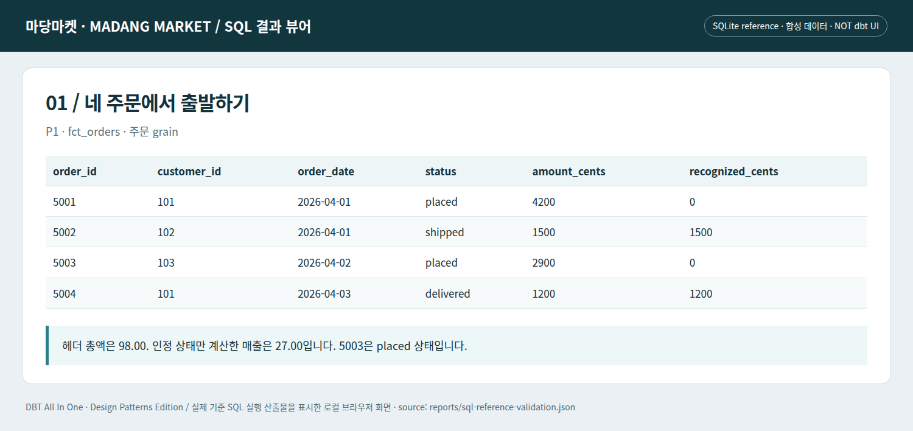

*실제 로컬 SQL 결과 뷰어의 Chromium 캡처. 합성 데이터이며 상용 dbt 화면이나 dbt 엔진 실행 증거가 아니다.*

위 화면은 최종 기준 모델로 같은 P1을 조회해 앞으로 만들 결과를 미리 보여 준 것이다. 체크포인트 01 자체에는 `recognized_cents`가 없다. 그 컬럼을 언제 추가하는지는 J06에서 확인한다. **미리보기 결과와 현재 작성한 파일의 범위**를 구별한다.

<a id="book-journey-02-first-query-md--이번-장의-완료-조건"></a>

### 이번 장의 완료 조건

source의 논리 이름과 물리 위치가 다르다는 점, 첫 모델의 한 행이 P1에서 주문 한 건이라는 점, 원천이 누적되면 이 가정이 깨진다는 점을 설명한다. 다음 장에서는 이 첫 모델을 계속 덧대지 않고 staging 두 모델로 교체한다. 삭제한 파일도 체크포인트 간 diff에 표시된다.

---

[이전 장](#book-journey-01-setup-md) · [다음 장](#book-journey-03-staging-md) · [전체 안내](README.md)

---

<a id="book-journey-03-staging-md"></a>

장별 원고: [journey/03-staging.md](journey/03-staging.md)

<a id="book-journey-03-staging-md--j03--전달-중복과-업무-최신-상태를-두-단계로-분리하기"></a>

## J03 · 전달 중복과 업무 최신 상태를 두 단계로 분리하기

P2에서 주문 5005의 같은 변경이 두 번 들어온다. ‘행이 두 개니까 주문 두 건’으로 계산하면 지표가 잘못된다. 또한 P3에는 5003의 오래된 v1이 늦게 재전송된다. 수신 시각이 늦다는 이유로 최신 업무 상태를 과거로 되돌려서는 안 된다.

<a id="book-journey-03-staging-md--1단계-전달-중복을-없앤다"></a>

### 1단계: 전달 중복을 없앤다

`change_id`는 하나의 업무 변경을 식별하고 `ingestion_id`는 수신을 식별한다. 이 예제는 같은 change_id의 내용은 동일하다는 원천 계약을 가정한다. 같은 키인데 내용이 다르면 별도의 무결성 오류로 격리해야 하며, 단순히 마지막 수신을 고르는 것만으로 정합성이 보장되지 않는다.

```sql
-- 변경 이벤트 중복 제거: 재전송은 ingestion_id만 새로 생긴다.
with ranked as (
 select *, row_number() over (partition by change_id order by ingestion_id desc) as delivery_rank
 from {{ source('shop_raw', 'order_changes') }}
)
select change_id, order_id, customer_id, order_date, lower(trim(status)) as status,
       amount_cents, source_seq, op, ingestion_id, ingested_at
from ranked where delivery_rank = 1
```

<a id="book-journey-03-staging-md--2단계-주문별-최신-상태를-만든다"></a>

### 2단계: 주문별 최신 상태를 만든다

업무 순서인 `source_seq`를 먼저 비교한다. 이 번호는 주문별로 순서를 표현한다고 가정하며, 서로 다른 주문 사이의 전역 순서로 해석하지 않는다. 최신 행을 고른 **다음** 삭제 표식을 판단한다. 삭제 행을 먼저 제거하면 직전 정상 행이 최신으로 남아 삭제된 주문이 부활한다.

```sql
-- 삭제를 먼저 거르면 과거 행이 되살아난다. 최신 행 선택 후 삭제를 적용한다.
with ranked as (
 select *, row_number() over (partition by order_id order by source_seq desc, ingestion_id desc) as version_rank
 from {{ ref('stg_order_changes') }}
)
select order_id, customer_id, order_date, status, amount_cents, source_seq
from ranked where version_rank = 1 and op <> 'D'
```
```bash
# 저장소 루트에서 실행 — Python 표준 라이브러리 / SQLite 기준 실행
python lab/run_stage.py --stage 2
```

완전한 해당 단계 소스와 직전 단계 대비 `changes.diff`는 `lab/checkpoints/`에 있다. dbt 실행 명령과 검증 경계는 [실습 안내](#book-lab-readme-md)를 참고한다.


*실제 로컬 SQL 결과 뷰어의 Chromium 캡처. 합성 데이터이며 상용 dbt 화면이나 dbt 엔진 실행 증거가 아니다.*

스크린샷은 P2의 전달 중복을 보여주지만 체크포인트 02의 기본 입력은 P1이다. P2까지 포함한 결과는 `python lab/run_reference.py --phase 2`로 확인한다. 코드 단계와 데이터 단계를 독립적으로 바꾸는 훈련이다.

<a id="book-journey-03-staging-md--다음-변경을-예상한다"></a>

### 다음 변경을 예상한다

현재 상태에서 unique(order_id)가 통과하더라도 과거 이력이 보존되는 것은 아니다. 원천 변경 기록은 남겨 두고 현재 상태 투영을 별도로 만든다. 과거 질문은 J09에서 다룬다. staging에서 취소 주문을 버리지도 않는다. 취소는 잘못된 데이터가 아니라 정상적인 업무 상태이며 인정 매출 계산에서 제외할 대상이다.

---

[이전 장](#book-journey-02-first-query-md) · [다음 장](#book-journey-04-grain-md) · [전체 안내](README.md)

---

<a id="book-journey-04-grain-md"></a>

장별 원고: [journey/04-grain.md](journey/04-grain.md)

<a id="book-journey-04-grain-md--j04--테이블의-한-행-조인으로-매출이-부풀어-오르는-순간"></a>

## J04 · 테이블의 한 행: 조인으로 매출이 부풀어 오르는 순간

주문과 주문 상세를 결합하면 상품별 분석이 쉬워진다. 그러나 헤더의 주문 금액을 상세 수만큼 복제한 뒤 합산하면 SQL은 성공하면서 숫자는 틀린다. grain은 주석에 적는 장식이 아니라 조인과 집계의 계약이다.

<a id="book-journey-04-grain-md--먼저-두-모델의-단위를-선언한다"></a>

### 먼저 두 모델의 단위를 선언한다

`fct_orders`는 정상 현재 주문 한 건, `fct_order_lines`는 정상 현재 주문의 상세 한 건이다. 주문 5003은 18.00과 11.00의 두 상세를 갖는다. 상세 금액 합은 29.00이지만 주문 금액 29.00을 두 상세에 붙여 더하면 58.00이 된다.


```sql
-- 실패 반례: 헤더 금액이 상세 개수만큼 복제된다.
select sum(o.amount_cents)
from {{ ref('fct_orders') }} o
join {{ ref('fct_order_lines') }} l on o.order_id = l.order_id
```

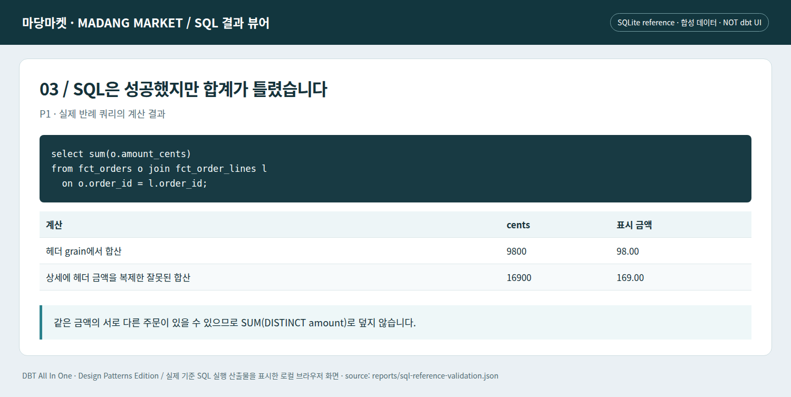

*실제 로컬 SQL 결과 뷰어의 Chromium 캡처. 합성 데이터이며 상용 dbt 화면이나 dbt 엔진 실행 증거가 아니다.*

P1 전체를 대상으로 실행하면 정상 헤더 합은 9800, 잘못된 합은 16900이다. `SUM(DISTINCT amount_cents)`로 덮으면 우연히 같은 금액의 다른 주문까지 하나로 합쳐질 수 있다. 중복 제거의 기준은 금액이 아니라 업무 키다.

<a id="book-journey-04-grain-md--상세를-먼저-주문-grain으로-집계한다"></a>

### 상세를 먼저 주문 grain으로 집계한다

```sql
select order_id, sum(quantity * unit_price_cents) as line_amount_cents,
       count(*) as line_count
from {{ ref('stg_items_current') }} group by order_id
```

이 결과는 주문별 한 행이다. 이후 헤더와 1:1로 대사하고, 불일치한 주문은 숨기지 않고 격리한다. 상품 분석이 필요할 때는 상세 grain의 팩트를 유지한다. 분석 요구가 다르다고 모든 결과를 하나의 거대한 테이블로 합치지는 않는다.

```bash
# 저장소 루트에서 실행 — Python 표준 라이브러리 / SQLite 기준 실행
python lab/run_stage.py --stage 3
```

완전한 해당 단계 소스와 직전 단계 대비 `changes.diff`는 `lab/checkpoints/`에 있다. dbt 실행 명령과 검증 경계는 [실습 안내](#book-lab-readme-md)를 참고한다.

<a id="book-journey-04-grain-md--연습과-해설"></a>

### 연습과 해설

고객 하나에 주문 세 건, 이벤트 열 건이 있다. 둘을 고객 ID로 바로 연결하면 몇 행이 될 수 있는가? 같은 고객 안에서 3×10=30행이 될 수 있다. 주문 지표와 이벤트 지표를 각각 필요한 고객·기간 grain으로 집계한 뒤 연결해야 한다. 같은 문제는 J12의 구독 지표에서도 다시 나타난다.

---

[이전 장](#book-journey-03-staging-md) · [다음 장](#book-journey-05-layers-md) · [전체 안내](README.md)

---

<a id="book-journey-05-layers-md"></a>

장별 원고: [journey/05-layers.md](journey/05-layers.md)

<a id="book-journey-05-layers-md--j05--메달리온을-실제-관리-규칙으로-바꾸기"></a>

## J05 · 메달리온을 실제 관리 규칙으로 바꾸기

메달리온은 Bronze·Silver·Gold라는 품질 단계를 설명하는 설계 패턴이다. Databricks 공식 문서에서 체계적으로 설명하지만, 모든 데이터웨어하우스가 반드시 이 이름을 써야 하는 강제 규격은 아니다. 이 책은 최초 발명자나 최초 발표 연도를 확인 없이 단정하지 않는다. [S01](#book-references-readme-md--s01)

마당마켓은 이미 raw와 staging을 만들었다. 이제 각 구역의 책임을 적는다. 이름에 bronze를 붙이는 것보다 원본 재처리가 가능한지, 정상과 오류가 구별되는지, 마트의 지표 정의가 승인되었는지가 중요하다.


| 계층 | 마당마켓의 책임 | 넘기기 전에 확인할 것 |
| --- | --- | --- |
| L0 / l0_cus | 변경 원본·수신 식별자 보존 | 누락 범위와 적재 배치 추적 |
| L1 / l1_cus | 타입·상태·중복·최신 상태 표준화 | 키와 업무 순서, 삭제 적용 |
| L2 / l2_cus | 고객·상세 통합, 품질 판정, 이력 구간 | 대사·참조·시간 구간 |
| L3 / l3_cus | 팩트·차원·소비 지표 | grain, 업무 의미, 공개 계약 |

L1과 L2를 모두 Silver의 역할로 설명하는 것은 이 책의 선택이다. L1=Bronze, L2=Silver, L3=Gold가 모든 조직의 정답이라고 외우지 않는다. 숫자는 조직의 분류이고 색은 품질 책임이므로 실제 역할을 보고 매핑한다.

<a id="book-journey-05-layers-md--계층을-더-만들면-자동으로-안전해지는가"></a>

### 계층을 더 만들면 자동으로 안전해지는가

아니다. 같은 내용을 여섯 번 복사하면 저장·운영 비용만 커질 수 있다. 원본 보존, 정제, 통합, 소비라는 변화가 없는 구역은 합쳐도 된다. 반대로 원천 접근 권한과 공개 권한이 다르면 물리 분리가 필요할 수 있다. 논리 폴더, 데이터베이스 스키마, 보안 경계는 서로 다른 차원이다.

<a id="book-journey-05-layers-md--운영-규칙까지-함께-적는다"></a>

### 운영 규칙까지 함께 적는다

각 계층에는 소유자, 입력 계약, 실패 처리, 보존 기간, 재처리 범위, 쓰기 권한이 있어야 한다. `governance/layer-policy.yml`에 예를 넣었다. 이는 관리 문서이며 dbt에 자동 적용되는 magic 설정이 아니다. 실제 강제는 테스트·권한·오케스트레이터·실행 래퍼로 별도 구현한다.

원본에 개인정보가 포함된 경우 ‘원본 불변’이라는 이유로 무기한 보존해서는 안 된다. 최소 보존, 삭제 요청, 복제본 처리 등은 별도로 검토한다. 교재는 실제 법률 준수 인증이나 개인정보 처리 지침을 대신하지 않는다.

다른 아키텍처와의 비교는 [P00](#book-patterns-00-pattern-map-md)부터 시작한다. 품질 구역을 유지한 채 허브앤스포크 통합이나 카파식 처리 흐름을 결합할 수도 있다.

---

[이전 장](#book-journey-04-grain-md) · [다음 장](#book-journey-06-marts-md) · [전체 안내](README.md)

---

<a id="book-journey-06-marts-md"></a>

장별 원고: [journey/06-marts.md](journey/06-marts.md)

<a id="book-journey-06-marts-md--j06--첫-매출-마트-업무-정의를-코드와-테스트에-고정하기"></a>

## J06 · 첫 매출 마트: 업무 정의를 코드와 테스트에 고정하기

담당자가 원하는 것은 주문 헤더 금액 총합이 아니라 ‘인정 매출’이다. 우선 어떤 상태를 포함할지 합의한다. 이 예제는 paid·shipped·delivered를 포함하고 placed·cancelled는 0으로 계산한다. 취소 주문 자체를 없애지 않으므로 주문 수와 매출을 독립적으로 설명할 수 있다.

<a id="book-journey-06-marts-md--주문별-인정-금액을-한-곳에서-정의한다"></a>

### 주문별 인정 금액을 한 곳에서 정의한다

```sql
select order_id, customer_id, order_date, status, amount_cents,
       case when status in ('paid','shipped','delivered') then amount_cents else 0 end as recognized_cents
from {{ ref('int_orders_valid') }}
```

이 모델은 이미 품질을 통과한 입력만 읽는다. 고객이 없거나 상세 합계가 틀린 행은 다른 경로에 남아 있다. WHERE로 그 행을 버렸다는 사실을 감추지 않고 품질 요약에서 정상·격리 행을 대사한다.

<a id="book-journey-06-marts-md--일별-마트로-집계한다"></a>

### 일별 마트로 집계한다

```sql
select order_date, count(*) as order_count, sum(recognized_cents) as recognized_cents
from {{ ref('fct_orders') }} group by order_date
```
```bash
# 저장소 루트에서 실행 — Python 표준 라이브러리 / SQLite 기준 실행
python lab/run_stage.py --stage 4
```

완전한 해당 단계 소스와 직전 단계 대비 `changes.diff`는 `lab/checkpoints/`에 있다. dbt 실행 명령과 검증 경계는 [실습 안내](#book-lab-readme-md)를 참고한다.

P1 인정 매출 27.00은 shipped 주문 5002의 15.00과 delivered 주문 5004의 12.00이다. 5001과 5003은 placed이므로 합계에 포함되지 않는다. 숫자를 바꾸기 전에 상태와 원천을 추적하는 습관을 만든다.

<a id="book-journey-06-marts-md--테스트를-세-층으로-나눈다"></a>

### 테스트를 세 층으로 나눈다

행 키의 유일성, 헤더와 상세 대사, 일별 마트와 주문 팩트의 합계 대사는 서로 다른 검사다. 하나가 통과했다고 나머지가 맞다는 보장은 없다. `schema.yml`의 generic tests와 `tests/order_line_reconciliation.sql`, 기준 실행기의 예상 지표를 함께 본다.

```bash
python lab/run_reference.py --verify --output reports/sql-reference-validation.json
```

테스트에 넣은 27.00은 이 작은 고정 fixture의 정답이다. 운영 매출을 매일 27.00과 비교하라는 뜻이 아니다. 운영에서는 원천 완전성, 전일 대비 변화, 허용 오차와 대사 기준을 업무에 맞게 정의한다.

<a id="book-journey-06-marts-md--문서도-결과의-일부다"></a>

### 문서도 결과의 일부다

설명에는 grain, 포함 상태, 통화 단위, 취소·환불 정책, 기준 시각을 적는다. 이 실습은 부분 환불·다중 통화·세금 계산을 구현하지 않는다. 이런 요구가 생기면 현재 금액 열 하나를 무리하게 확장하지 말고 별도 거래/환불 사실과 환산 시점의 설계를 검토한다. [P12](#book-patterns-12-fact-patterns-md)로 연결된다.

---

[이전 장](#book-journey-05-layers-md) · [다음 장](#book-journey-07-late-data-md) · [전체 안내](README.md)

---

<a id="book-journey-07-late-data-md"></a>

장별 원고: [journey/07-late-data.md](journey/07-late-data.md)

<a id="book-journey-07-late-data-md--j07--지난-날짜의-주문이-오늘-도착했다"></a>

## J07 · 지난 날짜의 주문이 오늘 도착했다

P2에는 4월 1일 주문 5005가 뒤늦게 도착한다. 이미 4월 3일까지 계산했다고 해서 과거 날짜를 보지 않으면 5005는 영구 누락된다. 지연 도착은 오류 행과 다르다. 데이터가 늦었을 뿐 유효한 주문일 수 있다.

<a id="book-journey-07-late-data-md--두-시계를-그린다"></a>

### 두 시계를 그린다


`order_date`는 업무 날짜다. `ingested_at`과 전달 식별자는 언제 관측했는지를 설명한다. 새로 도착한 데이터를 찾는 경계와 어느 업무 날짜를 다시 계산할지는 다른 문제다. 운영에서는 단순 시간보다 신뢰할 수 있는 원천 오프셋·배치 manifest 등으로 완전성을 관리할 수도 있다.

<a id="book-journey-07-late-data-md--잘못된-증분-필터"></a>

### 잘못된 증분 필터

```sql
-- P1의 최대 order_date 이후만 읽으면 P2의 주문 5005를 놓친다.
where order_date > (select max(order_date) from target_orders)
```

기준 검사는 이 반례를 실제로 실행해 5005가 선택되지 않음을 확인한다. ‘증분인데 빠르다’는 성능 결과보다 먼저 무엇을 빠뜨렸는지를 보아야 한다.

```bash
# 저장소 루트에서 실행 — Python 표준 라이브러리 / SQLite 기준 실행
python lab/run_stage.py --stage 5
```

완전한 해당 단계 소스와 직전 단계 대비 `changes.diff`는 `lab/checkpoints/`에 있다. dbt 실행 명령과 검증 경계는 [실습 안내](#book-lab-readme-md)를 참고한다.
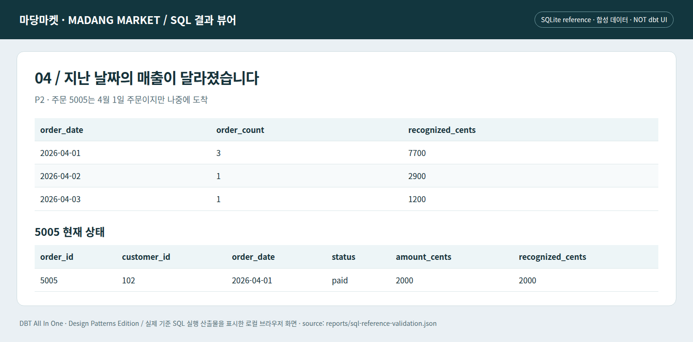

*실제 로컬 SQL 결과 뷰어의 Chromium 캡처. 합성 데이터이며 상용 dbt 화면이나 dbt 엔진 실행 증거가 아니다.*

<a id="book-journey-07-late-data-md--2700에서-11800으로-바뀐-이유"></a>

### 27.00에서 118.00으로 바뀐 이유

P2에서는 5001의 42.00과 5003의 29.00이 인정 상태로 바뀌고, 늦은 주문 5005의 20.00이 추가된다. 따라서 27.00 + 42.00 + 29.00 + 20.00 = 118.00이다. 5005가 두 번 수신되었다고 20.00을 두 번 더하지 않는다.

<a id="book-journey-07-late-data-md--lookback-창의-한계"></a>

### lookback 창의 한계

최근 며칠을 다시 읽는 방식은 실용적일 수 있지만 그 창보다 늦은 정정을 자동으로 해결하지는 못한다. 허용 지연 분포, 최장 정정 기간, 별도 backfill 경로가 필요하다. 실습은 모든 원천을 작은 파일로 보존하기 때문에 완전 재계산 기준선을 만들 수 있다. 대규모 환경에서는 그 비용과 영향 키 탐색을 별도로 설계한다. [P15](#book-patterns-15-incremental-and-replay-md)

---

[이전 장](#book-journey-06-marts-md) · [다음 장](#book-journey-08-correction-delete-md) · [전체 안내](README.md)

---

<a id="book-journey-08-correction-delete-md"></a>

장별 원고: [journey/08-correction-delete.md](journey/08-correction-delete.md)

<a id="book-journey-08-correction-delete-md--j08--정정취소삭제를-같은-처리로-뭉개지-않기"></a>

## J08 · 정정·취소·삭제를 같은 처리로 뭉개지 않기

P3에서 주문 5003은 29.00에서 33.00으로 정정된다. 주문 5002는 취소된다. P4에서는 5004의 삭제 표식이 도착한다. 세 사건은 모두 ‘변경’이지만 결과에 반영하는 방식은 다르다.

<a id="book-journey-08-correction-delete-md--p3의-매출을-설명한다"></a>

### P3의 매출을 설명한다

118.00에서 5003의 정정 차이 4.00을 더하고, 5002의 취소 금액 15.00을 빼면 107.00이다. 취소 주문은 현재 주문 집합에 남아 있지만 인정 금액이 0이다. 정정은 기존 주문의 최신 값을 교체한다.


*실제 로컬 SQL 결과 뷰어의 Chromium 캡처. 합성 데이터이며 상용 dbt 화면이나 dbt 엔진 실행 증거가 아니다.*

<a id="book-journey-08-correction-delete-md--p4의-삭제-표식"></a>

### P4의 삭제 표식

최신 상태가 D인 5004는 현재 주문에서 빠진다. 이전 12.00을 빼므로 인정 매출은 95.00이 된다. P4에는 고객이 아직 없는 주문 5006과 음수 금액의 5007도 도착하지만, 둘은 정상 결과에 들어가지 않는다.


*실제 로컬 SQL 결과 뷰어의 Chromium 캡처. 합성 데이터이며 상용 dbt 화면이나 dbt 엔진 실행 증거가 아니다.*
```bash
# 저장소 루트에서 실행 — Python 표준 라이브러리 / SQLite 기준 실행
python lab/run_stage.py --stage 6
```

완전한 해당 단계 소스와 직전 단계 대비 `changes.diff`는 `lab/checkpoints/`에 있다. dbt 실행 명령과 검증 경계는 [실습 안내](#book-lab-readme-md)를 참고한다.

<a id="book-journey-08-correction-delete-md--삭제와-취소를-구별하는-이유"></a>

### 삭제와 취소를 구별하는 이유

취소는 업무 상태를 보존하면서 특정 지표에서 제외하는 일이다. 삭제는 현재 투영에서 레코드를 제거하는 정책이다. 원천 기록 보존과 개인정보 삭제는 또 다른 문제다. 하나의 D 표식으로 분석 제외·물리 삭제·모든 백업 삭제를 동일하게 처리했다고 말하지 않는다.

<a id="book-journey-08-correction-delete-md--재처리-범위를-잘못-잡으면"></a>

### 재처리 범위를 잘못 잡으면

5003의 최신 변경만 원천에 남기면 그 이전 상태를 재현하기 어렵다. 반대로 오래된 v1이 마지막으로 수신되었다고 현재 값을 29.00으로 되돌리면 업무 순서가 깨진다. 변경 식별자와 원천 버전, 수신 시각을 분리한 이유가 여기서 드러난다.

실습에서는 원천 파일과 코드 버전이 고정되어 있기 때문에 언제든 P1~P5를 다시 만들 수 있다. 운영에서는 원천 보존 범위·참조 데이터 버전·코드 해시를 묶어야 같은 재현성을 기대할 수 있다.

---

[이전 장](#book-journey-07-late-data-md) · [다음 장](#book-journey-09-history-md) · [전체 안내](README.md)

---

<a id="book-journey-09-history-md"></a>

장별 원고: [journey/09-history.md](journey/09-history.md)

<a id="book-journey-09-history-md--j09--오늘의-고객과-주문-당시의-고객은-다르다"></a>

## J09 · 오늘의 고객과 주문 당시의 고객은 다르다

이 장은 P3로 돌아가 시간 축을 자세히 본다. 고객 103은 4월 3일부터 VIP다. 주문 5003의 날짜는 4월 2일이다. 오늘의 고객 차원을 단순 조인하면 과거 주문이 VIP 매출로 다시 분류된다. 그것이 원하는 분석인지부터 결정해야 한다.

<a id="book-journey-09-history-md--유효시간-구간을-만든다"></a>

### 유효시간 구간을 만든다

```sql
-- 이미 관측한 원천의 업무 유효시간으로 구간을 만든 교육용 SCD2. dbt snapshot 실행이 아니다.
select customer_id, segment, effective_from as valid_from,
       lead(effective_from) over (partition by customer_id order by effective_from, source_seq) as valid_to
from {{ source('shop_raw', 'customer_changes') }}
```

이 구현은 원천이 제공한 `effective_from`을 사용한다. dbt snapshot을 실행한 결과가 아니다. 동일 유효시점 충돌, 고객 삭제·재활성화, 같은 속성의 중복 변경을 모두 해결한 완전한 SCD 프레임워크도 아니다. 이 fixture는 충돌 없는 유효시점이라는 계약으로 구간과 시점 조인을 학습한다.

```sql
select f.*, d.segment as segment_at_order
from {{ ref('fct_orders') }} f
left join {{ ref('dim_customer_history') }} d
 on f.customer_id = d.customer_id
 and (f.order_date || ' 00:00:00') >= d.valid_from
 and ((f.order_date || ' 00:00:00') < d.valid_to or d.valid_to is null)
```


*실제 로컬 SQL 결과 뷰어의 Chromium 캡처. 합성 데이터이며 상용 dbt 화면이나 dbt 엔진 실행 증거가 아니다.*
```bash
# 저장소 루트에서 실행 — Python 표준 라이브러리 / SQLite 기준 실행
python lab/run_stage.py --stage 7
```

완전한 해당 단계 소스와 직전 단계 대비 `changes.diff`는 `lab/checkpoints/`에 있다. dbt 실행 명령과 검증 경계는 [실습 안내](#book-lab-readme-md)를 참고한다.

<a id="book-journey-09-history-md--경계에서-두-행을-만나지-않도록-한다"></a>

### 경계에서 두 행을 만나지 않도록 한다

조건은 `valid_from <= t < valid_to`인 반열린 구간이다. 종료 시각에도 등호를 붙이면 다음 구간의 시작점과 겹쳐 주문 한 건이 두 차원 행에 연결될 수 있다. 현재 구간의 valid_to가 NULL이면 끝이 열려 있다고 해석한다.

주문 데이터가 날짜만 보유하므로 이 책은 자정 문자열로 비교한다. 실제 서비스에서 같은 날 등급이 바뀐다면 주문 timestamp와 시간대·유효시각의 정밀도가 필요하다. 날짜 예제의 편의를 실제 시간 모델의 정답으로 확장하지 않는다.

<a id="book-journey-09-history-md--snapshot과-cdc의-차이"></a>

### snapshot과 CDC의 차이

snapshot은 관측한 상태 변화를 이력화한다. 두 snapshot 실행 사이에 변경이 여러 번 발생했다가 되돌아오면 그 모든 중간 사건이 보존된다고 보장할 수 없다. CDC 원천의 유효시간 이력과 관측시점 snapshot은 질문이 다르다. [S15](#book-references-readme-md--s15)

더 어려운 ‘당시에 알고 있던 사실’과 ‘나중에 정정된 당시 사실’의 차이는 [P13의 이중 시간](#book-patterns-13-history-and-temporal-md)에서 다룬다. 고객의 현재 VIP와 주문 당시 standard를 동시에 맞게 제공할 수 있어야 한다.

---

[이전 장](#book-journey-08-correction-delete-md) · [다음 장](#book-journey-10-quarantine-repair-md) · [전체 안내](README.md)

---

<a id="book-journey-10-quarantine-repair-md"></a>

장별 원고: [journey/10-quarantine-repair.md](journey/10-quarantine-repair.md)

<a id="book-journey-10-quarantine-repair-md--j10--격리는-끝이-아니라-복구를-위한-대기-상태다"></a>

## J10 · 격리는 끝이 아니라 복구를 위한 대기 상태다

P4의 주문 5006은 고객 104를 참조하지만 고객 데이터는 아직 도착하지 않았다. 주문 5007은 금액이 음수다. INNER JOIN으로 고객 없는 주문을 버리면 결과가 깔끔해 보이지만, 운영자는 무엇이 사라졌는지 알 수 없다.

<a id="book-journey-10-quarantine-repair-md--이유를-계산하는-모델을-먼저-만든다"></a>

### 이유를 계산하는 모델을 먼저 만든다

```sql
select o.*, c.segment, t.line_amount_cents,
 case when o.amount_cents is null or o.amount_cents < 0 then 'invalid_amount'
      when o.status is null or o.status not in ('placed','paid','shipped','delivered','cancelled') then 'invalid_status'
      when c.customer_id is null then 'missing_customer'
      when t.order_id is null then 'missing_items'
      when o.amount_cents <> t.line_amount_cents then 'header_line_mismatch'
      else 'accepted' end as quality_status
from {{ ref('stg_orders_current') }} o
left join {{ ref('stg_customers_current') }} c on o.customer_id = c.customer_id
left join {{ ref('int_order_totals') }} t on o.order_id = t.order_id
```

이 예제의 CASE는 우선순위에 따라 대표 오류 한 가지를 돌려준다. 하나의 행에 여러 오류가 있을 수 있는 운영 시스템이라면 오류 배열이나 별도 오류 상세 테이블을 검토한다. ‘대표 사유 한 개’와 ‘모든 오류 탐지’를 같다고 설명하지 않는다.

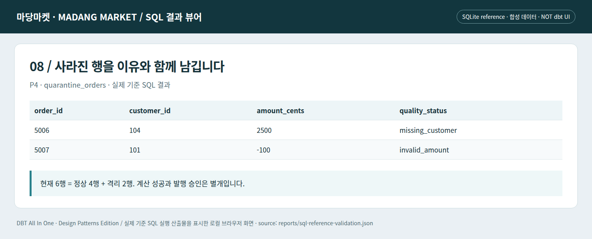

*실제 로컬 SQL 결과 뷰어의 Chromium 캡처. 합성 데이터이며 상용 dbt 화면이나 dbt 엔진 실행 증거가 아니다.*

현재 주문 6행 = 정상 4행 + 격리 2행이다. 이 분모는 최신 삭제 표식을 적용한 현재 투영이다. 원천 수신 행 수와 직접 비교하면 재전송·이력 행 때문에 맞지 않는다. 원천 완전성 대사와 현재 상태 대사를 분리한다.

<a id="book-journey-10-quarantine-repair-md--p5에서-되돌아오는-두-주문"></a>

### P5에서 되돌아오는 두 주문

고객 104가 도착하자 주문 5006은 주문 데이터 자체가 바뀌지 않았는데도 정상 상태가 된다. 주문 5007은 원천 금액이 10.00으로 정정되어 정상 경로로 돌아온다. 매출 95.00에 25.00과 10.00이 더해져 130.00이 된다.

```bash
# 저장소 루트에서 실행 — Python 표준 라이브러리 / SQLite 기준 실행
python lab/run_stage.py --stage 8
```

완전한 해당 단계 소스와 직전 단계 대비 `changes.diff`는 `lab/checkpoints/`에 있다. dbt 실행 명령과 검증 경계는 [실습 안내](#book-lab-readme-md)를 참고한다.
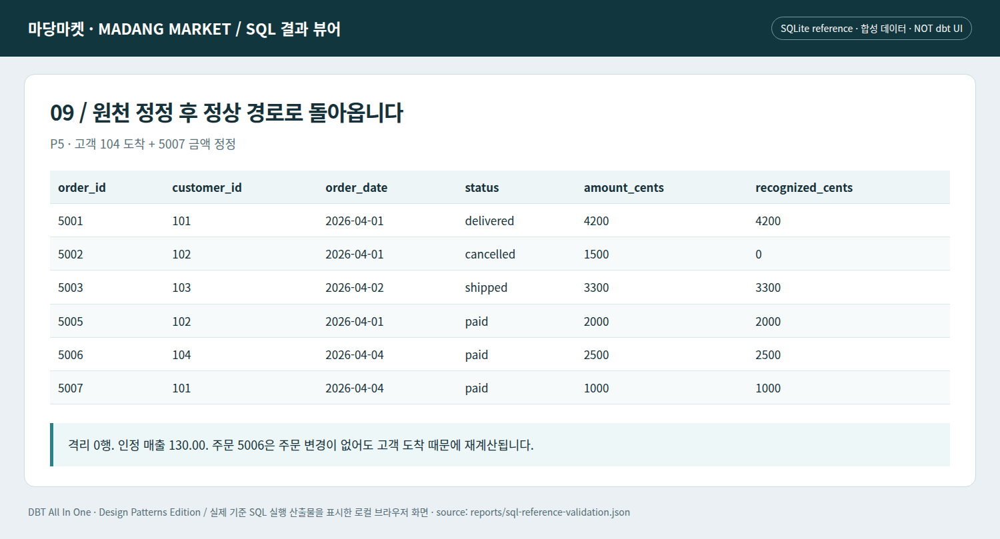

*실제 로컬 SQL 결과 뷰어의 Chromium 캡처. 합성 데이터이며 상용 dbt 화면이나 dbt 엔진 실행 증거가 아니다.*

<a id="book-journey-10-quarantine-repair-md--계산-성공과-발행-성공을-구별한다"></a>

### 계산 성공과 발행 성공을 구별한다

모델 SQL이 성공했다고 모든 데이터를 공개해야 하는 것은 아니다. 이 책의 정책 예시는 격리 행이 있으면 발행 승인을 보류한다. 부분 공개가 허용되는 업무라면 누락 범위·영향 금액·공개 시각을 함께 표시해야 한다. 무조건 실패나 무조건 통과가 정답인 것은 아니고 정책을 명시해야 한다.

격리 테이블에도 민감정보가 들어갈 수 있다. 정상 마트에서 제외했다는 이유로 더 넓은 권한을 주지 않는다. 접근·보존·복구 소유자까지 함께 설계한다.

---

[이전 장](#book-journey-09-history-md) · [다음 장](#book-journey-11-incremental-md) · [전체 안내](README.md)

---

<a id="book-journey-11-incremental-md"></a>

장별 원고: [journey/11-incremental.md](journey/11-incremental.md)

<a id="book-journey-11-incremental-md--j11--증분-최적화의-출발점은-전체-계산과의-동등성이다"></a>

## J11 · 증분 최적화의 출발점은 전체 계산과의 동등성이다

전체를 다시 계산하는 모델은 이해하기 쉽지만 커지면 비용이 부담될 수 있다. 그렇다고 처음부터 증분 필터를 붙이면 정정·삭제·차원 변경이 누락될 수 있다. 기준 결과를 만든 뒤 **영향 키 탐색과 부분 갱신이 같은 결과를 내는지** 확인한다.


<a id="book-journey-11-incremental-md--변경-주문만-찾으면-부족하다"></a>

### 변경 주문만 찾으면 부족하다

영향 키는 이번 주문 변경의 주문 ID, 상세 변경의 주문 ID, 변경 고객을 참조하는 주문 ID의 합집합이다. P5의 5006이 마지막 항목의 반례다. 고객이 새로 도착했기 때문에 주문 변경이 없어도 품질 판단이 달라진다.

<a id="book-journey-11-incremental-md--기준-구현의-범위를-정확히-이해한다"></a>

### 기준 구현의 범위를 정확히 이해한다

`run_reference.py`는 작은 SQLite에서 현재 staging·통합 모델을 재생성한 뒤 영향 키에 해당하는 주문 결과를 재평가하여 `incremental_orders`를 교체한다. 이후 완전 재계산의 fct_orders와 행 단위로 비교한다. 모든 upstream까지 증분화하거나 분산 트랜잭션을 구현한 것이 아니다. 이번 검사의 목적은 영향 키·삭제·재시도에 대한 결과 동등성이다.

```bash
python lab/run_reference.py --verify --output reports/sql-reference-validation.json
```

같은 배치를 두 번 적용해도 행이 늘지 않아야 한다. P4의 삭제된 5004는 이전 대상에서 제거되어야 하고, P5의 5006은 정상 대상에 들어와야 한다. 단순히 최종 합계가 같아도 주문별 값이 서로 바뀔 수 있으므로 정렬한 행 집합을 비교한다.

```bash
# 저장소 루트에서 실행 — Python 표준 라이브러리 / SQLite 기준 실행
python lab/run_stage.py --stage 9
```

완전한 해당 단계 소스와 직전 단계 대비 `changes.diff`는 `lab/checkpoints/`에 있다. dbt 실행 명령과 검증 경계는 [실습 안내](#book-lab-readme-md)를 참고한다.


*실제 로컬 SQL 결과 뷰어의 Chromium 캡처. 합성 데이터이며 상용 dbt 화면이나 dbt 엔진 실행 증거가 아니다.*

<a id="book-journey-11-incremental-md--실제-dbt-증분-전략으로-옮길-때"></a>

### 실제 dbt 증분 전략으로 옮길 때

append, merge, delete+insert, insert_overwrite, microbatch는 데이터의 변경 방식과 어댑터 지원에 맞춰 선택한다. 지원 표는 실행 엔진과 어댑터 버전별로 확인해야 한다. [S14](#book-references-readme-md--s14)

이 실습의 dbt 프로젝트는 table materialization을 유지한다. SQLite 부분 갱신 검사를 통과했다고 dbt의 MERGE가 실행되었다고 말하지 않는다. 특히 삭제 대상이 소스 결과에서 사라지는 경우, 일반적인 갱신·삽입만으로 기존 대상 행이 자동 삭제되지 않을 수 있다. 삭제 처리와 트랜잭션 경계를 별도로 검토한다.

<a id="book-journey-11-incremental-md--성능-검토의-순서"></a>

### 성능 검토의 순서

정답을 고정하고, 실행 계획과 스캔량을 측정하고, 병목이 실제로 있는지 확인한 뒤 부분 재처리 범위를 줄인다. ‘증분이므로 N배 빠르다’는 수치는 이 책에 만들지 않았다. 파일 수·상태 크기·키 분포·동시 실행에 따라 결과가 달라진다.

---

[이전 장](#book-journey-10-quarantine-repair-md) · [다음 장](#book-journey-12-three-domains-md) · [전체 안내](README.md)

---

<a id="book-journey-12-three-domains-md"></a>

장별 원고: [journey/12-three-domains.md](journey/12-three-domains.md)

<a id="book-journey-12-three-domains-md--j12--주문웹-방문구독을-하나의-상점에-연결하기"></a>

## J12 · 주문·웹 방문·구독을 하나의 상점에 연결하기

마당마켓은 상품 주문 외에 웹사이트 방문 이벤트와 정기 구독을 기록한다. 같은 고객을 가리키더라도 세 데이터의 한 행은 다르다. 주문 한 건, 이벤트 한 번, 현재 구독 한 건을 원시 상태로 한꺼번에 조인하면 지표가 증폭된다.

<a id="book-journey-12-three-domains-md--웹-이벤트-이벤트-수와-활성-사용자-수"></a>

### 웹 이벤트: 이벤트 수와 활성 사용자 수

```sql
with ranked as (
 select *, row_number() over (partition by event_id order by ingestion_id desc) as delivery_rank
 from {{ source('shop_raw', 'events') }}
)
select event_id, customer_id, event_time, substr(event_time,1,10) as event_date, event_type
from ranked where delivery_rank = 1
```
```sql
select event_date, count(distinct customer_id) as active_users
from {{ ref('stg_events') }} group by event_date
```

이벤트의 재전송을 먼저 처리하고 날짜별 고유 사용자를 계산한다. 하루에 같은 사용자가 세 번 방문했다면 이벤트 수는 세 건이어도 DAU는 한 명이다. 여러 날짜의 DAU를 더한 값을 월간 고유 사용자라고 부르지 않는다. 일별 유일 집계는 월 전체의 유일 집계와 더해지는 성질이 다르다.

<a id="book-journey-12-three-domains-md--구독-현재-mrr과-실제-현금-수납"></a>

### 구독: 현재 MRR과 실제 현금 수납

```sql
-- 단일 통화·월간 요금만 있는 실습. MRR은 주문 매출과 합산하지 않는다.
select sum(case when status = 'active' then monthly_cents else 0 end) as mrr_cents
from {{ ref('stg_subscriptions_current') }}
```
```bash
# 저장소 루트에서 실행 — Python 표준 라이브러리 / SQLite 기준 실행
python lab/run_stage.py --stage 10
```

완전한 해당 단계 소스와 직전 단계 대비 `changes.diff`는 `lab/checkpoints/`에 있다. dbt 실행 명령과 검증 경계는 [실습 안내](#book-lab-readme-md)를 참고한다.

MRR은 이 예제에서 active 구독의 월 금액 합이다. trial과 cancelled는 제외한다. 청구서 수납액, 주문 매출, 기간별 수익 인식과 같지 않다. 일할 계산·연간 선결제·할인·환불은 추가 계약이 필요하다.

<a id="book-journey-12-three-domains-md--공통-고객-차원을-통해-연결한다"></a>

### 공통 고객 차원을 통해 연결한다

고객 ID가 같다고 해서 이벤트 원시 행과 주문 팩트를 직접 연결할 필요는 없다. 목적에 맞는 고객·기간 grain으로 먼저 각각 요약한 뒤 함께 제공한다. 공통 고객·날짜의 정의는 버스 매트릭스에 적는다. [P03](#book-patterns-03-kimball-bus-md)

같은 상점이라는 설정은 지표를 무리하게 하나로 합치려는 핑계가 아니다. 한 고객의 주문 매출, 활성 여부, MRR을 나란히 보여줄 수 있지만 서로 다른 통계량을 한 합계로 더해서는 안 된다. 지표마다 기준시점과 포함 조건을 남긴다.

<a id="book-journey-12-three-domains-md--다음-요구를-예상한다"></a>

### 다음 요구를 예상한다

다른 서비스의 고객 ID와 연결하려면 identity resolution이 필요하다. 숫자가 같다고 동일 인물이라고 가정하지 않는다. 도메인 팀이 분리되면 공통 고객 모델의 공개 계약과 버전 변경을 협의해야 한다. 이때 허브앤스포크, 버스, 메시의 적용 질문이 실제로 생긴다.

---

[이전 장](#book-journey-11-incremental-md) · [다음 장](#book-journey-13-architecture-alternatives-md) · [전체 안내](README.md)

---

<a id="book-journey-13-architecture-alternatives-md"></a>

장별 원고: [journey/13-architecture-alternatives.md](journey/13-architecture-alternatives.md)

<a id="book-journey-13-architecture-alternatives-md--j13--메달리온-말고-다른-설계를-선택해야-할-때"></a>

## J13 · 메달리온 말고 다른 설계를 선택해야 할 때

지금까지는 작은 배치형 상점으로 충분했다. 이번 장은 같은 마당마켓에 서로 다른 요구가 추가되었다고 가정해 설계를 갈라 본다. 모든 후보를 최종 구조에 집어넣지는 않는다.


<a id="book-journey-13-architecture-alternatives-md--여러-원천을-통합해야-한다"></a>

### 여러 원천을 통합해야 한다

오프라인 POS, 온라인몰, CRM이 각각 다른 고객 키를 갖는다면 중앙 정합 코어를 두는 허브앤스포크를 비교한다. 업무별 마트를 점진적으로 납품하면서 공통 고객·상품·날짜를 맞추려면 Kimball 버스 아키텍처의 적합 차원이 중요해진다. 중앙 통합 코어와 차원형 마트는 결합할 수 있다. [P02](#book-patterns-02-hub-and-spoke-md), [P03](#book-patterns-03-kimball-bus-md)

<a id="book-journey-13-architecture-alternatives-md--운영-모니터의-지연을-줄여야-한다"></a>

### 운영 모니터의 지연을 줄여야 한다

일별 보고가 아니라 거의 즉시 이상을 발견해야 한다면 스트림 처리가 후보가 된다. 배치·저지연 경로를 함께 운영하는 람다와, 보존 로그를 동일 처리 로직으로 재생하는 카파를 비교한다. 두 경로의 경계, 재생 시간, 상태 유지 비용을 따로 본다. dbt 스케줄을 짧게 설정했다고 곧바로 카파 아키텍처가 되는 것은 아니다. [P04](#book-patterns-04-lambda-md), [P05](#book-patterns-05-kappa-md)

<a id="book-journey-13-architecture-alternatives-md--원천과-이력이-계속-바뀐다"></a>

### 원천과 이력이 계속 바뀐다

원천 합병과 감사 요구가 커지면 Vault의 키·관계·속성 이력 분리나 Anchor Modeling의 속성별 시간 관리를 비교할 수 있다. 소비자의 쉬운 조회를 위해 별도 스타/와이드 마트를 제공하는 비용까지 고려한다. SQL 파일 개수가 늘었다는 사실만으로 확장성이 입증되지는 않는다. [P09](#book-patterns-09-data-vault-md), [P24](#book-patterns-24-anchor-modeling-md)

<a id="book-journey-13-architecture-alternatives-md--조직과-저장-계층의-문제가-생긴다"></a>

### 조직과 저장 계층의 문제가 생긴다

레이크하우스는 저장·테이블 관리·분석 접근의 구조를 다루고, 메시는 도메인 소유권과 제품 계약을 다룬다. 패브릭은 메타데이터·정책·접근의 통합을 지원하는 접근으로 설명한다. 이들은 동등한 크기의 상호 배타 선택지가 아니다. [P06](#book-patterns-06-lakehouse-md)~[P08](#book-patterns-08-data-fabric-and-federation-md)

<a id="book-journey-13-architecture-alternatives-md--별도-비교-실습"></a>

### 별도 비교 실습

```bash
python lab/run_comparisons.py --output reports/model-comparisons.json
```

비교 실습은 같은 데이터에서 스타/정규화 코어/와이드/Vault 축소/Anchor 축소 모델을 만든다. 이는 구조와 결과를 비교하는 소규모 SQL 예시다. 인증된 Vault 구현, 완전한 Anchor 생성기, 실제 메시·람다·카파 인프라 배포가 아니다. 단순 합계 일치가 설계 우월성을 뜻하지 않는다는 것을 함께 확인한다.

**마당마켓의 기본 선택은 여전히 배치 + 품질 계층 + 팩트/차원 + 명시적인 계약이다.** 더 복잡한 후보는 요구가 바뀔 때 재검토한다. 결정 이유를 ADR에 남기는 편이 유명한 패턴을 모두 쓰는 것보다 실용적이다.

---

[이전 장](#book-journey-12-three-domains-md) · [다음 장](#book-journey-14-configuration-md) · [전체 안내](README.md)

---

<a id="book-journey-14-configuration-md"></a>

장별 원고: [journey/14-configuration.md](journey/14-configuration.md)

<a id="book-journey-14-configuration-md--j14--이름소유권권한을-코드-밖에서도-관리하기"></a>

## J14 · 이름·소유권·권한을 코드 밖에서도 관리하기

상점 이름은 마당마켓이고 dbt 프로젝트 이름은 `madang_market`이다. 그러나 프로젝트 표시 이름, source 이름, 모델 이름, 스키마 이름은 각각 다른 식별자다. 이름 변경이 생겼다고 모든 논리 모델의 공개 이름을 한 번에 깨뜨릴 필요는 없다.

<a id="book-journey-14-configuration-md--논리-계층과-물리-위치를-분리한다"></a>

### 논리 계층과 물리 위치를 분리한다

`dbt_project.yml`의 raw_schema, schema_l1, schema_l2, schema_l3를 통해 물리 위치를 설정한다. SQL은 source/ref를 유지한다. 기본값은 l0_cus~l3_cus이고, 독자 로컬 개발 target은 book_dev다.

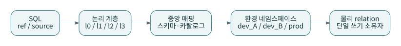

```yaml
name: madang_market
profile: madang_market
vars:
  raw_schema: l0_cus
  schema_l1: l1_cus
  schema_l2: l2_cus
  schema_l3: l3_cus
```

이 조각만 복사해 기존 프로젝트를 덮지 않는다. 완전한 파일은 `lab/dbt/dbt_project.yml`에 있다. 기본 dbt schema 생성 규칙은 target schema에 custom schema를 덧붙이므로 개발 모델은 예를 들어 `book_dev_l1_cus`에 배치된다. `+schema: l1_cus`라고 썼다고 반드시 그 이름만 생성되는 것은 아니다. [S16](#book-references-readme-md--s16)

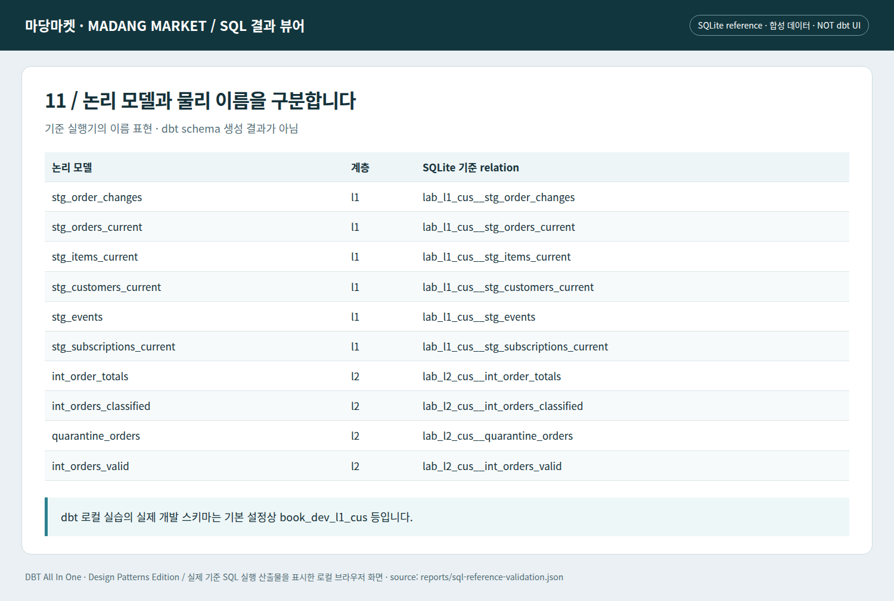

*실제 로컬 SQL 결과 뷰어의 Chromium 캡처. 합성 데이터이며 상용 dbt 화면이나 dbt 엔진 실행 증거가 아니다.*

<a id="book-journey-14-configuration-md--운영-환경의-기존-테이블만-허용한다면"></a>

### 운영 환경의 기존 테이블만 허용한다면

권한으로 신규 schema/table DDL을 제한하고, 사전 점검으로 존재 여부·컬럼·소유자를 확인해야 한다. 이 책의 table 실습을 그대로 실행하면 로컬 모델이 만들어진다. ‘생성 차단 var’를 임의로 선언하는 것만으로 dbt 표준 materialization이 모두 그 정책을 따르는 것은 아니다.

원천·계산·통합·로그의 책임을 나눈다. 컴포넌트는 값을 계산하고 통합 owner가 쓰기를 맡도록 설계할 수 있다. result_mode가 없는 전용 INSERT/UPDATE 입력은 명시적인 입력 메타데이터로 정규화하고, 표식 있는 입력과 혼합해도 연산이 분명해야 한다. 이는 [P18](#book-patterns-18-components-and-integration-md)의 별도 설계 예이며 기본 마당마켓 SQL이 구현한 운영 MERGE 프레임워크는 아니다.

<a id="book-journey-14-configuration-md--변경-요청-한-장으로-점검하기"></a>

### 변경 요청 한 장으로 점검하기

스키마 이름을 바꿀 때 source, model config, 외부 소비 SQL, 권한, 로그 relation, 문서, CI 환경을 함께 확인한다. 계층명만 대체했는데 selected graph 밖의 source 선언이 낡아 파싱이 실패할 수도 있다. 선택 실행은 전체 프로젝트 구문·참조 무결성을 자동으로 면제하는 의미가 아니다. [S17](#book-references-readme-md--s17)

---

[이전 장](#book-journey-13-architecture-alternatives-md) · [다음 장](#book-journey-15-release-md) · [전체 안내](README.md)

---

<a id="book-journey-15-release-md"></a>

장별 원고: [journey/15-release.md](journey/15-release.md)

<a id="book-journey-15-release-md--j15--검증발행복구까지-포함한-최종-상점"></a>

## J15 · 검증·발행·복구까지 포함한 최종 상점

모델 21개가 실행되는 것은 끝이 아니라 발행 후보가 만들어졌다는 뜻이다. 어떤 데이터 범위를 읽었고, 품질 검사를 통과했고, 소비자가 어느 버전을 읽는지 설명할 수 있어야 운영 가능한 데이터 제품에 가까워진다.


```bash
# 저장소 루트에서 실행 — Python 표준 라이브러리 / SQLite 기준 실행
python lab/run_stage.py --stage 11
```

완전한 해당 단계 소스와 직전 단계 대비 `changes.diff`는 `lab/checkpoints/`에 있다. dbt 실행 명령과 검증 경계는 [실습 안내](#book-lab-readme-md)를 참고한다.


*실제 로컬 SQL 결과 뷰어의 Chromium 캡처. 합성 데이터이며 상용 dbt 화면이나 dbt 엔진 실행 증거가 아니다.*

<a id="book-journey-15-release-md--후보를-만든-뒤-공개한다"></a>

### 후보를 만든 뒤 공개한다

새 결과를 후보 위치에 만들고, 계약·품질·대사를 수행한 후 읽기 포인터를 전환하는 blue-green식 발행을 검토할 수 있다. 모든 엔진이 동일한 원자적 rename/swap을 제공하는 것은 아니므로 실제 어댑터·카탈로그·소비 경로에서 시험한다. 이 책의 그림은 운영 전환 성공 로그가 아니다.

P4처럼 격리 데이터가 있으면, 교재 정책에서는 자동 공개를 보류한다. 기존 공개 버전이 더 오래되었더라도 신뢰 가능한 상태를 유지하는 선택이다. 신선도와 완전성 중 무엇을 우선할지는 업무에 따라 승인받아야 한다.

<a id="book-journey-15-release-md--관측-지표도-나누어-저장한다"></a>

### 관측 지표도 나누어 저장한다

입력 도착률, SQL 실행 성공, 정상·격리 행 수, 지표 대사, 공개된 버전과 시각, 외부 전달 결과는 서로 다른 신호다. SQL 성공 로그 하나로 이 모두를 대체하지 않는다. 실패한 run_id와 재시도 attempt_id를 구분하고, 로그 기록 실패가 본 처리 성공을 숨기지 않도록 별도 경로를 둔다.

<a id="book-journey-15-release-md--배포-전-검증-목록"></a>

### 배포 전 검증 목록

이번 배포에 사용한 코드 해시, 원천 단계/배치 식별자, dbt·어댑터 버전, 프로필 이름, manifest와 run_results, 테스트 결과를 함께 보관한다. 실제 dbt를 실행한 환경에서만 dbt 산출물을 생성했다고 기록한다. 기준 SQL 결과 파일은 `sql-reference-validation.json`이며 manifest.json인 척 이름을 바꾸지 않는다.

<a id="book-journey-15-release-md--되돌리기-전에-확인한다"></a>

### 되돌리기 전에 확인한다

코드를 되돌려도 데이터와 외부 부작용이 되돌아가는 것은 아니다. 이전 결과 버전, 재계산 가능 범위, 소비 캐시, 외부 전송의 멱등 키를 함께 검토한다. backfill은 날짜 범위를 지정한 재처리이며 무조건 전체 refresh와 같은 말이 아니다.

완전한 운영 체크리스트 예시는 [governance](#book-governance-readme-md), 장애별 판단은 [P20](#book-patterns-20-observability-and-performance-md), CI와 상태 관리는 [P19](#book-patterns-19-ci-cd-and-migration-md)로 이어진다.

---

[이전 장](#book-journey-14-configuration-md) · [다음 장](#book-journey-16-workbook-md) · [전체 안내](README.md)

---

<a id="book-journey-16-workbook-md"></a>

장별 원고: [journey/16-workbook.md](journey/16-workbook.md)

<a id="book-journey-16-workbook-md--j16--종합-실습과-해설-숫자와-설계를-함께-설명하기"></a>

## J16 · 종합 실습과 해설: 숫자와 설계를 함께 설명하기

이 장에서는 명령어를 기억했는지보다 **왜 그 결과가 나오는지**를 점검한다. 각 답에는 입력·grain·시간·정책 중 어떤 것이 달라졌는지를 함께 적는다.

<a id="book-journey-16-workbook-md--문제-1-주문-5003은-누구의-어떤-주문인가"></a>

### 문제 1. 주문 5003은 누구의 어떤 주문인가

P1에서 고객 103의 4월 2일 placed 주문이며 29.00이다. P2에서 shipped, P3에서 33.00으로 정정된다. P3의 현재 고객 등급은 VIP여도 주문 당시 등급은 standard다. 다른 fixture의 paid→cancelled 예제를 이 사건으로 혼동하지 않는다.

<a id="book-journey-16-workbook-md--문제-2-매출이-27--118--107--95--130으로-움직이는-이유"></a>

### 문제 2. 매출이 27 → 118 → 107 → 95 → 130으로 움직이는 이유

P2는 기존 주문 인정 상태 전환 71.00과 늦은 주문 20.00, P3는 5003 정정 +4.00과 5002 취소 −15.00, P4는 5004 삭제 −12.00, P5는 격리 복구 +35.00이다. 매출 변화와 원천 행 수의 변화는 일치하지 않는다. 재전송은 원천 수신 행을 늘려도 정상 주문을 늘리지 않는다.

<a id="book-journey-16-workbook-md--문제-3-왜-현재-주문-수와-원천-행-수가-다른가"></a>

### 문제 3. 왜 현재 주문 수와 원천 행 수가 다른가

원천은 변경과 전달을 기록하고 현재 투영은 주문별 최신 상태를 보여준다. 삭제 적용 후 현재 집합에서 정상과 격리를 나누므로 P4는 6=4+2다. 원천 수신 행 수를 같은 식의 분모로 넣으면 의미가 달라진다.

<a id="book-journey-16-workbook-md--문제-4-전체-조인-후-distinct면-중복을-해결하는가"></a>

### 문제 4. 전체 조인 후 DISTINCT면 중복을 해결하는가

아니다. 올바른 grain과 키를 기준으로 설계해야 한다. 숫자만 DISTINCT하면 다른 주문의 같은 금액이 합쳐질 수 있다. 먼저 주문 단위나 고객·기간 단위로 요약하고, 그 단위의 키 유일성을 검사한다.

<a id="book-journey-16-workbook-md--문제-5-고객-데이터만-바뀌어도-주문을-다시-계산하는가"></a>

### 문제 5. 고객 데이터만 바뀌어도 주문을 다시 계산하는가

이 실습에서는 그렇다. P5의 고객 104 도착은 5006을 missing_customer에서 accepted로 바꾼다. 영향 키는 주문 변경뿐 아니라 관련 차원·상세 변경에서도 찾아야 한다. 차원이 변경될 때 어느 기간을 다시 분류할지는 현재/as-of 모델의 정책에 따라 다르다.

<a id="book-journey-16-workbook-md--문제-6-메달리온-대신-카파를-선택하면-계층이-없어지는가"></a>

### 문제 6. 메달리온 대신 카파를 선택하면 계층이 없어지는가

그렇지 않다. 처리 흐름과 품질 책임은 다른 질문이다. 카파식 스트림 결과에도 검증·소비 구역을 둘 수 있다. 메달리온과 스타도 같은 종류의 대안이 아니다. 먼저 질문을 분류한 뒤 경쟁 후보인지 결합 후보인지 판단한다.

<a id="book-journey-16-workbook-md--문제-7-data-vault로-만들면-마트가-필요-없는가"></a>

### 문제 7. Data Vault로 만들면 마트가 필요 없는가

소비자의 질의와 성능 요구에 따라 별도 마트가 유용할 수 있다. 원천 키·관계·이력 보존의 구조와 대시보드의 읽기 편의는 다른 목적이다. 작은 상점에서는 도입 비용이 더 클 수 있으므로 보류 이유도 ADR에 남긴다.

<a id="book-journey-16-workbook-md--문제-8-모든-테스트가-통과하면-공개해도-되는가"></a>

### 문제 8. 모든 테스트가 통과하면 공개해도 되는가

어떤 테스트인지 확인해야 한다. 구조 검사만 했을 수도 있고, 입력 완전성이나 개인정보 권한은 보지 않았을 수도 있다. 후보 계산 성공과 발행 승인을 분리한다. 이번 전달본의 실제 실행 범위는 reports에 적힌 SQLite·정적·뷰어 검사이며 운영 DBT 통합 검증은 별도다.

<a id="book-journey-16-workbook-md--문제-9-마당마켓의-이름을-바꿀-때-무엇을-고치는가"></a>

### 문제 9. 마당마켓의 이름을 바꿀 때 무엇을 고치는가

표시 이름·문서·화면 제목은 변경할 수 있다. 프로젝트/profile 이름을 바꾸면 설정의 루트 키도 함께 바꾼다. 그러나 이미 공개한 모델/API의 논리 식별자는 소비자 호환성을 검토해야 한다. 물리 위치의 변경과 의미 계약의 변경을 구별한다.

<a id="book-journey-16-workbook-md--문제-10-가장-좋은-패턴은-무엇인가"></a>

### 문제 10. 가장 좋은 패턴은 무엇인가

현재 요구를 가장 적은 복잡성으로 충족하고, 실패와 재처리를 설명할 수 있는 조합이다. 마당마켓 기본판에서는 단일 배치와 명시적 품질 경계, 팩트·차원, 계약, 검증이 충분하다. 확장 요구가 생기면 허브앤스포크·버스·람다·카파·레이크하우스·메시·패브릭·Vault·Anchor를 같은 사례에 대입해 다시 비교한다.

<a id="book-journey-16-workbook-md--자기-평가-과제"></a>

### 자기 평가 과제

같은 스크립트로 P1과 P5를 재현하고, 5003의 행을 찾고, 잘못된 fanout SQL을 설명한 다음, 카파를 아직 도입하지 않은 이유를 세 문장으로 적는다. 정답 숫자만 외우는 대신 수정하려는 SQL이 어떤 계약을 바꾸는지 설명하면 다음 프로젝트에서도 배운 내용을 옮길 수 있다.

---

[이전 장](#book-journey-15-release-md) · [전체 안내](README.md)

---

<a id="book-patterns-00-pattern-map-md"></a>

장별 원고: [patterns/00-pattern-map.md](patterns/00-pattern-map.md)

<a id="book-patterns-00-pattern-map-md--p00--메달리온-말고-무엇이-있는가-설계-패턴-전체-지도"></a>

## P00 · 메달리온 말고 무엇이 있는가: 설계 패턴 전체 지도

데이터를 Bronze, Silver, Gold로 나누는 방법만 존재하는 것은 아니다. 전사 통합을 중심에 두는 **허브앤스포크**, 공통 차원을 공유하며 업무별로 확장하는 **버스 아키텍처**, 배치와 저지연 처리를 함께 두는 **람다**, 로그 재생과 단일 스트림 경로를 중심에 두는 **카파**도 있다. 먼저 이들의 질문이 같은지부터 확인해야 한다. [S01](#book-references-readme-md--s01) [S03](#book-references-readme-md--s03) [S06](#book-references-readme-md--s06) [S09](#book-references-readme-md--s09)


<a id="book-patterns-00-pattern-map-md--1-다른-패턴을-알려-달라는-질문에-대한-정확한-답"></a>

### 1. 다른 패턴을 알려 달라는 질문에 대한 정확한 답

| 설계 질문 | 비교할 패턴·접근 | 마당마켓에서 결정할 것 |
|---|---|---|
| 데이터 품질을 어디에서 책임지는가? | 메달리온, raw–staging–core–mart 계층 | 원본, 표준화, 품질 판정, 지표의 경계 |
| 원천 여러 개를 어떻게 통합하는가? | 허브앤스포크, Kimball 버스, Data Vault 중심 통합 | 온라인 고객과 매장 고객의 같은 사람 판정 |
| 새 데이터와 과거 재처리를 어떻게 결합하는가? | 단일 배치, 마이크로배치, 람다, 카파 | 새 주문의 지연 허용과 과거 취소 반영 |
| 데이터를 어디에 두고 어떻게 조회하는가? | 웨어하우스, 레이크하우스, 연합 쿼리·가상화 | 객체 저장, 테이블 형식, SQL 엔진의 책임 |
| 팀 사이에 누가 품질을 보증하는가? | 중앙 플랫폼, 도메인 데이터 제품, 데이터 메시 | 고객 공개 모델의 소유자와 변경 절차 |
| 테이블의 한 행은 무엇인가? | 3NF, 스타, 스노플레이크, wide table, Vault | 주문/주문상세/고객/월간 구독의 grain |
| 변경과 이력을 어떻게 남기는가? | CDC, SCD, 이벤트 소싱, 시점 조인 | 최신 상태와 당시 상태를 별도로 제공 |

여기서 ‘패턴’은 동일한 규모의 표준 규격을 뜻하지 않는다. 아키텍처, 데이터 모델링 기법, 조직 운영 원칙, 구현 관용구를 구별하되 실제 설계에서 만나는 위치를 함께 보여준다. 메달리온과 카파는 경쟁 후보만이 아니다. 카파의 처리 결과를 Silver와 Gold 품질 구역으로 관리할 수도 있다. 반대로 동일한 입력을 처리하는 배치 경로와 스트림 경로 중 무엇을 기본 경로로 삼을지는 비교·선택이 필요하다.

<a id="book-patterns-00-pattern-map-md--2-유행-순서가-아니라-문제의-순서로-읽는다"></a>

### 2. 유행 순서가 아니라 문제의 순서로 읽는다

독자가 가장 먼저 해야 할 일은 기술명을 고르는 것이 아니라 **지연, 정확도, 복구, 소유권, 비용**을 수치 또는 명시적 조건으로 적는 것이다. 이 책의 기본 상점은 매일 계산해도 되고, 과거 주문을 다시 계산할 수 있어야 하며, 분석용 값이 일부 지연되더라도 구매를 막지 않는다고 가정한다. 이 조건에서는 스트림 플랫폼부터 도입할 이유가 없다. 소규모 배치와 명시적인 품질 구역을 출발점으로 삼는다.

반면 사기 거래 차단은 결제 승인 이전의 응답이 필요할 수 있다. 이 문제를 일별 매출 마트와 같은 도구·주기로 해결하려 하면 요구사항 자체가 어긋난다. 이 경우에는 외부 온라인 서비스나 스트림 투영이 필요하고, dbt는 사후 검증·집계·학습 데이터 쪽에 위치할 수 있다. 도구의 역할 경계는 [P14](#book-patterns-14-cdc-outbox-event-sourcing-md)에서 다룬다.

<a id="book-patterns-00-pattern-map-md--3-비교할-때-고정해야-할-다섯-축"></a>

### 3. 비교할 때 고정해야 할 다섯 축

‘빠르다’는 말만으로는 비교가 되지 않는다. 데이터 수신에서 공개까지 걸린 시간, 전체 과거를 다시 계산하는 시간, 동일한 결과의 유지 비용, 변경 코드가 퍼지는 범위, 실패했을 때 복구해야 하는 상태를 나눠 적는다. 새 아키텍처가 첫 번째 시간을 줄여도 네 번째와 다섯 번째가 크게 늘 수 있다.

마당마켓의 예산·규모 수치는 실측한 고객 시스템 값이 아니다. 성능 우열을 보여주기 위해 임의의 배속이나 비용 절감률을 만들지 않는다. 비교 표의 ‘높음/낮음’도 조건부 판단이며, 실제 채택 전에는 자신의 데이터와 분포로 측정해야 한다.

<a id="book-patterns-00-pattern-map-md--4-이-책의-일관된-적용-방식"></a>

### 4. 이 책의 일관된 적용 방식

모든 패턴을 최종 시스템에 집어넣지는 않는다. 각 장은 같은 마당마켓에 변경 요구가 생겼다고 가정한다. **현재 문제 → 후보 구조 → 데이터 흐름 → 코드 경계 → 실패 사례 → 채택 또는 보류**의 과정을 보여준다. 선택하지 않은 설계도 대안을 검토하는 데 필요하므로 남긴다.

기본 구현은 `lab/`의 21개 모델과 5단계 데이터다. 아키텍처 비교용 그림은 개념도이고, Kafka·Flink·클라우드 서비스를 실제로 구성한 증거가 아니다. ‘SQL 기준 실행’, ‘독자 로컬 dbt 실습’, ‘설계 비교’의 세 수준을 혼동하지 않는다.

<a id="book-patterns-00-pattern-map-md--5-연습과-해설"></a>

### 5. 연습과 해설

**문제:** ‘메달리온 대신 스타 스키마를 쓴다’는 문장이 왜 불완전한가?

**해설:** 품질 구역과 테이블의 모양을 비교하고 있기 때문이다. Silver에 정제된 원천 상태를 두고 Gold에 스타 스키마를 둘 수 있다. 먼저 ‘어디에서 검증할지’를 결정하고, 그 안에서 ‘어떤 grain과 조인 구조로 제공할지’를 결정해야 한다.

**문제:** 작은 팀이 처음부터 메시와 카파를 모두 도입해야 확장 가능한가?

**해설:** 이 예제에서는 아니다. 팀 경계·독립 배포·낮은 지연 요구가 실제로 생기는지 확인해야 한다. 지금의 단순한 구조에서도 논리 이름, 원천 보존, 공개 계약, 테스트를 마련하면 이후 변경을 준비할 수 있다.

---

<a id="book-patterns-01-medallion-md"></a>

장별 원고: [patterns/01-medallion.md](patterns/01-medallion.md)

<a id="book-patterns-01-medallion-md--p01--메달리온-색깔이-아니라-품질과-책임을-나누는-방법"></a>

## P01 · 메달리온: 색깔이 아니라 품질과 책임을 나누는 방법

메달리온은 데이터를 단계적으로 정제하는 계층형 설계 패턴이다. Databricks 공식 문서는 Bronze, Silver, Gold를 설명한다. 여기서 이름을 확인할 수 있다는 사실과 누가 이 개념을 최초로 발명했는지는 다른 문제다. 이 책은 확인하지 못한 최초 기원이나 단일 발명자를 단정하지 않는다. 계층형 데이터 처리라는 생각 자체를 dbt가 새로 만든 것으로 설명하지도 않는다. [S01](#book-references-readme-md--s01) [S27](#book-references-readme-md--s27)


<a id="book-patterns-01-medallion-md--1-bronze는-버려도-되는-임시-공간이-아니다"></a>

### 1. Bronze는 ‘버려도 되는 임시 공간’이 아니다

마당마켓에서는 들어온 주문 변경을 수정하지 않고 보존한다. `change_id`는 원천의 논리적 변경을 식별하고, `ingestion_id`는 전달된 행을 식별한다. 같은 변경이 두 번 전달될 수 있으므로 두 ID를 혼동하면 안 된다. `source_seq`는 주문별 업무 변경 순서를 나타낸다. 실제 CDC에서는 이를 원천 로그 위치·트랜잭션 식별자·행 순서 등으로 구체화해야 한다.

원본 보존은 재처리의 재료를 남기는 일이다. 테이블 이름 앞에 bronze를 붙이는 것만으로 보존성, 접근통제, 스냅샷 일관성, 백업이 생기지 않는다. 삭제 정책과 보존 기한도 별도로 필요하다. 특히 개인정보를 영원히 보존하라는 뜻이 아니다.

<a id="book-patterns-01-medallion-md--2-silver-안에도-성격이-다른-작업이-있다"></a>

### 2. Silver 안에도 성격이 다른 작업이 있다

먼저 상태값 `SHIPPED`를 `shipped`로 통일하고, 같은 이벤트의 재전송을 한 건으로 만든다. 다음으로 업무 키별 최신 순서를 선택한다. 이때 삭제를 먼저 제외하면 삭제 이전의 주문이 최신 행처럼 되살아날 수 있다. 최신 상태 선택 후 삭제 여부를 적용한다.

그다음 주문과 고객, 주문상세를 결합하여 품질을 판단한다. 금액이 음수이거나 고객이 아직 도착하지 않았다면 정상 마트로 보내지 않고 `quarantine_orders`에 이유를 남긴다. 같은 Silver에 속하더라도 ‘원천별 표준화’와 ‘여러 원천의 정합성’은 책임이 다르다. 이를 한 SQL 파일에 몰아넣을 필요는 없다.

<a id="book-patterns-01-medallion-md--3-gold는-무조건-집계-테이블인가"></a>

### 3. Gold는 무조건 집계 테이블인가?

이 책에서는 소비자가 안전하게 사용할 수 있도록 의미가 확정된 결과를 Gold로 취급한다. 따라서 일별 매출뿐 아니라 주문 grain의 `fct_orders`, 고객 차원, 공개용 상세 모델도 후보가 된다. Gold를 단지 행 수가 적어진 테이블이라고 정의하면 상세 분석용 제품의 자리를 설명하기 어렵다.

소비 가능하다는 말은 최신성, grain, 결측 처리, 취소 정책, 소유자가 설명되어 있다는 뜻으로 구체화한다. 기술적으로 쿼리할 수 있다는 사실과 업무적으로 믿을 수 있다는 사실은 다르다.

<a id="book-patterns-01-medallion-md--4-l0l1l2l3와의-대응"></a>

### 4. L0·L1·L2·L3와의 대응


| 이 교재의 논리 계층 | 기본 물리 이름 | 책임 | 메달리온과의 예시 대응 |
|---|---|---|---|
| L0 | `l0_cus` | 수신 기록, 원본, 재생 기준 | Bronze |
| L1 | `l1_cus` | 원천별 타입·상태·중복·최신화 | Silver의 앞부분 |
| L2 | `l2_cus` | 고객·상세 통합, 품질, 이력 구간 | Silver의 뒷부분 |
| L3 | `l3_cus` | 팩트·차원·지표·공개 모델 | Gold |

이 표는 **책의 설계 결정**이다. L0가 항상 Bronze이고 L3가 항상 Gold라는 국제 표준은 이 책에서 전제하지 않는다. 숫자 계층과 색 계층을 혼용하려면 매핑을 문서에 한 번 정의하고 코드에서 중앙 관리해야 한다. 개발 환경에서는 dbt 기본 동작에 따라 `book_dev_l1_cus` 같은 실제 이름이 생길 수 있다. 자세한 설명은 [P17](#book-patterns-17-configuration-and-ownership-md)에 있다.

<a id="book-patterns-01-medallion-md--5-계층을-늘릴-때-필요한-근거"></a>

### 5. 계층을 늘릴 때 필요한 근거

새 계층을 만들기 전에 별도 보존 기한, 품질 책임, 접근권한, 재처리 방식, 소비 계약 중 무엇이 달라지는지 적는다. 아무것도 달라지지 않는다면 `select *`만 반복하는 계층일 수 있다. 반대로 보안 경계나 통합 책임이 확실히 다르면 색이 세 개라는 이유로 억지로 세 폴더에만 가둘 필요도 없다.

마당마켓은 학습을 위해 L1/L2를 나눴지만 모든 L1 모델을 반드시 물리 테이블로 만들라는 뜻은 아니다. 테이블·뷰·ephemeral의 선택은 실행 계획과 재사용, 복구 단위로 따로 결정한다.

<a id="book-patterns-01-medallion-md--6-적용-결과와-확인"></a>

### 6. 적용 결과와 확인

`python lab/run_reference.py --phase 4`를 실행하면 현재 주문 6개 가운데 4개는 정상, 2개는 격리된다. Bronze에 들어온 행이 Gold에서 사라졌다는 말로 끝내지 않는다. `현재 상태 = 허용 + 격리`라는 회계식으로 경로를 설명해야 한다. 원천의 과거 변경 행 수와 현재 업무 엔터티 수는 grain이 다르므로 직접 동일하다고 검사하면 안 된다.

**연습:** Gold에서 잘못된 고객 이름을 발견했다. Gold를 직접 수정하면 되는가?

**해설:** 먼저 원천·정제 규칙·키 매핑 중 어디에서 잘못되었는지 찾는다. 파생 결과만 고치면 다음 실행에 되돌아갈 수 있다. 긴급 보정이 필요하면 원천을 덮지 않는 명시적 보정 입력, 유효기간, 승인자, 제거 조건을 갖춘 별도 경로로 관리한다.

---

<a id="book-patterns-02-hub-and-spoke-md"></a>

장별 원고: [patterns/02-hub-and-spoke.md](patterns/02-hub-and-spoke.md)

<a id="book-patterns-02-hub-and-spoke-md--p02--허브앤스포크-중앙-통합-저장소와-종속-데이터-마트"></a>

## P02 · 허브앤스포크: 중앙 통합 저장소와 종속 데이터 마트

허브앤스포크는 여러 원천을 중앙의 일관된 데이터 구조로 통합한 뒤 부서·업무별 마트로 전달하는 접근이다. Inmon 계열 접근과 Kimball의 버스 아키텍처는 전사 통합을 설명할 때 자주 비교된다. 여기서는 특정 시대의 제품 목록보다 통합 책임이 어디에 놓이는지에 집중한다. [S09](#book-references-readme-md--s09)

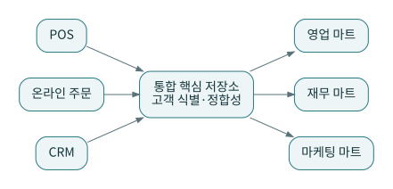

<a id="book-patterns-02-hub-and-spoke-md--1-마당마켓에-오프라인-매장이-추가된다"></a>

### 1. 마당마켓에 오프라인 매장이 추가된다

온라인 고객 번호 103과 매장 회원 번호 A-55가 같은 사람일 수 있다. 두 시스템 모두 `customer_id`라는 컬럼을 사용해도 값의 의미가 다르다. 각각의 마트에서 임의로 동일인 규칙을 만들면 영업팀과 마케팅팀의 고객 수가 달라진다.

중앙 통합 코어는 원천 키와 전사 키의 대응, 주문과 고객의 관계, 공통 상태 정의를 책임진다. 종속 마트는 이미 합의된 핵심 엔터티에서 업무 목적에 맞는 모양을 만든다. 이 설계의 가치는 ‘중앙 DB 하나’가 아니라 통합 의미의 일관성에 있다.

<a id="book-patterns-02-hub-and-spoke-md--2-dbt-프로젝트에서의-배치"></a>

### 2. dbt 프로젝트에서의 배치

```text
models/
  staging/online/stg_online_customers.sql
  staging/store/stg_store_members.sql
  core/core_customer_identity.sql
  core/core_orders.sql
  marts/sales/fct_order_lines.sql
  marts/marketing/customer_summary.sql
```

`core_customer_identity`의 grain은 `(source_system, source_customer_id)` 한 건이다. 결과에 `enterprise_customer_id`를 부여한다. 온라인 키 `103`과 매장 키 `103`을 숫자만 같다는 이유로 조인하지 않는다. 이 매핑의 유효기간과 충돌 정책까지 있어야 고객 통합을 설명할 수 있다.

중앙 코어를 3NF 중심으로 구성할 수 있지만 모든 테이블을 정규화해야 허브앤스포크가 되는 것은 아니다. 이 책의 실습은 단일 원천이라 고객 동일인 해결을 구현하지 않는다. 아래 구조는 새 원천을 추가할 때의 설계 실습이며, `lab`에 없는 동일인 정답을 만들어 실행 결과라고 표시하지 않는다.

<a id="book-patterns-02-hub-and-spoke-md--3-메달리온과의-관계"></a>

### 3. 메달리온과의 관계

원천 보존을 Bronze에 두고, 전사 통합 코어를 Silver에 두며, 종속 마트를 Gold에 둘 수 있다. 허브앤스포크는 데이터의 이동·통합 구조를, 메달리온은 품질 단계와 경계를 설명하는 식이다. 같은 그림에 두 표현을 함께 쓸 수 있지만, 각 표현이 담당하는 뜻을 범례로 적어야 한다.

<a id="book-patterns-02-hub-and-spoke-md--4-장점의-반대편에는-병목이-있다"></a>

### 4. 장점의 반대편에는 병목이 있다

같은 고객 정의를 여러 마트가 재사용하면 수정 지점이 줄어든다. 그러나 작은 변경도 중앙팀의 긴 승인 대기열을 거쳐야 한다면 전달 속도가 느려질 수 있다. 중앙 코어가 모든 부서의 마지막 세부 지표까지 품으려 하면 통합 모델이 과도하게 커진다.

실무 판단으로는 코어에는 공통 의미와 안정된 관계를 두고, 특정 캠페인만의 분류와 임시 실험은 해당 마트에 두는 방법을 검토할 수 있다. ‘전사 표준’과 ‘모든 로직 중앙화’를 동일시하지 않는다.

<a id="book-patterns-02-hub-and-spoke-md--5-선택할-때와-보류할-때"></a>

### 5. 선택할 때와 보류할 때

고객·계약·상품의 공통 정의가 조직 전체 보고의 전제이고 변경 승인 절차를 운영할 수 있다면 이 접근이 맞을 수 있다. 원천 하나와 사용자 한 명만 있는 작은 분석에서는 초기 코어 구축 비용이 당장의 이득보다 클 수 있다. 다만 코어를 만들지 않더라도 키와 정의는 문서화해야 한다.

**연습:** 중앙 코어의 고객 분류를 바꾸면 모든 마트에 즉시 반영해도 되는가?

**해설:** 기존 보고서 재현과 현재 정의를 구분해야 한다. 변경된 분류가 과거 매출을 재분류하는지, 앞으로만 적용되는지, 기존 계약의 호환성을 깨는지 검토한다. 중앙에서 한 번 변경된다고 영향도 한 번으로 끝나는 것은 아니다. 하류 소비자 목록과 영향 기간을 같이 계산해야 한다.

---

<a id="book-patterns-03-kimball-bus-md"></a>

장별 원고: [patterns/03-kimball-bus.md](patterns/03-kimball-bus.md)

<a id="book-patterns-03-kimball-bus-md--p03--kimball-버스-아키텍처-작게-납품하고-공통-차원으로-연결하기"></a>

## P03 · Kimball 버스 아키텍처: 작게 납품하고 공통 차원으로 연결하기

버스 아키텍처는 핵심 업무 프로세스와 적합 차원(conformed dimensions)을 중심으로 전사 분석을 단계적으로 확장한다. 여기서 ‘버스’는 Kafka 같은 메시지 버스가 아니다. 여러 업무 팩트가 같은 의미의 차원을 사용하도록 설계하는 통합 방식이다. [S03](#book-references-readme-md--s03)


<a id="book-patterns-03-kimball-bus-md--1-마당마켓의-버스-매트릭스"></a>

### 1. 마당마켓의 버스 매트릭스

| 업무 프로세스 | 고객 | 상품 | 주문일 | 채널 | 구독 플랜 |
|---|---:|---:|---:|---:|---:|
| 주문 상세 | ● | ● | ● | ● | |
| 환불 상세 | ● | ● | ● | ● | |
| 웹 행동 | ● | 선택 | ● | ● | |
| 월간 구독 현황 | ● | | 월 기준 | | ● |

이 표를 먼저 작성하면 어떤 차원이 실제로 공유되는지 드러난다. 모든 팩트에 모든 차원을 억지로 붙이지 않는다. 비회원 웹 이벤트는 고객을 모를 수 있고, 월간 구독 현황의 시간 grain은 주문 상세와 다르다.

적합 차원은 컬럼 이름이 같다는 의미를 넘는다. 키의 범위, 코드 값의 의미, 이력 처리, 알려지지 않은 고객의 표현이 같아야 한다. 서로 다른 원천의 `customer_id`가 동명이인이면 공통 차원이 아니다.

<a id="book-patterns-03-kimball-bus-md--2-주문을-먼저-납품해도-전체-구조를-잃지-않는-방법"></a>

### 2. 주문을 먼저 납품해도 전체 구조를 잃지 않는 방법

첫 번째 납품은 `fct_order_lines`, `dim_customers`, 상품·날짜 차원으로 시작한다. 다음 납품에서 환불 팩트를 만들 때 고객 키와 날짜 정의를 재사용한다. 이 과정에서 중앙의 완성된 거대 모델을 기다리는 대신 공유해야 하는 의미를 먼저 합의한다.

하지만 ‘업무별로 만들면 된다’는 말만 믿고 고객 차원을 팀마다 복제하면 독립 마트의 집합으로 남는다. 버스 매트릭스와 적합 차원의 관리 주체가 필요한 이유다.

<a id="book-patterns-03-kimball-bus-md--3-서로-다른-팩트를-직접-조인하지-않는다"></a>

### 3. 서로 다른 팩트를 직접 조인하지 않는다

고객 101에게 주문 상세가 3행이고 웹 이벤트가 2행 있다면 고객 키만으로 직접 조인한 결과는 6행이 될 수 있다. 주문 금액과 이벤트 수를 동시에 합산하면 서로를 증폭한다. 먼저 각각을 고객 grain으로 집계한 뒤 조인한다.

```sql
-- 설계 예제: 두 팩트의 grain을 맞춘 다음 결합한다.
with sales as (
  select customer_id, sum(recognized_cents) as sales_cents
  from fct_order_lines group by customer_id
), activity as (
  select customer_id, count(*) as event_count
  from stg_events group by customer_id
)
select s.customer_id, s.sales_cents, coalesce(a.event_count, 0) as event_count
from sales s left join activity a on s.customer_id = a.customer_id;
```

이 SQL은 개념 설명용 relation 이름을 사용한다. dbt 모델에서는 `ref()`로 의존성을 선언해야 한다. 실습에서는 `mart_customer_value`가 주문별 데이터를 고객 grain으로 집계하는 역할을 한다.

<a id="book-patterns-03-kimball-bus-md--4-허브앤스포크와-어떻게-비교하는가"></a>

### 4. 허브앤스포크와 어떻게 비교하는가

허브앤스포크는 중앙 통합 코어를 통한 전달에 강조점이 있다. 버스 아키텍처는 업무 프로세스별 납품과 적합 차원을 통한 결합에 강조점이 있다. 현실의 프로젝트는 공통 고객 코어를 두면서 버스 매트릭스로 마트를 확장할 수 있다. 양자를 오직 하나만 택해야 하는 종교처럼 다루지 않는다.

<a id="book-patterns-03-kimball-bus-md--5-마당마켓의-선택"></a>

### 5. 마당마켓의 선택

기본 실습에는 주문·이벤트·구독의 고객 ID 의미를 동일하게 정의했다. 그러나 `mart_current_mrr`와 주문 매출을 더하지 않는다. 월간 계약의 반복 매출 지표와 거래 상태 기반의 인정 매출은 서로 다른 측정이다. 공통 고객이 있다는 사실이 지표끼리 합산 가능하다는 뜻은 아니다.

**연습:** 월말 재고량을 일별 합계로 합쳐 한 달 재고량을 만든다면?

**해설:** 재고 잔액은 시간 방향으로 일반적인 가산 지표가 아니다. 월말 값, 일평균, 최대치 등 의도한 측정을 먼저 정한다. 차원 공유와 측정값의 가산성은 별개의 설계 축이다.

---

<a id="book-patterns-04-lambda-md"></a>

장별 원고: [patterns/04-lambda.md](patterns/04-lambda.md)

<a id="book-patterns-04-lambda-md--p04--람다-아키텍처-빠른-잠정값과-다시-계산한-확정값"></a>

## P04 · 람다 아키텍처: 빠른 잠정값과 다시 계산한 확정값

람다 아키텍처는 배치 경로와 저지연 경로를 함께 두는 접근이다. Nathan Marz의 초기 논의와 이후 아키텍처 문서에서 배치·속도·서빙의 역할을 확인할 수 있다. 두 경로의 코드와 결과를 어떻게 일치시킬지가 중요한 비용이 된다. [S04](#book-references-readme-md--s04) [S06](#book-references-readme-md--s06)

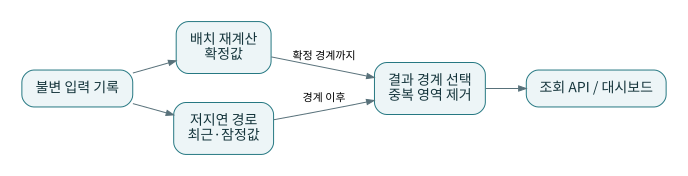

<a id="book-patterns-04-lambda-md--1-상점의-요구가-두-가지로-갈라진다"></a>

### 1. 상점의 요구가 두 가지로 갈라진다

운영자는 지금 주문이 급증하는지 보고 싶고 재무 담당자는 다음 날 정정이 반영된 확정값을 보고 싶다. 같은 ‘매출’이라는 단어를 사용하더라도 두 사람의 허용 지연과 오차는 다르다. 람다는 이 차이를 구조에 드러낸다.

저지연 경로는 최근 사건을 빠르게 투영한다. 배치 경로는 보존된 입력을 넓게 다시 계산한다. 화면에는 잠정값과 확정값의 기준을 표시해야 한다. 저지연이라는 이유만으로 반드시 부정확한 것은 아니지만, 누락·지연·정정의 처리 정책이 다르면 두 결과가 일시적으로 다를 수 있다.

<a id="book-patterns-04-lambda-md--2-단순-union-all은-통합-규칙이-아니다"></a>

### 2. 단순 UNION ALL은 통합 규칙이 아니다

배치 결과가 10시까지 확정되었는데 스트림 결과에 9시부터 데이터가 들어 있다면 둘을 그냥 더하면 9~10시가 중복된다. 반대로 두 경계 사이에 틈이 생기면 누락된다. 경계는 사건시각 한 칸만으로 해결되지 않을 수 있다. 원천 오프셋, 배치 식별자, 파티션별 완료 상태, 정정 이벤트를 고려해야 한다.

교육용으로 ‘확정 경계 이하 배치 + 경계 초과 최근 결과’라는 규칙을 세울 수 있다. 실제 구현에서는 파티션별 경계와 삭제·정정의 영향 범위를 테스트해야 한다. 늦게 도착한 과거 주문은 단순히 최근 영역에만 더해서 끝내면 안 된다.

<a id="book-patterns-04-lambda-md--3-dbt의-자리"></a>

### 3. dbt의 자리

보존된 입력이 SQL로 읽을 수 있는 테이블에 도착하면 dbt가 배치 정제·대사·마트 계산을 맡을 수 있다. dbt 실행 명령을 1분마다 호출하는 것만으로 전체 시스템이 람다가 되지는 않는다. 저지연 경로를 제공할 서비스, 결과를 통합할 규칙, 체크포인트를 관리할 책임이 별도로 필요하다.

기본 마당마켓 실습은 이 구조를 실제 배포하지 않는다. 같은 입력에 대해 빠른 결과와 확정 결과를 비교하는 설계 워크북으로만 사용한다. 제품의 UI나 실행 로그를 만들어 실제 스트리밍 배포처럼 보여주지 않는다.

<a id="book-patterns-04-lambda-md--4-5003-정정이-두-경로에-서로-다른-시점에-도착한다면"></a>

### 4. 5003 정정이 두 경로에 서로 다른 시점에 도착한다면

P2의 주문 5003은 29.00이다. P3에서 33.00으로 정정된다. 빠른 경로가 33.00을 반영했지만 배치 결과는 아직 29.00이라면 소비자는 어느 쪽을 보아야 하는가? ‘더 최신 것’이라는 설명 대신 데이터 제품에 `as_of`, 계산 버전, 잠정/확정 상태를 둔다.

재무 보고는 특정 실행의 확정 버전을 고정하고, 실시간 모니터는 잠정값을 허용하는 식으로 소비 계약을 나눌 수 있다. 이 구분 없이 같은 API 필드 하나에 결과를 교대로 덮어쓰면 숫자가 바뀐 이유를 추적하기 어렵다.

<a id="book-patterns-04-lambda-md--5-채택-조건과-반례"></a>

### 5. 채택 조건과 반례

낮은 지연과 폭넓은 재계산 요구가 동시에 있고 두 경로의 운영 비용을 감당할 때 후보가 된다. 시간 단위 배치로 충분한 상점에는 첫 선택으로 권하지 않는다. 동일 지표의 로직이 두 군데 생겨도 항상 맞는지 검증할 능력이 없다면 복잡성을 먼저 줄여야 한다.

**연습:** 스트림 결과가 배치보다 항상 진실에 가까운가?

**해설:** 아니다. 최신 전달이라는 사실과 완전한 입력이라는 사실은 다르다. 지연된 다른 파티션, 순서가 뒤집힌 수정, 아직 도착하지 않은 고객·상품 정보를 고려해야 한다.

---

<a id="book-patterns-05-kappa-md"></a>

장별 원고: [patterns/05-kappa.md](patterns/05-kappa.md)

<a id="book-patterns-05-kappa-md--p05--카파-아키텍처-하나의-처리-경로와-로그-재생"></a>

## P05 · 카파 아키텍처: 하나의 처리 경로와 로그 재생

Jay Kreps는 2014년 글에서 배치와 스트림의 처리 로직을 두 벌로 유지하는 문제를 비판하고 로그 재생을 활용하는 대안을 논의했다. 카파는 이와 연결되는 단일 스트림 처리 경로 중심의 접근이다. ‘Kafka를 사용한다’는 사실만으로 카파 아키텍처가 되는 것은 아니다. [S05](#book-references-readme-md--s05) [S06](#book-references-readme-md--s06)

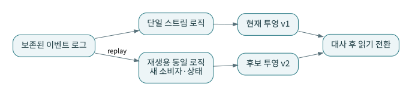

<a id="book-patterns-05-kappa-md--1-같은-입력을-다시-읽어-새-결과를-만든다"></a>

### 1. 같은 입력을 다시 읽어 새 결과를 만든다

마당마켓의 정제 로직 v1에서 취소 제외 조건을 잘못 작성했다고 가정한다. 원천 이벤트 기록이 남아 있으면 수정한 v2를 새로운 상태 저장소에 적용해 과거부터 계산할 수 있다. 기존 v1을 서비스하는 동안 v2를 별도로 만들고, 결과가 따라잡은 뒤 조회 대상을 바꾸는 전략을 검토한다.

이때 중요한 것은 코드 하나보다 재생 가능한 입력과 외부 상태다. 이벤트 로그가 일주일치뿐인데 1년 전 데이터를 재계산하겠다고 하면 전제가 맞지 않는다. 보관된 아카이브를 다시 공급하는 방법, 과거 이벤트 스키마의 해석, 시점별 기준 데이터도 필요하다.

<a id="book-patterns-05-kappa-md--2-재생은-단순히-처음-offset으로-돌아가는-일이-아니다"></a>

### 2. 재생은 단순히 처음 offset으로 돌아가는 일이 아니다

코드가 현재 상품 가격표를 조인한다면 같은 과거 주문을 재생해도 과거와 다른 금액이 나올 수 있다. 외부 HTTP 호출이나 이메일 발송이 포함되어 있다면 재생 중 고객에게 메시지를 다시 보낼 위험도 있다. 계산과 외부 부작용을 분리하고 재생 모드를 명시해야 한다.

이 교재의 `source_seq`는 주문별 순서를 단순화한 값이다. 서로 다른 주문을 전역 순서 하나로 강제하지 않는다. 실제 스트림에서는 키별 파티셔닝, 순서 보장 범위, 시간 기반 집계의 늦은 이벤트 처리 정책을 설계해야 한다.

<a id="book-patterns-05-kappa-md--3-현재-상태와-보존-기록은-같은-테이블이-아니다"></a>

### 3. 현재 상태와 보존 기록은 같은 테이블이 아니다

5003의 v1·v2·v3를 보존하면서 현재 상태는 v3 한 행만 제공할 수 있다. 삭제 이벤트가 오면 현재 투영에서 제외하되 보존 정책에 따라 입력 기록은 남을 수 있다. 현재 테이블만 보유하는 시스템에서 카파식 재생을 주장하려면 이전 상태를 복원할 별도 근거가 있어야 한다.

<a id="book-patterns-05-kappa-md--4-dbt와의-경계"></a>

### 4. dbt와의 경계

dbt는 스트림의 상태 저장, 소비자 그룹, 메시지 전달 자체를 담당하는 엔진이 아니다. 스트림이 제공한 SQL 테이블에 대한 품질 검사와 분석용 파생 모델을 맡길 수 있다. 데이터 플랫폼이 제공하는 스트리밍 테이블 기능과 dbt 어댑터의 지원 여부는 별도로 확인한다.

P1~P5 실습은 이벤트를 누적해 현재 상태를 계산하므로 로그와 투영의 차이를 배우는 데 유용하다. 그러나 이를 실행했다고 Kafka나 Flink의 체크포인트·복구·exactly-once를 검증한 것은 아니다. 본 예제의 재생은 로컬 SQL 논리의 재계산이다.

<a id="book-patterns-05-kappa-md--5-람다와의-선택-비교"></a>

### 5. 람다와의 선택 비교

| 확인할 조건 | 람다 쪽에서 특히 필요한 것 | 카파 쪽에서 특히 필요한 것 |
|---|---|---|
| 로직 변경 | 두 경로의 의미 동등성 | 이전 로그의 새 코드 해석 |
| 과거 재계산 | 배치 기준선과 최신 영역 통합 | 재생 용량·로그 보존·새 상태 |
| 외부 차원 조인 | 배치·스트림의 기준 일치 | 시점 일관성이 있는 기준 데이터 |
| 운영 실패 | 경로별 지연·경계 대사 | offset·상태·출력의 일관성 |

**연습:** ‘exactly-once면 중복 제거를 구현하지 않아도 된다’는 주장에 동의하는가?

**해설:** 보장 범위를 먼저 확인해야 한다. 메시지 시스템 내부 트랜잭션과 외부 DB 쓰기, API 호출, 원천의 중복 이벤트는 서로 다른 경계다. end-to-end의 결과를 확인하지 않은 보장 이름만으로 업무 멱등성을 단정하지 않는다.

---

<a id="book-patterns-06-lakehouse-md"></a>

장별 원고: [patterns/06-lakehouse.md](patterns/06-lakehouse.md)

<a id="book-patterns-06-lakehouse-md--p06--웨어하우스데이터-레이크레이크하우스와-dbt의-위치"></a>

## P06 · 웨어하우스·데이터 레이크·레이크하우스와 dbt의 위치

레이크하우스는 레이크와 웨어하우스의 성격을 결합해 데이터 보관과 분석을 제공하려는 플랫폼 아키텍처다. 메달리온과 동의어는 아니다. 전자는 저장·처리 환경의 구성이며 후자는 그 안에서 데이터를 정제하는 설계다. [S06](#book-references-readme-md--s06)

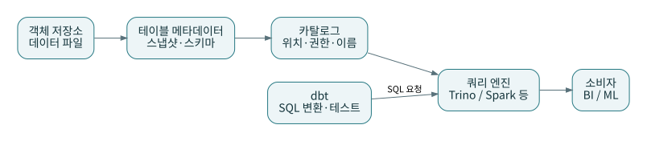

<a id="book-patterns-06-lakehouse-md--1-이름을-구별하는-것부터-시작한다"></a>

### 1. 이름을 구별하는 것부터 시작한다

객체 저장소는 파일을 보관한다. Parquet 같은 파일 형식은 파일 안의 데이터를 표현한다. Iceberg 같은 테이블 형식은 테이블의 스키마·스냅샷·파일 집합을 관리하는 메타데이터 구조를 제공한다. 카탈로그는 테이블을 이름으로 찾는 체계에 관여한다. Trino는 커넥터를 통해 데이터를 읽고 SQL을 처리한다. dbt는 모델의 SQL과 의존성, 테스트를 조직한다. [S24](#book-references-readme-md--s24) [S25](#book-references-readme-md--s25)

이 구분이 없으면 ‘Iceberg에서 dbt를 실행한다’는 문장이 어떤 엔진·어댑터·카탈로그를 뜻하는지 모호해진다. 오류가 났을 때도 파일 문제와 메타스토어 문제, SQL 계획 문제를 구별하기 어렵다.

<a id="book-patterns-06-lakehouse-md--2-마당마켓의-로컬-설계와-운영-배치"></a>

### 2. 마당마켓의 로컬 설계와 운영 배치

로컬에서는 단일 데이터베이스 파일로 시작한다. 운영 환경의 한 설계 예는 외부 적재기가 L0 원천을 준비하고, Trino가 이를 읽어 Iceberg 기반 L1~L3 테이블을 계산하는 구조다. 이는 가능한 구성 예시이지 특정 회사 시스템의 복제본이 아니다. 실제 카탈로그 이름과 권한은 환경에 맞게 설정한다.

L0와 L1의 카탈로그가 다르면 `catalog.schema.table`을 모델 SQL에 반복해서 박아 넣기 쉽다. 대신 source 선언과 대상 설정을 분리하고 스키마·카탈로그 변수를 중앙 관리한다. 소스의 물리 위치와 모델의 쓰기 위치는 같은 변수 하나로 무조건 묶지 않는다.

<a id="book-patterns-06-lakehouse-md--3-테이블-형식이-해결하지-않는-것"></a>

### 3. 테이블 형식이 해결하지 않는 것

테이블 스냅샷이 있다고 해서 여러 테이블이 하나의 업무 배치로 동시에 공개되었다는 뜻은 아니다. 주문 헤더는 새 스냅샷이고 상세는 이전 스냅샷이면 금액 대사가 실패할 수 있다. 배치 입력 버전이나 발행 manifest로 ‘어떤 집합을 함께 사용했는지’를 남겨야 한다.

메타데이터 스냅샷과 데이터 품질 테스트도 다르다. 저장 포맷이 무결한 파일을 읽는다고 업무상 중복 주문이나 잘못된 통화가 사라지지 않는다. 반대로 SQL 테스트가 통과해도 카탈로그 권한이나 오래된 파일 정리 정책은 별도 문제다.

<a id="book-patterns-06-lakehouse-md--4-비용과-유지보수의-질문"></a>

### 4. 비용과 유지보수의 질문

작은 파일, 과도한 파티션, 매우 깊은 뷰, 실행마다 원천 전체를 읽는 설계는 각각 다른 비용을 만들 수 있다. 쿼리 시간 하나만 보지 말고 읽은 바이트, 파일 수, 계획 단계, 메타데이터 접근, 스냅샷 보존까지 관측한다. 숫자를 측정하기 전에는 ‘레이크하우스로 바꾸면 더 빠르다’고 단정하지 않는다.

최적화와 정리 작업은 어댑터·엔진·권한별로 검증해야 한다. 이 책의 SQL 기준 실습은 파일 압축이나 Iceberg 스냅샷 만료를 실행하지 않는다. 운영 데이터를 삭제할 수 있는 정리 명령을 초보자용 빠른 시작에 포함하지 않는다.

<a id="book-patterns-06-lakehouse-md--5-선택-예"></a>

### 5. 선택 예

구조화된 소규모 보고만 필요하면 단순 웨어하우스가 운영하기 쉬울 수 있다. 다양한 형식의 큰 데이터와 여러 엔진의 분석이 필요하면 레이크하우스를 검토할 이유가 생긴다. ‘더 최신 기술’이라는 이유보다 데이터 종류, 소비 방식, 조직의 운영 능력으로 판단한다.

**연습:** L3만 성공하면 보고서를 공개해도 되는가?

**해설:** L3가 어느 L0~L2 입력 버전을 소비했는지, 품질 검사가 끝났는지, 공개 대상 전체가 같은 배치를 가리키는지 확인해야 한다. 단일 쿼리의 성공은 데이터 제품 전체의 발행 완료와 같지 않다.

---

<a id="book-patterns-07-data-mesh-md"></a>

장별 원고: [patterns/07-data-mesh.md](patterns/07-data-mesh.md)

<a id="book-patterns-07-data-mesh-md--p07--데이터-메시-폴더가-아니라-소유권과-계약의-설계"></a>

## P07 · 데이터 메시: 폴더가 아니라 소유권과 계약의 설계

데이터 메시의 원문은 도메인 중심 소유권, 데이터를 제품으로 다루기, 셀프서비스 플랫폼, 연합된 계산 가능한 거버넌스라는 원칙을 제시한다. 프로젝트를 여러 개로 분리하거나 폴더에 도메인 이름을 붙이는 것만으로 완성되지 않는다. [S07](#book-references-readme-md--s07)

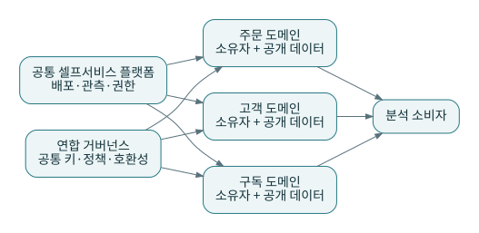

<a id="book-patterns-07-data-mesh-md--1-마당마켓의-팀이-나뉜다"></a>

### 1. 마당마켓의 팀이 나뉜다

초기에는 한 사람이 주문·고객·구독 모델을 모두 관리했다. 이제 고객팀은 고객 키와 동의 상태를, 주문팀은 주문과 환불을, 구독팀은 플랜과 월간 계약을 책임진다고 가정한다. 중앙팀이 모든 SQL을 대신 작성하면 각 팀의 업무 변경을 따라가기 어려울 수 있다.

도메인 공개 모델은 다른 팀에 제공하는 인터페이스다. 내부의 세부 정제 파일 이름이 아니라 안정적으로 사용할 수 있는 grain, 키, 컬럼 의미, 유효시간, 최신성, 문의 책임자를 약속해야 한다.

<a id="book-patterns-07-data-mesh-md--2-공개-계약을-구체적으로-적는다"></a>

### 2. 공개 계약을 구체적으로 적는다

```yaml
# governance/data_products.yml의 설계 문서 형식. dbt native 속성 문법이 아니다.
product: customer_identity
owner: customer-domain
public_relation: customer_identity_v1
grain: one row per source_system and source_customer_id
key: [source_system, source_customer_id]
compatibility: additive changes only within v1
freshness_goal: daily before 09:00 Asia/Seoul
failure_policy: keep previous published version and mark stale
```

계약은 구조만 다루지 않는다. 고객 104가 늦게 도착했을 때 주문팀이 어떤 결과를 제공할지도 합의해야 한다. 이 예제는 주문을 격리한 뒤 고객 도착 후 재평가하지만, 어떤 서비스는 unknown customer 키를 사용해 매출 자체는 먼저 집계할 수 있다. 두 방식의 선택은 업무 요구에 달려 있다.

<a id="book-patterns-07-data-mesh-md--3-dbt-mesh와-데이터-메시를-혼동하지-않는다"></a>

### 3. dbt Mesh와 데이터 메시를 혼동하지 않는다

데이터 메시는 조직·아키텍처 접근이다. dbt가 제공하는 프로젝트 간 의존성, 공개 모델 관리 등 특정 기능은 그 접근을 구현하는 일부 수단일 수 있다. 사용 가능한 기능은 dbt 제품·버전·계정 조건에 따라 확인해야 한다. 이 책의 로컬 프로젝트 분리가 곧 관리형 제품의 cross-project 기능 검증이라고 주장하지 않는다.

<a id="book-patterns-07-data-mesh-md--4-분산-소유와-공통-기준의-균형"></a>

### 4. 분산 소유와 공통 기준의 균형

각 팀이 독립적으로 변경할 수 있어도 고객 키와 민감정보 정책까지 임의로 달라져서는 곤란하다. 공통 기준은 자동 검사할 수 있을 정도로 명시해야 한다. 예를 들면 공개 모델의 소유자 누락 금지, 허용된 개인정보 등급, 주요 키 테스트, 이전 버전 지원기간을 정할 수 있다.

중앙 플랫폼은 배포·관측·권한 같은 반복 부담을 줄이고 도메인팀은 업무 의미를 책임진다. ‘소유권을 넘겼으니 장애도 알아서 해결하라’는 식의 책임 전가는 셀프서비스가 아니다.

<a id="book-patterns-07-data-mesh-md--5-이-예제에서-지금-채택하지-않는-이유"></a>

### 5. 이 예제에서 지금 채택하지 않는 이유

기본 마당마켓은 교육용 단일 프로젝트다. 여러 팀의 독립 배포가 없으므로 프로젝트 분할 자체를 목표로 삼지 않는다. 대신 한 프로젝트 안에서도 소유자, 공개 경계, 버전 규칙을 남긴다. 실제 조직이 커졌을 때 이 기록이 분리의 출발점이 된다.

**연습:** 다른 팀이 편하다고 내부 `int_` 모델을 직접 사용하기 시작했다면?

**해설:** 즉시 지워서 소비자를 깨뜨리지 말고 실제 의존성을 먼저 파악한다. 공식 공개 모델로 이동할 기간과 호환 뷰, 변경 공지를 마련한다. 공개 여부는 이름뿐 아니라 실제 소비와 지원 계약으로 관리해야 한다.

---

<a id="book-patterns-08-data-fabric-and-federation-md"></a>

장별 원고: [patterns/08-data-fabric-and-federation.md](patterns/08-data-fabric-and-federation.md)

<a id="book-patterns-08-data-fabric-and-federation-md--p08--데이터-패브릭과-연합-쿼리-복제하지-않고-연결하면-끝나는가"></a>

## P08 · 데이터 패브릭과 연합 쿼리: 복제하지 않고 연결하면 끝나는가

데이터 패브릭은 통합·메타데이터·정책·자동화를 함께 강조하는 아키텍처 관점으로 설명된다. 공급업체별 범위가 다를 수 있으므로 단일한 표준 구현처럼 취급하지 않는다. 여기서는 IBM의 설명을 개념 참고로 사용하고, Trino의 연합 접근과 구별한다. [S08](#book-references-readme-md--s08) [S24](#book-references-readme-md--s24)


<a id="book-patterns-08-data-fabric-and-federation-md--1-복사하지-않고-읽는다는-장점"></a>

### 1. 복사하지 않고 읽는다는 장점

마당마켓이 외부 CRM의 고객 데이터를 매일 복사하는 대신 쿼리 엔진을 통해 직접 읽는다고 가정한다. 빠른 탐색이나 일시적인 검증에는 편리할 수 있다. 원천마다 다른 접속 방식을 공통 SQL 진입점으로 묶는 것도 유용하다.

하지만 읽을 때마다 원천이 바뀌면 어제 보고서를 똑같이 다시 만들기 어렵다. 한 번의 쿼리 안에서도 여러 원천의 일관된 시점을 보장할 수 있는지 확인해야 한다. ‘데이터를 안 옮겼으니 모든 것이 실시간으로 정확하다’는 결론은 성립하지 않는다.

<a id="book-patterns-08-data-fabric-and-federation-md--2-세-개의-서로-다른-문제"></a>

### 2. 세 개의 서로 다른 문제

첫째는 접근 문제다. 어느 엔진이 어느 카탈로그를 통해 데이터를 읽는가? 둘째는 의미 문제다. 각 원천의 고객 키가 같은가? 셋째는 관리 문제다. 누가 소유하고 민감도·계보·품질 상태를 어디에 기록하는가? 연합 SQL이 첫 번째를 도와도 두 번째와 세 번째는 별도의 작업이다.

패브릭을 설명하면서 쿼리 가상화만 그려 놓으면 관리 자동화와 정책의 영역이 빠진다. 반대로 메타데이터 카탈로그를 설치했다고 원천 간 정합성이 저절로 해결된다고 생각해도 안 된다.

<a id="book-patterns-08-data-fabric-and-federation-md--3-선택적으로-실물화한다"></a>

### 3. 선택적으로 실물화한다

매번 같은 큰 조인을 수행한다면 결과를 내부 테이블에 만들어 재사용하는 편이 나을 수 있다. 원천 시스템 부하, 네트워크 전송, 신선도, 변경 주기를 보고 실물화 대상을 정한다. 실물화한 순간부터는 갱신·재처리·삭제 반영의 책임이 추가된다.

마당마켓의 `stg_customers_current`를 직접 원천에 연결할 때는 마지막 성공 적재 시점이 아니라 마지막 성공 조회 및 사용한 스냅샷을 기록해야 할 수 있다. 신선도의 의미가 달라진다는 점을 문서에 명시한다.

<a id="book-patterns-08-data-fabric-and-federation-md--4-실패가-퍼지는-경로"></a>

### 4. 실패가 퍼지는 경로

고객 원천의 짧은 중단이 매출 보고 쿼리 전체의 실패로 퍼질 수 있다. 외부 join을 위해 많은 데이터를 가져오면 원천 운영 업무에 부담을 줄 수 있다. 따라서 읽기 계정 권한, 요청 제한, 캐시·스냅샷 정책, 허용된 조인 범위를 검토한다.

실습의 로컬 테이블은 이런 네트워크·분산 실패를 검증하지 않는다. 개념도에 트리노를 표시하는 것과 실제 커넥터의 인증·pushdown·트랜잭션을 테스트하는 일은 다르다.

<a id="book-patterns-08-data-fabric-and-federation-md--5-선택-실습"></a>

### 5. 선택 실습

**문제:** 원천 변경이 잦고 보고서 재현이 중요하다. 매번 원천을 직접 조회하는 구조를 그대로 써도 되는가?

**해설:** 원천이 재현 가능한 시점 조회를 지원하는지부터 확인한다. 그렇지 않다면 제한된 범위의 스냅샷 또는 변경 기록을 내부에 보관하는 선택을 검토한다. ‘복제 최소화’와 ‘재현 가능성’ 중 어떤 목표가 우선인지 명시해야 한다.

**문제:** 데이터 메시와 패브릭은 둘 중 하나인가?

**해설:** 이 책의 분류에서는 소유권과 플랫폼 관리 관점을 나눠 본다. 도메인 제품을 운영하면서 공통 메타데이터·접근 관리 기능을 사용할 수 있다. 이름의 조합보다 구체적인 책임과 기능이 중복되거나 빠지지 않는지 검토한다.

---

<a id="book-patterns-09-data-vault-md"></a>

장별 원고: [patterns/09-data-vault.md](patterns/09-data-vault.md)

<a id="book-patterns-09-data-vault-md--p09--data-vault-업무-키관계속성-이력을-분리하는-통합-모델"></a>

## P09 · Data Vault: 업무 키·관계·속성 이력을 분리하는 통합 모델

Data Vault 모델링을 처음 접할 때는 Hub, Link, Satellite의 역할을 구별하는 것이 출발점이다. Hub는 업무 키, Link는 관계, Satellite는 속성과 이력에 초점을 둔다. 패키지 문서의 모델 생성 예는 이 구조를 구현하는 방법의 하나다. 이 장이 Data Vault 2.0 방법론 전체를 대체하는 인증 교재는 아니다. [S10](#book-references-readme-md--s10) [S11](#book-references-readme-md--s11) [S26](#book-references-readme-md--s26)


<a id="book-patterns-09-data-vault-md--1-마당마켓을-다른-방식으로-모델링해-본다"></a>

### 1. 마당마켓을 다른 방식으로 모델링해 본다

주문 5003의 상태가 바뀌어도 주문이라는 업무 키는 같다. 고객 103과 주문 5003의 관계, 상태와 금액의 변화는 서로 다른 종류의 사실이다. 이를 하나의 넓은 이력 테이블에 함께 저장할 수도 있지만, Vault 접근에서는 역할을 분리한다.

```text
hub_customer(customer_hk, customer_bk, load_dts, record_source)
hub_order(order_hk, order_bk, load_dts, record_source)
link_customer_order(link_hk, customer_hk, order_hk, load_dts, record_source)
sat_order_state(order_hk, load_dts, status, amount_cents, hashdiff, record_source)
```

여기의 예시는 설계 스케치다. `lab/dbt`의 실행 모델을 이 이름으로 모두 바꿨다는 뜻이 아니다. 실제 구현에서는 업무 키의 범위, 같은 시각의 여러 변경, 적재 순서, 소스별 위성 분리 등을 더 정해야 한다.

<a id="book-patterns-09-data-vault-md--2-해시-키는-마법의-동일인-판정이-아니다"></a>

### 2. 해시 키는 마법의 동일인 판정이 아니다

`103`을 해시해도 온라인의 103과 매장의 103이 같은 사람인지 알 수 없다. 키가 원천별이면 원천 구분을 포함하거나 별도 통합 규칙이 필요하다. NULL, 빈 문자열, 대소문자, 구분자 충돌, 문자 인코딩을 표준화하지 않으면 같은 논리 키가 다른 값으로 계산될 수 있다.

해시 키와 속성 변경 감지용 hashdiff도 역할이 다르다. 전자는 식별, 후자는 비교를 위한 값이다. 개인정보를 해시한 사실만으로 익명화가 보장된다고 설명하지 않는다. 소규모 값 공간이나 결합 가능성을 고려해야 한다.

<a id="book-patterns-09-data-vault-md--3-적재-시각과-업무-유효시각"></a>

### 3. 적재 시각과 업무 유효시각

P3에서 고객 103의 VIP 전환 정보를 받았다고 하자. 실제 전환일과 시스템이 그 정보를 받은 날짜는 다를 수 있다. 적재 시각만 저장하면 ‘그 당시 우리가 알고 있던 상태’를 볼 수 있지만 ‘업무상 그 날짜에 유효했던 상태’를 정확히 재현하기 어려울 수 있다. 두 시간을 필요한 수준으로 구분한다.

마당마켓의 단순 이력 실습은 `effective_from`을 가지고 구간을 계산한다. 관측시각까지 이중 시간으로 관리하는 완전한 이력 저장소는 아니다. 설계 요구가 강화되면 [P13](#book-patterns-13-history-and-temporal-md)의 이중 시간 질문으로 확장한다.

<a id="book-patterns-09-data-vault-md--4-언제-후보가-되는가"></a>

### 4. 언제 후보가 되는가

원천이 많고 변경 이력과 추적성이 중요하며 입력 변화에 대응하는 통합 구조가 필요할 때 검토할 수 있다. 단일 원천의 작은 대시보드라면 테이블 수와 조인 경로, 모델 생성·운영 규칙이 과해질 수 있다. 감사 요구가 있다고 해서 Vault만이 유일한 해법은 아니다.

원천 친화적인 보존·통합 모델을 만들었다면 소비용 마트는 따로 필요할 수 있다. 분석가에게 Hub와 Satellite를 직접 무제한 조인하게 하면 시점 선택과 중복 문제를 각자 해결해야 한다. 공통 소비 모델에서 이를 통제한다.

<a id="book-patterns-09-data-vault-md--5-메달리온과-결합하기"></a>

### 5. 메달리온과 결합하기

Bronze 원본 위에 Vault 형태의 Silver 통합을 두고 Gold에 팩트·차원을 만들 수 있다. 이 조합이 항상 유리하다는 뜻은 아니다. 같은 상점의 단순 단계별 SQL과 비교하여 추가 모델 수, 재생·감사 요구, 운영 자동화 정도를 평가한다.

**연습:** 위성 테이블에 5003의 상태 이력이 세 행 있다. 주문 건수는 세 건인가?

**해설:** 아니다. 상태 관측 grain과 주문 grain이 다르다. 현재 주문 수, 변경 횟수, 특정 시점의 주문 수를 각각 다른 쿼리로 정의해야 한다. 업무 키가 반복되는 이유부터 설명한다.

---

<a id="book-patterns-10-staging-and-dag-md"></a>

장별 원고: [patterns/10-staging-and-dag.md](patterns/10-staging-and-dag.md)

<a id="book-patterns-10-staging-and-dag-md--p10--dbt-계층형-dag-원천의-언어를-업무의-언어로-바꾸기"></a>

## P10 · dbt 계층형 DAG: 원천의 언어를 업무의 언어로 바꾸기

dbt의 권장 프로젝트 구조는 staging, intermediate, marts를 설명한다. 이 구조는 이해하기 쉬운 출발점이지 모든 조직의 폴더·스키마 이름을 고정하는 규격이 아니다. 중요한 것은 원천에 맞춘 표현에서 업무에 맞춘 표현으로 일관되게 이동하는 것이다. [S02](#book-references-readme-md--s02)


<a id="book-patterns-10-staging-and-dag-md--1-한-모델이-한-가지-이유로-바뀌도록-나눈다"></a>

### 1. 한 모델이 한 가지 이유로 바뀌도록 나눈다

`stg_order_changes`는 전달 중복과 상태 표기 때문에 바뀐다. `stg_orders_current`는 원천의 최신 상태 해석 때문에 바뀐다. `int_orders_classified`는 품질 규칙 때문에 바뀐다. `fct_orders`는 업무에서 인정하는 매출 상태가 바뀔 때 변경된다. 한 파일에 모두 적으면 수정 이유와 영향 범위가 섞인다.

그렇다고 함수처럼 SQL 한 줄마다 모델로 나누면 파일 이동과 재귀 의존성만 늘 수 있다. 재사용, 테스트 경계, 업무 책임, 실행 비용 중 하나라도 분리 이유가 있어야 한다. 모델 이름은 단순히 `step_3`보다 `int_order_totals`처럼 결과의 의미를 드러내도록 한다.

<a id="book-patterns-10-staging-and-dag-md--2-source와-ref를-구별한다"></a>

### 2. source와 ref를 구별한다

다른 적재 시스템이 소유하는 원천 테이블은 `source()`로 선언한다. 이 프로젝트의 모델이 생성하는 결과는 `ref()`로 연결한다. 물리 스키마명이 바뀌더라도 모델의 논리 이름은 유지할 수 있다. source 그룹의 이름은 YAML 선언과 정확히 대응해야 한다.

```sql
-- 실제 동봉 모델: lab/dbt/models/l2/int_order_totals.sql
select order_id, sum(quantity * unit_price_cents) as line_amount_cents,
       count(*) as line_count
from {{ ref('stg_items_current') }}
group by order_id
```

쿼리 문자열을 조립해 숨겨진 의존성을 만들면 정적 분석이 어려워진다. 고급 매크로가 필요한 경우에도 dbt가 의존성을 인식하는 방식과 파싱 시점의 동작을 확인해야 한다.

<a id="book-patterns-10-staging-and-dag-md--3-선택-실행은-잘못된-프로젝트를-가리는-기능이-아니다"></a>

### 3. 선택 실행은 잘못된 프로젝트를 가리는 기능이 아니다

`--select`는 실행 대상을 선택하는 구문이다. 프로젝트의 파싱·선언 검증과 모델 실행은 별개의 단계다. 실행하지 않을 모델에 존재하지 않는 source 선언이 있으면 선택 모델만 보고는 원인을 놓칠 수 있다. `dbt parse`와 전체 그래프 유효성부터 확인한다. [S17](#book-references-readme-md--s17) [S28](#book-references-readme-md--s28)

이 교재의 `--phase`는 데이터 단계를 고르는 **기준 실행기 옵션**이고 dbt 옵션이 아니다. `selected-graph-only` 같은 이름을 갖는 사내 래퍼가 있다면 그것 역시 기본 dbt 기능과 구별해서 문서화해야 한다. 모델 폴더를 임시 삭제해 오류를 숨기거나 source를 잘못된 L1으로 자동 보정하는 방식은 원인을 감출 수 있다.

<a id="book-patterns-10-staging-and-dag-md--4-전체-검증과-선택-범위의-조상-폐쇄"></a>

### 4. 전체 검증과 선택 범위의 조상 폐쇄

먼저 모든 `ref`와 `source`가 선언됐는지 검사한다. 다음으로 선택한 모델의 모든 상류 모델이 실행 대상 또는 신뢰할 수 있는 기존 relation으로 해결되는지 확인한다. 마지막으로 선택하지 않은 모델에 쓰기 작업을 하지 않는지 검증한다. 이 세 질문을 하나의 ‘선택 성공’으로 뭉뚱그리지 않는다.

동봉 실행기는 리터럴 `ref()/source()`만 허용하는 작은 그래프 검사를 한다. 이것은 매크로·동적 설정·버전 ref까지 처리하는 dbt manifest 분석기가 아니다. 더 복잡한 프로젝트는 실제 dbt artifact를 사용해야 한다.

<a id="book-patterns-10-staging-and-dag-md--5-순환과-자기참조"></a>

### 5. 순환과 자기참조

A가 B를 참조하고 B가 A를 참조하면 DAG가 아니다. 과거 대상 테이블을 읽는 증분 로직과 다른 모델끼리 순환하는 구조는 구별해야 한다. 최초 실행에 대상이 없는 상황, 기존 테이블만 허용하는 운영 정책, `--full-refresh`의 파괴 범위를 각각 검토한다. 대상이 이미 존재한다는 사실만으로 다른 상류 관계까지 올바르다는 뜻은 아니다.

**연습:** 쿼리는 직접 실행하면 성공하는데 dbt에서 source 누락이 발생한다. SQL 엔진 문제인가?

**해설:** 먼저 프로젝트 선언 문제를 의심한다. 물리 테이블의 존재와 dbt source 노드의 존재는 다르다. YAML 그룹·테이블 이름, 활성화 조건, 검색 경로를 확인하고 parse 로그와 manifest를 살펴본다.

---

<a id="book-patterns-11-star-snowflake-wide-md"></a>

장별 원고: [patterns/11-star-snowflake-wide.md](patterns/11-star-snowflake-wide.md)

<a id="book-patterns-11-star-snowflake-wide-md--p11--스타스노플레이크wide-table-읽기-편의와-의미-일관성의-균형"></a>

## P11 · 스타·스노플레이크·wide table: 읽기 편의와 의미 일관성의 균형

차원 모델에서는 측정값과 분석 문맥을 구분하고 grain을 먼저 정한다. 스타·스노플레이크·평탄한 소비 모델의 선택은 이 기본 조건을 바꾸지 않는다. 이 장은 구조의 형태보다 잘못된 합계가 생기는 경로에 집중한다. [S12](#book-references-readme-md--s12)


<a id="book-patterns-11-star-snowflake-wide-md--1-같은-데이터의-세-가지-표현"></a>

### 1. 같은 데이터의 세 가지 표현

스타는 주문 상세 팩트 주변에 고객·상품·날짜 같은 차원을 둔다. 스노플레이크 형태에서는 상품→카테고리→부서처럼 일부 차원을 더 정규화할 수 있다. Wide table은 소비 목적에 필요한 속성을 한 결과에 넓게 붙여 제공한다. 마지막 형태가 항상 잘못되거나 항상 더 빠른 것은 아니다.

예를 들어 BI 도구가 매번 고객의 현재 등급을 필요로 하면 목적별 고객 요약 테이블이 편리할 수 있다. 반면 과거 주문 당시 등급까지 필요하다면 현재 속성을 그대로 펼치는 것만으로 해결되지 않는다. wide 모델에도 시점과 grain이 필요하다.

<a id="book-patterns-11-star-snowflake-wide-md--2-실습으로-보는-fanout"></a>

### 2. 실습으로 보는 fanout

P1의 주문 5003 헤더 금액은 29.00이고 상세는 두 행이다. 헤더 금액을 상세에 복제한 뒤 합산하면 58.00이 된다. 전체 주문 헤더 합계는 98.00인데 같은 잘못된 조인은 169.00을 만든다. 이 숫자는 `run_reference.py --verify`의 반례 검사로 확인한다.


이 문제는 DISTINCT를 무조건 붙여 해결하지 않는다. 서로 다른 두 주문의 금액이 같으면 `sum(distinct amount)`는 정상 금액까지 지울 수 있다. 주문 grain의 헤더 합계와 상세 grain의 행 금액 합계를 구분해야 한다.

<a id="book-patterns-11-star-snowflake-wide-md--3-wide-table을-안전하게-제공하는-방법"></a>

### 3. Wide table을 안전하게 제공하는 방법


공통으로 검증한 팩트·차원에서 목적별 wide를 만든다. 원천별로 팀이 각자 직접 wide를 만들면 취소 제외 조건과 고객 매핑이 여러 군데로 퍼질 수 있다. 읽기 편한 최종 모델과 재사용 가능한 공통 정의는 함께 둘 수 있다.

`select *`로 하류에 모든 컬럼을 전달하면 민감정보가 우연히 공개되거나 상류 컬럼 추가가 소비 계약에 영향을 줄 수 있다. 공개 모델에서는 필요한 컬럼을 명시하고 설명을 남긴다. 내부의 빠른 탐색과 공개 인터페이스는 기준이 다르다.

<a id="book-patterns-11-star-snowflake-wide-md--4-행-수와-열-수-외에-비교할-것"></a>

### 4. 행 수와 열 수 외에 비교할 것

쿼리 패턴, 필터 선택도, 조인 키 분포, 차원 변경 빈도, 데이터 압축, 소비 도구의 기능을 함께 측정한다. 특정 구조가 항상 최적이라는 가정은 피한다. 동일한 입력·지표·조회 조건으로 결과 동등성을 확인한 다음 비용을 비교해야 한다.

<a id="book-patterns-11-star-snowflake-wide-md--5-마당마켓의-선택"></a>

### 5. 마당마켓의 선택

주문 한 건을 점검할 `fct_orders`와 상품 분석용 `fct_order_lines`를 둘 다 제공한다. `mart_customer_value`와 `mart_daily_sales`는 각각 고객·일 grain의 목적별 결과다. 소비자는 먼저 어느 grain이 필요한지 고른다. 책의 SQL 테스트는 주문 헤더와 정상 상세 합계를 대사한다.

**연습:** 고객을 포함하는 모든 데이터를 하나의 큰 테이블로 합치면 join 실수가 사라지는가?

**해설:** 조인 실수가 모델 생성 과정으로 이동할 뿐이다. 주문·웹 이벤트·구독을 고객 키만으로 합치면 grain이 폭발한다. 각각 공통 수준으로 집계하거나 별도 팩트로 제공해야 한다.

---

<a id="book-patterns-12-fact-patterns-md"></a>

장별 원고: [patterns/12-fact-patterns.md](patterns/12-fact-patterns.md)

<a id="book-patterns-12-fact-patterns-md--p12--팩트-패턴-거래주기-스냅샷누적-스냅샷무측정-사실"></a>

## P12 · 팩트 패턴: 거래·주기 스냅샷·누적 스냅샷·무측정 사실

같은 업무에서도 무엇을 측정하느냐에 따라 팩트의 grain이 달라진다. 거래 팩트, 주기 스냅샷, 누적 스냅샷, 무측정 팩트는 다른 질문에 답한다. 이름에 snapshot이 있다고 dbt의 snapshot 기능과 같은 것은 아니다. [S12](#book-references-readme-md--s12)

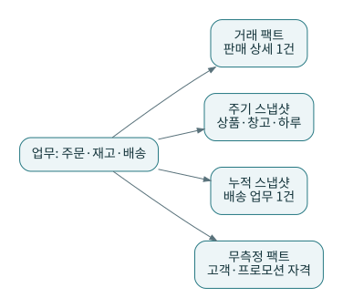

<a id="book-patterns-12-fact-patterns-md--1-거래-팩트"></a>

### 1. 거래 팩트

주문 상세 1건이나 환불 상세 1건처럼 사건의 단위로 기록한다. 주문 5003의 두 상세는 각각의 상품·수량·단가를 갖는다. 주문번호는 같아도 상세키는 다르다. 거래가 발생한 날짜, 회계적으로 귀속시키는 날짜, 적재 날짜를 필요에 따라 분리한다.

‘한 행이 주문’이라고 설명하면서 실제 SQL이 주문 상세를 출력하면 이미 설계가 틀어진 것이다. 테스트 이름보다 먼저 grain 문장을 검토한다. `unique(order_id)`가 실패한다고 키 테스트를 삭제하기 전에 모델의 실제 grain을 확인한다.

<a id="book-patterns-12-fact-patterns-md--2-주기-스냅샷-팩트"></a>

### 2. 주기 스냅샷 팩트

상품·창고·하루의 재고량, 계정·월의 구독 현황처럼 일정 주기마다 상태를 기록한다. 사건이 없던 날을 생략할지 0이나 이전 상태로 채울지도 계약에 포함한다. 상태 잔액을 시간 방향으로 합산하면 대개 질문이 달라진다.

마당마켓의 `mart_current_mrr`는 **현재 한 시점의 요약**이며 월별 이력을 보존하는 완전한 MRR 팩트가 아니다. 과거 월을 비교하려면 기준월과 상태 이력을 함께 두어야 한다. 오늘의 상태를 작년 모든 달에 복제해서 과거 MRR이라고 부르면 안 된다.

<a id="book-patterns-12-fact-patterns-md--3-누적-스냅샷-팩트"></a>

### 3. 누적 스냅샷 팩트

배송 업무 1건에 주문·포장·출고·도착 시점을 나란히 둔다고 가정한다. 프로세스가 진행되며 같은 행의 마일스톤이 채워진다. 단계 간 소요시간을 보기 좋지만 반품·재출고처럼 반복되는 경로는 어떻게 표현할지 정해야 한다.

모든 흐름이 선형이라는 가정이 맞지 않으면 별도 이벤트 팩트와 함께 사용하는 편이 자연스러울 수 있다. 순서를 되돌리는 정정도 고려한다. `delivered_at >= shipped_at` 같은 규칙은 좋은 출발점이지만 시간대·소급 보정 정책을 함께 봐야 한다.

<a id="book-patterns-12-fact-patterns-md--4-무측정-팩트"></a>

### 4. 무측정 팩트

프로모션을 받을 자격이 있던 고객 목록, 재고가 있었던 상품·매장·날짜처럼 숫자 측정값 없이 관계나 사건의 존재를 기록할 수 있다. 실제 판매와 자격·가용성을 비교하면 ‘팔리지 않은 이유’를 분석하는 출발점이 된다.

무측정이라는 말은 분석 가치가 없다는 뜻이 아니다. `count(*)`가 의미 있는 측정이 되도록 grain과 중복 방지 키가 중요하다.

<a id="book-patterns-12-fact-patterns-md--5-여러-값을-합산할-때의-원칙"></a>

### 5. 여러 값을 합산할 때의 원칙

주문 금액은 통화가 같고 중복이 없고 상태 정의가 같을 때 합산할 수 있다. 전환율은 분자와 분모를 각자 합한 뒤 다시 계산해야 할 수 있다. 재고는 날짜를 가로질러 합산하는 대신 특정 시점이나 평균을 선택할 수 있다. 평균의 평균도 집단 크기가 다르면 결과가 달라진다.

**연습:** 주문 수 1건에 매출 100, 주문 수 9건에 매출 90인 두 집단의 객단가 평균은?

**해설:** 두 객단가 100과 10을 단순 평균한 55가 아니라, 전체 매출 190을 주문 10건으로 나눈 19다. 지표를 저장할 때 분자·분모를 보존하면 올바르게 재집계하기 쉽다.

---

<a id="book-patterns-13-history-and-temporal-md"></a>

장별 원고: [patterns/13-history-and-temporal.md](patterns/13-history-and-temporal.md)

<a id="book-patterns-13-history-and-temporal-md--p13--scd와-시점-설계-현재-그-당시-그때-알고-있던-사실"></a>

## P13 · SCD와 시점 설계: 현재, 그 당시, 그때 알고 있던 사실

속성이 바뀔 때 기존 값을 덮을지 이력 행을 추가할지는 소비자의 질문에 달려 있다. SCD Type 1·Type 2 등의 기법과 dbt snapshot의 역할을 구별한다. dbt snapshot은 관측한 변경을 기록하는 수단이며, 실행 사이에 지나간 모든 원천 변경을 자동 복원하는 CDC가 아니다. [S12](#book-references-readme-md--s12) [S15](#book-references-readme-md--s15)


<a id="book-patterns-13-history-and-temporal-md--1-마당마켓의-고객-103"></a>

### 1. 마당마켓의 고객 103

P1에서 고객 103은 standard다. P3에서 4월 3일부터 VIP였다는 정보가 들어온다. 주문 5003의 주문일은 4월 2일이다. 오늘의 고객 등급별 매출은 VIP로, 주문 당시 등급별 매출은 standard로 분류될 수 있다. 어느 쪽이 맞는지는 보고서의 질문으로 결정한다.

실습의 `int_customer_history`는 `lead(effective_from)`으로 종료 경계를 만든다. `valid_from <= t < valid_to`라는 반열린 구간을 사용하므로 경계 시각이 양쪽 행에 동시에 걸리지 않는다. 종료 경계가 NULL이면 이후 구간으로 해석한다.

<a id="book-patterns-13-history-and-temporal-md--2-실제-동봉-조인"></a>

### 2. 실제 동봉 조인

```sql
-- fct_orders_asof_segment.sql의 핵심 조건
on f.customer_id = d.customer_id
and (f.order_date || ' 00:00:00') >= d.valid_from
and ((f.order_date || ' 00:00:00') < d.valid_to or d.valid_to is null)
```

여기서는 주문일만 있으므로 자정으로 해석한다. 하루 중 등급 변경이 중요하면 주문 timestamp가 필요하다. 모든 시간이 같은 표준 표기와 시간대라고 가정한 교육용 데이터이므로 운영에서는 timestamp 타입과 시간대 변환을 명시한다.

같은 고객에게 유효 구간이 겹치면 하나의 주문이 여러 차원 행에 매칭되어 금액이 증폭할 수 있다. 동봉 테스트는 이력 구간 겹침을 검사한다. 구간 공백이 허용되는지와 시작 전 주문 처리도 별도로 정해야 한다.

<a id="book-patterns-13-history-and-temporal-md--3-유효시간과-관측시간"></a>

### 3. 유효시간과 관측시간


4월 5일에 ‘4월 3일부터 VIP’라는 정보를 받았다면 업무 유효일은 4월 3일이고 시스템이 알게 된 날은 4월 5일이다. 4월 4일 당시 발행했던 보고서를 그대로 재현하려면 유효시간만으로 부족할 수 있다. 어떤 시점의 지식을 사용하는지도 저장해야 한다.

이중 시간 모델은 저장·조인·수정 규칙이 복잡해지므로 필요한 보고서부터 정의한다. 현재값만 필요한 간단한 분석에 모든 시간을 무조건 추가할 필요는 없다. 반대로 감사·재발행의 요구를 나중에 알게 되면 보관하지 않은 관측 사실을 복원하기 어려울 수 있다.

<a id="book-patterns-13-history-and-temporal-md--4-삭제와-정정"></a>

### 4. 삭제와 정정

업무 취소, 원천 행 삭제, 개인정보 삭제, 데이터 오류 정정은 다르다. 취소 주문은 존재하되 인정 매출이 0일 수 있고, tombstone은 현재 투영에서 제거할 수 있으며, 개인정보 삭제는 이력과 복제 범위까지 별도 처리해야 할 수 있다. 이들을 모두 `is_deleted` 하나로 뭉뚱그리지 않는다.

<a id="book-patterns-13-history-and-temporal-md--5-검증-포인트"></a>

### 5. 검증 포인트

고객 103의 현재 segment는 VIP여도 P3 이후 `fct_orders_asof_segment`의 5003은 standard여야 한다. 이 결과를 기준 실행기가 검사한다. 단, 소급 정정과 이중 시간 저장까지 검증한 것은 아니다. 그 요구는 본 장의 설계 확장 과제로 남긴다.

**연습:** 어제 snapshot을 시작했다. 작년 모든 고객 등급을 알 수 있는가?

**해설:** 원천에 과거 이력이 없었다면 일반적으로 알 수 없다. 기능을 켠 시점 이전의 사실을 자동 생성할 수는 없다. 원천 이력, 백업, 과거 추출본 같은 근거의 범위를 명시해야 한다.

---

<a id="book-patterns-14-cdc-outbox-event-sourcing-md"></a>

장별 원고: [patterns/14-cdc-outbox-event-sourcing.md](patterns/14-cdc-outbox-event-sourcing.md)

<a id="book-patterns-14-cdc-outbox-event-sourcing-md--p14--cdcoutbox이벤트-소싱cqrs-비슷해-보이는-변경-패턴-구별하기"></a>

## P14 · CDC·Outbox·이벤트 소싱·CQRS: 비슷해 보이는 변경 패턴 구별하기

CDC는 저장된 데이터의 변경 전달, outbox는 업무 트랜잭션과 발행할 이벤트의 기록을 함께 다루는 구현 패턴, 이벤트 소싱은 상태 변화를 이벤트로 표현하는 접근, CQRS는 읽기·쓰기 모델의 책임 분리다. 각각의 목적을 확인해야 한다. [S21](#book-references-readme-md--s21) [S22](#book-references-readme-md--s22) [S23](#book-references-readme-md--s23)


<a id="book-patterns-14-cdc-outbox-event-sourcing-md--1-주문-상태가-바뀌었다는-사실을-어떻게-알리는가"></a>

### 1. 주문 상태가 바뀌었다는 사실을 어떻게 알리는가

운영 DB에서 주문 5003을 shipped로 바꾸고 메시지도 발행하려고 한다. DB 변경은 성공했지만 메시지 전송이 실패하면 두 세계가 어긋난다. outbox 접근에서는 발행할 기록을 원천의 업무 트랜잭션 안에서 저장하고 별도 전달자가 읽도록 구성할 수 있다. 전달 중복은 소비 측에서도 처리해야 한다.

CDC가 읽는 것은 데이터베이스 변경 표현이다. 이벤트 소싱의 업무 이벤트는 ‘OrderShipped’처럼 의도를 표현할 수 있다. 둘은 결합 가능하지만 의미가 같다고 가정하면 안 된다. 상태 컬럼의 단순 UPDATE만으로 업무 이벤트의 모든 맥락을 복원할 수 있는지 검토한다.

<a id="book-patterns-14-cdc-outbox-event-sourcing-md--2-원천-순서와-수신-순서"></a>

### 2. 원천 순서와 수신 순서

P3에는 오래된 `o5003v1`이 다시 전달된다. 수신 시간이 가장 최신이라는 이유로 이 행을 현재 주문으로 선택하면 shipped 33.00이 placed 29.00으로 되돌아간다. 동봉 실습은 같은 change_id의 중복 전달을 제거한 뒤 주문별 `source_seq`로 최신 상태를 선택한다.

실제 CDC에서는 업데이트 전·후 이미지의 형태, 삭제 시 payload, 키 변경, 스냅샷과 증분 로그의 연결, 트랜잭션 내부 순서를 확인해야 한다. 단순한 CSV의 `source_seq`가 모든 DB 커넥터의 실제 동작을 대신하지 않는다.

<a id="book-patterns-14-cdc-outbox-event-sourcing-md--3-삭제는-필터의-순서까지-중요하다"></a>

### 3. 삭제는 필터의 순서까지 중요하다

`WHERE op <> 'D'`로 삭제 행을 먼저 버린 뒤 최신 순위를 매기면 이전 행이 살아남을 수 있다. 최신 순위를 결정한 결과가 삭제인지 판정해야 한다. 원본 기록에 삭제가 있고 현재 상태에는 없다는 차이를 의도된 것으로 설명한다.

P4에서 5004는 현재 투영에서 빠진다. 이 예제는 tombstone의 최신 상태 의미만 검증한다. 실제 개인정보 제거 정책이나 원천 물리 삭제를 실행하는 코드가 아니다.

<a id="book-patterns-14-cdc-outbox-event-sourcing-md--4-cqrs와-분석-마트"></a>

### 4. CQRS와 분석 마트

읽기 전용 주문 현황 모델을 별도로 제공하면 운영 쓰기 모델과 다른 형태로 최적화할 수 있다. 그렇다고 모든 분석 마트가 완전한 CQRS 시스템이라는 것은 아니다. 업무 명령 처리, 일관성, 오류 복구까지 포함하는 적용 범위를 먼저 정한다.

마당마켓의 dbt 모델은 분석용 읽기 결과다. 주문 승인이나 결제를 수행하지 않는다. BI용 일별 마트를 구매 API의 최신 재고 확인에 바로 사용하지 않는다. 허용 지연이 전혀 다르기 때문이다.

<a id="book-patterns-14-cdc-outbox-event-sourcing-md--5-도구의-역할-지도"></a>

### 5. 도구의 역할 지도


외부 전달에는 별도 멱등 키를 둔다. dbt 후크에서 HTTP 요청을 한 번 실행했다고 외부 시스템까지 exactly-once가 된 것은 아니다. 계산 결과를 outbox 형태의 전송 대기 테이블로 만들고 별도 전송자가 상태를 관리하는 설계도 검토할 수 있다. 이때 원천 outbox와 분석 시스템의 전달 outbox는 위치와 보장 범위가 다르다.

**연습:** 주문 테이블에 `updated_at`만 있으면 모든 삭제와 중간 상태를 수집할 수 있는가?

**해설:** 삭제된 행은 조회에 나타나지 않을 수 있고, 두 번의 수집 사이 중간 변경은 최종값으로 덮일 수 있다. 필요한 이력 수준에 맞춰 변경 로그·삭제 마커·정기 대사 같은 수단을 설계한다.

---

<a id="book-patterns-15-incremental-and-replay-md"></a>

장별 원고: [patterns/15-incremental-and-replay.md](patterns/15-incremental-and-replay.md)

<a id="book-patterns-15-incremental-and-replay-md--p15--증분재처리멱등성-새-행만-읽는-설계의-함정"></a>

## P15 · 증분·재처리·멱등성: 새 행만 읽는 설계의 함정

dbt incremental 모델은 기존 결과에 새 계산을 반영하는 materialization이다. 전략과 지원 범위는 어댑터별로 다르며 `unique_key`만 적는다고 입력 중복과 모든 정정이 해결되지는 않는다. [S13](#book-references-readme-md--s13) [S14](#book-references-readme-md--s14)


<a id="book-patterns-15-incremental-and-replay-md--1-가장-먼저-전체-계산을-정답-기준선으로-만든다"></a>

### 1. 가장 먼저 전체 계산을 정답 기준선으로 만든다

마당마켓의 21개 모델은 기본적으로 전체 계산의 의미를 보여준다. 그다음 입력 변경의 영향을 받는 주문 키만 골라 현재 결과를 교체하는 별도 SQL 기준 실습을 한다. 성능을 높이는 작업은 결과가 같다는 증거 위에서 진행해야 한다.

전체 재계산과 증분 결과가 같다는 조건을 `incremental(input_history) = full(input_history)`로 표현할 수 있다. 이것은 모든 시스템에서 자동 성립하는 법칙이 아니라 이 예제가 만족시키려는 검증 조건이다. 원천 보존과 재처리 범위가 다르면 전제를 다시 정해야 한다.

<a id="book-patterns-15-incremental-and-replay-md--2-사건-날짜를-수신-경계로-사용하지-않는다"></a>

### 2. 사건 날짜를 수신 경계로 사용하지 않는다


P1의 최대 주문일은 4월 3일이다. P2에서 4월 1일 주문 5005가 도착한다. `order_date > max(order_date)`는 5005를 놓친다. 실제로 기준 실행기에 이 잘못된 필터를 적용하면 5005가 선택되지 않는다.

최근 N일을 다시 읽는 lookback은 유용할 수 있지만 N일보다 늦은 정정을 보장하지 않는다. 주기적 전체 대사나 별도 정정 큐, 원천 변경 오프셋을 결합해야 할 수 있다. 경계값이 같을 때의 처리와 동일 timestamp의 복수 변경도 고려한다.

<a id="book-patterns-15-incremental-and-replay-md--3-주문-테이블만-변경-원천이-아니다"></a>

### 3. 주문 테이블만 변경 원천이 아니다

고객 104가 P5에서 늦게 도착하면 P4에서 격리했던 주문 5006이 정상으로 바뀐다. 주문 5006 자체에 새 UPDATE가 없어도 결과를 재계산해야 한다. 따라서 영향 키는 주문 변경, 상세 변경, 고객 변경의 합집합으로 구한다.

이 교재의 `sync_changed_keys()`는 원천의 이번 단계 행을 사용해 영향을 계산한다. 결과끼리 diff를 내서 ‘변경 키를 이미 알고 있다’고 가정하지 않는다. 삭제나 새 격리도 기존 대상 행의 제거로 반영한다.

<a id="book-patterns-15-incremental-and-replay-md--4-전략을-고를-때-구별할-것"></a>

### 4. 전략을 고를 때 구별할 것

| 전략 | 적합한 전제 | 놓치기 쉬운 문제 |
|---|---|---|
| Append | 불변·유일 이벤트를 계속 추가 | 재전송 중복, 상태 정정 |
| 키 기준 upsert/merge | 최신 행을 키로 대체 가능 | source 중복 키, 삭제 조건, 순서 역전 |
| Delete + insert | 영향 키의 완전한 현재 결과 계산 | 두 문장 사이 실패·동시 실행 |
| 파티션 교체 | 영향 파티션의 완전한 재생 가능 | 키의 날짜 이동 시 옛 파티션 잔재 |
| 마이크로배치 | 시간 단위로 독립 처리 가능한 구조 | 창 밖 정정, 상류의 시간 필터 지원 |

명령 이름의 유사성이 플랫폼 동작의 동일성을 뜻하지 않는다. 지원 어댑터와 트랜잭션·락·커넥터 제약을 확인한다.

<a id="book-patterns-15-incremental-and-replay-md--5-재실행과-복구"></a>

### 5. 재실행과 복구

같은 배치를 다시 실행해도 같은 결과여야 하는 범위를 정한다. 계산 테이블의 멱등성, 실행 로그의 시도 기록, 외부 전송의 중복 방지는 서로 다르다. 실패한 실행의 로그는 한 줄만 남겨야 하는 것이 아니라 재시도 관계를 설명할 수 있어야 한다.

이 실습은 하나의 SQLite 트랜잭션에서 키 삭제와 삽입을 수행하고 P1~P5 각각 두 번 적용해 전체 계산과 비교한다. 분산 저장소의 원자적 커밋이나 동시 실행 잠금까지 입증하지 않는다.

**연습:** 주문 날짜가 4월 1일에서 4월 2일로 수정되면 어느 파티션을 갱신하는가?

**해설:** 새 날짜뿐 아니라 옛 날짜의 집계도 영향을 받는다. 이전 상태를 기억하거나 키의 전체 현재 상태로 영향 파티션을 계산해야 한다. 새 파티션만 바꾸면 옛 결과가 남을 수 있다.

---

<a id="book-patterns-16-quality-contract-quarantine-md"></a>

장별 원고: [patterns/16-quality-contract-quarantine.md](patterns/16-quality-contract-quarantine.md)

<a id="book-patterns-16-quality-contract-quarantine-md--p16--품질-게이트계약격리-실패를-숨기지-않고-발행을-통제하기"></a>

## P16 · 품질 게이트·계약·격리: 실패를 숨기지 않고 발행을 통제하기

데이터 테스트는 잘못된 행을 찾고, 구조 계약은 컬럼·타입 등의 형태를 명시하는 데 도움을 준다. 단위 테스트는 고정 입력에 대한 변환 논리를 확인한다. 세 기능은 서로를 대체하지 않는다. [S19](#book-references-readme-md--s19) [S20](#book-references-readme-md--s20) [S34](#book-references-readme-md--s34)

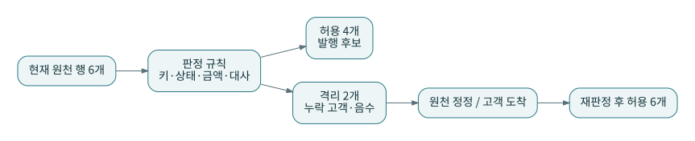

<a id="book-patterns-16-quality-contract-quarantine-md--1-무엇을-검사하는지부터-나눈다"></a>

### 1. 무엇을 검사하는지부터 나눈다

입력 파일이 모두 왔는지, 타입이 맞는지, 키가 유일한지, 고객 관계가 있는지, 헤더와 상세의 금액이 맞는지, 마트의 수치가 업무 정의에 맞는지를 구별한다. 행 수가 어제와 비슷하다고 금액도 옳은 것은 아니고, 금액이 맞아도 개인정보가 노출되지 않았다는 뜻은 아니다.

마당마켓의 `int_orders_classified`는 첫 번째 발견 이유를 `quality_status`로 기록한다. 한 행에 여러 오류가 있으면 모든 이유를 별도 오류 테이블에 남기는 확장도 가능하다. 현재 예제의 단일 사유 컬럼을 완전한 오류 추적 표준으로 일반화하지 않는다.

<a id="book-patterns-16-quality-contract-quarantine-md--2-격리는-조용히-버리기와-다르다"></a>

### 2. 격리는 조용히 버리기와 다르다

P4에는 음수 금액 주문 5007과 고객 104가 없는 주문 5006이 있다. 정상 주문 4건의 인정 매출은 95.00이다. 이 값은 전체 원천을 반영한 완전한 매출이라고 표시하면 안 된다. ‘격리 2건 존재, 일부 제외’라는 품질 상태가 함께 있어야 한다.

중요한 발행에서는 한 행이라도 격리되면 이전 공개 버전을 유지하도록 정할 수 있다. 탐색용 모델에서는 정상 행을 제공하되 제외 수량과 금액 범위를 표시할 수 있다. fail-open과 fail-closed의 선택은 소비 위험에 맞춰 명시한다.

<a id="book-patterns-16-quality-contract-quarantine-md--3-격리-데이터의-재진입"></a>

### 3. 격리 데이터의 재진입

P5에서 고객 104가 도착하고 5007의 금액이 10.00으로 정정된다. 격리 테이블에서 직접 값을 고쳐 넣는 대신 최신 원천과 규칙으로 다시 판정한다. 그 결과 정상 주문은 6건, 인정 매출은 130.00이 된다.

이미 발행한 과거 일별 매출도 달라진다. 해당 날짜만 다시 계산할지 새로운 발행 버전으로 전체를 공개할지 정해야 한다. 재진입은 단순 insert가 아니라 이전 결과와의 관계를 관리하는 문제다.

<a id="book-patterns-16-quality-contract-quarantine-md--4-핵심-검증-sql"></a>

### 4. 핵심 검증 SQL

```sql
-- dbt singular test: 결과가 0행이어야 통과
select a.customer_id
from {{ ref('dim_customer_history') }} a
join {{ ref('dim_customer_history') }} b
  on a.customer_id = b.customer_id and a.valid_from < b.valid_from
where a.valid_to is null or a.valid_to > b.valid_from
```

`unique`와 `not_null`만으로는 이 시점 조인의 안정성을 검사할 수 없다. 데이터 구조와 업무 규칙에 맞는 테스트가 필요하다.

<a id="book-patterns-16-quality-contract-quarantine-md--5-계약-변경"></a>

### 5. 계약 변경

새 컬럼을 추가하는 변경과 기존 컬럼의 의미를 바꾸는 변경은 다르다. 타입이 그대로여도 `revenue`에 취소 주문이 포함되기 시작하면 의미적 파괴 변경일 수 있다. 단위, 시간대, 상태 정책, late data 정책도 계약 문서에 포함한다.

모든 검사를 warning으로 바꿔 배치를 성공시키면 경고가 운영 기준을 대체한다. 어떤 오류가 발행을 막는지, 누가 예외를 승인할 수 있는지, 예외의 만료 시점을 정한다.

**연습:** P4의 dbt 실행이 성공했다고 매출 95.00을 확정값으로 공개할 수 있는가?

**해설:** 이 책에서는 품질 상태를 먼저 확인해야 한다. 실행 성공은 계산 수행을 뜻하고, 격리 정책에 따른 발행 승인은 별개의 단계다. 실제 공개 테이블은 검증된 후보로 전환하는 절차를 갖추는 것이 안전하다.

---

<a id="book-patterns-17-configuration-and-ownership-md"></a>

장별 원고: [patterns/17-configuration-and-ownership.md](patterns/17-configuration-and-ownership.md)

<a id="book-patterns-17-configuration-and-ownership-md--p17--설정-중앙화와-단일-소유자-스키마가-바뀌어도-sql은-유지하기"></a>

## P17 · 설정 중앙화와 단일 소유자: 스키마가 바뀌어도 SQL은 유지하기

물리 스키마와 논리 모델을 분리하면 환경 변경의 범위를 줄일 수 있다. dbt는 custom schema를 처리할 때 기본적으로 target schema를 포함해 개발 환경을 분리한다. 원하는 이름이 다르게 생겼다고 접두어를 무조건 제거하면 개발자끼리 충돌할 수 있다. [S16](#book-references-readme-md--s16)


<a id="book-patterns-17-configuration-and-ownership-md--1-네-계층의-이름은-한-곳에서-바꾼다"></a>

### 1. 네 계층의 이름은 한 곳에서 바꾼다

동봉 `lab/dbt/dbt_project.yml`에는 다음 변수가 있다.

```yaml
vars:
  raw_schema: l0_cus
  schema_l1: l1_cus
  schema_l2: l2_cus
  schema_l3: l3_cus
```

source YAML은 `raw_schema`를 읽고, 모델 폴더별 `+schema`는 해당 계층 변수를 읽는다. 이 로컬 프로젝트의 target schema가 `book_dev`이므로 L1의 실제 모델 스키마는 기본 동작상 `book_dev_l1_cus`가 된다. 입력은 bootstrap이 만든 `l0_cus`를 읽는다. 입력과 출력을 같은 이름 조립 규칙으로 다룬다고 가정하지 않는다.

<a id="book-patterns-17-configuration-and-ownership-md--2-카탈로그와-스키마를-분리한다"></a>

### 2. 카탈로그와 스키마를 분리한다

Trino 환경을 설계할 때는 source의 catalog와 model의 catalog가 다를 수 있다. `catalog.schema.identifier` 세 부분을 따로 관리한다. 문자열 전체를 `split('.')`로 대충 나누는 방식은 quoting이나 특수 이름에서 위험할 수 있다. 어댑터가 제공하는 relation 표현과 식별자 정책을 확인한다.

이 책의 SQLite 기준 실행기는 물리 스키마 대신 `lab_l1_cus__모델명` 형태로 namespace를 표현한다. 실제 dbt schema 생성기를 실행한 결과가 아니다. `--prefix renamed`로 이름만 바꿔도 결과가 같은지를 별도 검사한다.

<a id="book-patterns-17-configuration-and-ownership-md--3-기존-테이블만-허용하는-환경"></a>

### 3. 기존 테이블만 허용하는 환경

실습용 dbt table 모델은 테이블을 만들고 다시 생성할 수 있다. 이미 DBA가 만든 테이블만 사용해야 하는 운영 환경에 그대로 적용하면 정책 위반이다. 모델의 materialization, 초기 relation 탐지, 권한, 임시 테이블, rename·drop·comment·grant 동작까지 확인해야 한다.

`allow_relation_creation=false` 같은 조직별 플래그는 **기본 dbt의 보편적 안전 스위치가 아니다**. 사용자 정의 코드가 그 값을 읽고 실제 DDL을 차단하는지 검증해야 한다. YAML에 값을 적기만 하면 안전해진다고 가르치지 않는다.

이 책은 회사의 기존 테이블을 수정하는 코드를 포함하지 않는다. 모든 로컬 생성·삭제는 교육용 데이터베이스 안에서만 이뤄진다. 실습용 bootstrap에는 운영 접속 정보를 넣지 않는다.

<a id="book-patterns-17-configuration-and-ownership-md--4-물리-테이블마다-쓰기-소유자-하나"></a>

### 4. 물리 테이블마다 쓰기 소유자 하나

논리 모델 두 개가 같은 물리 테이블을 동시에 갱신하면 서로의 결과를 덮거나 중간 상태를 읽을 수 있다. 이름과 alias를 조합해 최종 relation 좌표를 만든 다음 중복 소유자를 검사한다. 외부 ETL도 같은 표를 쓰는지 확인해야 한다.

조회 권한과 쓰기 권한을 구별하고, 승인하지 않은 스키마에는 쓰지 못하도록 DB 계정 권한도 제한한다. 애플리케이션 수준의 검사만으로 모든 실수를 막으려 하지 않는다.

<a id="book-patterns-17-configuration-and-ownership-md--5-로그-위치도-중앙화한다"></a>

### 5. 로그 위치도 중앙화한다

로그 테이블의 catalog·schema·identifier, 파일 로그 디렉터리, 배치 ID는 환경 설정에서 관리한다. 주문 모델 SQL에 로그 위치를 반복 삽입하지 않는다. 로그 실패가 본 계산을 중단해야 하는지는 정책으로 정하되, 계산 성공과 로그 기록 실패를 둘 다 남길 수 있는 경로가 필요하다.

**연습:** `l1_cus`를 `silver_sales`로 바꾸려면 모든 SQL을 검색·치환해야 하는가?

**해설:** 논리 ref가 유지되고 물리 위치를 중앙 설정으로 결정했다면 폴더 설정·source/target 매핑을 바꾸는 것으로 범위를 줄일 수 있다. 다만 문서·권한·하류 소비자·외부 orchestration의 하드코딩도 함께 찾아야 한다. 이름 변경 자체가 데이터 이동이나 권한 변경을 수행하는 것은 아니다.

---

<a id="book-patterns-18-components-and-integration-md"></a>

장별 원고: [patterns/18-components-and-integration.md](patterns/18-components-and-integration.md)

<a id="book-patterns-18-components-and-integration-md--p18--컴포넌트와-통합-모델-계산을-나누고-쓰기는-한-곳으로"></a>

## P18 · 컴포넌트와 통합 모델: 계산을 나누고 쓰기는 한 곳으로

이 장은 기본 dbt 기능의 이름이 아니라 대형 SQL 프로젝트에서 사용할 수 있는 **교재의 설계 관용구**를 다룬다. 작은 컴포넌트는 계산 결과를 제공하고 통합 모델은 계약을 확인해 최종 출력을 구성하며 실제 쓰기는 하나의 소유자가 맡는다.

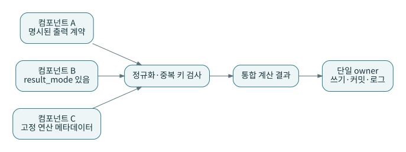

<a id="book-patterns-18-components-and-integration-md--1-sql-복사-대신-의미-있는-계산-단위"></a>

### 1. SQL 복사 대신 의미 있는 계산 단위

고객별 월간 주문 수, 취소 제외 금액, 최근 방문 여부를 여러 모델에서 반복 계산한다고 가정한다. 공통 계산을 분리하면 의미와 검증을 한 곳에 둘 수 있다. 하지만 모든 컴포넌트가 자동으로 물리 테이블이어야 하는 것은 아니다.

뷰·ephemeral·테이블 가운데 무엇을 고르는지는 계획 크기, 반복 평가, 조회 편의, 생성 권한, 갱신 비용으로 결정한다. dbt ephemeral은 하류 SQL의 CTE로 들어가며, 뷰로 바꾼다고 DB가 그 결과를 물리 저장하는 것은 아니다. [S29](#book-references-readme-md--s29)

<a id="book-patterns-18-components-and-integration-md--2-결과-형태와-연산-지시를-구별한다"></a>

### 2. 결과 형태와 연산 지시를 구별한다

조직별 통합 코드가 `result_mode` 컬럼으로 INSERT/UPDATE를 나누는 경우를 생각해 보자. 이 컬럼은 dbt 표준 컬럼이 아니다. 모든 컴포넌트가 이 컬럼을 반드시 포함하도록 강제할 필요는 없지만, 없을 때의 의미는 명시되어야 한다.

| 컴포넌트 | 출력 형태 | 통합자가 해석하는 근거 |
|---|---|---|
| 신규 고객 후보 | `customer_id, score` | 선언 메타데이터의 고정 `INSERT` |
| 기존 고객 수정 | `customer_id, score` | 선언 메타데이터의 고정 `UPDATE` |
| 신규·수정 혼합 | `customer_id, score, result_mode` | 각 행의 명시적 연산 값 |

통합자는 SELECT 문장의 표현만 보고 업무상 INSERT인지 UPDATE인지 추측하지 않는다. 대상과의 비교가 필요하다면 키 존재 판정의 기준 시점과 동시성 정책이 필요하다. SQL이 분명해 보인다는 감각 대신 명시된 출력 계약을 사용한다.

<a id="book-patterns-18-components-and-integration-md--3-정규화의-예"></a>

### 3. 정규화의 예

```sql
-- 설계용 예: 칼럼 없는 컴포넌트는 고정 연산을 명시적으로 부여한다.
select customer_id, score, 'INSERT' as result_mode
from component_new_customers
union all
select customer_id, score, 'UPDATE' as result_mode
from component_changed_customers
union all
select customer_id, score, result_mode
from component_mixed_customers
```

이 코드는 계산 결과를 합칠 뿐 실제 DML을 수행하지 않는다. 이후 미지원 연산, 키 누락, 한 키에 충돌하는 연산, 중복 출력, 대상 컬럼 순서·타입을 검사한다. `UNION`으로 중복을 숨기지 않는다. 같은 키의 여러 변경이 정당한 이벤트라면 이벤트 순서와 최종화 정책을 별도로 둔다.

<a id="book-patterns-18-components-and-integration-md--4-왜-단일-쓰기-소유자가-필요한가"></a>

### 4. 왜 단일 쓰기 소유자가 필요한가

컴포넌트가 각자 같은 테이블에 DML을 수행하면 하나가 성공하고 다른 하나가 실패했을 때 복구 범위가 모호해진다. 계산과 쓰기를 분리하면 후보 결과를 검증한 뒤 반영할 수 있다. 임시 테이블 생성이 금지된 환경이라면 승인된 staging 공간이나 기존 객체를 활용할 수 있는지 먼저 협의해야 한다.

이 책에는 `lab/examples/normalize_components.py`를 제공한다. 출력 계약 검증을 보여주는 Python 예제이며 dbt custom materialization이나 운영 DML 실행기가 아니다. 회사에서 사용하던 SQL·매크로를 옮긴 파일도 아니다.

<a id="book-patterns-18-components-and-integration-md--5-초기화와-빈-결과"></a>

### 5. 초기화와 빈 결과

‘출력 0행’은 오류일 수도 정상일 수도 있다. 새 고객이 없어서 0행이면 정상이고, 입력 파티션을 잘못 읽어서 0행이면 장애다. 0행을 무조건 성공 또는 실패로 처리하지 말고 입력 완전성·기대 범위와 함께 판단한다. 빈 UPDATE 결과가 대상 전체 삭제로 해석되지 않도록 인터페이스를 분리한다.

**연습:** `result_mode`가 없는 행에 자동으로 INSERT를 붙이면 편하지 않은가?

**해설:** 그 컴포넌트의 선언 계약이 INSERT일 때만 안전하다. 계약이 없으면 fail-closed로 거부해야 한다. 형식 누락을 임의의 쓰기 동작으로 바꾸지 않는다.

---

<a id="book-patterns-19-ci-cd-and-migration-md"></a>

장별 원고: [patterns/19-ci-cd-and-migration.md](patterns/19-ci-cd-and-migration.md)

<a id="book-patterns-19-ci-cd-and-migration-md--p19--cicdbluegreenstrangler-계산-성공에서-안전한-교체까지"></a>

## P19 · CI/CD·Blue–Green·Strangler: 계산 성공에서 안전한 교체까지

상태 기반 선택과 defer는 변경 검증 비용을 줄이는 도구이지만 기준 artifact와 참조 환경을 정확히 관리해야 한다. 기존 시스템을 부분적으로 새 시스템으로 옮기는 Strangler 접근도 이행 설계의 한 후보다. [S18](#book-references-readme-md--s18) [S31](#book-references-readme-md--s31) [S35](#book-references-readme-md--s35)


<a id="book-patterns-19-ci-cd-and-migration-md--1-기준선은-움직이지-않도록-저장한다"></a>

### 1. 기준선은 움직이지 않도록 저장한다

현재 작업이 만드는 `target/manifest.json`을 동시에 이전 상태 기준으로 사용하면 비교 대상이 덮일 수 있다. 배포된 버전의 artifact는 별도 읽기 전용 경로에 보관하고 코드 SHA, 의존성 버전, 입력 범위를 기록한다.

`state:modified+`처럼 하류를 포함하는 선택은 출발점이다. 변경되지 않았지만 새 환경에 없는 상류 relation, 운영과 다른 seed 값, 외부 source 변경, 환경 변수가 만든 물리 위치 차이를 추가로 검토한다. 선택이 짧다고 검증이 완전한 것은 아니다.

<a id="book-patterns-19-ci-cd-and-migration-md--2-후보-테이블을-먼저-검증한다"></a>

### 2. 후보 테이블을 먼저 검증한다


기존 공개 버전 v1을 유지한 채 후보 v2를 계산한다. 키·행 수·금액·시간대·소비 계약을 비교한 뒤 공개 포인터를 전환한다. 실패하면 v1을 유지한다. 실제 원자적 전환 방법은 DB와 커넥터가 지원하는 뷰 교체·rename·스냅샷 등에서 검증해야 한다.

이 예제에서 P4는 정상 행 계산 자체는 가능하지만 격리 2건이 있다. 운영 정책이 완전성 우선이라면 이 결과를 공개하지 않고 이전 버전을 유지한다. ‘dbt build 성공’과 ‘데이터 제품 발행 승인’을 구별하는 실제 이유다.

<a id="book-patterns-19-ci-cd-and-migration-md--3-기존-시스템과-병행-대사"></a>

### 3. 기존 시스템과 병행 대사

처음부터 모든 모델을 바꾸는 대신 주문 도메인부터 새 모델로 계산한다. 일정 기간 기존 결과와 비교하되, 합계가 다른 이유를 컬럼 정의·시점·중복·취소 정책으로 분류한다. 기존 결과가 언제나 정답이라고 가정하지 않는다. 둘이 같은 버그를 갖고 같은 숫자를 내는 경우도 가능하다.

마당마켓의 기준선은 사람이 미리 정한 단계별 기대값이다. 운영 이행에서는 독립 검증 쿼리와 업무 담당자의 정의 승인이 필요할 수 있다. 성능 검증과 의미 검증도 분리한다.

<a id="book-patterns-19-ci-cd-and-migration-md--4-롤백의-한계"></a>

### 4. 롤백의 한계

코드를 이전 버전으로 돌리는 것과 이미 변경된 데이터·외부 전송을 되돌리는 것은 다르다. 새 컬럼을 삭제하거나 과거 테이블을 drop한 뒤에는 코드만 롤백해도 복구되지 않을 수 있다. 호환 기간, 이전 결과 보존, 소비자 전환 상태, 재처리 입력을 함께 준비한다.

외부 CRM에 보낸 고객 점수를 되돌리려면 전송 버전과 보상 작업이 필요할 수 있다. SQL 트랜잭션 밖의 부작용을 배포 성공 여부 하나로 처리하지 않는다.

<a id="book-patterns-19-ci-cd-and-migration-md--5-최소-배포-기록"></a>

### 5. 최소 배포 기록

`governance/release-checklist.md`는 코드 식별자, 입력 배치, 변환 설정, 품질 결과, 발행 대상, 승인자, 복구 경로를 기록하는 양식이다. 기본값을 실제 승인 사실로 채우지 않는다. 미실행 항목은 미실행으로 남긴다.

**연습:** CI에서 defer로 운영 상류를 읽으면 안전한가?

**해설:** 읽기 권한과 민감정보 접근, 운영의 시점, 개발 모델의 기대 스키마를 검토해야 한다. 운영을 읽는 비용과 정책도 있다. defer는 환경 격리와 보안 정책을 자동으로 충족시키는 기능이 아니다.

---

<a id="book-patterns-20-observability-and-performance-md"></a>

장별 원고: [patterns/20-observability-and-performance.md](patterns/20-observability-and-performance.md)

<a id="book-patterns-20-observability-and-performance-md--p20--관측성능복구-어떤-층에서-실패했는지-알아내기"></a>

## P20 · 관측·성능·복구: 어떤 층에서 실패했는지 알아내기

dbt artifact는 프로젝트 구조와 실행 결과를 분석하는 자료다. 파일 종류·스키마 버전은 사용하는 dbt 버전에서 확인해야 한다. 원천 신선도 검사는 입력 최신성을 보는 수단이지만 배치 전체의 완전성이나 마트 발행을 모두 보증하지 않는다. [S30](#book-references-readme-md--s30) [S33](#book-references-readme-md--s33)


<a id="book-patterns-20-observability-and-performance-md--1-실패를-다섯-층으로-구분한다"></a>

### 1. 실패를 다섯 층으로 구분한다

입력이 덜 왔는지, 프로젝트 선언이 잘못됐는지, 쿼리 계획이 너무 큰지, 계산 결과가 업무 규칙을 위반했는지, 공개·외부 전달이 실패했는지를 구분한다. 오류를 읽자마자 재시도 횟수부터 늘리면 결정적인 선언 오류를 반복할 수 있다.

로그에는 batch_id와 attempt_id를 구별해 남긴다. 동일 배치의 두 번째 시도인지 새로운 입력 배치인지 알 수 있어야 한다. 모델 이름 외에도 relation 좌표, 코드 버전, 입력 범위, 검증 결과를 연결한다. 비밀키와 민감한 행 내용은 로그에 무분별하게 포함하지 않는다.

<a id="book-patterns-20-observability-and-performance-md--2-소스-신선도와-입력-완전성"></a>

### 2. 소스 신선도와 입력 완전성

가장 최근 타임스탬프가 오늘이라고 오늘의 모든 파일이 도착한 것은 아니다. 여러 원천 중 한 파일만 최신이어도 max timestamp는 새로워질 수 있다. 예상 파일 목록, 파티션별 건수, 배치 완료 표식 등 입력 계약에 맞는 검사로 보완한다.

P2의 늦은 주문 5005는 수신 시점은 새롭지만 주문일은 과거다. 신선도 필드를 무엇으로 정의했는지에 따라 의미가 달라진다. 사건시각과 수신시각을 모두 관측하는 이유다.

<a id="book-patterns-20-observability-and-performance-md--3-실행-계획이-너무-커질-때"></a>

### 3. 실행 계획이 너무 커질 때

ephemeral은 하류 SQL에 포함된다. 뷰로 바꾸면 저장된 질의 정의가 되지만 그 결과가 자동 실물화되지는 않는다. Trino의 WITH도 참조 위치에 인라인될 수 있다. 따라서 `ephemeral → view` 변경만으로 stage 제한이나 반복 계산 문제가 반드시 해결된다고 단정하지 않는다. [S29](#book-references-readme-md--s29) [S32](#book-references-readme-md--s32)

먼저 반복되는 큰 조인, UNION 분기, 불필요한 재참조를 찾는다. 필터와 사전 집계를 적절한 위치로 옮기고 중복 로직을 줄이는 안을 비교한다. 허용된다면 물리 중간 결과를 둘 수 있지만 생성 권한과 갱신 정책을 먼저 확인한다. 물리 테이블 금지 환경에서는 이를 몰래 우회하지 않는다.

<a id="book-patterns-20-observability-and-performance-md--4-재시도해야-할-오류와-고쳐야-할-오류"></a>

### 4. 재시도해야 할 오류와 고쳐야 할 오류

일시적 네트워크 실패와 잘못된 컬럼 이름은 다르다. 전자는 원인·부작용을 확인한 뒤 재시도할 수 있지만 후자는 코드나 계약을 바꿔야 한다. 데이터 검증 실패는 입력이 수정되지 않는 한 같은 결과를 낼 수 있다. 실패 분류에 따라 자동 재시도 여부와 호출할 담당자를 정한다.

파티션 이미 존재 오류를 무조건 테이블 삭제로 해결하지 않는다. 중복 등록인지, 동시 실행인지, 메타데이터와 파일 집합이 다른지 확인한다. 로그용 테이블이라도 삭제 가능하다고 가정하면 감사 기록을 잃을 수 있다.

<a id="book-patterns-20-observability-and-performance-md--5-성능-검증-양식"></a>

### 5. 성능 검증 양식

같은 입력 스냅샷과 결과 정의를 고정하고 계획 시간, 실행 시간, 읽은 행·바이트, 메모리, 스필, 출력 파일 수, 동시성 조건을 기록한다. 캐시가 따뜻한 실행과 첫 실행도 구별한다. 이 책은 실제 대형 클러스터 벤치마크를 수행하지 않았으므로 배속·비용 절감률을 제시하지 않는다.

**연습:** 92개의 기준 SQL 검사가 통과했으니 Trino 운영 성능도 검증됐는가?

**해설:** 아니다. 현재 검사는 작은 SQLite 데이터에서 논리 결과를 확인한다. 운영의 분산 계획·어댑터·권한·동시성·데이터 규모는 별도의 시험 대상이다.

---

<a id="book-patterns-21-security-and-serving-md"></a>

장별 원고: [patterns/21-security-and-serving.md](patterns/21-security-and-serving.md)

<a id="book-patterns-21-security-and-serving-md--p21--보안과-외부-제공-모델의-끝이-데이터-책임의-끝은-아니다"></a>

## P21 · 보안과 외부 제공: 모델의 끝이 데이터 책임의 끝은 아니다

이 장은 제품·법률별 준수 인증을 제공하지 않는다. 교육용 설계에서 접근 최소화, 식별정보 분리, 공개 계약, 외부 전달의 재시도 경계를 어떻게 질문해야 하는지 다룬다. 실제 보안·법적 판단은 해당 조직의 정책과 전문가 검토를 거쳐야 한다.


<a id="book-patterns-21-security-and-serving-md--1-원천-전체를-모든-모델에-전달하지-않는다"></a>

### 1. 원천 전체를 모든 모델에 전달하지 않는다

분석에 고객번호와 구분값만 필요하다면 이름·전화번호·주소를 모든 계층에 복제할 이유가 없다. 원천 접근 계정, 정제 계정, 소비 계정의 권한을 분리한다. 공개 마트에는 허용된 컬럼을 명시한다.

익명처럼 보이는 키도 다른 데이터와 결합하면 식별될 수 있다. 단순 해시가 항상 익명화를 뜻한다고 가르치지 않는다. 원천 키와 분석 키의 매핑은 목적과 접근권한에 맞게 관리한다. 이 교재 데이터에는 실제 고객 개인정보를 사용하지 않는다.

<a id="book-patterns-21-security-and-serving-md--2-보존과-복구의-긴장"></a>

### 2. 보존과 복구의 긴장

원본을 오래 보존하면 재현에 유리할 수 있지만 모든 데이터를 무기한 보존해야 한다는 결론은 아니다. 원본·정제·마트·캐시·백업·외부 전달 각각에 보존 목적과 책임을 적는다. 만료·삭제와 재처리가 충돌할 수 있으므로 어느 시점까지 어떤 결과를 재현할 수 있는지도 명시한다.

과거 테이블이나 스냅샷에 개인정보가 남아 있는데 현재 마트에서만 지웠다면 제거 범위가 불완전할 수 있다. 반대로 업무상 익명 집계와 원천 식별정보의 보존 조건이 다를 수 있으므로 데이터 유형을 구분해 검토한다.

<a id="book-patterns-21-security-and-serving-md--3-reverse-etl과-분석-결과의-제공"></a>

### 3. Reverse ETL과 분석 결과의 제공

마당마켓이 고객 점수를 CRM으로 보내는 경우를 생각한다. 계산 모델은 점수와 산출 버전을 만들고, 전송자는 `(customer_id, score_version)` 같은 멱등 키로 대상에 전달할 수 있다. 실패 시 동일 버전을 다시 보내도 중복 효과가 생기지 않는지 대상 API의 계약을 확인한다.

대상 응답을 받지 못했다고 반드시 쓰기가 실패한 것은 아니다. 응답이 유실되었을 수 있다. 무조건 새 요청 ID로 보내면 중복 적용될 수 있으므로 수신 확인·조회·재시도 상태를 설계해야 한다.

<a id="book-patterns-21-security-and-serving-md--4-한-지표를-여러-소비자가-사용한다"></a>

### 4. 한 지표를 여러 소비자가 사용한다

BI 화면, API, CSV 내보내기에서 같은 지표를 제공하려면 지표 버전, 통화 단위, 시점과 품질 상태가 함께 움직여야 한다. MRR과 주문 인정 매출처럼 서로 다른 측정을 임의로 더하지 않는다. 낮은 지연이 필요한 운영 의사결정과 일별 분석도 분리한다.

노출 대상 모델의 의미와 사용처를 문서화하면 변경 시 실제 소비자를 확인할 수 있다. 소유자가 없는 CSV 파일은 시간이 지나며 또 다른 원천처럼 취급될 수 있으므로 만료와 재생성 경로를 명시한다.

<a id="book-patterns-21-security-and-serving-md--5-상점의-공개-계약-예"></a>

### 5. 상점의 공개 계약 예

공개 매출은 `order_date`, `recognized_cents`, `metric_version`, `published_batch`, `quality_state`로 표현한다고 가정한다. 현재 실행 모델은 앞의 두 데이터 컬럼을 계산하며 나머지 발행 메타데이터는 운영 설계 과제다. 구현하지 않은 컬럼을 실제 출력처럼 설명하지 않는다.

**연습:** 로그를 자세히 남기기 위해 실패한 원천 행 전체를 기록해도 되는가?

**해설:** 진단에 필요한 최소 정보와 보안 정책을 먼저 확인한다. 원천 추적용 식별자·오류 코드만으로 충분할 수 있고, 민감 payload는 별도 제한 공간이 필요할 수 있다. 로그 접근권한과 보존기간도 데이터 정책에 포함한다.

---

<a id="book-patterns-22-pattern-selection-case-studies-md"></a>

장별 원고: [patterns/22-pattern-selection-case-studies.md](patterns/22-pattern-selection-case-studies.md)

<a id="book-patterns-22-pattern-selection-case-studies-md--p22--패턴-선택-사례-같은-도구-서로-다른-정답"></a>

## P22 · 패턴 선택 사례: 같은 도구, 서로 다른 정답

이 장의 판단은 교재의 가정에서 도출한 설계 예시다. 특정 아키텍처가 언제나 더 싸거나 빠르다는 벤치마크 결과가 아니다. 상황마다 데이터량보다 지연, 정정, 조직 책임, 재현 요구를 먼저 적는다.


<a id="book-patterns-22-pattern-selection-case-studies-md--사례-a-직원-두-명의-온라인-상점"></a>

### 사례 A. 직원 두 명의 온라인 상점

원천 하나, 매일 오전 보고, 하루 지연 허용, 과거 주문 정정 가능이라는 조건이다. 단일 배치와 원본 보존, staging–intermediate–mart를 시작점으로 선택한다. 데이터 품질 경계를 메달리온 용어로 설명할 수 있지만 색 이름을 쓰는 것이 필수는 아니다.

카파를 보류하는 이유는 스트림이 나빠서가 아니라 낮은 지연 요구가 없고 로그·상태 운영 비용이 추가되기 때문이다. Data Vault도 과거 원천이 많고 감사 요구가 커질 때 다시 검토한다. 지금은 업무 키·정정 시각·원본 보존을 준비하는 것이 더 직접적이다.

<a id="book-patterns-22-pattern-selection-case-studies-md--사례-b-여러-사업부와-고객-통합"></a>

### 사례 B. 여러 사업부와 고객 통합

온라인·매장·구독의 고객 키가 다르고 전사 고객 수가 핵심 보고라고 가정한다. 중앙 식별 코어와 허브앤스포크를 검토한다. 마트의 단계적 납품에는 버스 매트릭스를 함께 사용한다. 통합 코어와 업무별 차원 모델은 결합 가능하다.

실패 위험은 중앙팀 병목이다. 공통 의미와 사업부 고유 지표의 경계를 분리하고 변경 승인과 호환 기간을 정한다. 고객 ID 숫자만 같으면 같은 사람이라는 가정은 하지 않는다.

<a id="book-patterns-22-pattern-selection-case-studies-md--사례-c-짧은-지연의-웹-운영-모니터"></a>

### 사례 C. 짧은 지연의 웹 운영 모니터

분 단위 이상 반응이 늦으면 운영 가치가 떨어진다고 가정한다. 스트림 처리와 카파식 재생을 후보에 올린다. 장기간 과거 재계산과 빠른 잠정값의 별도 경로가 필요하고 두 경로를 운영할 수 있다면 람다도 비교한다.

분 단위 조건은 이 사례의 가정이지 특정 도구의 성능 보장값이 아니다. 실제로 필요한 응답 시간, 늦은 이벤트 비율, 재생 시간, 상태 크기를 측정해야 한다. dbt를 메시지 소비자나 온라인 결제 엔진으로 잘못 배치하지 않는다.

<a id="book-patterns-22-pattern-selection-case-studies-md--사례-d-합병으로-원천이-계속-늘어나는-기업"></a>

### 사례 D. 합병으로 원천이 계속 늘어나는 기업

다양한 원천의 키·관계·이력을 보존해야 한다면 Vault 중심 통합을 검토할 수 있다. 다만 팀의 자동화 능력과 소비용 모델 생성 비용이 필요하다. Silver 통합을 Vault로 두고 Gold를 스타 모델로 제공하는 조합을 비교한다.

채택 여부를 원천 개수 하나로 결정하지 않는다. 이력 추적성, 업무 키 안정성, 변경 주기, 데이터 품질 보정 방식이 더 중요할 수 있다. 단순한 현황 보고를 위해 복잡한 구조를 선택하면 운영 부담만 늘 수 있다.

<a id="book-patterns-22-pattern-selection-case-studies-md--사례-e-독립적인-도메인-팀이-빠르게-변경한다"></a>

### 사례 E. 독립적인 도메인 팀이 빠르게 변경한다

고객·주문·구독팀이 독립 배포와 명확한 제품 책임을 갖는다면 메시 원칙을 검토한다. 공통 플랫폼은 배포·권한·관측의 반복 작업을 줄이고 도메인은 업무 의미를 책임진다. 모든 팀에 각각의 데이터 인프라를 복제하라는 뜻은 아니다.

메타데이터·정책·연합 접근을 도와주는 패브릭 성격의 도구를 함께 사용할 수 있다. 조직 구조와 기술 관리 기능을 같은 선택지로 놓고 억지로 하나만 고르지 않는다.

<a id="book-patterns-22-pattern-selection-case-studies-md--마당마켓의-최종-선택"></a>

### 마당마켓의 최종 선택


기본 상점은 단일 배치를 유지한다. 메달리온식 품질 경계와 dbt 계층형 DAG를 결합하고, 주문·상세 팩트와 고객 이력 차원을 제공한다. 변경 키 재계산과 전체 결과 동등성을 검증하고, 격리 상태를 발행 판단에 연결한다. 중앙 설정과 단일 쓰기 소유자, 후보 결과 검증 후 공개라는 운영 원칙을 더한다.

람다·카파·Vault·메시는 배제한 것이 아니라 요구가 바뀔 때 꺼내 볼 대안으로 남긴다. 설계의 성숙함은 사용한 패턴 수가 아니라 필요한 문제를 설명하고 실패했을 때 복구할 수 있는 정도로 평가한다.

---

<a id="book-patterns-23-design-review-workbook-md"></a>

장별 원고: [patterns/23-design-review-workbook.md](patterns/23-design-review-workbook.md)

<a id="book-patterns-23-design-review-workbook-md--p23--설계-리뷰-워크북과-안티패턴-사전"></a>

## P23 · 설계 리뷰 워크북과 안티패턴 사전

이 장은 팀이 실제 설계 문서를 작성할 때 사용할 수 있는 질문과 해설이다. 빈 항목을 ‘확인 완료’로 바꾸지 않는다. 코드 실행 여부, 업무 정의 승인 여부, 운영 검증 여부를 따로 기록한다.

<a id="book-patterns-23-design-review-workbook-md--1-아키텍처-결정-기록"></a>

### 1. 아키텍처 결정 기록

`governance/adr-001-architecture.md`는 마당마켓의 결정 예시다. 목적, 고려한 후보, 선택한 조합, 보류한 패턴, 복구 전제, 재검토 조건을 한 문서로 묶는다. 일반적인 ADR 양식을 사용하는 교재 예이며 특정 제품 기능이 아니다.

다음 질문에 답하지 못하면 패턴 이름을 먼저 정한 설계일 수 있다. 누구에게 어떤 값을 제공하는가? 허용 지연은 얼마인가? 과거 어느 범위까지 정정되는가? 데이터와 코드가 바뀌면 과거 보고서를 재현할 수 있는가? 실패했을 때 이전 결과를 유지할 것인가?

<a id="book-patterns-23-design-review-workbook-md--2-모델-계약-리뷰"></a>

### 2. 모델 계약 리뷰

| 질문 | 마당마켓의 답 | 흔한 실패 |
|---|---|---|
| fct_orders 한 행은? | 정상 현재 주문 1건 | 상세 조인 뒤에도 주문이라고 설명 |
| 인정 매출의 상태는? | paid/shipped/delivered | placed·cancelled까지 합산 |
| 금액 단위는? | 동일한 교육용 통화의 cents | float·원·달러 혼합 |
| 고객이 늦게 오면? | 격리 후 고객 도착 시 재판정 | 영구 누락 또는 INNER JOIN으로 은폐 |
| 주문 삭제는? | 최신 tombstone이면 현재에서 제외 | 삭제를 먼저 걸러 과거 행 부활 |
| 과거 등급은? | 주문일의 유효 구간으로 선택 | 현재 VIP로 모든 과거 재분류 |

<a id="book-patterns-23-design-review-workbook-md--3-시험해야-하는-실패-주입"></a>

### 3. 시험해야 하는 실패 주입

동일 이벤트를 두 번 전달하고, 오래된 버전을 늦게 전달하고, 고객 없이 주문을 먼저 보내고, 음수 금액을 넣고, 최신 삭제 이벤트를 보낸다. 이후 정정 입력을 넣어 재진입되는지 확인한다. 모델 SQL만 보고 이 사례들을 모두 예상할 수 있는지 검토한다.

쿼리 실패뿐 아니라 읽기 성공·쓰기 실패, 쓰기 성공·응답 유실, 품질 실패·계산 성공, 공개 포인터 전환 실패도 별도 시나리오다. 현재 로컬 실습은 일부 데이터 논리 실패만 재현한다. 네트워크·동시성·외부 부작용은 운영 시험 항목으로 구분한다.

<a id="book-patterns-23-design-review-workbook-md--4-안티패턴의-교정"></a>

### 4. 안티패턴의 교정

**이름으로 품질을 보장한다.** `gold_orders`라고 명명해도 누락·중복·통화 오류는 남을 수 있다. 계약과 검사 결과로 보증한다.

**스키마명을 SQL마다 적는다.** 이름 변경이 대규모 검색·치환으로 번진다. source/ref와 중앙 매핑으로 줄이고 외부 소비도 점검한다.

**증분이면 항상 빠르고 정확하다.** 변환 영향 키가 누락되면 빠르게 틀린 결과를 만든다. 전체 계산 기준선과 동등성 검증을 먼저 만든다.

**뷰로 바꾸면 실행 단계가 끊어진다.** 저장된 질의 정의와 물리 결과를 혼동한 것이다. 실제 계획을 확인한다.

**계약을 통과하면 업무 의미도 맞다.** 같은 타입의 금액 컬럼이라도 취소 정책이 바뀌면 의미가 달라진다. 의미 계약과 구조 검사를 구분한다.

**결과 0행이면 성공이다.** 신규 데이터가 없을 수도, 입력을 잘못 읽었을 수도 있다. 완전성 계약과 기대 범위가 필요하다.

**로그만 실패했으니 지운다.** 계산과 기록의 부분 실패를 추적할 수 없게 된다. 별도 오류 경로와 배치·시도 식별자를 둔다.

<a id="book-patterns-23-design-review-workbook-md--5-마지막-종합-문제"></a>

### 5. 마지막 종합 문제

상점은 P4에서 주문 6건을 관측했지만 2건을 격리했다. 고객팀이 P5에서 고객 104를 제공했고, 주문팀은 5007의 금액을 정정했다. 다음을 설명해 보자.

첫째, 주문 5006에 변경 이벤트가 없더라도 왜 다시 계산해야 하는가? 고객 참조의 변경으로 품질 상태가 바뀌기 때문이다.

둘째, P4의 95.00과 P5의 130.00 차이 35.00은 무엇인가? 5006의 25.00과 정정된 5007의 10.00이 정상으로 들어온 결과다.

셋째, 5004가 돌아오면 왜 오류인가? 최신 tombstone을 적용한 상태에서 과거 행을 잘못 부활시켰을 가능성이 있다.

넷째, 이 전체를 카파라고 불러도 되는가? 로컬 재계산 예제만으로는 스트림 로그·상태·체크포인트가 운영되는 카파 배포를 구성했다고 할 수 없다. 이 예제는 관련 원리를 배우는 기준 SQL 실습이다.

<a id="book-patterns-23-design-review-workbook-md--6-완료-정의"></a>

### 6. 완료 정의

독자가 데이터 흐름을 설명하고, 고정 입력으로 재현하고, 반례를 제시하고, 결과의 의미를 검증하고, 적용하지 않은 패턴의 이유까지 말할 수 있으면 이 확장편의 학습 목표를 달성한 것이다. 운영 배포 완료 여부는 별도 통합 시험과 승인으로 결정한다.

---

<a id="book-patterns-24-anchor-modeling-md"></a>

장별 원고: [patterns/24-anchor-modeling.md](patterns/24-anchor-modeling.md)

<a id="book-patterns-24-anchor-modeling-md--p24--anchor-modeling-속성의-시간-변화를-더-작게-분리하기"></a>

## P24 · Anchor Modeling: 속성의 시간 변화를 더 작게 분리하기

Anchor Modeling은 엔터티 식별, 속성, 관계 등을 나누어 데이터와 시간 변화를 표현하는 접근이다. 공식 프로젝트가 모델링 도구와 자료를 제공한다. 이 장은 마당마켓의 고객 등급을 통해 속성 이력 분리의 의미를 살펴본다. [S28](#book-references-readme-md--s28)

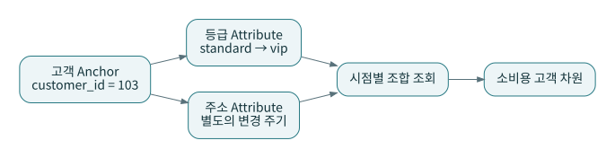

<a id="book-patterns-24-anchor-modeling-md--1-왜-이런-대안이-필요한가"></a>

### 1. 왜 이런 대안이 필요한가

고객의 주소는 자주 바뀌고 등급은 드물게 바뀌며, 특정 속성은 긴 기간 알 수 없을 수 있다. 모든 속성을 같은 넓은 SCD2 행으로 관리하면 한 속성의 변경이 전체 행 버전을 만든다. 속성을 별도로 시간 관리하면 무엇이 언제 바뀌었는지를 더 작은 단위로 표현할 수 있다.

그 대신 읽을 때 여러 속성과 시간 조건을 다시 조합해야 한다. 모델 생성·조회 보조·메타데이터 관리 없이 테이블만 잘게 나누면 복잡성만 늘 수 있다. 속성 분리가 언제 유리한지는 변경 빈도·조회 목적·엔진 특성에 따라 판단한다.

<a id="book-patterns-24-anchor-modeling-md--2-네-구성-요소를-구별한다"></a>

### 2. 네 구성 요소를 구별한다

Anchor는 엔터티의 안정적인 식별을, Attribute는 속성을, Tie는 관계를, Knot는 재사용되는 값 집합을 표현하는 구성으로 이해한다. 모든 모델에 네 요소를 무조건 만들어야 한다는 뜻은 아니다. 공식 생성기와 정식 방법론의 자세한 규칙은 원문 자료에서 확인한다. [S28](#book-references-readme-md--s28)

마당마켓의 축소 실습은 고객 Anchor와 등급 Attribute만 만든다. Tie·Knot·모든 시점 질의·제약 생성까지 구현하지 않았으므로 이것을 완전한 Anchor Modeling 구현이라고 부르지 않는다.

<a id="book-patterns-24-anchor-modeling-md--3-같은-고객-103을-표현한다"></a>

### 3. 같은 고객 103을 표현한다

```sql
-- lab/comparisons/05-anchor-fragment.sql의 핵심
create table cmp_anchor_customer as
select distinct customer_id from {{ source('shop_raw','customer_changes') }};

create table cmp_attribute_segment as
select customer_id, effective_from as valid_from, segment
from {{ source('shop_raw','customer_changes') }};
```

고객 103의 식별자 행은 하나다. segment의 변화는 별도 테이블에서 유효시점별로 남는다. 고객의 현재 속성이 필요한 소비 모델과 주문 당시 속성이 필요한 소비 모델은 서로 다른 조회 조건을 사용한다. 같은 데이터 표현에서도 시간 질문은 사라지지 않는다.

<a id="book-patterns-24-anchor-modeling-md--4-data-vault와-비교한다"></a>

### 4. Data Vault와 비교한다

둘 다 식별·관계·변경을 분리해 이해하도록 돕지만, 구성 단위와 방법론의 규칙을 같은 것으로 취급하지 않는다. Vault의 Hub·Link·Satellite를 이름만 Anchor·Tie·Attribute로 바꾸면 자동으로 Anchor Modeling이 되는 것은 아니다. [P09](#book-patterns-09-data-vault-md)의 원천 추적과 이력 보존 목적을 함께 비교한다.

이 책의 두 비교 분기는 동일 고객·주문 fixture로 구조 차이를 보여주는 단편이다. 적재시각·다중 원천·해시 canonicalization·충돌·관계 유효성 등 운영 수준 문제를 모두 해결한 것으로 표시하지 않는다.

<a id="book-patterns-24-anchor-modeling-md--5-실행하고-무엇을-확인할-것인가"></a>

### 5. 실행하고 무엇을 확인할 것인가

```bash
python lab/run_comparisons.py --output reports/model-comparisons.json
```

P3·P4·P5에서 같은 정상 현재 주문 결과와 고객의 현재 등급이 나오는지 행 단위로 비교한다. 이 검사는 현재 상태 소비의 동등성을 보이며, 전체 시간 질의의 동등성이나 성능 우위를 증명하지 않는다. 주문 당시 등급 검사는 별도로 J09의 시간 구간 모델에서 수행한다.

<a id="book-patterns-24-anchor-modeling-md--6-마당마켓의-채택-판단"></a>

### 6. 마당마켓의 채택 판단

기본 상점은 현재의 작은 고객 속성·간단한 이력 요구로 충분하므로 SCD2 구간 모델을 유지한다. 속성별 변경 주기·희소성·확장 요구가 커지고 자동화 도구를 운영할 수 있을 때 Anchor를 다시 비교한다. 채택하지 않는 이유까지 남겨야 패턴 사전이 실제 의사결정 도구가 된다.

**연습:** 고객 이메일만 바뀌었는데 고객의 모든 속성 이력을 복제해야 하는가? 선택한 모델이 무엇을 한 버전으로 취급하는지에 달려 있다. 행 단위 SCD2와 속성별 시간 관리는 서로 다른 변경 단위를 선택한 설계다.

---

<a id="book-patterns-25-architecture-comparison-atlas-md"></a>

장별 원고: [patterns/25-architecture-comparison-atlas.md](patterns/25-architecture-comparison-atlas.md)

<a id="book-patterns-25-architecture-comparison-atlas-md--p25--아키텍처-비교표-메달리온-외의-대안을-한-장에서-찾기"></a>

## P25 · 아키텍처 비교표: 메달리온 외의 대안을 한 장에서 찾기

‘메달리온 말고 다른 패턴이 있는가?’에 대한 답을 찾는 독자는 이 표에서 시작하면 된다. 유명한 이름을 나열하는 데 그치지 않고 같은 마당마켓에 어떤 요구가 생기면 검토할지 연결했다. 각 행의 개념·출처·한계는 링크된 장에 있다.

<a id="book-patterns-25-architecture-comparison-atlas-md--1-아키텍처통합-방식"></a>

### 1. 아키텍처·통합 방식

| 후보 | 우선 해결하려는 문제 | 마당마켓의 검토 계기 | 놓치기 쉬운 비용 | 상세 |
| --- | --- | --- | --- | --- |
| 메달리온 | 원본에서 소비 데이터까지 품질 책임 분리 | 원천·검증·공개가 뒤섞임 | 불필요한 중간 복사와 책임 없는 이름만의 계층 | [P01](#book-patterns-01-medallion-md) |
| 허브앤스포크 | 중앙에서 원천을 통합한 후 종속 마트 제공 | POS·CRM·온라인 고객의 정합성 | 중앙팀 병목과 통합 납기 | [P02](#book-patterns-02-hub-and-spoke-md) |
| Kimball 버스 | 공통 차원으로 업무별 데이터마트를 연결 | 주문·구독·환불의 공통 고객/날짜 | 차원 의미와 키의 협의 | [P03](#book-patterns-03-kimball-bus-md) |
| 람다 | 배치 재계산과 저지연 결과를 병행 | 확정 과거와 빠른 잠정값 모두 필요 | 두 경로의 로직·경계·대사 | [P04](#book-patterns-04-lambda-md) |
| 카파 | 보존 로그와 단일 처리 로직으로 재생 | 스트림 상태와 과거 재생을 같은 경로로 운영 | 로그 보존·상태·replay·전환 | [P05](#book-patterns-05-kappa-md) |
| 레이크하우스 | 객체 저장과 테이블 관리·분석 접근 결합 | 파일·테이블·여러 엔진의 역할을 정리 | 메타데이터·파일 관리·동시 쓰기 | [P06](#book-patterns-06-lakehouse-md) |
| 데이터 메시 | 도메인 소유권과 데이터 제품 계약 | 독립 팀이 공개 모델을 운영 | 셀프서비스·연합 거버넌스의 실제 구현 | [P07](#book-patterns-07-data-mesh-md) |
| 패브릭·가상화·연합 조회 | 분산 데이터의 접근·메타데이터·정책 통합 | 데이터 이동 없이 탐색하거나 관리 연결 | 원천 부하·일관성·장애 전파 | [P08](#book-patterns-08-data-fabric-and-federation-md) |
| Vault 중심 통합 | 업무 키·관계·원천 속성 이력 보존 | 원천 합병과 감사·변경 요구 확대 | 자동 적재·소비 마트·시간 규칙 | [P09](#book-patterns-09-data-vault-md) |

메시와 레이크하우스처럼 초점이 다른 항목을 억지로 하나만 고르지 않는다. 반대로 동일 입력의 기본 처리 경로를 정할 때 단일 배치·람다·카파는 지연·재처리·운영 조건을 놓고 비교해야 한다.

<a id="book-patterns-25-architecture-comparison-atlas-md--2-그-안에-놓을-데이터-모델"></a>

### 2. 그 안에 놓을 데이터 모델

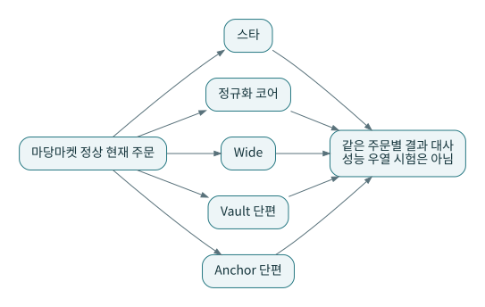

| 모델 | 선택 질문 | 주의점 |
| --- | --- | --- |
| 정규화 코어 | 중복·관계·통합 규칙을 명시할 필요가 있는가? | 소비 질의의 조인 비용·복잡성을 함께 관리 |
| 스타 | 명확한 팩트 grain과 차원으로 반복 분석하는가? | 사실과 차원의 시점·중복 키 검사 |
| 스노플레이크 | 차원 내부의 계층·공통 속성을 분리할 이득이 있는가? | 차원 정규화 자체가 항상 빠른 것은 아님 |
| Wide / OBT | 특정 소비 질문을 간단히 읽게 할 것인가? | 목적이 달라지면 의미 중복과 갱신 비용 증가 |
| Data Vault | 원천 키·관계·속성 이력을 체계적으로 보존하는가? | 소비용 단순화와 운영 자동화 필요 |
| Anchor Modeling | 속성별 변경·시간을 더 작은 단위로 관리하는가? | 작은 테이블을 많이 만드는 것만으로 구현 완성 아님 |

자세한 모델링은 [P11](#book-patterns-11-star-snowflake-wide-md), [P12](#book-patterns-12-fact-patterns-md), [P13](#book-patterns-13-history-and-temporal-md), [P24](#book-patterns-24-anchor-modeling-md)를 참고한다. 비교 SQL은 여섯 파일이며 전사 아키텍처를 배포하지 않는다.

<a id="book-patterns-25-architecture-comparison-atlas-md--3-변경-처리품질운영의-추가-패턴"></a>

### 3. 변경 처리·품질·운영의 추가 패턴

CDC·outbox·이벤트 소싱은 원천 변경을 어떻게 기록·전달할지, SCD·이중 시간은 과거 상태를 어떻게 해석할지, 증분·backfill·멱등성은 어떻게 다시 계산할지를 다룬다. 격리·계약·quality gate는 공개 가능 여부를, 단일 쓰기 owner·상태 기반 CI·후보 발행·관측은 운영 책임을 다룬다.

이 요소를 각각 분리해 학습한 뒤 J15에서 조합한다. 모든 기능을 하나의 거대한 매크로로 숨겨버리면 독자가 실패 위치를 이해하기 어려워진다. 의존성과 데이터 계약이 보이는 작은 모델에서 시작한다.

<a id="book-patterns-25-architecture-comparison-atlas-md--4-실제-선택-기록의-최소-양식"></a>

### 4. 실제 선택 기록의 최소 양식

현재 문제, 고정한 가정, 검토한 후보, 선택 이유, 보류 이유, 실패·복구 계획, 재검토 신호를 적는다. 요구를 측정하기 전부터 ‘카파로 가야 한다’ 또는 ‘Gold면 안전하다’고 결론내리지 않는다. [설계 결정 기록](#book-governance-adr-001-architecture-md)에 마당마켓의 완성 예시가 있다.

<a id="book-patterns-25-architecture-comparison-atlas-md--5-출판-후-유지관리"></a>

### 5. 출판 후 유지관리

새 패턴을 추가할 때는 독자가 기존 패턴과 무엇을 비교해야 하는지부터 적는다. 모든 패턴에 동일한 행·컬럼 수를 맞추려고 의미 없는 스크린샷을 반복하지 않는다. 코드가 있는 장은 입력·기대 결과·실패 반례를 연결하고, 인프라 개념도만 있는 장은 실행된 시스템처럼 포장하지 않는다. 외부 문서의 확인일과 실제 실행 버전도 별도로 기록한다.

---

<a id="book-chapters-reference-v3-00-introduction-and-reading-guide-md"></a>

장별 원고: [chapters/reference-v3/00-introduction-and-reading-guide.md](chapters/reference-v3/00-introduction-and-reading-guide.md)

<a id="book-chapters-reference-v3-00-introduction-and-reading-guide-md--이-책을-읽는-방법"></a>

## 이 책을 읽는 방법

> **마당마켓 본편 연결:** [J00 · 마당마켓: 한 개의 상점으로 처음부터 끝까지](#book-journey-00-madang-market-md)에서 같은 상점의 누적 실습으로 돌아갈 수 있다. 이 참고편의 `codes/` 스니펫에는 독립 fixture가 포함되어 있으며 본편 `lab/`의 P1~P5와 섞지 않는다. 플랫폼별 구문·기능은 실행 버전에 맞춰 재확인한다.


이 책은 dbt를 처음 배우는 사람도 따라올 수 있도록 앞쪽에서 기본 개념과 작업 흐름을 충분히 설명하고, 뒤로 갈수록 운영, 거버넌스, semantic layer, casebook, platform playbook으로 서서히 확장되도록 설계했다.

핵심은 세 가지다.

1. 앞쪽 챕터에서 공통 원리를 배운다.  
2. 중간의 casebook에서 세 예제가 어떻게 자라나는지 확인한다.  
3. 뒤쪽의 platform playbook에서 같은 설계를 각 플랫폼에 어떻게 옮기는지 본다.  

<a id="book-chapters-reference-v3-00-introduction-and-reading-guide-md--세-가지-연속-예제"></a>

### 세 가지 연속 예제

이 책은 세 예제를 처음부터 끝까지 끌고 간다.

1. Retail Orders  
2. Event Stream  
3. Subscription & Billing  

각 예제는 day1/day2 데이터, expected 결과, snippets, bootstrap 경로를 함께 제공한다.

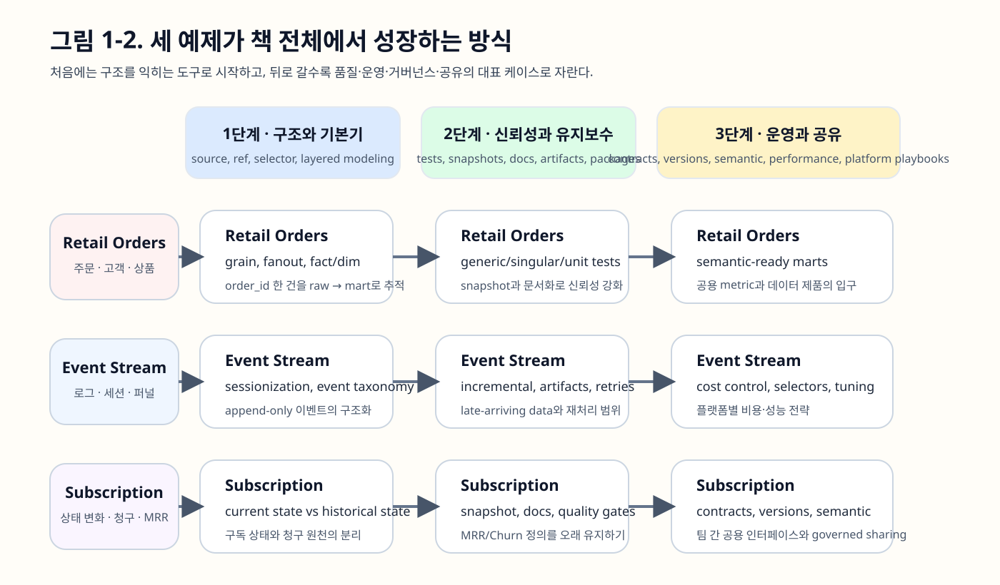

<a id="book-chapters-reference-v3-00-introduction-and-reading-guide-md--권장-읽기-경로"></a>

### 권장 읽기 경로

| 독자 유형 | 먼저 읽을 부분 | 그 다음 볼 부분 |
| --- | --- | --- |
| dbt를 처음 배우는 사람 | Chapter 01 → 05 | Chapter 09~11, Chapter 12 |
| 실무 프로젝트를 맡은 사람 | Chapter 01 → 08 | 해당 casebook + 해당 platform playbook |
| 리드, 플랫폼 오너 | Chapter 05 → 08 | Chapter 17~20, Appendix D |

<a id="book-chapters-reference-v3-00-introduction-and-reading-guide-md--전체-목차"></a>

### 전체 목차

<a id="book-chapters-reference-v3-00-introduction-and-reading-guide-md--1-핵심-개념과-기본기"></a>

#### 1. 핵심 개념과 기본기

1.1. [DBT overview and three example tracks](#book-chapters-reference-v3-01-dbt-overview-and-three-example-tracks-md)  
1.2. [Development environment, project structure, commands, and Jinja](#book-chapters-reference-v3-02-development-environment-project-structure-commands-and-jinja-md)  
1.3. [Source/ref, selectors, layered modeling, grain, and materializations](#book-chapters-reference-v3-03-source-ref-selectors-layered-modeling-grain-and-materializations-md)  
1.4. [Tests, seeds, snapshots, documentation, macros, and packages](#book-chapters-reference-v3-04-tests-seeds-snapshots-documentation-macros-and-packages-md)  

<a id="book-chapters-reference-v3-00-introduction-and-reading-guide-md--2-신뢰성-운영-거버넌스-확장"></a>

#### 2. 신뢰성, 운영, 거버넌스, 확장

2.1. [Debugging, artifacts, runbook, and anti-patterns](#book-chapters-reference-v3-05-debugging-artifacts-runbook-and-anti-patterns-md)  
2.2. [Operations, CI/CD, state/defer/clone, vars/env/hooks, and upgrades](#book-chapters-reference-v3-06-operations-cicd-state-defer-clone-vars-env-hooks-and-upgrades-md)  
2.3. [Governance, contracts, versions, grants, quality, and metadata](#book-chapters-reference-v3-07-governance-contracts-versions-grants-quality-and-metadata-md)  
2.4. [Semantic layer, Python/UDF, mesh, performance, platform, and AI](#book-chapters-reference-v3-08-semantic-layer-python-udf-mesh-performance-platform-and-ai-md)  

<a id="book-chapters-reference-v3-00-introduction-and-reading-guide-md--3-casebook"></a>

#### 3. Casebook

3.1. [Retail Orders](#book-chapters-reference-v3-09-casebook-retail-orders-md)  
3.2. [Event Stream](#book-chapters-reference-v3-10-casebook-event-stream-md)  
3.3. [Subscription & Billing](#book-chapters-reference-v3-11-casebook-subscription-billing-md)  

<a id="book-chapters-reference-v3-00-introduction-and-reading-guide-md--4-platform-playbook"></a>

#### 4. Platform Playbook

4.1. [DuckDB](#book-chapters-reference-v3-12-platform-playbook-duckdb-md)  
4.2. [MySQL](#book-chapters-reference-v3-13-platform-playbook-mysql-md)  
4.3. [PostgreSQL](#book-chapters-reference-v3-14-platform-playbook-postgresql-md)  
4.4. [BigQuery](#book-chapters-reference-v3-15-platform-playbook-bigquery-md)  
4.5. [ClickHouse](#book-chapters-reference-v3-16-platform-playbook-clickhouse-md)  
4.6. [Snowflake](#book-chapters-reference-v3-17-platform-playbook-snowflake-md)  
4.7. [Trino](#book-chapters-reference-v3-18-platform-playbook-trino-md)  
4.8. [NoSQL + SQL Layer](#book-chapters-reference-v3-19-platform-playbook-nosql-sql-layer-md)  
4.9. [Databricks](#book-chapters-reference-v3-20-platform-playbook-databricks-md)  

<a id="book-chapters-reference-v3-00-introduction-and-reading-guide-md--5-appendix"></a>

#### 5. Appendix

5.1. [Companion pack, bootstrap, and answer keys](#book-chapters-reference-v3-appendix-a-companion-pack-bootstrap-and-answer-keys-md)  
5.2. [dbt command reference](#book-chapters-reference-v3-appendix-b-dbt-command-reference-md)  
5.3. [Jinja, macro, and extensibility reference](#book-chapters-reference-v3-appendix-c-jinja-macro-and-extensibility-reference-md)  
5.4. [Troubleshooting, decision guides, glossary, and support matrix](#book-chapters-reference-v3-appendix-d-troubleshooting-decision-guides-glossary-and-support-matrix-md)  

<a id="book-chapters-reference-v3-00-introduction-and-reading-guide-md--저장소에서-파일을-찾는-법"></a>

### 저장소에서 파일을 찾는 법

- 본문과 부록은 `chapters/`
- 그림은 `chapters/images/`
- 코드와 bootstrap 파일은 `codes/`
- 책 범위와 구조 문서는 `00_meta/`, `01_outline/`

이 구조만 기억하면 GitHub 안에서 길을 잃지 않고 이동할 수 있다.

---

<a id="book-chapters-reference-v3-01-dbt-overview-and-three-example-tracks-md"></a>

장별 원고: [chapters/reference-v3/01-dbt-overview-and-three-example-tracks.md](chapters/reference-v3/01-dbt-overview-and-three-example-tracks.md)

<a id="book-chapters-reference-v3-01-dbt-overview-and-three-example-tracks-md--chapter-01--dbt의-전체-그림과-세-가지-연속-예제"></a>

## CHAPTER 01 · DBT의 전체 그림과 세 가지 연속 예제

> **마당마켓 본편 연결:** [J00 · 마당마켓: 한 개의 상점으로 처음부터 끝까지](#book-journey-00-madang-market-md)에서 같은 상점의 누적 실습으로 돌아갈 수 있다. 이 참고편의 `codes/` 스니펫에는 독립 fixture가 포함되어 있으며 본편 `lab/`의 P1~P5와 섞지 않는다. 플랫폼별 구문·기능은 실행 버전에 맞춰 재확인한다.


> 이 장의 목적은 dbt를 “명령어 모음”으로 보지 않고, 데이터 변환을 운영 가능한 프로젝트로 만드는 작업 방식으로 이해하는 데 있다.
> 먼저 dbt의 전반 구조와 책임을 충분히 설명한 뒤, 이 책을 끝까지 관통하는 세 개의 예제 트랙이 각각 어떤 질문을 품고 출발하는지 연결한다.

---

<a id="book-chapters-reference-v3-01-dbt-overview-and-three-example-tracks-md--이-장을-읽고-나면-할-수-있어야-하는-것"></a>

### 이 장을 읽고 나면 할 수 있어야 하는 것

- dbt가 데이터 스택에서 맡는 역할과 맡지 않는 역할을 구분할 수 있다.
- `source()`, `ref()`, tests, docs, contracts, metrics가 왜 같은 프로젝트 안에서 함께 움직여야 하는지 설명할 수 있다.
- “거대한 SQL 하나”보다 “작은 모델 여러 개”가 왜 더 안전하고 확장 가능한지 말할 수 있다.
- Retail Orders, Event Stream, Subscription & Billing 세 예제가 책 전체에서 어떤 방식으로 성장하는지 이해할 수 있다.

---

<a id="book-chapters-reference-v3-01-dbt-overview-and-three-example-tracks-md--11-dbt를-어떻게-이해해야-하는가"></a>

### 1.1. dbt를 어떻게 이해해야 하는가

<a id="book-chapters-reference-v3-01-dbt-overview-and-three-example-tracks-md--111-dbt는-변환-계층이자-프로젝트-계층이다"></a>

#### 1.1.1. dbt는 변환 계층이자 프로젝트 계층이다

dbt는 이미 데이터 플랫폼에 적재된 원천 데이터를 분석 가능하고 신뢰 가능한 데이터 제품으로 바꾸는 변환 계층에 있다.
하지만 dbt를 단순히 “SQL을 실행하는 도구”로만 보면 반만 이해한 것이다.

dbt의 핵심은 다음 두 층이 한 프로젝트 안에 함께 있다는 점이다.

1. 변환 계층
   - raw 데이터를 분석 친화적인 구조로 바꾼다.
   - 정리, 표준화, 조인, 집계, 상태 이력, 지표 계산을 단계적으로 구현한다.

2. 프로젝트 계층
   - 모델 간 의존성을 선언한다.
   - 테스트를 코드로 남긴다.
   - 문서와 lineage를 생성한다.
   - 변경 영향 범위를 좁혀 개발·리뷰·배포를 가능하게 만든다.

즉, dbt를 잘 배운다는 것은 SQL 문법 몇 개를 더 외우는 일이 아니라,
분석 로직을 반복 가능하고 설명 가능하며 검증 가능한 형태로 조직하는 법을 배우는 일에 가깝다.

> 핵심 문장
> dbt는 분석용 SQL을 “코드처럼” 다루게 만드는 도구다.

<a id="book-chapters-reference-v3-01-dbt-overview-and-three-example-tracks-md--112-dbt는-데이터-스택에서-어디에-놓이는가"></a>

#### 1.1.2. dbt는 데이터 스택에서 어디에 놓이는가

dbt는 혼자 모든 일을 하는 도구가 아니다. 좋은 설계는 역할 분리에서 시작한다.

| 층 | 주된 역할 | 대표 도구/구성 요소 | dbt와의 관계 |
| --- | --- | --- | --- |
| 수집/적재 | 운영계 데이터, 로그, 파일, SaaS 데이터를 플랫폼으로 적재 | EL/ETL, CDC, 배치 적재, 스트리밍 적재 | dbt의 입력을 준비한다 |
| 저장/쿼리 | 데이터를 저장하고 SQL/Python으로 계산할 실행 엔진을 제공 | DuckDB, PostgreSQL, BigQuery, Snowflake, ClickHouse, Trino 등 | dbt가 실제로 코드를 실행하는 곳 |
| 변환/모델링 | raw 데이터를 신뢰 가능한 모델로 바꾸고 테스트·문서화 | dbt | 이 책의 핵심 대상 |
| 오케스트레이션 | 스케줄, 재시도, 의존성, 알림, 배포 조정 | dbt platform jobs, Airflow, Dagster 등 | dbt 실행을 감싸는 운영 레이어 |
| 소비/활용 | BI, 리포트, 앱, ML, 운영 시스템, API | Looker, Tableau, Superset, Sheets, 내부 서비스 등 | dbt가 만든 데이터 제품을 사용한다 |

여기서 중요한 점은 두 가지다.

- dbt는 원천 수집을 직접 담당하지 않는다.
  raw 테이블이 이미 어떤 형태로든 데이터 플랫폼에 들어와 있어야 한다.
- dbt는 소비 도구를 대체하지 않는다.
  대시보드, 앱, API, ML 파이프라인은 dbt가 만든 결과를 사용한다.

<a id="book-chapters-reference-v3-01-dbt-overview-and-three-example-tracks-md--113-dbt를-배운다는-것은-무엇을-배우는-것인가"></a>

#### 1.1.3. dbt를 배운다는 것은 무엇을 배우는 것인가

초보자는 흔히 “dbt는 어떤 명령을 언제 치는가”부터 궁금해한다.
물론 명령어도 중요하지만, 더 중요한 것은 다음 네 가지 감각이다.

1. 어디서 모델을 끊을 것인가
   - 정리, 조인, 집계, 지표 계산을 한 파일에 다 몰아넣지 않고 책임 경계를 나누는 감각

2. 무엇을 공식 입력과 공식 출력으로 볼 것인가
   - raw source, intermediate logic, fact/dimension, semantic metric을 구분하는 감각

3. 무엇을 테스트하고 문서화할 것인가
   - “잘 돌아간다”와 “신뢰할 수 있다”의 차이를 아는 감각

4. 변경 영향 범위를 어떻게 통제할 것인가
   - 전체를 다시 돌리는 대신, selector, lineage, artifacts로 범위를 좁혀 생각하는 감각

이 감각이 없으면 dbt를 써도 giant SQL을 파일 몇 개로 쪼갠 수준에 그치기 쉽다.
반대로 이 감각이 생기면, 비교적 단순한 기능만으로도 매우 안정적인 데이터 모델링을 할 수 있다.

<a id="book-chapters-reference-v3-01-dbt-overview-and-three-example-tracks-md--114-dbt를-쓰기-전후의-질문은-어떻게-달라지는가"></a>

#### 1.1.4. dbt를 쓰기 전후의 질문은 어떻게 달라지는가

dbt 이전의 질문은 대개 “이 쿼리가 맞나?”에 머문다.
dbt 이후의 질문은 조금 더 구조적이어야 한다.

| 관점 | dbt 이전에 흔한 질문 | dbt 이후에 더 좋은 질문 |
| --- | --- | --- |
| 입력 | 이 테이블 이름이 뭐였지? | 이 모델의 공식 입력 source는 무엇인가? |
| 연결 | 조인을 어디서 한 번에 끝내지? | 이 조인은 intermediate에 두는 것이 맞나? |
| 책임 | 이 파일에 다 넣어도 되나? | 이 모델의 grain과 책임은 무엇인가? |
| 품질 | 눈으로 보니 맞는 것 같은데? | 어떤 test가 이 가정을 반복 검증해 주는가? |
| 문서화 | 나중에 위키에 적어 둘까? | 이 의미를 YAML/description으로 같이 남겼는가? |
| 운영 | 전체를 다시 돌려 볼까? | 어떤 selector로 범위를 최소화할 수 있나? |

이 장은 이 질문의 틀을 잡는 장이다.
세부 명령어와 문법은 뒤에서 배우더라도, 질문하는 방식은 여기서 먼저 바뀌어야 한다.

---

<a id="book-chapters-reference-v3-01-dbt-overview-and-three-example-tracks-md--12-왜-giant-sql-대신-dbt-프로젝트인가"></a>

### 1.2. 왜 giant SQL 대신 dbt 프로젝트인가

<a id="book-chapters-reference-v3-01-dbt-overview-and-three-example-tracks-md--121-기존-sql-운영이-커질-때-생기는-병목"></a>

#### 1.2.1. 기존 SQL 운영이 커질 때 생기는 병목

개인 분석 환경에서는 잘 만든 SQL 하나가 아주 강력해 보인다.
문제는 그 SQL이 팀 표준처럼 복사되기 시작할 때 생긴다.

대표적인 병목은 다음과 같다.

- 실행 순서를 사람이 기억한다.
- 같은 로직이 복사·붙여넣기로 여러 파일에 퍼진다.
- 상태값 정규화, 필터링 규칙, KPI 계산이 조용히 갈라진다.
- 변경 영향 범위를 자신 있게 말할 수 있는 사람이 없다.
- 환경이 달라질 때 스키마명, 데이터셋명, 권한 문제가 함께 꼬인다.
- 테스트와 문서가 코드 바깥의 위키, 메신저, 회의록에 흩어진다.

처음에는 giant SQL이 빠르다.
하지만 시간이 지날수록 “처음 작성할 때의 속도”보다 “수정할 때의 비용”이 훨씬 중요해진다.

<a id="book-chapters-reference-v3-01-dbt-overview-and-three-example-tracks-md--122-dbt-프로젝트-운영은-무엇을-바꾸는가"></a>

#### 1.2.2. dbt 프로젝트 운영은 무엇을 바꾸는가

dbt 프로젝트 운영의 핵심은 로직을 작은 모델로 나누는 데만 있지 않다.
그 모델 사이의 관계, 품질 가정, 설명, 실행 범위를 프로젝트 안으로 끌어오는 것이 핵심이다.

| 관점 | 기존 SQL 파일 운영 | dbt 프로젝트 운영 |
| --- | --- | --- |
| 실행 순서 | 사람이 기억하거나 문서로 적어 둔다 | `ref()`와 `source()`가 DAG를 만들고 순서를 정한다 |
| 재사용 | 복사·붙여넣기가 많다 | 작은 모델을 조합해 재사용한다 |
| 품질 검증 | 눈으로 확인하거나 임시 쿼리를 실행한다 | tests가 반복 가능한 규칙이 된다 |
| 문서화 | 위키나 메신저에 흩어진다 | docs와 YAML이 코드와 함께 간다 |
| 변경 영향 | 누가 어디서 쓰는지 추적이 어렵다 | lineage와 selector로 범위를 좁힌다 |
| 배포 감각 | 로컬 쿼리 실행이 중심이다 | 브랜치, PR, CI/CD, job, artifacts까지 확장된다 |

<a id="book-chapters-reference-v3-01-dbt-overview-and-three-example-tracks-md--123-dbt-기본-순환을-먼저-머릿속에-넣자"></a>

#### 1.2.3. dbt 기본 순환을 먼저 머릿속에 넣자

아래 그림은 초보자가 가장 먼저 익혀야 할 dbt 기본 순환을 단순화한 것이다.

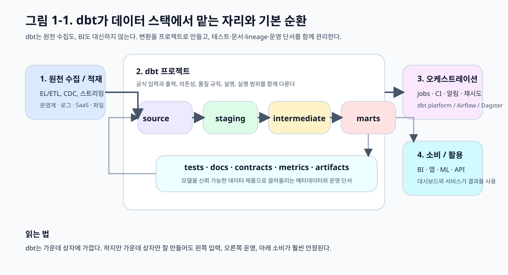

이 기본 순환을 말로 풀면 다음과 같다.

1. raw source가 준비된다.
2. dbt 프로젝트에서 source를 선언한다.
3. staging에서 이름·타입·상태값을 정리한다.
4. intermediate에서 재사용 가능한 조인과 로직을 분리한다.
5. marts에서 최종 fact/dimension과 KPI를 만든다.
6. tests, docs, contracts, metrics 같은 메타데이터를 붙인다.
7. 실행 결과와 artifacts를 보고 다시 수정한다.

초보자에게는 이 순환이 매우 중요하다.
왜냐하면 이 흐름이 잡혀 있어야 각 기능이 어느 단계에서 등장하는지 자연스럽게 이해할 수 있기 때문이다.

<a id="book-chapters-reference-v3-01-dbt-overview-and-three-example-tracks-md--124-chapter-1에서-미리-익혀-둘-최소-용어"></a>

#### 1.2.4. Chapter 1에서 미리 익혀 둘 최소 용어

뒤 장들을 훨씬 편하게 읽으려면, 아래 용어는 지금부터 몸에 익혀 두는 편이 좋다.

| 용어 | 지금 단계의 간단한 뜻 | 뒤에서 깊게 다룰 장 |
| --- | --- | --- |
| source | 프로젝트 밖에서 들어오는 공식 입력 | CH03 이후 |
| ref | 프로젝트 안 다른 모델을 가리키는 공식 참조 | CH03 이후 |
| model | dbt가 관리하는 변환 단위 | CH02~CH04 |
| grain | 한 행이 무엇을 의미하는가 | CH03, Casebook |
| lineage | 모델과 모델 사이의 의존성 흐름 | CH03, CH05, CH08 |
| materialization | 결과를 어떤 형태로 저장할지 | CH03 이후 |
| artifact | 실행/문서/상태를 기록하는 산출물 | CH05, CH06 |
| contract | 모델의 shape와 인터페이스를 고정하는 규칙 | CH07 |
| metric / semantic model | 비즈니스 지표를 재사용 가능한 정의로 끌어올리는 층 | CH08 |

지금은 “정확한 정의를 암기”하려고 하기보다,
dbt는 코드 + 메타데이터 + 운영 단서를 함께 다루는 프로젝트라는 감각을 먼저 잡는 것이 중요하다.

---

<a id="book-chapters-reference-v3-01-dbt-overview-and-three-example-tracks-md--13-이-책을-끝까지-관통하는-세-가지-연속-예제"></a>

### 1.3. 이 책을 끝까지 관통하는 세 가지 연속 예제

<a id="book-chapters-reference-v3-01-dbt-overview-and-three-example-tracks-md--131-왜-예제를-세-개로-고정하는가"></a>

#### 1.3.1. 왜 예제를 세 개로 고정하는가

이 책은 장마다 새로운 예제를 던지지 않는다.
대신 아래 세 개의 예제를 처음부터 끝까지 끌고 간다.

- Retail Orders
- Event Stream
- Subscription & Billing

이렇게 하는 이유는 단순하다.

- 기능을 배우는 것과 기능이 실제 데이터 모델에서 자라는 모습을 보는 것은 다르다.
- 장마다 예제가 바뀌면 독자는 매번 도메인 이해부터 다시 해야 한다.
- 세 개 정도면 서로 다른 데이터 성격을 충분히 대비시키면서도 기억 가능한 범위 안에 머물 수 있다.

<a id="book-chapters-reference-v3-01-dbt-overview-and-three-example-tracks-md--132-example-a--retail-orders"></a>

#### 1.3.2. Example A · Retail Orders

Retail Orders는 가장 기본적인 source → staging → intermediate → marts 구조를 익히는 핵심 트랙이다.
고객, 주문, 주문상세, 상품처럼 익숙한 엔터티를 사용하기 때문에 dbt의 구조적 장점을 설명하기 좋다.

이 트랙에서 반복해서 다루는 질문은 다음과 같다.

- 주문 한 건은 raw에서 mart까지 어떤 단계로 바뀌는가?
- `order_id`, `customer_id`, `product_id`의 grain은 어디서 분명해지는가?
- fanout이 생기면 매출이 왜 틀어지는가?
- 최종 `fct_orders`와 `dim_customers`는 어떤 책임을 가져야 하는가?

이 트랙은 특히 다음 개념과 잘 맞는다.

- layered modeling
- grain
- fanout 방지
- generic data tests
- snapshot으로 상태 변화 추적
- semantic-ready fact/dimension 구조

<a id="book-chapters-reference-v3-01-dbt-overview-and-three-example-tracks-md--133-example-b--event-stream"></a>

#### 1.3.3. Example B · Event Stream

Event Stream은 append-only 성격의 로그/이벤트 데이터를 다루는 트랙이다.
웹/앱 이벤트, 세션, 페이지뷰, 클릭, 구매 이벤트처럼 시간이 흐르며 계속 쌓이는 데이터를 가정한다.

이 트랙에서 반복해서 다루는 질문은 다음과 같다.

- append-only 이벤트에서 세션을 어떻게 정의할 것인가?
- DAU, WAU, 이벤트 전환율 같은 지표를 어떤 모델 계층에 둘 것인가?
- 데이터량이 매우 빠르게 늘어날 때 incremental과 cost-aware selector를 어떻게 써야 하는가?
- late-arriving data나 재처리 범위를 어떻게 생각해야 하는가?

이 트랙은 특히 다음 개념과 잘 맞는다.

- incremental
- partition / clustering / engine 전략
- 비용 통제
- 성능 감각
- selector와 slim CI
- event metric과 saved query

<a id="book-chapters-reference-v3-01-dbt-overview-and-three-example-tracks-md--134-example-c--subscription--billing"></a>

#### 1.3.4. Example C · Subscription & Billing

Subscription & Billing은 상태 변화와 정의의 일관성이 중요한 트랙이다.
구독 시작, 업그레이드, 다운그레이드, 취소, 재활성화, 청구 이벤트를 함께 다룬다.

이 트랙에서 반복해서 다루는 질문은 다음과 같다.

- 구독 상태는 “현재 상태”만 보면 충분한가?
- MRR, 활성 구독 수, churn, expansion 같은 지표를 어떻게 안정적으로 정의할 것인가?
- 상태 변화 이력을 snapshot으로 어디까지 추적해야 하는가?
- 여러 팀이 같은 지표를 공유할 때 contracts, versions, semantic layer가 왜 필요한가?

이 트랙은 특히 다음 개념과 잘 맞는다.

- snapshot
- contracts / versions
- semantic models / metrics
- governed sharing
- quality gates
- shared data product 설계

<a id="book-chapters-reference-v3-01-dbt-overview-and-three-example-tracks-md--135-세-예제의-역할을-한눈에-보기"></a>

#### 1.3.5. 세 예제의 역할을 한눈에 보기

| 예제 | 가장 먼저 익히는 질문 | 뒤로 갈수록 커지는 질문 | 특히 잘 맞는 개념 |
| --- | --- | --- | --- |
| Retail Orders | 주문 한 건은 mart까지 어떻게 바뀌는가? | 공용 metric과 fact/dimension 구조를 어떻게 안정화할까? | layered modeling, tests, fanout, snapshot |
| Event Stream | 이벤트가 계속 쌓일 때 어떻게 모델을 나눌까? | 데이터량과 비용을 어떻게 통제할까? | incremental, performance, selectors, cost-aware 운영 |
| Subscription & Billing | 상태 변화와 MRR을 어떻게 정의할까? | 여러 팀이 같은 정의를 어떻게 공유할까? | snapshot, contracts, versions, semantic layer |

---

<a id="book-chapters-reference-v3-01-dbt-overview-and-three-example-tracks-md--14-세-예제는-책-전체에서-어떻게-성장하는가"></a>

### 1.4. 세 예제는 책 전체에서 어떻게 성장하는가

<a id="book-chapters-reference-v3-01-dbt-overview-and-three-example-tracks-md--141-1단계-구조와-기본기"></a>

#### 1.4.1. 1단계: 구조와 기본기

초반부에서는 세 예제를 모두 “구조를 배우기 위한 장치”로 쓴다.

- source를 선언한다.
- staging에서 이름과 타입을 정리한다.
- intermediate에서 로직을 분리한다.
- marts에서 분석용 출력을 만든다.
- selector와 materialization의 기본 감각을 익힌다.

이 단계의 목표는 “dbt가 왜 giant SQL보다 나은가”를 몸으로 이해하는 것이다.

<a id="book-chapters-reference-v3-01-dbt-overview-and-three-example-tracks-md--142-2단계-신뢰성과-유지보수성"></a>

#### 1.4.2. 2단계: 신뢰성과 유지보수성

중반부로 가면 예제는 “품질과 유지보수”를 설명하는 장치가 된다.

- Retail Orders는 generic / singular / unit test의 기준 예제로 자란다.
- Event Stream은 incremental과 artifacts를 이해하는 운영 예제로 자란다.
- Subscription & Billing은 snapshot, contracts, 문서화, metric 정의의 중요성을 보여 주는 예제로 자란다.

이 단계의 목표는 “돌아가는 모델”을 넘어서 “오래 버티는 모델”을 만드는 것이다.

<a id="book-chapters-reference-v3-01-dbt-overview-and-three-example-tracks-md--143-3단계-운영-거버넌스-공유"></a>

#### 1.4.3. 3단계: 운영, 거버넌스, 공유

후반부에서 예제는 “실무 운영과 팀 공유”를 설명하는 장치가 된다.

- Retail Orders는 semantic-ready mart와 public data product의 입구가 된다.
- Event Stream은 slim CI, cost management, platform tuning의 대표 케이스가 된다.
- Subscription & Billing은 contracts, versions, semantic metric, governed sharing의 대표 케이스가 된다.

이 단계의 목표는 “내 모델”을 넘어서 “팀의 공용 데이터 제품”으로 생각하는 것이다.


<a id="book-chapters-reference-v3-01-dbt-overview-and-three-example-tracks-md--144-왜-예제와-플랫폼은-chapter-1에서-모두-펼쳐-놓지-않는가"></a>

#### 1.4.4. 왜 예제와 플랫폼은 Chapter 1에서 모두 펼쳐 놓지 않는가

이 책은 각 장마다 “예제 A부터 Snowflake까지”를 반복 표로 나열하지 않는다.
그 방식은 처음에는 친절해 보여도, 결국 본문을 반복 정보로 가득 채워 읽는 흐름을 무너뜨리기 쉽다.

대신 구조를 이렇게 나눈다.

- 앞쪽 챕터: 공통 개념과 일반 원리
- Casebook 챕터: 세 예제가 실제로 어떻게 자라는가
- Platform Playbook 챕터: DuckDB, MySQL, PostgreSQL, BigQuery, ClickHouse, Snowflake, Trino, NoSQL + SQL Layer에서 각각 어떻게 실행·조정하는가

즉, Chapter 1의 역할은 모든 플랫폼의 차이를 미리 다 설명하는 것이 아니라,
책 전체를 읽는 기준선을 세워 주는 것이다.

---

<a id="book-chapters-reference-v3-01-dbt-overview-and-three-example-tracks-md--15-이-장에서-먼저-잡아야-할-다섯-가지-원리"></a>

### 1.5. 이 장에서 먼저 잡아야 할 다섯 가지 원리

<a id="book-chapters-reference-v3-01-dbt-overview-and-three-example-tracks-md--151-grain을-먼저-정하고-sql은-나중에-쓴다"></a>

#### 1.5.1. grain을 먼저 정하고 SQL은 나중에 쓴다

dbt 초보자가 가장 자주 하는 실수는 join을 먼저 생각하는 것이다.
하지만 좋은 모델링의 출발점은 항상 이 모델의 한 행이 무엇을 뜻하는가다.

- 주문 한 행인가?
- 주문상세 한 행인가?
- 세션 한 행인가?
- 구독 상태의 특정 시점 한 행인가?

grain이 흐리면 fanout이 생기고, 테스트를 어디에 붙일지 모호해지고, mart가 재사용되지 않는다.

<a id="book-chapters-reference-v3-01-dbt-overview-and-three-example-tracks-md--152-정리-재사용-로직-최종-kpi는-분리한다"></a>

#### 1.5.2. 정리, 재사용 로직, 최종 KPI는 분리한다

한 모델 안에 아래를 모두 넣지 않는 것이 좋다.

- raw 컬럼명 정리
- 타입 캐스팅
- 여러 테이블 조인
- 예외 처리
- KPI 계산
- 최종 집계

처음에는 한 파일로 끝내는 것이 빨라 보인다.
그러나 수정, 디버깅, 테스트, 재사용 관점에서는 거의 항상 손해가 커진다.

<a id="book-chapters-reference-v3-01-dbt-overview-and-three-example-tracks-md--153-선언이-부족하면-사람의-기억이-그-자리를-대신한다"></a>

#### 1.5.3. 선언이 부족하면 사람의 기억이 그 자리를 대신한다

좋은 dbt 프로젝트는 사람 머릿속 지식을 조금씩 코드 안으로 옮긴다.

- `source()`는 “이것이 공식 입력이다”라는 선언이다.
- `ref()`는 “이 모델은 저 모델에 의존한다”는 선언이다.
- tests는 “이 가정이 깨지면 안 된다”는 선언이다.
- docs는 “이 컬럼과 모델의 의미는 이것이다”라는 선언이다.
- contracts는 “이 인터페이스는 함부로 바꾸지 않는다”는 선언이다.

프로젝트가 커질수록, 선언되지 않은 규칙은 팀의 기억력에 의존하게 된다.
그 기억력은 거의 항상 먼저 무너진다.

<a id="book-chapters-reference-v3-01-dbt-overview-and-three-example-tracks-md--154-최적화는-구조가-안정된-다음에-한다"></a>

#### 1.5.4. 최적화는 구조가 안정된 다음에 한다

Event Stream처럼 데이터량이 큰 예제를 보면 많은 사람이 너무 빨리 incremental로 달려간다.
Snowflake, BigQuery, ClickHouse를 떠올리면 비용과 성능부터 걱정하는 사람도 많다.

물론 중요하다.
하지만 구조가 아직 모호한 상태에서의 최적화는 문제를 더 오래 숨기기 쉽다.

초반의 우선순위는 다음이 더 높다.

1. 입력과 출력이 명확한가?
2. grain이 분명한가?
3. 테스트 포인트가 보이는가?
4. giant SQL을 적절히 분해했는가?

그 다음에야 materialization, partitioning, engine, warehouse sizing 같은 최적화가 의미를 가진다.

<a id="book-chapters-reference-v3-01-dbt-overview-and-three-example-tracks-md--155-가장-위험한-안티패턴-네-가지"></a>

#### 1.5.5. 가장 위험한 안티패턴 네 가지

<a id="book-chapters-reference-v3-01-dbt-overview-and-three-example-tracks-md--안티패턴-a-giant-sql-하나에-모든-책임을-넣는-것"></a>

##### 안티패턴 A. giant SQL 하나에 모든 책임을 넣는 것
정리, 조인, 집계, 예외 처리를 한 파일에 몰아넣으면 처음에는 빨라도 이후 비용이 폭증한다.

<a id="book-chapters-reference-v3-01-dbt-overview-and-three-example-tracks-md--안티패턴-b-관계-이름을-하드코딩하는-것"></a>

##### 안티패턴 B. 관계 이름을 하드코딩하는 것
`schema.table_name`을 직접 적기 시작하면 환경 분리, rename, slim CI, lineage가 약해진다.

<a id="book-chapters-reference-v3-01-dbt-overview-and-three-example-tracks-md--안티패턴-c-테스트와-문서화를-나중-일로-미루는-것"></a>

##### 안티패턴 C. 테스트와 문서화를 “나중 일”로 미루는 것
나중에는 거의 붙지 않는다. 모델이 생길 때 함께 붙여야 한다.

<a id="book-chapters-reference-v3-01-dbt-overview-and-three-example-tracks-md--안티패턴-d-플랫폼-최적화를-너무-일찍-시작하는-것"></a>

##### 안티패턴 D. 플랫폼 최적화를 너무 일찍 시작하는 것
구조가 흔들리는 상태에서의 incremental, engine, clustering, partitioning 튜닝은 문제를 가리는 경우가 많다.

---

<a id="book-chapters-reference-v3-01-dbt-overview-and-three-example-tracks-md--16-이제-같은-관점을-세-예제에-적용해-보자"></a>

### 1.6. 이제 같은 관점을 세 예제에 적용해 보자

앞 절까지는 Chapter 1의 공통 원리였다.
이제 같은 원리가 세 예제 안에서 어떻게 다른 얼굴로 나타나는지 본다.

<a id="book-chapters-reference-v3-01-dbt-overview-and-three-example-tracks-md--161-retail-orders에서-chapter-1을-어떻게-읽어야-하는가"></a>

#### 1.6.1. Retail Orders에서 Chapter 1을 어떻게 읽어야 하는가

Retail Orders는 가장 “교과서적인” dbt 학습 트랙이다.
이 예제에서는 구조와 책임 분리가 눈에 잘 보인다.

<a id="book-chapters-reference-v3-01-dbt-overview-and-three-example-tracks-md--출발-질문"></a>

##### 출발 질문
- 주문 데이터는 어떤 raw 테이블에서 시작하는가?
- 한 행의 grain이 주문인지, 주문상세인지, 상품인지 어디서 갈리는가?
- 최종 매출과 주문 수를 어떤 mart에서 책임질 것인가?

<a id="book-chapters-reference-v3-01-dbt-overview-and-three-example-tracks-md--이-장의-원리가-어떻게-적용되는가"></a>

##### 이 장의 원리가 어떻게 적용되는가
- `source()`는 고객, 주문, 주문상세, 상품을 공식 입력으로 선언한다.
- staging은 컬럼명 정리, 타입 캐스팅, 상태값 표준화에 집중한다.
- intermediate는 주문과 주문상세, 상품 조인을 재사용 가능한 형태로 분리한다.
- marts는 `fct_orders`, `dim_customers`처럼 최종 분석 구조에 집중한다.

<a id="book-chapters-reference-v3-01-dbt-overview-and-three-example-tracks-md--처음부터-주의할-것"></a>

##### 처음부터 주의할 것
- 주문 금액과 주문상세 금액을 섞으면 fanout이 생기기 쉽다.
- `order_id`와 `order_item_id`의 grain을 흐리면 테스트 위치도 흔들린다.
- “주문 한 건의 변화”를 추적할 레코드를 하나 정해 두면 뒤 장에서 매우 편하다.

> 추천 추적 레코드
> Retail Orders는 `order_id = 5003` 같은 특정 주문 한 건을 책 전체에서 추적하기 좋다.

<a id="book-chapters-reference-v3-01-dbt-overview-and-three-example-tracks-md--162-event-stream에서-chapter-1을-어떻게-읽어야-하는가"></a>

#### 1.6.2. Event Stream에서 Chapter 1을 어떻게 읽어야 하는가

Event Stream은 구조보다도 데이터 성격의 차이를 익히는 트랙이다.
주문 테이블처럼 “상태가 안정된 엔터티”가 아니라, 시간이 지나며 계속 쌓이는 이벤트가 중심이 된다.

<a id="book-chapters-reference-v3-01-dbt-overview-and-three-example-tracks-md--출발-질문-1"></a>

##### 출발 질문
- 이벤트 한 행의 grain은 무엇인가?
- 세션은 raw에 있나, intermediate에서 계산하나?
- 이벤트 수와 사용자 수, 세션 수는 어떤 mart에서 공식 정의가 되나?

<a id="book-chapters-reference-v3-01-dbt-overview-and-three-example-tracks-md--이-장의-원리가-어떻게-적용되는가-1"></a>

##### 이 장의 원리가 어떻게 적용되는가
- source는 앱/웹 로그, 세션 원천, 사용자 식별 테이블의 공식 입력이 된다.
- staging은 이벤트 이름 표준화, timestamp 파싱, 익명/로그인 사용자 식별 정리를 맡는다.
- intermediate는 세션화, 사용자-세션 연결, 이벤트 분류 로직을 맡는다.
- marts는 DAU, 전환율, 퍼널, 세션 KPI 같은 최종 출력에 집중한다.

<a id="book-chapters-reference-v3-01-dbt-overview-and-three-example-tracks-md--처음부터-주의할-것-1"></a>

##### 처음부터 주의할 것
- append-only 이벤트는 데이터량이 빠르게 커진다.
- “초기에 giant SQL로도 되겠지”라고 생각하면 나중에 incremental 도입이 더 어려워진다.
- 비용과 성능을 빨리 떠올리되, 구조가 먼저 안정되어야 한다.

> 추천 추적 레코드
> Event Stream은 `session_id = s_2026_00042`처럼 하나의 세션을 끝까지 따라가면 좋다.

<a id="book-chapters-reference-v3-01-dbt-overview-and-three-example-tracks-md--163-subscription--billing에서-chapter-1을-어떻게-읽어야-하는가"></a>

#### 1.6.3. Subscription & Billing에서 Chapter 1을 어떻게 읽어야 하는가

Subscription & Billing은 “현재 상태”와 “상태 변화 이력”을 동시에 생각하게 만드는 트랙이다.
이 때문에 Chapter 1의 질문이 특히 중요해진다.

<a id="book-chapters-reference-v3-01-dbt-overview-and-three-example-tracks-md--출발-질문-2"></a>

##### 출발 질문
- 현재 활성 구독과 과거 상태 변화를 어떻게 구분할 것인가?
- MRR과 churn은 어떤 정의를 따를 것인가?
- 계약처럼 공유해야 하는 지표와 컬럼은 무엇인가?

<a id="book-chapters-reference-v3-01-dbt-overview-and-three-example-tracks-md--이-장의-원리가-어떻게-적용되는가-2"></a>

##### 이 장의 원리가 어떻게 적용되는가
- source는 subscription, invoice, payment, plan 변경 이벤트를 공식 입력으로 선언한다.
- staging은 상태값과 날짜 컬럼을 표준화한다.
- intermediate는 구독 라이프사이클 로직과 청구 이벤트 연결을 맡는다.
- marts는 현재 상태와 이력 분석을 위한 fact/dimension/semantic-ready 출력으로 정리된다.

<a id="book-chapters-reference-v3-01-dbt-overview-and-three-example-tracks-md--처음부터-주의할-것-2"></a>

##### 처음부터 주의할 것
- 구독 상태는 주문 상태보다 훨씬 오래 살아남고, 정의가 흔들리면 팀 간 논쟁이 커진다.
- “현재 상태만 있으면 되겠지”라고 생각하다가 snapshot/contract/metric이 뒤늦게 필요해지는 경우가 많다.
- 처음부터 비즈니스 정의를 글로 남기는 습관이 매우 중요하다.

> 추천 추적 레코드
> Subscription & Billing은 `subscription_id = sub_00017`처럼 상태 변화를 가진 구독 한 건을 추적하는 것이 좋다.

<a id="book-chapters-reference-v3-01-dbt-overview-and-three-example-tracks-md--164-지금은-공통-원리만-배우고-사례는-뒤에서-다시-완주한다"></a>

#### 1.6.4. 지금은 공통 원리만 배우고, 사례는 뒤에서 다시 완주한다

이 장에서 세 예제를 모두 끝까지 구현하지는 않는다.
대신 지금은 다음 정도만 머릿속에 넣어 두면 충분하다.

- Retail Orders는 레이어 설계와 grain의 대표 예제다.
- Event Stream은 incremental과 비용의 대표 예제다.
- Subscription & Billing은 snapshot, contracts, semantic의 대표 예제다.

뒤의 Casebook 챕터에서는 이 세 트랙이 실제로 어떻게 자라는지 단계별로 다시 본다.
그러므로 지금은 “기능을 이해할 때 어떤 예제가 가장 적합한지” 정도만 잡고 넘어가면 된다.

---

<a id="book-chapters-reference-v3-01-dbt-overview-and-three-example-tracks-md--17-직접-해보기"></a>

### 1.7. 직접 해보기

<a id="book-chapters-reference-v3-01-dbt-overview-and-three-example-tracks-md--171-연습-1--지금-내-업무를-데이터-스택-그림으로-그려-보기"></a>

#### 1.7.1. 연습 1 · 지금 내 업무를 데이터 스택 그림으로 그려 보기

지금 하고 있는 분석/데이터 작업을 아래 네 층으로 나눠 적어 보자.

1. 원천 수집/적재
2. 저장/쿼리 엔진
3. dbt가 들어갈 변환 구간
4. 소비 도구

핵심은 “dbt가 모든 일을 하는 도구가 아니다”라는 점을 자기 업무 맥락에서 확인하는 것이다.

<a id="book-chapters-reference-v3-01-dbt-overview-and-three-example-tracks-md--172-연습-2--giant-sql-하나를-세-단계로-나눠-보기"></a>

#### 1.7.2. 연습 2 · giant SQL 하나를 세 단계로 나눠 보기

지금까지 작성했던 큰 분석 쿼리 하나를 떠올리고, 아래 세 단계로 분해해 보자.

- source / raw 입력
- staging / 정리
- mart / 최종 출력

가능하면 intermediate가 필요한지도 같이 판단해 보자.

<a id="book-chapters-reference-v3-01-dbt-overview-and-three-example-tracks-md--173-연습-3--grain을-먼저-적어-보기"></a>

#### 1.7.3. 연습 3 · grain을 먼저 적어 보기

아래 질문에 답해 보자.

- 이 모델의 한 행은 무엇을 뜻하는가?
- 비즈니스 키는 무엇인가?
- 이 모델에 가장 먼저 붙여야 할 test는 무엇인가?

<a id="book-chapters-reference-v3-01-dbt-overview-and-three-example-tracks-md--174-연습-4--세-예제-중-자신과-가장-가까운-트랙-고르기"></a>

#### 1.7.4. 연습 4 · 세 예제 중 자신과 가장 가까운 트랙 고르기

- 운영/주문/상품/고객 중심 업무라면 Retail Orders
- 로그/세션/퍼널/트래픽 중심 업무라면 Event Stream
- 구독/청구/상태 변화/매출 정의 중심 업무라면 Subscription & Billing

하나를 골라, 왜 자신에게 가장 가까운지 3줄만 적어 보자.
이 선택은 뒤의 실습 집중도를 높여 준다.

---

<a id="book-chapters-reference-v3-01-dbt-overview-and-three-example-tracks-md--18-한-장-요약"></a>

### 1.8. 한 장 요약

- dbt는 데이터를 수집하는 도구도, BI를 대체하는 도구도 아니다.
  데이터 변환을 프로젝트로 다루게 만드는 도구다.
- dbt를 잘 쓴다는 것은 SQL을 많이 아는 것보다
  grain, 책임 분리, 선언적 관계, 테스트, 문서화를 잘 설계하는 것이다.
- 이 책은 예제를 장마다 바꾸지 않고
  Retail Orders / Event Stream / Subscription & Billing 세 트랙을 끝까지 끌고 간다.
- Chapter 1에서 가장 먼저 배워야 할 것은 명령어가 아니라
  dbt를 어디에 놓고, 어떤 질문으로 바라볼 것인가다.

---

<a id="book-chapters-reference-v3-01-dbt-overview-and-three-example-tracks-md--19-완료-체크리스트"></a>

### 1.9. 완료 체크리스트

- [ ] dbt가 데이터 스택에서 맡는 역할과 맡지 않는 역할을 구분할 수 있다.
- [ ] giant SQL보다 dbt 프로젝트가 왜 유리한지 설명할 수 있다.
- [ ] source → staging → intermediate → marts → tests/docs의 흐름을 말할 수 있다.
- [ ] 세 가지 예제가 책 전체에서 어떤 질문을 대표하는지 설명할 수 있다.
- [ ] 다음 장으로 넘어가기 전에 “내가 가장 먼저 따라갈 예제 트랙”을 하나 고를 수 있다.

---

<a id="book-chapters-reference-v3-02-development-environment-project-structure-commands-and-jinja-md"></a>

장별 원고: [chapters/reference-v3/02-development-environment-project-structure-commands-and-jinja.md](chapters/reference-v3/02-development-environment-project-structure-commands-and-jinja.md)

<a id="book-chapters-reference-v3-02-development-environment-project-structure-commands-and-jinja-md--chapter-02--개발-환경-프로젝트-구조-dbt-명령어와-jinja-첫-실행"></a>

## CHAPTER 02 · 개발 환경, 프로젝트 구조, DBT 명령어와 Jinja, 첫 실행

> **마당마켓 본편 연결:** [J01 · 환경 준비: 실행 종류와 데이터 파일을 혼동하지 않기](#book-journey-01-setup-md)에서 같은 상점의 누적 실습으로 돌아갈 수 있다. 이 참고편의 `codes/` 스니펫에는 독립 fixture가 포함되어 있으며 본편 `lab/`의 P1~P5와 섞지 않는다. 플랫폼별 구문·기능은 실행 버전에 맞춰 재확인한다.


> 환경 구성, 파일 구조, 명령 흐름, 템플릿 문법을 한 장 안에서 연결한다.
> 이 장의 목적은 설치 명령을 외우는 것이 아니라, dbt 프로젝트가 실제로 어떻게 움직이는지를 손에 잡히게 만드는 데 있다.

Chapter 01이 “dbt를 왜 쓰는가”를 설명했다면, 이 장은 “그래서 dbt 프로젝트를 어떻게 세우고 움직이는가”를 설명한다. 많은 초보자가 모델링보다 먼저 무너지는 곳은 환경과 워크플로다. adapter가 안 잡히고, `profile:` 이름이 어긋나고, `dbt run`과 `dbt build`를 언제 쓰는지 모르면 아주 작은 실습도 바로 흔들린다. 그래서 이 장은 환경 → 구조 → 명령 흐름 → Jinja → 첫 완주 순서로 잡는다.

중요한 점은, 이 장이 단지 DuckDB 설치 장이 아니라는 것이다. 이 책은 DuckDB를 기본 실습 환경으로 시작하지만, 뒤에서 다루는 MySQL, PostgreSQL, BigQuery, ClickHouse, Snowflake, Trino, 그리고 NoSQL + SQL Layer까지 모두 같은 구조를 공유한다. 즉, 이 장에서 배워야 하는 것은 특정 DBMS 명령이 아니라 dbt 프로젝트를 읽는 눈이다. 연결 정보는 바뀔 수 있어도, `profiles.yml`, `dbt_project.yml`, `source()`, `ref()`, `debug → parse → ls → compile → run/build → test`의 흐름은 그대로 남는다.

또한 이 장은 Chapter 03 이후를 위한 기초를 세운다. layered modeling, tests, snapshots, docs, packages, governance, semantic layer, mesh 같은 고급 기능도 결국은 모두 환경이 먼저 안정적이고, 프로젝트 구조가 읽히고, 명령 흐름과 Jinja를 해석할 수 있을 때 비로소 제대로 이해된다. 따라서 이 장에서는 기능을 얕게 많이 훑기보다, 환경과 구조와 흐름의 기본기를 끝까지 잡는 쪽을 택한다.

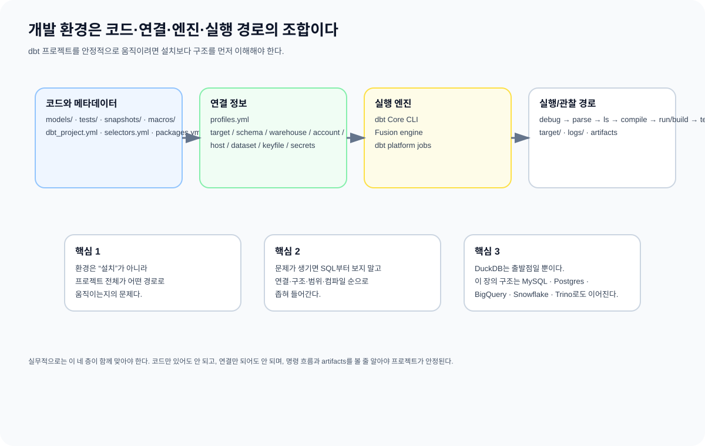

*그림 2-1. 개발 환경은 코드·연결·엔진·실행 경로의 조합이다.*

<a id="book-chapters-reference-v3-02-development-environment-project-structure-commands-and-jinja-md--21-개발-환경을-잡기-전에-먼저-이해해야-할-것"></a>

### 2.1. 개발 환경을 잡기 전에 먼저 이해해야 할 것

<a id="book-chapters-reference-v3-02-development-environment-project-structure-commands-and-jinja-md--211-개발-환경은-코드--연결--엔진--실행-경로의-조합이다"></a>

#### 2.1.1. 개발 환경은 “코드 + 연결 + 엔진 + 실행 경로”의 조합이다

초보자는 개발 환경을 “패키지 설치” 정도로 생각하기 쉽다. 하지만 dbt 프로젝트의 실제 개발 환경은 네 층으로 이루어진다.

1. 코드와 메타데이터
   `models/`, `tests/`, `snapshots/`, `macros/`, `selectors.yml`, `dbt_project.yml`처럼 프로젝트를 이루는 파일들이다.

2. 연결 정보
   `profiles.yml`에 들어가는 target, host, warehouse, dataset, schema, 인증 정보처럼 “어디에 연결할 것인가”를 결정하는 층이다.

3. 실행 엔진
   dbt Core CLI인지, Fusion engine인지, dbt platform의 job인지에 따라 실행 경험과 일부 지원 기능이 달라진다.

4. 실행 경로와 관찰 경로
   `dbt debug`, `dbt parse`, `dbt compile`, `dbt run`, `dbt build`, `dbt test`, `dbt docs generate` 같은 명령과, `target/`, `logs/` 아래 artifacts를 읽는 흐름이다.

이 네 층 중 하나라도 빠지면 프로젝트는 불안정해진다. 예를 들어 코드가 있어도 `profiles.yml`이 없으면 연결이 안 되고, 연결이 돼도 `dbt_project.yml`이 흔들리면 materialization과 schema가 제멋대로 흩어진다. 반대로 설치만 되어 있어도 `debug → parse → compile` 순서를 모르면 문제를 SQL 오류와 연결 오류로 나눌 수 없다.

<a id="book-chapters-reference-v3-02-development-environment-project-structure-commands-and-jinja-md--212-왜-이-책은-core-cli--duckdb에서-시작하는가"></a>

#### 2.1.2. 왜 이 책은 Core CLI + DuckDB에서 시작하는가

입문자에게 가장 큰 적은 기능 부족이 아니라 환경 복잡도다. 계정 발급, 권한, 과금, 네트워크, keyfile, warehouse 설정이 한꺼번에 들어오면 dbt의 핵심을 배우기도 전에 지친다. 그래서 이 책은 로컬에서 곧바로 재현 가능한 Core CLI + DuckDB를 기본값으로 잡는다.

이 선택의 장점은 분명하다.

- 로컬에서 바로 시작할 수 있다.
- 데이터 적재와 실험을 빠르게 반복할 수 있다.
- 회사 계정이나 과금 정책에 묶이지 않고도 예제를 끝까지 완주할 수 있다.
- `source()`, `ref()`, tests, docs, snapshot, incremental, selector 같은 핵심 개념을 대부분 그대로 연습할 수 있다.

하지만 이 선택이 DuckDB만을 위한 책이라는 뜻은 아니다. 오히려 반대다. DuckDB는 개념과 구조를 가장 낮은 마찰로 배울 수 있는 출발점이고, 그 후반부에 MySQL, PostgreSQL, BigQuery, ClickHouse, Snowflake, Trino, NoSQL + SQL Layer로 옮겨 갈 때도 같은 프로젝트 관점을 유지하게 해 준다.

<a id="book-chapters-reference-v3-02-development-environment-project-structure-commands-and-jinja-md--213-core-cli-fusion-engine-vs-code-extension은-어떻게-구분해야-하는가"></a>

#### 2.1.3. Core CLI, Fusion engine, VS Code extension은 어떻게 구분해야 하는가

현재 dbt 생태계에서는 “dbt”라고 말할 때 적어도 세 가지를 구분해야 한다.

- dbt Core CLI
  로컬에서 명령어로 실행하는 가장 전통적인 방식이다. 프로젝트 내부 동작을 또렷하게 볼 수 있어서 학습과 디버깅에 강하다.

- dbt Fusion engine
  더 빠른 파싱과 SQL comprehension을 제공하는 최신 엔진 계열이다. authoring experience와 일부 도구 통합이 더 좋아질 수 있다.

- 공식 VS Code extension
  편집기 안에서 진단, 맥락 이해, 자동완성 경험을 제공하지만, 현재 공식 확장은 Fusion engine 기준으로 설계되어 있다.

학습 관점에서는 Core CLI가 여전히 중요하다. 이유는 간단하다. Core CLI는 `profiles.yml`, `dbt_project.yml`, 명령어, artifacts, compiled SQL을 가장 명시적으로 보여 준다. 반면 Fusion과 확장 기능은 생산성 측면에서 유리할 수 있지만, 초보자에게는 내부 동작이 덜 보일 수도 있다. 따라서 이 장은 Core CLI를 기준으로 설명하고, 후반부에서 Fusion과 platform 환경으로 옮겨 갈 때 무엇이 달라지는지 별도로 연결한다.

<a id="book-chapters-reference-v3-02-development-environment-project-structure-commands-and-jinja-md--214-설치와-버전-고정-원칙"></a>

#### 2.1.4. 설치와 버전 고정 원칙

설치에서 제일 먼저 해야 할 일은 가상환경 분리다. dbt는 adapter마다 별도 패키지가 필요하고, 여러 프로젝트를 오가다 보면 버전이 금방 섞인다. 그래서 프로젝트별 가상환경을 기본 원칙으로 잡는 것이 안전하다.

```bash
python3 -m venv .venv
source .venv/bin/activate
python -m pip install --upgrade pip wheel setuptools
python -m pip install "dbt-core==1.11.*" "dbt-duckdb==1.11.*"
dbt --version
```

이 장과 companion 예시는 재현성을 위해 1.11 계열을 기준으로 적었다. 실제 회사 환경에서는 adapter 호환성과 release track 정책을 먼저 정한 뒤 버전을 핀하는 것이 좋다. 중요한 것은 “최신 버전이면 무조건 좋다”가 아니라, 팀이 재현할 수 있는 버전 조합을 고정하고 문서화하는 것이다.

예시 파일은 여기에도 정리해 두었다.

- [`profiles.example.yml`](codes/04_chapter_snippets/ch02/profiles.example.yml)
- [`dbt_project.skeleton.yml`](codes/04_chapter_snippets/ch02/dbt_project.skeleton.yml)

<a id="book-chapters-reference-v3-02-development-environment-project-structure-commands-and-jinja-md--215-profilesyml과-dbt-debug가-먼저다"></a>

#### 2.1.5. `profiles.yml`과 `dbt debug`가 먼저다

`profiles.yml`은 “이 프로젝트가 어디에 연결되는가”를 정의한다. 반면 `dbt_project.yml`은 “이 프로젝트가 어떻게 동작하는가”를 정의한다. 초보자가 가장 자주 하는 실수는 둘을 같은 종류의 파일처럼 다루는 것이다.

가장 단순한 DuckDB profile은 아래와 같다.

```yaml
dbt_all_in_one_lab:
  target: dev
  outputs:
    dev:
      type: duckdb
      path: ./lab.duckdb
      threads: 4
```

여기서 중요한 것은 `dbt_project.yml`의 `profile:` 값과 `profiles.yml`의 최상위 키가 문자 하나까지 같아야 한다는 점이다. 이 조건이 맞지 않으면 모델 SQL이 아무리 멀쩡해도 프로젝트는 시작조차 하지 못한다.

그래서 설치가 끝나면 바로 `dbt run`을 하지 말고, 먼저 아래 명령으로 연결과 설정부터 확인해야 한다.

```bash
dbt debug
```

`dbt debug`는 연결, 설치된 adapter, 프로젝트 파일, 의존 패키지 유효성 등 “SQL 이전 단계”의 문제를 걸러 준다. 이 순서를 무시하면 설치 오류, profile 오류, 경로 오류, SQL 오류가 한 번에 뒤섞여 초보자에게 가장 비싼 실패가 된다.

<a id="book-chapters-reference-v3-02-development-environment-project-structure-commands-and-jinja-md--216-설치-단계에서-자주-만나는-실패"></a>

#### 2.1.6. 설치 단계에서 자주 만나는 실패

| 증상 | 흔한 원인 | 가장 먼저 확인할 것 |
| --- | --- | --- |
| `Profile not found` | `dbt_project.yml`의 `profile:`과 `profiles.yml` 최상위 키 불일치 | 두 이름이 문자 하나까지 같은지 본다 |
| `Could not find adapter type duckdb` | 가상환경 미활성화 또는 adapter 미설치 | `dbt --version`, `pip list`, 현재 셸의 venv 활성화 여부를 본다 |
| `dbt` 명령을 찾지 못함 | PATH와 venv가 안 맞음 | 현재 셸을 다시 열고 `.venv`를 활성화한다 |
| DuckDB 파일 권한 오류 | 쓰기 권한 없는 경로 사용 | 프로젝트 루트나 홈 디렉터리 아래의 단순 경로로 바꾼다 |
| BigQuery/Snowflake/Postgres 연결 오류 | 자격 증명 또는 네트워크 설정 누락 | SQL보다 먼저 `profiles.yml`, keyfile, secret, network path를 점검한다 |

설치 단계의 안티패턴은 명확하다. 문제가 생겼는데 곧바로 `dbt run`부터 시도하는 것이다. 설치와 연결 단계에서 막힌 프로젝트는 SQL을 건드려도 해결되지 않는다.

<a id="book-chapters-reference-v3-02-development-environment-project-structure-commands-and-jinja-md--22-프로젝트-구조를-운영-규칙--연결-정보--변환-로직--메타데이터로-읽기"></a>

### 2.2. 프로젝트 구조를 “운영 규칙 / 연결 정보 / 변환 로직 / 메타데이터”로 읽기

Chapter 01에서 dbt를 프로젝트 계층이라고 설명했다면, 이제는 그 프로젝트를 실제 디렉터리 구조로 읽어야 한다. 초보자는 폴더가 많아 보이면 겁을 먹기 쉽지만, 실제로는 역할이 꽤 뚜렷하다. 처음에는 아래 네 축으로만 보면 충분하다.

1. 운영 규칙 — `dbt_project.yml`, `selectors.yml`, `packages.yml`
2. 연결 정보 — `profiles.yml`
3. 변환 로직 — `models/`, `tests/`, `snapshots/`, `macros/`, `seeds/`
4. 관찰 결과와 산출물 — `target/`, `logs/`, docs artifacts

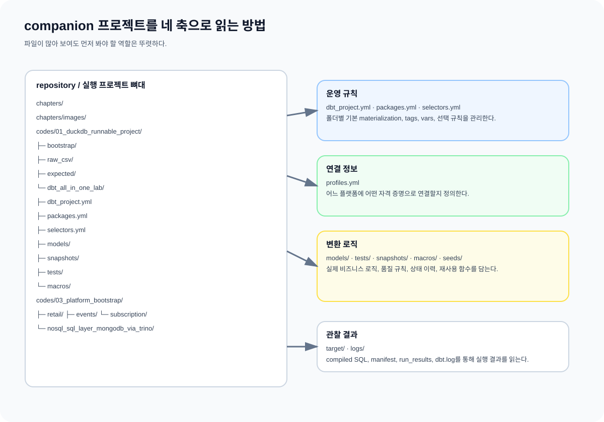

*그림 2-2. companion 프로젝트를 네 축으로 읽는 방법.*

<a id="book-chapters-reference-v3-02-development-environment-project-structure-commands-and-jinja-md--221-이-책의-companion-프로젝트는-어떻게-생겼는가"></a>

#### 2.2.1. 이 책의 companion 프로젝트는 어떻게 생겼는가

아래 구조는 이 책의 실행 가능한 DuckDB 프로젝트를 기준으로 한 핵심 골격이다. 처음에는 모든 파일을 다 보려 하지 말고, 역할별로 읽는 연습을 하는 편이 훨씬 빠르다.

```text
codes/01_duckdb_runnable_project/
├─ bootstrap/
│  └─ load_duckdb.py
├─ raw_csv/
├─ expected/
└─ dbt_all_in_one_lab/
   ├─ dbt_project.yml
   ├─ packages.yml
   ├─ selectors.yml
   ├─ macros/
   ├─ models/
   │  ├─ retail/
   │  ├─ events/
   │  └─ subscription/
   ├─ snapshots/
   └─ tests/
```

이 구조를 읽을 때 가장 먼저 기억할 것은 “모든 파일이 같은 비중이 아니다”라는 점이다. 초보자에게는 `dbt_project.yml`, `models/`, `tests/`, `snapshots/`, `macros/`, 그리고 `target/`만 먼저 읽혀도 상당한 진전이다.

<a id="book-chapters-reference-v3-02-development-environment-project-structure-commands-and-jinja-md--222-dbt_projectyml은-프로젝트의-운영-규칙이다"></a>

#### 2.2.2. `dbt_project.yml`은 프로젝트의 운영 규칙이다

`dbt_project.yml`은 이 디렉터리가 dbt 프로젝트라는 선언이자, 프로젝트 전반의 기본 규칙을 정하는 파일이다. 여기에는 다음과 같은 정보가 들어간다.

- 프로젝트 이름과 버전
- 사용할 profile 이름
- models, seeds, snapshots, macros, tests 디렉터리 위치
- 폴더별 기본 materialization
- 폴더별 schema와 tags
- vars 같은 프로젝트 전역 변수

companion 프로젝트의 실제 설정도 이 원칙을 따른다.

```yaml
name: dbt_all_in_one_lab
version: 1.0.0
config-version: 2
profile: dbt_all_in_one_lab

models:
  dbt_all_in_one_lab:
    retail:
      staging:
        +materialized: view
      intermediate:
        +materialized: view
      marts:
        +materialized: table
    events:
      staging:
        +materialized: view
      marts:
        +materialized: incremental
    subscription:
      staging:
        +materialized: view
      marts:
        +materialized: table
```

이런 구조를 보면 Chapter 03에서 배울 layered modeling이 벌써 설정 파일 안에 반영되어 있다는 것을 알 수 있다. 즉, 프로젝트 구조와 모델링 원칙은 따로 노는 것이 아니라 처음부터 연결되어 있다.

<a id="book-chapters-reference-v3-02-development-environment-project-structure-commands-and-jinja-md--223-profilesyml은-연결-정보다"></a>

#### 2.2.3. `profiles.yml`은 연결 정보다

반대로 `profiles.yml`은 어떤 플랫폼에 어떤 방식으로 연결할지를 정의한다. 데이터베이스명, dataset, warehouse, host, account, password, keyfile, schema, target이 여기에 들어간다. 가장 중요한 원칙은 간단하다.

- `dbt_project.yml`은 커밋되는 프로젝트 규칙
- `profiles.yml`은 로컬/환경별 연결 정보
- 민감한 값은 `env_var()`로 분리

이 역할 구분을 지키지 않으면 두 가지 문제가 생긴다. 첫째, 비밀번호와 토큰이 Git에 남는다. 둘째, 프로젝트 규칙과 환경별 차이가 한 파일 안에서 뒤엉켜 dev/stg/prod 관리가 곧바로 꼬인다.

<a id="book-chapters-reference-v3-02-development-environment-project-structure-commands-and-jinja-md--224-models-tests-snapshots-macros-seeds는-각각-무엇을-담는가"></a>

#### 2.2.4. `models/`, `tests/`, `snapshots/`, `macros/`, `seeds/`는 각각 무엇을 담는가

| 위치 | 담는 것 | 초보자 관점의 핵심 |
| --- | --- | --- |
| `models/` | 변환 SQL과 설명/테스트 YAML | 모델은 한 파일, 한 책임 원칙으로 작게 유지한다 |
| `tests/` | singular tests, custom generic tests | “품질 규칙”을 SQL이나 macro로 남긴다 |
| `snapshots/` | 상태 이력 보존 규칙 | 현재 상태만 있는 원천에서 과거 상태 변화를 보존한다 |
| `macros/` | Jinja 재사용 함수 | 같은 SQL 조각이 반복될 때만 신중하게 올린다 |
| `seeds/` | 작은 정적 CSV | 작고 안정적인 참조 데이터를 프로젝트 안에 둔다 |

중요한 것은 “어디에 무엇을 둬야 하는가”보다 “왜 분리하는가”다. 예를 들어 tests를 모델 옆에 두지 않고 별도 디렉터리나 YAML에 두는 이유는, 품질 검증 규칙이 모델 로직과 별도의 논리 축을 가지기 때문이다. 마찬가지로 macros를 분리하는 이유는, Jinja 템플릿을 독립적인 재사용 함수처럼 취급하기 위해서다.

<a id="book-chapters-reference-v3-02-development-environment-project-structure-commands-and-jinja-md--225-설정-우선순위는-공통-규칙-vs-개별-예외로-기억하면-된다"></a>

#### 2.2.5. 설정 우선순위는 ‘공통 규칙 vs 개별 예외’로 기억하면 된다

초보자가 설정 우선순위를 너무 일찍 외우려고 하면 오히려 더 헷갈린다. 대신 아래 원칙으로 기억하면 충분하다.

- 공통 규칙은 `dbt_project.yml`
- 개별 리소스에 가까운 설정은 해당 모델 YAML
- 특정 모델 하나만 예외 처리는 SQL 안의 `config()`

예를 들어 “events marts는 기본적으로 incremental”이라는 규칙은 프로젝트 파일에 두는 편이 자연스럽다. 반면 “`fct_sessions` 하나만 특수한 `unique_key`를 쓴다”는 설정은 모델 가까이에 두는 것이 더 읽기 쉽다.

<a id="book-chapters-reference-v3-02-development-environment-project-structure-commands-and-jinja-md--226-target-logs-packagesyml-selectorsyml은-언제-떠올려야-하는가"></a>

#### 2.2.6. `target/`, `logs/`, `packages.yml`, `selectors.yml`은 언제 떠올려야 하는가

- `target/`
  compiled SQL, `manifest.json`, `run_results.json` 같은 artifacts가 생기는 곳이다. 디버깅과 state selection의 출발점이다.

- `logs/`
  `dbt.log`를 통해 오류의 시간순 흐름과 상세 메시지를 확인할 수 있다.

- `packages.yml`
  외부 dbt package를 가져오는 파일이다. 반복되는 tests, macros, utilities를 끌어오고 싶을 때 등장한다.

- `selectors.yml`
  반복해서 쓰는 selector 식에 이름을 붙인다. 예를 들어 배포 전 핵심 marts만 묶는 규칙을 만들 수 있다.

초보자 입장에서는 이 파일들이 “나중에 보는 파일”처럼 느껴질 수 있다. 하지만 프로젝트가 조금만 커져도 바로 중요해진다. 특히 `target/`과 `logs/`는 Chapter 05의 디버깅 파트로 넘어가기 전에 이미 익숙해져 있어야 한다.

<a id="book-chapters-reference-v3-02-development-environment-project-structure-commands-and-jinja-md--227-companion-repo에서-어디를-먼저-열어야-하는가"></a>

#### 2.2.7. companion repo에서 어디를 먼저 열어야 하는가

이 책의 repository에서는 아래 경로부터 보면 된다.

1. `chapters/` — 교재 본문
2. `codes/01_duckdb_runnable_project/dbt_all_in_one_lab/` — 실행 가능한 기본 프로젝트
3. `codes/03_platform_bootstrap/<example>/<platform>/` — DBMS별 초기 데이터 적재 스크립트
4. `codes/02_reference_patterns/` — 고급 기능과 플랫폼 예시
5. `chapters/images/` — 그림 파일

즉, 본문 → DuckDB 프로젝트 → 플랫폼별 부트스트랩 → 고급 레퍼런스 순서로 보는 것이 가장 안정적이다.

<a id="book-chapters-reference-v3-02-development-environment-project-structure-commands-and-jinja-md--23-프로젝트를-실제로-움직이는-명령-흐름"></a>

### 2.3. 프로젝트를 실제로 움직이는 명령 흐름

dbt 명령어는 단순한 CLI 목록이 아니다. 실제로는 프로젝트를 관찰하고, 구조를 검증하고, SQL을 확인하고, 필요한 범위만 실행하고, 테스트하고, 문서화하는 워크플로 언어에 가깝다. 그래서 초보자는 명령어를 개별 기능으로 외우기보다, 아래 순서를 하나의 루틴으로 익혀야 한다.

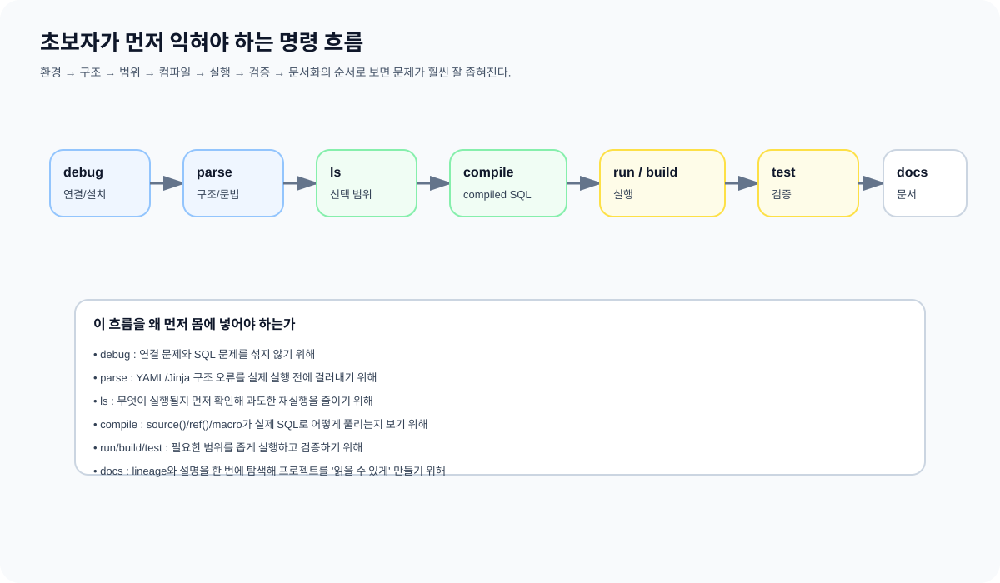

*그림 2-3. 초보자가 먼저 익혀야 하는 명령 흐름.*

<a id="book-chapters-reference-v3-02-development-environment-project-structure-commands-and-jinja-md--231-왜-debug--parse--ls--compile--runbuild--test--docs-순서가-좋은가"></a>

#### 2.3.1. 왜 `debug → parse → ls → compile → run/build → test → docs` 순서가 좋은가

이 순서를 쓰면 문제를 단계별로 분리할 수 있기 때문이다.

- `dbt debug`는 연결과 설치 문제를 본다.
- `dbt parse`는 YAML/Jinja/프로젝트 구조 문제를 본다.
- `dbt ls`는 selector가 정확히 무엇을 잡는지 보여 준다.
- `dbt compile`은 `source()`, `ref()`, Jinja가 실제 SQL로 어떻게 풀리는지 보여 준다.
- `dbt run`과 `dbt build`는 실제로 relation을 만들고 test까지 실행한다.
- `dbt test`는 품질 가정을 확인한다.
- `dbt docs generate`는 lineage와 문서를 탐색 가능한 형태로 만든다.

이 순서를 익히면 “설치 문제인지, 구조 문제인지, SQL 문제인지, 데이터 품질 문제인지”를 한 번에 맞히려고 하지 않아도 된다. 문제를 좁혀 가는 것이 핵심이다.

<a id="book-chapters-reference-v3-02-development-environment-project-structure-commands-and-jinja-md--232-핵심-명령어는-어떻게-서로-다른가"></a>

#### 2.3.2. 핵심 명령어는 어떻게 서로 다른가

| 명령 | 무엇을 보는가 | 초보자가 가장 먼저 익혀야 할 쓰임 |
| --- | --- | --- |
| `dbt debug` | 연결, 설치, project/profile 유효성 | SQL보다 먼저 환경 문제를 걸러낸다 |
| `dbt parse` | 프로젝트 구조, YAML/Jinja 문법 | 실행 없이 구조를 검증한다 |
| `dbt ls -s ...` | selector가 잡는 노드 범위 | “무엇이 실행될지”를 먼저 눈으로 확인한다 |
| `dbt compile -s ...` | compiled SQL | Jinja와 `ref()`가 실제 SQL로 어떻게 바뀌는지 본다 |
| `dbt run -s ...` | 선택한 모델을 materialize | 좁은 범위 개발 실행에 적합하다 |
| `dbt build -s ...` | 선택한 리소스 + 관련 tests | 배포 전 검증이나 소규모 end-to-end 확인에 유리하다 |
| `dbt test -s ...` | data test, unit test | 로직과 품질 가정을 검증한다 |
| `dbt docs generate` | docs artifacts 생성 | lineage와 설명을 한 번에 확인한다 |
| `dbt seed` | 작은 CSV 적재 | 참조용 코드표/매핑 테이블에 적합하다 |

이 장에서는 위 명령을 모두 깊게 다루기보다, 처음 보는 프로젝트를 안정적으로 움직이는 최소 루틴에 초점을 둔다. 더 긴 명령어 레퍼런스는 Appendix B에서 따로 다룬다.

<a id="book-chapters-reference-v3-02-development-environment-project-structure-commands-and-jinja-md--233-전체-build보다-좁은-범위-실행이-중요한-이유"></a>

#### 2.3.3. 전체 build보다 좁은 범위 실행이 중요한 이유

초보자는 자꾸 “전체를 돌려 보고 싶다”는 유혹을 느낀다. 하지만 실제 개발에서는 이 습관이 가장 느리고 비싼 루틴이 된다. 작은 모델 하나를 바꾸고도 전체 프로젝트를 매번 재실행하면, 실패 원인을 찾는 속도도 느려지고 BigQuery나 Snowflake 같은 플랫폼에서는 비용 감각도 금방 무뎌진다.

처음 몇 주 동안은 아래 루틴만 익혀도 충분하다.

```bash
dbt ls -s stg_orders+
dbt compile -s stg_orders
dbt run -s stg_orders
dbt test -s stg_orders
```

이 작은 반복을 계속하다 보면, 어떤 변화가 현재 모델에서 끝나는지, 어떤 변화가 downstream marts까지 번지는지 감각이 생긴다. 이후 장에서 state selection이나 `--defer`를 배울 때도 이 감각이 바탕이 된다.

<a id="book-chapters-reference-v3-02-development-environment-project-structure-commands-and-jinja-md--234-첫-번째-완주-루틴-duckdb-기준"></a>

#### 2.3.4. 첫 번째 완주 루틴: DuckDB 기준

이 repository에서 가장 빠른 실습 경로는 `codes/01_duckdb_runnable_project/`를 이용하는 것이다. 기본 실행 예시는 아래 파일에도 담아 두었다.

- [`first_run_commands.sh`](codes/04_chapter_snippets/ch02/first_run_commands.sh)

핵심 흐름은 다음과 같다.

```bash
cd codes/01_duckdb_runnable_project/dbt_all_in_one_lab

python ../bootstrap/load_duckdb.py --db ./lab.duckdb --variant day1 --raw-dir ../raw_csv
dbt debug
dbt seed
dbt ls -s stg_orders+
dbt compile -s stg_orders
dbt run -s stg_orders
dbt test -s stg_orders
dbt docs generate
```

이 짧은 루틴만 제대로 돌려 봐도 아래가 한 번에 연결된다.

- raw CSV가 raw schema에 적재된다.
- `source()` 선언이 실제 입력과 연결된다.
- `stg_orders`가 raw를 downstream 친화적 구조로 정리한다.
- tests가 기본 품질 가정을 검증한다.
- docs artifacts가 source → model lineage를 노출한다.

<a id="book-chapters-reference-v3-02-development-environment-project-structure-commands-and-jinja-md--235-target과-artifacts는-언제-보기-시작해야-하는가"></a>

#### 2.3.5. `target/`과 artifacts는 언제 보기 시작해야 하는가

입문 단계에서도 `target/`은 일찍 익혀 두는 편이 좋다. 이유는 Jinja와 `ref()`가 들어간 모델은 원본 SQL보다 compiled SQL을 봐야 실제 동작을 정확히 이해할 수 있기 때문이다.

처음부터 전부 외울 필요는 없다. 아래 세 가지만 먼저 기억하면 된다.

- `target/compiled/`
  Jinja가 풀린 SQL을 본다.
- `target/manifest.json`
  프로젝트 그래프와 메타데이터를 담는다.
- `target/run_results.json`
  어떤 노드가 어떻게 실행되었는지를 요약한다.

즉, “dbt는 SQL만 실행하는 도구”가 아니라 “SQL을 컴파일하고, 그래프로 이해하고, artifacts로 남기는 도구”라는 감각이 여기서 시작된다.

<a id="book-chapters-reference-v3-02-development-environment-project-structure-commands-and-jinja-md--236-실패를-만났을-때의-기본-루틴"></a>

#### 2.3.6. 실패를 만났을 때의 기본 루틴

아래 순서를 몸에 익혀 두면 초반 실습 대부분은 스스로 정리할 수 있다.

1. `dbt debug`로 환경과 연결을 먼저 분리한다.
2. `dbt parse`로 구조와 YAML/Jinja 문법을 본다.
3. `dbt ls -s ...`로 selector 범위가 맞는지 본다.
4. `dbt compile -s ...`로 compiled SQL을 본다.
5. 그 다음에야 `dbt run` 또는 `dbt build`를 실행한다.
6. 실패한 test가 있다면 데이터 품질 문제인지 모델 로직 문제인지 분리한다.

이 순서가 중요한 이유는, 문제를 한 번에 해결하기 때문이 아니라 문제의 종류를 좁혀 가기 때문이다.

<a id="book-chapters-reference-v3-02-development-environment-project-structure-commands-and-jinja-md--24-jinja를-sql을-덮는-마법이-아니라-프로젝트-문맥을-여는-문법으로-이해하기"></a>

### 2.4. Jinja를 “SQL을 덮는 마법”이 아니라 “프로젝트 문맥을 여는 문법”으로 이해하기

Jinja는 dbt 초보자에게 가장 쉽게 과장되거나 과소평가되는 영역이다. 어떤 사람은 Jinja를 “SQL을 자동으로 써 주는 마법”처럼 생각하고, 어떤 사람은 “고급자용이니 나중에 보면 된다”고 생각한다. 둘 다 정확하지 않다. Jinja는 dbt에서 SQL에 프로젝트 문맥을 연결하는 얇은 층이다. 너무 적게 알아도 `source()`와 `ref()`를 이해하기 어렵고, 너무 과하게 쓰면 오히려 가독성과 디버깅이 나빠진다.

<a id="book-chapters-reference-v3-02-development-environment-project-structure-commands-and-jinja-md--241-먼저-익혀야-할-delimiter-세-가지"></a>

#### 2.4.1. 먼저 익혀야 할 delimiter 세 가지

입문 단계에서는 아래 세 가지만 정확히 구분해도 큰 도움이 된다.

- `{{ ... }}`
  값을 출력하거나 함수 결과를 삽입한다. `ref()`, `source()`, `env_var()`가 여기에 들어간다.

- ``
  제어 흐름이다. `if`, `for`, `macro`, `set` 같은 문법이 여기에 들어간다.

- `{# ... #}`
  Jinja 주석이다. compiled SQL에는 남지 않는다.

이 세 가지를 구분하지 못하면 모델 SQL, macro, `dbt_project.yml` 예시를 읽을 때 곧바로 막히게 된다.

<a id="book-chapters-reference-v3-02-development-environment-project-structure-commands-and-jinja-md--242-초보자가-먼저-익혀야-할-함수"></a>

#### 2.4.2. 초보자가 먼저 익혀야 할 함수

Chapter 02에서 먼저 익히면 좋은 함수는 많지 않다.

- `source()` — 프로젝트 바깥 원천 입력
- `ref()` — 프로젝트 안의 다른 모델
- `config()` — 특정 모델 설정
- `var()` — 프로젝트 변수 주입
- `env_var()` — 환경 변수 주입
- `target` — 현재 실행 target에 대한 정보

이 여섯 개만 이해해도 `models/`, `profiles.yml`, `dbt_project.yml`, macro의 대부분을 읽을 수 있다.

<a id="book-chapters-reference-v3-02-development-environment-project-structure-commands-and-jinja-md--243-가장-기본적인-jinja-예시"></a>

#### 2.4.3. 가장 기본적인 Jinja 예시

아래 예시는 raw retail orders를 staging 모델로 바꾸는 가장 기본적인 패턴이다.

```sql
with source_data as (
    select *
    from {{ source('raw_retail', 'orders') }}
),
renamed as (
    select
        order_id,
        customer_id,
        cast(order_ts as timestamp) as order_ts,
        cast(order_ts as date) as order_date,
        lower(status) as order_status,
        cast(total_amount as double) as total_amount
    from source_data
)
select *
from renamed
```

이 예시에는 화려한 Jinja가 없다. 하지만 핵심은 이미 다 들어 있다.

- raw 테이블명을 직접 쓰지 않고 `source()`를 쓴다.
- 타입 캐스팅과 이름 정리를 staging에서 한다.
- compiled SQL을 보면 실제 relation 이름으로 풀린다.

추가 예시는 아래 파일에도 담아 두었다.

- [`jinja_basics_examples.sql`](codes/04_chapter_snippets/ch02/jinja_basics_examples.sql)

<a id="book-chapters-reference-v3-02-development-environment-project-structure-commands-and-jinja-md--244-profilesyml-dbt_projectyml에서도-jinja가-등장한다"></a>

#### 2.4.4. `profiles.yml`, `dbt_project.yml`에서도 Jinja가 등장한다

Jinja는 모델 안에서만 쓰이지 않는다. 예를 들어 `profiles.yml`에서는 `env_var()`로 비밀값을 주입할 수 있고, `dbt_project.yml`에서는 `vars:`를 통해 실행 시점에 달라지는 값을 프로젝트 전반에 넣을 수 있다.

```yaml
password: "{{ env_var('DBT_ENV_SECRET_PG_PASSWORD') }}"
```

이 패턴은 DuckDB 예시에서는 덜 중요해 보여도, Postgres, Snowflake, BigQuery, Trino로 갈수록 중요해진다. 따라서 Jinja를 “SQL 파일에서만 보이는 문법”으로 생각하면 프로젝트 전체 문맥을 놓치게 된다.

<a id="book-chapters-reference-v3-02-development-environment-project-structure-commands-and-jinja-md--245-macro는-언제부터-쓰는가"></a>

#### 2.4.5. macro는 언제부터 쓰는가

macro는 반복되는 SQL 조각을 재사용 함수처럼 묶는 방식이다. 하지만 초보자가 너무 이르게 macro 추상화에 빠지면, 오히려 SQL 자체를 읽는 힘이 약해진다. 따라서 Chapter 02에서는 아래 기준만 기억하면 충분하다.

- 같은 SQL 조각이 여러 모델에서 반복될 때
- 바뀔 때 함께 바뀌어야 하는 규칙일 때
- 모델보다 macro가 더 읽기 쉬울 정도로 패턴이 명확할 때

즉, “매크로를 쓰면 있어 보인다”가 아니라, 반복과 변경 비용을 줄이는가를 기준으로 판단해야 한다.

<a id="book-chapters-reference-v3-02-development-environment-project-structure-commands-and-jinja-md--246-jinja를-읽을-때는-항상-compiled-sql을-함께-본다"></a>

#### 2.4.6. Jinja를 읽을 때는 항상 compiled SQL을 함께 본다

Jinja의 위험은 문법 자체보다, 원래 실행되는 SQL이 무엇인지 감을 잃기 쉽다는 데 있다. 그래서 `dbt compile -s ...`는 Jinja를 이해하는 데에도 필수다. 특히 `source()`, `ref()`, `config()`, macro가 함께 들어가기 시작하면, 원본 모델 파일만 보지 말고 compiled 결과를 함께 보는 습관을 들이는 편이 좋다.

<a id="book-chapters-reference-v3-02-development-environment-project-structure-commands-and-jinja-md--25-세-예제에서-chapter-02의-내용을-실제로-적용하기"></a>

### 2.5. 세 예제에서 Chapter 02의 내용을 실제로 적용하기

이제 공통 원리를 세 예제 안에서 연결해 보자. 여기서 중요한 것은 “예제별로 환경이 완전히 다르다”가 아니라, 같은 원리가 세 다른 도메인에서 어떻게 시작되는가다. Chapter 09 이후의 케이스북에서는 이 예제들을 더 길게 끌고 가지만, Chapter 02에서는 가장 첫 실행 지점에만 집중한다.

<a id="book-chapters-reference-v3-02-development-environment-project-structure-commands-and-jinja-md--251-retail-orders--raw--staging의-감각을-제일-빨리-익히는-트랙"></a>

#### 2.5.1. Retail Orders — raw → staging의 감각을 제일 빨리 익히는 트랙

Retail Orders는 처음 배우는 사람이 가장 쉽게 이해할 수 있는 트랙이다. 고객, 주문, 주문상세, 상품이라는 익숙한 엔터티 덕분에 source 선언, staging rename, grain, fanout 위험을 빨리 눈으로 확인할 수 있다.

이 장에서 Retail Orders로 꼭 해 볼 일은 세 가지다.

1. `raw_retail.orders`를 먼저 적재한다.
2. `stg_orders`만 선택 실행한다.
3. `order_id = 5003`이 raw에서 staging으로 어떻게 바뀌는지 확인한다.

DuckDB 실습에서는 아래 파일이 시작점이다.

```text
codes/03_platform_bootstrap/retail/duckdb/setup_day1.sql
codes/03_platform_bootstrap/retail/duckdb/apply_day2.sql
```

<a id="book-chapters-reference-v3-02-development-environment-project-structure-commands-and-jinja-md--252-event-stream--append-only-원천을-다루는-감각을-익히는-트랙"></a>

#### 2.5.2. Event Stream — append-only 원천을 다루는 감각을 익히는 트랙

Event Stream은 주문 테이블보다 구조가 덜 친숙하지만, dbt가 왜 “계속 성장하는 프로젝트”여야 하는지를 잘 보여 준다. append-only 이벤트 원천을 다룰 때는 Day 1에서는 단순 staging으로 시작해도, 이후에 session, DAU, incremental, 비용 문제로 금방 확장된다.

이 장에서 Event Stream으로 확인할 포인트는 다음이다.

1. raw 이벤트는 종종 컬럼 수가 많고, 의미가 느슨하다.
2. `stg_events`는 이름 정리와 타입 표준화부터 시작한다.
3. 처음부터 sessionization을 넣기보다, 먼저 안정적인 staging을 만드는 편이 좋다.

DuckDB 실습 경로는 아래와 같다.

```text
codes/03_platform_bootstrap/events/duckdb/setup_day1.sql
codes/03_platform_bootstrap/events/duckdb/apply_day2.sql
```

<a id="book-chapters-reference-v3-02-development-environment-project-structure-commands-and-jinja-md--253-subscription--billing--상태-변화와-이력-관리를-준비하는-트랙"></a>

#### 2.5.3. Subscription & Billing — 상태 변화와 이력 관리를 준비하는 트랙

Subscription & Billing은 Chapter 02 시점에서는 아직 비교적 단순해 보인다. 하지만 이 트랙은 곧바로 snapshot, contracts, metrics, semantic layer, versions로 이어질 가능성이 크다. 그래서 초기 환경을 잡을 때부터 “상태 변화가 뒤에 나온다”는 감각을 갖고 출발하는 편이 좋다.

이 장에서 Subscription & Billing으로 확인할 포인트는 다음이다.

1. raw subscriptions와 invoices를 먼저 분리해서 본다.
2. `stg_subscriptions`가 상태값과 날짜 컬럼을 어떻게 표준화하는지 본다.
3. Day 2 데이터가 들어왔을 때 어떤 변화가 생길지를 미리 상상해 본다.

DuckDB 실습 경로는 아래와 같다.

```text
codes/03_platform_bootstrap/subscription/duckdb/setup_day1.sql
codes/03_platform_bootstrap/subscription/duckdb/apply_day2.sql
```

<a id="book-chapters-reference-v3-02-development-environment-project-structure-commands-and-jinja-md--254-각-dbms에서-시작하는-경로는-다르지만-구조는-같다"></a>

#### 2.5.4. 각 DBMS에서 시작하는 경로는 다르지만, 구조는 같다

이 repository에서는 세 예제를 대부분의 주요 DBMS에서 시험해 볼 수 있도록 부트스트랩 스크립트를 나눠 두었다. 구조는 공통이다.

```text
codes/03_platform_bootstrap/
├─ retail/
│  ├─ duckdb/ | mysql/ | postgres/ | bigquery/ | clickhouse/ | snowflake/ | trino/
├─ events/
│  ├─ duckdb/ | mysql/ | postgres/ | bigquery/ | clickhouse/ | snowflake/ | trino/
├─ subscription/
│  ├─ duckdb/ | mysql/ | postgres/ | bigquery/ | clickhouse/ | snowflake/ | trino/
└─ nosql_sql_layer_mongodb_via_trino/
   ├─ retail/
   ├─ events/
   └─ subscription/
```

여기서 꼭 기억할 점은 두 가지다.

- Trino는 별도의 SQL 실행 계층이다. Trino용 playbook은 Trino catalog와 connector 전제를 기준으로 본다.
- NoSQL + SQL Layer는 또 다른 축이다. MongoDB JSONL을 먼저 적재하고, Trino를 통해 SQL 계층으로 읽는 흐름을 따로 본다.

즉, Chapter 02에서 배워야 할 것은 “MySQL은 이렇게 적재하고 Snowflake는 저렇게 적재한다”를 전부 외우는 것이 아니라, 어떤 플랫폼이든 raw 데이터를 준비하고 profile을 맞추고 첫 staging 모델을 검증하는 절차는 같다는 점이다. 자세한 차이는 뒤의 Platform Playbook 챕터에서 별도로 다룬다.

<a id="book-chapters-reference-v3-02-development-environment-project-structure-commands-and-jinja-md--26-직접-해보기"></a>

### 2.6. 직접 해보기

1. 가상환경을 만들고 `dbt-core`, `dbt-duckdb`를 설치한다.
2. `profiles.example.yml`을 참고해 `~/.dbt/profiles.yml`을 만든다.
3. `dbt debug`를 실행해 연결과 설정을 먼저 통과시킨다.
4. `codes/01_duckdb_runnable_project/dbt_all_in_one_lab/`로 이동해 `first_run_commands.sh`의 순서를 따라 해 본다.
5. `dbt ls -s stg_orders+`, `dbt compile -s stg_orders`, `dbt run -s stg_orders`의 차이를 직접 기록한다.
6. `jinja_basics_examples.sql`을 열어 `source()`, `ref()`, `config()`, `var()`, `env_var()`가 각각 어떤 문맥에서 쓰이는지 정리한다.
7. 세 예제 중 하나를 골라 해당 플랫폼 bootstrap 경로를 직접 열어 보고, Day 1 적재 스크립트 이름을 적는다.

정답 확인 기준은 간단하다. “설치했다”가 아니라 “문제를 분리해서 설명할 수 있다”가 목표다. 다시 말해, 아래 질문에 답할 수 있으면 이 장의 핵심은 잡은 것이다.

- 왜 `dbt debug`가 `dbt run`보다 먼저인가?
- `dbt_project.yml`과 `profiles.yml`은 어떻게 다른가?
- `dbt compile`은 왜 Jinja를 이해하는 데 중요한가?
- Retail / Events / Subscription 세 예제에서 Chapter 02의 시작점은 각각 어디인가?

<a id="book-chapters-reference-v3-02-development-environment-project-structure-commands-and-jinja-md--27-이-장에서-반드시-남겨야-하는-감각"></a>

### 2.7. 이 장에서 반드시 남겨야 하는 감각

Chapter 02의 핵심은 명령어 개수를 늘리는 것이 아니다. 아래 네 문장을 몸에 남기는 것이 더 중요하다.

1. 개발 환경은 설치만으로 끝나지 않는다.
   코드, 연결, 엔진, 실행 경로를 함께 이해해야 한다.

2. 프로젝트 구조는 파일 나열이 아니라 역할 분리다.
   운영 규칙, 연결 정보, 변환 로직, 메타데이터를 구분해야 한다.

3. 명령어는 순서가 중요하다.
   `debug → parse → ls → compile → run/build → test → docs`의 흐름을 몸에 익혀야 한다.

4. Jinja는 SQL을 덮는 마법이 아니라 프로젝트 문맥을 여는 얇은 층이다.
   `source()`, `ref()`, `config()`, `env_var()`를 읽을 수 있어야 다음 장으로 편하게 넘어간다.

Chapter 03부터는 이 기초 위에서 `source()`, `ref()`, selectors, layered modeling, grain, materializations를 더 깊게 다룬다. 하지만 그 모든 내용도 결국은 이 장에서 배운 환경과 구조, 명령 흐름, Jinja 감각 위에서만 제대로 서게 된다.


<a id="book-chapters-reference-v3-02-development-environment-project-structure-commands-and-jinja-md--28-trino--iceberg를-첫-실습-환경으로-가져올-때-꼭-알아야-하는-현실-차이"></a>

### 2.8. Trino + Iceberg를 첫 실습 환경으로 가져올 때 꼭 알아야 하는 현실 차이

DuckDB 기준으로 dbt를 익혔다면, Trino는 같은 SQL 중심 경험처럼 보여도 실제로는 훨씬 더 많은 실행 표면을 가진다.
로컬 파일 하나로 끝나는 엔진이 아니라, coordinator / catalog / connector / write-capable storage / 권한 / 네트워크가 함께 맞아야 움직이는 query engine이기 때문이다.

이 차이를 초반에 분명히 이해하지 않으면, 독자는 `profiles.yml` 문법은 맞는데 `dbt run`이 실패하는 상황을 “dbt 설정이 틀렸다”로 오해하기 쉽다. 실제로는 dbt profile 문제, Trino 서비스 상태 문제, catalog 구성 문제, connector 쓰기 지원 문제가 섞여 나타나는 경우가 많다.


<a id="book-chapters-reference-v3-02-development-environment-project-structure-commands-and-jinja-md--281-trino는-dbt--sql이-아니라-dbt--분산-쿼리-엔진--저장소라는-감각으로-봐야-한다"></a>

#### 2.8.1. Trino는 “dbt + SQL”이 아니라 “dbt + 분산 쿼리 엔진 + 저장소”라는 감각으로 봐야 한다

Trino를 학습용 환경으로 쓸 때는 다음 세 층을 따로 생각하는 것이 좋다.

1. dbt 계층: `profiles.yml`, `dbt_project.yml`, target, vars, models, macros
2. Trino 계층: coordinator 실행 상태, catalog 이름, schema, connector 옵션, 세션 속성
3. 저장소 계층: Iceberg/Parquet/객체 스토리지/메타스토어처럼 실제 데이터가 남는 위치

이 세 층이 섞이면 문제를 잘못 진단하게 된다.
예를 들어 `Connection refused`는 SQL 문법 문제도, model 설계 문제도 아니다. 보통은 Trino coordinator가 떠 있지 않거나, 실행 파일 권한/서비스 방식이 꼬여 있는 문제다. 반대로 `unique_key='id'` 오류는 네트워크 문제가 아니라 incremental merge 계약이 깨진 모델 설계 문제다.

<a id="book-chapters-reference-v3-02-development-environment-project-structure-commands-and-jinja-md--282-최소-profile은-단순하지만-단순하다고-해서-쉬운-것은-아니다"></a>

#### 2.8.2. 최소 profile은 단순하지만, 단순하다고 해서 쉬운 것은 아니다

아래는 업무 메모에서 가져온 실무형 최소 Trino profile 예시를 교재형으로 정리한 것이다.

```yaml
trino_test:
  target: dev
  outputs:
    dev:
      type: trino
      method: none
      user: dbt
      host: localhost
      port: 8080
      database: iceberg
      schema: sample_db
      threads: 1
      prepared_statements_enabled: true
      retries: 3
      timezone: Asia/Seoul
```

이 profile에서 특히 혼동하기 쉬운 점은 다음과 같다.

- `database`는 일반적인 RDBMS의 database라기보다 Trino catalog에 가깝다.
- `schema`는 그 catalog 아래 schema다.
- `source()`에서 `database/schema/table`을 어떻게 선언하는지는 결국 Trino catalog + schema + table의 조합으로 해석된다.
- write가 필요한 model은 Trino가 연결한 connector 중 실제로 쓰기를 지원하는 catalog에 materialize되어야 한다.

<a id="book-chapters-reference-v3-02-development-environment-project-structure-commands-and-jinja-md--283-dbt-debug와-dbt-run-사이에는-서비스-상태라는-간격이-있다"></a>

#### 2.8.3. `dbt debug`와 `dbt run` 사이에는 “서비스 상태”라는 간격이 있다

실무에서 자주 나오는 오해는 “profile 문법이 맞으니 이제 model만 보면 된다”는 생각이다.
하지만 Trino에서는 실제 서비스 상태와 launcher 권한이 끼어든다. 업무 로그에 나온 예시를 정리하면 다음과 같다.

```text
HTTPConnectionPool(host='localhost', port=8080): Failed to establish a new connection: [Errno 111] Connection refused
```

이 오류는 `SELECT` 문법 문제라기보다, 로컬 Trino launcher가 내려가 있거나 PID 파일 권한 때문에 coordinator가 뜨지 않은 경우에 더 가깝다.
따라서 첫 실행 때는 아래 순서가 좋다.

1. `dbt debug`로 profile/adapter를 확인한다.
2. Trino coordinator가 실제로 떠 있는지 확인한다.
3. catalog(`iceberg`)와 schema(`sample_db`)가 보이는지 확인한다.
4. 그 다음에 `dbt run -s ...`로 model을 돌린다.

실습 환경 점검용 명령 예시는 `../codes/04_chapter_snippets/ch02/trino/trino_service_first_run.sh`에 넣어 두었다.

<a id="book-chapters-reference-v3-02-development-environment-project-structure-commands-and-jinja-md--284-trino에서는-source-계약을-더-일찍-세우는-편이-좋다"></a>

#### 2.8.4. Trino에서는 source 계약을 더 일찍 세우는 편이 좋다

Trino 환경에서는 catalog/schema/table 조합이 길어지고, 여러 저장소를 federation하기 쉬운 대신 하드코딩 위험도 커진다.
그래서 `sources.yml`을 늦게 만드는 것보다, raw 입력을 공식 source로 먼저 선언하는 편이 유지보수에 훨씬 유리하다.

아래와 같은 source 정의는 단순한 YAML이 아니라, 다음 세 가지를 동시에 해결한다.

- lineage에 raw 입력이 보인다.
- database/schema가 바뀌었을 때 model SQL을 전부 수정하지 않아도 된다.
- source-level test와 freshness로 확장할 수 있다.

```yaml
version: 2

sources:
  - name: my_source
    database: iceberg
    schema: sample_db
    tables:
      - name: raw_data
      - name: raw_sales
      - name: raw_sales2
      - name: country
```

<a id="book-chapters-reference-v3-02-development-environment-project-structure-commands-and-jinja-md--285-세-예제-트랙을-trino로-옮길-때-가장-먼저-바뀌는-것"></a>

#### 2.8.5. 세 예제 트랙을 Trino로 옮길 때 가장 먼저 바뀌는 것

<a id="book-chapters-reference-v3-02-development-environment-project-structure-commands-and-jinja-md--retail-orders"></a>

##### Retail Orders
Retail Orders는 DuckDB에선 단순한 fact/dim 흐름처럼 보이지만, Trino에서는 source catalog와 write catalog를 어디에 둘지가 먼저 정해져야 한다. Iceberg catalog에 최종 mart를 남길 것인지, 다른 connector를 읽고 Iceberg에 쓸 것인지가 먼저다.

<a id="book-chapters-reference-v3-02-development-environment-project-structure-commands-and-jinja-md--event-stream"></a>

##### Event Stream
Event Stream은 append 성격이 강하므로, Trino에서는 incremental + partition 관점보다 먼저 connector write 성능과 file layout 특성을 확인해야 한다.

<a id="book-chapters-reference-v3-02-development-environment-project-structure-commands-and-jinja-md--subscription--billing"></a>

##### Subscription & Billing
Subscription & Billing은 snapshot과 merge형 갱신이 많아서, Trino/Iceberg 조합에서 merge 대상 key가 실제로 source와 target 양쪽에 존재하는지를 더 엄격하게 봐야 한다.

<a id="book-chapters-reference-v3-02-development-environment-project-structure-commands-and-jinja-md--286-trino-첫-실행-체크리스트"></a>

#### 2.8.6. Trino 첫 실행 체크리스트

- profile의 `type`, `host`, `port`, `database`, `schema`가 맞는가
- coordinator가 실제로 떠 있는가
- catalog와 schema를 사람이 직접 SQL로 열어 볼 수 있는가
- `sources.yml`로 raw 입력을 선언했는가
- write-capable catalog에 model을 materialize하고 있는가
- merge를 쓸 때 `unique_key`가 source/target 양쪽에 있는가

<a id="book-chapters-reference-v3-02-development-environment-project-structure-commands-and-jinja-md--287-같이-보면-좋은-코드-경로"></a>

#### 2.8.7. 같이 보면 좋은 코드 경로

- `../codes/04_chapter_snippets/ch02/trino/profiles.trino.sample.yml`
- `../codes/04_chapter_snippets/ch02/trino/trino_service_first_run.sh`

---

<a id="book-chapters-reference-v3-03-source-ref-selectors-layered-modeling-grain-and-materializations-md"></a>

장별 원고: [chapters/reference-v3/03-source-ref-selectors-layered-modeling-grain-and-materializations.md](chapters/reference-v3/03-source-ref-selectors-layered-modeling-grain-and-materializations.md)

<a id="book-chapters-reference-v3-03-source-ref-selectors-layered-modeling-grain-and-materializations-md--chapter-03--sourceref-selectors-layered-modeling-grain-materializations"></a>

## CHAPTER 03 · source/ref, selectors, layered modeling, grain, materializations

> **마당마켓 본편 연결:** [J04 · 테이블의 한 행: 조인으로 매출이 부풀어 오르는 순간](#book-journey-04-grain-md)에서 같은 상점의 누적 실습으로 돌아갈 수 있다. 이 참고편의 `codes/` 스니펫에는 독립 fixture가 포함되어 있으며 본편 `lab/`의 P1~P5와 섞지 않는다. 플랫폼별 구문·기능은 실행 버전에 맞춰 재확인한다.


> 모델 간 계약, DAG 제어, 레이어 설계, fanout 방지, incremental 판단까지 변환의 핵심 설계를 한 장에 묶어 다룬다.

source()와 ref(), selector, 레이어, grain, materialization은 서로 다른 기능처럼 보이지만 실제 프로젝트에서는 하나의 질문으로 연결된다.

> 원천을 어떻게 선언할 것인가 → 모델을 어떤 단위로 나눌 것인가 → 수정 범위를 어떻게 좁힐 것인가 → 결과를 어떤 객체로 저장할 것인가

이 장은 위 질문을 하나씩 푸는 방식으로 진행한다. 먼저 공통 원리와 판단 기준을 충분히 설명한 뒤, 장 후반에서 Retail Orders / Event Stream / Subscription & Billing 세 예제가 이 원리를 어떻게 사용해 성장하는지 연결한다.

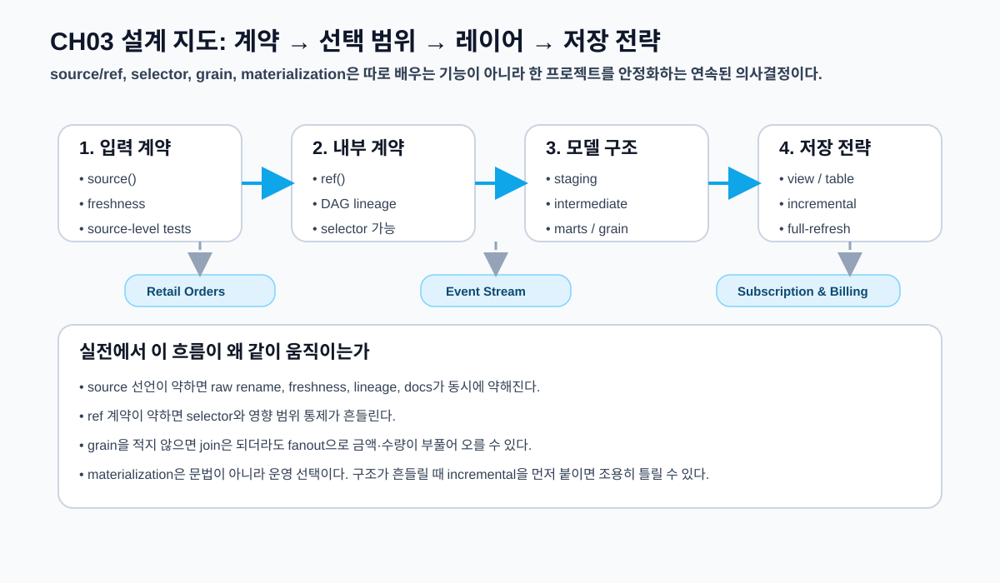

*그림 3-1. source/ref, selector, grain, materialization이 하나의 설계 문제로 이어지는 구조*

<a id="book-chapters-reference-v3-03-source-ref-selectors-layered-modeling-grain-and-materializations-md--31-왜-이-다섯-주제를-한-장에서-함께-다루는가"></a>

### 3.1. 왜 이 다섯 주제를 한 장에서 함께 다루는가

많은 초보자는 dbt를 배우면서 `source()`와 `ref()`는 의존성 이야기, `--select`는 실행 명령 이야기, 레이어와 grain은 모델링 이야기, materialization은 성능 이야기라고 따로따로 기억한다. 하지만 실무에서 문제는 이렇게 분리되어 오지 않는다.

예를 들어 주문 fact가 이상하게 커졌다고 해 보자. 원인은 보통 다음 중 하나다.

1. 원천을 잘못 읽었다.
2. 모델 간 연결을 잘못 잡았다.
3. 서로 다른 grain을 그대로 join했다.
4. selector를 넓게 잡아 엉뚱한 범위를 다시 만들었다.
5. incremental 범위를 잘못 설계했다.

즉, 이 다섯 주제는 모두 모델이 어떤 입력을 받고, 어떤 단위의 행을 만들며, 어떤 범위를 다시 계산할 것인가라는 한 문제를 다른 각도에서 보는 것이다.

<a id="book-chapters-reference-v3-03-source-ref-selectors-layered-modeling-grain-and-materializations-md--311-이-장에서-반드시-잡아야-할-기준선"></a>

#### 3.1.1. 이 장에서 반드시 잡아야 할 기준선

이 장을 다 읽고 나면 최소한 아래 다섯 가지는 설명할 수 있어야 한다.

- `source()`는 프로젝트 바깥 입력, `ref()`는 프로젝트 안 산출물이라는 점
- `--select`는 편의 기능이 아니라 개발 범위를 통제하는 핵심 도구라는 점
- 레이어 분리는 보기 좋으라고 하는 정리가 아니라 변경 비용을 줄이기 위한 설계라는 점
- grain은 SQL을 쓰기 전에 먼저 결정해야 하는 모델의 단위라는 점
- incremental은 “빠르게 만드는 옵션”이 아니라 “어떤 범위를 다시 읽을지 설계하는 패턴”이라는 점

<a id="book-chapters-reference-v3-03-source-ref-selectors-layered-modeling-grain-and-materializations-md--312-이-장을-읽는-방법"></a>

#### 3.1.2. 이 장을 읽는 방법

이 장은 크게 네 묶음으로 이루어진다.

1. 계약과 DAG: `source()`, `ref()`, freshness, selector
2. 모델링과 grain: staging → intermediate → marts, business key, fanout
3. 저장 전략: view, table, incremental, ephemeral, materialized_view 관점
4. 예제 적용: 세 트랙이 위 원리를 어떻게 실제 모델과 파일로 구현하는지

따라서 처음 읽을 때는 문법을 외우기보다, 각 절이 결국 어떤 질문에 답하는지에 집중하는 편이 좋다.

<a id="book-chapters-reference-v3-03-source-ref-selectors-layered-modeling-grain-and-materializations-md--32-source와-ref-원천과-모델-사이의-계약"></a>

### 3.2. source()와 ref(): 원천과 모델 사이의 계약

`source()`와 `ref()`는 dbt 프로젝트의 가장 중요한 두 함수다. 하지만 둘 다 “테이블 이름을 감추는 함수” 정도로 이해하면 금방 한계에 부딪힌다. 핵심은 이름이 아니라 계약이다.

- `source()`는 프로젝트 바깥의 입력을 공식화한다.
- `ref()`는 프로젝트 안에서 만들어진 산출물 간의 의존성을 공식화한다.

이 둘을 통해 dbt는 단순 SQL 파일 모음을 DAG 기반 프로젝트로 바꾼다.

<a id="book-chapters-reference-v3-03-source-ref-selectors-layered-modeling-grain-and-materializations-md--321-source는-원천을-공식-입력으로-선언한다"></a>

#### 3.2.1. source()는 원천을 공식 입력으로 선언한다

`source()`를 쓰기 시작하면 원천 테이블은 단순한 물리 테이블이 아니라 프로젝트의 공식 입력이 된다. 이 순간부터 다음이 가능해진다.

- 원천 설명과 컬럼 설명 작성
- 컬럼 수준 data test 부착
- freshness 기준 정의
- docs lineage에서 시작점 표시
- 원천 rename이나 schema 변경의 영향 범위 추적

실무에서 source 선언이 중요한 이유는 “raw를 읽는다”는 사실을 코드 안의 묵시적 습관이 아니라 프로젝트 수준의 명시적 계약으로 올려주기 때문이다.

<a id="book-chapters-reference-v3-03-source-ref-selectors-layered-modeling-grain-and-materializations-md--3211-retail-orders에서의-기본-source-예시"></a>

##### 3.2.1.1. Retail Orders에서의 기본 source 예시

아래 파일은 이 장에서 계속 참조하는 retail track의 source starter다.

경로: `../codes/02_reference_patterns/ch03/sources_retail.yml`

```yaml
version: 2
sources:
  - name: raw
    description: "소매 주문 예제의 원천 입력"
    schema: raw
    loaded_at_field: ingested_at
    freshness:
      warn_after: {count: 6, period: hour}
      error_after: {count: 24, period: hour}
    tables:
      - name: customers
        description: "고객 원천"
        columns:
          - name: customer_id
            data_tests:
              - not_null
              - unique
      - name: orders
        description: "주문 헤더 원천"
        columns:
          - name: order_id
            data_tests:
              - not_null
              - unique
      - name: order_items
        description: "주문 라인 원천"
        columns:
          - name: order_item_id
            data_tests:
              - not_null
              - unique
      - name: products
        description: "상품 원천"
        columns:
          - name: product_id
            data_tests:
              - not_null
              - unique
```

<a id="book-chapters-reference-v3-03-source-ref-selectors-layered-modeling-grain-and-materializations-md--322-ref는-모델-간-관계를-코드로-고정한다"></a>

#### 3.2.2. ref()는 모델 간 관계를 코드로 고정한다

`ref()`는 프로젝트 내부 모델 사이의 관계를 선언한다. 이 함수가 중요한 이유는 세 가지다.

1. 실행 순서를 자동으로 정한다.
2. 문서화와 lineage를 만든다.
3. selector로 upstream/downstream 범위를 제어할 수 있게 한다.

즉, `ref()`는 단순히 스키마와 테이블명을 대신 적어 주는 편의 기능이 아니라, 모델을 그래프로 묶는 핵심 함수다.

```sql
select *
from {{ ref('stg_orders') }}
```

<a id="book-chapters-reference-v3-03-source-ref-selectors-layered-modeling-grain-and-materializations-md--3221-source와-ref를-어떻게-구분할까"></a>

##### 3.2.2.1. source()와 ref()를 어떻게 구분할까

| 상황 | 써야 할 것 | 이유 |
| --- | --- | --- |
| 프로젝트 바깥의 raw 입력 | `source()` | 프로젝트 외부 입력이기 때문 |
| 같은 dbt 프로젝트 안의 다른 모델 | `ref()` | DAG와 실행 순서를 자동으로 연결하기 때문 |
| seed 파일 | 보통 `ref()` | dbt가 만든 리소스로 다루기 때문 |
| 다른 프로젝트의 공개 모델 | 뒤 장의 `cross-project ref` | 별도 프로젝트 계약을 따르기 때문 |

<a id="book-chapters-reference-v3-03-source-ref-selectors-layered-modeling-grain-and-materializations-md--3222-하드코딩이-왜-위험한가"></a>

##### 3.2.2.2. 하드코딩이 왜 위험한가

`from raw.orders`처럼 relation 이름을 직접 쓰면 당장은 한 줄이 짧아 보인다. 하지만 다음 비용이 생긴다.

- docs에 원천 계약이 드러나지 않는다.
- rename이나 schema 변경에 취약하다.
- 환경이 달라질 때 relation naming이 흔들린다.
- source-level description, freshness, test와 자연스럽게 연결되지 않는다.

실무 규칙으로는 다음 한 줄이 강력하다.

> 원천을 직접 읽는 첫 모델은 항상 `source()`에서 시작한다.

<a id="book-chapters-reference-v3-03-source-ref-selectors-layered-modeling-grain-and-materializations-md--323-source-freshness는-원천의-시간-계약이다"></a>

#### 3.2.3. source freshness는 원천의 시간 계약이다

freshness는 “이 원천이 얼마나 최신 상태여야 하는가”를 정의하는 장치다. 초보자에게는 화려한 모니터링 기능처럼 보일 수 있지만, 실제로는 원천 데이터와 downstream 변환 사이의 시간 계약을 표현하는 기본 도구다.

- `loaded_at_field`는 freshness 계산의 기준 시각을 제공한다.
- `warn_after`는 늦어졌음을 알린다.
- `error_after`는 기준을 넘으면 실패로 처리한다.

```bash
dbt source freshness
dbt build --select "source_status:fresher+"
```

<a id="book-chapters-reference-v3-03-source-ref-selectors-layered-modeling-grain-and-materializations-md--3231-freshness를-너무-늦게-넣으면-생기는-문제"></a>

##### 3.2.3.1. freshness를 너무 늦게 넣으면 생기는 문제

freshness가 없으면 “왜 오늘 리포트가 비었는가” 같은 질문에 답하기 어려워진다. 모델 로직이 아니라 원천 도착 지연 때문일 수도 있는데, 이 둘을 분리할 근거가 없기 때문이다.

<a id="book-chapters-reference-v3-03-source-ref-selectors-layered-modeling-grain-and-materializations-md--3232-세-예제에서-freshness가-쓰이는-자리"></a>

##### 3.2.3.2. 세 예제에서 freshness가 쓰이는 자리

- Retail Orders: POS/주문 적재가 끊기지 않았는지 확인
- Event Stream: 이벤트 수집 파이프라인이 늦게 도착했는지 확인
- Subscription & Billing: 청구/구독 변경 이벤트가 SLA 안에 들어왔는지 확인

<a id="book-chapters-reference-v3-03-source-ref-selectors-layered-modeling-grain-and-materializations-md--324-세-예제에서-sourceref가-실제로-어떻게-쓰이는가"></a>

#### 3.2.4. 세 예제에서 source/ref가 실제로 어떻게 쓰이는가

<a id="book-chapters-reference-v3-03-source-ref-selectors-layered-modeling-grain-and-materializations-md--3241-retail-orders"></a>

##### 3.2.4.1. Retail Orders

- `source('raw', 'orders')`로 주문 헤더 입력을 읽는다.
- `ref('stg_orders')`로 정리된 주문 모델을 downstream에서 재사용한다.
- `ref('int_order_lines')`로 주문 라인 조인을 fact 모델에서 소비한다.

특히 주문 `5003`은 이 장의 대표 레코드로 계속 추적한다. day1에서는 일반 주문이지만, day2에서는 상태가 바뀌며 downstream 집계와 business rule 논의의 출발점이 된다.

<a id="book-chapters-reference-v3-03-source-ref-selectors-layered-modeling-grain-and-materializations-md--3242-event-stream"></a>

##### 3.2.4.2. Event Stream

- `source('raw', 'events')`는 append-only 이벤트 입력의 시작점이다.
- `ref('stg_events')`는 event_time, user_id, event_type 정규화 결과를 뜻한다.
- `ref('int_sessions')`는 세션화 또는 event enrichment를 위한 중간 모델이 된다.

이 트랙에서는 `source()`가 특히 중요하다. 이벤트 수집 계층은 schema drift, 필드 nullable, late arrival 문제가 자주 생기기 때문이다.

<a id="book-chapters-reference-v3-03-source-ref-selectors-layered-modeling-grain-and-materializations-md--3243-subscription--billing"></a>

##### 3.2.4.3. Subscription & Billing

- `source('raw', 'subscription_events')`
- `source('raw', 'invoice_lines')`
- `ref('stg_subscription_events')`
- `ref('int_subscription_changes')`

이 트랙에서는 `ref()`가 특히 business rule 연결의 의미를 가진다. 같은 고객의 상태 변화가 여러 단계 모델에서 재사용되기 때문에, relation 하드코딩보다 DAG 계약이 훨씬 중요해진다.

<a id="book-chapters-reference-v3-03-source-ref-selectors-layered-modeling-grain-and-materializations-md--325-직접-해보기"></a>

#### 3.2.5. 직접 해보기

1. retail source 파일에 `orders.customer_id`의 `not_null` test를 추가한다.
2. `loaded_at_field`와 freshness 기준을 읽고, 현재 예제에 맞는 `warn_after` / `error_after`를 한국어 문장으로 다시 설명한다.
3. `stg_orders.sql`에서 `source()` 대신 raw relation을 직접 적었다고 가정하고, 어떤 운영 비용이 생기는지 세 가지 적는다.

<a id="book-chapters-reference-v3-03-source-ref-selectors-layered-modeling-grain-and-materializations-md--326-완료-체크리스트"></a>

#### 3.2.6. 완료 체크리스트

- [ ] `source()`와 `ref()`의 차이를 설명할 수 있다.
- [ ] source freshness가 왜 필요한지 설명할 수 있다.
- [ ] 하드코딩 relation 이름이 왜 위험한지 실무 관점에서 말할 수 있다.

<a id="book-chapters-reference-v3-03-source-ref-selectors-layered-modeling-grain-and-materializations-md--33---select---selector-dbt-ls-개발-범위를-줄이는-문법"></a>

### 3.3. --select, --selector, dbt ls: 개발 범위를 줄이는 문법

프로젝트가 커질수록 중요한 것은 “전체를 잘 만드는 것”만이 아니라 내가 바꾼 범위만 빠르게 확인하는 것이다. 이때 핵심이 node selection 문법이다.

<a id="book-chapters-reference-v3-03-source-ref-selectors-layered-modeling-grain-and-materializations-md--331-왜-선택-실행이-중요한가"></a>

#### 3.3.1. 왜 선택 실행이 중요한가

초보자는 매번 `dbt build` 전체 실행으로 안심하고 싶어진다. 하지만 프로젝트가 커지면 전체 실행은 가장 느리고 비싼 습관이 된다. 선택 실행을 잘 쓰면 다음이 가능하다.

- 실패 범위를 빠르게 좁힌다.
- 수정 영향이 upstream인지 downstream인지 구분한다.
- 불필요한 warehouse 비용을 줄인다.
- CI에서 필요한 노드만 검증한다.

<a id="book-chapters-reference-v3-03-source-ref-selectors-layered-modeling-grain-and-materializations-md--332-가장-먼저-익힐-네-가지-패턴"></a>

#### 3.3.2. 가장 먼저 익힐 네 가지 패턴

| 명령 | 의미 | 언제 쓰는가 |
| --- | --- | --- |
| `dbt run -s stg_orders` | 현재 모델만 | 수정 직후 가장 빠른 확인 |
| `dbt run -s stg_orders+` | 현재 + downstream | 내 변경이 mart까지 어떻게 퍼지는지 확인 |
| `dbt run -s +fct_orders` | 현재 + upstream | fact가 이상할 때 입력을 함께 확인 |
| `dbt run -s +fct_orders+` | 양방향 | 영향 범위를 크게 보고 싶을 때 |

<a id="book-chapters-reference-v3-03-source-ref-selectors-layered-modeling-grain-and-materializations-md--3321--n-를-어떻게-감각적으로-볼까"></a>

##### 3.3.2.1. `+`, `n+`, `@`를 어떻게 감각적으로 볼까

- `+model` : model의 upstream 조상 포함
- `model+` : model의 downstream 자손 포함
- `2+model` : 두 단계 upstream까지만 포함
- `@model` : model의 downstream을 만들기 위해 필요한 upstream까지 넓게 포함

처음에는 `+model`, `model+`, `+model+` 세 개만 확실히 익히면 충분하다. `n+`와 `@`는 실무에서 선택 범위를 더 세밀하게 통제할 때 사용한다.

<a id="book-chapters-reference-v3-03-source-ref-selectors-layered-modeling-grain-and-materializations-md--333-복잡한-선택은-먼저-dbt-ls로-확인한다"></a>

#### 3.3.3. 복잡한 선택은 먼저 `dbt ls`로 확인한다

```bash
dbt ls -s +fct_orders+
dbt ls -s tag:daily
dbt ls -s test_type:generic
dbt ls -s test_type:singular
dbt ls -s test_type:unit
```

`dbt ls`는 “내가 머릿속으로 생각한 범위”와 “dbt가 실제로 해석한 범위”를 비교하는 가장 빠른 방법이다. 특히 태그, 경로, graph operator, test_type이 섞이면 바로 실행하기보다 먼저 `ls`로 확인하는 습관이 중요하다.

<a id="book-chapters-reference-v3-03-source-ref-selectors-layered-modeling-grain-and-materializations-md--334---select와---selector를-구분하자"></a>

#### 3.3.4. `--select`와 `--selector`를 구분하자

- `--select`는 명령줄에서 selection 표현식을 즉석으로 적는다.
- `--selector`는 `selectors.yml`에 저장한 이름 붙은 selection 정의를 불러온다.

프로젝트가 커질수록 자주 쓰는 선택식을 YAML selector로 저장하는 편이 좋다. selection logic을 코드로 남길 수 있고, 팀 전체가 같은 이름을 공유할 수 있기 때문이다.

경로: `../codes/02_reference_patterns/ch03/selectors.yml`

```yaml
selectors:
  - name: retail_marts_plus_tests
    definition:
      union:
        - method: path
          value: models/retail/marts
        - method: test_type
          value: generic

  - name: changed_core_models
    definition:
      method: state
      value: modified+

  - name: event_incremental_focus
    definition:
      intersection:
        - method: path
          value: models/events
        - method: tag
          value: incremental
```

<a id="book-chapters-reference-v3-03-source-ref-selectors-layered-modeling-grain-and-materializations-md--335-dbt-show는-preview용이지-대체-실행기가-아니다"></a>

#### 3.3.5. `dbt show`는 preview용이지 대체 실행기가 아니다

`dbt show`는 선택한 단일 모델이나 테스트, analysis, 혹은 `--inline` 쿼리를 컴파일하고 실행해서 결과를 터미널에 미리 보여 준다. 중요한 점은 “이미 만들어진 테이블을 그냥 읽는 것”이 아니라, 선택한 정의를 기준으로 다시 컴파일하고 warehouse에 질의한다는 것이다.

```bash
dbt show --select stg_orders
dbt show --select fct_orders
```

`dbt show`는 빠른 preview에는 매우 유용하지만, model selection 문법 전체를 대체하지는 않는다. 공식 문서도

<a id="book-chapters-reference-v3-03-source-ref-selectors-layered-modeling-grain-and-materializations-md--336-세-예제에서-selector가-실제로-어떻게-쓰이는가"></a>

#### 3.3.6. 세 예제에서 selector가 실제로 어떻게 쓰이는가

<a id="book-chapters-reference-v3-03-source-ref-selectors-layered-modeling-grain-and-materializations-md--3361-retail-orders"></a>

##### 3.3.6.1. Retail Orders

- `dbt build -s stg_orders+` : 주문 정리 변경이 fact로 어떻게 퍼지는지 확인
- `dbt test -s fct_orders+` : 주문 fact와 관련 테스트만 확인
- `dbt ls -s +fct_orders+` : `5003` 이슈를 upstream/downstream 시야로 좁혀 보기

<a id="book-chapters-reference-v3-03-source-ref-selectors-layered-modeling-grain-and-materializations-md--3362-event-stream"></a>

##### 3.3.6.2. Event Stream

- `dbt build -s tag:incremental` : 이벤트 트랙의 incremental 노드만 재검증
- `dbt show --select fct_events_daily` : 일별 집계 상단 몇 줄 확인
- `dbt run --selector event_incremental_focus` : 선택식을 YAML로 고정

<a id="book-chapters-reference-v3-03-source-ref-selectors-layered-modeling-grain-and-materializations-md--3363-subscription--billing"></a>

##### 3.3.6.3. Subscription & Billing

- `dbt build -s int_subscription_changes+` : 상태 변화 중간 모델 이후 범위만 확인
- `dbt test -s test_type:generic,path:models/subscription` : 핵심 품질 규칙만 먼저 확인
- `dbt ls -s +fct_subscription_daily` : 어떤 upstream이 포함되는지 확인

<a id="book-chapters-reference-v3-03-source-ref-selectors-layered-modeling-grain-and-materializations-md--337-안티패턴"></a>

#### 3.3.7. 안티패턴

- 항상 전체 `dbt build`만 누른다.
- selection을 복잡하게 적으면서도 `dbt ls`로 먼저 확인하지 않는다.
- 자주 쓰는 selection을 팀 규칙으로 남기지 않는다.
- preview가 필요할 때도 무조건 full run부터 돌린다.

<a id="book-chapters-reference-v3-03-source-ref-selectors-layered-modeling-grain-and-materializations-md--338-직접-해보기"></a>

#### 3.3.8. 직접 해보기

1. `dbt ls -s stg_orders+`를 실행한다고 가정하고, 어떤 downstream 모델이 포함될지 글로 적어 본다.
2. `test_type:generic`, `test_type:singular`, `test_type:unit`의 차이를 한 문장씩 써 본다.
3. `selectors.yml`에 `subscription_core` selector를 하나 더 만든다고 가정하고 정의를 적어 본다.

<a id="book-chapters-reference-v3-03-source-ref-selectors-layered-modeling-grain-and-materializations-md--339-완료-체크리스트"></a>

#### 3.3.9. 완료 체크리스트

- [ ] `+model`, `model+`, `+model+`의 차이를 알고 있다.
- [ ] `dbt ls`로 selection 결과를 먼저 확인해야 하는 이유를 설명할 수 있다.
- [ ] `--select`와 `--selector`의 차이를 설명할 수 있다.
- [ ] `dbt show`의 용도를 안다.

<a id="book-chapters-reference-v3-03-source-ref-selectors-layered-modeling-grain-and-materializations-md--34-레이어-grain-business-key-모델링의-뼈대"></a>

### 3.4. 레이어, grain, business key: 모델링의 뼈대

좋은 dbt 프로젝트는 거대한 SQL 하나를 잘 쓰는 프로젝트가 아니다. 서로 다른 목적을 가진 모델을 레이어로 나누고, 각 모델의 grain을 명확히 하며, fanout을 통제하는 프로젝트다.

<a id="book-chapters-reference-v3-03-source-ref-selectors-layered-modeling-grain-and-materializations-md--341-레이어를-나누는-이유는-변경-비용을-줄이기-위해서다"></a>

#### 3.4.1. 레이어를 나누는 이유는 변경 비용을 줄이기 위해서다

| 레이어 | 주된 역할 | 주로 두는 내용 | 가급적 피할 일 |
| --- | --- | --- | --- |
| staging | 원천 정리 | rename, cast, status normalization, 기본 필터 | 복잡한 조인, 최종 KPI |
| intermediate | 재사용 가능한 조인/계산 | reusable joins, helper columns, line-level derivation | 최종 fact/dim 역할까지 동시에 맡기기 |
| marts | 분석용 최종 구조 | fact, dimension, KPI, metric-ready 테이블 | raw 정리 로직 다시 쓰기 |

staging → intermediate → marts 구조는 보기 좋으라고 만든 폴더 체계가 아니다. 어디에서 rename과 cast를 끝내고, 어디에서 재사용 가능한 로직을 묶고, 어디에서 최종 grain과 KPI를 확정할지 결정하는 운영 구조다.

<a id="book-chapters-reference-v3-03-source-ref-selectors-layered-modeling-grain-and-materializations-md--342-grain은-한-행이-무엇을-대표하는가라는-한-문장이다"></a>

#### 3.4.2. grain은 “한 행이 무엇을 대표하는가”라는 한 문장이다

grain을 모르면 SQL을 쓸 수 있어도 모델을 설계했다고 말하기 어렵다. 아래처럼 한 문장으로 적을 수 있어야 한다.

- `stg_orders`: 한 행이 주문 1건을 대표한다.
- `stg_order_items`: 한 행이 주문상품 1건을 대표한다.
- `int_order_lines`: 한 행이 주문상품 1건을 대표한다.
- `fct_orders`: 한 행이 주문 1건을 대표한다.

<a id="book-chapters-reference-v3-03-source-ref-selectors-layered-modeling-grain-and-materializations-md--3421-grain을-적지-않으면-왜-위험한가"></a>

##### 3.4.2.1. grain을 적지 않으면 왜 위험한가

SQL을 먼저 쓰면 자연스럽게 join과 group by에 끌려가게 된다. 하지만 grain을 먼저 적으면 “지금 이 모델은 주문 1행인가, 주문상품 1행인가, 사용자-세션 1행인가”가 분명해지고, fanout 위험을 훨씬 빨리 발견할 수 있다.

<a id="book-chapters-reference-v3-03-source-ref-selectors-layered-modeling-grain-and-materializations-md--343-fanout은-무엇이고-왜-생기나"></a>

#### 3.4.3. fanout은 무엇이고 왜 생기나

fanout은 서로 다른 grain의 테이블을 조인했을 때 행 수가 늘어났는데, 그 사실을 인지하지 못한 채 금액이나 수량을 집계해서 결과가 커지는 현상이다.

대표적인 실수는 이렇다.

1. 주문 1행 테이블이 있다.
2. 주문상품 여러 행 테이블을 조인한다.
3. grain을 다시 주문 1행으로 올리지 않는다.
4. 금액 합계를 내면 주문 수만큼 값이 부풀어 오른다.

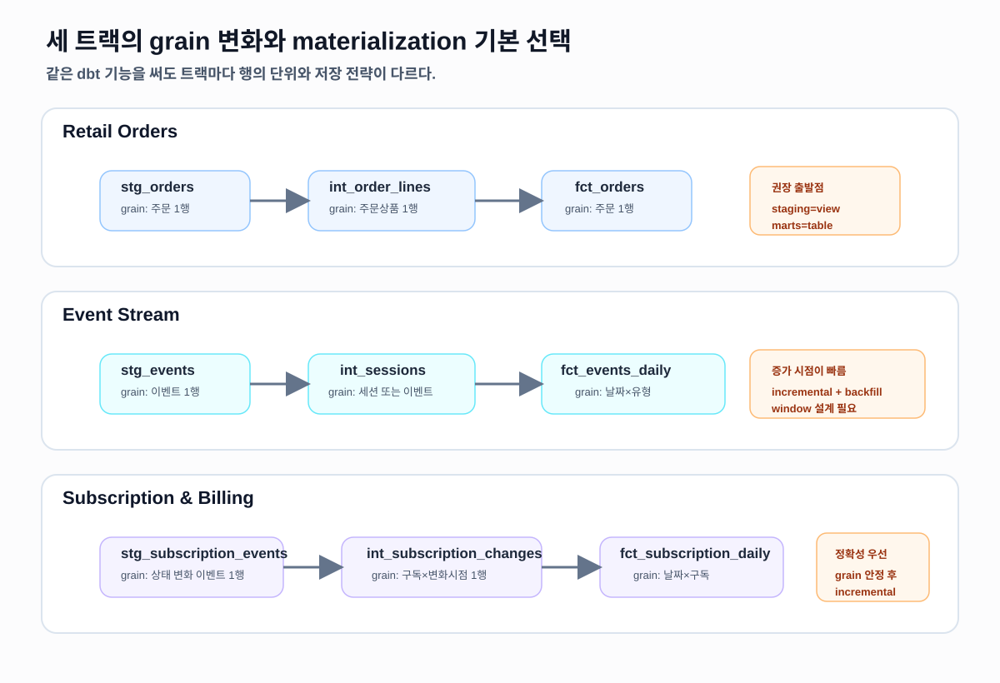

*그림 3-2. 세 트랙의 grain 변화와 materialization 선택*

<a id="book-chapters-reference-v3-03-source-ref-selectors-layered-modeling-grain-and-materializations-md--3431-fanout을-잡는-기본-질문-네-가지"></a>

##### 3.4.3.1. fanout을 잡는 기본 질문 네 가지

- join 전 모델의 grain은 무엇인가?
- join 후 모델의 grain은 그대로인가, 더 세밀해졌는가?
- fact로 올리기 전에 grain을 다시 의도한 단위로 집계했는가?
- 고유키 테스트와 총합 비교로 이상을 확인했는가?

<a id="book-chapters-reference-v3-03-source-ref-selectors-layered-modeling-grain-and-materializations-md--344-retail-orders-5003이-intermediate에서-어떻게-풀리는가"></a>

#### 3.4.4. Retail Orders: 5003이 intermediate에서 어떻게 풀리는가

경로: `../codes/02_reference_patterns/ch03/int_order_lines.sql`

```sql
with orders as (
    select *
    from {{ ref('stg_orders') }}
),
items as (
    select *
    from {{ ref('stg_order_items') }}
),
products as (
    select *
    from {{ ref('stg_products') }}
)
select
    i.order_item_id,
    i.order_id,
    o.customer_id,
    o.order_date,
    o.order_status,
    o.payment_method,
    i.product_id,
    p.product_name,
    p.category_name,
    i.quantity,
    i.unit_price,
    i.discount_amount,
    i.line_amount
from items i
join orders o using (order_id)
join products p using (product_id)
```

주문 `5003`은 intermediate 단계에서 주문상품 두 행으로 펼쳐진다. 여기서 grain은 여전히 주문상품 1행이다. `fct_orders`로 올라갈 때 다시 주문 1행으로 집계해야 한다.

<a id="book-chapters-reference-v3-03-source-ref-selectors-layered-modeling-grain-and-materializations-md--345-event-stream-이벤트는-append-only라서-grain-관리가-더-중요하다"></a>

#### 3.4.5. Event Stream: 이벤트는 append-only라서 grain 관리가 더 중요하다

이벤트 트랙에서는 기본 grain이 “이벤트 1행”일 때가 많다. 그런데 세션화가 들어가면 grain이 “세션 1행”으로 바뀐다. 일별 집계는 또 “날짜 × 사용자” 또는 “날짜 × 이벤트 유형”으로 바뀐다. 이때 intermediate 없이 바로 fact로 점프하면 아래 문제가 생긴다.

- session boundary logic이 여러 모델에 복제된다.
- late event 처리 범위가 흔들린다.
- incremental 설계와 grain 설계가 동시에 꼬인다.

즉, Event Stream 트랙에서는 intermediate가 더 중요한 경우가 많다.

<a id="book-chapters-reference-v3-03-source-ref-selectors-layered-modeling-grain-and-materializations-md--346-subscription--billing-상태-변화-모델은-grain이-더-자주-바뀐다"></a>

#### 3.4.6. Subscription & Billing: 상태 변화 모델은 grain이 더 자주 바뀐다

구독 데이터는 한 고객, 한 구독, 한 청구 라인, 한 날짜 기준 MRR처럼 grain 축이 자주 바뀐다.

- raw subscription event: 상태 변화 이벤트 1행
- intermediate change log: 구독 × 변화 시점 1행
- daily snapshot/fact: 날짜 × 구독 1행
- customer rollup: 날짜 × 고객 1행

이런 모델은 grain 문장을 먼저 적지 않으면 계약 조건, 업셀/다운셀, churn 처리 로직이 쉽게 꼬인다.

<a id="book-chapters-reference-v3-03-source-ref-selectors-layered-modeling-grain-and-materializations-md--347-grain-클리닉-모델을-쓰기-전에-적어야-할-템플릿"></a>

#### 3.4.7. grain 클리닉: 모델을 쓰기 전에 적어야 할 템플릿

아래 템플릿을 모델 주석이나 설계 메모에 먼저 적는 습관을 권한다.

```text
모델 이름:
이 모델의 grain:
비즈니스 키:
upstream 입력:
이 모델에서 새로 생기는 계산 규칙:
다음 레이어에서 기대하는 grain:
```

이 템플릿은 SQL보다 먼저 쓰는 것이 좋다. grain과 business key가 분명해지면 join, group by, test 설계도 함께 선명해진다.

<a id="book-chapters-reference-v3-03-source-ref-selectors-layered-modeling-grain-and-materializations-md--348-안티패턴"></a>

#### 3.4.8. 안티패턴

- join을 먼저 쓰고 grain을 나중에 생각한다.
- staging에서 최종 KPI까지 계산한다.
- intermediate를 생략한 채 같은 조인을 여러 mart에 반복한다.
- fact 모델에서 원천 정리 로직을 다시 쓴다.

<a id="book-chapters-reference-v3-03-source-ref-selectors-layered-modeling-grain-and-materializations-md--349-직접-해보기"></a>

#### 3.4.9. 직접 해보기

1. Retail Orders의 `stg_orders`, `stg_order_items`, `int_order_lines`, `fct_orders` 각각에 대해 grain을 한 줄씩 적는다.
2. Event Stream에서 “세션 1행” fact를 만들려면 intermediate가 왜 필요한지 적는다.
3. Subscription 트랙에서 `daily_mrr` 모델의 grain을 한 문장으로 정의한다.

<a id="book-chapters-reference-v3-03-source-ref-selectors-layered-modeling-grain-and-materializations-md--3410-완료-체크리스트"></a>

#### 3.4.10. 완료 체크리스트

- [ ] 레이어별 책임을 구분할 수 있다.
- [ ] grain을 한 문장으로 정의할 수 있다.
- [ ] fanout이 왜 생기는지 설명할 수 있다.
- [ ] business key와 최종 집계 위치를 구분할 수 있다.

<a id="book-chapters-reference-v3-03-source-ref-selectors-layered-modeling-grain-and-materializations-md--35-materializations와-incremental-저장-전략은-운영-결정이다"></a>

### 3.5. Materializations와 incremental: 저장 전략은 운영 결정이다

SQL은 “무엇을 계산할 것인가”를 말하지만, materialization은 “그 결과를 어떤 객체로 남길 것인가”를 결정한다. 이 결정은 성능, 비용, 디버깅, 운영 방식과 직결된다.

<a id="book-chapters-reference-v3-03-source-ref-selectors-layered-modeling-grain-and-materializations-md--351-대표-materialization을-어떻게-비교할까"></a>

#### 3.5.1. 대표 materialization을 어떻게 비교할까

| 유형 | 특징 | 잘 맞는 자리 | 주의점 |
| --- | --- | --- | --- |
| `view` | 쿼리 정의만 저장 | staging, 가벼운 intermediate | 조회 시 비용/지연이 발생할 수 있음 |
| `table` | 결과를 물리 테이블로 저장 | 자주 읽히는 marts | 재계산 비용이 큼 |
| `incremental` | 새 데이터 중심 갱신 | 대용량 fact, append/update 혼합 모델 | 범위/키 설계가 틀리면 조용히 틀림 |
| `ephemeral` | 상위 모델에 인라인 | 아주 작은 helper logic | 디버깅/재사용 범위가 제한됨 |
| `materialized_view` | 플랫폼 지원 시 엔진이 관리하는 뷰/테이블 하이브리드 | adapter-specific 최적화 영역 | 지원 범위가 플랫폼별로 다름 |

<a id="book-chapters-reference-v3-03-source-ref-selectors-layered-modeling-grain-and-materializations-md--352-입문자에게-stagingview-martstable이-안전한-이유"></a>

#### 3.5.2. 입문자에게 staging=view, marts=table이 안전한 이유

초반에는 모델 구조와 grain이 흔들리기 쉽다. 이 시점에서 incremental까지 동시에 붙이면 무엇이 문제인지 분리하기 어렵다. 그래서 처음에는 아래 출발점이 가장 안정적이다.

- staging = `view`
- intermediate = `view` 또는 작은 경우 `ephemeral`
- marts = `table`

이렇게 시작하면 구조와 테스트를 먼저 안정화한 뒤, 나중에 성능이 필요할 때 incremental을 검토할 수 있다.

<a id="book-chapters-reference-v3-03-source-ref-selectors-layered-modeling-grain-and-materializations-md--353-incremental을-붙이기-전에-반드시-물어야-할-다섯-가지"></a>

#### 3.5.3. incremental을 붙이기 전에 반드시 물어야 할 다섯 가지

1. 새로 들어온 행을 구분할 기준 시각이나 키가 있는가?
2. 과거 행이 수정(update)될 수 있는가?
3. `unique_key`는 무엇인가?
4. late-arriving data를 어디까지 다시 읽을 것인가?
5. 문제가 생겼을 때 `full-refresh`로 복구할 수 있는가?

<a id="book-chapters-reference-v3-03-source-ref-selectors-layered-modeling-grain-and-materializations-md--354-event-stream에서-incremental이-자연스러운-이유"></a>

#### 3.5.4. Event Stream에서 incremental이 자연스러운 이유

이벤트 트랙은 append-only 성격이 강해서 incremental이 가장 먼저 떠오르는 예시다. 하지만 “append-only처럼 보인다”와 “incremental 설계가 안전하다”는 다르다.

경로: `../codes/02_reference_patterns/ch03/fct_events_incremental.sql`

```sql
{{ config(
    materialized='incremental',
    unique_key='event_id',
    on_schema_change='append_new_columns'
) }}

with src as (
    select *
    from {{ ref('stg_events') }}
    
      where event_time >= (
        select coalesce(max(event_time) - interval '2 hour', cast('1900-01-01' as timestamp))
        from {{ this }}
      )
    
)
select
    event_id,
    user_id,
    session_id,
    event_time,
    event_type,
    device_type,
    event_date
from src
```

여기서 중요한 것은 `materialized='incremental'` 자체보다도, `is_incremental()` 안에서 몇 시간의 backfill window를 다시 읽는지와 `unique_key='event_id'`가 어떤 계약을 뜻하는지다.

<a id="book-chapters-reference-v3-03-source-ref-selectors-layered-modeling-grain-and-materializations-md--355-subscription--billing에서-incremental이-더-어려운-이유"></a>

#### 3.5.5. Subscription & Billing에서 incremental이 더 어려운 이유

구독/청구 트랙은 단순 append-only가 아니라 상태 변화와 재계산이 많다. 예를 들어 day2에 과거 계약 상태가 수정되면, 단순히 “최근 도착분만 append”로는 정확한 daily MRR을 보장하기 어렵다. 이럴 때는 아래 중 하나를 명확히 결정해야 한다.

- 최근 N일 재계산 window를 둔다.
- 상태 변화 intermediate를 다시 계산한 뒤 daily fact를 rebuild한다.
- 아예 초기 버전에서는 `table`로 유지하고 운영 안정화 후 incremental로 전환한다.

경로: `../codes/02_reference_patterns/ch03/fct_subscription_daily.sql`

```sql
with changes as (
    select *
    from {{ ref('int_subscription_changes') }}
),
daily as (
    select
        customer_id,
        subscription_id,
        snapshot_date,
        sum(mrr_delta) as mrr_change,
        max(is_active) as is_active
    from changes
    group by 1, 2, 3
)
select
    customer_id,
    subscription_id,
    snapshot_date,
    sum(mrr_change) over (
        partition by customer_id, subscription_id
        order by snapshot_date
        rows between unbounded preceding and current row
    ) as ending_mrr,
    is_active
from daily
```

이 모델은 당장 incremental을 넣지 않아도 된다. 오히려 초기에는 `table`로 정확성을 먼저 확보하는 것이 더 안전하다.

<a id="book-chapters-reference-v3-03-source-ref-selectors-layered-modeling-grain-and-materializations-md--356-ephemeral은-언제만-써야-하나"></a>

#### 3.5.6. `ephemeral`은 언제만 써야 하나

`ephemeral`은 아주 작은 helper logic을 상위 모델에 인라인할 때 유용하다. 하지만 아래 상황에서는 남용을 피하는 편이 좋다.

- 여러 모델에서 재사용해야 할 때
- compiled SQL이 지나치게 길어질 때
- 디버깅에서 중간 relation을 눈으로 확인하고 싶을 때

즉, `ephemeral`은 “작고 한정적인 보조 로직”에 쓰는 편이 안전하다.

<a id="book-chapters-reference-v3-03-source-ref-selectors-layered-modeling-grain-and-materializations-md--357-full-refresh-on_schema_change-unique_key를-함께-봐야-하는-이유"></a>

#### 3.5.7. `full-refresh`, `on_schema_change`, `unique_key`를 함께 봐야 하는 이유

- `unique_key`는 어떤 행을 동일한 비즈니스 행으로 볼지 정한다.
- `on_schema_change`는 컬럼 구조가 바뀔 때 어떤 태도를 취할지 정한다.
- `full-refresh`는 전체 재계산을 허용할지 금지할지 정한다.

이 셋은 따로따로 외우기보다, incremental 모델을 운영 가능한 상태로 유지하기 위한 안전장치로 함께 이해해야 한다.

<a id="book-chapters-reference-v3-03-source-ref-selectors-layered-modeling-grain-and-materializations-md--358-안티패턴"></a>

#### 3.5.8. 안티패턴

- 느려 보인다는 이유만으로 곧바로 incremental을 붙인다.
- `unique_key` 없이도 괜찮겠지 하고 넘어간다.
- late-arriving data를 고려하지 않는다.
- `full-refresh` 전략 없이 incremental을 운영한다.
- adapter-specific materialized view를 공통 개념처럼 설명한다.

<a id="book-chapters-reference-v3-03-source-ref-selectors-layered-modeling-grain-and-materializations-md--359-직접-해보기"></a>

#### 3.5.9. 직접 해보기

1. Retail Orders의 `fct_orders`를 왜 처음에는 `table`로 두는 편이 안전한지 적는다.
2. Event Stream incremental 예시에서 `- interval '2 hour'`가 왜 필요한지 설명한다.
3. Subscription 트랙에서 incremental을 나중으로 미루는 이유를 한 문장으로 적는다.

<a id="book-chapters-reference-v3-03-source-ref-selectors-layered-modeling-grain-and-materializations-md--3510-완료-체크리스트"></a>

#### 3.5.10. 완료 체크리스트

- [ ] 대표 materialization의 특징을 비교할 수 있다.
- [ ] incremental을 붙이기 전에 물어야 할 질문을 알고 있다.
- [ ] `unique_key`, `full-refresh`, `on_schema_change`의 역할을 설명할 수 있다.
- [ ] 세 트랙에서 incremental 난이도가 왜 다른지 설명할 수 있다.

<a id="book-chapters-reference-v3-03-source-ref-selectors-layered-modeling-grain-and-materializations-md--36-세-예제가-이-장의-개념을-실제로-어떻게-사용해-나가는가"></a>

### 3.6. 세 예제가 이 장의 개념을 실제로 어떻게 사용해 나가는가

지금까지는 공통 원리를 설명했다. 이제 이 원리가 세 예제에서 어떻게 구체화되는지 정리한다. 중요한 점은 각 예제가 같은 기능을 똑같이 쓰지 않는다는 것이다. 같은 도구를 서로 다른 문제 구조에 맞게 쓰는 방식이 다르다.

<a id="book-chapters-reference-v3-03-source-ref-selectors-layered-modeling-grain-and-materializations-md--361-retail-orders-가장-먼저-배워야-할-정석형-트랙"></a>

#### 3.6.1. Retail Orders: 가장 먼저 배워야 할 정석형 트랙

Retail Orders는 이 장의 모든 개념을 가장 직선적으로 보여 준다.

1. `source()`로 raw 주문 데이터를 선언한다.
2. `stg_orders`, `stg_order_items`, `stg_products`에서 이름/타입을 정리한다.
3. `int_order_lines`에서 reusable join을 만든다.
4. `fct_orders`에서 주문 1행 grain으로 다시 집계한다.
5. selector로 `stg_orders+`, `+fct_orders+` 범위를 점검한다.
6. 초기 버전은 `table` 중심으로 두고 정확성을 먼저 확보한다.

이 트랙은 source/ref, 레이어, grain, fanout 방지를 가장 빨리 이해하게 해 주는 정석형 예제다.

<a id="book-chapters-reference-v3-03-source-ref-selectors-layered-modeling-grain-and-materializations-md--362-event-stream-selector와-incremental-감각을-키우는-트랙"></a>

#### 3.6.2. Event Stream: selector와 incremental 감각을 키우는 트랙

Event Stream은 append-only raw 입력과 대량 처리 때문에 selector와 incremental의 필요성이 더 빨리 드러난다.

1. `source('raw', 'events')`로 이벤트 입력을 선언한다.
2. `stg_events`에서 event_time, event_type, user_id 정규화를 마친다.
3. intermediate에서 sessionization 또는 enrichment를 분리한다.
4. fact 단계에서는 일별 집계 또는 세션 집계를 만든다.
5. `tag:incremental`, YAML selector, `dbt ls`가 특히 자주 쓰인다.
6. backfill window와 late-arriving data 설계가 중요하다.

이 트랙은 selection discipline과 incremental 사고방식을 훈련하는 데 가장 좋다.

<a id="book-chapters-reference-v3-03-source-ref-selectors-layered-modeling-grain-and-materializations-md--363-subscription--billing-grain과-business-rule의-난도를-끌어올리는-트랙"></a>

#### 3.6.3. Subscription & Billing: grain과 business rule의 난도를 끌어올리는 트랙

Subscription & Billing은 기술적으로 화려해 보여서 어려운 것이 아니라, grain이 자주 바뀌고 business rule이 민감하기 때문에 어렵다.

1. raw subscription/invoice 입력을 source로 선언한다.
2. staging에서 status, effective date, amount 표준화를 한다.
3. intermediate에서 상태 변화 로그와 delta를 계산한다.
4. fact 단계에서는 날짜 기준 MRR, 계약 활성 여부, billing rollup을 만든다.
5. incremental보다 먼저 grain과 business key를 안정화한다.
6. 뒤 장의 snapshot, contracts, semantic layer와 자연스럽게 연결된다.

이 트랙은 business rule을 어디서 확정할지와 grain 전환을 어떻게 관리할지를 깊게 생각하게 만든다.

<a id="book-chapters-reference-v3-03-source-ref-selectors-layered-modeling-grain-and-materializations-md--364-세-트랙을-비교하며-기억해야-할-한-줄"></a>

#### 3.6.4. 세 트랙을 비교하며 기억해야 할 한 줄

- Retail Orders: 정석형 관계 모델링
- Event Stream: 대량 append와 incremental 설계
- Subscription & Billing: 상태 변화와 grain 전환

같은 `source()`, `ref()`, selector, materialization을 써도, 어떤 문제를 푸느냐에 따라 설계 포인트가 달라진다.

<a id="book-chapters-reference-v3-03-source-ref-selectors-layered-modeling-grain-and-materializations-md--37-장-마무리-이-장에서-꼭-남겨야-할-판단-기준"></a>

### 3.7. 장 마무리: 이 장에서 꼭 남겨야 할 판단 기준

<a id="book-chapters-reference-v3-03-source-ref-selectors-layered-modeling-grain-and-materializations-md--371-먼저-grain-그다음-join"></a>

#### 3.7.1. 먼저 grain, 그다음 join

SQL을 쓰기 전에 grain을 한 문장으로 먼저 적는 습관은 fanout을 줄이는 가장 강력한 방법이다.

<a id="book-chapters-reference-v3-03-source-ref-selectors-layered-modeling-grain-and-materializations-md--372-먼저-계약-그다음-이름"></a>

#### 3.7.2. 먼저 계약, 그다음 이름

원천 입력은 `source()`, 프로젝트 내부 산출물은 `ref()`로 연결해야 장기 운영 비용이 낮아진다.

<a id="book-chapters-reference-v3-03-source-ref-selectors-layered-modeling-grain-and-materializations-md--373-먼저-범위-축소-그다음-실행"></a>

#### 3.7.3. 먼저 범위 축소, 그다음 실행

수정이 생기면 `dbt ls`와 selection으로 범위를 좁힌 뒤 실행하는 습관을 들여야 한다.

<a id="book-chapters-reference-v3-03-source-ref-selectors-layered-modeling-grain-and-materializations-md--374-먼저-정확성-그다음-incremental"></a>

#### 3.7.4. 먼저 정확성, 그다음 incremental

incremental은 성능 최적화 수단이지, 설계가 모호한 모델을 덮어 주는 마법이 아니다.

<a id="book-chapters-reference-v3-03-source-ref-selectors-layered-modeling-grain-and-materializations-md--38-직접-해보기-종합-과제"></a>

### 3.8. 직접 해보기 종합 과제

1. Retail Orders의 `5003`을 기준으로 source → staging → intermediate → mart까지 grain이 어떻게 바뀌는지 적는다.
2. Event Stream에서 `events_daily`와 `sessions_daily` 중 어느 모델이 incremental에 더 잘 맞는지 이유를 적는다.
3. Subscription 트랙에서 daily MRR 모델을 바로 incremental로 만들지 않는 이유를 설명한다.
4. 아래 네 문장을 각각 어떤 절에서 배웠는지 연결한다.
   - 원천은 프로젝트 바깥 입력이다.
   - selection은 개발 범위를 통제한다.
   - grain을 먼저 적어야 fanout을 줄일 수 있다.
   - incremental은 다시 읽을 범위를 설계하는 패턴이다.

<a id="book-chapters-reference-v3-03-source-ref-selectors-layered-modeling-grain-and-materializations-md--39-완료-체크리스트"></a>

### 3.9. 완료 체크리스트

- [ ] `source()`와 `ref()`의 차이를 설명할 수 있다.
- [ ] `dbt ls`, `--select`, `--selector`, `dbt show`를 적절히 구분할 수 있다.
- [ ] 레이어와 grain을 설명할 수 있다.
- [ ] fanout이 생기는 이유와 방지 방법을 말할 수 있다.
- [ ] 대표 materialization의 특징을 비교할 수 있다.
- [ ] Retail / Events / Subscription 세 트랙에서 이 장의 개념이 어떻게 다르게 작동하는지 설명할 수 있다.

<a id="book-chapters-reference-v3-03-source-ref-selectors-layered-modeling-grain-and-materializations-md--310-다음-장으로-이어지는-연결"></a>

### 3.10. 다음 장으로 이어지는 연결

이 장이 “변환 설계의 뼈대”를 다뤘다면, 다음 장은 그 뼈대 위에 tests, seeds, snapshots, documentation, macros, packages를 얹어 프로젝트를 더 안전하고 읽기 쉬운 상태로 확장하는 방법을 다룬다. 즉, 이번 장이 구조를 세우는 장이었다면 다음 장은 그 구조를 검증하고 문서화하는 장이다.


<a id="book-chapters-reference-v3-03-source-ref-selectors-layered-modeling-grain-and-materializations-md--311-trino--iceberg에서-source와-incremental-계약을-어떻게-더-엄격하게-봐야-하는가"></a>

### 3.11. Trino / Iceberg에서 `source()`와 incremental 계약을 어떻게 더 엄격하게 봐야 하는가

이 장의 공통 원리는 모든 adapter에 적용되지만, Trino / Iceberg 조합에서는 `source()`와 `incremental_strategy='merge'`를 볼 때 특히 조심해야 하는 현실이 있다.
업무 메모에 들어 있던 `sources.yml` 샘플과 `case01`, `case03`, `case06` 패턴은 바로 그 지점을 잘 보여 준다.

<a id="book-chapters-reference-v3-03-source-ref-selectors-layered-modeling-grain-and-materializations-md--3111-trino에서-source를-늦추면-하드코딩-비용이-더-빨리-커진다"></a>

#### 3.11.1. Trino에서 `source()`를 늦추면 하드코딩 비용이 더 빨리 커진다

업무 샘플의 `sources.yml`은 다음과 같은 구조였다.

```yaml
version: 2

sources:
  - name: my_source
    database: iceberg
    schema: sample_db
    tables:
      - name: raw_data
      - name: raw_sales
      - name: raw_sales2
      - name: country
```

이 선언을 먼저 해 두면 model에서는 다음처럼 읽을 수 있다.

```sql
select
    sale_id,
    product_name,
    amount,
    current_timestamp at time zone 'Asia/Seoul' as last_updated
from {{ source('my_source', 'raw_sales') }}
```

이 패턴의 장점은 단순히 SQL이 예뻐지는 데 있지 않다.

- lineage에 raw 입력이 보인다.
- catalog/schema 이름이 바뀌어도 수정 범위를 YAML 쪽으로 모을 수 있다.
- source-level test, freshness, docs를 붙일 수 있다.
- `iceberg.sample_db.raw_sales2`처럼 직접 하드코딩하던 쿼리를 나중에 정리하기 쉬워진다.

특히 `case06` 같은 loop 패턴은 raw 입력을 직접 `iceberg.sample_db.raw_sales2`로 읽기보다, 최종본에서는 `{{ source('my_source', 'raw_sales2') }}`로 바꾸는 것이 맞다. 이 장의 원칙을 operational pattern에도 그대로 적용해야 한다.

<a id="book-chapters-reference-v3-03-source-ref-selectors-layered-modeling-grain-and-materializations-md--3112-incremental을-빠른-table-정도로-생각하면-merge-오류를-피할-수-없다"></a>

#### 3.11.2. `incremental`을 “빠른 table” 정도로 생각하면 merge 오류를 피할 수 없다

업무 에러 로그의 핵심은 아래 두 가지였다.

1. `dbt_internal_source.id`를 찾을 수 없음
2. `dbt_internal_dest.id`를 찾을 수 없음

둘 다 같은 뿌리에서 나온다.
`incremental_strategy='merge'`와 `unique_key='id'`를 줬는데, source 또는 target 어느 한쪽에든 `id`가 없어서 dbt가 match 조건을 만들 수 없었던 것이다.

이 장의 관점에서 다시 말하면, merge incremental은 단순 materialization 선택이 아니라 record identity contract다.
즉, 아래 세 질문이 모두 “예”여야 한다.

- source 결과에 `unique_key`가 있는가
- target relation에도 같은 key가 존재하는가
- 이 key가 business grain을 실제로 대표하는가

셋 중 하나라도 아니면 merge는 설계 단계에서 다시 봐야 한다.

<a id="book-chapters-reference-v3-03-source-ref-selectors-layered-modeling-grain-and-materializations-md--3113-case01은-incremental-정석이-아니라-전체-재적재-배치-호환-패턴으로-읽어야-한다"></a>

#### 3.11.3. `case01`은 incremental 정석이 아니라 “전체 재적재 배치 호환 패턴”으로 읽어야 한다

업무 샘플의 `case01_truncate_insert.sql`은 다음 구조를 가진다.

- `materialized='incremental'`
- `incremental_strategy='append'`
- `pre_hook`에서 `DELETE FROM {{ this }} WHERE 1=1`

이건 업무에선 충분히 쓸 수 있다.
하지만 교재 관점에선 incremental의 표준 패턴이 아니라, “기존 배치 작업을 dbt로 감싸는 과정에서 생기는 전체 재적재형 운영 타협안”으로 읽어야 한다.

왜냐하면 이 경우 실제 동작은 “새 데이터만 효율적으로 합친다”기보다 “기존 결과를 지우고 다시 만든다”에 가깝기 때문이다.
따라서 이 패턴은 다음처럼 분류하는 편이 좋다.

- 언제 허용 가능한가: 작은 대상 테이블, 일일 full refresh 배치, 정확성이 성능보다 중요할 때
- 언제 피해야 하는가: 대형 fact, 잦은 재실행, merge upsert가 필요한 경우
- 어떤 이름으로 가르쳐야 하는가: truncate-insert형 운영 패턴

관련 코드는 `../codes/02_reference_patterns/ch03/trino/case01_truncate_insert.sql`에 넣어 두었다.

<a id="book-chapters-reference-v3-03-source-ref-selectors-layered-modeling-grain-and-materializations-md--3114-case03-merge-오류는-source-side-key와-dest-side-key를-따로-확인해야-한다"></a>

#### 3.11.4. `case03` merge 오류는 “source-side key”와 “dest-side key”를 따로 확인해야 한다

업무 로그에는 두 가지 오류가 따로 나온다.

- `dbt_internal_source.id` cannot be resolved
- `dbt_internal_dest.id` cannot be resolved

이 둘은 비슷해 보이지만 진단 순서는 다르다.

<a id="book-chapters-reference-v3-03-source-ref-selectors-layered-modeling-grain-and-materializations-md--source-side-key-오류"></a>

##### source-side key 오류
compiled SQL 결과에서 최종 `SELECT`가 `id`를 반환하는지 확인해야 한다.
예를 들어 분기 로직의 어느 한쪽에서만 `id`를 만들고, 다른 쪽에서 누락하면 source-side 오류가 날 수 있다.

<a id="book-chapters-reference-v3-03-source-ref-selectors-layered-modeling-grain-and-materializations-md--dest-side-key-오류"></a>

##### dest-side key 오류
이미 존재하는 target table 스키마를 확인해야 한다.
예전에 `id` 없이 만들어 둔 테이블에 나중에 `unique_key='id'`를 도입하면, target relation에 그 컬럼이 없어 dest-side 오류가 발생할 수 있다.

이 때문에 merge incremental은 model SQL만 보는 것이 아니라 기존 target relation 스키마까지 같이 봐야 한다.

<a id="book-chapters-reference-v3-03-source-ref-selectors-layered-modeling-grain-and-materializations-md--3115-trino에서-grain과-key를-확인할-때-가장-실용적인-질문"></a>

#### 3.11.5. Trino에서 grain과 key를 확인할 때 가장 실용적인 질문

- 이 model의 한 행은 정확히 무엇을 대표하는가
- 그 grain을 식별하는 business key는 무엇인가
- 그 key가 분기/루프/조건부 SQL 안에서도 항상 만들어지는가
- 그 key가 target relation에도 실제 컬럼으로 남는가

이 네 질문을 merge 전에 먼저 통과시키면, uploaded log 같은 오류를 대부분 설계 단계에서 잡을 수 있다.

<a id="book-chapters-reference-v3-03-source-ref-selectors-layered-modeling-grain-and-materializations-md--3116-같이-보면-좋은-코드-경로"></a>

#### 3.11.6. 같이 보면 좋은 코드 경로

- `../codes/02_reference_patterns/ch03/trino/sources.trino.sample.yml`
- `../codes/02_reference_patterns/ch03/trino/case01_truncate_insert.sql`
- `../codes/02_reference_patterns/ch03/trino/case03_branch_query_fixed.sql`
- `../codes/02_reference_patterns/ch03/trino/case06_loop_fixed.sql`

---

<a id="book-chapters-reference-v3-04-tests-seeds-snapshots-documentation-macros-and-packages-md"></a>

장별 원고: [chapters/reference-v3/04-tests-seeds-snapshots-documentation-macros-and-packages.md](chapters/reference-v3/04-tests-seeds-snapshots-documentation-macros-and-packages.md)

<a id="book-chapters-reference-v3-04-tests-seeds-snapshots-documentation-macros-and-packages-md--chapter-04--tests-seeds-snapshots-documentation-macros-packages"></a>

## CHAPTER 04 · Tests, Seeds, Snapshots, Documentation, Macros, Packages

> **마당마켓 본편 연결:** [J06 · 첫 매출 마트: 업무 정의를 코드와 테스트에 고정하기](#book-journey-06-marts-md)에서 같은 상점의 누적 실습으로 돌아갈 수 있다. 이 참고편의 `codes/` 스니펫에는 독립 fixture가 포함되어 있으며 본편 `lab/`의 P1~P5와 섞지 않는다. 플랫폼별 구문·기능은 실행 버전에 맞춰 재확인한다.


> 신뢰 가능한 dbt 프로젝트를 만드는 품질 계층과 재사용 계층을 한 장에서 정리한다.

Chapter 03에서 우리는 `source()`와 `ref()`로 입력과 산출물의 계약을 세우고, selectors로 실행 범위를 좁히고, layered modeling과 grain으로 모델의 구조를 설계했다.
그 다음 단계에서 반드시 따라오는 질문은 이것이다.

> “좋다. 이제 이 모델을 믿어도 되는가? 그리고 이 프로젝트를 어떻게 반복 가능하게 유지할 것인가?”

이 질문에 답하는 장치가 바로 이 장의 여섯 주제다.

- tests는 데이터와 로직에 대한 가정을 반복 가능하게 검증한다.
- seeds는 프로젝트 안에서 작은 기준표를 버전 관리 가능하게 만든다.
- snapshots는 현재 상태만 남는 입력에 대해 시간 축을 복원한다.
- documentation은 설명, lineage, metadata를 사람과 도구 모두가 읽을 수 있게 만든다.
- macros는 반복되는 SQL을 프로젝트 규칙으로 추상화한다.
- packages는 이미 검증된 패턴을 프로젝트에 가져오는 방법이다.

이 여섯 가지는 서로 따로 있는 기능이 아니다.
테스트 없는 모델은 신뢰하기 어렵고, 문서가 없는 모델은 이해하기 어렵고, macro와 package가 없는 팀은 반복을 코드로 흡수하기 어렵다. seed와 snapshot은 프로젝트 밖의 데이터를 프로젝트 안으로 다룰 수 있는 형태로 바꿔 준다. 그래서 이 장은 기능 목록이 아니라 품질과 재사용의 설계 장으로 읽는 편이 맞다.

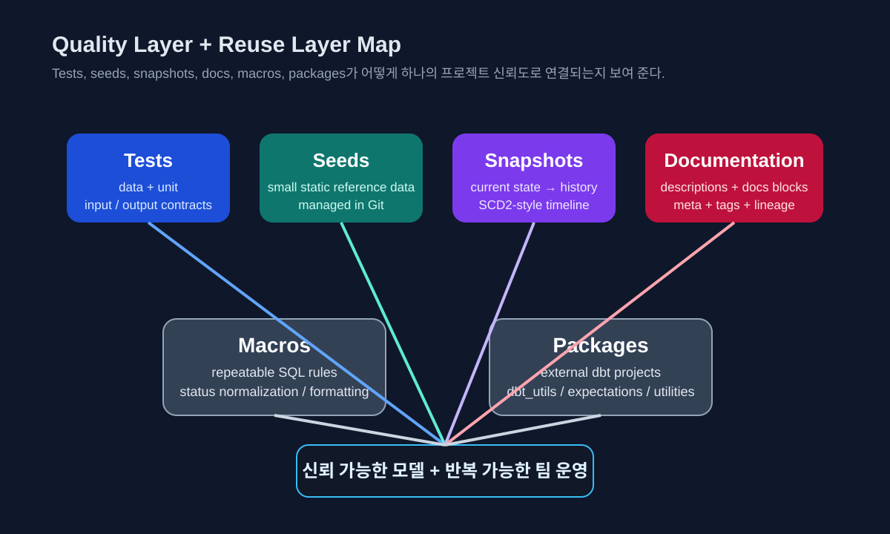

*그림 4-1. 모델을 “만드는 것”과 “믿을 수 있게 만드는 것” 사이를 연결하는 여섯 장치를 하나의 지도로 본다.*

<a id="book-chapters-reference-v3-04-tests-seeds-snapshots-documentation-macros-and-packages-md--41-왜-이-여섯-주제를-한-장에서-묶는가"></a>

### 4.1. 왜 이 여섯 주제를 한 장에서 묶는가

초보자는 보통 테스트, 문서화, macro, package를 각각 독립 기능으로 배운다.
그렇게 배우면 각각의 문법은 익힐 수 있지만, 실제 프로젝트에서 언제 어떤 장치를 써야 하는지는 잘 보이지 않는다.

이 장의 관점은 다르다.
질문을 기능 중심이 아니라 운영 중심으로 바꾼다.

1. 모델의 입력과 출력이 신뢰 가능한가?
2. 반복되는 기준표와 매핑값을 프로젝트 안에 넣을 수 있는가?
3. 상태 변화 이력을 현재 상태 테이블만으로 복원해야 하는가?
4. 팀원이 이 모델의 목적과 규칙을 바로 이해할 수 있는가?
5. 같은 SQL 조각이 반복될 때 어디까지 추상화해야 하는가?
6. 이미 커뮤니티와 팀이 검증한 패턴을 다시 만들 필요가 있는가?

이 질문들에 대한 답이 각각 tests, seeds, snapshots, docs, macros, packages로 이어진다.

<a id="book-chapters-reference-v3-04-tests-seeds-snapshots-documentation-macros-and-packages-md--411-이-장에서-남아야-하는-감각"></a>

#### 4.1.1. 이 장에서 남아야 하는 감각

이 장을 읽고 나면 최소한 아래 감각은 남아야 한다.

- generic / singular / unit test를 어떤 상황에 쓰는지 설명할 수 있다.
- seed와 source의 차이를 말할 수 있다.
- snapshot이 필요한 상황과 필요 없는 상황을 구분할 수 있다.
- 문서화와 metadata를 “부가 작업”이 아니라 모델의 일부로 볼 수 있다.
- macro를 언제 만들고 언제 만들지 말아야 하는지 판단할 수 있다.
- package를 가져오는 것과 직접 구현하는 것의 trade-off를 이해할 수 있다.

<a id="book-chapters-reference-v3-04-tests-seeds-snapshots-documentation-macros-and-packages-md--412-이-장을-읽는-순서"></a>

#### 4.1.2. 이 장을 읽는 순서

이 장은 아래 순서를 따른다.

1. 테스트: 모델을 믿는 최소 기준을 세운다.
2. seeds: 프로젝트 안 기준표와 매핑표를 만든다.
3. snapshots: 시간에 따라 바뀌는 상태를 추적한다.
4. documentation: 사람이 이해할 수 있게 설명과 메타데이터를 붙인다.
5. macros: 반복을 프로젝트 규칙으로 추상화한다.
6. packages: 잘 검증된 패턴을 외부에서 가져온다.
7. 세 예제 적용: Retail Orders / Event Stream / Subscription & Billing에서 이 장의 기능이 어떻게 자란는지 본다.

---

<a id="book-chapters-reference-v3-04-tests-seeds-snapshots-documentation-macros-and-packages-md--42-tests--데이터와-로직을-고정하는-첫-번째-안전망"></a>

### 4.2. Tests — 데이터와 로직을 고정하는 첫 번째 안전망

<a id="book-chapters-reference-v3-04-tests-seeds-snapshots-documentation-macros-and-packages-md--421-테스트는-모델의-일부다"></a>

#### 4.2.1. 테스트는 모델의 일부다

dbt에서 테스트는 “나중에 붙이는 QA 작업”이 아니다.
오히려 모델의 목적을 가장 명확하게 드러내는 장치다.

예를 들어 `fct_orders`가 주문 단위 fact 모델이라면, 최소한 다음은 질문할 수 있어야 한다.

- `order_id`는 null이 아닌가?
- `order_id`는 중복되지 않는가?
- `customer_id`는 차원 모델에 존재하는가?
- 취소 주문의 금액 집계 규칙은 기대한 대로 계산되는가?
- 미래 시점의 이벤트나 음수 금액이 들어오지 않았는가?

즉, 테스트는 “이 모델이 어떤 가정을 전제로 존재하는가”를 문장 대신 실행 가능한 규칙으로 남긴다.

<a id="book-chapters-reference-v3-04-tests-seeds-snapshots-documentation-macros-and-packages-md--422-dbt의-테스트-축-generic-singular-unit"></a>

#### 4.2.2. dbt의 테스트 축: generic, singular, unit

| 축 | 무엇을 검증하나 | 어디에 두나 | 대표 상황 |
| --- | --- | --- | --- |
| generic data test | 컬럼 또는 테이블 수준의 반복 가능한 가정 | `models/*.yml`, `sources.yml`, `snapshots/*.yml`, `seeds/*.yml` | `not_null`, `unique`, `relationships`, `accepted_values` |
| singular data test | 실패 행을 직접 정의하는 자유 SQL | `tests/*.sql` | 음수 금액 금지, 미래 타임스탬프 금지 |
| unit test | 작은 입력 행 → 기대 출력 행 | `models/*.yml` | 할인 계산, 취소 주문 처리, 세션 분할 로직 |

현재 dbt 문서에서는 “tests”를 더 명확히 구분하기 위해 data tests와 unit tests라는 용어를 사용한다. YAML 키로는 `data_tests:`가 기본이고, `tests:`는 alias로 여전히 지원된다.
이 차이를 일찍 이해해 두면 Chapter 07의 contracts와 Chapter 08의 semantic validation까지 더 자연스럽게 이어진다.

<a id="book-chapters-reference-v3-04-tests-seeds-snapshots-documentation-macros-and-packages-md--423-generic-data-tests--가장-먼저-붙이는-안전망"></a>

#### 4.2.3. generic data tests — 가장 먼저 붙이는 안전망

generic test는 같은 검증 패턴을 여러 모델에 재사용할 수 있게 만드는 방식이다.
입문 단계에서 가장 먼저 붙일 네 가지는 아래다.

- `not_null`
- `unique`
- `relationships`
- `accepted_values`

Retail Orders 예시에서는 `fct_orders.order_id`와 `dim_customers.customer_id`가 가장 먼저 generic test 대상이 된다.

> 파일: [`../codes/04_chapter_snippets/ch04/models/marts_tests_and_unit_tests.yml`](codes/04_chapter_snippets/ch04/models/marts_tests_and_unit_tests.yml)

```yaml
version: 2

models:
  - name: fct_orders
    description: "주문 단위 fact 모델"
    columns:
      - name: order_id
        description: "주문의 비즈니스 키"
        data_tests:
          - not_null
          - unique

      - name: customer_id
        description: "주문을 발생시킨 고객"
        data_tests:
          - not_null
          - relationships:
              arguments:
                to: ref('dim_customers')
                field: customer_id

      - name: order_status
        description: "표준화된 주문 상태"
        data_tests:
          - accepted_values:
              arguments:
                values: ['placed', 'paid', 'cancelled', 'shipped', 'delivered']
              config:
                where: "order_date >= current_date - interval '30 day'"
                severity: warn

unit_tests:
  - name: fct_orders_cancellation_rule
    model: fct_orders
    given:
      - input: ref('int_order_lines')
        rows:
          - {order_id: 5003, customer_id: 102, order_date: '2026-01-05', order_status: 'cancelled', line_amount: 16.0, quantity: 1}
    expect:
      rows:
        - {order_id: 5003, customer_id: 102, order_date: '2026-01-05', gross_revenue: 0.0, item_count: 0}
```

여기서 중요한 포인트는 두 가지다.

1. 기본 검증은 generic test로 먼저 덮는다.
2. business rule은 unit test로 명시한다.

<a id="book-chapters-reference-v3-04-tests-seeds-snapshots-documentation-macros-and-packages-md--424-singular-data-tests--실패-행을-sql로-직접-정의한다"></a>

#### 4.2.4. singular data tests — 실패 행을 SQL로 직접 정의한다

generic test로는 다 표현되지 않는 규칙이 있다.
예를 들어 Event Stream 트랙에서 “미래 시각의 이벤트는 금지” 같은 규칙은 자유 SQL이 더 적합하다.

> 파일: [`../codes/04_chapter_snippets/ch04/tests/assert_no_future_event_timestamp.sql`](codes/04_chapter_snippets/ch04/tests/assert_no_future_event_timestamp.sql)

```sql
select *
from {{ ref('fct_events_daily') }}
where event_timestamp > current_timestamp
```

singular test는 `select`가 실패 행을 반환하도록 만든다.
0행이면 통과, 1행 이상이면 실패다.

이 방식은 아래 경우에 특히 강하다.

- generic test로 표현하기 어색한 business rule
- 여러 컬럼을 동시에 보는 금지 조건
- 특정 시점 범위나 예외 규칙을 넣고 싶은 경우

<a id="book-chapters-reference-v3-04-tests-seeds-snapshots-documentation-macros-and-packages-md--425-unit-tests--계산-로직을-작은-입력으로-고정한다"></a>

#### 4.2.5. unit tests — 계산 로직을 작은 입력으로 고정한다

unit test는 “full build를 돌려 보기 전에” 계산 규칙을 작게 검증한다.
특히 아래 조건이 있으면 unit test 가치가 크다.

- CASE WHEN 분기가 많다.
- 취소/환불/중복/경계값 처리 규칙이 있다.
- window function이나 세션화처럼 로직이 복잡하다.
- semantic metric의 기반이 되는 핵심 intermediate 모델이다.

Subscription & Billing 트랙에서는 unit test가 특히 강력하다.
예를 들어 `mrr` 계산, trial 전환, pause 상태 제외, refund 분개 규칙은 단순 data test보다 unit test가 훨씬 직접적이다.

<a id="book-chapters-reference-v3-04-tests-seeds-snapshots-documentation-macros-and-packages-md--426-테스트-운영에서-초보자가-놓치기-쉬운-것"></a>

#### 4.2.6. 테스트 운영에서 초보자가 놓치기 쉬운 것

테스트는 붙이는 것만큼 어떻게 운영할지가 중요하다.

| 운영 포인트 | 왜 중요한가 |
| --- | --- |
| `test_type:data`, `test_type:unit` 분리 실행 | 개발 중에는 unit test 위주로 빠르게 확인하고, 배포 전에는 핵심 data test까지 묶기 쉽다 |
| `where` | 최근 30일 데이터처럼 관심 구간만 테스트할 수 있다 |
| `severity`, `warn_if`, `error_if` | 실패를 무조건 error로 다루지 않고 운영 민감도에 맞게 경고/실패를 분리할 수 있다 |
| `store_failures` | 실패 행을 남겨서 triage와 운영 분석에 쓸 수 있다 |

<a id="book-chapters-reference-v3-04-tests-seeds-snapshots-documentation-macros-and-packages-md--427-테스트-안티패턴"></a>

#### 4.2.7. 테스트 안티패턴

- 결과를 한 번 눈으로 보고 “맞는 것 같다”고 끝낸다.
- 모든 규칙을 singular test로만 작성한다.
- unit test가 더 적합한 계산 규칙을 data test로 우회한다.
- key 컬럼에 `not_null`, `unique`조차 붙이지 않는다.
- 테스트 실패를 무조건 “데이터 문제”라고 생각하고 upstream 로직을 안 본다.

---

<a id="book-chapters-reference-v3-04-tests-seeds-snapshots-documentation-macros-and-packages-md--43-seeds--프로젝트-안-기준표와-매핑표를-버전-관리한다"></a>

### 4.3. Seeds — 프로젝트 안 기준표와 매핑표를 버전 관리한다

<a id="book-chapters-reference-v3-04-tests-seeds-snapshots-documentation-macros-and-packages-md--431-seed는-작은-기준표를-프로젝트-안으로-가져오는-장치다"></a>

#### 4.3.1. seed는 작은 기준표를 프로젝트 안으로 가져오는 장치다

seed는 CSV를 relation로 적재해 쓰는 기능이다.
source가 프로젝트 바깥 입력이라면, seed는 프로젝트 안에서 관리하는 정적 혹은 저변화 참조 데이터라고 보면 된다.

대표적인 seed 예시는 아래와 같다.

- 국가 코드표
- 상태값 매핑표
- 이벤트명 표준화 매핑표
- 구독 요금제 기준표
- 내부 실험용 작은 dimension 테이블

중요한 점은 seed가 “작고 안정적이며, Git으로 버전 관리할 가치가 있는 데이터”에 적합하다는 것이다.

<a id="book-chapters-reference-v3-04-tests-seeds-snapshots-documentation-macros-and-packages-md--432-seed와-source를-헷갈리지-말자"></a>

#### 4.3.2. seed와 source를 헷갈리지 말자

| 질문 | source | seed |
| --- | --- | --- |
| 데이터의 원래 소유자는 누구인가? | 외부 시스템 / EL 파이프라인 | 현재 dbt 프로젝트 |
| 데이터가 어디서 왔나? | raw schema, lake, warehouse 외부 입력 | repo 안의 CSV |
| 변경 주기는 어떤가? | 시스템에 따라 다름 | 보통 작고 느림 |
| 버전 관리의 중심은 어디인가? | 데이터 플랫폼과 파이프라인 | Git |

<a id="book-chapters-reference-v3-04-tests-seeds-snapshots-documentation-macros-and-packages-md--433-seed는-yaml로만-설정한다"></a>

#### 4.3.3. seed는 YAML로만 설정한다

현재 dbt 기준에서 seed는 CSV 안에서 config를 설정할 수 없고, YAML 혹은 `dbt_project.yml`에서만 설정한다. 이 점을 기억해 두면 model config와 seed config의 차이가 헷갈리지 않는다.

> 파일: [`../codes/04_chapter_snippets/ch04/seeds/reference_seed_properties.yml`](codes/04_chapter_snippets/ch04/seeds/reference_seed_properties.yml)

```yaml
version: 2

seeds:
  - name: country_codes
    description: "국가 코드 기준표"
    config:
      column_types:
        country_code: varchar(2)
        country_name: varchar(100)
    columns:
      - name: country_code
        data_tests: [not_null, unique]

  - name: event_name_map
    description: "이벤트명 표준화 매핑표"
    config:
      quote_columns: false
    columns:
      - name: raw_event_name
        data_tests: [not_null, unique]

  - name: subscription_plan_catalog
    description: "구독 요금제 기준표"
    columns:
      - name: plan_code
        data_tests: [not_null, unique]
```

<a id="book-chapters-reference-v3-04-tests-seeds-snapshots-documentation-macros-and-packages-md--434-세-예제에서-seed가-맡는-역할"></a>

#### 4.3.4. 세 예제에서 seed가 맡는 역할

<a id="book-chapters-reference-v3-04-tests-seeds-snapshots-documentation-macros-and-packages-md--a-retail-orders"></a>

##### A. Retail Orders
국가 코드, 고객 세그먼트 기준표, 채널 코드 매핑표처럼 작고 안정적인 참조 데이터가 잘 맞는다.

> 파일: [`../codes/04_chapter_snippets/ch04/seeds/country_codes.csv`](codes/04_chapter_snippets/ch04/seeds/country_codes.csv)

```csv
country_code,country_name
KR,South Korea
US,United States
JP,Japan
SG,Singapore
```

<a id="book-chapters-reference-v3-04-tests-seeds-snapshots-documentation-macros-and-packages-md--b-event-stream"></a>

##### B. Event Stream
raw event 이름은 운영 시스템마다 제각각일 수 있다. seed를 두면 `view_item`, `ViewItem`, `view-item` 같은 값을 표준 이벤트명으로 정리하기 쉽다.

> 파일: [`../codes/04_chapter_snippets/ch04/seeds/event_name_map.csv`](codes/04_chapter_snippets/ch04/seeds/event_name_map.csv)

```csv
raw_event_name,canonical_event_name,event_group
ViewItem,view_item,commerce
view-item,view_item,commerce
AddToCart,add_to_cart,commerce
Purchase,purchase,commerce
```

<a id="book-chapters-reference-v3-04-tests-seeds-snapshots-documentation-macros-and-packages-md--c-subscription--billing"></a>

##### C. Subscription & Billing
요금제명, billing cadence, list price, feature bundle 같은 값은 seed로 관리하면 문서화와 변경 이력 추적에 좋다.

> 파일: [`../codes/04_chapter_snippets/ch04/seeds/plan_tiers.csv`](codes/04_chapter_snippets/ch04/seeds/plan_tiers.csv)

```csv
plan_code,plan_name,billing_cadence,list_price_usd
FREE,Free,monthly,0
PRO_M,Pro Monthly,monthly,29
PRO_Y,Pro Yearly,yearly,290
TEAM_M,Team Monthly,monthly,99
```

<a id="book-chapters-reference-v3-04-tests-seeds-snapshots-documentation-macros-and-packages-md--435-seed-안티패턴"></a>

#### 4.3.5. seed 안티패턴

- 원천 시스템에서 계속 바뀌는 운영 데이터를 seed에 넣는다.
- 대용량 데이터를 seed로 올리려 한다.
- CSV는 repo에 있는데 설명/테스트가 없다.
- 같은 기준표를 seed와 source 양쪽에서 이중 관리한다.

---

<a id="book-chapters-reference-v3-04-tests-seeds-snapshots-documentation-macros-and-packages-md--44-snapshots--현재-상태-테이블에-시간-축을-붙인다"></a>

### 4.4. Snapshots — 현재 상태 테이블에 시간 축을 붙인다

<a id="book-chapters-reference-v3-04-tests-seeds-snapshots-documentation-macros-and-packages-md--441-snapshot은-언제-필요한가"></a>

#### 4.4.1. snapshot은 언제 필요한가

snapshot은 “현재 상태만 남는 입력”에 과거 변경 이력을 붙이고 싶을 때 쓴다.
즉, source 자체가 CDC나 history table을 제공하지 않을 때 dbt가 SCD2 스타일의 이력 테이블을 만든다고 이해하면 된다.

대표적인 상황:

- 주문 상태가 `placed → paid → cancelled`로 바뀌는데 source는 마지막 상태만 준다.
- 구독 상태가 `trialing → active → past_due → churned`로 바뀐다.
- 고객 세그먼트나 상품 분류가 수정되지만 변경 이력이 필요하다.

<a id="book-chapters-reference-v3-04-tests-seeds-snapshots-documentation-macros-and-packages-md--442-snapshot을-쓰지-않아도-되는-경우"></a>

#### 4.4.2. snapshot을 쓰지 않아도 되는 경우

아래 경우에는 snapshot보다 다른 해법이 낫다.

- 이미 source가 CDC/history table을 제공한다.
- 이력 분석이 불필요하고 현재 상태만 있으면 된다.
- 로직이 사실상 event log라 append-only raw 테이블이 이미 시간축을 담고 있다.

<a id="book-chapters-reference-v3-04-tests-seeds-snapshots-documentation-macros-and-packages-md--443-현재-권장-방식-yaml-기반-snapshot-정의"></a>

#### 4.4.3. 현재 권장 방식: YAML 기반 snapshot 정의

최근 dbt 문서에서는 snapshot 속성을 YAML로 정의하는 방식을 권장한다.
즉, snapshot의 select 대상과 config를 YAML에 모으고, legacy Jinja snapshot block 방식은 기존 프로젝트 호환 관점으로만 보는 편이 좋다.

> 파일: [`../codes/04_chapter_snippets/ch04/snapshots/orders_status_snapshot.yml`](codes/04_chapter_snippets/ch04/snapshots/orders_status_snapshot.yml)

```yaml
version: 2

snapshots:
  - name: orders_status_snapshot
    relation: ref('stg_orders')
    description: "주문 상태와 금액 변화를 추적하는 snapshot"
    config:
      strategy: check
      unique_key: order_id
      check_cols:
        - order_status
        - total_amount
      updated_at: updated_at
      target_schema: snapshots
      dbt_valid_to_current: "to_date('9999-12-31')"
    columns:
      - name: order_id
        data_tests: [not_null]
```

구독 트랙에서도 비슷한 방식으로 `subscription_status_snapshot`을 둘 수 있다.

> 파일: [`../codes/04_chapter_snippets/ch04/snapshots/subscription_status_snapshot.yml`](codes/04_chapter_snippets/ch04/snapshots/subscription_status_snapshot.yml)

```yaml
version: 2

snapshots:
  - name: subscription_status_snapshot
    relation: ref('stg_subscriptions')
    description: "구독 상태 변화 이력을 저장한다"
    config:
      strategy: timestamp
      unique_key: subscription_id
      updated_at: updated_at
      target_schema: snapshots
    columns:
      - name: subscription_id
        data_tests: [not_null]
```

<a id="book-chapters-reference-v3-04-tests-seeds-snapshots-documentation-macros-and-packages-md--444-timestamp와-check를-어떻게-고르나"></a>

#### 4.4.4. `timestamp`와 `check`를 어떻게 고르나

| 전략 | 잘 맞는 상황 | 주의할 점 |
| --- | --- | --- |
| `timestamp` | 신뢰 가능한 `updated_at` 컬럼이 있다 | source의 갱신 타임스탬프 품질이 중요하다 |
| `check` | 비교할 컬럼은 있지만 믿을 만한 `updated_at`이 없다 | `check_cols`가 많아질수록 비용과 복잡도가 커질 수 있다 |

Retail Orders 트랙은 상태와 금액만 보면 되므로 `check`가 이해하기 쉽다.
Subscription & Billing은 보통 `updated_at`이 더 중요하므로 `timestamp` 전략이 자연스럽다.

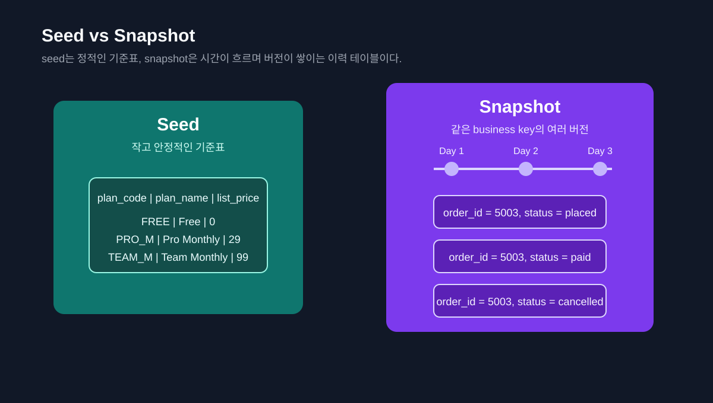

*그림 4-2. seed는 정적인 기준표이고, snapshot은 시간이 흐르며 여러 버전이 쌓이는 이력 테이블이다.*

<a id="book-chapters-reference-v3-04-tests-seeds-snapshots-documentation-macros-and-packages-md--445-snapshot을-읽는-감각"></a>

#### 4.4.5. snapshot을 읽는 감각

snapshot 결과를 처음 보면 같은 `order_id`가 여러 줄 보여서 “중복”처럼 느껴진다.
하지만 snapshot의 핵심은 바로 그 중복처럼 보이는 버전들이다.

- 현재 row만 보고 싶으면 `dbt_valid_to`가 current sentinel이거나 null인 행을 본다.
- 특정 날짜 시점의 상태를 보고 싶으면 `dbt_valid_from <= as_of < dbt_valid_to` 범위를 본다.
- 변경 이력을 보고 싶으면 같은 business key의 여러 버전을 시간 순으로 읽는다.

<a id="book-chapters-reference-v3-04-tests-seeds-snapshots-documentation-macros-and-packages-md--446-snapshot-안티패턴"></a>

#### 4.4.6. snapshot 안티패턴

- source가 이미 event log인데 snapshot까지 중복으로 만든다.
- `updated_at`이 믿을 수 없는데 무조건 `timestamp` 전략을 쓴다.
- 현재 row와 이력 row를 downstream에서 구분하지 않는다.
- snapshot을 매 분마다 돌리면서 의미 없는 버전을 과도하게 쌓는다.

---

<a id="book-chapters-reference-v3-04-tests-seeds-snapshots-documentation-macros-and-packages-md--45-documentation--설명-lineage-metadata를-모델-옆에-둔다"></a>

### 4.5. Documentation — 설명, lineage, metadata를 모델 옆에 둔다

<a id="book-chapters-reference-v3-04-tests-seeds-snapshots-documentation-macros-and-packages-md--451-문서화는-꾸미기-작업이-아니다"></a>

#### 4.5.1. 문서화는 꾸미기 작업이 아니다

문서화는 프로젝트가 커질수록 더 중요해진다.
왜냐하면 dbt 프로젝트에서 실제로 사람을 혼란스럽게 만드는 것은 SQL 문법보다 이 모델이 왜 존재하는지, 어떤 규칙을 따르는지, 어떤 예외가 있는지이기 때문이다.

문서화는 최소한 아래 세 층을 가져야 한다.

1. 모델 설명
2. 컬럼 설명
3. 운영 메타데이터 (`meta`, `tags`, owner, sensitivity 등)

<a id="book-chapters-reference-v3-04-tests-seeds-snapshots-documentation-macros-and-packages-md--452-description과-docs-block"></a>

#### 4.5.2. description과 docs block

작은 설명은 YAML 문자열로 충분하지만, 길고 구조적인 설명은 docs block이 훨씬 낫다.

> 파일: [`../codes/04_chapter_snippets/ch04/docs/orders_docs.md`](codes/04_chapter_snippets/ch04/docs/orders_docs.md)

```md

`fct_orders`는 주문 단위 매출 fact 모델이다.

이 모델은 다음 규칙을 따른다.

1. 주문 grain은 `order_id` 기준이다.
2. 취소 주문은 `gross_revenue = 0`으로 집계한다.
3. `order_status`는 staging에서 표준화된 상태값만 허용한다.

```

그리고 properties 파일에서는 `doc()`로 연결한다.

> 파일: [`../codes/04_chapter_snippets/ch04/models/orders_documented.yml`](codes/04_chapter_snippets/ch04/models/orders_documented.yml)

```yaml
version: 2

models:
  - name: fct_orders
    description: '{{ doc("fct_orders_long_description") }}'
    config:
      tags: ['mart', 'finance']
      meta:
        owner: 'data-platform'
        maturity: 'production'
        pii: false
    columns:
      - name: gross_revenue
        description: "주문 라인 금액 합계에서 취소 규칙을 반영한 주문 매출"
```

<a id="book-chapters-reference-v3-04-tests-seeds-snapshots-documentation-macros-and-packages-md--453-persist_docs-meta-tags를-같이-보자"></a>

#### 4.5.3. `persist_docs`, `meta`, `tags`를 같이 보자

- `persist_docs`: warehouse object comment까지 설명을 밀어 넣고 싶을 때 사용
- `meta`: owner, maturity, sensitivity, semantic hint 같은 자유 metadata 저장
- `tags`: 실행 선택, 배치 분리, 그룹화에 유용

이 셋은 문서화가 “읽기용 텍스트”를 넘어서 운영 데이터가 되는 지점이다.

<a id="book-chapters-reference-v3-04-tests-seeds-snapshots-documentation-macros-and-packages-md--454-세-예제에서-문서화가-달라지는-포인트"></a>

#### 4.5.4. 세 예제에서 문서화가 달라지는 포인트

- Retail Orders: KPI 정의와 grain을 명확히 남기는 것이 핵심
- Event Stream: event taxonomy와 sessionization 규칙을 설명해야 한다
- Subscription & Billing: 상태 정의, 환불/취소/재활성화 규칙이 문서 없이는 유지되기 어렵다

<a id="book-chapters-reference-v3-04-tests-seeds-snapshots-documentation-macros-and-packages-md--455-문서화-안티패턴"></a>

#### 4.5.5. 문서화 안티패턴

- “이 모델은 주문 정보를 담는다” 같은 너무 일반적인 설명만 남긴다.
- 계산 규칙은 SQL 안에만 있고 설명에는 없다.
- 컬럼 설명이 비어 있어 downstream 소비자가 코드를 읽어야 한다.
- `meta`와 `tags` 없이 운영 분류를 모두 사람 기억에 의존한다.

---

<a id="book-chapters-reference-v3-04-tests-seeds-snapshots-documentation-macros-and-packages-md--46-macros--반복되는-sql을-프로젝트-규칙으로-추상화한다"></a>

### 4.6. Macros — 반복되는 SQL을 프로젝트 규칙으로 추상화한다

<a id="book-chapters-reference-v3-04-tests-seeds-snapshots-documentation-macros-and-packages-md--461-macro는-언제-만들어야-하나"></a>

#### 4.6.1. macro는 언제 만들어야 하나

macro는 반복되는 SQL 조각을 함수처럼 재사용하게 해 준다.
하지만 macro는 항상 좋은 것이 아니라, 반복 + 규칙성 + 여러 곳에서 함께 바뀔 가능성이 있어야 가치가 있다.

macro를 만들기 좋은 경우:

- 상태값 표준화 규칙이 여러 staging 모델에 반복된다.
- cents → currency 변환 로직이 계속 나온다.
- cross-platform safe cast나 surrogate key 생성이 자주 반복된다.

macro를 만들지 말아야 하는 경우:

- 아직 한 번만 쓴 SQL 조각
- 팀이 이해하기 어려운 추상화
- 모델의 핵심 business logic를 지나치게 숨기는 경우

<a id="book-chapters-reference-v3-04-tests-seeds-snapshots-documentation-macros-and-packages-md--462-예시-macro"></a>

#### 4.6.2. 예시 macro

> 파일: [`../codes/04_chapter_snippets/ch04/macros/normalize_status.sql`](codes/04_chapter_snippets/ch04/macros/normalize_status.sql)

```sql

  case
    when lower({{ column_name }}) in ('placed', 'created', 'new') then 'placed'
    when lower({{ column_name }}) in ('paid', 'captured') then 'paid'
    when lower({{ column_name }}) in ('cancelled', 'canceled') then 'cancelled'
    when lower({{ column_name }}) in ('shipped', 'in_transit') then 'shipped'
    when lower({{ column_name }}) in ('delivered', 'complete') then 'delivered'
    else 'unknown'
  end

```

이 macro는 Retail Orders에서는 주문 상태 표준화에, Subscription & Billing에서는 subscription status나 invoice status 정리에도 응용할 수 있다.

<a id="book-chapters-reference-v3-04-tests-seeds-snapshots-documentation-macros-and-packages-md--463-macro-안티패턴"></a>

#### 4.6.3. macro 안티패턴

- 간단한 CASE 하나를 위해 지나치게 일찍 macro를 만든다.
- macro 이름만 보고 무엇을 하는지 알 수 없다.
- Jinja 레이어가 많아져 compiled SQL이 읽기 어려워진다.
- 플랫폼별 분기 로직을 한 macro에 끝없이 넣는다.

---

<a id="book-chapters-reference-v3-04-tests-seeds-snapshots-documentation-macros-and-packages-md--47-packages--잘-검증된-패턴을-가져온다"></a>

### 4.7. Packages — 잘 검증된 패턴을 가져온다

<a id="book-chapters-reference-v3-04-tests-seeds-snapshots-documentation-macros-and-packages-md--471-package는-독립된-dbt-프로젝트다"></a>

#### 4.7.1. package는 독립된 dbt 프로젝트다

dbt package는 단순한 유틸 함수 모음이 아니라, models, macros, tests, docs를 포함할 수 있는 독립된 dbt 프로젝트다.
`dbt deps`를 실행하면 package가 설치되고, 그 안의 macro나 test를 현재 프로젝트에서 사용할 수 있다.

<a id="book-chapters-reference-v3-04-tests-seeds-snapshots-documentation-macros-and-packages-md--472-package를-쓸-때-먼저-생각할-것"></a>

#### 4.7.2. package를 쓸 때 먼저 생각할 것

1. 이 패턴을 우리가 직접 구현할 이유가 있는가?
2. 팀원이 이 package를 이해하고 유지할 수 있는가?
3. 버전 pinning과 upgrade 계획이 있는가?
4. package에서 가져오는 범위가 너무 큰 것은 아닌가?

<a id="book-chapters-reference-v3-04-tests-seeds-snapshots-documentation-macros-and-packages-md--473-예시-packagesyml"></a>

#### 4.7.3. 예시 packages.yml

> 파일: [`../codes/04_chapter_snippets/ch04/packages.yml`](codes/04_chapter_snippets/ch04/packages.yml)

```yaml
packages:
  - package: dbt-labs/dbt_utils
    version: [">=1.3.0", "<2.0.0"]

  - package: calogica/dbt_expectations
    version: [">=0.10.0", "<0.11.0"]
```

그리고 설치는 아래처럼 한다.

```bash
dbt deps
```

`dbt_utils`는 surrogate key, date spine, union_relations 같은 반복 패턴에서 자주 쓰이고, `dbt_expectations`는 richer test 패턴을 빠르게 붙일 때 유용하다.
다만 package를 붙인다고 설계 문제까지 해결되지는 않는다.

<a id="book-chapters-reference-v3-04-tests-seeds-snapshots-documentation-macros-and-packages-md--474-package-안티패턴"></a>

#### 4.7.4. package 안티패턴

- package를 너무 많이 넣어 dependency graph를 불투명하게 만든다.
- 버전 범위를 너무 느슨하게 둔다.
- 팀이 읽지 못하는 macro를 무조건 가져다 쓴다.
- package가 있으면 직접 설계 원리를 이해할 필요가 없다고 생각한다.

---

<a id="book-chapters-reference-v3-04-tests-seeds-snapshots-documentation-macros-and-packages-md--48-세-예제-트랙-안에서-이-장이-어떻게-이어지는가"></a>

### 4.8. 세 예제 트랙 안에서 이 장이 어떻게 이어지는가

앞 절까지는 공통 개념과 판단 기준을 설명했다.
이제 그 개념이 세 트랙 안에서 실제로 어떻게 진행되는지 정리한다.

<a id="book-chapters-reference-v3-04-tests-seeds-snapshots-documentation-macros-and-packages-md--481-retail-orders"></a>

#### 4.8.1. Retail Orders

Retail Orders에서는 이 장의 기능들이 가장 “교과서적”으로 보인다.

- tests: `order_id`, `customer_id`, `order_status`, `gross_revenue`에 기본 검증을 붙인다.
- seed: 국가 코드, 고객 세그먼트, 채널 매핑 같은 기준표를 seed로 둔다.
- snapshot: 주문 상태와 금액 변경을 이력으로 남긴다.
- documentation: 주문 grain, 취소 규칙, KPI 정의를 명확히 문서화한다.
- macro: 주문 상태 표준화, 금액 반올림, null-safe 계산을 macro로 추출한다.
- package: surrogate key나 calendar spine 같은 반복 패턴을 가져올 수 있다.

이 트랙은 “정형화된 분석 mart를 어떻게 신뢰 가능하게 만드는가”를 연습하기에 좋다.

<a id="book-chapters-reference-v3-04-tests-seeds-snapshots-documentation-macros-and-packages-md--482-event-stream"></a>

#### 4.8.2. Event Stream

Event Stream에서는 data volume과 append-only 성격 때문에 아래 포인트가 중요해진다.

- tests: 미래 시각 금지, session boundary 규칙, canonical event name 검증
- seed: raw event name → canonical event name 매핑표
- snapshot: 보통 핵심은 아니다. event log 자체가 시간 축을 이미 가진 경우가 많기 때문이다.
- documentation: event taxonomy, device/channel 표준화 규칙, 세션 정의를 길게 설명해야 한다.
- macro: event normalization, device parsing, URL cleaning 같은 반복 로직이 잘 맞는다.
- package: 날짜 spine, regex 유틸, generic expectations류가 유용하다.

이 트랙은 “event raw를 바로 metric으로 만들지 않고, taxonomy와 품질 규칙을 어떻게 먼저 고정하는가”를 보여 준다.

<a id="book-chapters-reference-v3-04-tests-seeds-snapshots-documentation-macros-and-packages-md--483-subscription--billing"></a>

#### 4.8.3. Subscription & Billing

Subscription & Billing은 이 장의 기능을 가장 깊게 요구한다.

- tests: subscription_id uniqueness, invoice 관계성, refund/credit 처리 규칙
- seed: 요금제 catalog, billing cadence, currency mapping
- snapshot: subscription status history, plan migration history
- documentation: MRR 정의, active 기준, churn 기준, 재활성화 규칙을 문서로 남겨야 한다.
- macro: 기간 정규화, 금액 환산, 상태 표준화
- package: rich expectations와 date dimension 유틸이 특히 자주 쓰인다.

이 트랙은 “현재 상태 + 이력 + business rule”이 동시에 중요하다는 점에서 Chapter 04의 기능을 가장 종합적으로 연습하게 만든다.

---

<a id="book-chapters-reference-v3-04-tests-seeds-snapshots-documentation-macros-and-packages-md--49-직접-해보기"></a>

### 4.9. 직접 해보기

1. Retail Orders
   - `fct_orders`에 generic test 세 개를 붙인다.
   - `order_amount < 0` 금지 singular test를 만든다.
   - `5003 cancelled` 규칙을 unit test로 고정한다.

2. Event Stream
   - `event_name_map.csv` seed를 만들고 `dbt seed`로 적재한다.
   - `stg_events`에서 seed를 join해 canonical event name을 붙인다.
   - 미래 이벤트 금지 singular test를 추가한다.

3. Subscription & Billing
   - `subscription_plan_catalog` seed를 만든다.
   - `subscription_status_snapshot` YAML을 작성한다.
   - MRR 계산 규칙 하나를 unit test로 고정한다.

<a id="book-chapters-reference-v3-04-tests-seeds-snapshots-documentation-macros-and-packages-md--491-정답-확인-기준"></a>

#### 4.9.1. 정답 확인 기준

아래 네 문장을 스스로 설명할 수 있으면 이 장의 핵심을 잡은 것이다.

- “generic test와 singular test는 모두 data test지만 쓰는 방식이 다르다.”
- “seed는 프로젝트 내부 기준표이고 source는 프로젝트 외부 입력이다.”
- “snapshot은 현재 상태 테이블에 시간 축을 붙일 때 쓴다.”
- “macro와 package는 모두 재사용을 돕지만, package는 외부 프로젝트를 가져오는 방식이다.”

---

<a id="book-chapters-reference-v3-04-tests-seeds-snapshots-documentation-macros-and-packages-md--410-완료-체크리스트"></a>

### 4.10. 완료 체크리스트

- [ ] generic / singular / unit test의 차이를 말할 수 있다.
- [ ] `where`, `severity`, `store_failures` 같은 운영형 test config의 의미를 안다.
- [ ] seed와 source의 차이를 알고, seed를 YAML로 설정할 수 있다.
- [ ] `timestamp`와 `check` snapshot 전략을 구분할 수 있다.
- [ ] docs block과 `meta`를 함께 활용할 수 있다.
- [ ] macro를 언제 만들고 언제 만들지 말아야 하는지 설명할 수 있다.
- [ ] `dbt deps`와 package version pinning의 의미를 안다.

---

<a id="book-chapters-reference-v3-04-tests-seeds-snapshots-documentation-macros-and-packages-md--411-다음-장으로-이어지는-연결"></a>

### 4.11. 다음 장으로 이어지는 연결

이 장에서 우리는 모델을 믿을 수 있게 만드는 장치를 배웠다.
다음 장에서는 관점을 한 번 더 바꿔서, 문제가 생겼을 때 어디를 보고 어떻게 좁혀 들어가야 하는지를 다룬다.

즉,

- Chapter 03이 “어떻게 설계할 것인가”라면,
- Chapter 04는 “어떻게 믿을 것인가”이고,
- Chapter 05는 “문제가 생겼을 때 어떻게 찾아낼 것인가”다.


<a id="book-chapters-reference-v3-04-tests-seeds-snapshots-documentation-macros-and-packages-md--412-generate_schema_name-override는-편한-팁이-아니라-프로젝트-전역-규칙-변경이다"></a>

### 4.12. `generate_schema_name` override는 “편한 팁”이 아니라 프로젝트 전역 규칙 변경이다

업무 메모의 `macros/generate_schema_name.sql`은 아주 실무적인 문제를 다룬다.
Trino / Iceberg 환경에서 target schema와 custom schema를 둘 다 `sample_db`로 쓰다 보면, 기본 naming 규칙 때문에 `sample_db_sample_db` 같은 relation 이름이 생길 수 있다. 이를 피하기 위해 프로젝트에 같은 이름의 macro를 정의해 기본 동작을 override하는 패턴이다.

```sql

    
        {{ target.schema }}
    
        {{ custom_schema_name | trim }}
    

```

이 macro의 핵심은 “model 안에서 직접 호출한다”가 아니라, dbt가 relation(database.schema.identifier)을 결정할 때 내부적으로 자동 사용하는 전역 naming rule을 바꾼다는 데 있다.
즉, 이건 단순한 편의 매크로가 아니라 프로젝트 전체 스키마 규칙을 바꾸는 override다.

<a id="book-chapters-reference-v3-04-tests-seeds-snapshots-documentation-macros-and-packages-md--4121-언제-유용한가"></a>

#### 4.12.1. 언제 유용한가

- Trino / Iceberg에서 catalog와 schema를 명확히 고정해 쓰고 싶을 때
- custom schema가 기본 schema와 중복되어 이상한 이름이 생길 때
- connector 특성상 relation naming을 더 단순하게 유지하고 싶을 때

<a id="book-chapters-reference-v3-04-tests-seeds-snapshots-documentation-macros-and-packages-md--4122-언제-조심해야-하는가"></a>

#### 4.12.2. 언제 조심해야 하는가

- dev / prod 환경에서 사람별 schema 분리를 target.schema로 관리하고 있다면
- 팀이 이미 `default_schema + '_' + custom_schema` 규칙을 가정하고 있다면
- 다른 macro나 deployment automation이 기존 naming 규칙을 전제하고 있다면

즉, 이 macro는 “좋은 아이디어”일 수 있지만, 프로젝트 naming convention 문서와 함께 들어가야 한다.

<a id="book-chapters-reference-v3-04-tests-seeds-snapshots-documentation-macros-and-packages-md--4123-교재에서-어떻게-가르치는-것이-좋은가"></a>

#### 4.12.3. 교재에서 어떻게 가르치는 것이 좋은가

이 macro는 Chapter 04의 macros 절에서 “프로젝트 전역 동작을 바꾸는 예”로 보여 주는 것이 가장 적절하다.
그리고 Trino Playbook 쪽에서는 “왜 이 override를 쓰는가”를 platform-specific 사례로 다시 연결하면 된다.

관련 파일은 `../codes/02_reference_patterns/ch04/trino/generate_schema_name.sql`에 넣어 두었다.

---

<a id="book-chapters-reference-v3-05-debugging-artifacts-runbook-and-anti-patterns-md"></a>

장별 원고: [chapters/reference-v3/05-debugging-artifacts-runbook-and-anti-patterns.md](chapters/reference-v3/05-debugging-artifacts-runbook-and-anti-patterns.md)

<a id="book-chapters-reference-v3-05-debugging-artifacts-runbook-and-anti-patterns-md--chapter-05--디버깅-artifacts-runbook-anti-patterns"></a>

## CHAPTER 05 · 디버깅, artifacts, runbook, anti-patterns

> **마당마켓 본편 연결:** [J10 · 격리는 끝이 아니라 복구를 위한 대기 상태다](#book-journey-10-quarantine-repair-md)에서 같은 상점의 누적 실습으로 돌아갈 수 있다. 이 참고편의 `codes/` 스니펫에는 독립 fixture가 포함되어 있으며 본편 `lab/`의 P1~P5와 섞지 않는다. 플랫폼별 구문·기능은 실행 버전에 맞춰 재확인한다.


> 문제를 빨리 좁히는 순서, dbt가 남기는 관찰 흔적, 실패를 재현하고 고치는 훈련, 반복되는 안티패턴을 한 장에 묶는다.

실무에서 차이를 만드는 것은 “처음부터 정답을 맞히는 능력”보다 문제를 빠르게 좁히는 순서를 갖고 있는가에 가깝다.
dbt는 `debug`, `parse`, `ls`, `show`, `compile`, `build`, `retry` 같은 명령을 따로 제공하고, `target/`, `logs/`, JSON artifacts를 통해 실행 전·중·후의 상태를 서로 다른 흔적으로 남긴다. 이 구조를 이해하면 같은 실패를 더 적은 재실행으로 해결할 수 있다.

이 장의 목표는 세 가지다.

1. dbt 디버깅을 명령 순서와 관찰 파일의 관점에서 이해한다.
2. 실패를 일부러 만들어 보고, 왜 실패했는지 원인-증상-관찰 포인트를 연결한다.
3. Retail Orders / Event Stream / Subscription & Billing 세 트랙이 같은 원리를 각각 어떻게 활용하는지 확인한다.

---

<a id="book-chapters-reference-v3-05-debugging-artifacts-runbook-and-anti-patterns-md--51-왜-디버깅은-별도-장으로-배워야-하는가"></a>

### 5.1. 왜 디버깅은 별도 장으로 배워야 하는가

많은 초보자가 디버깅을 “에러가 났을 때 하는 뒷수습”으로 생각한다. 하지만 dbt에서는 디버깅이 곧 프로젝트를 읽는 기술이다.
왜냐하면 dbt 프로젝트는 단일 SQL 파일이 아니라, YAML 설정, Jinja, resource graph, materialization, adapter 동작, 테스트, 문서화 metadata가 함께 엮여 있기 때문이다. 같은 에러 문구라도 실제 원인은 다음처럼 완전히 다를 수 있다.

| 문제 유형 | 흔한 증상 | 먼저 볼 것 |
|---|---|---|
| 설치/환경 | `dbt` 명령 인식 실패, adapter 미인식 | 가상환경, `dbt --version`, `dbt debug` |
| 연결/권한 | 스키마 생성 실패, 로그인 오류 | `profiles.yml`, 환경변수, target schema 권한 |
| 구조/파싱 | YAML parse error, model/source 인식 실패 | `dbt parse`, 파일명, 리소스 이름, 들여쓰기 |
| 의존성/선택 | `ref not found`, 예상보다 많은 노드 실행 | `dbt ls`, `selector`, graph 범위 |
| SQL/매크로 | 컴파일된 SQL이 예상과 다름 | `target/compiled`, `target/run`, macro expansion |
| 데이터 품질 | test 실패, row count 이상, revenue mismatch | 실패한 테스트 SQL, upstream 데이터, grain |
| 운영/성능 | 느린 build, CI에서만 실패, state mismatch | `run_results.json`, state artifact, 환경 차이 |

디버깅을 잘한다는 말은 결국 다음 세 문장을 몸으로 아는 상태를 뜻한다.

1. 무엇을 고치기 전에 무엇을 먼저 봐야 하는가
2. 실패가 구조 문제인지, 데이터 문제인지, 실행 환경 문제인지
3. 한 번에 전체를 다시 돌리지 않고도 어디까지 좁힐 수 있는가

<a id="book-chapters-reference-v3-05-debugging-artifacts-runbook-and-anti-patterns-md--511-관찰이-수정보다-먼저다"></a>

#### 5.1.1. 관찰이 수정보다 먼저다

dbt에서 가장 흔한 안티패턴은 에러가 나자마자 SQL을 다시 쓰기 시작하는 것이다.
하지만 dbt는 이미 많은 단서를 남긴다. `source()` 인자가 틀렸는지, graph에 노드가 빠졌는지, compiled SQL이 달라졌는지, 테스트가 어떤 행을 실패로 잡았는지, 실행 시간이 어느 노드에서 급증했는지 모두 로그와 artifact로 남는다.

이 장에서는 디버깅의 기본 원칙을 observe before mutate로 둔다.
즉, 고치기 전에 먼저 본다.

- 먼저 증상을 정의한다.
- 그 증상이 어느 계층에 속하는지 분류한다.
- 가장 싼 관찰부터 시작한다.
- 마지막에만 실제 수정과 전체 재실행으로 넘어간다.

<a id="book-chapters-reference-v3-05-debugging-artifacts-runbook-and-anti-patterns-md--512-실패-재현이-중요한-이유"></a>

#### 5.1.2. “실패 재현”이 중요한 이유

눈으로 읽는 디버깅 설명은 쉽게 잊힌다.
반대로 실패를 일부러 만들어 보면 “어디를 열어야 하는지”가 기억에 남는다. 그래서 이 장은 설명만 하지 않고 `codes/04_chapter_snippets/ch05/labs/` 아래에 망가진 예제를 함께 둔다.
실패를 피하는 법보다, 실패를 빠르게 복구하는 법이 더 오래간다.


<a id="book-chapters-reference-v3-05-debugging-artifacts-runbook-and-anti-patterns-md--513-디버깅-사다리-가장-싼-관찰부터-시작하기"></a>

#### 5.1.3. 디버깅 사다리: 가장 싼 관찰부터 시작하기

디버깅 순서는 보통 아래처럼 잡는 것이 가장 효율적이다.

1. 환경 확인
   가상환경, adapter, profile 이름, target을 확인한다.
2. 구조 확인
   YAML/Jinja/리소스 이름이 프로젝트에서 정상 인식되는지 본다.
3. 그래프 범위 확인
   지금 실행 대상이 정확히 무엇인지 확인한다.
4. 컴파일 결과 확인
   Jinja와 macro가 풀린 SQL을 본다.
5. 실행 결과 확인
   실제 실패 노드, 실행 시간, 테스트 실패 행을 본다.
6. 데이터 원인 확인
   grain, joins, duplicates, late-arriving records를 본다.
7. 운영 원인 확인
   환경 차이, state artifact, CI 설정, version mismatch를 본다.

이 순서를 무시하고 곧바로 `dbt build` 전체를 반복하면, 실패는 계속 재현되지만 원인 파악 속도는 거의 늘지 않는다.

---

<a id="book-chapters-reference-v3-05-debugging-artifacts-runbook-and-anti-patterns-md--52-디버깅에-쓰는-핵심-명령을-다시-정리하기"></a>

### 5.2. 디버깅에 쓰는 핵심 명령을 다시 정리하기

디버깅 장에서 명령은 “실행 도구”보다 관찰 도구로 봐야 한다.
다음 표는 Chapter 02와 03에서 배운 명령을 디버깅 관점으로 다시 재배치한 것이다.

| 명령 | 무엇을 확인하는가 | 언제 먼저 쓰나 |
|---|---|---|
| `dbt debug` | 연결, adapter, project/profile 유효성 | 설치/연결이 의심될 때 |
| `dbt parse` | YAML/Jinja/graph 파싱 성공 여부 | 구조 오류가 의심될 때 |
| `dbt ls -s ...` | 선택된 노드 목록 | 실행 범위가 불분명할 때 |
| `dbt show -s ...` | 모델/seed/source preview | SQL 전체 build 전에 빠르게 확인할 때 |
| `dbt compile -s ...` | compiled SQL | macro, `ref()`, conditional logic가 의심될 때 |
| `dbt build -s ...` | run + test + snapshot + seed | 수정한 범위를 실제 검증할 때 |
| `dbt retry` | 마지막 invocation의 실패 지점 이후 재시도 | 긴 실행 중 일부만 다시 돌리고 싶을 때 |

<a id="book-chapters-reference-v3-05-debugging-artifacts-runbook-and-anti-patterns-md--521-dbt-debug-설치와-연결은-여기서-끊어낸다"></a>

#### 5.2.1. `dbt debug`: 설치와 연결은 여기서 끊어낸다

`dbt debug`는 문제를 모델 SQL까지 가져가지 않게 해 준다.
연결, adapter, project/profile 이름, 필수 의존성의 기본 상태를 한 번에 확인할 수 있기 때문에, 초보자가 제일 먼저 익혀야 하는 명령이다.

```bash
dbt debug
dbt debug --target dev
dbt debug --profiles-dir ~/.dbt
```

이 명령에서 해결해야 하는 것
- profile 이름 불일치
- adapter 미설치
- 자격 증명/환경변수 누락
- schema 생성 권한 부족
- target 오기

이 명령에서 해결하지 않는 것
- SQL 문법 오류
- `source()` / `ref()` 이름 실수
- test failure
- fanout / grain 문제

즉, `dbt debug`는 연결과 환경을 분리하는 1차 관문이다.

<a id="book-chapters-reference-v3-05-debugging-artifacts-runbook-and-anti-patterns-md--522-dbt-parse-구조-문제를-실행-없이-걸러낸다"></a>

#### 5.2.2. `dbt parse`: 구조 문제를 실행 없이 걸러낸다

`dbt parse`는 프로젝트를 파싱하고 유효성을 검증한다.
YAML 들여쓰기 문제, 리소스 이름 누락, Jinja 블록 파손처럼 실행 전에 잡을 수 있는 구조 오류를 찾기에 적합하다.

```bash
dbt parse
dbt parse --target dev
```

이 명령은 특히 아래 경우에 유용하다.

- `source not found`가 실제로 source 정의 누락인지 확인하고 싶을 때
- `ref not found`가 이름 변경 때문인지 확인하고 싶을 때
- selector가 선택하는 graph가 기대와 다른지 확인하기 전에 노드가 살아 있는지 보고 싶을 때
- PR에서 SQL을 실행할 수 없는 환경에서도 최소한의 구조 검증을 하고 싶을 때

<a id="book-chapters-reference-v3-05-debugging-artifacts-runbook-and-anti-patterns-md--523-dbt-ls와-dbt-show-범위를-줄이는-개발-감각"></a>

#### 5.2.3. `dbt ls`와 `dbt show`: 범위를 줄이는 개발 감각

많은 사람이 `dbt ls`를 목차 확인용으로만 쓰지만, 디버깅에서는 훨씬 중요하다.
`dbt ls`는 “내가 지금 무엇을 실행하려는가”를 명확하게 만든다. `dbt show`는 full materialization 없이 미리 미리 모델 모양을 확인할 수 있다.

```bash
dbt ls -s fct_orders+
dbt ls -s tag:nightly
dbt show -s stg_orders --limit 20
dbt show -s fct_orders
```

이 둘을 쓰면 다음과 같은 실수를 줄일 수 있다.

- 생각보다 훨씬 넓은 graph를 build하는 실수
- downstream까지 엮였는데 upstream만 보고 끝내는 실수
- 모델이 실제로 어떤 컬럼을 내는지 build 이후에야 보는 실수

<a id="book-chapters-reference-v3-05-debugging-artifacts-runbook-and-anti-patterns-md--524-dbt-compile-컴파일-결과를-보면-원인이-보인다"></a>

#### 5.2.4. `dbt compile`: 컴파일 결과를 보면 원인이 보인다

`compile`은 단순 문법 체크가 아니다.
`ref()`, `source()`, macro, conditional Jinja, adapter-specific SQL이 실제로 어떤 SQL로 풀렸는지 보여 준다. 모델 파일만 읽어서는 안 보이는 문제가 `target/compiled`에서 드러나는 경우가 많다.

```bash
dbt compile -s stg_orders
dbt compile -s fct_orders
dbt compile -s tag:nightly
```

특히 아래 상황에서 강력하다.

- macro 확장 결과가 예상과 다를 때
- `if is_incremental()` 가지치기가 실제 어떤 WHERE 조건으로 풀리는지 보고 싶을 때
- `adapter.dispatch` 결과가 플랫폼별로 어떻게 달라지는지 보고 싶을 때
- 동일 모델이 dev와 prod에서 relation 이름이 어떻게 달라지는지 확인하고 싶을 때

<a id="book-chapters-reference-v3-05-debugging-artifacts-runbook-and-anti-patterns-md--525-dbt-retry-긴-실행에서-유용한-복구-습관"></a>

#### 5.2.5. `dbt retry`: 긴 실행에서 유용한 복구 습관

실행이 길고 실패 지점이 뒤쪽에 있을수록, 처음부터 다시 돌리는 것은 비싸다.
`dbt retry`는 마지막 invocation의 실패 지점 이후를 다시 시도하는 데 유용하다.
특히 대형 프로젝트나 CI 파이프라인에서 “다시 처음부터”를 줄이는 데 의미가 있다.

---

<a id="book-chapters-reference-v3-05-debugging-artifacts-runbook-and-anti-patterns-md--53-target-logs-artifacts를-한-번에-읽는-법"></a>

### 5.3. target, logs, artifacts를 한 번에 읽는 법

dbt 디버깅이 강력한 이유는 실행 흔적을 구조화해서 남긴다는 데 있다.
이 흔적을 읽는 법을 알면 같은 오류 메시지라도 훨씬 많은 맥락을 얻는다.


<a id="book-chapters-reference-v3-05-debugging-artifacts-runbook-and-anti-patterns-md--531-targetcompiled-dbt가-이해한-sql"></a>

#### 5.3.1. `target/compiled`: dbt가 이해한 SQL

`target/compiled`는 Jinja가 풀린 compiled SQL이다.
매크로나 조건문이 많은 프로젝트일수록 “내가 쓴 SQL”보다 “dbt가 이해한 SQL”이 더 중요해진다.

여기를 먼저 보는 질문:
- relation 이름이 왜 이렇게 나왔지?
- macro가 어떤 SQL 조각으로 바뀌었지?
- `is_incremental()` 안쪽과 바깥쪽이 실제로 어떻게 풀렸지?
- `ref('model_name')`가 어떤 physical relation을 가리키지?

<a id="book-chapters-reference-v3-05-debugging-artifacts-runbook-and-anti-patterns-md--532-targetrun-실제-실행에-사용된-sql"></a>

#### 5.3.2. `target/run`: 실제 실행에 사용된 SQL

`target/run`에는 materialization, adapter behavior가 반영된 실행 SQL이 남는다.
예를 들어 `table`, `incremental`, `snapshot`, `materialized_view` 계열은 compiled SQL과 실제 실행 SQL 사이에 차이가 생길 수 있다.

여기를 먼저 보는 질문:
- 실행 시점에 CREATE / MERGE / INSERT OVERWRITE가 어떻게 나갔지?
- adapter가 relation을 어떻게 만들었지?
- DDL과 DML이 섞여서 어떤 순서로 실행됐지?

<a id="book-chapters-reference-v3-05-debugging-artifacts-runbook-and-anti-patterns-md--533-logsdbtlog-콘솔보다-풍부한-맥락"></a>

#### 5.3.3. `logs/dbt.log`: 콘솔보다 풍부한 맥락

콘솔 출력은 짧고 잘린다.
반면 `logs/dbt.log`에는 같은 에러라도 더 긴 문맥, adapter가 던진 메시지, query-level 정보가 남는다.
특히 CI나 배치 환경에서는 콘솔 로그보다 이 파일이 훨씬 유용할 수 있다.

여기를 먼저 보는 질문:
- 데이터베이스가 실제로 무슨 에러를 냈지?
- 재시도/경고/이벤트가 어떤 순서로 나왔지?
- 로컬과 CI에서 어느 지점부터 달라졌지?

<a id="book-chapters-reference-v3-05-debugging-artifacts-runbook-and-anti-patterns-md--534-json-artifacts-실행-후의-메타데이터"></a>

#### 5.3.4. JSON artifacts: 실행 후의 메타데이터

dbt는 실행할 때 여러 artifact를 남긴다.
이 장에서는 디버깅에 가장 많이 쓰는 다섯 가지를 먼저 익히자.

| 파일 | 무엇을 담나 | 언제 유용한가 |
|---|---|---|
| `manifest.json` | 프로젝트 전체 graph와 설정 | state, lineage, config 비교 |
| `run_results.json` | 이번 invocation에서 실행된 노드의 status와 timing | 실패 노드 확인, 느린 모델 찾기 |
| `sources.json` | freshness 결과 | source freshness triage |
| `catalog.json` | warehouse metadata | docs/column type 비교 |
| `semantic_manifest.json` | semantic layer graph | metric/semantic debugging |

<a id="book-chapters-reference-v3-05-debugging-artifacts-runbook-and-anti-patterns-md--manifestjson"></a>

##### manifest.json
전체 리소스 graph를 담는다. 실행하지 않은 노드도 대부분 들어 있다.
state comparison, config diff, docs generation, lineage 확인의 기준선으로 쓰기 좋다.

<a id="book-chapters-reference-v3-05-debugging-artifacts-runbook-and-anti-patterns-md--run_resultsjson"></a>

##### run_results.json
이번 실행에서 실제로 돌린 노드만 들어 있다.
어떤 노드가 failed/skipped/success였는지, timing이 얼마나 걸렸는지 추적할 때 좋다.

<a id="book-chapters-reference-v3-05-debugging-artifacts-runbook-and-anti-patterns-md--sourcesjson"></a>

##### sources.json
freshness를 돌렸을 때 source 상태를 기록한다.
“upstream source가 stale인데 downstream 모델이 이상하다” 같은 문제를 다룰 때 도움이 된다.

<a id="book-chapters-reference-v3-05-debugging-artifacts-runbook-and-anti-patterns-md--catalogjson"></a>

##### catalog.json
문서 사이트의 컬럼 타입/통계와 연결되는 artifact다.
컬럼이 기대와 다른 타입으로 materialize됐는지 볼 때 유용하다.

<a id="book-chapters-reference-v3-05-debugging-artifacts-runbook-and-anti-patterns-md--semantic_manifestjson"></a>

##### semantic_manifest.json
후반 장의 semantic models / metrics를 다루게 되면 등장한다.
이 장에서는 “semantic도 결국 artifact를 남긴다”는 점만 기억해 두자.

<a id="book-chapters-reference-v3-05-debugging-artifacts-runbook-and-anti-patterns-md--535-artifacts를-너무-쉽게-덮어쓰지-말기"></a>

#### 5.3.5. artifacts를 너무 쉽게 덮어쓰지 말기

`target/`은 다음 실행에서 쉽게 덮어써진다.
중요한 실패를 분석할 때는 전체 build를 다시 돌리기 전에 현재 상태의 target과 logs를 보존해 두는 습관이 좋다.
특히 state-aware CI, 성능 분석, flaky failure 재현에서는 이전 invocation의 `manifest.json`, `run_results.json`, `dbt.log`가 중요하다.

---

<a id="book-chapters-reference-v3-05-debugging-artifacts-runbook-and-anti-patterns-md--54-failure-lab-일부러-망가뜨리고-고쳐-보기"></a>

### 5.4. Failure Lab: 일부러 망가뜨리고 고쳐 보기

이 절은 companion code의 `codes/04_chapter_snippets/ch05/labs/`와 함께 읽는다.
각 랩은 증상 → 먼저 볼 것 → 왜 그런가 → 어떻게 고치는가 순서로 전개한다.

<a id="book-chapters-reference-v3-05-debugging-artifacts-runbook-and-anti-patterns-md--541-lab-01--source-not-found"></a>

#### 5.4.1. Lab 01 · `source not found`

증상
모델에서 `source('rawish', 'orders')`처럼 존재하지 않는 source를 참조한다.

왜 자주 일어나는가
- source 이름 변경 후 SQL을 같이 안 바꿨을 때
- source YAML 파일을 옮기면서 경로/이름이 달라졌을 때
- schema/table 이름과 source name을 혼동했을 때

먼저 볼 것
1. `dbt parse`
2. source YAML의 `name`, `schema`, `tables`
3. 모델 SQL 안의 `source()` 인자
4. `manifest.json`에 해당 source 노드가 있는지

핵심 교훈
이 문제는 warehouse 데이터가 틀린 것이 아니라 프로젝트 graph가 끊긴 것이다.

<a id="book-chapters-reference-v3-05-debugging-artifacts-runbook-and-anti-patterns-md--542-lab-02--ref-not-found"></a>

#### 5.4.2. Lab 02 · `ref not found`

증상
모델 이름을 바꾼 뒤 `ref('old_name')`를 그대로 둔다.

왜 자주 일어나는가
- 파일명만 바꾸고 `name:` override를 잊었을 때
- disabled 모델을 참조할 때
- package/project dependency를 잘못 가리킬 때

먼저 볼 것
1. `dbt ls -s old_name`
2. 실제 파일명과 모델 `name`
3. disabled 여부
4. compiled graph

핵심 교훈
`ref()` 오류는 대부분 “SQL이 틀렸다”보다 graph 이름이 틀렸다에 가깝다.

<a id="book-chapters-reference-v3-05-debugging-artifacts-runbook-and-anti-patterns-md--543-lab-03--yaml-parse-error"></a>

#### 5.4.3. Lab 03 · YAML parse error

증상
들여쓰기, 리스트 위치, `version: 2` 블록 구조가 잘못돼 parse 자체가 실패한다.

왜 자주 일어나는가
- tabs 사용
- list indent 잘못됨
- `columns:` 아래 `data_tests:` 위치가 어긋남

먼저 볼 것
1. `dbt parse`
2. YAML 파일 최소화
3. 최근 수정한 줄의 들여쓰기
4. 같은 종류의 정상 YAML과 비교

핵심 교훈
YAML 실패는 조급하게 보면 SQL 문제처럼 느껴지지만, 사실은 문서/메타데이터 계층의 구조 문제다.

<a id="book-chapters-reference-v3-05-debugging-artifacts-runbook-and-anti-patterns-md--544-lab-04--singular-test-failure"></a>

#### 5.4.4. Lab 04 · singular test failure

증상
주문 매출이 음수인 행을 잡는 singular test가 실패한다.

왜 자주 일어나는가
- upstream source에 취소/환불 로직이 섞였는데 필터가 빠졌을 때
- 할인/환불 컬럼을 잘못 합산했을 때
- intermediate 단계에서 sign convention을 통일하지 않았을 때

먼저 볼 것
1. 실패한 singular test SQL
2. 실패 행의 raw source
3. intermediate grain
4. mart aggregation 로직

핵심 교훈
test failure는 SQL을 갈아엎으라는 신호가 아니라 깨진 가정이 무엇인지 읽으라는 신호다.

<a id="book-chapters-reference-v3-05-debugging-artifacts-runbook-and-anti-patterns-md--545-lab-05--fanout-bug"></a>

#### 5.4.5. Lab 05 · fanout bug

증상
`orders`와 `order_items`를 잘못 조인해 `gross_revenue`가 두 배, 세 배로 튄다.

왜 자주 일어나는가
- order grain과 order_item grain을 구분하지 않았을 때
- `sum(total_amount)`를 join 뒤에 그대로 더했을 때
- intermediate에서 line-level을 먼저 만들지 않고 mart에서 한 번에 해결하려 했을 때

먼저 볼 것
1. `count(*)`와 `count(distinct order_id)` 비교
2. join 전후 row count
3. line-level intermediate 유무
4. aggregate 위치

핵심 교훈
fanout은 SQL 문법 문제가 아니라 grain 설계 문제다.

<a id="book-chapters-reference-v3-05-debugging-artifacts-runbook-and-anti-patterns-md--546-lab-06--incremental-backfill-누락"></a>

#### 5.4.6. Lab 06 · incremental backfill 누락

증상
`updated_at`만 보고 incremental filter를 걸었더니, 늦게 도착한 과거 데이터나 소급 수정이 누락된다.

왜 자주 일어나는가
- append-only라고 믿었지만 실제 소스가 update를 허용했을 때
- backfill 정책 없이 incremental을 도입했을 때
- `full_refresh` 전략을 미리 정하지 않았을 때

먼저 볼 것
1. `is_incremental()` 내부 필터
2. 소스의 실제 업데이트 패턴
3. `unique_key`, merge 전략
4. backfill 범위 재계산 기준

핵심 교훈
incremental은 성능 최적화 수단이지, 모호한 데이터 모델을 덮어 주는 마법이 아니다.

---

<a id="book-chapters-reference-v3-05-debugging-artifacts-runbook-and-anti-patterns-md--55-세-예제-트랙-안에서-디버깅이-어떻게-달라지는가"></a>

### 5.5. 세 예제 트랙 안에서 디버깅이 어떻게 달라지는가

이 책은 같은 dbt 원리를 세 개의 도메인에 반복 적용한다.
디버깅도 마찬가지다. 명령 순서는 같지만, 문제가 드러나는 방식과 먼저 의심할 포인트는 다르다.

<a id="book-chapters-reference-v3-05-debugging-artifacts-runbook-and-anti-patterns-md--551-retail-orders-order_id-5003을-끝까지-추적하기"></a>

#### 5.5.1. Retail Orders: order_id 5003을 끝까지 추적하기

Retail Orders에서는 order grain이 비교적 명확하다.
그래서 가장 좋은 훈련은 특정 주문 하나를 끝까지 추적해 보는 것이다. 이 책에서는 `order_id = 5003`을 추천 기준 행으로 둔다.

주로 보는 지점은 다음과 같다.

1. `raw.orders` 에서 5003이 실제로 어떤 상태/금액으로 들어왔는가
2. `stg_orders` 에서 타입/상태값이 어떻게 정리됐는가
3. `int_order_lines` 에서 line grain으로 어떻게 풀렸는가
4. `fct_orders` 에서 왜 최종 gross_revenue가 그렇게 계산됐는가
5. snapshot에서 왜 두 개 이상의 버전이 생겼는가

Retail Orders 디버깅의 핵심 질문은 보통 이렇다.

- revenue가 틀린가?
- row count가 늘었는가?
- source freshness가 stale인가?
- snapshot에서 현재 버전과 과거 버전을 잘못 읽고 있지 않은가?

<a id="book-chapters-reference-v3-05-debugging-artifacts-runbook-and-anti-patterns-md--552-event-stream-volume-ordering-duplication을-의심하기"></a>

#### 5.5.2. Event Stream: volume, ordering, duplication을 의심하기

Event Stream에서는 주문 데이터보다 “행이 많은 것”보다 “행이 너무 많거나 너무 적은 것”이 먼저 문제를 만든다.
이 트랙에서 자주 부딪히는 문제는 아래와 같다.

- duplicate events
- out-of-order arrival
- session boundary 잘못 계산
- user_id/device_id 매핑 지연
- partition pruning 실패로 인한 성능 급락

그래서 Event Stream 디버깅은 다음을 먼저 본다.

1. source row volume가 평소와 얼마나 다른가
2. sessionization 이전/이후 row count가 어떻게 변하는가
3. event_time과 ingest_time 차이가 얼마나 큰가
4. incremental window가 늦게 도착한 이벤트를 놓치지 않는가

Retail Orders가 “정답 행 1개 추적”에 가깝다면, Event Stream은 “분포와 window를 읽는 디버깅”에 가깝다.

<a id="book-chapters-reference-v3-05-debugging-artifacts-runbook-and-anti-patterns-md--553-subscription--billing-상태-전이와-snapshot-해석"></a>

#### 5.5.3. Subscription & Billing: 상태 전이와 snapshot 해석

Subscription & Billing은 단순 매출 합계보다 상태 변화 해석이 중요하다.
특히 다음 문제는 실무에서 자주 보인다.

- plan upgrade / downgrade 처리 누락
- effective date와 booking date 혼동
- active subscription 기준 시점 불일치
- MRR 재산출 로직 누락
- snapshot current row와 history row를 혼동

이 트랙에서는 다음을 먼저 본다.

1. source의 상태 전이 규칙
2. snapshot의 `dbt_valid_from`, `dbt_valid_to`
3. “현재 활성”을 정의하는 WHERE 조건
4. MRR를 계산하는 기준 날짜
5. late corrections가 incremental로 누락되지 않는지

즉, Subscription & Billing의 디버깅은 “정답 SQL 찾기”보다 시간 축 해석에 가깝다.

---

<a id="book-chapters-reference-v3-05-debugging-artifacts-runbook-and-anti-patterns-md--56-runbook-문제가-생겼을-때-실제로-어떻게-움직일까"></a>

### 5.6. Runbook: 문제가 생겼을 때 실제로 어떻게 움직일까

디버깅은 지식보다 루틴이 중요하다.
아래 runbook은 로컬 개발, PR 리뷰, 배포 후 이상 징후 세 가지 상황을 기준으로 구성했다.

<a id="book-chapters-reference-v3-05-debugging-artifacts-runbook-and-anti-patterns-md--561-로컬-개발-중-실패"></a>

#### 5.6.1. 로컬 개발 중 실패

```bash
# 1) 환경 확인
dbt debug

# 2) 구조 확인
dbt parse

# 3) 실행 범위 확인
dbt ls -s fct_orders+

# 4) SQL 미리 보기
dbt compile -s fct_orders
dbt show -s fct_orders --limit 20

# 5) 최소 범위 검증
dbt build -s fct_orders+
```

로컬에서는 가장 작은 범위를 먼저 돌리는 것이 핵심이다.

<a id="book-chapters-reference-v3-05-debugging-artifacts-runbook-and-anti-patterns-md--562-pr-리뷰-중-이상-징후"></a>

#### 5.6.2. PR 리뷰 중 이상 징후

PR에서는 “내 로컬에서 됐다”가 충분한 답이 아니다.
이때는 아래 질문이 중요하다.

- 변경된 모델과 downstream 영향 범위는 어디까지인가?
- 테스트가 추가/변경되었는가?
- artifact 기준으로 state가 어떻게 달라지는가?
- hard-coded relation name이 새로 들어오지 않았는가?

PR 설명에 최소한 다음 세 줄은 들어가는 것이 좋다.

1. 변경된 모델/테스트 목록
2. 영향 downstream 범위
3. 로컬 검증 명령

<a id="book-chapters-reference-v3-05-debugging-artifacts-runbook-and-anti-patterns-md--563-배포-후-이상-징후"></a>

#### 5.6.3. 배포 후 이상 징후

배포 후 문제는 “전체를 다시 돌리자”보다 증상을 좁히는 것이 먼저다.

- run_results에서 실패 노드와 timing을 본다.
- source freshness가 stale인지 확인한다.
- 특정 fact/dim이 이상하면 정답 행/정답 기간을 정한다.
- 그 다음에만 범위를 좁혀 재실행한다.
- 긴 배치의 경우 `dbt retry`를 검토한다.

---

<a id="book-chapters-reference-v3-05-debugging-artifacts-runbook-and-anti-patterns-md--57-안티패턴-아틀라스"></a>

### 5.7. 안티패턴 아틀라스

디버깅 장의 핵심은 “이렇게 하라”뿐 아니라 “이렇게 하지 말라”를 아는 것이다.

<a id="book-chapters-reference-v3-05-debugging-artifacts-runbook-and-anti-patterns-md--571-안티패턴-1--전체-build-반복"></a>

#### 5.7.1. 안티패턴 1 · 전체 build 반복
에러가 날 때마다 `dbt build` 전체를 다시 돌린다.
문제는 계속 재현되지만 원인은 더 늦게 보인다.

대신
`debug → parse → ls/show → compile → build(minimal scope)` 순서를 고정한다.

<a id="book-chapters-reference-v3-05-debugging-artifacts-runbook-and-anti-patterns-md--572-안티패턴-2--relation-이름-하드코딩"></a>

#### 5.7.2. 안티패턴 2 · relation 이름 하드코딩
`source()`와 `ref()`를 안 쓰고 물리 relation을 직접 적는다.
이러면 lineage가 끊기고 환경별 차이가 숨어 버린다.

대신
입력은 `source()`, 내부 산출물은 `ref()`를 원칙으로 유지한다.

<a id="book-chapters-reference-v3-05-debugging-artifacts-runbook-and-anti-patterns-md--573-안티패턴-3--compiled-sql을-안-보고-추측"></a>

#### 5.7.3. 안티패턴 3 · compiled SQL을 안 보고 추측
macro, config, adapter-specific behavior가 있는 모델을 원본 SQL만 보고 판단한다.

대신
`target/compiled`와 `target/run`을 먼저 연다.

<a id="book-chapters-reference-v3-05-debugging-artifacts-runbook-and-anti-patterns-md--574-안티패턴-4--fanout을-sql-문법-문제로-오해"></a>

#### 5.7.4. 안티패턴 4 · fanout을 SQL 문법 문제로 오해
조인 이후 숫자가 틀리면 WHERE나 CAST를 먼저 의심한다.

대신
grain과 row count부터 다시 본다.

<a id="book-chapters-reference-v3-05-debugging-artifacts-runbook-and-anti-patterns-md--575-안티패턴-5--테스트-실패를-무시"></a>

#### 5.7.5. 안티패턴 5 · 테스트 실패를 무시
build가 green이면 괜찮다고 생각한다.

대신
green build는 시작일 뿐이고, 실패 테스트는 깨진 가정을 말해 주는 문서라고 생각한다.

<a id="book-chapters-reference-v3-05-debugging-artifacts-runbook-and-anti-patterns-md--576-안티패턴-6--incremental을-너무-일찍-도입"></a>

#### 5.7.6. 안티패턴 6 · incremental을 너무 일찍 도입
느려 보인다는 이유로 곧바로 incremental로 옮긴다.

대신
정확한 grain, unique key, backfill policy가 먼저다.

<a id="book-chapters-reference-v3-05-debugging-artifacts-runbook-and-anti-patterns-md--577-안티패턴-7--artifact를-덮어쓰며-디버깅"></a>

#### 5.7.7. 안티패턴 7 · artifact를 덮어쓰며 디버깅
실패 원인을 보기 전에 다른 실행으로 `target/`을 덮어쓴다.

대신
분석이 필요한 실패는 `target/`과 `logs/`를 먼저 보존한다.

---

<a id="book-chapters-reference-v3-05-debugging-artifacts-runbook-and-anti-patterns-md--58-직접-해보기"></a>

### 5.8. 직접 해보기

1. `labs/01_source_not_found`를 재현하고 `dbt parse`로 실패를 먼저 확인한다.
2. `labs/02_ref_not_found`에서 `dbt ls`로 graph 이름을 다시 찾는다.
3. `labs/03_fanout_bug`에서 bad/good 모델의 row count와 revenue 합계를 비교한다.
4. `labs/04_incremental_backfill`에서 incremental filter를 읽고 누락 가능한 시나리오를 적어 본다.
5. `labs/05_singular_test`를 실행해 어떤 행이 왜 실패하는지 설명해 본다.

---

<a id="book-chapters-reference-v3-05-debugging-artifacts-runbook-and-anti-patterns-md--59-완료-체크리스트"></a>

### 5.9. 완료 체크리스트

아래 질문에 “예”라고 답할 수 있으면 이 장의 목표를 달성한 것이다.

- [ ] 연결 문제와 구조 문제를 구분해서 다룰 수 있는가?
- [ ] `dbt parse`와 `dbt compile`의 역할 차이를 설명할 수 있는가?
- [ ] `target/compiled`, `target/run`, `logs/dbt.log`를 각각 언제 여는지 아는가?
- [ ] `manifest.json`, `run_results.json`, `sources.json`이 각각 언제 필요한지 말할 수 있는가?
- [ ] `source not found`, `ref not found`, fanout bug, incremental backfill 문제를 재현하고 복구할 수 있는가?
- [ ] Retail Orders / Event Stream / Subscription & Billing에서 디버깅 포인트가 어떻게 달라지는지 설명할 수 있는가?

---

<a id="book-chapters-reference-v3-05-debugging-artifacts-runbook-and-anti-patterns-md--510-이-장의-핵심-문장"></a>

### 5.10. 이 장의 핵심 문장

- dbt 디버깅은 “정답 찾기”보다 문제 좁히기다.
- 가장 싼 관찰부터 시작해야 한다.
- compiled SQL과 artifacts를 보면 추측보다 빨리 원인이 보인다.
- test failure는 SQL 전체를 갈아엎으라는 신호가 아니라 깨진 가정이 무엇인지 읽으라는 신호다.
- 세 예제 트랙은 서로 다른 데이터 성질을 갖지만, 디버깅의 기본 순서는 동일하다.

---

<a id="book-chapters-reference-v3-05-debugging-artifacts-runbook-and-anti-patterns-md--511-같이-보면-좋은-코드-경로"></a>

### 5.11. 같이 보면 좋은 코드 경로

- `../codes/04_chapter_snippets/ch05/debug_runbook.sh`
- `../codes/04_chapter_snippets/ch05/artifact_inspection.sh`
- `../codes/04_chapter_snippets/ch05/labs/01_source_not_found/`
- `../codes/04_chapter_snippets/ch05/labs/02_ref_not_found/`
- `../codes/04_chapter_snippets/ch05/labs/03_fanout_bug/`
- `../codes/04_chapter_snippets/ch05/labs/04_incremental_backfill/`
- `../codes/04_chapter_snippets/ch05/labs/05_singular_test/`


<a id="book-chapters-reference-v3-05-debugging-artifacts-runbook-and-anti-patterns-md--512-실전-failure-lab--trino-coordinator가-내려가-있을-때의-증상과-확인-순서"></a>

### 5.12. 실전 Failure Lab · Trino coordinator가 내려가 있을 때의 증상과 확인 순서

업무 로그에 나온 첫 번째 오류는 매우 대표적이다.

```text
HTTPConnectionPool(host='localhost', port=8080): Failed to establish a new connection: [Errno 111] Connection refused
```

이 오류는 model SQL 문제나 source/ref 문제라기보다, dbt가 Trino coordinator에 아예 닿지 못했다는 뜻이다.
업무 메모에는 실제 원인으로 launcher 프로세스가 내려갔고, PID 파일 권한 때문에 일반 사용자로 다시 띄우지 못했던 상황이 정리돼 있었다.

<a id="book-chapters-reference-v3-05-debugging-artifacts-runbook-and-anti-patterns-md--5121-진단-순서"></a>

#### 5.12.1. 진단 순서

1. `dbt debug`로 profile과 adapter를 먼저 본다.
2. `localhost:8080`의 coordinator가 실제로 떠 있는지 확인한다.
3. launcher/PID 파일 권한 문제를 본다.
4. 그 다음에야 model SQL로 내려간다.

<a id="book-chapters-reference-v3-05-debugging-artifacts-runbook-and-anti-patterns-md--5122-이-오류를-dbt-설정-문제로만-보면-안-되는-이유"></a>

#### 5.12.2. 이 오류를 “dbt 설정 문제”로만 보면 안 되는 이유

Trino는 dbt가 직접 내장한 database가 아니라 외부 query engine이다.
따라서 아래 레이어를 분리해서 보는 것이 중요하다.

- dbt profile/adapter 레이어
- Trino service/launcher 레이어
- connector/catalog/storage 레이어

실무에선 이 셋이 동시에 보이기 때문에, 에러 메시지를 보고 어디서부터 볼지를 미리 정해 두어야 한다.

<a id="book-chapters-reference-v3-05-debugging-artifacts-runbook-and-anti-patterns-md--5123-이-랩에서-꼭-열어봐야-하는-것"></a>

#### 5.12.3. 이 랩에서 꼭 열어봐야 하는 것

- profile 샘플: `../codes/04_chapter_snippets/ch02/trino/profiles.trino.sample.yml`
- 서비스 점검 스크립트: `../codes/04_chapter_snippets/ch02/trino/trino_service_first_run.sh`
- dbt log: `logs/dbt.log`
- coordinator 상태

<a id="book-chapters-reference-v3-05-debugging-artifacts-runbook-and-anti-patterns-md--513-실전-failure-lab--dbt_internal_sourceid--dbt_internal_destid-오류를-어떻게-읽을까"></a>

### 5.13. 실전 Failure Lab · `dbt_internal_source.id` / `dbt_internal_dest.id` 오류를 어떻게 읽을까

업무 로그의 두 번째 핵심 오류는 merge incremental에서 많이 나오는 패턴이다.

```text
Column 'dbt_internal_source.id' cannot be resolved
Column 'dbt_internal_dest.id' cannot be resolved
```

둘 다 `unique_key='id'`와 관련 있지만, 어디를 먼저 봐야 하는지는 다르다.


<a id="book-chapters-reference-v3-05-debugging-artifacts-runbook-and-anti-patterns-md--5131-source-side-오류"></a>

#### 5.13.1. source-side 오류

`dbt_internal_source.id`가 없다는 것은, compiled SQL의 최종 SELECT가 `id`를 반환하지 못했다는 뜻에 가깝다.
따라서 다음 순서가 좋다.

1. `target/compiled/...`를 연다.
2. 분기 조건마다 `id`가 실제로 선택되는지 본다.
3. `if execute` / `else` 분기에서 컬럼 스키마가 달라지는지 본다.

<a id="book-chapters-reference-v3-05-debugging-artifacts-runbook-and-anti-patterns-md--5132-dest-side-오류"></a>

#### 5.13.2. dest-side 오류

`dbt_internal_dest.id`가 없다는 것은, 기존 target relation에 `id` 컬럼이 없는데 merge 조건을 만들려 했다는 뜻에 가깝다.
따라서 target table 스키마를 확인해야 한다.

1. target relation의 실제 컬럼 목록을 확인한다.
2. 예전 append/table 방식으로 만든 테이블인지 확인한다.
3. 필요하면 full refresh로 target을 다시 만든다.

<a id="book-chapters-reference-v3-05-debugging-artifacts-runbook-and-anti-patterns-md--5133-이-에러가-주는-교훈"></a>

#### 5.13.3. 이 에러가 주는 교훈

merge incremental은 단순 materialization 선택이 아니다.
source와 target이 같은 business key contract를 공유해야만 한다.

<a id="book-chapters-reference-v3-05-debugging-artifacts-runbook-and-anti-patterns-md--5134-실습용-brokenfixed-예시"></a>

#### 5.13.4. 실습용 broken/fixed 예시

- broken: `../codes/04_chapter_snippets/ch05/trino/labs/02_merge_unique_key/broken_case03.sql`
- fixed: `../codes/04_chapter_snippets/ch05/trino/labs/02_merge_unique_key/fixed_case03.sql`

<a id="book-chapters-reference-v3-05-debugging-artifacts-runbook-and-anti-patterns-md--514-디버깅-runbook에-trinoiceberg를-넣을-때-추가해야-하는-질문"></a>

### 5.14. 디버깅 runbook에 Trino/Iceberg를 넣을 때 추가해야 하는 질문

- 지금 실패는 dbt SQL 실패인가, coordinator 연결 실패인가
- target relation이 이전 스키마를 끌고 오고 있지는 않은가
- `run_query`가 compile/docs generate 중에도 실행될 수 있는가
- hook이 실패를 숨기고 있지는 않은가
- merge 대상 key가 source와 dest 양쪽에 존재하는가

<a id="book-chapters-reference-v3-05-debugging-artifacts-runbook-and-anti-patterns-md--515-같이-보면-좋은-코드-경로"></a>

### 5.15. 같이 보면 좋은 코드 경로

- `../codes/04_chapter_snippets/ch05/trino/labs/01_connection_refused/diagnosis_checklist.sh`
- `../codes/04_chapter_snippets/ch05/trino/labs/02_merge_unique_key/broken_case03.sql`
- `../codes/04_chapter_snippets/ch05/trino/labs/02_merge_unique_key/fixed_case03.sql`

---

<a id="book-chapters-reference-v3-06-operations-cicd-state-defer-clone-vars-env-hooks-and-upgrades-md"></a>

장별 원고: [chapters/reference-v3/06-operations-cicd-state-defer-clone-vars-env-hooks-and-upgrades.md](chapters/reference-v3/06-operations-cicd-state-defer-clone-vars-env-hooks-and-upgrades.md)

<a id="book-chapters-reference-v3-06-operations-cicd-state-defer-clone-vars-env-hooks-and-upgrades-md--chapter-06--운영-cicd-statedeferclone-varsenvhooks-업그레이드"></a>

## CHAPTER 06 · 운영, CI/CD, state/defer/clone, vars/env/hooks, 업그레이드

> **마당마켓 본편 연결:** [J15 · 검증·발행·복구까지 포함한 최종 상점](#book-journey-15-release-md)에서 같은 상점의 누적 실습으로 돌아갈 수 있다. 이 참고편의 `codes/` 스니펫에는 독립 fixture가 포함되어 있으며 본편 `lab/`의 P1~P5와 섞지 않는다. 플랫폼별 구문·기능은 실행 버전에 맞춰 재확인한다.


> 개인 실습용 프로젝트를 팀이 계속 운영할 수 있는 프로젝트로 바꾸는 장이다.
> 앞 장들에서 모델을 만들고 품질을 검증하는 방법을 익혔다면, 이제는 누가, 어디서, 어떤 순서로, 무엇을 기준으로 실행할 것인가를 정해야 한다.
> 좋은 SQL이나 좋은 모델만으로는 좋은 운영이 되지 않는다. 운영은 환경 분리, 검증 범위 제어, 공용 실행 규칙, 비밀값 관리, 업그레이드 절차까지 포함한다.

운영을 별도 장으로 다루는 이유는 간단하다. dbt 프로젝트는 처음에는 한 사람이 로컬에서 `dbt run`을 돌리는 작은 프로젝트로 시작하지만, 어느 순간부터는 팀원 여러 명이 동시에 수정하고, PR을 올리고, CI에서 검증하고, 배포 환경에서 안정적으로 실행해야 하는 단계로 넘어간다. 이때 프로젝트를 살리는 것은 모델 개수보다 운영 규칙이다. 특히 `state:modified+`, `--defer`, `dbt clone`, `dbt retry`, `env_var()`, `run-operation`, release track 같은 기능은 “아는지 여부”보다 “언제 어떤 문제를 풀기 위해 쓰는지”를 이해해야 효과가 난다.

이 장은 네 개의 큰 흐름으로 진행된다.

1. 운영을 구조로 바라보는 방법
2. state, defer, clone, retry, selectors로 실행 범위를 통제하는 방법
3. vars, env_var, hooks, run-operation, packages, 업그레이드 규칙을 운영 관점으로 정리하는 방법
4. Retail Orders / Event Stream / Subscription & Billing 세 예제가 실제 운영 단계에서 어떻게 달라지는지 보는 방법

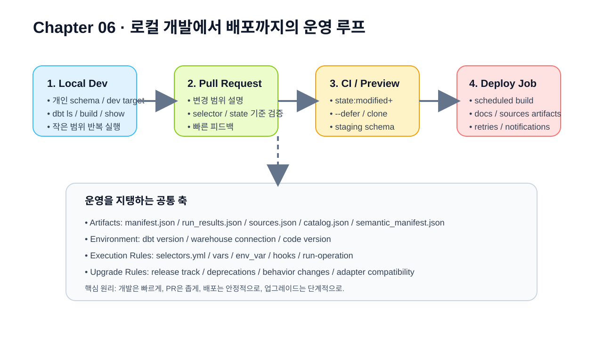

*그림 6-1. 로컬 개발에서 배포까지의 운영 루프*

---

<a id="book-chapters-reference-v3-06-operations-cicd-state-defer-clone-vars-env-hooks-and-upgrades-md--61-운영을-따로-배워야-하는-이유"></a>

### 6.1. 운영을 따로 배워야 하는 이유

운영은 “마지막에 붙이는 부가 기능”이 아니다. 오히려 프로젝트가 커질수록 모델 품질을 지키는 첫 번째 방어선이 된다. 예를 들어 두 개발자가 같은 스키마를 쓰고 있고, 변경 범위를 확인하지 않은 채 전체 빌드를 반복하며, secret을 코드에 직접 적고, 업그레이드를 배포 직전에만 떠올린다면 프로젝트는 빠르게 불안정해진다. 반대로 운영 규칙이 잘 잡혀 있으면 모델이 다소 늘어나더라도 프로젝트는 예측 가능한 방식으로 성장한다.

운영을 생각할 때 가장 먼저 구분해야 하는 것은 다음 다섯 가지다.

- 개발 환경과 배포 환경은 목적이 다르다.
- PR 검증과 정식 배포는 속도와 안정성의 우선순위가 다르다.
- 모든 변경을 전체 재빌드로 검증할 필요는 없다.
- 환경별 차이는 코드 안의 하드코딩이 아니라 선언된 설정으로 관리해야 한다.
- 업그레이드는 버전 번호를 바꾸는 행위가 아니라 운영 절차다.

<a id="book-chapters-reference-v3-06-operations-cicd-state-defer-clone-vars-env-hooks-and-upgrades-md--611-개인-실습과-팀-운영의-차이"></a>

#### 6.1.1. 개인 실습과 팀 운영의 차이

혼자 공부할 때는 모델 하나가 잘 만들어지고 결과가 맞으면 큰 진전을 느낀다. 하지만 팀 프로젝트에서는 같은 기준으로는 부족하다. 팀 운영에서는 다음 질문에 대답할 수 있어야 한다.

- 이 변경은 어느 범위까지 영향을 주는가?
- 이 PR에서 최소 무엇을 검증해야 하는가?
- 이 모델이 dev에는 있는데 prod에는 아직 없는가?
- 이 오류는 코드 문제인가, 환경 문제인가, secret 문제인가?
- 지난달과 이번달에 같은 job이 왜 다르게 실행됐는가?

즉, 개인 실습은 “한 번 성공하는 경험”이 중요하고, 팀 운영은 “매번 같은 원리로 성공과 실패를 설명할 수 있는 상태”가 중요하다.

<a id="book-chapters-reference-v3-06-operations-cicd-state-defer-clone-vars-env-hooks-and-upgrades-md--612-환경은-보통-세-층으로-생각하면-편하다"></a>

#### 6.1.2. 환경은 보통 세 층으로 생각하면 편하다

운영을 처음 배울 때는 환경을 너무 세세하게 쪼개기보다 아래 세 층으로 생각하는 편이 이해하기 쉽다.

| 층 | 대표 환경 | 목적 | 핵심 질문 |
| --- | --- | --- | --- |
| 개발 층 | 로컬 CLI, Studio IDE, 개인 schema | 빠른 수정과 반복 실험 | 내가 바꾼 모델을 가장 짧게 검증하려면? |
| 검증 층 | CI, staging, preview schema | PR 검증, slim CI, 회귀 방지 | 이번 변경이 다른 모델을 깨뜨리지 않았는가? |
| 배포 층 | production job, scheduled deployment | 안정적 재현과 사용자 제공 | 정해진 시간에 예측 가능한 결과를 만들었는가? |

여기서 중요한 것은 “개발 환경은 빠름”, “검증 환경은 집중”, “배포 환경은 안정”이라는 목적 차이다. 목적이 다르기 때문에 실행 명령도 같을 필요가 없다.

<a id="book-chapters-reference-v3-06-operations-cicd-state-defer-clone-vars-env-hooks-and-upgrades-md--613-dbt-platform의-environment를-어떻게-읽을까"></a>

#### 6.1.3. dbt platform의 environment를 어떻게 읽을까

dbt platform의 environment는 단순한 접속 설정이 아니다. 운영 관점에서 environment는 최소 세 가지를 동시에 정한다.

1. 어떤 dbt 버전/엔진으로 실행할 것인가
2. 어떤 warehouse/database/schema/role에 연결할 것인가
3. 어떤 코드 버전을 실행할 것인가

즉, environment는 “어디에 연결할까?”만이 아니라 “무엇으로, 어떤 코드를 실행할까?”까지 함께 정한다. 로컬 CLI에서는 이 세 요소가 각각 Python/dbt 설치, `profiles.yml`, Git branch처럼 흩어져 있지만, dbt platform에서는 environment 단위로 더 명시적으로 관리된다.

<a id="book-chapters-reference-v3-06-operations-cicd-state-defer-clone-vars-env-hooks-and-upgrades-md--614-pr-검증과-배포는-다른-문제를-푼다"></a>

#### 6.1.4. PR 검증과 배포는 다른 문제를 푼다

PR 검증의 목표는 빠른 피드백이다. 그래서 보통 바뀐 모델과 그 downstream 정도만 빠르게 확인하는 slim CI 패턴이 잘 맞는다.

반면 배포 job의 목표는 안정적인 재현이다. 배포에서는 스케줄, retries, 알림, docs/source artifacts, 권한, 실패 후 복구까지 함께 생각해야 한다.

이 둘을 같은 명령으로 통일하려는 습관은 운영을 오히려 무겁게 만든다. 예를 들어 PR에서 매번 전체 프로젝트를 재빌드하면 느리고 비싸며, 배포에서 매번 최소 범위만 돌리면 누적 드리프트나 숨은 의존성을 놓칠 수 있다.

<a id="book-chapters-reference-v3-06-operations-cicd-state-defer-clone-vars-env-hooks-and-upgrades-md--615-운영-초기에-먼저-정할-최소-규칙"></a>

#### 6.1.5. 운영 초기에 먼저 정할 최소 규칙

아주 작은 팀이라도 아래 규칙은 초반부터 정해두는 편이 좋다.

- 개인 개발은 개인 schema 또는 분리된 dev target에서 실행한다.
- PR 검증은 변경 범위 중심으로 빠르게 수행한다.
- 배포 환경은 dev와 다른 schema/role/credentials를 사용한다.
- 비밀값은 `env_var()`로 분리한다.
- 실행 패턴은 CLI 한 줄이 아니라 `selectors.yml`, scripts, job 정의로 남긴다.
- 업그레이드는 production이 아니라 development 환경에서 먼저 검증한다.

---

<a id="book-chapters-reference-v3-06-operations-cicd-state-defer-clone-vars-env-hooks-and-upgrades-md--62-state-defer-clone-retry를-한-흐름으로-이해하기"></a>

### 6.2. state, defer, clone, retry를 한 흐름으로 이해하기

앞 장에서 `--select`, `dbt ls`, DAG, layered modeling을 배웠다면, 운영 단계에서는 “무엇을 선택해서 어떻게 실행할 것인가”를 더 정교하게 다룰 수 있어야 한다. 여기서 핵심이 state, defer, clone, retry다.

많은 사람이 이 네 기능을 별개의 옵션으로 외우려 하지만, 실제로는 아래와 같이 한 흐름으로 이해하는 편이 훨씬 쉽다.

- state: 무엇이 바뀌었는지 비교한다.
- defer: 지금 환경에 없는 upstream은 기준 환경 것을 참조한다.
- clone: 기준 환경의 객체를 실제로 가져와서 내 환경에 만들어 둔다.
- retry: 직전 실행이 중간에서 깨졌다면 거기서 이어 달린다.

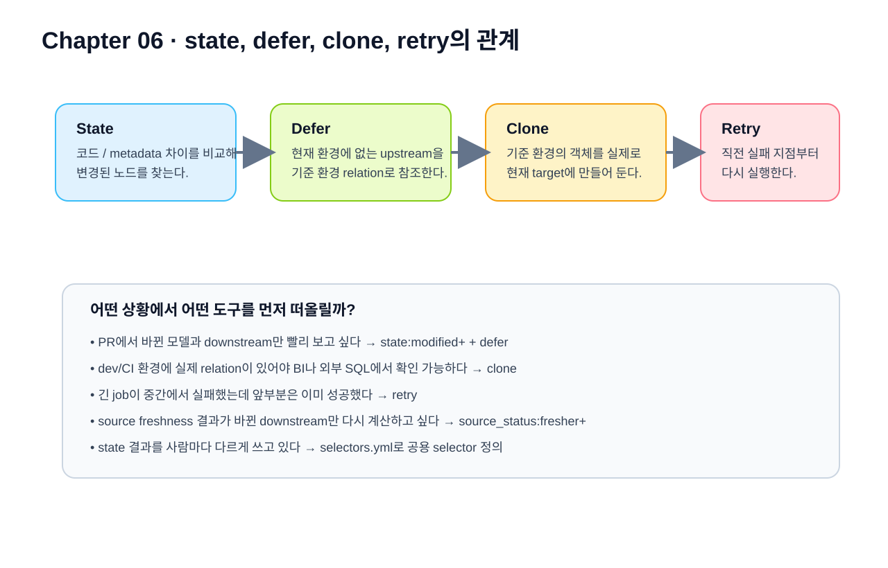

*그림 6-2. state, defer, clone, retry의 관계*

<a id="book-chapters-reference-v3-06-operations-cicd-state-defer-clone-vars-env-hooks-and-upgrades-md--621-artifacts가-없으면-state도-없다"></a>

#### 6.2.1. artifacts가 없으면 state도 없다

state 기반 운영의 출발점은 artifacts다. 특히 다음 파일을 자주 보게 된다.

| artifact | 역할 | 운영에서 중요한 이유 |
| --- | --- | --- |
| `manifest.json` | 프로젝트 그래프와 node metadata | 변경 비교, docs, selector 해석의 기준 |
| `run_results.json` | 실행 결과와 상태 | `dbt retry`, 실패 분석, duration 해석 |
| `sources.json` | source freshness 결과 | `source_status:fresher+` selector의 기반 |
| `catalog.json` | relation/column 메타데이터 | docs와 metadata 확인 |
| `semantic_manifest.json` | semantic layer metadata | metric/semantic validation의 기준 |

실무에서는 “어제의 prod manifest와 오늘의 PR branch를 비교한다”는 식으로 artifacts를 비교 기준으로 삼는다. 그래서 운영 job에서는 artifacts를 언제, 어디에 저장하고 다시 사용할지를 함께 설계해야 한다.

<a id="book-chapters-reference-v3-06-operations-cicd-state-defer-clone-vars-env-hooks-and-upgrades-md--622-statemodified는-이번-pr에서-바뀐-곳을-좁히는-기본기다"></a>

#### 6.2.2. `state:modified+`는 “이번 PR에서 바뀐 곳”을 좁히는 기본기다

가장 널리 쓰는 패턴은 다음과 같다.

```bash
dbt parse
dbt ls --select state:modified+ --state path/to/prod_artifacts
dbt build --select state:modified+ --defer --state path/to/prod_artifacts
```

이 패턴의 의미는 다음과 같다.

1. 현재 코드와 기준 manifest를 비교한다.
2. 변경된 노드와 그 downstream을 선택한다.
3. 지금 내 dev/CI 환경에 없는 upstream은 기준 환경의 relation을 참조한다.

이렇게 하면 PR 단계에서 전체를 다시 만들지 않고도 “내가 바꾼 영역이 downstream을 깨뜨리는지”를 빠르게 볼 수 있다.

다만 state는 완전무결하지 않다. 예를 들어 아래 같은 상황은 별도 판단이 필요하다.

- `env_var()` 값만 바뀌었는데 코드 diff는 작은 경우
- warehouse 바깥에서 테이블이 drop됐지만 코드에는 변화가 없는 경우
- seed 외부 입력 데이터가 바뀌었는데 manifest 차이만으로는 충분하지 않은 경우

즉, state selector는 운영의 강력한 기준이지만, 도메인 상식과 보완 규칙이 함께 있어야 한다.

<a id="book-chapters-reference-v3-06-operations-cicd-state-defer-clone-vars-env-hooks-and-upgrades-md--623-source_statusfresher는-데이터-쪽-변화를-끌어온다"></a>

#### 6.2.3. `source_status:fresher+`는 데이터 쪽 변화를 끌어온다

코드만 바뀌는 것이 아니라 source freshness 결과가 달라지는 경우도 있다. 이럴 때는 `dbt source freshness`로 만든 `sources.json`을 활용해 다음과 같이 실행할 수 있다.

```bash
dbt source freshness
dbt build --select source_status:fresher+ --state path/to/source_artifacts
```

이 패턴은 “코드 변경은 없지만 upstream source가 새 데이터를 받았으니 다시 계산해야 하는 모델만 선택하고 싶다”는 요구에 잘 맞는다.

<a id="book-chapters-reference-v3-06-operations-cicd-state-defer-clone-vars-env-hooks-and-upgrades-md--624-defer는-없는-upstream을-prod에-기대는-기능이다"></a>

#### 6.2.4. defer는 “없는 upstream을 prod에 기대는” 기능이다

defer를 쓰면 지금 target에 없는 upstream relation을 기준 state의 relation로 대신 참조하게 된다. 이게 특히 유용한 순간은 다음과 같다.

- dev schema에 전체 upstream을 만들고 싶지 않을 때
- PR 검증에서 바뀐 모델만 빠르게 보고 싶을 때
- 무거운 mart를 전부 재생성하지 않고 downstream 검증만 하고 싶을 때

예를 들어 내가 `fct_orders`만 수정했는데 그 upstream 전체를 dev에 만들고 싶지는 않다면, `--defer --state prod_artifacts` 조합이 큰 힘을 발휘한다.

```bash
dbt build \
  --select state:modified+ \
  --state path/to/prod_artifacts \
  --defer
```

defer는 대개 clone보다 더 싸고 간단하다. 다만 defer는 실제 relation을 내 schema에 복제하는 것이 아니므로, dbt 밖의 도구(BI, notebook, external SQL)에서 바로 확인해야 한다면 clone이 더 나을 수 있다.

<a id="book-chapters-reference-v3-06-operations-cicd-state-defer-clone-vars-env-hooks-and-upgrades-md--625-clone은-참조-대신-실체를-만든다"></a>

#### 6.2.5. clone은 “참조” 대신 “실체를 만든다”

`dbt clone`은 기준 state의 selected nodes를 현재 target으로 복제한다. 데이터 플랫폼이 zero-copy clone을 지원하면 매우 빠르게 작동할 수 있고, 그렇지 않은 경우 단순 pointer view로 구현될 수 있다.

```bash
dbt clone --select tag:heavy --state path/to/prod_artifacts
```

clone이 특히 유용한 경우는 다음과 같다.

- 무거운 incremental 모델을 CI/dev에서 full refresh 없이 다뤄야 할 때
- BI 도구에서 내 dev schema를 직접 보며 확인해야 할 때
- blue/green 또는 shadow validation 같은 운영 전략을 쓸 때

반대로 단순 PR 검증이라면 defer가 더 단순할 때가 많다. clone은 편리하지만 target에 실제 객체를 만들기 때문에 관리 비용을 함께 생각해야 한다.

<a id="book-chapters-reference-v3-06-operations-cicd-state-defer-clone-vars-env-hooks-and-upgrades-md--626-retry는-중간-실패-뒤의-복구-시간을-줄여-준다"></a>

#### 6.2.6. retry는 중간 실패 뒤의 복구 시간을 줄여 준다

긴 job이 거의 끝나갈 때 한 노드가 실패하면 처음부터 다시 돌리는 것이 가장 답답하다. `dbt retry`는 바로 이런 상황을 줄여 준다. `run_results.json`을 기준으로 마지막 명령의 실패 지점부터 다시 시도한다.

```bash
dbt build --select tag:nightly
# 중간에 실패
dbt retry
```

retry를 쓸 때 기억할 점:

- 직전 명령이 일부 노드를 실행한 뒤 실패해야 의미가 있다.
- warehouse 권한 문제처럼 초반에 바로 실패했다면 retry가 할 일이 없을 수 있다.
- retry 전에 실패 원인을 먼저 고친 뒤 다시 실행해야 한다.

<a id="book-chapters-reference-v3-06-operations-cicd-state-defer-clone-vars-env-hooks-and-upgrades-md--627-selectorsyml은-팀의-공용-실행-패턴을-저장소-안에-남긴다"></a>

#### 6.2.7. selectors.yml은 팀의 공용 실행 패턴을 저장소 안에 남긴다

운영 지식이 사람 머릿속에만 있으면 팀이 커질수록 불안정해진다. 그래서 반복되는 선택 패턴은 `selectors.yml`로 승격하는 편이 좋다.

```yaml
selectors:
  - name: slim_ci
    description: "PR에서 변경된 노드와 downstream만 검증"
    definition: "state:modified+"

  - name: source_refresh
    description: "freshness가 갱신된 source downstream만 계산"
    definition: "source_status:fresher+"

  - name: nightly_heavy
    description: "야간에 무거운 모델만 선택"
    definition: "tag:nightly,tag:heavy"
```

이렇게 해 두면 CI 스크립트와 job 정의에서 다음처럼 더 짧고 명확한 호출이 가능하다.

```bash
dbt build --selector slim_ci --state path/to/prod_artifacts --defer
```

<a id="book-chapters-reference-v3-06-operations-cicd-state-defer-clone-vars-env-hooks-and-upgrades-md--628-로컬-cli와-dbt-platform-state-aware-orchestration은-같은가"></a>

#### 6.2.8. 로컬 CLI와 dbt platform state-aware orchestration은 같은가?

같은 부분도 있고 다른 부분도 있다.

로컬 CLI에서 `state:modified+`, `source_status:fresher+`, `--state`, `--defer`를 사용하는 방식은 artifact 기반이다. 특정 시점의 artifacts를 비교 기준으로 둔다.

반면 dbt platform의 state-aware orchestration은 environment 차원의 공유 상태를 바탕으로 무엇을 다시 빌드할지를 더 지속적으로 판단한다. 이 개념은 비슷하지만, 실행 주체와 상태 저장 방식이 더 중앙집중적이다.

그래서 실무에서는 이렇게 생각하면 편하다.

- 로컬/CLI: “이번 한 번의 실행에서 artifacts를 기준으로 똑똑하게 좁힌다.”
- state-aware orchestration: “환경 단위의 공유 상태를 바탕으로 job이 자동으로 덜 빌드하도록 최적화한다.”

---

<a id="book-chapters-reference-v3-06-operations-cicd-state-defer-clone-vars-env-hooks-and-upgrades-md--63-vars-env_var-hooks-run-operation-packages를-운영-관점으로-묶기"></a>

### 6.3. vars, env_var, hooks, run-operation, packages를 운영 관점으로 묶기

이 절의 기능들은 겉보기에는 서로 다르다. 하지만 운영 관점에서 보면 모두 “코드만으로는 다 표현되지 않는 실행 차이”를 관리하는 도구다.

<a id="book-chapters-reference-v3-06-operations-cicd-state-defer-clone-vars-env-hooks-and-upgrades-md--631-var는-실험-파라미터와-기능-분기를-코드-바깥으로-뺀다"></a>

#### 6.3.1. `var()`는 실험 파라미터와 기능 분기를 코드 바깥으로 뺀다

`var()`는 프로젝트 안에서 기본값을 정의하고, 실행 시점에 값을 덮어쓸 수 있게 한다. beginner 단계에서는 잘 안 보이지만, 운영 단계에서는 특정 기간만 다시 계산하거나, preview 기능을 켜거나, semantic refresh 대상을 분기할 때 유용하다.

```sql
select *
from {{ ref('stg_orders') }}
where order_date >= {{ var('start_date', "'2026-01-01'") }}
```

실행할 때는 이렇게 넘길 수 있다.

```bash
dbt build --vars '{"start_date": "'\''2026-03-01'\''"}'
```

주의할 점은 var를 비밀값 저장소처럼 쓰지 말아야 한다는 점이다. var는 파라미터용이고, 비밀값은 `env_var()`가 맞다.

<a id="book-chapters-reference-v3-06-operations-cicd-state-defer-clone-vars-env-hooks-and-upgrades-md--632-env_var는-환경별-차이와-secret을-분리한다"></a>

#### 6.3.2. `env_var()`는 환경별 차이와 secret을 분리한다

운영에서 비밀값을 코드에 직접 넣는 것은 피해야 한다. dbt는 `env_var()`를 통해 환경 변수 값을 읽게 할 수 있다.

```yaml
password: "{{ env_var('DBT_ENV_SECRET_SNOWFLAKE_PASSWORD') }}"
```

운영에서 `env_var()`가 중요한 이유는 두 가지다.

1. secret을 Git에 남기지 않는다.
2. dev / staging / prod의 연결 정보 차이를 코드 바깥에서 제어할 수 있다.

단, `env_var()`도 남용하면 코드가 불투명해진다. 비즈니스 규칙까지 environment variable로 밀어 넣지 말고, secret 또는 명백한 환경 차이만 여기에 두는 편이 좋다.

<a id="book-chapters-reference-v3-06-operations-cicd-state-defer-clone-vars-env-hooks-and-upgrades-md--633-target은-현재-내가-어느-환경에서-뛰는지-알려-준다"></a>

#### 6.3.3. `target`은 현재 내가 어느 환경에서 뛰는지 알려 준다

`target`은 현재 활성화된 target의 정보(database, schema, name 등)를 읽게 해 준다. 예를 들어 schema naming이나 branch별 실험을 다르게 하고 싶을 때 유용하다.

```sql
{{ config(schema=target.schema) }}
```

다만 `target.name == 'prod'` 같은 분기를 지나치게 많이 쓰면 코드가 복잡해진다. 환경 차이는 우선 profile/environment 설정으로 해결하고, 모델 로직을 과도하게 갈라야 할 때만 신중하게 쓰는 것이 좋다.

<a id="book-chapters-reference-v3-06-operations-cicd-state-defer-clone-vars-env-hooks-and-upgrades-md--634-hooks는-built-in-config로-해결되지-않을-때만-쓴다"></a>

#### 6.3.4. hooks는 built-in config로 해결되지 않을 때만 쓴다

hooks는 강력하다. 하지만 강력하다는 말은 “자주 써도 된다”는 뜻이 아니다. 다음 순서로 생각하는 편이 좋다.

1. grants, contracts, persist_docs, materialization, config로 해결 가능한가?
2. 해결이 안 된다면 hook가 필요한가?
3. hook가 필요하다면 최소 범위로 작성했는가?

예를 들어 통계 갱신, 권한 부여, warehouse별 analyze 작업은 hook 후보가 될 수 있다.

```yaml
models:
  my_project:
    marts:
      +post-hook:
        - "analyze table {{ this }} compute statistics"
```

운영에서 hook의 위험은 “어디서 무슨 SQL이 추가로 돌았는지 모르게 되는 것”이다. 그래서 hook는 적고, 짧고, 명확해야 한다.

<a id="book-chapters-reference-v3-06-operations-cicd-state-defer-clone-vars-env-hooks-and-upgrades-md--635-run-operation은-모델이-아닌-운영-작업을-코드화한다"></a>

#### 6.3.5. `run-operation`은 모델이 아닌 운영 작업을 코드화한다

모델은 relation을 만들기 위한 것이고, `run-operation`은 모델이 아닌 관리 작업을 위한 도구다. 오래된 dev schema 정리, grants 재적용, audit row 삽입, migration helper 등이 대표적이다.

```bash
dbt run-operation grant_reporter_access --args '{"role": "reporter"}'
dbt run-operation cleanup_old_schemas --args '{"prefix": "dbt_"}'
```

이 기능을 잘 쓰면 “운영 절차가 위키 문서에만 있는 상태”를 줄이고, dbt project 안에 실행 가능한 형태로 남길 수 있다.

<a id="book-chapters-reference-v3-06-operations-cicd-state-defer-clone-vars-env-hooks-and-upgrades-md--636-packages는-재사용-자산이고-project-dependencies는-운영-경계다"></a>

#### 6.3.6. packages는 재사용 자산이고, project dependencies는 운영 경계다

운영 초반에는 패키지 사용만으로도 충분한 경우가 많다. 예를 들어 `dbt_utils` 같은 패키지는 매크로와 tests를 재사용하게 해 준다.

```yaml
packages:
  - package: dbt-labs/dbt_utils
    version: [">=1.2.0", "<2.0.0"]
```

반면 ownership 경계가 생기고, 다른 팀 프로젝트의 published asset을 참조해야 하는 규모라면 project dependencies와 mesh를 별도로 생각할 시점이 온다. 이 책에서는 mesh 자체는 다음 장에서 더 자세히 다루지만, 여기서는 packages와 운영 경계가 다르다는 정도만 먼저 잡아두면 충분하다.

---

<a id="book-chapters-reference-v3-06-operations-cicd-state-defer-clone-vars-env-hooks-and-upgrades-md--64-업그레이드와-release-track을-운영-절차로-보기"></a>

### 6.4. 업그레이드와 release track을 운영 절차로 보기

업그레이드는 “버전 번호를 올린다”가 아니라 “새 동작을 어디에서 먼저 검증하고 언제 production에 반영할지 정한다”는 절차다.

<a id="book-chapters-reference-v3-06-operations-cicd-state-defer-clone-vars-env-hooks-and-upgrades-md--641-업그레이드를-production에서-처음-하면-안-되는-이유"></a>

#### 6.4.1. 업그레이드를 production에서 처음 하면 안 되는 이유

dbt 버전이 바뀌면 다음 요소가 함께 흔들릴 수 있다.

- parser 동작
- selector/state 비교 방식
- artifacts 스키마 버전
- adapter 지원 범위
- package 호환성
- behavior change defaults

그래서 업그레이드는 보통 다음 순서가 안전하다.

1. development 환경에서 parse/build/test/docs를 먼저 확인한다.
2. slim CI 또는 staging 환경에서 변경 범위를 검증한다.
3. production job에 반영하기 전에 deprecations와 behavior change를 점검한다.
4. artifacts 호환성과 state 기준 파일을 새 버전으로 다시 정리한다.

<a id="book-chapters-reference-v3-06-operations-cicd-state-defer-clone-vars-env-hooks-and-upgrades-md--642-release-track은-릴리스-리듬을-정한다"></a>

#### 6.4.2. release track은 “릴리스 리듬”을 정한다

dbt platform에서는 version pinning 대신 release track 관점으로 운영할 수 있다. 중요한 점은 모든 팀이 같은 리듬을 택할 필요가 없다는 것이다.

- 빠른 기능 수용이 중요하면 Latest 쪽
- 좀 더 완만한 cadence가 필요하면 Compatible / Extended
- production은 더 보수적이고, development는 더 빠르게 실험할 수도 있다

핵심은 “개발과 배포를 같은 릴리스 리듬으로 반드시 묶어야 한다”가 아니라, 업그레이드 검증이 가능한 cadence를 택하는 것이다.

<a id="book-chapters-reference-v3-06-operations-cicd-state-defer-clone-vars-env-hooks-and-upgrades-md--643-behavior-change-flags는-migration-window다"></a>

#### 6.4.3. behavior change flags는 migration window다

behavior change는 일반 deprecation과 다르다. 코드가 곧장 깨지는 것이 아니라, 런타임 동작이 바뀌는 전환 구간을 제공한다. 운영 관점에서 behavior change를 볼 때 중요한 질문은 다음이다.

- 이 플래그는 dev에서 먼저 켜 볼 것인가?
- CI에서 legacy/new behavior를 어느 시점까지 병행 확인할 것인가?
- production 반영 시점은 언제인가?
- package와 adapter가 이 동작을 감당하는가?

<a id="book-chapters-reference-v3-06-operations-cicd-state-defer-clone-vars-env-hooks-and-upgrades-md--644-업그레이드-체크리스트"></a>

#### 6.4.4. 업그레이드 체크리스트

아래 네 단계를 매번 반복하는 체크리스트로 두면 좋다.

1. `dbt deps`, `dbt parse`, `dbt build`가 development에서 통과하는가
2. packages, adapter, artifacts schema가 새 버전과 호환되는가
3. behavior change / deprecation warning이 있는가
4. production용 state artifacts와 CI 기준 경로를 새 버전 기준으로 갱신했는가

---

<a id="book-chapters-reference-v3-06-operations-cicd-state-defer-clone-vars-env-hooks-and-upgrades-md--65-세-예제-트랙에서-운영이-어떻게-달라지는가"></a>

### 6.5. 세 예제 트랙에서 운영이 어떻게 달라지는가

이제 앞에서 설명한 원리를 세 예제 트랙에 연결해 보자. 이 절의 목적은 “운영 기능을 많이 아는 것”이 아니라, 같은 운영 원리가 도메인마다 어떤 다른 압력으로 나타나는지를 이해하는 데 있다.

<a id="book-chapters-reference-v3-06-operations-cicd-state-defer-clone-vars-env-hooks-and-upgrades-md--651-retail-orders-안정성과-설명-가능성이-우선인-운영"></a>

#### 6.5.1. Retail Orders: 안정성과 설명 가능성이 우선인 운영

Retail Orders 트랙에서는 보통 다음 요구가 핵심이다.

- 주문/매출 관련 지표가 매일 같은 방식으로 산출되어야 한다.
- downstream BI와 리포트가 안정적이어야 한다.
- 변경이 있어도 설명 가능해야 한다.

그래서 Retail Orders에서는 다음 운영 패턴이 잘 맞는다.

- PR에서는 `state:modified+ --defer`로 변경된 mart와 downstream만 빠르게 검증한다.
- 배포에서는 핵심 fact/dim에 대해 좀 더 보수적인 `dbt build`를 유지한다.
- source freshness나 daily batch의 도착 시점이 분명하다면 `source_status:fresher+`를 보조적으로 활용한다.
- grants, docs, contracts 같은 “소비자 신뢰” 관련 운영 규칙이 중요해진다.

예를 들어 `fct_orders`를 수정하는 PR이라면:

```bash
dbt build --select state:modified+ --state path/to/prod_artifacts --defer
```

이 명령만으로도 upstream 전부를 dev에 만들지 않고 downstream 회귀를 빠르게 볼 수 있다.

<a id="book-chapters-reference-v3-06-operations-cicd-state-defer-clone-vars-env-hooks-and-upgrades-md--652-event-stream-비용속도증분-처리-압력이-큰-운영"></a>

#### 6.5.2. Event Stream: 비용·속도·증분 처리 압력이 큰 운영

Event Stream 트랙은 append-heavy, volume-heavy 경향이 강하므로 운영에서 특히 중요한 것은 다음이다.

- incremental/full refresh 판단
- 무거운 모델을 매번 다시 만들지 않는 전략
- data arrival 지연과 backfill 대응
- CI 비용 통제

이 트랙에서는 clone과 state 전략의 체감 가치가 더 크다. 예를 들어 무거운 sessionization mart를 PR마다 full refresh하면 너무 비싸다면, production artifacts를 기준으로 clone 후 변경된 downstream만 검증하는 패턴을 고려할 수 있다.

```bash
dbt clone --select tag:heavy --state path/to/prod_artifacts
dbt build --select state:modified+ --state path/to/prod_artifacts --defer
```

또한 vars를 이용해 개발 시점에는 작은 시간 창만 계산하는 것도 자주 쓰인다.

```bash
dbt build --vars '{"start_date": "'\''2026-04-01'\''"}'
```

<a id="book-chapters-reference-v3-06-operations-cicd-state-defer-clone-vars-env-hooks-and-upgrades-md--653-subscription--billing-환경-차이와-버전-안정성이-더-민감한-운영"></a>

#### 6.5.3. Subscription & Billing: 환경 차이와 버전 안정성이 더 민감한 운영

Subscription & Billing 트랙은 상태 변화, billing logic, lifecycle transition이 얽혀 있어 “동일한 로직을 얼마나 안정적으로 반복 재현할 수 있는가”가 중요하다.

이 트랙에서는 특히 다음 운영 요소가 중요하다.

- var와 env_var를 통한 기간/환경/secret 분리
- snapshot 및 semantic layer 이후의 변경 영향 추적
- upgrade 시 behavior change가 billing logic에 미치는 영향 검토
- run-operation으로 migration helper나 grants를 코드화하는 전략

예를 들어 billing cutoff date를 var로 주입하고, credentials는 env_var로 분리하는 패턴은 실무에서 꽤 흔하다.

```sql
where billing_month >= {{ var('billing_month_start', "'2026-01-01'") }}
```

```yaml
password: "{{ env_var('DBT_ENV_SECRET_BILLING_PASSWORD') }}"
```

이 트랙은 “코드는 적게 바꿨는데 결과 의미는 크게 바뀌는” 사례가 많기 때문에, 업그레이드와 behavior change를 dev/staging에서 먼저 검증하는 규율이 특히 중요하다.

---

<a id="book-chapters-reference-v3-06-operations-cicd-state-defer-clone-vars-env-hooks-and-upgrades-md--66-운영-runbook-상황별로-어디부터-볼까"></a>

### 6.6. 운영 runbook: 상황별로 어디부터 볼까

운영 단계에서 자주 만나는 상황을 짧은 runbook으로 정리하면 다음과 같다.

<a id="book-chapters-reference-v3-06-operations-cicd-state-defer-clone-vars-env-hooks-and-upgrades-md--상황-1-pr-검증이-너무-느리다"></a>

#### 상황 1. PR 검증이 너무 느리다
먼저 볼 것:
- 전체 빌드를 돌리고 있지 않은가
- `state:modified+`와 `--defer`를 쓸 수 없는가
- `selectors.yml`로 slim CI를 공용 패턴으로 만들었는가

<a id="book-chapters-reference-v3-06-operations-cicd-state-defer-clone-vars-env-hooks-and-upgrades-md--상황-2-dev에-없는-upstream-때문에-downstream-검증이-어렵다"></a>

#### 상황 2. dev에 없는 upstream 때문에 downstream 검증이 어렵다
먼저 볼 것:
- `--defer --state prod_artifacts`를 쓸 수 있는가
- BI/외부 도구에서 직접 확인이 필요하다면 clone이 더 나은가

<a id="book-chapters-reference-v3-06-operations-cicd-state-defer-clone-vars-env-hooks-and-upgrades-md--상황-3-긴-야간-배치가-중간에서-실패했다"></a>

#### 상황 3. 긴 야간 배치가 중간에서 실패했다
먼저 볼 것:
- `run_results.json`이 남아 있는가
- 실패 원인을 고친 뒤 `dbt retry`가 가능한가
- 같은 문제가 반복된다면 selector를 더 쪼개야 하는가

<a id="book-chapters-reference-v3-06-operations-cicd-state-defer-clone-vars-env-hooks-and-upgrades-md--상황-4-secret과-환경-차이가-뒤섞여-있다"></a>

#### 상황 4. secret과 환경 차이가 뒤섞여 있다
먼저 볼 것:
- hard-coded password나 schema가 없는가
- `env_var()`와 profile/environment 설정으로 분리할 수 있는가
- 비즈니스 규칙까지 env_var로 감추고 있지는 않은가

<a id="book-chapters-reference-v3-06-operations-cicd-state-defer-clone-vars-env-hooks-and-upgrades-md--상황-5-업그레이드가-두렵다"></a>

#### 상황 5. 업그레이드가 두렵다
먼저 볼 것:
- development 환경에서 먼저 검증하고 있는가
- deprecations와 behavior changes를 따로 보고 있는가
- CI 기준 artifacts와 production artifacts가 새 버전에 맞는가

---

<a id="book-chapters-reference-v3-06-operations-cicd-state-defer-clone-vars-env-hooks-and-upgrades-md--67-운영-안티패턴-아틀라스"></a>

### 6.7. 운영 안티패턴 아틀라스

운영 장에서는 “무엇을 해야 하는가”만큼 “무엇을 피해야 하는가”도 중요하다.

<a id="book-chapters-reference-v3-06-operations-cicd-state-defer-clone-vars-env-hooks-and-upgrades-md--안티패턴-1-dev와-prod를-같은-schema에서-돌린다"></a>

#### 안티패턴 1. dev와 prod를 같은 schema에서 돌린다
문제:
- 우발적 overwrite
- 설명 불가능한 결과
- 재현성 붕괴

<a id="book-chapters-reference-v3-06-operations-cicd-state-defer-clone-vars-env-hooks-and-upgrades-md--안티패턴-2-pr에서도-항상-전체-build를-돌린다"></a>

#### 안티패턴 2. PR에서도 항상 전체 build를 돌린다
문제:
- 느리고 비싸다
- 실패 범위를 좁히기 어렵다
- slim CI의 이점을 놓친다

<a id="book-chapters-reference-v3-06-operations-cicd-state-defer-clone-vars-env-hooks-and-upgrades-md--안티패턴-3-state-selector만-맹신한다"></a>

#### 안티패턴 3. state selector만 맹신한다
문제:
- 외부 데이터 변화나 env 차이를 놓칠 수 있다
- 운영 상식과 병행하지 않으면 맹점이 생긴다

<a id="book-chapters-reference-v3-06-operations-cicd-state-defer-clone-vars-env-hooks-and-upgrades-md--안티패턴-4-env_var에-비즈니스-로직을-숨긴다"></a>

#### 안티패턴 4. env_var에 비즈니스 로직을 숨긴다
문제:
- 코드 리뷰로 판단하기 어려워진다
- 환경 재현성이 떨어진다

<a id="book-chapters-reference-v3-06-operations-cicd-state-defer-clone-vars-env-hooks-and-upgrades-md--안티패턴-5-hook를-만능-도구처럼-쓴다"></a>

#### 안티패턴 5. hook를 만능 도구처럼 쓴다
문제:
- 실제 실행 SQL이 숨어버린다
- grants, docs, contracts 같은 built-in config를 우회하게 된다

<a id="book-chapters-reference-v3-06-operations-cicd-state-defer-clone-vars-env-hooks-and-upgrades-md--안티패턴-6-업그레이드를-production에서-처음-검증한다"></a>

#### 안티패턴 6. 업그레이드를 production에서 처음 검증한다
문제:
- 실패 시 영향 범위가 가장 크다
- deprecation/behavior change를 늦게 발견한다

---

<a id="book-chapters-reference-v3-06-operations-cicd-state-defer-clone-vars-env-hooks-and-upgrades-md--68-직접-해보기"></a>

### 6.8. 직접 해보기

<a id="book-chapters-reference-v3-06-operations-cicd-state-defer-clone-vars-env-hooks-and-upgrades-md--실습-1-slim-ci-selector-만들기"></a>

#### 실습 1. slim CI selector 만들기
`codes/04_chapter_snippets/ch06/selectors.yml`을 열어 `slim_ci`, `source_refresh`, `nightly_heavy` selector를 읽고, 내 프로젝트 이름에 맞게 정의를 조정해 본다.

<a id="book-chapters-reference-v3-06-operations-cicd-state-defer-clone-vars-env-hooks-and-upgrades-md--실습-2-defer와-clone-비교하기"></a>

#### 실습 2. defer와 clone 비교하기
아래 두 명령을 각각 읽고, “실제 객체를 만들지 않는 것”과 “실제 객체를 만들어 두는 것”의 차이를 설명해 본다.

```bash
dbt build --select state:modified+ --state path/to/prod_artifacts --defer
dbt clone --select tag:heavy --state path/to/prod_artifacts
```

<a id="book-chapters-reference-v3-06-operations-cicd-state-defer-clone-vars-env-hooks-and-upgrades-md--실습-3-env_var와-var를-구분해-보기"></a>

#### 실습 3. env_var와 var를 구분해 보기
`start_date`는 var로, password는 env_var로 분리해야 하는 이유를 한 문단으로 적어 본다.

<a id="book-chapters-reference-v3-06-operations-cicd-state-defer-clone-vars-env-hooks-and-upgrades-md--실습-4-업그레이드-순서-작성하기"></a>

#### 실습 4. 업그레이드 순서 작성하기
내 팀이 development → staging → production 순서로 업그레이드한다면, 각 단계에서 어떤 명령을 최소로 돌릴지 네 줄로 적어 본다.

---

<a id="book-chapters-reference-v3-06-operations-cicd-state-defer-clone-vars-env-hooks-and-upgrades-md--69-완료-체크리스트"></a>

### 6.9. 완료 체크리스트

- [ ] 개발 환경, 검증 환경, 배포 환경의 목적 차이를 설명할 수 있다.
- [ ] `state`, `defer`, `clone`, `retry`가 각각 어떤 문제를 푸는지 말할 수 있다.
- [ ] `var`, `env_var`, `target`의 역할을 구분할 수 있다.
- [ ] hook보다 built-in config를 먼저 고려해야 하는 이유를 이해한다.
- [ ] packages와 운영 경계를 섞지 않아야 하는 이유를 안다.
- [ ] 업그레이드를 production에서 처음 하면 안 되는 이유를 설명할 수 있다.
- [ ] Retail Orders / Event Stream / Subscription & Billing 세 예제에서 운영 압력이 어떻게 다른지 구분할 수 있다.

---

<a id="book-chapters-reference-v3-06-operations-cicd-state-defer-clone-vars-env-hooks-and-upgrades-md--610-이-장의-핵심-정리"></a>

### 6.10. 이 장의 핵심 정리

이 장의 핵심은 기능 이름을 외우는 것이 아니다. 운영은 결국 다음 한 줄로 요약된다.

> 개발은 빠르게, PR은 좁게, 배포는 안정적으로, 업그레이드는 단계적으로.

dbt 프로젝트가 커질수록 중요한 것은 “더 많은 명령을 아는가”보다, 어떤 환경에서 무엇을 기준으로 어디까지 실행할지 결정하는 감각이다. state/defer/clone/retry, var/env_var/hook/run-operation, environments/jobs/release tracks는 모두 그 감각을 구현하는 서로 다른 도구다. 다음 장에서는 이 운영 기반 위에 governance, contracts, versions, metadata 같은 더 강한 팀 경계를 얹는다.


<a id="book-chapters-reference-v3-06-operations-cicd-state-defer-clone-vars-env-hooks-and-upgrades-md--611-trino--airflow-환경에서-hooks와-vars를-어떻게-운영-규칙으로-바꿀-것인가"></a>

### 6.11. Trino / Airflow 환경에서 hooks와 vars를 어떻게 운영 규칙으로 바꿀 것인가

업무 메모의 가장 좋은 재료는 `log_model_start`, `log_run_end`, `airflow_run_id`, `from_dt`, `end_dt`, `run_query` 패턴이 한 묶음으로 들어 있다는 점이다.
이건 단순히 “매크로 한두 개를 쓴다”가 아니라, dbt 실행을 배치 운영 단위로 다루는 감각을 보여 준다.


<a id="book-chapters-reference-v3-06-operations-cicd-state-defer-clone-vars-env-hooks-and-upgrades-md--6111-왜-시작-로그는-model-hook에-종료-로그는-on-run-end에-두는가"></a>

#### 6.11.1. 왜 시작 로그는 model hook에, 종료 로그는 `on-run-end`에 두는가

업무 메모는 시작 로그를 model-level `pre_hook`에 두고, 종료 로그는 `dbt_project.yml`의 `on-run-end`에서 갱신하는 구조를 사용한다.
이 분리가 중요한 이유는 다음과 같다.

- `pre_hook`은 model이 실제로 실행되기 직전에 해당 model 기준으로 시작 상태를 남기기 좋다.
- `post_hook`은 그 model이 성공했을 때만 기대하기 쉽다.
- `on-run-end`는 실행 전체가 끝난 뒤 `results`를 순회하며 성공/실패 상태를 한 번에 정리하기 좋다.

즉, “시작은 model-local, 종료는 run-global”이라는 감각이 운영적으로 매우 실용적이다.

<a id="book-chapters-reference-v3-06-operations-cicd-state-defer-clone-vars-env-hooks-and-upgrades-md--6112-results와-on-run-end는-같은-맥락에서-봐야-한다"></a>

#### 6.11.2. `results`와 `on-run-end`는 같은 맥락에서 봐야 한다

업무 메모의 `log_run_end()`는 `results`를 순회하며 model별 상태를 업데이트한다.
이 패턴은 Chapter 06에서 꼭 강조할 가치가 있다. 왜냐하면 `results`는 아무 데서나 쓰는 변수가 아니라, on-run-end context에서만 의미 있게 제공되는 실행 결과 묶음이기 때문이다.

따라서 교재에서는 아래를 분명히 적는 것이 좋다.

- model 안에서 `results`를 쓰는 것이 아님
- `on-run-end`에서 각 node 결과를 순회하는 것임
- 성공/실패/메시지/alias/name 등을 여기서 읽을 수 있음

<a id="book-chapters-reference-v3-06-operations-cicd-state-defer-clone-vars-env-hooks-and-upgrades-md--612-airflow_run_id와-기간-파라미터는-dbt-변수가-아니라-배치-계약이다"></a>

### 6.12. `airflow_run_id`와 기간 파라미터는 “dbt 변수”가 아니라 배치 계약이다

업무 메모는 `var('airflow_run_id', invocation_id)` 패턴을 쓰고 있다.
이건 매우 좋은 운영 관점이다. 이유는 다음과 같다.

- Airflow가 run identifier를 넘겨 주면 dbt 로그와 orchestrator run을 연결할 수 있다.
- Airflow가 없을 때는 `invocation_id`로 fallback할 수 있다.
- `from_dt`, `end_dt`는 단순 필터 값이 아니라 이번 배치가 무엇을 처리하는지를 설명하는 계약이 된다.

즉, vars는 “파라미터를 넣는 방법”이 아니라 실행 문맥을 외부 시스템과 맞추는 방법으로 가르치는 편이 좋다.

예시 실행:

```bash
dbt run   --select case01_truncate_insert   --vars "{'airflow_run_id': 'manual__2026-04-08T00:00:00', 'from_dt': '2026-04-02', 'end_dt': '2026-04-08'}"
```

<a id="book-chapters-reference-v3-06-operations-cicd-state-defer-clone-vars-env-hooks-and-upgrades-md--613-run_query는-고급하지만-side-effect를-분리해야-한다"></a>

### 6.13. `run_query`는 고급하지만, side effect를 분리해야 한다

업무 메모의 `case02`, `case03`, `case06`은 모두 `run_query`를 사용한다.
이 패턴은 매우 유용하지만, 동시에 위험하다. 왜냐하면 `run_query`는 compile 시 live connection이 있으면 warehouse에 실제 SQL을 날릴 수 있기 때문이다.

따라서 Chapter 06에서는 아래 규칙을 같이 써야 한다.

1. `run_query`는 가능하면 조회성 분기에 먼저 사용한다.
2. `if execute`로 보호한다.
3. DML이나 side effect가 있는 SQL은 hook/operation으로 분리하는 편이 낫다.
4. compile / docs generate에도 live connection이 있을 수 있음을 잊지 않는다.

<a id="book-chapters-reference-v3-06-operations-cicd-state-defer-clone-vars-env-hooks-and-upgrades-md--614-case02--case06을-운영형-jinja-패턴으로-다시-분류하기"></a>

### 6.14. case02 ~ case06을 “운영형 Jinja 패턴”으로 다시 분류하기

업무 메모의 case들은 새 챕터를 만들기보다, Chapter 06 안에서 아래처럼 재분류해 가르치는 편이 좋다.

<a id="book-chapters-reference-v3-06-operations-cicd-state-defer-clone-vars-env-hooks-and-upgrades-md--case02--제어-테이블조회-결과-기반-분기"></a>

#### case02 · 제어 테이블/조회 결과 기반 분기
- 언제 유용한가: 모드 전환, 환경별 분기, 작은 lookup 기반 분기
- 주의점: `run_query` 결과가 없을 때 기본값 처리

<a id="book-chapters-reference-v3-06-operations-cicd-state-defer-clone-vars-env-hooks-and-upgrades-md--case03--데이터-존재-여부-기반-분기"></a>

#### case03 · 데이터 존재 여부 기반 분기
- 언제 유용한가: data presence check, optional downstream, guard query
- 주의점: 분기 양쪽이 모두 최종 컬럼 스키마를 맞춰야 함

<a id="book-chapters-reference-v3-06-operations-cicd-state-defer-clone-vars-env-hooks-and-upgrades-md--case04--의도적-실패를-발생시켜-운영-계층으로-에러를-전달"></a>

#### case04 · 의도적 실패를 발생시켜 운영 계층으로 에러를 전달
- 언제 유용한가: upstream precondition 미충족, 명시적 중단
- 주의점: compile 단계와 execute 단계를 구분해야 함

<a id="book-chapters-reference-v3-06-operations-cicd-state-defer-clone-vars-env-hooks-and-upgrades-md--case05--기간-파라미터-기반-batch-shape-변경"></a>

#### case05 · 기간 파라미터 기반 batch shape 변경
- 언제 유용한가: daily vs backfill, ad-hoc rerun, recovery run
- 주의점: var 이름과 기본값, 로그 기록을 함께 설계해야 함

<a id="book-chapters-reference-v3-06-operations-cicd-state-defer-clone-vars-env-hooks-and-upgrades-md--case06--loop--dynamic-sql"></a>

#### case06 · loop + dynamic SQL
- 언제 유용한가: 작은 제어 집합(country, market, source list)을 읽어 union 또는 query generation
- 주의점: 가능한 경우 raw 입력은 `source()`로 선언하고, 하드코딩 relation을 남발하지 않는다

관련 최종 예시는 `../codes/04_chapter_snippets/ch06/trino/` 아래에 넣어 두었다.

<a id="book-chapters-reference-v3-06-operations-cicd-state-defer-clone-vars-env-hooks-and-upgrades-md--615-운영형-logging-macro는-하드코딩보다-일반화가-낫다"></a>

### 6.15. 운영형 logging macro는 하드코딩보다 일반화가 낫다

업무 메모의 logging macro는 바로 쓸 수 있을 정도로 구체적이지만, 교재에서는 한 단계 일반화해 주는 것이 좋다.
예를 들면 다음 값을 var로 뺄 수 있다.

- `log_database`
- `log_schema`
- `log_table`
- `log_timezone`
- `airflow_run_id`

그러면 같은 아이디어를 Trino 외 환경으로도 옮길 수 있고, catalog/schema 하드코딩을 줄일 수 있다.

<a id="book-chapters-reference-v3-06-operations-cicd-state-defer-clone-vars-env-hooks-and-upgrades-md--616-같이-보면-좋은-코드-경로"></a>

### 6.16. 같이 보면 좋은 코드 경로

- `../codes/04_chapter_snippets/ch06/trino/log_utils.sql`
- `../codes/04_chapter_snippets/ch06/trino/dbt_project_hooks.example.yml`
- `../codes/04_chapter_snippets/ch06/trino/case02_branch_query.sql`
- `../codes/04_chapter_snippets/ch06/trino/case03_branch_query_fixed.sql`
- `../codes/04_chapter_snippets/ch06/trino/case04_raise_except.sql`
- `../codes/04_chapter_snippets/ch06/trino/case05_use_parameter.sql`
- `../codes/04_chapter_snippets/ch06/trino/case06_loop.sql`

---

<a id="book-chapters-reference-v3-07-governance-contracts-versions-grants-quality-and-metadata-md"></a>

장별 원고: [chapters/reference-v3/07-governance-contracts-versions-grants-quality-and-metadata.md](chapters/reference-v3/07-governance-contracts-versions-grants-quality-and-metadata.md)

<a id="book-chapters-reference-v3-07-governance-contracts-versions-grants-quality-and-metadata-md--chapter-07--governance-contracts-versions-grants-quality-metadata"></a>

## CHAPTER 07 · Governance, Contracts, Versions, Grants, Quality Metadata

> **마당마켓 본편 연결:** [J14 · 이름·소유권·권한을 코드 밖에서도 관리하기](#book-journey-14-configuration-md)에서 같은 상점의 누적 실습으로 돌아갈 수 있다. 이 참고편의 `codes/` 스니펫에는 독립 fixture가 포함되어 있으며 본편 `lab/`의 P1~P5와 섞지 않는다. 플랫폼별 구문·기능은 실행 버전에 맞춰 재확인한다.


> 프로젝트를 “돌아가는 SQL 묶음”에서 “신뢰 가능한 공용 API 묶음”으로 바꾸는 장.
>
> 이 장은 tests, contracts, versions, grants, access, groups, metadata를 한 덩어리로 다룬다. 이유는 단순하다. 팀이 커질수록 중요한 질문은 “이 모델이 만들어지는가?”가 아니라 “이 모델을 믿고 참조해도 되는가?”가 되기 때문이다.


거버넌스는 관리 부서의 절차가 아니라, 공유 가능한 데이터 제품을 만드는 기술적 장치다. 모델의 shape를 고정하고, 누가 참조할 수 있는지 정하고, 깨지는 변경을 안전하게 공개하고, 설명과 운영 정보를 코드에 남겨야 한다. 이 모든 것이 합쳐져야 다른 팀이나 미래의 내가 모델을 공용 인터페이스처럼 다룰 수 있다.

초기 프로젝트에서는 tests와 description만으로도 충분해 보일 수 있다. 하지만 public mart가 생기고, semantic 입력 모델이 늘어나고, 여러 팀이 같은 모델을 읽기 시작하면 상황이 달라진다. 그때 필요한 것이 access, groups, contracts, versions, grants, meta, persist_docs 같은 거버넌스 레버들이다.

이 장은 다음 순서로 진행한다.

1. 거버넌스를 왜 따로 배워야 하는지 설명한다.
2. tests / contracts / constraints / grants / versions / metadata의 역할을 분리한다.
3. public model을 어떻게 설계하는지 절차와 판단 기준을 제시한다.
4. Retail Orders / Event Stream / Subscription & Billing 세 예제에서 이 장의 원리가 어떻게 적용되는지 보여 준다.
5. 마지막에 운영 체크리스트와 안티패턴을 정리한다.

---

<a id="book-chapters-reference-v3-07-governance-contracts-versions-grants-quality-and-metadata-md--71-왜-거버넌스를-따로-배워야-하는가"></a>

### 7.1. 왜 거버넌스를 따로 배워야 하는가

dbt 프로젝트가 작을 때는 “잘 돌아가는 모델”이 곧 좋은 모델처럼 보인다. 하지만 팀이 커지고 소비자가 늘어나면 좋은 모델의 조건이 달라진다.

이때 등장하는 질문은 대체로 아래와 같다.

- 이 모델은 외부 팀이 `ref()`해도 되는가?
- 컬럼 타입이 바뀌면 build를 막아야 하는가?
- v1과 v2를 일정 기간 함께 운영할 수 있는가?
- BI 팀에게 읽기 권한은 자동으로 줄 수 있는가?
- 설명과 소유자 정보, SLA, PII 여부를 코드에 남길 수 있는가?
- 테스트 실패가 모두 배포 차단이어야 하는가, 일부는 경고로 남겨야 하는가?

이 질문들은 서로 비슷해 보여도 모두 다른 기능이 답한다.

<a id="book-chapters-reference-v3-07-governance-contracts-versions-grants-quality-and-metadata-md--711-거버넌스-레버를-먼저-분리하자"></a>

#### 7.1.1. 거버넌스 레버를 먼저 분리하자

| 레버 | 무엇을 보장하는가 | 핵심 질문 |
| --- | --- | --- |
| data tests | 데이터 상태가 가정과 맞는가 | null, duplicate, orphan row가 있는가 |
| contracts | 모델 shape가 약속과 같은가 | 열 이름, 타입, 순서가 바뀌지 않았는가 |
| constraints | 데이터 플랫폼이 물리적으로 검증하는가 | NOT NULL, PK/FK를 플랫폼이 강제하는가 |
| access | 누가 이 모델을 `ref()`할 수 있는가 | private / protected / public인가 |
| groups | 어떤 소유 경계 안에 있는가 | 같은 group 안에서만 private ref가 가능한가 |
| versions | 깨지는 변경을 안전하게 공개하는가 | v1과 v2를 함께 두고 이행 기간을 줄 수 있는가 |
| grants | relation 권한이 맞는가 | 누가 select / insert / update할 수 있는가 |
| meta / docs / comments | 설명과 운영 메타데이터가 남는가 | owner, domain, pii, sla를 코드로 남겼는가 |

핵심은 서로 대체하지 않는다는 점이다.
예를 들어 `not_null` test가 있다고 해서 contract가 필요 없어지는 것은 아니다. 반대로 contract가 있다고 해서 데이터 품질 테스트를 생략할 수 있는 것도 아니다.

<a id="book-chapters-reference-v3-07-governance-contracts-versions-grants-quality-and-metadata-md--712-public-model과-internal-model은-다르게-대하자"></a>

#### 7.1.2. public model과 internal model은 다르게 대하자

모든 모델에 같은 수준의 거버넌스를 적용할 필요는 없다. 오히려 그렇게 하면 유지보수 비용이 지나치게 올라간다.

이 장의 기본 원칙은 다음과 같다.

- `staging`, `intermediate`는 대체로 internal
- 공용 fact/dim, semantic 입력 모델, 외부 패키지/프로젝트가 읽는 모델은 public candidate
- public candidate가 되면 tests만이 아니라 contracts, access, group, versions, grants를 검토한다

이 원칙을 적용하면 governance를 “프로젝트 전체에 얇게”가 아니라 공유 면적이 넓은 모델에 좁고 강하게 적용할 수 있다.

---

<a id="book-chapters-reference-v3-07-governance-contracts-versions-grants-quality-and-metadata-md--72-tests-contracts-constraints를-어떻게-구분할까"></a>

### 7.2. Tests, Contracts, Constraints를 어떻게 구분할까

<a id="book-chapters-reference-v3-07-governance-contracts-versions-grants-quality-and-metadata-md--721-tests는-데이터-상태를-본다"></a>

#### 7.2.1. tests는 데이터 상태를 본다

data test는 실제 데이터 결과를 보고 판단한다.
예를 들어 아래 질문에 답한다.

- `order_id`에 null이 있는가
- `customer_id`가 차원 테이블에 존재하는가
- 최근 7일의 활성 구독 수가 음수가 아닌가
- `event_type`이 허용된 값 집합에 속하는가

즉 tests는 “지금 들어온 데이터가 우리가 기대하는 상태에 있는가”를 점검한다.

```yaml
version: 2

models:
  - name: fct_orders
    columns:
      - name: order_id
        data_tests:
          - not_null
          - unique

      - name: customer_id
        data_tests:
          - relationships:
              to: ref('dim_customers')
              field: customer_id
```

<a id="book-chapters-reference-v3-07-governance-contracts-versions-grants-quality-and-metadata-md--722-contracts는-모델-shape를-본다"></a>

#### 7.2.2. contracts는 모델 shape를 본다

contracts는 결과 relation의 shape를 강제한다.
열 이름, 타입, 순서, 정의가 바뀌는 것을 build 단계에서 차단하는 장치에 가깝다.

public model에서는 이 기능이 특히 중요하다. 이유는 downstream 소비자가 SQL을 바꾸지 않고도 안정적으로 같은 shape를 기대하기 때문이다.

```yaml
version: 2

models:
  - name: fct_orders_public
    config:
      contract:
        enforced: true
    columns:
      - name: order_id
        data_type: bigint
      - name: customer_id
        data_type: bigint
      - name: gross_revenue
        data_type: numeric
      - name: order_status
        data_type: varchar
```

contract는 “열이 이 타입과 이름으로 존재해야 한다”는 약속이고,
test는 “그 열의 값이 기대 범위에 있는가”를 보는 장치다.

<a id="book-chapters-reference-v3-07-governance-contracts-versions-grants-quality-and-metadata-md--723-constraints는-플랫폼이-강제하는-규칙이다"></a>

#### 7.2.3. constraints는 플랫폼이 강제하는 규칙이다

constraints는 데이터 플랫폼이 실제로 강제할 수도 있고, 문서 수준으로만 남을 수도 있다.
즉, 지원 범위와 enforcement 수준은 adapter마다 다르다.

그래서 실무 원칙은 다음과 같이 잡는 편이 안전하다.

1. public model에서는 먼저 contract를 고려한다.
2. 핵심 컬럼에는 data tests를 붙인다.
3. 사용하는 플랫폼이 강제 가능한 constraint를 지원하면 추가한다.
4. constraint 지원이 약한 플랫폼이어도 tests + contract 조합은 유지한다.

```yaml
version: 2

models:
  - name: fct_orders_public
    config:
      contract:
        enforced: true
    columns:
      - name: order_id
        data_type: bigint
        constraints:
          - type: not_null
      - name: customer_id
        data_type: bigint
      - name: gross_revenue
        data_type: numeric
```

<a id="book-chapters-reference-v3-07-governance-contracts-versions-grants-quality-and-metadata-md--724-세-기능의-차이를-한-줄로-요약하면"></a>

#### 7.2.4. 세 기능의 차이를 한 줄로 요약하면

- tests: 이상 징후를 탐지한다
- contracts: 잘못된 shape를 build 시점에 차단한다
- constraints: 플랫폼이 물리적으로 값을 강제한다

public model을 운영한다면 셋 중 하나만 고르는 문제가 아니라, 각 층위의 역할을 분리해서 함께 설계하는 문제다.

---

<a id="book-chapters-reference-v3-07-governance-contracts-versions-grants-quality-and-metadata-md--73-access-groups-versions를-public-api-관점으로-이해하기"></a>

### 7.3. Access, Groups, Versions를 public API 관점으로 이해하기


<a id="book-chapters-reference-v3-07-governance-contracts-versions-grants-quality-and-metadata-md--731-access는-ref-가능한-범위를-정한다"></a>

#### 7.3.1. access는 ref 가능한 범위를 정한다

`access`는 “누가 이 모델을 참조할 수 있는가”를 나타낸다.

- `private`: 같은 group 내에서만 참조
- `protected`: 같은 project/package 범위에서 참조
- `public`: 어떤 group, package, project에서도 참조 가능

실무적으로는 이렇게 생각하면 쉽다.

- staging / intermediate → private
- 안정화 중인 shared mart → protected
- 외부 팀과 semantic consumer가 보는 mart → public

```yaml
version: 2

models:
  - name: int_order_lines
    config:
      access: private
      group: finance

  - name: fct_orders_public
    config:
      access: public
      group: finance
```

<a id="book-chapters-reference-v3-07-governance-contracts-versions-grants-quality-and-metadata-md--732-group은-소유-경계를-만든다"></a>

#### 7.3.2. group은 소유 경계를 만든다

group은 단순 태그가 아니다.
같은 group 안에서는 private model을 참조할 수 있지만, 다른 group에서는 막힌다.

따라서 group은 아래 역할을 동시에 한다.

- 소유 팀 표시
- private ref 경계
- 모델 카탈로그에서의 정렬 기준
- 메타데이터와 권한 관리의 기초 단위

팀 구조를 생각하지 않고 group을 만들면 금방 혼란스러워진다.
도메인 또는 운영 책임 단위로 작게 시작하는 것이 좋다.

<a id="book-chapters-reference-v3-07-governance-contracts-versions-grants-quality-and-metadata-md--733-versions는-깨지는-변경을-안전하게-공개한다"></a>

#### 7.3.3. versions는 깨지는 변경을 안전하게 공개한다

public model이 이미 소비되고 있다면, 열 이름을 바꾸거나 grain을 바꾸는 것은 “단순 리팩토링”이 아니라 API 변경이다. 이때 버전이 필요하다.

예를 들어 Subscription & Billing 트랙에서 `fct_mrr`의 정의가 바뀌어, cancellation 처리 규칙이 달라졌다고 하자. 기존 소비자에게는 breaking change가 된다. 그럴 때 v1을 유지한 채 v2를 추가하고, `latest_version`과 `deprecation_date`를 통해 소비자에게 이행 시간을 준다.

```yaml
version: 2

models:
  - name: fct_mrr
    latest_version: 2
    versions:
      - v: 1
        deprecation_date: 2026-12-31
      - v: 2
```

버전 전략의 기본 원칙은 이렇다.

- breaking change가 아니면 새 버전보다 기존 버전 유지/소폭 수정이 낫다
- breaking change면 새 버전을 만든다
- `latest_version`을 올릴 때는 migration 기간과 deprecation 계획을 같이 쓴다
- downstream은 필요하면 일시적으로 `ref('fct_mrr', v=1)`처럼 pinning할 수 있다

<a id="book-chapters-reference-v3-07-governance-contracts-versions-grants-quality-and-metadata-md--734-versioning을-언제-시작해야-할까"></a>

#### 7.3.4. versioning을 언제 시작해야 할까

버전은 강력하지만 공짜가 아니다.
v1과 v2를 동시에 운영하는 동안 테스트, 문서, grants, semantic 입력, dashboard ref까지 다 같이 관리해야 한다.

따라서 초반 원칙은 다음 정도가 현실적이다.

- internal model에는 버전을 남발하지 않는다
- public model이 실제 소비되기 시작한 뒤에만 버전을 검토한다
- v1과 v2의 공존 기간, 종료일, migration 주체를 명확히 둔다

---

<a id="book-chapters-reference-v3-07-governance-contracts-versions-grants-quality-and-metadata-md--74-grants는-config로-schema-보조-작업은-최소-hook로"></a>

### 7.4. Grants는 config로, schema 보조 작업은 최소 hook로

<a id="book-chapters-reference-v3-07-governance-contracts-versions-grants-quality-and-metadata-md--741-relation-grants는-config가-기본이다"></a>

#### 7.4.1. relation grants는 config가 기본이다

읽기 권한 같은 relation-level 권한은 `grants` config로 선언하는 편이 가장 읽기 쉽다.

```yaml
version: 2

models:
  - name: fct_orders_public
    config:
      grants:
        select: ["reporter", "bi_reader"]
```

이 방식의 장점은 명확하다.

- 모델 정의 가까이에 권한이 있어 이해가 쉽다
- build 후 object grants를 일관되게 맞출 수 있다
- debug logs에서 어떤 grant/revoke가 실행됐는지 확인할 수 있다

<a id="book-chapters-reference-v3-07-governance-contracts-versions-grants-quality-and-metadata-md--742-schema-usage는-아직-hook가-필요한-경우가-많다"></a>

#### 7.4.2. schema usage는 아직 hook가 필요한 경우가 많다

relation grants와 달리 schema `usage`는 운영 SQL 또는 hook가 필요한 경우가 있다.
그래서 실무에서는 아래처럼 hybrid 패턴이 자주 쓰인다.

```yaml
on-run-end:
  - "grant usage on schema {{ schema }} to role reporter;"
```

원칙은 단순하다.

- relation 권한 → `grants`
- schema 사용권한 같은 보조 작업 → 최소 hook
- hook는 가능한 짧고 예측 가능하게
- hook가 길어질수록 별도 macro/operation으로 분리

<a id="book-chapters-reference-v3-07-governance-contracts-versions-grants-quality-and-metadata-md--743-platform별로-무엇이-달라질까"></a>

#### 7.4.3. platform별로 무엇이 달라질까

여기서는 상세 플레이북 대신 핵심 감각만 잡자.

- Snowflake / BigQuery / Postgres: grants와 comments, metadata 운용이 비교적 자연스럽다
- DuckDB: 로컬 학습 환경이라 정교한 권한 모델 체감은 약하다
- ClickHouse / Trino / NoSQL + SQL Layer: relation 권한과 메타데이터 관찰 방식이 warehouse형 플랫폼과 다를 수 있다
- 어떤 플랫폼이든 schema-level 보조 작업은 운영 SQL을 함께 볼 필요가 있다

---

<a id="book-chapters-reference-v3-07-governance-contracts-versions-grants-quality-and-metadata-md--75-고급-테스트-운영-실패를-어떻게-남길지-설계한다"></a>

### 7.5. 고급 테스트 운영: 실패를 어떻게 남길지 설계한다

기본 테스트만으로도 시작은 가능하지만, 운영 단계에선 “실패 여부”만이 아니라 실패를 어떻게 처리할지가 중요하다.

<a id="book-chapters-reference-v3-07-governance-contracts-versions-grants-quality-and-metadata-md--751-severity-warn_if-error_if"></a>

#### 7.5.1. severity, warn_if, error_if

어떤 실패는 배포를 즉시 막아야 하고, 어떤 실패는 경고로만 남겨 triage하면 된다.

```yaml
version: 2

models:
  - name: fct_dau
    data_tests:
      - dbt_utils.expression_is_true:
          expression: "active_users >= 0"
          config:
            severity: warn
```

또는 실패 건수/비율에 따라 warn/error를 다르게 두는 접근도 가능하다.

<a id="book-chapters-reference-v3-07-governance-contracts-versions-grants-quality-and-metadata-md--752-where-limit-fail_calc"></a>

#### 7.5.2. where, limit, fail_calc

운영 데이터는 커진다. 그러면 테스트도 현실적으로 다뤄야 한다.

- `where`: 최근 N일만 검사
- `limit`: 실패 샘플 수 제한
- `fail_calc`: 실패 판단식 조정

예를 들어 Event Stream 트랙에서 전체 이벤트를 항상 다 검사하기보다, 최근 3일의 sessionized 결과만 검사하는 식이 더 현실적일 수 있다.

<a id="book-chapters-reference-v3-07-governance-contracts-versions-grants-quality-and-metadata-md--753-store_failures"></a>

#### 7.5.3. store_failures

문제 행을 triage 테이블로 남기고 싶다면 `store_failures`를 쓴다.

```yaml
version: 2

models:
  - name: fct_orders_public
    columns:
      - name: order_id
        data_tests:
          - unique:
              config:
                store_failures: true
```

이 기능은 “실패했다”에서 끝나지 않고, 어떤 행이 실패했는지 운영 루프로 연결할 때 유용하다.

---

<a id="book-chapters-reference-v3-07-governance-contracts-versions-grants-quality-and-metadata-md--76-문서화와-메타데이터를-운영-정보까지-확장하기"></a>

### 7.6. 문서화와 메타데이터를 운영 정보까지 확장하기

<a id="book-chapters-reference-v3-07-governance-contracts-versions-grants-quality-and-metadata-md--761-description만으로는-부족하다"></a>

#### 7.6.1. description만으로는 부족하다

문서화는 “이 모델은 주문 매출 테이블이다” 한 줄로 끝나지 않는다.
운영에 필요한 정보도 함께 남겨야 한다.

예를 들어 이런 정보가 자주 필요하다.

- owner
- domain
- pii 여부
- freshness 기대치
- semantic 입력 여부
- dashboard / exposure 연결 여부

<a id="book-chapters-reference-v3-07-governance-contracts-versions-grants-quality-and-metadata-md--762-meta는-운영-힌트를-코드에-남긴다"></a>

#### 7.6.2. meta는 운영 힌트를 코드에 남긴다

`meta`는 프로젝트 밖 문서에 흩어지던 정보를 코드로 끌어오는 데 좋다.

```yaml
version: 2

models:
  - name: fct_orders_public
    config:
      meta:
        owner: finance_analytics
        domain: retail
        contains_pii: false
        sla: "daily 08:00 KST"
        serving_tier: public
```

이런 메타데이터는 manifest, Catalog, 내부 운영 도구, 문서 사이트에서 재사용하기 좋다.

<a id="book-chapters-reference-v3-07-governance-contracts-versions-grants-quality-and-metadata-md--763-persist_docs는-database-comments와-연결된다"></a>

#### 7.6.3. persist_docs는 database comments와 연결된다

설명을 warehouse object comments로도 남기고 싶다면 `persist_docs`를 고려할 수 있다.

```yaml
models:
  my_project:
    marts:
      +persist_docs:
        relation: true
        columns: true
```

다만 support와 동작 방식은 adapter마다 차이가 있다.
그래서 실제 채택 전에는 사용하는 플랫폼의 지원 범위와 mixed-case, relation/column comment 제약을 확인하는 게 좋다.

<a id="book-chapters-reference-v3-07-governance-contracts-versions-grants-quality-and-metadata-md--764-docs-blocks와-긴-설명-재사용"></a>

#### 7.6.4. docs blocks와 긴 설명 재사용

column마다 긴 설명을 반복해야 한다면 docs block을 쓰는 것이 낫다.
예를 들어 “gross_revenue는 세금 제외, 환불 제외, 주문 단위 집계” 같은 설명이 여러 모델에 반복된다면 `docs` block으로 분리해 재사용할 수 있다.

<a id="book-chapters-reference-v3-07-governance-contracts-versions-grants-quality-and-metadata-md--765-query-comment와-비용감사-추적"></a>

#### 7.6.5. query comment와 비용/감사 추적

특히 BigQuery 쪽에서는 query comment와 labels를 함께 써서 job 추적에 도움을 받을 수 있다.
즉 문서화는 정적 설명에만 머무르지 않고, 실행 흔적과 운영 추적으로 이어질 수 있다.

---

<a id="book-chapters-reference-v3-07-governance-contracts-versions-grants-quality-and-metadata-md--77-selectorsyml과-governance-운영-루틴"></a>

### 7.7. selectors.yml과 governance 운영 루틴

거버넌스 장에서는 selector도 같이 생각하는 편이 좋다. 이유는 public model, critical tests, semantic inputs를 반복 가능한 규칙으로 실행해야 하기 때문이다.

<a id="book-chapters-reference-v3-07-governance-contracts-versions-grants-quality-and-metadata-md--771-ci-selector를-코드로-남긴다"></a>

#### 7.7.1. CI selector를 코드로 남긴다

```yaml
selectors:
  - name: ci_public_contracts
    definition:
      union:
        - method: group
          value: finance
          indirect_selection: buildable
        - method: tag
          value: public_api
          indirect_selection: cautious
```

이런 selector를 두면 아래 같은 흐름이 가능하다.

```bash
dbt ls --selector ci_public_contracts
dbt build --selector ci_public_contracts
```

<a id="book-chapters-reference-v3-07-governance-contracts-versions-grants-quality-and-metadata-md--772-indirect_selection은-테스트-폭을-통제한다"></a>

#### 7.7.2. indirect_selection은 테스트 폭을 통제한다

- `eager`: 연결된 테스트를 적극적으로 포함
- `cautious`: 보수적으로 포함
- `buildable`: 실제 build 가능한 범위를 기준으로 포함

개인 개발 중에는 eager가 편하지만, CI에서는 buildable/cautious가 더 예측 가능한 경우가 많다.

<a id="book-chapters-reference-v3-07-governance-contracts-versions-grants-quality-and-metadata-md--773-추천-운영-패턴"></a>

#### 7.7.3. 추천 운영 패턴

- public model selector
- semantic input selector
- incremental heavy model selector
- slow/expensive test selector
- migration/version rollout selector

이렇게 selector를 분리해 두면 governance는 문서가 아니라 실행 가능한 운영 규칙이 된다.

---

<a id="book-chapters-reference-v3-07-governance-contracts-versions-grants-quality-and-metadata-md--78-세-예제-트랙-안에서-거버넌스를-어떻게-적용할까"></a>

### 7.8. 세 예제 트랙 안에서 거버넌스를 어떻게 적용할까

이제 이 장의 개념을 세 예제에 연결해 보자.

<a id="book-chapters-reference-v3-07-governance-contracts-versions-grants-quality-and-metadata-md--781-retail-orders"></a>

#### 7.8.1. Retail Orders

Retail Orders 트랙에서는 보통 아래 흐름이 자연스럽다.

- `stg_orders`, `stg_order_items` → private
- `int_order_lines` → protected 또는 private
- `fct_orders_public`, `dim_customers_public` → public + contract + grants

추천 포인트:

1. `fct_orders_public`에 contract를 붙인다
2. `gross_revenue`, `order_status` 컬럼을 description과 meta로 명확히 남긴다
3. dashboard exposure가 읽는 모델을 public으로 승격한다
4. BI 역할에 `select` grants를 설정한다

<a id="book-chapters-reference-v3-07-governance-contracts-versions-grants-quality-and-metadata-md--782-event-stream"></a>

#### 7.8.2. Event Stream

Event Stream은 raw volume이 크고 intermediate 로직이 자주 바뀌므로 public 범위를 더 좁게 잡는 편이 좋다.

- raw / staging / sessionization intermediate → private
- `fct_daily_active_users`, `fct_weekly_active_users` → public candidate
- expensive tests는 warn + selector 분리

추천 포인트:

1. session intermediate는 private 유지
2. public은 rollup 결과로 좁힌다
3. 최근 3일/7일 기준 where test를 적극 활용한다
4. 실패 행 저장을 통해 triage 테이블을 만든다

<a id="book-chapters-reference-v3-07-governance-contracts-versions-grants-quality-and-metadata-md--783-subscription--billing"></a>

#### 7.8.3. Subscription & Billing

이 트랙은 versioning 교육에 가장 적합하다.
MRR, churn, plan upgrade 계산은 비즈니스 정의가 바뀌기 쉽기 때문이다.

- `stg_subscriptions`, `int_billing_periods` → internal
- `fct_mrr`, `fct_churn`, `dim_plan` → public candidate
- breaking change 시 versioning 적용

추천 포인트:

1. `fct_mrr`는 versioned public model 후보
2. `deprecation_date`를 운영 캘린더와 맞춘다
3. `meta.owner`, `meta.sla`, `meta.financial_reporting_tier`를 남긴다
4. semantic 입력 모델이라면 contract를 더 엄격히 둔다

---

<a id="book-chapters-reference-v3-07-governance-contracts-versions-grants-quality-and-metadata-md--79-public-model-설계-절차"></a>

### 7.9. Public Model 설계 절차

public model을 하나 승격한다고 가정하고, 실제 절차를 정리해 보자.

<a id="book-chapters-reference-v3-07-governance-contracts-versions-grants-quality-and-metadata-md--791-1단계-public-후보를-좁힌다"></a>

#### 7.9.1. 1단계: public 후보를 좁힌다

아래 질문에 “예”가 많을수록 public 후보일 가능성이 높다.

- 외부 팀이 직접 참조하는가
- dashboard / semantic 모델의 핵심 입력인가
- 숫자 정의가 보고 체계에 직접 연결되는가
- 변경 시 downstream 영향이 큰가

<a id="book-chapters-reference-v3-07-governance-contracts-versions-grants-quality-and-metadata-md--792-2단계-contract-초안을-만든다"></a>

#### 7.9.2. 2단계: contract 초안을 만든다

- 출력 컬럼 목록
- 타입
- 필수 컬럼
- 제거/추가 시 breaking 여부

<a id="book-chapters-reference-v3-07-governance-contracts-versions-grants-quality-and-metadata-md--793-3단계-tests와-constraints를-붙인다"></a>

#### 7.9.3. 3단계: tests와 constraints를 붙인다

- PK/비즈니스키 → `not_null`, `unique`
- 참조 키 → `relationships`
- 값 범위 → `accepted_values`, expression tests
- 지원되면 constraints도 추가

<a id="book-chapters-reference-v3-07-governance-contracts-versions-grants-quality-and-metadata-md--794-4단계-accessgroupgrantsmeta를-붙인다"></a>

#### 7.9.4. 4단계: access/group/grants/meta를 붙인다

- `access: public`
- `group: finance` 혹은 적절한 소유 그룹
- `grants.select`
- `meta.owner`, `meta.domain`, `meta.sla`

<a id="book-chapters-reference-v3-07-governance-contracts-versions-grants-quality-and-metadata-md--795-5단계-버전-전략이-필요한지-평가한다"></a>

#### 7.9.5. 5단계: 버전 전략이 필요한지 평가한다

- 지금 이미 소비되고 있는가
- 열 삭제/rename이 예정돼 있는가
- grain 변화가 있는가
- migration 기간을 줄 수 있는가

<a id="book-chapters-reference-v3-07-governance-contracts-versions-grants-quality-and-metadata-md--796-6단계-selector와-runbook에-넣는다"></a>

#### 7.9.6. 6단계: selector와 runbook에 넣는다

public model은 단순히 YAML만 추가하고 끝나지 않는다.
CI selector, 배포 절차, 변경 공지 방식까지 운영 루프에 연결해야 한다.

---

<a id="book-chapters-reference-v3-07-governance-contracts-versions-grants-quality-and-metadata-md--710-안티패턴-아틀라스"></a>

### 7.10. 안티패턴 아틀라스

<a id="book-chapters-reference-v3-07-governance-contracts-versions-grants-quality-and-metadata-md--7101-안티패턴-모든-모델에-contract를-건다"></a>

#### 7.10.1. 안티패턴: 모든 모델에 contract를 건다

문제:
- 초반 변화가 많은 모델에서 유지비 폭증
- 리팩토링 속도 저하

대안:
- public mart, semantic 입력, 외부 ref 모델부터 좁게 적용

<a id="book-chapters-reference-v3-07-governance-contracts-versions-grants-quality-and-metadata-md--7102-안티패턴-tests만-있으면-충분하다고-생각한다"></a>

#### 7.10.2. 안티패턴: tests만 있으면 충분하다고 생각한다

문제:
- shape change를 build 전에 막지 못함
- downstream이 런타임에서 깨질 수 있음

대안:
- public model에는 contract를 같이 검토

<a id="book-chapters-reference-v3-07-governance-contracts-versions-grants-quality-and-metadata-md--7103-안티패턴-grants를-hook만으로-처리한다"></a>

#### 7.10.3. 안티패턴: grants를 hook만으로 처리한다

문제:
- 권한 규칙이 모델 정의에서 멀어짐
- 추적이 어려워짐

대안:
- relation 권한은 grants config, schema 보조 작업만 최소 hook

<a id="book-chapters-reference-v3-07-governance-contracts-versions-grants-quality-and-metadata-md--7104-안티패턴-versioning-없이-breaking-change를-바로-반영한다"></a>

#### 7.10.4. 안티패턴: versioning 없이 breaking change를 바로 반영한다

문제:
- downstream 대시보드와 프로젝트가 조용히 깨짐

대안:
- public model에서는 v1/v2 공존 기간과 deprecation 계획을 둔다

<a id="book-chapters-reference-v3-07-governance-contracts-versions-grants-quality-and-metadata-md--7105-안티패턴-meta를-아무-키나-마음대로-만든다"></a>

#### 7.10.5. 안티패턴: meta를 아무 키나 마음대로 만든다

문제:
- owner, domain, pii, sla 같은 핵심 키가 프로젝트마다 달라져 재사용이 어려움

대안:
- 팀 표준 meta key 세트를 먼저 정한다

---

<a id="book-chapters-reference-v3-07-governance-contracts-versions-grants-quality-and-metadata-md--711-직접-해보기"></a>

### 7.11. 직접 해보기

<a id="book-chapters-reference-v3-07-governance-contracts-versions-grants-quality-and-metadata-md--실습-1-retail-orders의-public-mart를-contract-model로-승격하기"></a>

#### 실습 1. Retail Orders의 public mart를 contract model로 승격하기
1. `fct_orders_public` YAML을 만든다
2. `contract.enforced: true`를 넣는다
3. 핵심 컬럼 4개에 data_type을 적는다
4. `not_null`, `unique`, `relationships` tests를 붙인다
5. `meta.owner`, `meta.domain`, `meta.sla`를 넣는다

<a id="book-chapters-reference-v3-07-governance-contracts-versions-grants-quality-and-metadata-md--실습-2-event-stream의-expensive-test를-warn으로-바꾸기"></a>

#### 실습 2. Event Stream의 expensive test를 warn으로 바꾸기
1. 최근 3일만 검사하는 where 조건을 넣는다
2. severity를 `warn`으로 둔다
3. `store_failures: true`를 켠다
4. 결과 triage relation을 확인한다

<a id="book-chapters-reference-v3-07-governance-contracts-versions-grants-quality-and-metadata-md--실습-3-subscription--billing의-mrr-모델을-versioned-public-model로-만들기"></a>

#### 실습 3. Subscription & Billing의 MRR 모델을 versioned public model로 만들기
1. `latest_version: 2`를 둔다
2. `versions: [v1, v2]` 구조를 만든다
3. v1에 `deprecation_date`를 둔다
4. downstream에서 `ref('fct_mrr', v=1)` 또는 latest ref를 어떻게 쓸지 적어 본다

---

<a id="book-chapters-reference-v3-07-governance-contracts-versions-grants-quality-and-metadata-md--712-체크리스트"></a>

### 7.12. 체크리스트

<a id="book-chapters-reference-v3-07-governance-contracts-versions-grants-quality-and-metadata-md--개념-체크"></a>

#### 개념 체크
- [ ] tests / contracts / constraints의 역할 차이를 설명할 수 있다
- [ ] access / groups / versions가 왜 public API 개념과 연결되는지 설명할 수 있다
- [ ] grants와 hook를 언제 구분해야 하는지 설명할 수 있다
- [ ] meta / persist_docs / query comment가 왜 운영 메타데이터와 연결되는지 이해한다

<a id="book-chapters-reference-v3-07-governance-contracts-versions-grants-quality-and-metadata-md--설계-체크"></a>

#### 설계 체크
- [ ] 우리 프로젝트에서 public candidate model이 무엇인지 고를 수 있다
- [ ] public model에 contract 초안을 쓸 수 있다
- [ ] versioning이 필요한 breaking change를 구분할 수 있다
- [ ] selector로 public/critical 모델 실행 규칙을 만들 수 있다

<a id="book-chapters-reference-v3-07-governance-contracts-versions-grants-quality-and-metadata-md--운영-체크"></a>

#### 운영 체크
- [ ] 실패 triage를 위해 store_failures를 설계할 수 있다
- [ ] owner/domain/sla meta key 표준을 정할 수 있다
- [ ] public model 변경 시 migration plan을 함께 쓸 수 있다

---

<a id="book-chapters-reference-v3-07-governance-contracts-versions-grants-quality-and-metadata-md--713-이-장의-핵심-요약"></a>

### 7.13. 이 장의 핵심 요약

1. 거버넌스는 절차 문서가 아니라 공용 모델을 안전하게 공유하는 기술적 장치다.
2. tests / contracts / constraints / access / groups / versions / grants / meta는 서로 대체제가 아니다.
3. 모든 모델에 거버넌스를 적용하지 말고, public mart와 semantic 입력 모델부터 좁고 강하게 적용하자.
4. Retail Orders는 contract/grants 교육에, Event Stream은 테스트 운영과 triage에, Subscription & Billing은 versioning 교육에 특히 좋다.
5. public model은 단순한 테이블이 아니라, 문서화된 데이터 API라고 생각하면 이 장 전체가 훨씬 잘 이해된다.

---

<a id="book-chapters-reference-v3-07-governance-contracts-versions-grants-quality-and-metadata-md--714-참고-코드와-다음-연결"></a>

### 7.14. 참고 코드와 다음 연결

이 장과 함께 보면 좋은 코드 조각은 아래 경로에 있다.

- `../codes/04_chapter_snippets/ch07/public_marts.yml`
- `../codes/04_chapter_snippets/ch07/public_mrr_versions.yml`
- `../codes/04_chapter_snippets/ch07/grants_and_hooks.yml`
- `../codes/04_chapter_snippets/ch07/quality_gate_tests.yml`
- `../codes/04_chapter_snippets/ch07/selectors.ci.yml`
- `../codes/04_chapter_snippets/ch07/query_comment_bigquery.yml`
- `../codes/04_chapter_snippets/ch07/docs_blocks.md`

다음 장에서는 이 장의 public model 관점 위에서, Semantic Layer / Python / UDF / Mesh / Performance / dbt platform / AI까지 연결한다.

---

<a id="book-chapters-reference-v3-08-semantic-layer-python-udf-mesh-performance-platform-and-ai-md"></a>

장별 원고: [chapters/reference-v3/08-semantic-layer-python-udf-mesh-performance-platform-and-ai.md](chapters/reference-v3/08-semantic-layer-python-udf-mesh-performance-platform-and-ai.md)

<a id="book-chapters-reference-v3-08-semantic-layer-python-udf-mesh-performance-platform-and-ai-md--chapter-08--semantic-layer-pythonudf-mesh-performance-dbt-platform-ai"></a>

## CHAPTER 08 · Semantic Layer, Python/UDF, Mesh, Performance, dbt platform, AI

> **마당마켓 본편 연결:** [J13 · 메달리온 말고 다른 설계를 선택해야 할 때](#book-journey-13-architecture-alternatives-md)에서 같은 상점의 누적 실습으로 돌아갈 수 있다. 이 참고편의 `codes/` 스니펫에는 독립 fixture가 포함되어 있으며 본편 `lab/`의 P1~P5와 섞지 않는다. 플랫폼별 구문·기능은 실행 버전에 맞춰 재확인한다.


> 이 장의 목표는 고급 기능을 “기능 백과사전”처럼 나열하는 것이 아니라,
> 모델 위에 어떤 공용 분석 표면을 올리고, 그것을 여러 팀·플랫폼·실행 환경으로 확장하는가라는 하나의 질문으로 묶어 이해하는 데 있다.


<a id="book-chapters-reference-v3-08-semantic-layer-python-udf-mesh-performance-platform-and-ai-md--81-왜-이-장의-여섯-주제를-한-장에서-함께-다루는가"></a>

### 8.1. 왜 이 장의 여섯 주제를 한 장에서 함께 다루는가

앞선 장들에서 우리는 dbt 프로젝트를 구조화된 모델링 계층으로 이해했다.
`source()`와 `ref()`를 통해 의존성을 선언하고, layered modeling으로 책임을 나누고, tests·contracts·docs·CI로 신뢰성을 붙였다.
이제 남은 질문은 그 위에 무엇을 더 올릴 것인가이다.

초보 단계에서 dbt는 “SQL을 더 잘 관리하는 프로젝트 도구”로 보인다.
하지만 조직이 커지고 소비자가 늘어나면 dbt는 다음과 같은 역할까지 요구받는다.

1. 의미를 표준화하는 층
   같은 gross revenue, DAU, MRR를 도구마다 다르게 계산하지 않게 해야 한다.
2. 표현 수단을 넓히는 층
   SQL만으로는 표현하기 어색한 로직을 Python model이나 UDF로 다뤄야 할 때가 생긴다.
3. 팀 경계를 관리하는 층
   한 프로젝트 안에 모든 것을 넣는 대신, 공개 API처럼 모델을 배포해야 할 때가 온다.
4. 비용과 실행 전략을 제어하는 층
   실시간에 가까운 freshness, 대용량 처리, 반복 질의 비용을 통제해야 한다.
5. 소비 표면을 넓히는 층
   BI, Catalog, platform jobs, AI assistant, MCP 같은 새로운 소비자가 생긴다.

이 장의 여섯 주제는 각각 따로 배우면 무질서해 보이지만, 사실은 같은 질문의 다른 면이다.

- Semantic Layer는 “무엇이 질문 가능한가”를 정의한다.
- Python model / UDF는 “어떤 구현 방식이 가장 명확한가”를 선택하게 해 준다.
- Mesh는 “누가 무엇을 공개하고 누가 그것을 의존해도 되는가”를 정한다.
- Performance / cost / real-time은 “이 구조를 얼마의 비용으로 얼마나 자주 운영할 것인가”를 다룬다.
- dbt platform은 “어디서 실행하고 어떤 메타데이터 표면으로 보여 줄 것인가”를 다룬다.
- AI / Copilot / MCP는 “이 자산을 사람이 아닌 에이전트와도 어떻게 연결할 것인가”를 다룬다.

이 장을 읽을 때는 기능 이름을 외우기보다,
모델 → 의미 → 운영 → 소비라는 확장 축을 머릿속에 유지하는 것이 좋다.

<a id="book-chapters-reference-v3-08-semantic-layer-python-udf-mesh-performance-platform-and-ai-md--82-semantic-layer-모델-위에-질문-가능한-의미를-한-겹-더-올리기"></a>

### 8.2. Semantic Layer: 모델 위에 “질문 가능한 의미”를 한 겹 더 올리기

<a id="book-chapters-reference-v3-08-semantic-layer-python-udf-mesh-performance-platform-and-ai-md--821-semantic-layer는-무엇을-해결하는가"></a>

#### 8.2.1. semantic layer는 무엇을 해결하는가

좋은 fact table을 만들었다고 해서 의미 문제가 자동으로 해결되지는 않는다.
예를 들어 `fct_orders`가 있다고 해도 사람들은 여전히 서로 다른 방식으로 질문한다.

- revenue를 order status와 함께 볼 것인가?
- discount를 포함한 금액인가, 제외한 금액인가?
- order_date 기준인가, shipped_date 기준인가?
- customer segment는 현재 상태인가, 주문 시점 상태인가?

mart는 좋은 입력 relation을 제공한다.
semantic layer는 그 relation 위에서 어떤 질문이 허용되고, 어떤 조합이 표준인가를 정의한다.

즉, semantic layer는 모델을 대체하는 층이 아니라
신뢰 가능한 public mart를 더 잘 소비하게 만드는 정의층이다.

<a id="book-chapters-reference-v3-08-semantic-layer-python-udf-mesh-performance-platform-and-ai-md--822-semantic-model의-최소-단위-entities-dimensions-measures"></a>

#### 8.2.2. semantic model의 최소 단위: entities, dimensions, measures

semantic model을 설계할 때는 먼저 중심이 되는 entity를 고정해야 한다.
그리고 그 entity를 기준으로 시간 축과 slice 축, 합산 가능한 measure를 분리한다.

예를 들어 Retail의 `fct_orders`는 다음처럼 읽을 수 있다.

- 중심 entity: `order`
- 외부 참조 entity: `customer`
- time dimension: `order_date`
- categorical dimension: `order_status`, `customer_segment`
- measure: `gross_revenue`, `order_count`, `item_count`

여기서 중요한 점은 semantic model이 relation을 새로 만드는 것이 아니라
이미 있는 mart를 더 엄격한 분석 API로 승격시키는 작업이라는 것이다.

<a id="book-chapters-reference-v3-08-semantic-layer-python-udf-mesh-performance-platform-and-ai-md--823-metric과-saved-query는-반복-질문을-이름-붙이는-장치다"></a>

#### 8.2.3. metric과 saved query는 “반복 질문”을 이름 붙이는 장치다

measure는 데이터 측면의 합산 재료다.
metric은 그 재료를 business-friendly한 질문 단위로 끌어올린 것이다.

- Retail: `revenue`, `orders`, `average_order_value`
- Event: `dau`, `wau`, `session_count`
- Subscription: `mrr`, `active_subscriptions`, `churned_accounts`

saved query는 여기서 한 발 더 나아간다.
metric + dimension + filter 조합을 반복해서 쓰는 경우, 그 질문 자체를 이름으로 저장한다.

예를 들어 다음은 “질문 템플릿”에 가깝다.

- 최근 90일간 월별 segment별 revenue
- 최근 28일간 platform별 DAU
- 월별 plan별 MRR와 churn rate

이렇게 해 두면 BI, notebooks, CLI, AI 질의가 모두 같은 의미 정의를 공유하기 쉬워진다.

<a id="book-chapters-reference-v3-08-semantic-layer-python-udf-mesh-performance-platform-and-ai-md--824-exposure와-semantic-layer는-서로-경쟁하지-않는다"></a>

#### 8.2.4. exposure와 semantic layer는 서로 경쟁하지 않는다

많은 팀이 exposure와 semantic layer를 서로 대체재처럼 오해한다.
하지만 역할은 다르다.

- exposure는 “누가 이 모델을 소비하는가”를 문서화한다.
- semantic layer는 “이 소비자가 어떤 metric/dimension 조합으로 질문할 수 있는가”를 정의한다.

하나는 downstream lineage를 풍부하게 만들고,
다른 하나는 reusable meaning layer를 제공한다.

따라서 좋은 구조는 다음과 같다.

1. public mart를 만든다.
2. 그 mart 위에 semantic model과 metric을 얹는다.
3. dashboard / app / notebook을 exposure로 연결한다.

<a id="book-chapters-reference-v3-08-semantic-layer-python-udf-mesh-performance-platform-and-ai-md--825-semantic-layer를-언제-도입해야-하는가"></a>

#### 8.2.5. semantic layer를 언제 도입해야 하는가

semantic layer는 프로젝트 첫 주에 넣을 기능은 아니다.
먼저 다음 조건이 갖춰져야 한다.

1. public mart의 grain이 안정적이다.
2. 핵심 컬럼과 measure가 테스트와 docs로 신뢰 가능하다.
3. metric을 둘 이상의 소비자(BI, finance, product 등)가 공유한다.
4. 같은 질문을 매번 새 SQL로 짜는 비용이 커지고 있다.

반대로 다음 상태에서는 semantic layer를 서두르지 않는 편이 좋다.

- mart grain이 아직 자주 바뀐다.
- contracts/versioning 없이 public API를 급히 만들고 있다.
- metric 이름과 정의가 아직 팀 안에서도 합의되지 않았다.

<a id="book-chapters-reference-v3-08-semantic-layer-python-udf-mesh-performance-platform-and-ai-md--826-세-예제-트랙에서-semantic-layer가-자리-잡는-방식"></a>

#### 8.2.6. 세 예제 트랙에서 semantic layer가 자리 잡는 방식

<a id="book-chapters-reference-v3-08-semantic-layer-python-udf-mesh-performance-platform-and-ai-md--retail-orders"></a>

##### Retail Orders
Retail은 semantic layer를 붙이기 가장 쉬운 도메인이다.
이미 `fct_orders`와 `dim_customers`가 안정적이라면, revenue와 order_count를 metric으로 끌어올리고, status·segment·order_date를 기준으로 saved query를 만들 수 있다.

이때 핵심은 “금액 정의”를 숨기지 않는 것이다.
예를 들어 gross revenue와 net revenue를 같은 revenue로 뭉개지 말고,
measure와 metric 이름을 분리해 business meaning을 명시적으로 드러내야 한다.

<a id="book-chapters-reference-v3-08-semantic-layer-python-udf-mesh-performance-platform-and-ai-md--event-stream"></a>

##### Event Stream
Event는 semantic layer가 특히 유용하지만, 동시에 가장 어렵기도 하다.
이유는 entity와 time grain이 금방 흔들리기 때문이다.

- user를 중심 entity로 볼 것인가?
- session을 중심 entity로 볼 것인가?
- event time을 기준으로 할 것인가, session start time을 기준으로 할 것인가?

따라서 Event 트랙에서는 semantic layer를 서두르기보다
먼저 `fct_sessions`와 `fct_daily_active_users` 같은 public mart를 안정화한 뒤
그 위에서 DAU, WAU, session_count를 정의하는 식으로 가는 것이 안전하다.

<a id="book-chapters-reference-v3-08-semantic-layer-python-udf-mesh-performance-platform-and-ai-md--subscription--billing"></a>

##### Subscription & Billing
Subscription 도메인은 semantic layer의 장점이 가장 크게 드러난다.
MRR, expansion MRR, contraction MRR, churn rate 같은 지표는 finance·ops·exec가 동시에 쓰기 때문이다.

다만 이 도메인은 상태 변화와 시점 기준이 중요하므로,
semantic layer 전에 snapshot·versioning·contract가 먼저 안정되어야 한다.
즉, semantic layer가 먼저가 아니라 좋은 상태 모델링이 먼저다.

<a id="book-chapters-reference-v3-08-semantic-layer-python-udf-mesh-performance-platform-and-ai-md--827-semantic-starter-코드"></a>

#### 8.2.7. semantic starter 코드

아래 코드는 Retail 트랙의 semantic starter 예시다.

```yaml
# codes/04_chapter_snippets/ch08/retail_semantic.yml
semantic_models:
  - name: orders_semantic
    model: ref('fct_orders')
    defaults:
      agg_time_dimension: order_date
    entities:
      - name: order
        type: primary
        expr: order_id
      - name: customer
        type: foreign
        expr: customer_id
    dimensions:
      - name: order_date
        type: time
        type_params:
          time_granularity: day
      - name: order_status
        type: categorical
      - name: customer_segment
        type: categorical
    measures:
      - name: gross_revenue
        agg: sum
        expr: gross_revenue
      - name: order_count
        agg: count_distinct
        expr: order_id

metrics:
  - name: revenue
    label: Revenue
    type: simple
    type_params:
      measure:
        name: gross_revenue

saved_queries:
  - name: monthly_revenue_by_segment
    query_params:
      metrics: [revenue]
      group_by:
        - TimeDimension('order_date', 'month')
        - Dimension('customer_segment')
```

<a id="book-chapters-reference-v3-08-semantic-layer-python-udf-mesh-performance-platform-and-ai-md--83-python-models와-udfs-sql이-부족한-곳이-아니라-더-명확한-표현이-필요한-곳"></a>

### 8.3. Python models와 UDFs: SQL이 부족한 곳이 아니라, 더 명확한 표현이 필요한 곳


<a id="book-chapters-reference-v3-08-semantic-layer-python-udf-mesh-performance-platform-and-ai-md--831-python-model을-쓰는-이유를-먼저-좁혀야-한다"></a>

#### 8.3.1. Python model을 쓰는 이유를 먼저 좁혀야 한다

dbt의 기본 언어는 여전히 SQL이다.
협업, 문서화, lineage, contract, review, warehouse portability를 생각하면
대부분의 변환 로직은 SQL model이 가장 읽기 쉽다.

그래서 Python model은 “할 수 있으니 쓴다”가 아니라
SQL보다 Python이 더 명확한 경우에만 쓰는 것이 원칙이다.

대표적인 경우는 다음과 같다.

1. 복잡한 문자열 파싱, JSON flattening, 라이브러리 사용
2. DataFrame 기반 변환이 SQL보다 훨씬 읽기 쉬운 경우
3. 세션화, 이벤트 stitching, 모델 입력용 feature engineering
4. 데이터 과학용 중간 relation 생성

반대로 다음은 SQL model이 더 낫다.

- public mart
- contract를 붙일 핵심 모델
- 팀 전체가 리뷰해야 하는 핵심 비즈니스 로직
- 단순한 joins, filters, aggregations

<a id="book-chapters-reference-v3-08-semantic-layer-python-udf-mesh-performance-platform-and-ai-md--832-macro와-udf는-재사용-단위가-다르다"></a>

#### 8.3.2. macro와 UDF는 재사용 단위가 다르다

macro는 dbt 컴파일 단계의 텍스트 재사용 장치다.
UDF는 warehouse에 실제 함수 객체를 만들어 두고,
dbt 밖의 SQL 클라이언트나 BI 도구에서도 다시 쓸 수 있게 하는 장치다.

이 차이는 생각보다 중요하다.

- macro: dbt 안에서만 재사용되는 SQL 템플릿
- UDF: warehouse 전체에서 재사용되는 계산 함수

따라서 “이 계산을 BI 도구, notebook, ad hoc SQL에서도 똑같이 써야 하는가?”가
UDF를 선택하는 가장 좋은 질문이다.

<a id="book-chapters-reference-v3-08-semantic-layer-python-udf-mesh-performance-platform-and-ai-md--833-python-model-vs-sql-model-vs-macro-vs-udf"></a>

#### 8.3.3. Python model vs SQL model vs macro vs UDF

<a id="book-chapters-reference-v3-08-semantic-layer-python-udf-mesh-performance-platform-and-ai-md--sql-model"></a>

##### SQL model
relation을 만든다.
중간 결과나 최종 mart를 만들어 downstream이 읽게 하고 싶을 때 가장 기본이 되는 선택지다.

<a id="book-chapters-reference-v3-08-semantic-layer-python-udf-mesh-performance-platform-and-ai-md--macro"></a>

##### macro
같은 SQL 패턴이 여러 파일에 반복될 때 쓴다.
하지만 과도하면 compiled SQL 가독성이 떨어지고, 온보딩 난도가 올라간다.

<a id="book-chapters-reference-v3-08-semantic-layer-python-udf-mesh-performance-platform-and-ai-md--sqlpython-udf"></a>

##### SQL/Python UDF
warehouse function을 만든다.
dbt 밖의 도구에서도 같은 계산을 공유해야 할 때 적합하다.

<a id="book-chapters-reference-v3-08-semantic-layer-python-udf-mesh-performance-platform-and-ai-md--python-model"></a>

##### Python model
relation을 만들지만, 구현 언어가 Python이다.
데이터 처리 라이브러리와 DataFrame 연산을 써야 할 때 강하다.

<a id="book-chapters-reference-v3-08-semantic-layer-python-udf-mesh-performance-platform-and-ai-md--834-세-예제-트랙에서-python과-udf가-들어오는-지점"></a>

#### 8.3.4. 세 예제 트랙에서 Python과 UDF가 들어오는 지점

<a id="book-chapters-reference-v3-08-semantic-layer-python-udf-mesh-performance-platform-and-ai-md--retail-orders-1"></a>

##### Retail Orders
Retail에서는 주소 정규화, product code cleaning, phone formatting 같이
“여러 도구가 함께 쓰는 검증/정규화 로직”에는 UDF가 잘 맞는다.

반면 order mart 자체를 Python으로 쓰는 건 대개 과하다.
핵심 mart는 SQL + contract + tests로 남기고,
부가적인 정규화 로직만 UDF로 공유하는 편이 자연스럽다.

<a id="book-chapters-reference-v3-08-semantic-layer-python-udf-mesh-performance-platform-and-ai-md--event-stream-1"></a>

##### Event Stream
Event는 Python model이 가장 빛나는 트랙이다.
sessionization, raw event unpacking, user-agent parsing처럼
Python이 더 읽기 쉬운 경우가 많다.

다만 public fact table은 여전히 SQL로 승격하는 편이 좋다.
즉, Python model은 내부 구현에 가깝고, public mart는 SQL API에 가깝다.

<a id="book-chapters-reference-v3-08-semantic-layer-python-udf-mesh-performance-platform-and-ai-md--subscription--billing-1"></a>

##### Subscription & Billing
Subscription 트랙에서는 complex billing proration이나 plan classification을
UDF로 공유할 가치가 생긴다.
finance SQL, dbt model, notebook이 같은 계산을 호출해야 하기 때문이다.

하지만 snapshot, contracts, MRR mart 같은 핵심 모델은
SQL + contract + tests 중심으로 남기는 것이 유지보수에 유리하다.

<a id="book-chapters-reference-v3-08-semantic-layer-python-udf-mesh-performance-platform-and-ai-md--835-python-model과-udf-예시"></a>

#### 8.3.5. Python model과 UDF 예시

Python model:

```python
# codes/04_chapter_snippets/ch08/event_sessions.py
def model(dbt, session):
    dbt.config(materialized="table")

    events = dbt.ref("stg_events")

    # 실제 구현에서는 adapter별 DataFrame API를 맞춰야 한다.
    # 여기서는 "세션 단위 relation을 만든다"는 구조를 보여 주기 위한 starter 예시다.
    sessions = (
        events
        .groupBy("user_id", "session_id")
        .agg(
            {"event_at": "min"}
        )
    )

    return sessions
```

SQL UDF:

```sql
-- codes/04_chapter_snippets/ch08/functions_is_valid_plan_code.sql
create or replace function {{ this }}(value string)
returns boolean
as (
  regexp_like(value, '^[A-Z]{2,8}_[0-9]{2}$')
);
```

함수 YAML:

```yaml
# codes/04_chapter_snippets/ch08/functions_schema.yml
functions:
  - name: is_valid_plan_code
    description: "플랜 코드가 TEAM_01 같은 규칙을 만족하는지 검사"
```

<a id="book-chapters-reference-v3-08-semantic-layer-python-udf-mesh-performance-platform-and-ai-md--84-mesh와-cross-project-ref-프로젝트를-나누는-일은-기술보다-계약의-문제다"></a>

### 8.4. Mesh와 cross-project ref: 프로젝트를 나누는 일은 기술보다 계약의 문제다

<a id="book-chapters-reference-v3-08-semantic-layer-python-udf-mesh-performance-platform-and-ai-md--841-언제-프로젝트를-쪼개야-하는가"></a>

#### 8.4.1. 언제 프로젝트를 쪼개야 하는가

모든 조직이 dbt Mesh를 해야 하는 것은 아니다.
프로젝트를 나누기 시작하는 대표 신호는 다음과 같다.

1. 팀마다 배포 주기와 review 기준이 달라졌다.
2. public API처럼 오래 유지해야 하는 모델이 생겼다.
3. ownership이 분명히 갈라지고, 한 팀이 다른 팀 모델을 소비한다.
4. monorepo에서 변경 영향과 권한 경계가 너무 넓어졌다.

반대로 다음 조건이라면 하나의 프로젝트가 더 단순하고 생산적일 수 있다.

- 팀이 작고, 공통 규칙을 유지할 수 있다.
- public/private 경계가 아직 뚜렷하지 않다.
- 배포 cadence가 거의 같다.
- versioning 비용보다 통합 운영의 이점이 더 크다.

<a id="book-chapters-reference-v3-08-semantic-layer-python-udf-mesh-performance-platform-and-ai-md--842-packages와-project-dependencies는-목적이-다르다"></a>

#### 8.4.2. packages와 project dependencies는 목적이 다르다

작은 조직에서는 packages만으로 충분할 때가 많다.
하지만 packages는 코드 재사용에 더 가깝고,
project dependencies는 cross-project ref와 mesh 운영에 더 가깝다.

- package: 코드를 가져와 내 프로젝트 안에서 함께 빌드한다.
- project dependency: 다른 프로젝트가 공개한 public/protected model을 계약된 방식으로 참조한다.

즉, packages는 “가져와 합치는” 느낌이고,
project dependencies는 “공개 API를 소비하는” 느낌이다.

<a id="book-chapters-reference-v3-08-semantic-layer-python-udf-mesh-performance-platform-and-ai-md--843-mesh는-governance-discipline이-없으면-커진-monolith에-불과하다"></a>

#### 8.4.3. mesh는 governance discipline이 없으면 커진 monolith에 불과하다

cross-project ref만 열어 두고 access, contracts, versions, ownership을 붙이지 않으면
실제로는 더 큰 monolith를 여러 저장소로 나눈 것과 크게 다르지 않다.

진짜 mesh는 다음이 함께 있어야 한다.

1. group: 소유 팀이 누구인가
2. access: 누구까지 ref해도 되는가
3. contract: public model의 shape를 보장하는가
4. version: 깨지는 변경을 새 버전으로 관리하는가

즉, mesh는 저장소를 나누는 기술이 아니라
공개 API를 운영하는 규율에 가깝다.

<a id="book-chapters-reference-v3-08-semantic-layer-python-udf-mesh-performance-platform-and-ai-md--844-세-예제-트랙을-mesh로-나누면-어떤-모습이-되는가"></a>

#### 8.4.4. 세 예제 트랙을 mesh로 나누면 어떤 모습이 되는가

<a id="book-chapters-reference-v3-08-semantic-layer-python-udf-mesh-performance-platform-and-ai-md--retail-orders-2"></a>

##### Retail Orders
`finance_core`가 `fct_orders`, `dim_customers`를 공개하고,
`bi_dashboard`가 그것을 소비하는 구조를 상상할 수 있다.

이 경우 public API는 주문 매출, 고객 세그먼트, 일자 기준 revenue 질의다.
원시 정규화 로직이나 staging detail은 private로 남겨야 한다.

<a id="book-chapters-reference-v3-08-semantic-layer-python-udf-mesh-performance-platform-and-ai-md--event-stream-2"></a>

##### Event Stream
`product_analytics`가 `fct_daily_active_users`, `fct_sessions`를 공개하고,
`growth_dashboard`나 `experimentation` 프로젝트가 그것을 소비할 수 있다.

이 도메인에서는 freshness와 event_time 기준이 중요하므로
public mart의 time grain을 바꾸는 일은 versioning 없이 하면 안 된다.

<a id="book-chapters-reference-v3-08-semantic-layer-python-udf-mesh-performance-platform-and-ai-md--subscription--billing-2"></a>

##### Subscription & Billing
`revenue_core`가 `fct_mrr_v1`, `fct_mrr_v2` 같은 public 모델을 공개하고,
FP&A와 exec dashboard가 이를 소비하는 구조가 잘 맞는다.

여기서는 MRR 정의 변경이 즉시 경영지표에 영향을 주기 때문에
contracts와 versions가 특히 중요하다.

<a id="book-chapters-reference-v3-08-semantic-layer-python-udf-mesh-performance-platform-and-ai-md--845-mesh-starter-코드"></a>

#### 8.4.5. mesh starter 코드

```yaml
# codes/04_chapter_snippets/ch08/dependencies.yml
packages:
  - package: dbt-labs/dbt_utils
    version: 1.3.0

projects:
  - name: finance_core
    version: ">=1.2.0"
```

```sql
# codes/04_chapter_snippets/ch08/cross_project_ref_example.sql
select *
from {{ ref('finance_core', 'fct_orders_v2') }}
```

<a id="book-chapters-reference-v3-08-semantic-layer-python-udf-mesh-performance-platform-and-ai-md--85-performance-cost-real-time-구조가-안정된-뒤에야-최적화가-의미를-가진다"></a>

### 8.5. Performance, cost, real-time: 구조가 안정된 뒤에야 최적화가 의미를 가진다

<a id="book-chapters-reference-v3-08-semantic-layer-python-udf-mesh-performance-platform-and-ai-md--851-성능-튜닝의-기본-순서"></a>

#### 8.5.1. 성능 튜닝의 기본 순서

많은 팀이 성능 문제를 너무 빨리 incremental이나 warehouse-native 기능으로 해결하려 한다.
하지만 구조가 안정되기 전에 최적화를 넣으면 문제를 더 오래 숨길 수 있다.

가장 실용적인 순서는 이렇다.

1. 먼저 view로 시작한다.
2. 조회가 너무 느리면 table로 승격한다.
3. 빌드가 너무 느리면 incremental을 고려한다.
4. 정말 자동 refresh가 필요하면 materialized view나 dynamic table 같은 warehouse-native 기능을 검토한다.

즉, 최적화는 기능 추가가 아니라 실행 전략의 변경이다.

<a id="book-chapters-reference-v3-08-semantic-layer-python-udf-mesh-performance-platform-and-ai-md--852-incremental은-데이터의-도착-방식을-보고-고른다"></a>

#### 8.5.2. incremental은 데이터의 도착 방식을 보고 고른다

incremental 전략을 고를 때는 먼저 데이터가 어떻게 도착하는지부터 봐야 한다.

- append-only인가?
- updates가 있는가?
- late-arriving data가 있는가?
- time-series인가?
- 동일 unique key를 신뢰할 수 있는가?

단순 append-only라면 기본 incremental이 자연스럽다.
대형 시간계열이라면 microbatch가 더 안정적일 수 있다.
updates가 많고 merge semantics가 중요하면 merge 계열 전략이 더 적합하다.

<a id="book-chapters-reference-v3-08-semantic-layer-python-udf-mesh-performance-platform-and-ai-md--853-microbatch는-이벤트형-데이터에서-특히-강력하다"></a>

#### 8.5.3. microbatch는 이벤트형 데이터에서 특히 강력하다

microbatch는 큰 time-series 데이터를 여러 batch로 나누어 처리하는 전략이다.
이벤트 스트림처럼 event_time이 분명하고 데이터량이 큰 경우 특히 잘 맞는다.

다만 다음 전제가 필요하다.

1. event_time이 명확하다.
2. late-arriving data를 얼마나 되돌아볼지 결정했다.
3. 전체 팀이 “몇 분/시간 지연까지 허용 가능한가”를 숫자로 합의했다.

즉, microbatch는 기술적 옵션이면서 동시에 SLA 합의이기도 하다.

<a id="book-chapters-reference-v3-08-semantic-layer-python-udf-mesh-performance-platform-and-ai-md--854-warehouse-native-refresh를-언제-검토할까"></a>

#### 8.5.4. warehouse-native refresh를 언제 검토할까

materialized view, dynamic table, auto refresh 계열 기능은 편리하다.
하지만 편리하다는 이유만으로 먼저 넣으면 운영 복잡도가 커질 수 있다.

다음 질문을 먼저 하자.

- batch build로 충분하지 않은가?
- freshness 목표가 몇 분/몇 시간인가?
- 비용 상한선은 얼마인가?
- refresh를 dbt job이 책임질 것인가, warehouse가 책임질 것인가?

즉, 이 기능들은 “더 빠른 옵션”이 아니라
코드 배포와 데이터 갱신의 책임을 어디에 둘 것인가에 대한 선택이다.

<a id="book-chapters-reference-v3-08-semantic-layer-python-udf-mesh-performance-platform-and-ai-md--855-세-예제-트랙에서-성능비용-압력이-다르게-나타나는-방식"></a>

#### 8.5.5. 세 예제 트랙에서 성능/비용 압력이 다르게 나타나는 방식

<a id="book-chapters-reference-v3-08-semantic-layer-python-udf-mesh-performance-platform-and-ai-md--retail-orders-3"></a>

##### Retail Orders
Retail은 보통 시간 단위 또는 하루 단위 배치면 충분한 경우가 많다.
따라서 핵심은 real-time이 아니라 재현 가능하고 신뢰 가능한 배치다.

<a id="book-chapters-reference-v3-08-semantic-layer-python-udf-mesh-performance-platform-and-ai-md--event-stream-3"></a>

##### Event Stream
Event는 가장 먼저 비용과 freshness 압박을 받는다.
scan cost, incremental strategy, batch size, lookback이 실전 이슈가 된다.
따라서 selector, microbatch, warehouse-native 옵션을 가장 먼저 검토하는 트랙이다.

<a id="book-chapters-reference-v3-08-semantic-layer-python-udf-mesh-performance-platform-and-ai-md--subscription--billing-3"></a>

##### Subscription & Billing
Subscription은 실시간보다 “시점 정확성”이 중요하다.
snapshot, versioning, 월말 정산 정확성이 핵심이므로
무조건 빠른 갱신보다 정확한 상태 이력과 재현성이 우선이다.

<a id="book-chapters-reference-v3-08-semantic-layer-python-udf-mesh-performance-platform-and-ai-md--856-performance-starter-코드"></a>

#### 8.5.6. performance starter 코드

```sql
# codes/04_chapter_snippets/ch08/microbatch_events.sql
{{
  config(
    materialized='incremental',
    incremental_strategy='microbatch',
    event_time='event_at',
    batch_size='day',
    lookback=2,
    concurrent_batches=false
  )
}}

select
  user_id,
  session_id,
  event_at,
  event_type
from {{ ref('stg_events') }}
```

<a id="book-chapters-reference-v3-08-semantic-layer-python-udf-mesh-performance-platform-and-ai-md--86-dbt-platform-실행-환경과-메타데이터-소비-표면을-함께-보는-눈"></a>

### 8.6. dbt platform: 실행 환경과 메타데이터 소비 표면을 함께 보는 눈

<a id="book-chapters-reference-v3-08-semantic-layer-python-udf-mesh-performance-platform-and-ai-md--861-dbt-platform은-cli의-대체재라기보다-실행면의-확장이다"></a>

#### 8.6.1. dbt platform은 “CLI의 대체재”라기보다 실행면의 확장이다

로컬에서 dbt를 잘 돌리는 것과, 조직에서 반복 가능하게 운영하는 것은 다르다.
dbt platform은 이 차이를 메운다.

대표적인 역할은 다음과 같다.

1. environments: 어떤 버전, 어떤 연결 정보, 어떤 코드 버전으로 실행할 것인가
2. jobs: 어떤 명령을 언제 어떤 환경에서 돌릴 것인가
3. docs / catalog / discovery 표면: 결과를 어떻게 탐색하게 할 것인가
4. Studio / Canvas / Copilot: 개발 경험을 어떻게 보조할 것인가

즉, dbt platform은 기능을 더 넣는 도구가 아니라
반복 실행과 메타데이터 소비를 운영 가능한 표면으로 바꾸는 층이다.

<a id="book-chapters-reference-v3-08-semantic-layer-python-udf-mesh-performance-platform-and-ai-md--862-environments를-세-변수로-읽는-습관"></a>

#### 8.6.2. environments를 “세 변수”로 읽는 습관

환경(environment)을 볼 때는 세 가지만 먼저 보면 된다.

1. 실행할 dbt 버전
2. warehouse connection과 target 설정
3. 실행할 코드 버전

이 세 가지를 분리해서 생각하면
development, CI, deployment 환경이 왜 나뉘는지 이해하기 쉬워진다.

<a id="book-chapters-reference-v3-08-semantic-layer-python-udf-mesh-performance-platform-and-ai-md--863-jobs와-docs의-역할"></a>

#### 8.6.3. jobs와 docs의 역할

jobs는 단지 스케줄러가 아니다.
deploy job, CI job, merge job, docs job은 목적이 다르다.

- CI job: 변경이 기존 자산을 깨지 않는지 확인
- deploy job: production 자산을 빌드
- docs job: metadata/catalog surface를 갱신
- merge/state-aware job: 좁은 범위의 빠른 검증

이때 핵심은 “같은 명령도 목적에 따라 맥락이 다르다”는 것이다.
`dbt build`라는 명령 하나라도 로컬 개발, PR CI, production deploy에서 의미가 다르다.

<a id="book-chapters-reference-v3-08-semantic-layer-python-udf-mesh-performance-platform-and-ai-md--864-세-예제-트랙에서-platform이-실제로-필요한-순간"></a>

#### 8.6.4. 세 예제 트랙에서 platform이 실제로 필요한 순간

<a id="book-chapters-reference-v3-08-semantic-layer-python-udf-mesh-performance-platform-and-ai-md--retail-orders-4"></a>

##### Retail Orders
초기에는 로컬 DuckDB만으로 충분하다.
하지만 finance dashboard와 exec reporting이 연결되기 시작하면
docs/catalog과 deploy job이 필요해진다.

<a id="book-chapters-reference-v3-08-semantic-layer-python-udf-mesh-performance-platform-and-ai-md--event-stream-4"></a>

##### Event Stream
Event는 CI와 deploy의 차이가 빨리 드러난다.
변경 범위를 좁혀 빠르게 검증하고, freshness를 지키면서 배포해야 하기 때문이다.
여기서 state-aware job, defer, selector discipline의 가치가 커진다.

<a id="book-chapters-reference-v3-08-semantic-layer-python-udf-mesh-performance-platform-and-ai-md--subscription--billing-4"></a>

##### Subscription & Billing
Subscription은 승인과 재현 가능성이 중요하다.
월말 close와 관련된 job은 ad hoc 실행보다 versioned, reviewed, documented pipeline에 가까워야 한다.
따라서 environments와 release discipline이 더 엄격해진다.

<a id="book-chapters-reference-v3-08-semantic-layer-python-udf-mesh-performance-platform-and-ai-md--87-ai-copilot-mcp-사람이-정한-규칙을-더-빨리-소비하게-만드는-층"></a>

### 8.7. AI, Copilot, MCP: 사람이 정한 규칙을 더 빨리 소비하게 만드는 층

<a id="book-chapters-reference-v3-08-semantic-layer-python-udf-mesh-performance-platform-and-ai-md--871-ai는-구조를-대신-만들지-않는다"></a>

#### 8.7.1. AI는 구조를 대신 만들지 않는다

AI 표면을 볼 때 가장 중요한 기준은
“무엇을 대신하는가?”보다 “무엇과 연결되는가?”이다.

AI가 잘하는 일은 초안을 빠르게 만드는 것이다.

- 문서 생성
- test 초안
- semantic model 초안
- metric/YAML 초안
- SQL 초안
- 프로젝트 검색과 컨텍스트 탐색

하지만 AI가 잘 못하는 일은 프로젝트 규칙을 스스로 설계하는 것이다.

- 올바른 grain 결정
- public/private 경계 설정
- contract/versioning 전략
- cost-aware selector 설계
- ownership과 governance 합의

즉, AI는 사람의 규칙을 대체하는 층이 아니라
사람이 정한 규칙을 더 빨리 적용하고 탐색하게 하는 소비 표면이다.

<a id="book-chapters-reference-v3-08-semantic-layer-python-udf-mesh-performance-platform-and-ai-md--872-copilot과-mcp를-어떻게-다르게-볼까"></a>

#### 8.7.2. Copilot과 MCP를 어떻게 다르게 볼까

Copilot은 생성과 수정의 보조자에 가깝다.
반면 MCP는 에이전트가 dbt-managed asset을 안전하게 탐색하게 하는 인터페이스에 가깝다.

- Copilot: docs/tests/SQL/semantic YAML 초안 생성
- MCP: 모델, metric, lineage, freshness 같은 자산을 AI 애플리케이션이 안전하게 질의할 수 있게 함

둘 다 편리하지만, 둘 다 사람의 규칙 밖에서 autonomous truth를 만들 수는 없다.
결국 source/ref/test/docs/contracts가 먼저고, AI는 그 위에 붙는 가속 장치다.

<a id="book-chapters-reference-v3-08-semantic-layer-python-udf-mesh-performance-platform-and-ai-md--873-세-예제-트랙에서-ai를-붙일-때의-현실적-순서"></a>

#### 8.7.3. 세 예제 트랙에서 AI를 붙일 때의 현실적 순서

<a id="book-chapters-reference-v3-08-semantic-layer-python-udf-mesh-performance-platform-and-ai-md--retail-orders-5"></a>

##### Retail Orders
먼저 docs, column descriptions, basic tests, semantic starter를 사람이 고정한다.
그 다음 Copilot으로 설명과 테스트 보강 초안을 빠르게 만드는 것이 자연스럽다.

<a id="book-chapters-reference-v3-08-semantic-layer-python-udf-mesh-performance-platform-and-ai-md--event-stream-5"></a>

##### Event Stream
이벤트 프로젝트는 정의가 복잡하므로 AI가 생성한 SQL을 그대로 merge하면 위험하다.
대신 lineage 탐색, model discovery, docs draft에 AI를 쓰는 편이 안전하다.

<a id="book-chapters-reference-v3-08-semantic-layer-python-udf-mesh-performance-platform-and-ai-md--subscription--billing-5"></a>

##### Subscription & Billing
finance-sensitive logic이 많기 때문에 AI는 문서화와 review assist 쪽이 적합하다.
MRR/churn 정의 자체를 AI에 위임하기보다, 이미 합의된 규칙을 빠르게 문서와 metric YAML로 옮기는 데 쓰는 편이 좋다.

<a id="book-chapters-reference-v3-08-semantic-layer-python-udf-mesh-performance-platform-and-ai-md--88-확장-개발자-트랙-custom-test-materialization-package-author-관점"></a>

### 8.8. 확장 개발자 트랙: custom test, materialization, package author 관점

<a id="book-chapters-reference-v3-08-semantic-layer-python-udf-mesh-performance-platform-and-ai-md--881-가장-좋은-첫-확장-포인트는-custom-generic-test다"></a>

#### 8.8.1. 가장 좋은 첫 확장 포인트는 custom generic test다

고급 기능을 공부할 때 많은 사람이 custom materialization부터 보려 하지만,
대부분의 팀에게 더 현실적인 첫 확장 포인트는 custom generic test다.

이유는 다음과 같다.

1. 팀 규칙을 재사용 가능한 품질 규칙으로 승격할 수 있다.
2. 프로젝트 실행 모델을 이해하기 쉽다.
3. 운영 리스크가 낮다.
4. public contract와 테스트 전략을 자연스럽게 연결할 수 있다.

<a id="book-chapters-reference-v3-08-semantic-layer-python-udf-mesh-performance-platform-and-ai-md--882-materialization을-읽을-줄-아는-것과-직접-많이-만드는-것은-다르다"></a>

#### 8.8.2. materialization을 읽을 줄 아는 것과 직접 많이 만드는 것은 다르다

custom materialization은 분명 고급 기능이다.
하지만 직접 자주 만들지 않더라도, built-in materialization이 macro 조합이라는 사실을 이해하면
dbt가 relation을 어떻게 만들고 바꾸는지 더 깊게 읽을 수 있다.

즉, “당장 만들 것인가”보다
“내가 쓰는 built-in materialization이 어떤 실행 모델인지 읽을 수 있는가”가 더 중요하다.

<a id="book-chapters-reference-v3-08-semantic-layer-python-udf-mesh-performance-platform-and-ai-md--883-package-author-관점에서-먼저-챙길-것"></a>

#### 8.8.3. package author 관점에서 먼저 챙길 것

package를 만드는 사람은 기능보다 호환성 문서를 먼저 써야 한다.

- 지원 dbt version
- 지원 adapter 범위
- require-dbt-version
- example project
- README와 migration notes
- behavior change 대응 전략

이는 단순한 친절이 아니라,
장기 유지보수를 위한 계약이다.

<a id="book-chapters-reference-v3-08-semantic-layer-python-udf-mesh-performance-platform-and-ai-md--89-세-예제-트랙을-이-장-전체-관점에서-다시-묶기"></a>

### 8.9. 세 예제 트랙을 이 장 전체 관점에서 다시 묶기

지금까지 이 장은 semantic, Python/UDF, mesh, performance, platform, AI를 따로 설명했다.
이제 세 트랙이 그 기능을 어떤 순서로 흡수하는지 다시 묶어 보자.

<a id="book-chapters-reference-v3-08-semantic-layer-python-udf-mesh-performance-platform-and-ai-md--891-retail-orders"></a>

#### 8.9.1. Retail Orders
Retail은 가장 안정적인 business mart를 갖고 있으므로
semantic starter, UDF 기반 정규화, finance-core public API, deploy docs, basic Copilot assist까지
고르게 붙이기 좋은 트랙이다.

이 트랙의 핵심은 “정의가 흔들리지 않는가”다.
복잡한 real-time보다, revenue 정의와 public mart의 신뢰성이 우선이다.

<a id="book-chapters-reference-v3-08-semantic-layer-python-udf-mesh-performance-platform-and-ai-md--892-event-stream"></a>

#### 8.9.2. Event Stream
Event는 이 장의 기능 대부분이 가장 빨리 필요해지는 트랙이다.

- microbatch / incremental strategy
- Python model
- saved query / cache
- state-aware CI
- AI-assisted lineage navigation

하지만 동시에 이 트랙은 grain과 cost가 가장 빨리 망가지는 곳이기도 하다.
따라서 semantic과 performance는 반드시 public mart가 안정된 뒤에 붙여야 한다.

<a id="book-chapters-reference-v3-08-semantic-layer-python-udf-mesh-performance-platform-and-ai-md--893-subscription--billing"></a>

#### 8.9.3. Subscription & Billing
Subscription은 governance·snapshot·versions와 가장 강하게 연결되는 트랙이다.
semantic layer와 mesh도 중요하지만, 그 전에 상태 변화와 public contract가 안정되어야 한다.

이 트랙의 핵심은 “빠름”보다 “정확함”이다.
월말 close, revenue recognition, churn 해석은 실시간성보다 시점 일관성과 변경 관리가 더 중요하다.

<a id="book-chapters-reference-v3-08-semantic-layer-python-udf-mesh-performance-platform-and-ai-md--810-직접-해보기"></a>

### 8.10. 직접 해보기

1. Retail 트랙의 `fct_orders`를 기준으로 semantic starter YAML을 작성해 본다.
2. Event 트랙에서 어떤 로직은 SQL model보다 Python model이 더 읽기 쉬운지 한 가지 골라 본다.
3. Subscription 트랙에서 어떤 계산은 macro보다 UDF가 더 적합한지 한 가지 정해 본다.
4. 세 트랙 중 하나를 producer project / consumer project 구조로 나눠 보고, public model 두 개만 골라 `dependencies.yml`과 cross-project `ref()` 예시를 적어 본다.
5. Event 트랙에서 append-only fact 하나를 골라 microbatch starter config를 붙여 본다.
6. 지금 팀의 작업 방식이 local CLI, dbt platform, AI assist 중 어디까지 필요한지 체크해 본다.

<a id="book-chapters-reference-v3-08-semantic-layer-python-udf-mesh-performance-platform-and-ai-md--811-이-장의-체크리스트"></a>

### 8.11. 이 장의 체크리스트

- semantic layer를 “모델 대체재”가 아니라 “질문 정의층”으로 설명할 수 있는가?
- Python model과 UDF, macro, SQL model의 재사용 단위를 구분할 수 있는가?
- packages와 project dependencies의 목적 차이를 설명할 수 있는가?
- performance 최적화 순서를 view → table → incremental → warehouse-native refresh로 설명할 수 있는가?
- environment를 dbt version / connection / code version의 세 변수로 읽을 수 있는가?
- AI/Copilot/MCP를 사람 규칙을 대체하는 층이 아니라 소비 표면으로 설명할 수 있는가?

<a id="book-chapters-reference-v3-08-semantic-layer-python-udf-mesh-performance-platform-and-ai-md--812-마지막-정리"></a>

### 8.12. 마지막 정리

이 장이 다루는 고급 기능을 한 줄로 묶으면 이렇다.

- semantic은 정의층
- Python/UDF는 표현층
- mesh는 경계 관리
- performance는 비용 관리
- dbt platform은 실행면
- AI/MCP는 소비 표면

각각을 따로 외우기보다,
좋은 모델 위에 어떤 공용 분석 표면을 올리고, 그것을 어떻게 여러 팀과 도구와 실행 환경으로 확장하는가라는 질문으로 묶어 이해하는 편이 훨씬 오래 간다.

다음 장부터 이어지는 케이스북에서는 기능을 새로 소개하지 않는다.
대신 지금까지 배운 기능이 Retail Orders, Event Stream, Subscription & Billing 안에서
어떤 순서로 자리 잡고 어떤 우선순위로 도입되는지를 도메인별로 다시 묶어 보게 된다.

<a id="book-chapters-reference-v3-08-semantic-layer-python-udf-mesh-performance-platform-and-ai-md--보조-설계도-표현과-소비의-경계"></a>

### 보조 설계도: 표현과 소비의 경계


이 두 그림은 원본의 설계 설명을 보완한다. 개별 제품 기능의 지원 범위는 실행 버전에서 확인하고, 마당마켓 기본 실습이 모든 확장 기능을 구현한 것으로 해석하지 않는다.

---

<a id="book-chapters-reference-v3-09-casebook-retail-orders-md"></a>

장별 원고: [chapters/reference-v3/09-casebook-retail-orders.md](chapters/reference-v3/09-casebook-retail-orders.md)

<a id="book-chapters-reference-v3-09-casebook-retail-orders-md--chapter-09--casebook-i--retail-orders"></a>

## CHAPTER 09 · Casebook I · Retail Orders

> **마당마켓 본편 연결:** [J08 · 정정·취소·삭제를 같은 처리로 뭉개지 않기](#book-journey-08-correction-delete-md)에서 같은 상점의 누적 실습으로 돌아갈 수 있다. 이 참고편의 `codes/` 스니펫에는 독립 fixture가 포함되어 있으며 본편 `lab/`의 P1~P5와 섞지 않는다. 플랫폼별 구문·기능은 실행 버전에 맞춰 재확인한다.


> 소매 주문 도메인을 처음부터 끝까지 다시 따라가며, 이 책 앞부분에서 배운 개념이 실제 프로젝트 안에서 어떻게 연결되는지 보여 준다.
> 이 장의 목적은 단순히 `orders` 예제를 한 번 더 보는 것이 아니라, raw 변화 → 모델 설계 → 테스트 → 상태 이력 → 의미 계층 → 운영 루틴이 하나의 사례 안에서 어떻게 자라나는지 체감하게 만드는 데 있다.

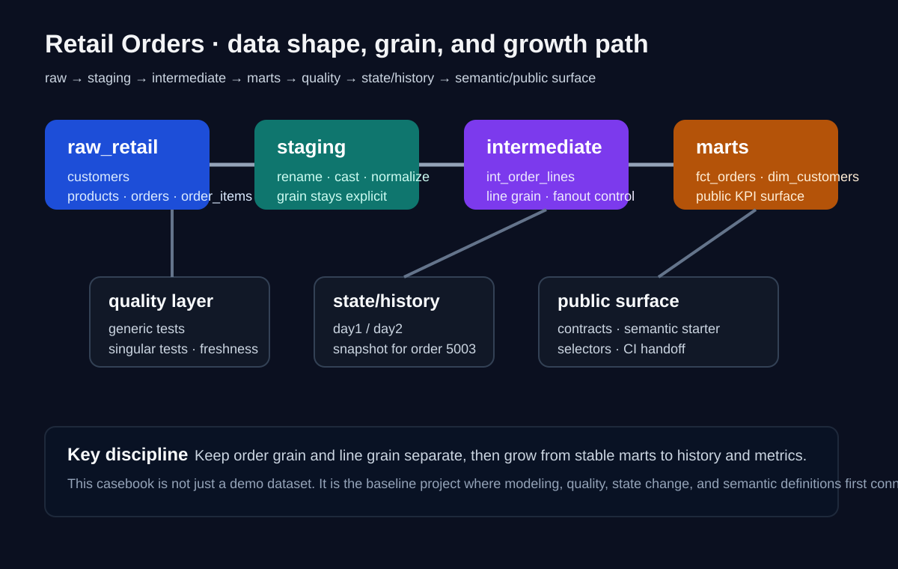

<a id="book-chapters-reference-v3-09-casebook-retail-orders-md--91-왜-retail-orders를-첫-번째-casebook으로-두는가"></a>

### 9.1. 왜 Retail Orders를 첫 번째 Casebook으로 두는가

Retail Orders는 이 책의 세 가지 예제 가운데 가장 먼저 깊게 파고들 가치가 있는 사례다. 이유는 단순하다. 주문, 주문상세, 고객, 상품이라는 네 가지 raw 테이블만으로도 dbt의 핵심 문제를 거의 모두 설명할 수 있기 때문이다.

첫째, grain 설계가 명확하다. 주문 테이블은 order grain이고, 주문상세는 line grain이다. 이 둘의 차이를 모르면 `JOIN` 한 번에 매출이 두 배, 세 배로 부풀 수 있다.
둘째, 상태 변화가 자연스럽다. `placed → paid → shipped → delivered` 같은 주문 상태는 snapshot이나 freshness를 설명하기에 좋다.
셋째, KPI 정의가 풍부하다. 주문 수, 매출, 고객 수, 객단가, 상품 카테고리별 성과 등은 mart와 semantic layer를 연결하기에 적합하다.
넷째, 운영 실습으로도 좋다. day1/day2를 분리해 raw 데이터를 바꾸면 테스트, snapshot, source freshness, slim CI 같은 운영 장치를 왜 써야 하는지 자연스럽게 보인다.

즉, Retail Orders는 "가장 단순한 예제"가 아니라 dbt의 가장 많은 기능을 무리 없이 연결할 수 있는 기본 도메인이다.

<a id="book-chapters-reference-v3-09-casebook-retail-orders-md--92-이-장에서-먼저-잡아야-할-전반-개념"></a>

### 9.2. 이 장에서 먼저 잡아야 할 전반 개념

이 장은 예제 장이지만, 예제를 바로 던지기 전에 먼저 세 가지 큰 관점을 분명히 해 두어야 한다.

<a id="book-chapters-reference-v3-09-casebook-retail-orders-md--921-이-장에서-가장-중요한-설계-질문은-sql-문법이-아니라-grain이다"></a>

#### 9.2.1. 이 장에서 가장 중요한 설계 질문은 SQL 문법이 아니라 grain이다

소매 주문 예제에서 가장 먼저 정해야 할 것은 "이 테이블 한 행이 무엇을 뜻하는가"다.

- `raw_retail.orders` 한 행: 주문 1건
- `raw_retail.order_items` 한 행: 주문 1건 안의 주문 라인 1건
- `stg_orders` 한 행: 주문 1건의 정리된 상태
- `int_order_lines` 한 행: 주문 라인 1건 + 상품 정보
- `fct_orders` 한 행: 주문 1건 기준 집계 결과
- `dim_customers` 한 행: 고객 1명

주문 도메인에서 가장 흔한 사고는 order grain과 line grain을 섞어 쓰는 것이다. 예를 들어 `orders.total_amount`를 `order_items`와 조인한 뒤 그대로 합산하면, 주문 라인 수만큼 금액이 중복된다. 그래서 이 장은 SQL을 보여 줄 때마다 항상 "현재 이 쿼리의 grain이 무엇인가"를 같이 물어보도록 구성한다.

<a id="book-chapters-reference-v3-09-casebook-retail-orders-md--922-day1day2-시나리오를-왜-따로-두는가"></a>

#### 9.2.2. day1/day2 시나리오를 왜 따로 두는가

많은 입문 교재는 정적인 초기 데이터만 보여 주고 끝난다. 하지만 실제 프로젝트는 항상 데이터가 바뀐다. 새 주문이 들어오고, 상태가 바뀌고, 금액이 수정되고, 늦게 도착한 데이터가 끼어든다.

그래서 Retail Orders는 두 단계로 나눈다.

1. day1: 초기 raw 상태를 만들고 기본 모델을 검증하는 단계
2. day2: 주문 상태, 금액, 업데이트 시각을 바꿔서 snapshot·freshness·재실행 판단을 시험하는 단계

이렇게 해야 dbt를 "한 번 모델 만드는 도구"가 아니라 변화하는 데이터를 안정적으로 설명하는 도구로 볼 수 있다.

<a id="book-chapters-reference-v3-09-casebook-retail-orders-md--923-order_id--5003을-끝까지-추적한다"></a>

#### 9.2.3. order_id = 5003을 끝까지 추적한다

이 장에서는 `order_id = 5003`을 공통 추적 대상으로 삼는다.

- day1 raw orders에서 어떤 값으로 시작하는지
- `stg_orders`에서 상태/금액/시각이 어떻게 정리되는지
- `int_order_lines`에서 몇 개의 line으로 풀리는지
- `fct_orders`에서 어떤 metric으로 집계되는지
- day2 적용 후 snapshot에서 어떤 이력 행이 생기는지

예제 전체를 관통하는 하나의 레코드를 정해 두면, 독자는 DAG를 "파일의 숲"이 아니라 하나의 값이 이동하고 변형되는 흐름으로 이해할 수 있다.

<a id="book-chapters-reference-v3-09-casebook-retail-orders-md--93-retail-orders의-raw-도메인과-bootstrap"></a>

### 9.3. Retail Orders의 raw 도메인과 bootstrap

<a id="book-chapters-reference-v3-09-casebook-retail-orders-md--931-raw-테이블은-네-개면-충분하다"></a>

#### 9.3.1. raw 테이블은 네 개면 충분하다

Retail Orders는 다음 네 raw 테이블로 시작한다.

| raw 테이블 | 기본 grain | 핵심 컬럼 | 이 장에서의 역할 |
| --- | --- | --- | --- |
| `customers` | customer 1명 | `customer_id`, `segment`, `country_code` | 고객 차원 기준 |
| `products` | product 1개 | `product_id`, `category_name` | 상품/카테고리 기준 |
| `orders` | order 1건 | `order_id`, `customer_id`, `status`, `total_amount`, `updated_at` | 주문 상태와 매출 기준 |
| `order_items` | order line 1건 | `order_id`, `product_id`, `quantity`, `unit_price` | line grain과 fanout 설명 |

이 네 테이블만 있어도 source → staging → intermediate → mart → tests → snapshot → semantic까지 충분히 확장할 수 있다.

<a id="book-chapters-reference-v3-09-casebook-retail-orders-md--932-day1-bootstrap은-정적인-샘플이-아니라-기준선이다"></a>

#### 9.3.2. day1 bootstrap은 "정적인 샘플"이 아니라 기준선이다

day1 bootstrap의 목적은 단순히 데이터를 넣는 것이 아니다. 앞으로 들어올 모든 논의의 기준선을 만드는 것이다.
특히 아래 세 가지를 의도적으로 포함해야 한다.

- line item이 2개 이상인 주문
- 여러 customer segment를 가진 주문
- 추후 day2에서 상태와 금액을 바꿀 주문 (`5003`)

아래 스니펫은 DuckDB 기준의 최소 bootstrap 예시다. 전체 예시는 별도 코드 파일을 참고하면 된다.

```sql
-- 파일: ../codes/04_chapter_snippets/ch09/retail_bootstrap_day1_duckdb.sql
CREATE SCHEMA IF NOT EXISTS raw_retail;

DROP TABLE IF EXISTS raw_retail.orders;
CREATE TABLE raw_retail.orders (
    order_id INTEGER,
    customer_id INTEGER,
    order_date DATE,
    status VARCHAR,
    total_amount DECIMAL(18,2),
    updated_at TIMESTAMP
);

INSERT INTO raw_retail.orders
(order_id, customer_id, order_date, status, total_amount, updated_at)
VALUES
    (5001, 101, '2026-04-01', 'placed',    120.00, '2026-04-01 09:00:00'),
    (5002, 101, '2026-04-01', 'paid',       90.00, '2026-04-01 10:15:00'),
    (5003, 102, '2026-04-02', 'paid',      210.00, '2026-04-02 08:30:00'),
    (5004, 103, '2026-04-02', 'shipped',   140.00, '2026-04-02 12:00:00');
```

<a id="book-chapters-reference-v3-09-casebook-retail-orders-md--933-day2는-왜-상태와-금액을-동시에-바꾸는가"></a>

#### 9.3.3. day2는 왜 상태와 금액을 동시에 바꾸는가

day2에서는 보통 아래 두 종류의 변화를 준다.

1. 상태 변화
   예: `5003`이 `paid`에서 `shipped`로 바뀐다.
2. 값 변화
   예: `5003`의 `total_amount`가 보정되어 `210.00`에서 `230.00`으로 바뀐다.

이 두 가지가 함께 있어야 snapshot과 data quality의 차이를 동시에 느낄 수 있다.
snapshot은 "무엇이 언제 바뀌었는가"를 저장하고, test는 "지금 이 값이 허용 가능한가"를 검증한다. 둘은 비슷해 보여도 역할이 다르다.

```sql
-- 파일: ../codes/04_chapter_snippets/ch09/retail_apply_day2.sql
UPDATE raw_retail.orders
SET status = 'shipped',
    total_amount = 230.00,
    updated_at = '2026-04-03 09:05:00'
WHERE order_id = 5003;
```

<a id="book-chapters-reference-v3-09-casebook-retail-orders-md--94-source와-staging-raw를-공식-입력으로-바꾸는-단계"></a>

### 9.4. source와 staging: raw를 공식 입력으로 바꾸는 단계

<a id="book-chapters-reference-v3-09-casebook-retail-orders-md--941-source는-단순-경로-별칭이-아니라-프로젝트의-입력-계약이다"></a>

#### 9.4.1. source는 단순 경로 별칭이 아니라 프로젝트의 입력 계약이다

`source()`를 쓰면 스키마·테이블명을 감추는 정도를 넘어서, dbt에게 "이 프로젝트는 이 raw 데이터를 공식 입력으로 사용한다"라고 선언하게 된다.
이 선언은 세 가지 효과를 만든다.

1. lineage에 raw 노드가 나타난다
2. source-level test와 freshness를 붙일 수 있다
3. 환경이 바뀌어도 YAML 한 곳에서 관리할 수 있다

Retail Orders에서는 `orders`와 `order_items`의 grain이 다르기 때문에, source 단계에서부터 이 차이를 설명으로 남겨 두는 것이 중요하다.

```yaml
# 파일: ../codes/04_chapter_snippets/ch09/retail_sources.yml
version: 2

sources:
  - name: raw_retail
    schema: raw_retail
    tables:
      - name: customers
      - name: products
      - name: orders
        loaded_at_field: updated_at
        freshness:
          warn_after: {count: 12, period: hour}
          error_after: {count: 24, period: hour}
      - name: order_items
```

<a id="book-chapters-reference-v3-09-casebook-retail-orders-md--942-stg_orders는-정리만-하고-kpi는-만들지-않는다"></a>

#### 9.4.2. stg_orders는 "정리"만 하고, KPI는 만들지 않는다

`stg_orders`의 목적은 주문을 분석 친화적인 행으로 정리하는 것이다.
이 단계에서 해야 할 일은 아래와 같다.

- 날짜/시간 타입 통일
- 상태값 소문자화
- 금액 캐스팅
- 불필요한 컬럼 제거
- raw naming을 팀 표준으로 정리

반대로 여기서 하지 말아야 할 일은 매출 집계, 객단가 계산, segment-level KPI 산출 같은 최종 분석 로직이다. 그런 계산은 marts에서 해야 재사용성과 테스트 가능성이 좋아진다.

```sql
-- 파일: ../codes/04_chapter_snippets/ch09/stg_orders.sql
with source_data as (
    select *
    from {{ source('raw_retail', 'orders') }}
),
renamed as (
    select
        order_id,
        customer_id,
        cast(order_date as date) as order_date,
        lower(status) as order_status,
        cast(total_amount as numeric) as total_amount,
        cast(updated_at as timestamp) as updated_at
    from source_data
)
select *
from renamed
```

<a id="book-chapters-reference-v3-09-casebook-retail-orders-md--943-5003을-먼저-staging에서-확인하자"></a>

#### 9.4.3. 5003을 먼저 staging에서 확인하자

이 장을 실습할 때는 전체 row count보다 먼저 `5003` 한 건을 보는 편이 좋다.
day1에서는 대략 아래와 같은 값이 보여야 한다.

| 컬럼 | day1 기대값 |
| --- | --- |
| `order_id` | `5003` |
| `customer_id` | `102` |
| `order_status` | `paid` |
| `total_amount` | `210.00` |
| `updated_at` | `2026-04-02 08:30:00` |

day2를 적용한 뒤 다시 같은 row를 보면 `order_status`와 `total_amount`, `updated_at`이 바뀌어 있어야 한다. 이 차이가 이후 snapshot과 freshness의 입력이 된다.

<a id="book-chapters-reference-v3-09-casebook-retail-orders-md--95-intermediate-line-grain을-공식화하고-fanout을-통제하는-단계"></a>

### 9.5. intermediate: line grain을 공식화하고 fanout을 통제하는 단계

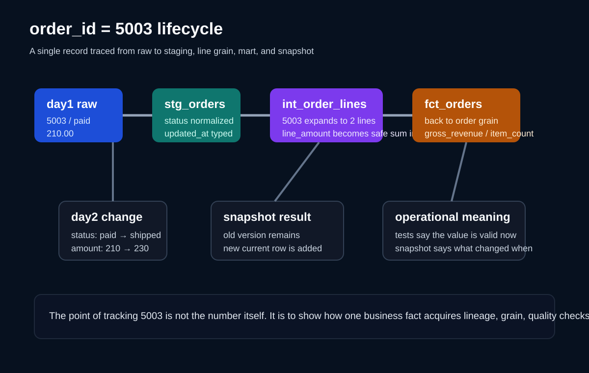

<a id="book-chapters-reference-v3-09-casebook-retail-orders-md--951-int_order_lines가-왜-필요한가"></a>

#### 9.5.1. int_order_lines가 왜 필요한가

초보자는 종종 `orders`와 `order_items`, `products`를 최종 fact 안에서 한 번에 조인하고 싶어 한다. 당장은 빠르지만, 이런 giant SQL은 다음 문제를 만든다.

- 주문 line 로직이 다른 mart에서 재사용되지 못한다
- fanout이 생겨도 어느 단계에서 부풀었는지 찾기 어렵다
- line-level 분석과 order-level 분석을 동시에 설명하기 어렵다

`int_order_lines`는 이 중간 문제를 분리하는 계층이다.
주문상세 1건당 1행이라는 line grain을 먼저 고정해 두면, 그 다음 집계는 의식적으로 mart에서 하게 된다.

```sql
-- 파일: ../codes/04_chapter_snippets/ch09/int_order_lines.sql
with orders as (
    select * from {{ ref('stg_orders') }}
),
items as (
    select * from {{ ref('stg_order_items') }}
),
products as (
    select * from {{ ref('stg_products') }}
)
select
    i.order_id,
    o.customer_id,
    o.order_date,
    p.product_id,
    p.category_name,
    i.quantity,
    i.unit_price,
    i.quantity * i.unit_price as line_amount
from items i
join orders o using (order_id)
join products p using (product_id)
```

<a id="book-chapters-reference-v3-09-casebook-retail-orders-md--952-fanout은-어떻게-확인하는가"></a>

#### 9.5.2. fanout은 어떻게 확인하는가

Retail Orders에서는 다음처럼 확인하면 된다.

1. `stg_orders`에서 `count(*)`를 본다
2. `int_order_lines`에서 같은 `order_id`의 row 수를 본다
3. line grain으로 풀린 row를 다시 order grain으로 집계할 때 어떤 컬럼을 `sum`, `min`, `max` 해야 하는지 결정한다

예를 들어 `order_id = 5003`이 주문 라인 두 개를 가진다면:

- `stg_orders`에서는 1행
- `int_order_lines`에서는 2행
- `fct_orders`에서는 다시 1행

이때 `orders.total_amount`를 line grain에서 그대로 더하면 중복된다.
따라서 `fct_orders`에서는 line에서 새로 계산한 `line_amount`를 합산하거나, order grain 금액을 사용할 때는 line과 독립적으로 관리해야 한다.

<a id="book-chapters-reference-v3-09-casebook-retail-orders-md--953-giant-sql보다-line-grain-모델이-먼저여야-하는-이유"></a>

#### 9.5.3. giant SQL보다 line grain 모델이 먼저여야 하는 이유

`int_order_lines`는 단지 중간 테이블이 아니라, 운영 관점에서도 가치가 있다.

- category별 분석을 새로 붙일 때 재사용된다
- line-level anomaly test를 붙일 수 있다
- ClickHouse처럼 line-level fact가 더 자연스러운 플랫폼에서는 이 모델 자체가 핵심 산출물이 되기도 한다

즉, intermediate는 "중간 단계라서 임시로 존재"하는 것이 아니라 grain을 명시하는 설계 자산이다.

<a id="book-chapters-reference-v3-09-casebook-retail-orders-md--96-marts-주문-단위-kpi를-공식화하는-단계"></a>

### 9.6. marts: 주문 단위 KPI를 공식화하는 단계

<a id="book-chapters-reference-v3-09-casebook-retail-orders-md--961-fct_orders는-order-grain의-공용-사실-테이블이다"></a>

#### 9.6.1. fct_orders는 order grain의 공용 사실 테이블이다

Retail Orders의 대표 mart는 `fct_orders`다.
이 모델은 order grain으로 다시 돌아와 주문 1건당 1행을 만든다. 핵심은 order grain을 유지하면서도 line-level 계산 결과를 안전하게 집계하는 것이다.

```sql
-- 파일: ../codes/04_chapter_snippets/ch09/fct_orders.sql
with lines as (
    select * from {{ ref('int_order_lines') }}
)
select
    order_id,
    customer_id,
    min(order_date) as order_date,
    sum(line_amount) as gross_revenue,
    sum(quantity) as item_count
from lines
group by 1, 2
```

이 모델에서 중요한 질문은 단순히 SQL이 돌아가는가가 아니다.

- `gross_revenue`는 line 합산이 맞는가?
- 취소 주문은 포함할 것인가?
- 무료 샘플 상품은 제외할 것인가?
- order grain에서 유지해야 할 상태 컬럼은 무엇인가?

즉, mart는 기술적 변환 단계이면서 동시에 비즈니스 정의를 공식화하는 계층이다.

<a id="book-chapters-reference-v3-09-casebook-retail-orders-md--962-dim_customers는-왜-지금-같이-두는가"></a>

#### 9.6.2. dim_customers는 왜 지금 같이 두는가

`dim_customers`는 복잡한 모델이 아니어도 꼭 필요하다.
왜냐하면 `fct_orders.customer_id`가 관계를 맺는 상대가 명확해져야 relationships test, semantic entity, downstream BI join이 모두 자연스러워지기 때문이다.

또 customer segment가 향후 semantic dimension이나 metric slicing의 기준이 되기 때문에, Retail Orders 예제에서는 dimension도 일찍 갖춰 두는 편이 좋다.

<a id="book-chapters-reference-v3-09-casebook-retail-orders-md--97-테스트와-품질-모델이-돌아간다에서-설명할-수-있다로"></a>

### 9.7. 테스트와 품질: "모델이 돌아간다"에서 "설명할 수 있다"로

<a id="book-chapters-reference-v3-09-casebook-retail-orders-md--971-generic-test는-최소-안전망이다"></a>

#### 9.7.1. generic test는 최소 안전망이다

Retail Orders에서 가장 먼저 붙일 test는 아래와 같다.

- `fct_orders.order_id`: `not_null`, `unique`
- `fct_orders.customer_id`: `relationships(to=dim_customers)`
- `stg_orders.order_status`: 허용 상태 범위 확인

```yaml
# 파일: ../codes/04_chapter_snippets/ch09/retail_tests.yml
version: 2

models:
  - name: fct_orders
    columns:
      - name: order_id
        data_tests:
          - not_null
          - unique
      - name: customer_id
        data_tests:
          - relationships:
              to: ref('dim_customers')
              field: customer_id

tests:
  - name: retail_no_negative_revenue
    config:
      severity: error
```

<a id="book-chapters-reference-v3-09-casebook-retail-orders-md--972-singular-test는-kpi의-상식을-문서화한다"></a>

#### 9.7.2. singular test는 KPI의 상식을 문서화한다

Retail Orders에서 singular test로 가장 쉬운 것은 "gross revenue는 음수가 아니어야 한다" 같은 규칙이다.

```sql
-- 파일: ../codes/04_chapter_snippets/ch09/retail_no_negative_revenue.sql
select *
from {{ ref('fct_orders') }}
where gross_revenue < 0
```

이 테스트는 복잡하지 않지만 중요하다. 왜냐하면 line_amount 계산이나 조인 조건이 무너졌을 때, 겉보기에 row 수는 맞아도 KPI가 비정상적으로 깨질 수 있기 때문이다.

<a id="book-chapters-reference-v3-09-casebook-retail-orders-md--973-source-freshness는-test와-다르다"></a>

#### 9.7.3. source freshness는 test와 다르다

Retail Orders의 `orders` source는 `updated_at`을 freshness 기준으로 삼기에 좋다.
여기서 중요한 점은 freshness가 "데이터의 값이 올바른가"를 보는 것이 아니라, 데이터가 충분히 최근인가를 보는 장치라는 것이다.

즉,

- test = 값의 성질 검증
- freshness = 도착 시점과 최신성 검증

실무에서는 두 가지를 같이 써야 한다.
또 운영 관점에서는 `dbt build`와 별도로 `dbt source freshness`를 돌려 `sources.json`과 문서/모니터링에 연결하는 것이 자연스럽다.

<a id="book-chapters-reference-v3-09-casebook-retail-orders-md--98-snapshot-5003의-상태-변화가-이력으로-남는-순간"></a>

### 9.8. snapshot: 5003의 상태 변화가 이력으로 남는 순간

<a id="book-chapters-reference-v3-09-casebook-retail-orders-md--981-snapshot을-왜-이-예제에-붙이는가"></a>

#### 9.8.1. snapshot을 왜 이 예제에 붙이는가

Retail Orders의 day2는 snapshot을 설명하기에 이상적이다.
`5003`의 `status`와 `total_amount`, `updated_at`이 변하면, snapshot은 "현재 row만 덮어쓴 결과"가 아니라 이전 상태와 현재 상태가 모두 남은 이력 테이블을 만든다.

즉, day2 이후에는 아래를 동시에 질문할 수 있다.

- 지금 5003은 어떤 상태인가?
- 5003은 어제 어떤 상태였는가?
- 금액 보정이 언제 일어났는가?

이 차이가 snapshot의 핵심 가치다.

<a id="book-chapters-reference-v3-09-casebook-retail-orders-md--982-snapshot에는-어떤-컬럼을-감시할-것인가"></a>

#### 9.8.2. snapshot에는 어떤 컬럼을 감시할 것인가

Retail Orders에서는 보통 다음 둘 중 하나로 시작한다.

1. `check_cols=['order_status', 'total_amount']`
2. `updated_at='updated_at'` 기반 timestamp 전략

입문 실습에서는 check strategy가 직관적이지만, 운영 환경에서는 source가 신뢰 가능한 `updated_at`을 준다면 timestamp 전략이 더 단순한 경우도 많다.

```sql
-- 파일: ../codes/04_chapter_snippets/ch09/orders_snapshot.sql

{{
  config(
    target_schema='snapshots',
    unique_key='order_id',
    strategy='check',
    check_cols=['order_status', 'total_amount', 'updated_at']
  )
}}
select * from {{ ref('stg_orders') }}

```

<a id="book-chapters-reference-v3-09-casebook-retail-orders-md--99-contracts와-semantic-starter-공용-api로-키우는-단계"></a>

### 9.9. Contracts와 Semantic starter: 공용 API로 키우는 단계

<a id="book-chapters-reference-v3-09-casebook-retail-orders-md--991-contract는-shape를-고정하는-약속이다"></a>

#### 9.9.1. contract는 "shape를 고정하는 약속"이다

Retail Orders가 개인 실습을 넘어서 팀 공용 모델이 되려면, `fct_orders`의 컬럼 집합과 데이터 타입이 너무 쉽게 바뀌면 안 된다.
contract는 바로 이 지점을 다룬다. 테스트가 "데이터가 기대와 맞는가"를 보는 동안, contract는 "이 모델이 약속한 모양으로 실제로 생성되는가"를 본다.

이 장에서는 contract를 full production spec으로 다루기보다는, "공용 mart를 만들기 시작할 때 shape를 고정하는 최소 선언"으로 설명한다.

```yaml
# 파일: ../codes/04_chapter_snippets/ch09/fct_orders_contract.yml
version: 2

models:
  - name: fct_orders
    config:
      contract:
        enforced: true
    columns:
      - name: order_id
        data_type: integer
      - name: customer_id
        data_type: integer
      - name: order_date
        data_type: date
      - name: gross_revenue
        data_type: numeric
      - name: item_count
        data_type: integer
```

<a id="book-chapters-reference-v3-09-casebook-retail-orders-md--992-semantic-starter는-mart-위에-의미-계층을-올리는-첫-단계다"></a>

#### 9.9.2. semantic starter는 mart 위에 의미 계층을 올리는 첫 단계다

Retail Orders는 semantic layer의 첫 실습 대상으로도 좋다.
이유는 `order_id`, `customer_id`, `order_date`, `gross_revenue` 같은 요소가 직관적이기 때문이다.

- entity: `order`, `customer`
- time dimension: `order_date`
- measure: `gross_revenue`, `item_count`
- downstream metric: `revenue`, `order_count`

아래 YAML은 starter 수준의 예시다.
현재 환경이 최신 semantic spec을 쓰는지, legacy metric spec을 쓰는지는 프로젝트 버전에 따라 다를 수 있으므로, 이 책에서는 개념과 설계 포인트를 먼저 이해하는 데 초점을 둔다.

```yaml
# 파일: ../codes/04_chapter_snippets/ch09/orders_semantic_starter.yml
semantic_models:
  - name: orders_semantic
    model: ref('fct_orders')
    defaults:
      agg_time_dimension: order_date
    entities:
      - name: order
        type: primary
        expr: order_id
      - name: customer
        type: foreign
        expr: customer_id
    dimensions:
      - name: order_date
        type: time
        type_params:
          time_granularity: day
    measures:
      - name: gross_revenue
        agg: sum
        expr: gross_revenue
      - name: order_count
        agg: count
        expr: order_id
```

<a id="book-chapters-reference-v3-09-casebook-retail-orders-md--910-운영-루틴-retail-orders를-실제-프로젝트처럼-돌리기"></a>

### 9.10. 운영 루틴: Retail Orders를 실제 프로젝트처럼 돌리기

<a id="book-chapters-reference-v3-09-casebook-retail-orders-md--9101-가장-짧은-day1day2-실습-루틴"></a>

#### 9.10.1. 가장 짧은 day1/day2 실습 루틴

아래 순서가 Retail Orders의 최소 루틴이다.

```bash
# 파일: ../codes/04_chapter_snippets/ch09/retail_runbook.sh

# 1) day1 raw bootstrap
duckdb retail_lab.duckdb < retail_bootstrap_day1_duckdb.sql

# 2) 기본 모델 + 테스트
dbt build --select retail_orders

# 3) order_id=5003 확인
dbt show --select fct_orders --inline "select * from {{ ref('fct_orders') }} where order_id = 5003"

# 4) day2 raw 변화 적용
duckdb retail_lab.duckdb < retail_apply_day2.sql

# 5) source freshness + snapshot
dbt source freshness --select source:raw_retail.orders
dbt snapshot --select orders_snapshot

# 6) 변경 범위만 재검증
dbt build --select +fct_orders
```

<a id="book-chapters-reference-v3-09-casebook-retail-orders-md--9102-ci에서는-무엇을-최소로-검증할까"></a>

#### 9.10.2. CI에서는 무엇을 최소로 검증할까

Retail Orders가 PR 검증의 기준 예제가 된다면, 아래 정도가 현실적이다.

- `+fct_orders` 범위 build
- 핵심 tests
- snapshot 관련 YAML/SQL 변경 시 snapshot parse 검증
- semantic starter 변경 시 semantic validation 또는 YAML parse 검증

처음부터 모든 걸 CI에 넣으면 느려진다.
Casebook의 목적은 "무엇이 필수이고 무엇이 후순위인지"를 실제 예제로 감각화하는 데 있다.

<a id="book-chapters-reference-v3-09-casebook-retail-orders-md--9103-이-예제에서-자주-터지는-실패"></a>

#### 9.10.3. 이 예제에서 자주 터지는 실패

Retail Orders에서 자주 보는 실패는 아래와 같다.

1. `order_items` 조인 후 gross revenue 중복 집계
2. `relationships` 실패 (`customer_id`가 `dim_customers`에 없음)
3. snapshot이 기대보다 많은 row를 만들어 "중복처럼" 보이는 현상
4. freshness가 늦어졌는데 테스트는 모두 통과하는 상황
5. contract를 켠 뒤 컬럼 타입이 바뀌어 build 자체가 멈추는 상황

즉, 이 예제는 "모델이 돌아가는 행복한 경로"보다도 dbt가 프로젝트를 안정화하는 이유를 보여 주는 쪽에 더 큰 가치가 있다.

<a id="book-chapters-reference-v3-09-casebook-retail-orders-md--911-플랫폼으로-옮길-때-무엇이-달라지는가"></a>

### 9.11. 플랫폼으로 옮길 때 무엇이 달라지는가

이 장은 Retail Orders 예제 자체에 집중하므로 플랫폼별 차이를 길게 반복하지는 않는다. 다만 실제로 옮길 때는 다음을 먼저 떠올리면 된다.

- DuckDB / PostgreSQL: 구조를 거의 그대로 옮기기 쉽다
- BigQuery: partition / clustering과 scan cost를 같이 본다
- Snowflake: warehouse 크기, grants, role이 운영 루틴에 더 크게 들어온다
- ClickHouse: line-level fact를 더 오래 유지하는 전략이 강력할 수 있다
- Trino: catalog/schema naming, external table 위치, Iceberg/Hive 특성을 함께 본다
- NoSQL + SQL Layer: raw를 어디에서 읽고 결과를 어느 catalog에 남길지 먼저 정해야 한다

즉, Casebook은 "무엇을 만들 것인가"를 설명하고, Platform Playbook은 "어디서 어떻게 실행할 것인가"를 설명한다.

<a id="book-chapters-reference-v3-09-casebook-retail-orders-md--912-직접-해보기와-체크리스트"></a>

### 9.12. 직접 해보기와 체크리스트

<a id="book-chapters-reference-v3-09-casebook-retail-orders-md--9121-직접-해보기"></a>

#### 9.12.1. 직접 해보기

1. day1 bootstrap 후 `stg_orders`에서 `5003`을 확인하라
2. `int_order_lines`에서 `5003`이 몇 개의 line으로 풀리는지 확인하라
3. `fct_orders`에서 `gross_revenue`와 `item_count`를 계산하라
4. day2를 적용한 뒤 `stg_orders`와 snapshot의 차이를 비교하라
5. `gross_revenue < 0` singular test를 일부러 실패하게 만들어 보라
6. `fct_orders` contract에 컬럼 하나를 더 넣어 build 실패를 재현해 보라

<a id="book-chapters-reference-v3-09-casebook-retail-orders-md--9122-이-장을-마치고-할-수-있어야-하는-것"></a>

#### 9.12.2. 이 장을 마치고 할 수 있어야 하는 것

- Retail Orders의 raw → staging → intermediate → mart 흐름을 설명할 수 있다
- order grain과 line grain을 구분하고 fanout 위험을 설명할 수 있다
- `5003`의 day1/day2 변화를 source, mart, snapshot에서 각각 확인할 수 있다
- generic test와 singular test, freshness, snapshot의 역할 차이를 설명할 수 있다
- `fct_orders`를 contract와 semantic starter로 공용 API처럼 키우는 방향을 설명할 수 있다

<a id="book-chapters-reference-v3-09-casebook-retail-orders-md--9123-다음-장과의-연결"></a>

#### 9.12.3. 다음 장과의 연결

다음 Chapter 10의 Event Stream은 이 장과 반대로 append-heavy, time-series, late-arriving data, incremental 전략이 중심이 된다.
Retail Orders가 상태 변화와 grain 분리를 통해 dbt의 기본 구조를 보여 준다면, Event Stream은 규모와 시간축이 커질 때 dbt가 어떻게 달라지는지를 보여 준다.

---

<a id="book-chapters-reference-v3-10-casebook-event-stream-md"></a>

장별 원고: [chapters/reference-v3/10-casebook-event-stream.md](chapters/reference-v3/10-casebook-event-stream.md)

<a id="book-chapters-reference-v3-10-casebook-event-stream-md--chapter-10--casebook-ii--event-stream"></a>

## CHAPTER 10 · Casebook II · Event Stream

> **마당마켓 본편 연결:** [J07 · 지난 날짜의 주문이 오늘 도착했다](#book-journey-07-late-data-md)에서 같은 상점의 누적 실습으로 돌아갈 수 있다. 이 참고편의 `codes/` 스니펫에는 독립 fixture가 포함되어 있으며 본편 `lab/`의 P1~P5와 섞지 않는다. 플랫폼별 구문·기능은 실행 버전에 맞춰 재확인한다.


> append-only 이벤트 데이터를 event grain → session grain → daily grain으로 확장하면서
> incremental, late-arriving data, source freshness, semantic-ready 설계를 실제로 체험하는 장이다.
> 이 장은 기능 목록을 나열하지 않는다. 먼저 이벤트 도메인의 전반 구조를 충분히 설명하고,
> 그 다음에 우리 예제 안에서 그 구조가 어떻게 구체적인 모델과 운영 루틴으로 바뀌는지 따라간다.

Event Stream 예제는 `Retail Orders`와 성격이 다르다.
주문 데이터는 비교적 명확한 주문 단위와 금액 집계가 중심이었다면, 이벤트 데이터는 다음 특성이 앞에 나온다.

1. 이벤트는 보통 append-only로 계속 쌓인다.
2. 질문의 grain이 자주 바뀐다.
   이벤트 자체를 보고 싶을 때도 있고, 세션으로 묶고 싶을 때도 있고, 날짜 단위 활성 사용자(DAU)처럼 다시 집계하고 싶을 때도 있다.
3. late-arriving data가 흔하다.
   실제 이벤트 발생 시각(`event_at`)과 웨어하우스에 들어온 시각(`event_ingested_at`)이 다를 수 있다.
4. 전체 재계산이 금방 비싸진다.
   그래서 incremental, backfill window, state-aware run 같은 운영 장치가 빠르게 필요해진다.
5. 반복 질문이 많다.
   sessions, DAU, platform별 active users, cohort/retention 류의 질문이 계속 반복되므로 semantic-ready 설계가 일찍부터 가치가 생긴다.

이 장의 목표는 단순히 이벤트 테이블을 하나 더 만드는 것이 아니다.
이벤트 도메인에서 왜 grain을 분리해야 하는지, 왜 incremental을 서둘러 쓰면 안 되면서도 결국 필요해지는지,
왜 source freshness와 semantic layer가 붙기 좋은지를 하나의 사례 안에서 끝까지 보는 것이다.


<a id="book-chapters-reference-v3-10-casebook-event-stream-md--101-이-예제에서-무엇을-만들-것인가"></a>

### 10.1. 이 예제에서 무엇을 만들 것인가

이 장에서 우리가 만드는 핵심 리소스는 다음 네 덩어리다.

<a id="book-chapters-reference-v3-10-casebook-event-stream-md--1011-raw-source"></a>

#### 10.1.1. raw source
- `raw_events.users`
- `raw_events.events`

<a id="book-chapters-reference-v3-10-casebook-event-stream-md--1012-staging"></a>

#### 10.1.2. staging
- `stg_events`
- `stg_users`

<a id="book-chapters-reference-v3-10-casebook-event-stream-md--1013-marts"></a>

#### 10.1.3. marts
- `fct_sessions`
- `fct_daily_active_users`

<a id="book-chapters-reference-v3-10-casebook-event-stream-md--1014-semantic-ready-surface"></a>

#### 10.1.4. semantic-ready surface
- session count
- daily active users
- platform / country 기준 반복 질의

이 구조는 “작은 예제라서 단순하게 만든 것”이 아니다.
오히려 이벤트 도메인에서는 이렇게 나누지 않으면 곧바로 giant SQL이 되고,
session 질문과 DAU 질문이 서로 섞이면서 fanout이나 잘못된 집계가 생기기 쉽다.

<a id="book-chapters-reference-v3-10-casebook-event-stream-md--102-day1--day2-시나리오를-먼저-이해하자"></a>

### 10.2. day1 / day2 시나리오를 먼저 이해하자

이 예제는 정적인 샘플 하나로 끝나지 않는다.
day1과 day2 두 상태를 일부러 분리해 두었다.

<a id="book-chapters-reference-v3-10-casebook-event-stream-md--1021-day1"></a>

#### 10.2.1. day1
day1에는 안정된 초기 상태만 있다.

- 사용자 3명
- 이벤트 7건
- session 3개
- DAU는 2026-04-01과 2026-04-02 두 날짜만 계산됨

<a id="book-chapters-reference-v3-10-casebook-event-stream-md--1022-day2"></a>

#### 10.2.2. day2
day2에는 두 종류의 변화가 들어온다.

1. 정상적인 신규 이벤트
   - 2026-04-03의 새 사용자/새 세션/새 이벤트

2. 늦게 도착한 이벤트
   - 실제 `event_at`는 2026-04-01인데
     `event_ingested_at`는 2026-04-03인 레코드
   - 즉, 현재 날짜 파티션만 새로 보면 놓치게 되는 이벤트

이 late-arriving data가 왜 중요한지 이해해야 incremental의 의미가 분명해진다.
이벤트 도메인에서 증분 모델이 어려운 이유는 “새 행만 보면 된다”가 아니라
“과거 파티션이 다시 바뀔 수 있다”가 자주 사실이기 때문이다.

<a id="book-chapters-reference-v3-10-casebook-event-stream-md--1023-이-장에서-끝까지-추적할-질문"></a>

#### 10.2.3. 이 장에서 끝까지 추적할 질문

이 장은 다음 질문을 계속 추적한다.

1. day1 기준 DAU는 얼마인가?
2. day2 적용 후 DAU는 어떻게 바뀌는가?
3. late-arriving event를 놓치지 않으려면 어떤 backfill window가 필요한가?
4. session grain과 daily grain은 왜 따로 계산해야 하는가?
5. 어떤 시점부터 semantic metric으로 올리는 것이 자연스러운가?

<a id="book-chapters-reference-v3-10-casebook-event-stream-md--103-이벤트-도메인에서-가장-먼저-잡아야-할-전반-구조"></a>

### 10.3. 이벤트 도메인에서 가장 먼저 잡아야 할 전반 구조

<a id="book-chapters-reference-v3-10-casebook-event-stream-md--1031-event-grain은-기본-층이다"></a>

#### 10.3.1. event grain은 기본 층이다
이벤트 원본의 가장 작은 단위는 보통 event grain이다.
한 행이 한 이벤트를 뜻하고, `event_id`, `user_id`, `event_at`, `event_name`, `platform`, `session_id` 같은 컬럼이 붙는다.

이때 가장 흔한 실수는 이벤트 원본에서 바로 DAU나 sessions를 만들어 버리는 것이다.
그렇게 하면 쿼리는 빨리 나와도, 질문이 하나만 바뀌어도 다시 원본에서 큰 집계를 반복해야 한다.

<a id="book-chapters-reference-v3-10-casebook-event-stream-md--1032-session-grain은-첫-번째-재사용-계층이다"></a>

#### 10.3.2. session grain은 첫 번째 재사용 계층이다
세션은 이벤트를 묶어 사용자 행동 흐름을 보는 grain이다.
한 세션 안에는 여러 이벤트가 들어갈 수 있다.

- session start
- session end
- event count
- user id
- platform

이 grain은 세션 길이, 전환 수, 사용자 세션 수 같은 질문의 출발점이 된다.

<a id="book-chapters-reference-v3-10-casebook-event-stream-md--1033-daily-grain은-질문용-집계-계층이다"></a>

#### 10.3.3. daily grain은 질문용 집계 계층이다
DAU는 세션 grain과 다르다.
하루 안에 사용자 한 명이 이벤트를 20번 발생시켜도 active user는 1명이다.

즉, DAU는 `event grain`도 아니고 `session grain`도 아니다.
daily grain으로 다시 묶은 별도 집계 계층이다.


<a id="book-chapters-reference-v3-10-casebook-event-stream-md--1034-fanout이-왜-여기서-특히-위험한가"></a>

#### 10.3.4. fanout이 왜 여기서 특히 위험한가
이벤트 도메인에서는 raw events 행 수가 가장 많고, session이나 user dimension과 조인이 매우 자주 발생한다.
이때 잘못된 순서로 조인하고 다시 집계하면 다음 문제가 생긴다.

- 세션 수가 이벤트 수만큼 부풀려짐
- 사용자 수가 이벤트 수 기준으로 중복 집계됨
- 기간별 비용 계산이 실제보다 커짐

그래서 이 장에서는 다음 원칙을 고정한다.

1. staging에서는 event grain을 보존한다.
2. session 질문은 `fct_sessions`에서 푼다.
3. DAU 질문은 `fct_daily_active_users`에서 푼다.
4. 서로 다른 grain을 한 모델에서 한 번에 해결하려 하지 않는다.

<a id="book-chapters-reference-v3-10-casebook-event-stream-md--104-source와-freshness는-왜-이-예제에서-더-중요해지는가"></a>

### 10.4. source와 freshness는 왜 이 예제에서 더 중요해지는가

이벤트 예제에서는 source freshness가 단순한 부가 기능이 아니다.
이유는 명확하다. 이벤트 데이터는 자주 들어오고, 지연 적재도 흔하기 때문이다.
따라서 “모델이 잘 만들어졌는가”만큼이나 “소스가 제때 들어오고 있는가”를 확인해야 한다.

이 장에서는 `raw_events.events`에 freshness를 붙인다.

- `loaded_at_field = event_ingested_at`
- `warn_after = 6 hours`
- `error_after = 24 hours`

핵심은 `event_at`가 아니라 `event_ingested_at`를 freshness 기준으로 본다는 점이다.
실제 발생 시각은 과거일 수 있지만, warehouse로 들어온 시각은 지금이기 때문이다.
이 구분을 놓치면 늦게 도착한 데이터가 “낡은 데이터”처럼 오해될 수 있다.

<a id="book-chapters-reference-v3-10-casebook-event-stream-md--1041-왜-sourcesyml이-중요한가"></a>

#### 10.4.1. 왜 `sources.yml`이 중요한가
이벤트 도메인에서 테이블명을 직접 쓰면 당장은 빠르다.
하지만 다음 순간부터 문제가 생긴다.

- `raw_events.events`가 다른 catalog/schema로 바뀌면 모델을 다 찾아서 수정해야 한다.
- docs lineage에 source node가 보이지 않는다.
- freshness를 테이블 단위로 붙이기 어렵다.
- selector에서 `source:raw_events.events+` 같은 흐름을 쓰기 어렵다.

따라서 이 장에서는 source를 먼저 선언하고 그 위에서 modeling을 시작한다.

코드:
- [`events_sources.yml`](codes/04_chapter_snippets/ch10/events_sources.yml)

<a id="book-chapters-reference-v3-10-casebook-event-stream-md--1042-이-장에서-실제로-확인할-명령"></a>

#### 10.4.2. 이 장에서 실제로 확인할 명령
```bash
dbt source freshness --select source:raw_events.events
dbt build --select source:raw_events.events+
```

`dbt source freshness`를 돌리면 `target/sources.json`이 생성된다.
이 artifact는 이후 state-aware selector와 문제 분석에도 쓸 수 있다.
이 예제는 data modeling 장이지만, 동시에 운영 감각을 같이 익히는 casebook이어야 한다.

<a id="book-chapters-reference-v3-10-casebook-event-stream-md--105-staging-이벤트를-질문-가능한-형태로-표준화하기"></a>

### 10.5. staging: 이벤트를 질문 가능한 형태로 표준화하기

staging의 목표는 작다.
이벤트 원본을 질문 가능한 표준 형태로 만들 뿐이다.

이 장의 `stg_events`에서는 다음만 한다.

1. `event_at`와 `event_ingested_at`를 timestamp로 정리
2. `event_date` 파생
3. `event_name`, `platform` 문자열 표준화
4. `session_id`가 비어 있으면 안전한 대체 로직 적용
5. downstream에서 반복 사용할 컬럼만 남김

이 단계에서 session 집계나 DAU 집계를 하지 않는 이유는 명확하다.
이 두 질문은 서로 다른 grain을 요구하기 때문이다.

코드:
- [`stg_events.sql`](codes/04_chapter_snippets/ch10/stg_events.sql)
- [`events_properties.yml`](codes/04_chapter_snippets/ch10/events_properties.yml)

<a id="book-chapters-reference-v3-10-casebook-event-stream-md--1051-staging에서-꼭-붙일-테스트"></a>

#### 10.5.1. staging에서 꼭 붙일 테스트
이벤트 도메인에서 최소한 다음 테스트는 빠지면 안 된다.

- `event_id`: `not_null`, `unique`
- `user_id`: `not_null`
- `event_name`: `accepted_values`
- `platform`: `accepted_values`

추가로 singular test를 하나 두는 것도 좋다.
예를 들면 “`event_ingested_at`가 `event_at`보다 너무 과거일 수는 없다” 같은 규칙이다.

코드:
- [`assert_event_time_not_future.sql`](codes/04_chapter_snippets/ch10/assert_event_time_not_future.sql)

<a id="book-chapters-reference-v3-10-casebook-event-stream-md--106-marts-session-grain과-daily-grain을-따로-만든다"></a>

### 10.6. marts: session grain과 daily grain을 따로 만든다

<a id="book-chapters-reference-v3-10-casebook-event-stream-md--1061-fct_sessions"></a>

#### 10.6.1. `fct_sessions`
이 모델은 session grain을 만든다.

한 세션당 한 행이 나오고, 다음 질문을 받기 쉽게 만든다.

- 세션 길이
- 세션당 이벤트 수
- 사용자별 세션 수
- platform별 세션 수

코드:
- [`fct_sessions.sql`](codes/04_chapter_snippets/ch10/fct_sessions.sql)

<a id="book-chapters-reference-v3-10-casebook-event-stream-md--1062-fct_daily_active_users"></a>

#### 10.6.2. `fct_daily_active_users`
이 모델은 날짜 grain을 만든다.

한 날짜당 한 행이 나오고, DAU와 같은 반복 질문의 기초가 된다.
여기서는 `count(distinct user_id)`가 핵심이다.

중요한 점은 이 모델이 incremental이라는 점이다.
이벤트가 계속 들어오고, 날짜 집계는 매일 다시 계산되기 때문이다.

코드:
- [`fct_daily_active_users.sql`](codes/04_chapter_snippets/ch10/fct_daily_active_users.sql)

<a id="book-chapters-reference-v3-10-casebook-event-stream-md--1063-왜-두-모델을-합치지-않는가"></a>

#### 10.6.3. 왜 두 모델을 합치지 않는가
둘 다 events에서 시작하니 한 모델에 넣고 싶어질 수 있다.
하지만 그렇게 하면 질문과 grain이 섞인다.

- session 수를 보고 싶은가?
- active user 수를 보고 싶은가?
- platform/session 조합을 보고 싶은가?
- 날짜별 추세를 보고 싶은가?

이 질문들은 모두 다르다.
그래서 이 장은 “한 raw → 여러 mart” 구조를 일부러 드러낸다.

<a id="book-chapters-reference-v3-10-casebook-event-stream-md--107-incremental-lookback-late-arriving-data"></a>

### 10.7. incremental, lookback, late-arriving data

Event Stream 예제의 핵심은 여기다.
주문 예제에서는 incremental이 성능 최적화의 성격이 강했다면,
이벤트 예제에서는 incremental이 거의 기본 설계 요소가 된다.

<a id="book-chapters-reference-v3-10-casebook-event-stream-md--1071-왜-전체-재계산이-금방-비싸지는가"></a>

#### 10.7.1. 왜 전체 재계산이 금방 비싸지는가
이벤트는 매일 늘어난다.
전체 raw events를 매일 다시 읽어서 daily aggregate를 만들면 처음엔 괜찮아 보여도 곧 비용과 시간이 커진다.

<a id="book-chapters-reference-v3-10-casebook-event-stream-md--1072-그렇다고-새-날짜만-보면-안-되는-이유"></a>

#### 10.7.2. 그렇다고 새 날짜만 보면 안 되는 이유
late-arriving event 때문이다.
day2에 들어온 레코드가 실제로는 day1 날짜에 속할 수 있다.
즉, 가장 최근 날짜만 다시 계산하면 과거 날짜 집계가 틀릴 수 있다.

이 예제에서는 일부러 이런 상황을 만든다.

- `event_at = 2026-04-01 23:50:00`
- `event_ingested_at = 2026-04-03 09:40:00`

이벤트는 4월 1일 활동으로 집계돼야 하지만, 웨어하우스에는 4월 3일에 들어왔다.
그래서 DAU를 올바르게 계산하려면 최근 파티션 몇 개를 함께 다시 봐야 한다.


<a id="book-chapters-reference-v3-10-casebook-event-stream-md--1073-이-장의-기본-전략-lookback-2-days"></a>

#### 10.7.3. 이 장의 기본 전략: lookback 2 days
이 장의 canonical runnable path는 DuckDB 기준으로 `lookback 2 days`를 사용한다.
즉, `max(event_date)`만 다시 보는 것이 아니라 그 이전 2일까지 함께 다시 읽는다.

이 방식은 다음 장점이 있다.

- late-arriving correction을 흡수할 수 있다.
- microbatch를 도입하기 전에도 충분히 단순하다.
- 코드를 읽는 초보자가 incremental의 의미를 이해하기 쉽다.

<a id="book-chapters-reference-v3-10-casebook-event-stream-md--1074-microbatch는-언제-고려하는가"></a>

#### 10.7.4. microbatch는 언제 고려하는가
microbatch는 time-series 데이터에서 큰 테이블을 batch 단위로 처리하는 전략이다.
이 장에서는 개념을 소개하고 예시 파일을 함께 주지만, 첫 runnable path의 기본값으로 강요하지는 않는다.

왜냐하면 먼저 명확해야 하는 것이 따로 있기 때문이다.

1. event grain이 안정적인가
2. late-arriving window가 정의되었는가
3. `event_time` 컬럼이 분명한가
4. batch 순서를 병렬로 돌려도 되는가

코드:
- [`fct_events_microbatch.sql`](codes/04_chapter_snippets/ch10/fct_events_microbatch.sql)

<a id="book-chapters-reference-v3-10-casebook-event-stream-md--1075-concurrent_batchesfalse가-필요한-경우"></a>

#### 10.7.5. `concurrent_batches=false`가 필요한 경우
누적 계산이나 batch 순서에 민감한 로직은 병렬 batch 실행이 오히려 위험할 수 있다.
세션화 자체는 보통 upstream 정렬 로직과 window 정의가 더 중요하지만,
cumulative metric이나 ordering-sensitive logic이 섞이면 `concurrent_batches=false`를 고려해야 한다.

<a id="book-chapters-reference-v3-10-casebook-event-stream-md--108-이-예제를-semantic-ready-surface로-키우는-법"></a>

### 10.8. 이 예제를 semantic-ready surface로 키우는 법

이벤트 도메인은 semantic layer의 가치가 빨리 드러나는 쪽이다.
세션 수, DAU, platform별 active users, country별 sessions 같은 질문이 반복되기 때문이다.

여기서 중요한 점은 semantic layer가 marts를 대체하는 것이 아니라는 점이다.
오히려 잘 만든 marts가 있어야 semantic model이 깔끔해진다.

<a id="book-chapters-reference-v3-10-casebook-event-stream-md--1081-먼저-공용-fact를-안정화한다"></a>

#### 10.8.1. 먼저 공용 fact를 안정화한다
이 장에서는 다음 두 개를 semantic-ready surface의 출발점으로 본다.

- `fct_sessions`
- `fct_daily_active_users`

<a id="book-chapters-reference-v3-10-casebook-event-stream-md--1082-그-다음-semantic-model과-metric을-붙인다"></a>

#### 10.8.2. 그 다음 semantic model과 metric을 붙인다
가장 먼저 붙이기 좋은 metric은 다음 두 개다.

- total sessions
- daily active users

코드:
- [`event_metrics.yml`](codes/04_chapter_snippets/ch10/event_metrics.yml)

<a id="book-chapters-reference-v3-10-casebook-event-stream-md--1083-saved-query는-언제-가치가-커지는가"></a>

#### 10.8.3. saved query는 언제 가치가 커지는가
아래 질문이 반복되기 시작하면 saved query가 바로 가치가 생긴다.

- 일자별 sessions
- 일자 × platform별 sessions
- 일자별 DAU
- 국가별 active users 추세

코드:
- [`saved_queries.yml`](codes/04_chapter_snippets/ch10/saved_queries.yml)

<a id="book-chapters-reference-v3-10-casebook-event-stream-md--109-day1--day2를-실제로-어떻게-시험할-것인가"></a>

### 10.9. day1 / day2를 실제로 어떻게 시험할 것인가

<a id="book-chapters-reference-v3-10-casebook-event-stream-md--1091-day1-루틴"></a>

#### 10.9.1. day1 루틴
1. bootstrap SQL 실행
2. `dbt source freshness --select source:raw_events.events`
3. `dbt build --select events`
4. `dbt show --select fct_daily_active_users`
5. expected CSV와 비교

코드:
- [`day1_bootstrap_excerpt.sql`](codes/04_chapter_snippets/ch10/day1_bootstrap_excerpt.sql)
- [`runbook_event_stream.sh`](codes/04_chapter_snippets/ch10/runbook_event_stream.sh)
- [`expected_dau_day1.csv`](codes/04_chapter_snippets/ch10/expected_dau_day1.csv)

<a id="book-chapters-reference-v3-10-casebook-event-stream-md--1092-day2-루틴"></a>

#### 10.9.2. day2 루틴
1. day2 SQL 적용
2. late-arriving event가 실제로 어느 날짜에 속하는지 확인
3. `dbt build --select fct_daily_active_users+`
4. 결과가 과거 날짜까지 보정되는지 확인
5. 필요하면 lookback window를 조정

코드:
- [`apply_day2_late_arrival.sql`](codes/04_chapter_snippets/ch10/apply_day2_late_arrival.sql)
- [`expected_dau_day2.csv`](codes/04_chapter_snippets/ch10/expected_dau_day2.csv)

<a id="book-chapters-reference-v3-10-casebook-event-stream-md--1093-state-aware-운영-감각까지-연결하기"></a>

#### 10.9.3. state-aware 운영 감각까지 연결하기
이 장은 casebook이지만 운영 감각도 같이 익힌다.

```bash
dbt source freshness --select source:raw_events.events
dbt build --select "source_status:fresher+" --state target
```

이 루틴은 “소스가 갱신된 경우에만 downstream을 다시 빌드하고 싶다”는 요구와 맞닿아 있다.
즉, Event Stream 예제는 modeling 예제이면서 동시에 운영 장치가 왜 필요한지 설명하는 예제이기도 하다.

<a id="book-chapters-reference-v3-10-casebook-event-stream-md--1010-플랫폼으로-넘길-때의-생각법"></a>

### 10.10. 플랫폼으로 넘길 때의 생각법

이 장의 본문은 DuckDB 기준 runnable path를 중심으로 설명하지만,
이 예제는 뒤쪽 플랫폼 플레이북으로 자연스럽게 이어진다.

<a id="book-chapters-reference-v3-10-casebook-event-stream-md--10101-bigquery"></a>

#### 10.10.1. BigQuery
이벤트 도메인에서는 날짜 기준 partitioning과 clustering이 거의 필수에 가깝다.
전체 재계산을 줄이지 않으면 비용이 빠르게 커진다.

<a id="book-chapters-reference-v3-10-casebook-event-stream-md--10102-clickhouse"></a>

#### 10.10.2. ClickHouse
session / DAU는 ClickHouse가 강한 문제이지만, 그만큼 `ORDER BY`, `PARTITION BY`, engine 선택이 중요해진다.
microbatch나 append-only 운영도 더 적극적으로 고려하게 된다.

<a id="book-chapters-reference-v3-10-casebook-event-stream-md--10103-snowflake"></a>

#### 10.10.3. Snowflake
warehouse 크기와 실행 전략이 곧 비용 통제가 된다.
전체 refresh보다 incremental과 selector 통제가 중요하다.

<a id="book-chapters-reference-v3-10-casebook-event-stream-md--10104-trino"></a>

#### 10.10.4. Trino
source freshness와 incremental 설계는 가능하지만, 실제 성능과 쓰기 전략은 connector / catalog 성격에 크게 영향을 받는다.
특히 Iceberg와 함께 쓸 때는 운영 배치 감각이 중요하다.

이 장의 본문은 플랫폼별 비교표를 반복하지 않는다.
대신 여기서 만든 개념을 뒤쪽 플레이북이 받아서 “실제 플랫폼에서 어떻게 달라지는가”를 이어 받는다.

<a id="book-chapters-reference-v3-10-casebook-event-stream-md--1011-이-장에서-반드시-피해야-할-안티패턴"></a>

### 10.11. 이 장에서 반드시 피해야 할 안티패턴

1. raw events에서 바로 DAU를 만들기
   → session, retention, platform 분석으로 확장하기 어려워진다.

2. event grain과 daily grain을 같은 모델에 섞기
   → 질문이 바뀔수록 giant SQL이 된다.

3. late-arriving data를 무시한 incremental
   → 과거 날짜 집계가 quietly wrong 상태가 된다.

4. microbatch를 먼저 도입하기
   → grain과 event_time 계약이 불안정하면 문제를 더 복잡하게 만든다.

5. freshness를 event_at 기준으로 보기
   → 실제 적재 상태를 잘못 해석할 수 있다.

<a id="book-chapters-reference-v3-10-casebook-event-stream-md--1012-직접-해보기"></a>

### 10.12. 직접 해보기

<a id="book-chapters-reference-v3-10-casebook-event-stream-md--10121-미션-a"></a>

#### 10.12.1. 미션 A
day1만 적재한 뒤 `fct_daily_active_users`를 만들고 expected CSV와 비교하라.

<a id="book-chapters-reference-v3-10-casebook-event-stream-md--10122-미션-b"></a>

#### 10.12.2. 미션 B
day2를 적용한 뒤 late-arriving event 때문에 어떤 날짜의 DAU가 바뀌는지 확인하라.

<a id="book-chapters-reference-v3-10-casebook-event-stream-md--10123-미션-c"></a>

#### 10.12.3. 미션 C
`events_dau_lookback_days`를 0, 1, 2로 바꿔 보면서 어떤 결과 차이가 생기는지 확인하라.

<a id="book-chapters-reference-v3-10-casebook-event-stream-md--10124-미션-d"></a>

#### 10.12.4. 미션 D
`saved_queries.yml`을 읽고 “일자 × platform별 sessions” 같은 반복 질문을 semantic-ready surface로 올릴 수 있는지 검토하라.

<a id="book-chapters-reference-v3-10-casebook-event-stream-md--1013-이-장의-체크리스트"></a>

### 10.13. 이 장의 체크리스트

다음 항목을 설명할 수 있으면 이 장을 제대로 이해한 것이다.

- 왜 이벤트 도메인에서는 grain 분리가 더 중요한가?
- 왜 `fct_sessions`와 `fct_daily_active_users`를 따로 두는가?
- 왜 `event_at`와 `event_ingested_at`를 구분하는가?
- 왜 source freshness를 `loaded_at_field` 기준으로 잡는가?
- 왜 incremental에 lookback window가 필요한가?
- 왜 microbatch는 나중에 붙여도 되는가?
- 왜 semantic-ready surface는 marts 위에서 시작하는가?

---

<a id="book-chapters-reference-v3-10-casebook-event-stream-md--이-장에서-함께-보는-파일"></a>

### 이 장에서 함께 보는 파일

<a id="book-chapters-reference-v3-10-casebook-event-stream-md--chapter-file"></a>

#### Chapter file
- `chapters/ch10_casebook-ii-event-stream.md`

<a id="book-chapters-reference-v3-10-casebook-event-stream-md--images"></a>

#### Images
- `chapters/images/ch10_event-stream-casebook-flow.svg`
- `chapters/images/ch10_event-grain-map.svg`
- `chapters/images/ch10_late-arrival-window.svg`

<a id="book-chapters-reference-v3-10-casebook-event-stream-md--code-snippets"></a>

#### Code snippets
- `codes/04_chapter_snippets/ch10/events_sources.yml`
- `codes/04_chapter_snippets/ch10/events_properties.yml`
- `codes/04_chapter_snippets/ch10/stg_events.sql`
- `codes/04_chapter_snippets/ch10/fct_sessions.sql`
- `codes/04_chapter_snippets/ch10/fct_daily_active_users.sql`
- `codes/04_chapter_snippets/ch10/fct_events_microbatch.sql`
- `codes/04_chapter_snippets/ch10/event_metrics.yml`
- `codes/04_chapter_snippets/ch10/saved_queries.yml`
- `codes/04_chapter_snippets/ch10/day1_bootstrap_excerpt.sql`
- `codes/04_chapter_snippets/ch10/apply_day2_late_arrival.sql`
- `codes/04_chapter_snippets/ch10/assert_event_time_not_future.sql`
- `codes/04_chapter_snippets/ch10/runbook_event_stream.sh`
- `codes/04_chapter_snippets/ch10/expected_dau_day1.csv`
- `codes/04_chapter_snippets/ch10/expected_dau_day2.csv`

---

<a id="book-chapters-reference-v3-11-casebook-subscription-billing-md"></a>

장별 원고: [chapters/reference-v3/11-casebook-subscription-billing.md](chapters/reference-v3/11-casebook-subscription-billing.md)

<a id="book-chapters-reference-v3-11-casebook-subscription-billing-md--chapter-11--casebook-iii--subscription--billing"></a>

## CHAPTER 11 · Casebook III · Subscription & Billing

> **마당마켓 본편 연결:** [J12 · 주문·웹 방문·구독을 하나의 상점에 연결하기](#book-journey-12-three-domains-md)에서 같은 상점의 누적 실습으로 돌아갈 수 있다. 이 참고편의 `codes/` 스니펫에는 독립 fixture가 포함되어 있으며 본편 `lab/`의 P1~P5와 섞지 않는다. 플랫폼별 구문·기능은 실행 버전에 맞춰 재확인한다.


> 상태 변화, 계약, 버전, metric 정의가 한꺼번에 얽히는 도메인을 통해
> snapshot · contracts · versions · semantic-ready modeling이 왜 필요한지 끝까지 따라간다.

Subscription & Billing 예제는 세 개의 casebook 중에서 정의가 흔들리기 가장 쉬운 도메인을 다룬다.
Retail Orders는 비교적 안정적인 주문 사실을, Event Stream은 append-only 시간축을 중심으로 배웠다.
반면 구독 도메인은 현재 상태와 과거 상태가 다르고, 같은 금액 컬럼이라도 “계약상 월 금액”인지 “이번 달 청구 금액”인지,
또는 “active만 포함한 MRR”인지 “trialing까지 포함한 committed MRR”인지에 따라 의미가 달라진다.

이 장의 목적은 단순히 `fct_mrr` 하나를 만드는 것이 아니다.
다음 네 가지를 한 장 안에서 끝까지 연결하는 데 있다.

1. 구독 도메인의 grain과 상태 전이를 정확히 이해한다.
2. `source → staging → intermediate → mart` 흐름 안에서 MRR 정의를 안정화한다.
3. snapshot으로 상태 변화를 이력으로 보존한다.
4. contracts, versions, semantic model을 붙여 공용 API처럼 믿고 쓰는 surface를 만든다.

---

<a id="book-chapters-reference-v3-11-casebook-subscription-billing-md--111-이-예제가-왜-세-번째-casebook이어야-하는가"></a>

### 11.1. 이 예제가 왜 세 번째 Casebook이어야 하는가

Subscription & Billing은 앞선 두 예제에서 배운 거의 모든 개념을 다시 묶어 준다.

- Retail Orders에서 배운 grain 구분이 필요하다.
- Event Stream에서 배운 시간축과 freshness 감각이 필요하다.
- 그리고 여기서는 그 위에 상태 변화, 정의 충돌, 공용 metric, governed API가 추가된다.

즉, 이 예제는 “dbt 기능을 더 많이 보여 주는 도메인”이 아니라,
지금까지 배운 구조를 왜 더 엄격하게 써야 하는지 설득하는 도메인이다.

<a id="book-chapters-reference-v3-11-casebook-subscription-billing-md--1111-구독-도메인에서-흔히-헷갈리는-세-가지-질문"></a>

#### 11.1.1. 구독 도메인에서 흔히 헷갈리는 세 가지 질문

첫째, 현재 상태를 보고 싶은가, 과거 상태의 변화를 보고 싶은가?
현재 상태는 `stg_subscriptions` 또는 current mart에서 볼 수 있지만, 과거 상태 변화는 snapshot이 있어야 안전하게 볼 수 있다.

둘째, MRR을 구독 상태에서 계산할 것인가, 인보이스에서 계산할 것인가?
대부분의 “현재 MRR”은 구독 현재 상태를 기준으로 계산하고, 인보이스는 billed revenue 검증이나 수금 확인에 더 가깝다.

셋째, trialing을 MRR에 포함할 것인가?
조직마다 정의가 다르다. 그래서 이 장에서는 처음부터 “정답 metric 하나”를 강요하지 않고,
`v1 → v2`로 정의를 명시적으로 버전업하는 방식을 택한다.

<a id="book-chapters-reference-v3-11-casebook-subscription-billing-md--1112-이-장에서-추적할-대표-레코드"></a>

#### 11.1.2. 이 장에서 추적할 대표 레코드

이 장에서는 `subscription_id = 'sub_2003'`을 계속 따라간다.

- day1: `trialing`
- day2: `active`
- snapshot: 상태 전이 이력 생성
- mart: 어떤 metric에 포함되는지 확인
- contract/version: 이 모델을 팀이 어떤 공용 API처럼 소비하는지 확인

이렇게 한 레코드를 끝까지 따라가면 snapshot, version, semantic layer가 왜 필요한지 훨씬 빨리 체감된다.

---

<a id="book-chapters-reference-v3-11-casebook-subscription-billing-md--112-먼저-이해해야-할-grain-지도"></a>

### 11.2. 먼저 이해해야 할 grain 지도

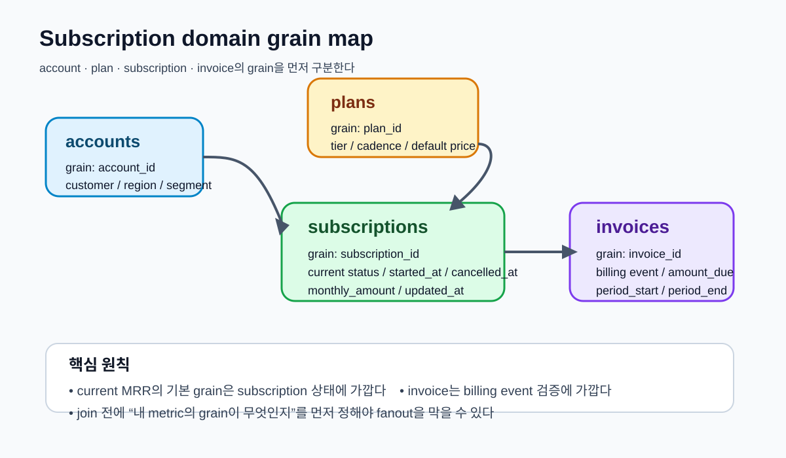

구독 도메인에서 가장 먼저 잡아야 하는 것은 행의 단위다.

<a id="book-chapters-reference-v3-11-casebook-subscription-billing-md--1121-account-grain"></a>

#### 11.2.1. account grain
`accounts`는 고객 또는 계약 주체 수준의 차원이다.
보통 한 계정은 여러 개의 subscription을 가질 수 있다.

<a id="book-chapters-reference-v3-11-casebook-subscription-billing-md--1122-plan-grain"></a>

#### 11.2.2. plan grain
`plans`는 요금제 카탈로그다.
기본 월 금액과 billing cadence, plan tier 같은 비교적 안정적인 속성을 갖는다.

<a id="book-chapters-reference-v3-11-casebook-subscription-billing-md--1123-subscription-grain"></a>

#### 11.2.3. subscription grain
`subscriptions`는 현재 계약 상태를 나타내는 핵심 테이블이다.
한 row가 한 구독을 의미하지만, 상태는 시간에 따라 바뀐다. 그래서 현재 상태만 보면 과거 변화를 잃어버리기 쉽다.

<a id="book-chapters-reference-v3-11-casebook-subscription-billing-md--1124-invoice-grain"></a>

#### 11.2.4. invoice grain
`invoices`는 청구 이벤트 또는 청구 문서 단위다.
`subscription_id`와 연결되지만, MRR을 직접 대체하지는 않는다.
구독은 상태 중심, 인보이스는 청구 중심이라는 점을 구분해야 한다.

<a id="book-chapters-reference-v3-11-casebook-subscription-billing-md--1125-왜-이-구분이-중요한가"></a>

#### 11.2.5. 왜 이 구분이 중요한가

가장 흔한 실수는 subscription과 invoice를 무심코 join해서
구독 하나가 여러 invoice row와 만나며 금액이 부풀어 오르는 것이다.

예를 들어:

- `subscriptions`는 `subscription_id` grain
- `invoices`는 `invoice_id` grain
- 따라서 invoice를 붙이기 전에 “내가 현재 필요한 metric의 grain이 subscription인지 invoice인지”를 먼저 정해야 한다.

구독 도메인의 품질은 SQL 문법보다 grain discipline에서 더 크게 갈린다.

---

<a id="book-chapters-reference-v3-11-casebook-subscription-billing-md--113-day1--day2-시나리오를-먼저-이해하자"></a>

### 11.3. day1 / day2 시나리오를 먼저 이해하자

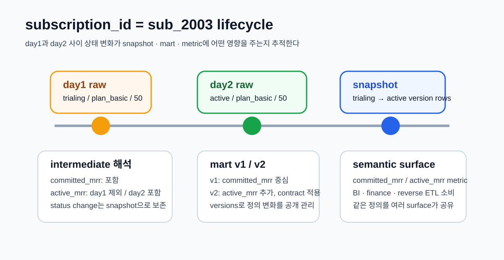

이 예제는 day1과 day2 두 시점을 이용한다.

<a id="book-chapters-reference-v3-11-casebook-subscription-billing-md--1131-day1"></a>

#### 11.3.1. day1
day1에서는 비교적 안정된 초기 상태를 넣는다.

- `sub_2001`: Basic plan, active
- `sub_2002`: Pro plan, active
- `sub_2003`: Basic plan, trialing

<a id="book-chapters-reference-v3-11-casebook-subscription-billing-md--1132-day2"></a>

#### 11.3.2. day2
day2에서는 실제 운영에서 흔히 일어나는 세 가지 변화를 넣는다.

- `sub_2001`: canceled
- `sub_2002`: plan upgrade (`plan_pro → plan_enterprise`)
- `sub_2003`: `trialing → active`

이렇게 해야 다음을 동시에 실험할 수 있다.

1. status change snapshot
2. MRR 재계산
3. versioned metric 정의 비교
4. 계약/공용 API 관점의 변경 영향

<a id="book-chapters-reference-v3-11-casebook-subscription-billing-md--1133-왜-이-시나리오가-좋은가"></a>

#### 11.3.3. 왜 이 시나리오가 좋은가

이 시나리오는 단순히 더 많은 데이터를 보여 주기 위한 게 아니다.
dbt가 강한 지점을 한 번에 드러내기 좋다.

- `source freshness`로 raw 상태를 확인할 수 있다.
- staging에서 상태값을 표준화할 수 있다.
- mart에서 “어떤 상태를 MRR에 포함할지”를 코드화할 수 있다.
- snapshot으로 status transition을 history row로 남길 수 있다.
- contract/version/semantic surface로 정의를 공용 API화할 수 있다.

---

<a id="book-chapters-reference-v3-11-casebook-subscription-billing-md--114-이-예제를-시작할-때-가장-먼저-볼-파일"></a>

### 11.4. 이 예제를 시작할 때 가장 먼저 볼 파일

| 구분 | 파일 경로 | 왜 먼저 보는가 |
| --- | --- | --- |
| bootstrap | `03_platform_bootstrap/subscription/setup_day1.sql` | accounts / plans / subscriptions / invoices raw 생성 |
| day2 변경 | `03_platform_bootstrap/subscription/apply_day2.sql` | 상태 전이, 취소, 업그레이드 삽입 |
| source 정의 | `models/subscription/subscription_sources.yml` | raw_billing source 범위와 freshness 확인 |
| 핵심 staging | `models/subscription/staging/stg_subscriptions.sql` | 상태값, 날짜, 월금액 표준화 |
| intermediate | `models/subscription/intermediate/int_subscription_mrr_basis.sql` | 현재 MRR 자격과 상태 해석을 분리 |
| mart v1 | `models/subscription/marts/fct_mrr_v1.sql` | 단순한 현재 MRR |
| mart v2 | `models/subscription/marts/fct_mrr_v2.sql` | 공용 API용 contract/version 확장 |
| snapshot | `snapshots/subscriptions_status_snapshot.yml` | 상태 이력 보존 방식 |
| semantic | `models/subscription/semantic/subscription_semantic.yml` | semantic-ready metric 정의 |

---

<a id="book-chapters-reference-v3-11-casebook-subscription-billing-md--115-source-단계-raw를-공식-입력으로-선언하기"></a>

### 11.5. source 단계: raw를 공식 입력으로 선언하기

구독 도메인에서는 `subscriptions`와 `invoices`를 하드코딩으로 읽지 않는 것이 특히 중요하다.

그 이유는 세 가지다.

1. source freshness를 붙일 수 있다.
2. raw lineage가 docs에서 끊기지 않는다.
3. `loaded_at_field`를 기준으로 운영 체크를 자동화할 수 있다.

```yaml
version: 2

sources:
  - name: raw_billing
    database: analytics
    schema: raw_billing
    freshness:
      warn_after: {count: 6, period: hour}
      error_after: {count: 24, period: hour}
    tables:
      - name: subscriptions
        loaded_at_field: updated_at
      - name: invoices
        loaded_at_field: updated_at
      - name: plans
      - name: accounts
```

공식 문서 기준으로 freshness는 source에 `freshness:` 블록을 두고,
table에는 `loaded_at_field`를 둬서 column 기반 또는 warehouse metadata 기반으로 계산할 수 있다.
즉, 이 예제의 운영 시작점은 `dbt build`가 아니라 “raw가 제때 들어왔는가”를 확인하는 데 있다.
([freshness](https://docs.getdbt.com/reference/resource-properties/freshness), [sources](https://docs.getdbt.com/docs/build/sources))

<a id="book-chapters-reference-v3-11-casebook-subscription-billing-md--1151-source-freshness는-tests를-대체하지-않는다"></a>

#### 11.5.1. source freshness는 tests를 대체하지 않는다

- freshness는 “들어오긴 했는가”를 본다.
- data tests는 “shape가 맞는가”를 본다.
- contract는 “public model이 약속한 컬럼을 지키는가”를 본다.

이 셋은 서로 다른 품질 계층이다.

---

<a id="book-chapters-reference-v3-11-casebook-subscription-billing-md--116-staging-상태와-날짜를-표준화하는-첫-관문"></a>

### 11.6. staging: 상태와 날짜를 표준화하는 첫 관문

구독 도메인에서 staging은 단순 rename 단계가 아니다.
상태 변화와 metric 계산이 downstream으로 번지기 전에,
상태값과 날짜 컬럼을 먼저 정리해 두는 가장 중요한 단계다.

<a id="book-chapters-reference-v3-11-casebook-subscription-billing-md--1161-핵심-staging-모델-stg_subscriptions"></a>

#### 11.6.1. 핵심 staging 모델: `stg_subscriptions`

```sql
select
    subscription_id,
    account_id,
    plan_id,
    lower(status) as subscription_status,
    cast(started_at as date) as started_at,
    case
        when cancelled_at is null or cancelled_at = '' then null
        else cast(cancelled_at as date)
    end as cancelled_at,
    cast(monthly_amount as numeric) as monthly_amount,
    cast(updated_at as timestamp) as updated_at
from {{ source('raw_billing', 'subscriptions') }}
```

여기서 중요한 건 다음이다.

- `lower(status)`로 상태값 정규화
- 날짜 타입 정리
- `monthly_amount` 타입 고정
- snapshot을 위해 `updated_at`를 신뢰 가능한 컬럼으로 유지

<a id="book-chapters-reference-v3-11-casebook-subscription-billing-md--1162-plans와-invoices는-왜-따로-stage하는가"></a>

#### 11.6.2. `plans`와 `invoices`는 왜 따로 stage하는가

`plans`는 plan 카탈로그 차원이고, `invoices`는 billing event다.
나중에 둘을 한 번에 섞어 버리면 “현재 MRR 계산용 상태”와 “실제 청구 이벤트”가 뒤섞인다.

따라서 여기서는 다음처럼 책임을 분리한다.

- `stg_plans`: plan tier, billing cadence, default amount
- `stg_invoices`: invoice status, amount_due, period_start/end
- `stg_accounts`: account status, segment, region

즉, staging의 목적은 하나의 giant SQL을 만들기 위한 재료 준비가 아니라,
나중에 각 metric이 어디에서 출발하는지 추적 가능하게 만드는 것이다.

---

<a id="book-chapters-reference-v3-11-casebook-subscription-billing-md--117-intermediate-mrr-자격을-별도-계층으로-빼는-이유"></a>

### 11.7. intermediate: “MRR 자격”을 별도 계층으로 빼는 이유

구독 도메인에서는 intermediate가 특히 중요하다.
왜냐하면 대부분의 혼란이 status 해석에서 생기기 때문이다.

예를 들어 이런 질문이 있다.

- `trialing`을 MRR에 포함하는가?
- `canceled`인데 `cancelled_at`이 미래 날짜면 어떻게 보는가?
- `past_due`는 active로 볼 것인가?

이런 판단을 mart의 최종 집계 SQL 안에 바로 넣으면,
v1과 v2를 비교하거나 metric 정의를 바꾸기 어려워진다.

그래서 `int_subscription_mrr_basis` 같은 intermediate 모델에서 먼저 해석한다.

```sql
with subs as (
    select * from {{ ref('stg_subscriptions') }}
),
plans as (
    select * from {{ ref('stg_plans') }}
)
select
    s.subscription_id,
    s.account_id,
    s.plan_id,
    p.plan_tier,
    s.subscription_status,
    s.started_at,
    s.cancelled_at,
    s.monthly_amount,
    case
        when s.subscription_status in ('active', 'trialing') then true
        else false
    end as contributes_to_committed_mrr,
    case
        when s.subscription_status = 'active' then true
        else false
    end as contributes_to_active_mrr,
    s.updated_at
from subs s
left join plans p
  on s.plan_id = p.plan_id
```

여기서 핵심은 정의 분리다.

- `committed_mrr` 기준
- `active_mrr` 기준
- 향후 churn 또는 expansion 계산 기준

이 intermediate가 있으면 mart는 “무엇을 집계할지”에 더 집중할 수 있다.

---

<a id="book-chapters-reference-v3-11-casebook-subscription-billing-md--118-mart-v1-가장-단순한-현재-mrr부터-만든다"></a>

### 11.8. mart v1: 가장 단순한 현재 MRR부터 만든다

처음부터 완벽한 metric 레이어를 만들려고 하지 말자.
우선은 팀이 이해하기 쉬운 단순 버전부터 만든다.

<a id="book-chapters-reference-v3-11-casebook-subscription-billing-md--1181-fct_mrr_v1"></a>

#### 11.8.1. `fct_mrr_v1`

```sql
with basis as (
    select * from {{ ref('int_subscription_mrr_basis') }}
)
select
    plan_id,
    count_if(contributes_to_committed_mrr) as committed_subscription_count,
    sum(case when contributes_to_committed_mrr then monthly_amount else 0 end) as committed_mrr
from basis
group by 1
```

이 모델은 단순하다.
`active + trialing`을 합친 committed MRR을 plan 기준으로 보여 준다.

<a id="book-chapters-reference-v3-11-casebook-subscription-billing-md--1182-왜-v1이-필요한가"></a>

#### 11.8.2. 왜 v1이 필요한가

v1은 최종 정답이 아니라 정의 초안이다.
구독 도메인은 보통 처음엔 이렇게 시작한다.

1. 우선 합리적인 초안을 만든다.
2. 정의가 실제 조직 요구와 맞지 않는 지점을 찾는다.
3. v2에서 contract/versions를 붙여 공용 API로 안정화한다.

즉, versioning은 “고급 기능”이 아니라
정의가 바뀔 수밖에 없는 도메인을 안전하게 다루는 도구다.

---

<a id="book-chapters-reference-v3-11-casebook-subscription-billing-md--119-mart-v2-contract와-version을-붙인-공용-api"></a>

### 11.9. mart v2: contract와 version을 붙인 공용 API

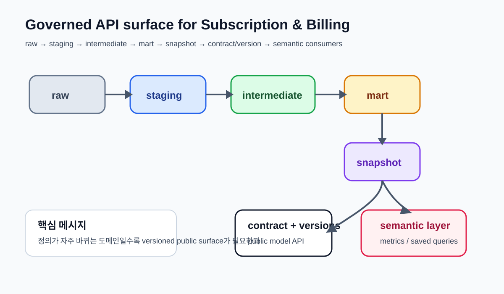

Subscription & Billing 예제는 공용 API surface의 필요성을 가장 강하게 보여 준다.
finance, BI, growth, reverse ETL, AI agent가 서로 다른 해석으로 MRR을 쓰기 시작하면 혼란이 커진다.

그래서 `fct_mrr`는 버전을 나눠 관리하는 것이 좋다.

<a id="book-chapters-reference-v3-11-casebook-subscription-billing-md--1191-v2에서-추가하는-것"></a>

#### 11.9.1. v2에서 추가하는 것

- 컬럼 정의 고정
- contract enforced
- versioned model
- `latest_version: 2`
- `v1`은 하위 호환용으로 유지
- grants / access / group 부여

<a id="book-chapters-reference-v3-11-casebook-subscription-billing-md--1192-예시-yaml"></a>

#### 11.9.2. 예시 YAML

```yaml
version: 2

groups:
  - name: finance
    owner:
      name: finance-data
      email: finance-data@example.com

models:
  - name: fct_mrr
    latest_version: 2
    config:
      access: public
      group: finance

    versions:
      - v: 1
      - v: 2
        config:
          contract:
            enforced: true

    columns:
      - name: plan_id
        data_type: string
      - name: committed_subscription_count
        data_type: bigint
      - name: committed_mrr
        data_type: numeric
      - name: active_mrr
        data_type: numeric
```

공식 문서 기준으로 contract를 enforce하면
dbt는 YAML에 정의한 column `name`과 `data_type`을 기준으로
모델의 반환 shape가 정확히 일치하는지 확인한다.
versions는 `latest_version`과 `versions:`를 이용해 모델 API의 진화를 관리한다.
([contract](https://docs.getdbt.com/reference/resource-configs/contract), [versions](https://docs.getdbt.com/reference/resource-properties/versions))

<a id="book-chapters-reference-v3-11-casebook-subscription-billing-md--1193-왜-subscription-예제가-versioning에-잘-맞는가"></a>

#### 11.9.3. 왜 Subscription 예제가 versioning에 잘 맞는가

MRR은 자주 바뀐다.

- trialing 포함 여부
- annual plan의 monthly normalization 방식
- canceled but paid-through 처리
- paused status 포함 여부

이건 코드 변경이면서 동시에 정의 변경이다.
그러므로 versioning이 자연스럽게 필요하다.

---

<a id="book-chapters-reference-v3-11-casebook-subscription-billing-md--1110-snapshot-현재-상태와-과거-상태를-분리해-보존하기"></a>

### 11.10. snapshot: 현재 상태와 과거 상태를 분리해 보존하기

Subscription 예제에서 snapshot은 선택이 아니라 거의 필수다.
왜냐하면 `stg_subscriptions`는 언제나 “현재 상태”만 말해 주기 쉽기 때문이다.

`sub_2003`이 day1에는 `trialing`, day2에는 `active`라면
현재 테이블만 봐서는 이전 상태를 잃어버린다.

<a id="book-chapters-reference-v3-11-casebook-subscription-billing-md--11101-yaml-기반-snapshot을-우선-고려하자"></a>

#### 11.10.1. YAML 기반 snapshot을 우선 고려하자

현재 공식 문서는 dbt Latest release track과 dbt Core v1.9+ 기준으로
새 snapshot은 YAML 기반 config를 권장하고,
SQL 파일의 `config()` block 방식은 legacy로 본다.
([snapshot configs](https://docs.getdbt.com/reference/snapshot-configs), [snapshot command](https://docs.getdbt.com/reference/commands/snapshot))

<a id="book-chapters-reference-v3-11-casebook-subscription-billing-md--11102-예시-subscriptions_status_snapshotyml"></a>

#### 11.10.2. 예시: `subscriptions_status_snapshot.yml`

```yaml
snapshots:
  - name: subscriptions_status_snapshot
    relation: ref('stg_subscriptions')
    config:
      strategy: check
      unique_key: subscription_id
      check_cols:
        - subscription_status
        - plan_id
        - monthly_amount
      updated_at: updated_at
```

이 방식의 장점은 snapshot query와 config를 더 명확히 분리할 수 있다는 점이다.

<a id="book-chapters-reference-v3-11-casebook-subscription-billing-md--11103-snapshot이-보여-주는-것"></a>

#### 11.10.3. snapshot이 보여 주는 것

- `sub_2001`: active → canceled
- `sub_2002`: plan_pro → plan_enterprise
- `sub_2003`: trialing → active

이 세 변화는 모두 “MRR 변화”와 연결되지만,
그 자체가 곧 metric은 아니다. snapshot은 먼저 상태 변화의 사실을 보존한다.

---

<a id="book-chapters-reference-v3-11-casebook-subscription-billing-md--1111-semantic-ready-modeling-metric을-나중에-붙이는-게-아니라-준비하는-것"></a>

### 11.11. semantic-ready modeling: metric을 나중에 붙이는 게 아니라 준비하는 것

Subscription 예제는 semantic layer가 왜 필요한지 가장 잘 보여 준다.

<a id="book-chapters-reference-v3-11-casebook-subscription-billing-md--11111-semantic-layer가-특별히-중요한-이유"></a>

#### 11.11.1. semantic layer가 특별히 중요한 이유

같은 MRR라도 소비자가 다르면 해석이 달라진다.

- BI: dashboard용 현재 MRR
- finance: month-end close용 billable MRR
- growth: trialing 포함 committed MRR
- reverse ETL: active subscriptions only
- AI / analyst chatbot: metric name 하나로 질문

이때 semantic model과 metric을 정의해 두면
“질문 표면”을 통제하기 쉬워진다.

<a id="book-chapters-reference-v3-11-casebook-subscription-billing-md--11112-이-장에서의-semantic-starter"></a>

#### 11.11.2. 이 장에서의 semantic starter

이 장에서는 semantic model을 full production 스펙으로 완성하기보다,
semantic-ready mart를 만들고 starter YAML을 붙이는 데 집중한다.

예를 들면:

```yaml
semantic_models:
  - name: subscription_mrr
    model: ref('fct_mrr_v2')
    defaults:
      agg_time_dimension: metric_date

    entities:
      - name: plan
        type: primary
        expr: plan_id

    dimensions:
      - name: metric_date
        type: time
        expr: metric_date
        type_params:
          time_granularity: day

    measures:
      - name: committed_mrr
        agg: sum
        expr: committed_mrr

metrics:
  - name: committed_mrr
    label: Committed MRR
    type: simple
    type_params:
      measure:
        name: committed_mrr
```

공식 문서상 최신 semantic/YAML spec의 가용성은 엔진과 release track에 따라 차이가 있으므로,
이 장에서는 semantic-ready design을 중심으로 설명하고,
실행 환경별 차이는 semantic/playbook 파트에서 다시 본다.
([semantic layer FAQs](https://docs.getdbt.com/docs/use-dbt-semantic-layer/sl-faqs))

---

<a id="book-chapters-reference-v3-11-casebook-subscription-billing-md--1112-sub_2003을-끝까지-따라가-보자"></a>

### 11.12. `sub_2003`을 끝까지 따라가 보자

이 장의 대표 레코드는 `sub_2003`이다.

<a id="book-chapters-reference-v3-11-casebook-subscription-billing-md--11121-day1"></a>

#### 11.12.1. day1
- status = `trialing`
- plan = `plan_basic`
- monthly_amount = 50

<a id="book-chapters-reference-v3-11-casebook-subscription-billing-md--11122-staging"></a>

#### 11.12.2. staging
`stg_subscriptions`에서 상태값과 타입이 정리된다.

<a id="book-chapters-reference-v3-11-casebook-subscription-billing-md--11123-intermediate"></a>

#### 11.12.3. intermediate
`int_subscription_mrr_basis`에서

- `contributes_to_committed_mrr = true`
- `contributes_to_active_mrr = false`

처럼 정의가 분리된다.

<a id="book-chapters-reference-v3-11-casebook-subscription-billing-md--11124-day2"></a>

#### 11.12.4. day2
- status = `active`
- monthly_amount = 50
- `updated_at` 변경

<a id="book-chapters-reference-v3-11-casebook-subscription-billing-md--11125-snapshot"></a>

#### 11.12.5. snapshot
snapshot은 이 상태 변화를 새 version row로 남긴다.

<a id="book-chapters-reference-v3-11-casebook-subscription-billing-md--11126-mart-v1--v2"></a>

#### 11.12.6. mart v1 / v2
- v1에서는 committed MRR에 포함
- v2에서는 active MRR과 committed MRR을 분리해 더 정확히 표현 가능

즉, 이 한 레코드만 따라가도
staging → intermediate → mart → snapshot → contract/version → semantic 흐름이 모두 연결된다.

---

<a id="book-chapters-reference-v3-11-casebook-subscription-billing-md--1113-품질-계층-tests-freshness-contract를-한-덩어리로-보지-말자"></a>

### 11.13. 품질 계층: tests, freshness, contract를 한 덩어리로 보지 말자

이 장에서는 품질 장치를 세 계층으로 구분하는 것이 중요하다.

<a id="book-chapters-reference-v3-11-casebook-subscription-billing-md--11131-source-freshness"></a>

#### 11.13.1. source freshness
raw가 제때 들어왔는가?

<a id="book-chapters-reference-v3-11-casebook-subscription-billing-md--11132-data-tests"></a>

#### 11.13.2. data tests
shape와 관계가 맞는가?

예:
- `subscription_id` unique / not_null
- `plan_id` relationships to `stg_plans`
- `subscription_status` accepted_values

<a id="book-chapters-reference-v3-11-casebook-subscription-billing-md--11133-contract"></a>

#### 11.13.3. contract
공용 모델이 약속한 컬럼과 타입을 지키는가?

이 셋을 섞어 생각하면 운영이 어려워진다.
특히 Subscription 도메인에서는 freshness는 raw ingestion 문제를,
data tests는 관계/상태값 문제를,
contracts는 downstream API 신뢰 문제를 각각 담당한다.

---

<a id="book-chapters-reference-v3-11-casebook-subscription-billing-md--1114-안티패턴"></a>

### 11.14. 안티패턴

<a id="book-chapters-reference-v3-11-casebook-subscription-billing-md--11141-invoice와-subscription을-바로-join해서-current-mrr을-계산하는-것"></a>

#### 11.14.1. invoice와 subscription을 바로 join해서 current MRR을 계산하는 것
청구 이벤트와 현재 상태를 섞으면 중복 집계가 생기기 쉽다.

<a id="book-chapters-reference-v3-11-casebook-subscription-billing-md--11142-active-trialing-canceled를-raw-문자열-그대로-mart에서-처리하는-것"></a>

#### 11.14.2. `active`, `trialing`, `canceled`를 raw 문자열 그대로 mart에서 처리하는 것
상태 정규화는 staging에서 해야 한다.

<a id="book-chapters-reference-v3-11-casebook-subscription-billing-md--11143-snapshot-없이-이전-상태도-대충-알-수-있겠지라고-생각하는-것"></a>

#### 11.14.3. snapshot 없이 “이전 상태도 대충 알 수 있겠지”라고 생각하는 것
상태 변화 이력은 시간이 지나면 사라진다.

<a id="book-chapters-reference-v3-11-casebook-subscription-billing-md--11144-mrr-정의를-버전-없이-바꾸는-것"></a>

#### 11.14.4. MRR 정의를 버전 없이 바꾸는 것
finance, BI, growth가 동시에 쓰는 metric은 버전 없이 바꾸면 혼란이 커진다.

<a id="book-chapters-reference-v3-11-casebook-subscription-billing-md--11145-contract를-너무-일찍-모든-모델에-붙이는-것"></a>

#### 11.14.5. contract를 너무 일찍 모든 모델에 붙이는 것
contract는 public API 성격이 강한 mart부터 적용하는 편이 좋다.

---

<a id="book-chapters-reference-v3-11-casebook-subscription-billing-md--1115-직접-해보기"></a>

### 11.15. 직접 해보기

1. `setup_day1.sql` 실행
2. `dbt source freshness -s source:raw_billing`
3. `dbt build -s subscription`
4. `sub_2003`이 trialing 상태로 들어왔는지 확인
5. `apply_day2.sql` 실행
6. `dbt snapshot -s subscriptions_status_snapshot`
7. `sub_2003`의 상태 전이가 snapshot에 남았는지 확인
8. `fct_mrr_v1`과 `fct_mrr_v2`를 비교
9. `contracts / versions` YAML을 적용해 public model처럼 정리

---

<a id="book-chapters-reference-v3-11-casebook-subscription-billing-md--1116-이-장의-핵심-정리"></a>

### 11.16. 이 장의 핵심 정리

Subscription & Billing은 dbt의 고급 기능을 뽐내기 위한 예제가 아니다.
오히려 “정의가 흔들리기 쉬운 도메인을 어떻게 안정된 API로 바꾸는가”를 보여 주는 예제다.

이 장에서 기억해야 할 핵심은 다섯 가지다.

1. 구독 도메인은 grain discipline이 먼저다.
2. MRR 해석은 intermediate에서 먼저 분리한다.
3. snapshot은 현재 상태와 과거 상태를 분리해 보존한다.
4. contract와 versions는 metric 정의의 진화를 안전하게 만든다.
5. semantic-ready surface는 여러 소비자가 같은 질문을 하게 만든다.

다음 플랫폼 플레이북에서는 이 Subscription 예제를 각 엔진과 저장소 위에 실제로 어떻게 올릴지 다시 본다.

---

<a id="book-chapters-reference-v3-12-platform-playbook-duckdb-md"></a>

장별 원고: [chapters/reference-v3/12-platform-playbook-duckdb.md](chapters/reference-v3/12-platform-playbook-duckdb.md)

<a id="book-chapters-reference-v3-12-platform-playbook-duckdb-md--chapter-12--platform-playbook--duckdb"></a>

## CHAPTER 12 · Platform Playbook · DuckDB

> **마당마켓 본편 연결:** [J01 · 환경 준비: 실행 종류와 데이터 파일을 혼동하지 않기](#book-journey-01-setup-md)에서 같은 상점의 누적 실습으로 돌아갈 수 있다. 이 참고편의 `codes/` 스니펫에는 독립 fixture가 포함되어 있으며 본편 `lab/`의 P1~P5와 섞지 않는다. 플랫폼별 구문·기능은 실행 버전에 맞춰 재확인한다.


> DuckDB는 이 책 전체를 실제로 손으로 돌려 보게 만드는 기준 플랫폼이다.
> 앞선 1~11장에서 배운 개념을 가장 빠르게 확인하고, day1/day2 변화 데이터와 expected 결과를 가장 쉽게 대조할 수 있는 환경도 DuckDB다.
> 하지만 바로 그 단순함 때문에, DuckDB를 다른 플랫폼과 같은 방식으로 오해해서는 안 된다. 이 장의 목적은 “가장 쉬운 시작점”으로서의 DuckDB와 “실전 운영에서의 경계선”을 동시에 분명하게 만드는 데 있다.

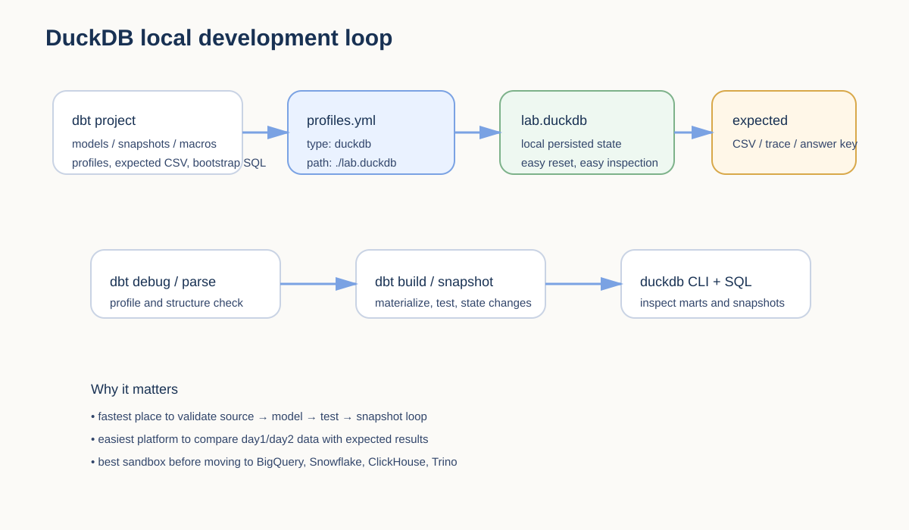

DuckDB 장을 따로 길게 다루는 이유는 단순하다. 이 책의 세 casebook—Retail Orders, Event Stream, Subscription & Billing—을 가장 낮은 비용으로 끝까지 재현할 수 있는 플랫폼이기 때문이다. 로컬 파일 하나만 준비하면 `source → staging → intermediate → marts → tests → snapshots → docs` 루프를 바로 돌릴 수 있고, 결과 파일도 눈으로 비교할 수 있다. 하지만 DuckDB가 학습과 실험에 매우 좋다고 해서, 다중 사용자 환경이나 배포 운영까지 같은 감각으로 보는 것은 위험하다.

이 장은 네 가지 질문에 답한다.

1. DuckDB는 이 책의 기본 실행 플랫폼으로서 어디까지 책임질 수 있는가?
2. DuckDB profile은 어디까지 단순해야 하고, 어디부터 고급 설정이 필요한가?
3. 세 casebook을 DuckDB에서 어떻게 돌리고, 무엇을 확인해야 하는가?
4. DuckDB에서 잘 되는 습관 중 무엇은 다른 플랫폼으로 그대로 옮길 수 있고, 무엇은 옮기면 안 되는가?

---

<a id="book-chapters-reference-v3-12-platform-playbook-duckdb-md--121-duckdb를-첫-번째-플랫폼으로-쓰는-이유"></a>

### 12.1. DuckDB를 첫 번째 플랫폼으로 쓰는 이유

<a id="book-chapters-reference-v3-12-platform-playbook-duckdb-md--1211-duckdb의-위치-학습용-장난감이-아니라-가장-빠른-분석-샌드박스"></a>

#### 12.1.1. DuckDB의 위치: “학습용 장난감”이 아니라 “가장 빠른 분석 샌드박스”
DuckDB는 SQLite처럼 파일 하나로 시작할 수 있지만, 분석 워크로드를 위해 설계된 엔진이다. 그래서 `JOIN`, 집계, 윈도 함수, Parquet/CSV 읽기, Python 연동 같은 분석용 흐름을 빠르게 시험해 볼 수 있다. dbt와 함께 쓰면 “데이터웨어하우스 없이도 analytics engineering workflow를 훈련할 수 있는 가장 작은 실험실”이 된다.

이 책에서 DuckDB가 중요한 이유는 다음과 같다.

- 실행 장벽이 낮다. 계정 발급, 네트워크 방화벽, 권한 신청, 과금 걱정 없이 시작할 수 있다.
- 반복 속도가 빠르다. `dbt debug`, `dbt build`, `dbt compile`, `dbt test`를 짧은 루프로 자주 돌리기 좋다.
- 실패 복구가 쉽다. `.duckdb` 파일을 지우고 다시 bootstrap 하면 초기 상태로 돌아가기 쉽다.
- 세 예제 트랙을 모두 소화할 수 있다. 주문형 fact/dim, 이벤트형 time-series, 구독형 상태 변화 이력을 모두 낮은 비용으로 재현할 수 있다.

하지만 동시에 DuckDB는 다음을 숨기기도 한다.

- 원격 웨어하우스 연결 문제
- 다중 사용자 동시성
- 역할/권한/warehouse 비용
- 장기 배치 운영과 SLA
- 서비스형 catalog 및 orchestration 경험

즉, DuckDB는 “모든 플랫폼을 대체하는 운영 표준”이 아니라, 다른 플랫폼으로 가기 전에 설계를 단단하게 만드는 기준점이다.

<a id="book-chapters-reference-v3-12-platform-playbook-duckdb-md--1212-duckdb가-특히-잘-맞는-상황"></a>

#### 12.1.2. DuckDB가 특히 잘 맞는 상황
DuckDB 장은 다음 상황을 염두에 두고 읽으면 좋다.

1. 개념 학습
   - `source()`, `ref()`, layered modeling, tests, snapshots의 흐름을 가장 빠르게 익히는 단계
2. 로컬 디버깅
   - compiled SQL과 결과 테이블을 작게 반복 검증하는 단계
3. companion pack 실행
   - day1/day2 bootstrap과 expected CSV를 실제로 대조하는 단계
4. 설계 검증
   - grain, fanout, incremental 필터, freshness, contracts를 로컬에서 먼저 검증하는 단계
5. 다른 플랫폼 이전 전 준비
   - BigQuery/Snowflake/ClickHouse/Trino로 옮기기 전에 모델 구조와 품질 규칙을 정리하는 단계

<a id="book-chapters-reference-v3-12-platform-playbook-duckdb-md--1213-duckdb가-가려-주는-것"></a>

#### 12.1.3. DuckDB가 가려 주는 것
DuckDB 장에서 가장 중요한 문장 하나를 고르면 이거다.

> DuckDB에서 잘 돌아간다는 사실은 모델 설계가 맞다는 뜻에 더 가깝고, 운영 구조가 완성됐다는 뜻은 아니다.

그래서 이 장은 항상 “어디까지는 DuckDB에서 충분히 볼 수 있고, 어디부터는 다른 플랫폼에서 다시 검증해야 하는가”를 함께 적는다. 이 구분이 없으면 독자는 DuckDB의 편의성을 곧 운영 보장처럼 오해하게 된다.

---

<a id="book-chapters-reference-v3-12-platform-playbook-duckdb-md--122-duckdb-profile을-읽는-법"></a>

### 12.2. DuckDB profile을 읽는 법

<a id="book-chapters-reference-v3-12-platform-playbook-duckdb-md--1221-가장-단순한-로컬-profile"></a>

#### 12.2.1. 가장 단순한 로컬 profile
DuckDB는 `type: duckdb`와 `path`만 있어도 시작할 수 있다. 이 책의 기본 profile은 다음 형태를 권장한다.

```yaml
dbt_all_in_one_lab:
  target: dev
  outputs:
    dev:
      type: duckdb
      path: ./lab.duckdb
      schema: main
      threads: 4
```

이 구성에서 핵심은 두 가지다.

- `path`는 실제 `.duckdb` 파일 위치를 결정한다.
- `schema`는 relation을 쌓을 기본 스키마를 결정한다.

DuckDB profile에서 가장 많이 실수하는 지점은 database 개념을 다른 RDBMS처럼 조작하려는 것이다. DuckDB는 파일 경로를 기준으로 동작하므로, 처음에는 `path`와 `schema`만 명확히 이해하는 편이 좋다.

코드:
- [`../codes/04_chapter_snippets/ch12/01_profiles_duckdb_local.yml`](codes/04_chapter_snippets/ch12/01_profiles_duckdb_local.yml)

<a id="book-chapters-reference-v3-12-platform-playbook-duckdb-md--1222-파일-기반과-memory의-차이"></a>

#### 12.2.2. 파일 기반과 `:memory:`의 차이
DuckDB는 파일 기반으로 쓸 수도 있고 in-memory로도 쓸 수 있다. 하지만 이 책에서는 학습용 기본값으로 파일 기반을 강하게 추천한다.

파일 기반이 좋은 이유:
- dbt 실행 후 relation이 그대로 남는다.
- `duckdb ./lab.duckdb`로 직접 접속해 결과를 확인하기 쉽다.
- day1 실행 후 day2를 적용해 snapshot이나 incremental 변화를 보기 쉽다.
- expected CSV와 비교할 때 기준점이 명확하다.

반대로 `:memory:`는 빠른 실험에는 좋지만 다음 문제가 생긴다.
- 프로세스가 끝나면 상태가 사라진다.
- subset run 시 upstream state를 다시 등록해야 하는 상황이 생긴다.
- external materialization이나 외부 파일 참조 시 재현성이 떨어질 수 있다.

초보자 기준 추천은 이렇다.

- 기본 학습: `./lab.duckdb`
- 짧은 실험: `:memory:`
- 파일/S3/Parquet/attach 실험: 파일 기반 + 별도 디렉터리 관리

<a id="book-chapters-reference-v3-12-platform-playbook-duckdb-md--1223-duckdb-프로젝트-디렉터리-추천"></a>

#### 12.2.3. DuckDB 프로젝트 디렉터리 추천
DuckDB를 companion pack과 함께 쓸 때는 프로젝트 루트가 깔끔해야 한다.

```text
my_project/
├─ dbt_project.yml
├─ models/
├─ seeds/
├─ snapshots/
├─ macros/
├─ target/
├─ logs/
├─ lab.duckdb
├─ expected/
└─ 03_platform_bootstrap/
```

중요한 점:
- `.duckdb` 파일을 프로젝트 루트에 두면 확인은 쉽지만, Git ignore를 분명히 해야 한다.
- expected CSV는 DB 파일과 분리해 두어야 “결과 비교용 산출물”이라는 의미가 선명해진다.
- day1/day2 SQL은 companion bootstrap 디렉터리 아래에 두고, 장 본문에서는 그 경로를 문서화한다.

---

<a id="book-chapters-reference-v3-12-platform-playbook-duckdb-md--123-duckdb에서-고급-설정이-필요한-시점"></a>

### 12.3. DuckDB에서 고급 설정이 필요한 시점

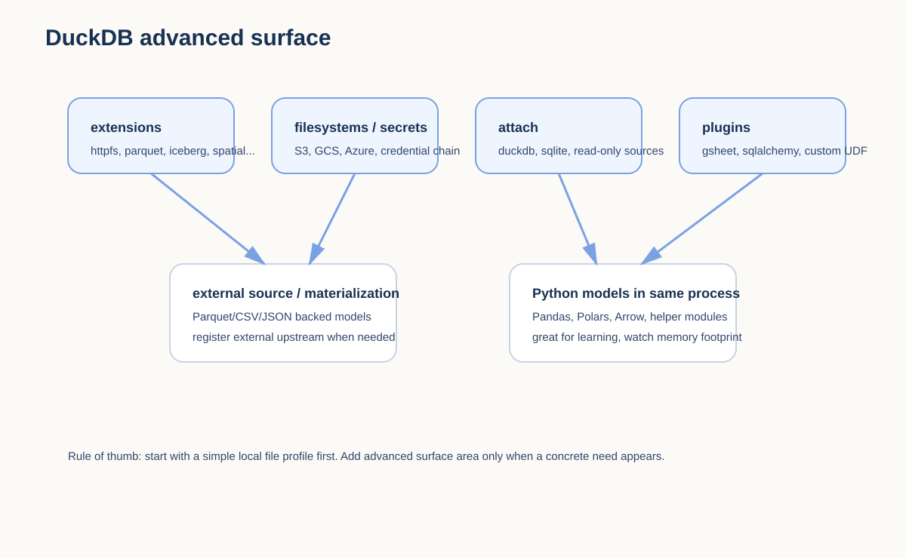

DuckDB는 기본 profile만으로도 충분히 시작할 수 있지만, 일정 시점부터는 DuckDB 특유의 강점—extensions, external files, attach, plugins, Python—을 활용하게 된다. 이 부분은 다른 플랫폼 플레이북과 DuckDB 플레이북이 갈라지는 핵심이다.

<a id="book-chapters-reference-v3-12-platform-playbook-duckdb-md--1231-extensions-settings-filesystems"></a>

#### 12.3.1. extensions, settings, filesystems
Parquet, HTTP/S3, fsspec 기반 파일시스템을 활용하려면 profile에 추가 설정이 필요하다.

```yaml
dbt_all_in_one_lab:
  target: dev
  outputs:
    dev:
      type: duckdb
      path: ./lab.duckdb
      threads: 4
      extensions:
        - httpfs
        - parquet
      settings:
        timezone: Asia/Seoul
      filesystems:
        - fs: s3
          anon: false
          key: "{{ env_var('S3_ACCESS_KEY_ID') }}"
          secret: "{{ env_var('S3_SECRET_ACCESS_KEY') }}"
```

이 설정은 “DuckDB를 로컬 파일 DB로만 쓰는 단계”를 넘어서, 파일 기반 lakehouse 실험을 할 때 유용하다.

코드:
- [`../codes/04_chapter_snippets/ch12/02_profiles_duckdb_advanced.yml`](codes/04_chapter_snippets/ch12/02_profiles_duckdb_advanced.yml)

<a id="book-chapters-reference-v3-12-platform-playbook-duckdb-md--1232-secrets와-credential-chain"></a>

#### 12.3.2. secrets와 credential chain
로컬 환경에서도 S3/GCS/Azure 파일을 읽고 쓰려면 credential 관리가 필요하다.
이때 단순 `settings`로 키를 박기보다 secret manager 또는 credential chain 전략을 이해하는 편이 낫다.

학습 기준:
- 로컬 단기 실험: env_var 또는 최소 secrets
- 팀 공유 환경: credential chain / 표준 provider
- 교재 예제: 민감값은 항상 env_var로

<a id="book-chapters-reference-v3-12-platform-playbook-duckdb-md--1233-attach-여러-데이터베이스를-한-런에서-다루기"></a>

#### 12.3.3. attach: 여러 데이터베이스를 한 런에서 다루기
DuckDB는 추가 데이터베이스를 attach해서 함께 다룰 수 있다. 이 기능은 다음 상황에서 특히 유용하다.

- 하나의 `.duckdb` 파일에 raw/staging/marts를 모두 몰아넣고 싶지 않을 때
- 외부 read-only DuckDB/SQLite 파일을 source처럼 읽고 싶을 때
- 로컬 실험에서 카탈로그 경계를 흉내 내고 싶을 때

```yaml
dbt_all_in_one_lab:
  target: dev
  outputs:
    dev:
      type: duckdb
      path: ./lab.duckdb
      attach:
        - path: ./raw.duckdb
          alias: rawdb
          read_only: true
        - path: ./audit.sqlite
          alias: auditdb
          type: sqlite
```

이 기능은 “DuckDB 하나로 작은 lakehouse 느낌을 내는 법”에 가깝다. 다만 초보자는 처음부터 attach를 쓰기보다, 하나의 lab.duckdb로 구조를 먼저 익힌 뒤 확장하는 편이 낫다.

<a id="book-chapters-reference-v3-12-platform-playbook-duckdb-md--1234-plugins와-local-modules"></a>

#### 12.3.4. plugins와 local modules
DuckDB playbook을 고급 단계로 끌어올리는 요소는 plugin 시스템이다.
이 기능을 통해 Google Sheets, SQLAlchemy, custom Python UDF 같은 확장을 연결할 수 있다. 다만 교재 기준으로는 “할 수 있다”를 보여 주는 정도면 충분하고, 본격적인 확장은 Appendix C와 Chapter 08의 Python/UDF 절에서 다시 다루는 편이 좋다.

```yaml
dbt_all_in_one_lab:
  target: dev
  outputs:
    dev:
      type: duckdb
      path: ./lab.duckdb
      plugins:
        - module: sqlalchemy
          alias: sql
          config:
            connection_url: "{{ env_var('DBT_ENV_SECRET_SQLALCHEMY_URI') }}"
      module_paths:
        - ./python_modules
```

중요한 건 “DuckDB에서는 Python이 같은 프로세스 안에서 실행된다”는 점이다.
이 특성 덕분에 실험은 쉽지만, 의존성 관리와 메모리 사용을 함께 고민해야 한다.

<a id="book-chapters-reference-v3-12-platform-playbook-duckdb-md--1235-external-source와-external-materialization"></a>

#### 12.3.5. external source와 external materialization
DuckDB는 외부 파일을 source처럼 읽는 패턴과, 모델 결과를 외부 파일로 materialize하는 패턴이 모두 강하다. 이것은 BigQuery나 Snowflake와는 다른 DuckDB 고유의 장점이다.

예를 들어 source에 external location을 주면, `source()`가 단순한 테이블명이 아니라 파일 경로 또는 `read_parquet()` 호출로 풀릴 수 있다. 또한 `materialized='external'`을 사용하면 결과를 Parquet/CSV/JSON 같은 파일로 직접 쓸 수 있다.

코드:
- [`../codes/04_chapter_snippets/ch12/03_external_sources.yml`](codes/04_chapter_snippets/ch12/03_external_sources.yml)
- [`../codes/04_chapter_snippets/ch12/04_register_external_models.yml`](codes/04_chapter_snippets/ch12/04_register_external_models.yml)

주의:
- `:memory:`를 사용할 때 external upstream subset run이 깨질 수 있으므로, 필요하면 `register_upstream_external_models()`를 `on-run-start`에 두는 편이 안전하다.
- external materialization은 편리하지만, relation처럼 “언제나 DB 안에 존재하는 상태”와는 다르므로 디버깅 지점이 달라진다.

<a id="book-chapters-reference-v3-12-platform-playbook-duckdb-md--1236-duckdb에서-python-model이-의미하는-것"></a>

#### 12.3.6. DuckDB에서 Python model이 의미하는 것
DuckDB에서는 Python model이 원격 실행이 아니라 같은 Python 프로세스 안에서 동작한다.
이건 학습용으로 아주 강력하다. Pandas/Polars/Arrow를 바로 써 볼 수 있고, 작은 helper 모듈도 쉽게 가져올 수 있다. 하지만 동시에 “Python이니까 아무거나 넣어도 되겠지”라고 생각하면 안 된다. Python model도 여전히 grains, contracts, tests, runtime footprint를 생각해야 한다.

코드:
- [`../codes/04_chapter_snippets/ch12/05_python_model_duckdb_example.py`](codes/04_chapter_snippets/ch12/05_python_model_duckdb_example.py)

---

<a id="book-chapters-reference-v3-12-platform-playbook-duckdb-md--124-세-casebook을-duckdb에서-어떻게-읽을-것인가"></a>

### 12.4. 세 casebook을 DuckDB에서 어떻게 읽을 것인가

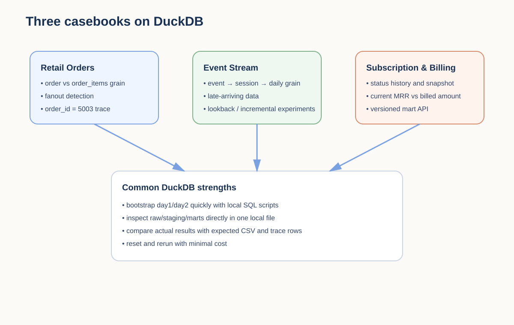

이 장의 핵심은 “DuckDB가 세 casebook을 모두 같은 방식으로 읽게 해 준다”가 아니다.
오히려 같은 장치를 쓰더라도, casebook마다 DuckDB에서 더 쉽게 보이는 포인트가 다르다는 점이 중요하다.

<a id="book-chapters-reference-v3-12-platform-playbook-duckdb-md--1241-retail-orders-grain-fanout-5003-추적"></a>

#### 12.4.1. Retail Orders: grain, fanout, 5003 추적
Retail Orders를 DuckDB에서 돌릴 때 가장 좋은 점은 다음 셋이다.

1. `orders`와 `order_items` grain 차이를 가장 쉽게 반복 검증할 수 있다.
2. `order_id = 5003`의 lifecycle을 day1/day2/snapshot까지 바로 확인할 수 있다.
3. `fct_orders` 결과를 expected CSV와 비교하기 쉽다.

추천 루프:
1. `03_platform_bootstrap/retail/duckdb/setup_day1.sql` 실행
2. `dbt build -s path:models/retail`
3. `duckdb ./lab.duckdb`로 `stg_orders`, `int_order_lines`, `fct_orders` 조회
4. `03_platform_bootstrap/retail/duckdb/apply_day2.sql` 실행
5. `dbt build -s path:models/retail`
6. `orders_snapshot`과 `expected/retail/order5003_trace.csv` 비교

DuckDB에서는 이 루프가 매우 가볍다. 그래서 Retail Orders는 fanout과 snapshot을 배우는 첫 샌드박스로 좋다.

<a id="book-chapters-reference-v3-12-platform-playbook-duckdb-md--1242-event-stream-append-only-late-arrival-lookback"></a>

#### 12.4.2. Event Stream: append-only, late arrival, lookback
Event Stream에서 DuckDB가 특히 좋은 이유는 incremental 실험 반복이다.

- event grain에서 session/daily grain으로 어떻게 올라가는지
- day2 데이터가 단순 append인지, late-arriving update인지
- lookback window를 넓힐 때 결과가 어떻게 바뀌는지

이걸 빠르게 바꿔 가며 확인할 수 있다.
즉, DuckDB는 Event Stream에서 “고비용 웨어하우스 없이 incremental 설계 감각을 훈련하는 엔진”이다.

추천 포인트:
- `loaded_at_field`와 freshness 결과를 함께 보기
- microbatch 이전에 먼저 단일 incremental path를 이해하기
- expected daily aggregates와 실제 결과를 SQL로 대조하기

<a id="book-chapters-reference-v3-12-platform-playbook-duckdb-md--1243-subscription--billing-status-history-snapshot-mrr"></a>

#### 12.4.3. Subscription & Billing: status history, snapshot, MRR
Subscription casebook에서 DuckDB는 상태 변화 추적과 정의 점검에 강하다.

- `subscription_id = sub_2003`의 day1/day2 상태 변화
- YAML 기반 snapshot이 row version을 어떻게 만든는지
- current MRR와 billed amount를 왜 분리해야 하는지
- `fct_mrr_v1`과 `fct_mrr_v2` 같은 버전드 API를 어떻게 검증하는지

DuckDB 환경에서는 snapshot과 mart 버전을 함께 반복 확인하기 쉬워서, 재무적 정의가 안정화되는 과정을 눈으로 학습하기 좋다.

---

<a id="book-chapters-reference-v3-12-platform-playbook-duckdb-md--125-duckdb에서의-실행-루프와-확인-포인트"></a>

### 12.5. DuckDB에서의 실행 루프와 확인 포인트

<a id="book-chapters-reference-v3-12-platform-playbook-duckdb-md--1251-가장-추천하는-기본-루프"></a>

#### 12.5.1. 가장 추천하는 기본 루프
DuckDB에서 chapter 9~11의 casebook을 읽을 때 추천하는 기본 루프는 다음이다.

```bash
dbt debug
dbt parse
dbt build --select <필요한 범위>
dbt test --select <핵심 모델>
dbt snapshot --select <snapshot 범위>
dbt docs generate
```

그리고 DB 파일을 직접 열어서 relation을 확인한다.

```bash
duckdb ./lab.duckdb
```

이 루프의 장점은 “dbt artifact 관찰”과 “실제 relation 조회”를 같은 로컬 환경에서 함께 할 수 있다는 점이다.

<a id="book-chapters-reference-v3-12-platform-playbook-duckdb-md--1252-무엇을-직접-확인해야-하는가"></a>

#### 12.5.2. 무엇을 직접 확인해야 하는가
DuckDB에서는 다음 확인 항목이 특히 중요하다.

1. row count
   - day1과 day2 사이에 행 수가 의도대로 변했는가
2. grain
   - `order_id`, `session_id`, `subscription_id` 각각이 mart의 행 단위와 맞는가
3. snapshot row version
   - 동일 키가 여러 버전으로 생기는 것이 의도된 것인가
4. freshness
   - source freshness 결과가 day2 데이터 반영과 일관되는가
5. expected CSV
   - companion pack의 answer key와 실제 쿼리 결과가 일치하는가

코드:
- [`../codes/04_chapter_snippets/ch12/06_expected_checks.sql`](codes/04_chapter_snippets/ch12/06_expected_checks.sql)

<a id="book-chapters-reference-v3-12-platform-playbook-duckdb-md--1253-빠른-reset-전략"></a>

#### 12.5.3. 빠른 reset 전략
DuckDB에서 실험이 꼬였을 때 가장 쉬운 복구 전략은 명확하다.

- `lab.duckdb`를 삭제하고 day1 bootstrap부터 다시 시작
- 혹은 snapshot/schema만 정리하고 특정 casebook만 재실행
- expected CSV를 기준으로 어느 시점부터 어긋났는지 먼저 찾기

이 전략은 ClickHouse/BigQuery/Snowflake처럼 비용이나 권한이 큰 환경보다 훨씬 단순하다.
바로 이 점 때문에 DuckDB는 학습 루프를 빠르게 만들어 준다.

---

<a id="book-chapters-reference-v3-12-platform-playbook-duckdb-md--126-duckdb에서-배운-것-중-무엇은-그대로-옮기고-무엇은-다시-검증해야-하는가"></a>

### 12.6. DuckDB에서 배운 것 중 무엇은 그대로 옮기고, 무엇은 다시 검증해야 하는가

<a id="book-chapters-reference-v3-12-platform-playbook-duckdb-md--1261-그대로-옮겨도-되는-것"></a>

#### 12.6.1. 그대로 옮겨도 되는 것
다음은 DuckDB에서 익힌 뒤 다른 플랫폼으로 옮겨도 된다.

- `source()` / `ref()` 기반 DAG 습관
- layered modeling
- grain 설계
- generic / singular / unit test 사고방식
- snapshot의 역할 구분
- contracts와 versions를 public surface로 보는 관점
- expected result를 함께 두는 학습 방식

<a id="book-chapters-reference-v3-12-platform-playbook-duckdb-md--1262-다시-검증해야-하는-것"></a>

#### 12.6.2. 다시 검증해야 하는 것
반대로 다음은 플랫폼별로 다시 봐야 한다.

- warehouse 비용과 compute sizing
- 권한 / 역할 / grants
- merge / incremental semantics
- partitioning / clustering / engine 설정
- 다중 사용자 동시성
- orchestration / retries / state-aware deploy
- catalog / dbt platform / service형 문서 경험

즉, DuckDB는 설계를 검증하는 플랫폼이지, 운영 아키텍처를 그대로 대체하는 플랫폼은 아니다.

---

<a id="book-chapters-reference-v3-12-platform-playbook-duckdb-md--127-duckdb에서-자주-나오는-안티패턴"></a>

### 12.7. DuckDB에서 자주 나오는 안티패턴

<a id="book-chapters-reference-v3-12-platform-playbook-duckdb-md--1271-memory를-기본으로-쓰고-subset-run을-반복"></a>

#### 12.7.1. `:memory:`를 기본으로 쓰고 subset run을 반복
처음에는 빠르게 보여도, 상태가 사라져서 디버깅이 오히려 어려워진다.
특히 external upstream 모델이 있을 때 subset run과 문서 생성 흐름이 불안정해질 수 있다.

<a id="book-chapters-reference-v3-12-platform-playbook-duckdb-md--1272-duckdb가-빠르니-giant-sql도-괜찮다고-생각"></a>

#### 12.7.2. DuckDB가 빠르니 giant SQL도 괜찮다고 생각
로컬에서는 돌아가 보일 수 있지만, 설계가 좋아졌다는 뜻은 아니다.
DuckDB의 속도가 나쁜 모델 구조를 가려 줄 수 있다.

<a id="book-chapters-reference-v3-12-platform-playbook-duckdb-md--1273-attach--external--plugin을-너무-일찍-섞기"></a>

#### 12.7.3. attach / external / plugin을 너무 일찍 섞기
DuckDB의 강점이지만, 초보자는 기본 `.duckdb` + local bootstrap만으로 먼저 충분히 연습하는 편이 좋다.
고급 surface를 너무 빨리 섞으면 “dbt 개념”보다 “플랫폼 기능”이 먼저 머리에 들어온다.

<a id="book-chapters-reference-v3-12-platform-playbook-duckdb-md--1274-duckdb-결과를-곧-운영-보장으로-해석"></a>

#### 12.7.4. DuckDB 결과를 곧 운영 보장으로 해석
로컬 실행 성공은 설계와 테스트의 출발점일 뿐이다.
특히 concurrency, grants, orchestration, large-scale incremental, storage engine 특성은 다른 플랫폼에서 다시 검증해야 한다.

---

<a id="book-chapters-reference-v3-12-platform-playbook-duckdb-md--128-duckdb-플레이북-실습-체크리스트"></a>

### 12.8. DuckDB 플레이북 실습 체크리스트

<a id="book-chapters-reference-v3-12-platform-playbook-duckdb-md--1281-최소-실습"></a>

#### 12.8.1. 최소 실습
- [ ] `dbt debug`로 profile 연결 확인
- [ ] `setup_day1.sql`로 raw 데이터 적재
- [ ] Retail Orders casebook 한 번 완주
- [ ] `apply_day2.sql` 후 snapshot 변화 확인
- [ ] expected CSV와 대조

<a id="book-chapters-reference-v3-12-platform-playbook-duckdb-md--1282-확장-실습"></a>

#### 12.8.2. 확장 실습
- [ ] Event Stream에서 lookback window 바꾸기
- [ ] Subscription casebook에서 `sub_2003` 추적
- [ ] `extensions`와 `settings` 추가 profile 실험
- [ ] attach를 사용해 read-only raw DB 분리
- [ ] Python model 예시 실행
- [ ] external source / external materialization 실험

<a id="book-chapters-reference-v3-12-platform-playbook-duckdb-md--1283-플랫폼-이전-준비"></a>

#### 12.8.3. 플랫폼 이전 준비
- [ ] DuckDB에서 검증한 grain 문서를 정리했는가
- [ ] contracts / versions를 public surface처럼 정리했는가
- [ ] expected 결과와 failure lab이 준비됐는가
- [ ] 다른 플랫폼에서 다시 검증할 항목을 따로 적어 두었는가

---

<a id="book-chapters-reference-v3-12-platform-playbook-duckdb-md--129-직접-해보기"></a>

### 12.9. 직접 해보기

<a id="book-chapters-reference-v3-12-platform-playbook-duckdb-md--실습-1-retail-orders를-day1day2까지-반복-실행해라"></a>

#### 실습 1. Retail Orders를 day1/day2까지 반복 실행해라
목표는 `order_id = 5003`의 변화를 직접 눈으로 확인하는 것이다.

1. day1 bootstrap 실행
2. `dbt build`
3. `fct_orders`와 snapshot 확인
4. day2 적용
5. 다시 `dbt build`
6. expected trace와 비교

<a id="book-chapters-reference-v3-12-platform-playbook-duckdb-md--실습-2-event-stream에서-늦게-도착한-이벤트를-반영해라"></a>

#### 실습 2. Event Stream에서 늦게 도착한 이벤트를 반영해라
목표는 incremental 필터와 lookback의 차이를 체감하는 것이다.

1. day1 bootstrap 실행
2. mart build
3. day2 late-arrival 적용
4. lookback 없는 run과 있는 run 비교
5. daily aggregate 차이 기록

<a id="book-chapters-reference-v3-12-platform-playbook-duckdb-md--실습-3-subscription-casebook에서-snapshot과-current-mart를-분리해라"></a>

#### 실습 3. Subscription casebook에서 snapshot과 current mart를 분리해라
목표는 “현재 상태 모델”과 “상태 이력 모델”을 혼동하지 않는 것이다.

1. day1 bootstrap
2. `stg_subscription_events`와 current mart 확인
3. day2 상태 변화 적용
4. snapshot과 current mart를 따로 비교
5. `sub_2003`의 lifecycle을 문장으로 설명

---

<a id="book-chapters-reference-v3-12-platform-playbook-duckdb-md--1210-이-장의-결론"></a>

### 12.10. 이 장의 결론

DuckDB는 이 책의 세 casebook을 가장 빠르게 실제로 실행해 보게 만드는 기본 플랫폼이다.
그래서 이 장의 목적은 “DuckDB를 빨리 시작하는 법”을 넘어서, 왜 DuckDB가 학습용 기준점으로 좋은지, 어디부터는 다른 플랫폼으로 넘어가며 다시 생각해야 하는지를 분명히 만드는 데 있다.

정리하면 다음과 같다.

1. DuckDB는 `source → model → test → snapshot → docs` 루프를 가장 가볍게 반복하게 해 준다.
2. 파일 기반 profile과 expected 결과 비교가 쉬워서 companion pack의 기준 환경으로 적합하다.
3. extensions, attach, plugins, external materialization, Python model 같은 DuckDB 고유 surface가 있다.
4. 하지만 운영 환경의 concurrency, grants, 비용, orchestration은 DuckDB가 대신 검증해 주지 않는다.
5. 따라서 DuckDB는 기본기를 굳히는 플랫폼이고, 다른 플레이북으로 넘어가기 전의 가장 좋은 준비 단계다.

---

<a id="book-chapters-reference-v3-13-platform-playbook-mysql-md"></a>

장별 원고: [chapters/reference-v3/13-platform-playbook-mysql.md](chapters/reference-v3/13-platform-playbook-mysql.md)

<a id="book-chapters-reference-v3-13-platform-playbook-mysql-md--chapter-13--platform-playbook--mysql"></a>

## CHAPTER 13 · Platform Playbook · MySQL

> **마당마켓 본편 연결:** [J13 · 메달리온 말고 다른 설계를 선택해야 할 때](#book-journey-13-architecture-alternatives-md)에서 같은 상점의 누적 실습으로 돌아갈 수 있다. 이 참고편의 `codes/` 스니펫에는 독립 fixture가 포함되어 있으며 본편 `lab/`의 P1~P5와 섞지 않는다. 플랫폼별 구문·기능은 실행 버전에 맞춰 재확인한다.


> MySQL은 dbt의 이상적인 분석 플랫폼이라기보다, 레거시 제약이 있는 조직에서 가장 먼저 현실적으로 마주치는 플랫폼에 가깝다.
> 따라서 이 장의 핵심 질문은 “MySQL에서도 되는가?”보다 “어디까지를 MySQL에 맡기고, 어디서 별도 분석 플랫폼으로 넘겨야 하는가?”이다.

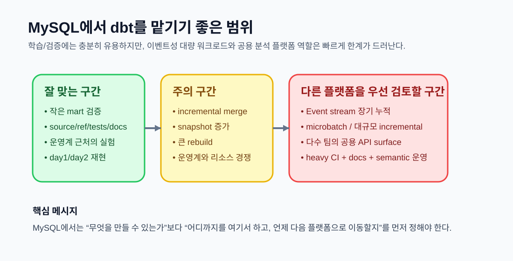

MySQL 플레이북은 DuckDB 플레이북과 목적이 다르다. DuckDB 장이 학습과 빠른 반복을 위한 기준 플랫폼을 설명했다면, 이 장은 운영계 데이터와 가까운 곳에서 dbt를 시작해야 하는 현실적 제약 환경을 다룬다.

MySQL은 다음과 같은 상황에서 자주 등장한다.

1. 아직 별도의 DW가 없어서 운영계와 가까운 곳에서 작게 dbt를 시작해야 할 때
2. 애플리케이션 팀이 이미 MySQL을 사용하고 있어, 검증용 마트나 작은 리포트를 같은 인프라 위에서 빠르게 만들고 싶을 때
3. DW 이전 전에 모델링 구조, 테스트, 문서화, 실행 규칙을 먼저 정착시키고 싶을 때

반대로 MySQL은 다음 상황에서는 주의가 크다.

1. 이벤트성 데이터가 빠르게 누적되는 대용량 time-series 처리
2. 무거운 full rebuild를 자주 수행하는 배치 운영
3. snapshot, contracts, docs, CI, 여러 팀의 공용 API surface를 한꺼번에 밀어 넣는 경우
4. 운영계 트랜잭션과 분석 배치가 같은 인스턴스를 경쟁하는 경우

즉, MySQL 플레이북의 핵심은 작게 시작하되, 어디서 경계를 그을지 빨리 아는 것이다.

---

<a id="book-chapters-reference-v3-13-platform-playbook-mysql-md--131-mysql을-플랫폼-플레이북으로-따로-다뤄야-하는-이유"></a>

### 13.1. MySQL을 플랫폼 플레이북으로 따로 다뤄야 하는 이유

<a id="book-chapters-reference-v3-13-platform-playbook-mysql-md--1311-mysql은-가능하지만-신중해야-하는-선택지다"></a>

#### 13.1.1. MySQL은 “가능하지만 신중해야 하는” 선택지다

dbt에서 MySQL은 사용할 수 있다. 다만 이 장의 관점은 “기능 체크리스트가 몇 개 켜져 있느냐”가 아니라, 실제 운영에서 어떤 식으로 안전하게 사용할 수 있느냐에 있다.

현실적으로 MySQL 위의 dbt는 다음 세 수준으로 나눠서 생각하는 편이 좋다.

1. 학습/검증 수준
   작은 예제를 올려 구조를 시험하고, source / ref / tests / docs 감각을 익힌다.

2. 제약된 내부 마트 수준
   작은 fact/dim, 일간 리포트, 재현 가능한 검증용 모델을 만든다.

3. 확장 한계 구간
   이벤트성 대량 데이터, 무거운 incremental merge, aggressive CI, 다수 팀의 공용 semantic surface가 몰리면 다른 플랫폼을 검토한다.

이 장은 세 번째 구간으로 넘어가기 전에 어떤 신호를 보아야 하는지까지 같이 설명한다.

<a id="book-chapters-reference-v3-13-platform-playbook-mysql-md--1312-duckdb와-비교했을-때-mysql의-위치"></a>

#### 13.1.2. DuckDB와 비교했을 때 MySQL의 위치

DuckDB는 학습을 위해 이상적이지만, 운영계 애플리케이션 데이터와는 거리가 있다. 반대로 MySQL은 운영계와 가깝지만, 분석 전용 플랫폼은 아니다.
따라서 두 장의 목적은 다르다.

- DuckDB 장: 개념을 가장 쉽게 검증하는 기준 환경
- MySQL 장: 운영계 제약 속에서 dbt를 어떻게 작고 안전하게 시작할지에 대한 지침

<a id="book-chapters-reference-v3-13-platform-playbook-mysql-md--1313-이-장에서-볼-질문"></a>

#### 13.1.3. 이 장에서 볼 질문

이 장은 다음 질문에 답하는 구조로 읽으면 좋다.

1. MySQL에서 dbt를 시작할 때 가장 먼저 확인해야 할 환경 변수와 profile은 무엇인가?
2. 세 casebook를 MySQL에서 어느 범위까지 시험할 수 있는가?
3. 어떤 materialization과 테스트 전략이 안전한가?
4. MySQL 위에서 오래 버티기보다 다른 플랫폼으로 옮겨야 할 시점은 언제인가?

---

<a id="book-chapters-reference-v3-13-platform-playbook-mysql-md--132-mysql-adapter와-지원-표면을-먼저-이해하기"></a>

### 13.2. MySQL adapter와 지원 표면을 먼저 이해하기

<a id="book-chapters-reference-v3-13-platform-playbook-mysql-md--1321-community-plugin이라는-사실부터-받아들여야-한다"></a>

#### 13.2.1. Community plugin이라는 사실부터 받아들여야 한다

MySQL adapter는 “쓸 수 있지만, dbt Labs가 직접 지원하는 핵심 조합”으로 보기는 어렵다.
이 말은 곧 다음을 뜻한다.

1. 설치와 연결은 가능해도, 항상 다른 adapter와 같은 수준의 검증 범위를 기대하면 안 된다.
2. 공식 문서와 더불어 adapter repo 이슈, 실제 실행 로그, 사내 검증 결과를 함께 봐야 한다.
3. 책에 나오는 예제 역시 “모든 기능을 MySQL에서 완벽 재현한다”보다 어디까지 실험 가능하고 어디가 위험한지에 초점을 맞춰야 한다.

<a id="book-chapters-reference-v3-13-platform-playbook-mysql-md--1322-버전과-표면"></a>

#### 13.2.2. 버전과 표면

실무에서 가장 먼저 점검할 것은 아래다.

- MySQL 5.7인지, 8.0인지
- MariaDB인지
- snapshot을 쓸 계획이 있는지
- CTE가 필요한 ephemeral을 쓸지
- docs generate / tests / seeds / sources가 어느 정도까지 필요한지

이 장에서는 MySQL 8.0 또는 MariaDB 10.5+를 우선 권장하고, 5.7은 유지보수/레거시 호환 관점으로만 본다.

<a id="book-chapters-reference-v3-13-platform-playbook-mysql-md--1323-왜-버전-차이가-중요한가"></a>

#### 13.2.3. 왜 버전 차이가 중요한가

MySQL 8.0 이상이면 CTE 기반 로직과 ephemeral을 상대적으로 더 자연스럽게 다룰 수 있다. 반대로 5.7 환경은 snapshot과 timestamp 동작, sql_mode, CTE 미지원 등으로 인해 모델링 선택 폭이 줄어든다.
즉, “같은 MySQL”이라도 책에서의 권장 전략은 버전에 따라 달라진다.

---

<a id="book-chapters-reference-v3-13-platform-playbook-mysql-md--133-profile-연결-첫-실행"></a>

### 13.3. profile, 연결, 첫 실행

<a id="book-chapters-reference-v3-13-platform-playbook-mysql-md--1331-가장-먼저-보는-profile-예시"></a>

#### 13.3.1. 가장 먼저 보는 profile 예시

아래는 시작점으로 가장 단순한 예시다.

```yaml
my_mysql:
  target: dev
  outputs:
    dev:
      type: mysql
      server: localhost
      port: 3306
      schema: analytics
      username: analytics
      password: "{{ env_var('DBT_ENV_SECRET_MYSQL_PASSWORD') }}"
      ssl_disabled: true
```

이 예시를 쓸 때의 핵심은 다음 세 가지다.

1. `schema`는 dbt가 relation을 생성할 데이터베이스 이름 역할을 한다.
2. 민감한 값은 처음부터 `env_var()`로 분리한다.
3. 운영 환경과 같은 인스턴스를 쓰더라도, 개발용 schema를 분리해 운영계 테이블과 직접 충돌하지 않게 한다.

> companion snippet: `../codes/04_chapter_snippets/ch13/profiles.mysql.example.yml`

<a id="book-chapters-reference-v3-13-platform-playbook-mysql-md--1332-첫-연결-확인-순서"></a>

#### 13.3.2. 첫 연결 확인 순서

MySQL에서 가장 먼저 해야 할 일은 모델을 쓰는 것이 아니라, 연결과 권한을 확인하는 것이다.

1. `dbt debug`
2. `SHOW DATABASES`
3. 대상 schema에 create / drop / alter가 가능한지 확인
4. 샘플 seed 또는 작은 staging 모델로 relation 생성 테스트
5. `dbt docs generate`까지 한 번 돌려 metadata surface를 확인

이 순서를 지키면 “SQL이 문제인지, 연결/권한이 문제인지”를 빨리 분리할 수 있다.

<a id="book-chapters-reference-v3-13-platform-playbook-mysql-md--1333-운영계와-같은-인스턴스를-쓸-때의-원칙"></a>

#### 13.3.3. 운영계와 같은 인스턴스를 쓸 때의 원칙

운영계 MySQL과 같은 인스턴스를 쓰는 경우, 아래 원칙을 먼저 팀 규칙으로 정해 두는 편이 낫다.

1. 무거운 full rebuild는 비업무 시간대에만 수행
2. 개발자는 자신만의 schema를 사용
3. 큰 join과 rebuild는 꼭 필요한 범위만 `--select`
4. schema 변경이 필요한 모델은 사전 검토
5. 장시간 잠금을 유발할 가능성이 있는 모델은 다른 플랫폼 이전 후보로 분류

---

<a id="book-chapters-reference-v3-13-platform-playbook-mysql-md--134-mysql에서-materialization을-고를-때의-기준"></a>

### 13.4. MySQL에서 materialization을 고를 때의 기준

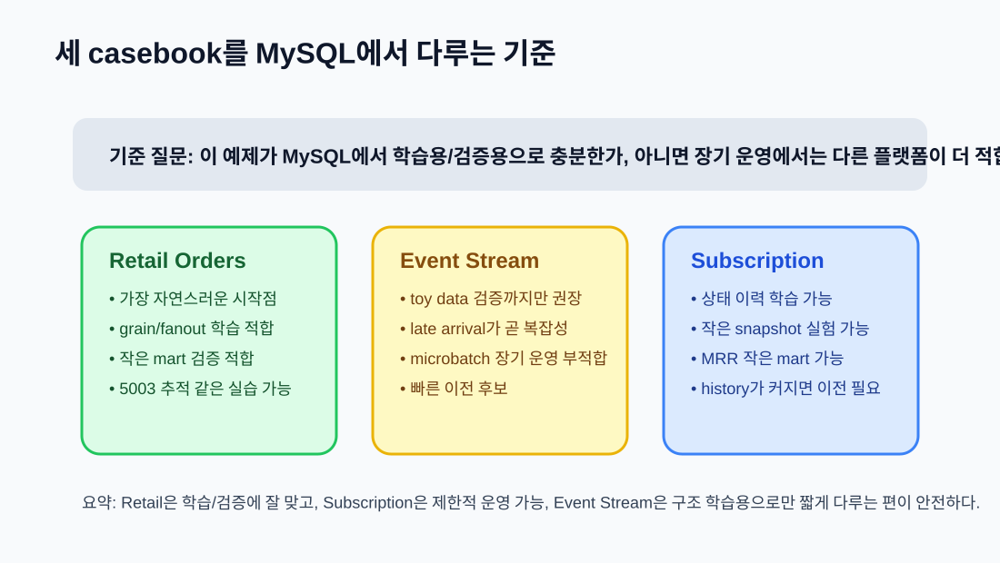

<a id="book-chapters-reference-v3-13-platform-playbook-mysql-md--1341-view부터-시작하되-marts는-table을-신중하게-쓴다"></a>

#### 13.4.1. view부터 시작하되, marts는 table을 신중하게 쓴다

MySQL에서 가장 무난한 출발점은 대체로 이렇다.

- staging: `view`
- intermediate: 작은 경우 `view`, 재사용 빈도가 높으면 `table`
- marts: 작은 검증용 `table`

이렇게 시작하면 모델의 구조는 충분히 익히면서도, 매 실행마다 무거운 물리 재생성을 최소화할 수 있다.

<a id="book-chapters-reference-v3-13-platform-playbook-mysql-md--1342-incremental은-성능-최적화이지-설계-보정이-아니다"></a>

#### 13.4.2. incremental은 “성능 최적화”이지 “설계 보정”이 아니다

MySQL 위에서 incremental을 도입할 때는 특히 더 보수적으로 판단하는 편이 좋다.
운영계와 가까운 플랫폼에서는 “조금 더 빨라 보인다”는 이유만으로 incremental을 빨리 붙이면 나중에 디버깅 비용이 더 커지기 쉽다.

먼저 확인해야 할 질문은 다음이다.

1. append-only인가?
2. late-arriving data가 있는가?
3. update가 자주 일어나는가?
4. `unique_key`를 source와 target 모두에서 안정적으로 보장할 수 있는가?
5. merge/replace 성격의 작업이 실제로 운영계에 부담을 주지 않는가?

<a id="book-chapters-reference-v3-13-platform-playbook-mysql-md--1343-ephemeral-사용-기준"></a>

#### 13.4.3. ephemeral 사용 기준

ephemeral은 작은 helper logic를 인라인하기에는 편하지만, MySQL에서는 버전과 CTE 지원 여부를 고려해야 한다.
따라서 이 장의 기준은 다음과 같다.

- MySQL 8.0 이상: 작은 reusable helper에 한해 제한적으로 검토
- MySQL 5.7: ephemeral보다 view/table로 명시화하는 쪽을 기본 전략으로 본다

<a id="book-chapters-reference-v3-13-platform-playbook-mysql-md--1344-snapshot은-버전과-timestamp-설정을-먼저-확인한다"></a>

#### 13.4.4. snapshot은 버전과 timestamp 설정을 먼저 확인한다

MySQL에서 snapshot을 쓸 때는 “syntax가 맞는가”보다 “서버 설정과 timestamp 동작이 안전한가”가 더 중요하다.
특히 5.7 계열에서는 timestamp 기본값과 자동 갱신 규칙 때문에 예기치 않은 동작이 생길 수 있으므로, subscription casebook 같은 상태 추적 모델은 사전 검증이 필요하다.

---

<a id="book-chapters-reference-v3-13-platform-playbook-mysql-md--135-세-casebook를-mysql에서-어떻게-진행할까"></a>

### 13.5. 세 casebook를 MySQL에서 어떻게 진행할까

<a id="book-chapters-reference-v3-13-platform-playbook-mysql-md--1351-casebook-i--retail-orders"></a>

#### 13.5.1. Casebook I · Retail Orders

Retail Orders는 MySQL에서 가장 무난하게 실험할 수 있는 예제다.

왜냐하면:

1. grain이 비교적 명확하다.
   `orders`는 주문 grain, `order_items`는 주문 라인 grain으로 나뉜다.

2. day1/day2 변경도 설명하기 쉽다.
   상태값, 금액, 새로운 주문 추가 같은 변화를 작은 범위에서 재현할 수 있다.

3. 테스트와 docs도 비교적 자연스럽다.
   `not_null`, `unique`, `relationships`, 간단한 singular test를 붙이기 좋다.

MySQL에서 Retail Orders를 돌릴 때의 권장 전략은 이렇다.

- raw bootstrap은 작은 SQL 파일로 로드
- `stg_orders`, `stg_order_items`, `stg_products`, `stg_customers`는 view
- `int_order_lines`는 필요 시 table
- `fct_orders`, `dim_customers`는 작은 mart table
- `order_id = 5003` 같은 대표 주문을 추적하며 결과 확인

<a id="book-chapters-reference-v3-13-platform-playbook-mysql-md--1352-casebook-ii--event-stream"></a>

#### 13.5.2. Casebook II · Event Stream

Event Stream은 MySQL에서 “될 수는 있지만 권장 범위가 좁다”는 사실을 보여 주는 예제다.

이유는 간단하다.

1. 이벤트는 append-only라 빠르게 커진다.
2. session/day grain 계산이 무거워질 수 있다.
3. late-arriving data까지 고려하면 incremental 설계가 금방 복잡해진다.
4. 운영계와 같은 인스턴스라면 리소스 경합이 빨리 드러난다.

그래서 MySQL에서 Event Stream을 다룰 때는 아래 수준까지만 추천한다.

- 작은 day1/day2 데이터를 사용한 모델 구조 검증
- event → session → daily grain의 개념 훈련
- freshness / selector / runbook 연습
- `dbt build -s` 범위 제어 훈련

반대로 대량 스트림과 microbatch 운영은 BigQuery, ClickHouse, Snowflake, Trino 계열 플레이북에서 본격적으로 다루는 편이 낫다.

<a id="book-chapters-reference-v3-13-platform-playbook-mysql-md--1353-casebook-iii--subscription--billing"></a>

#### 13.5.3. Casebook III · Subscription & Billing

Subscription & Billing은 MySQL에서 상태 추적과 작은 마트 실험에는 의미가 있다.
특히 다음이 가능하다.

- subscription status history 실험
- 작은 snapshot 검증
- `fct_mrr`와 유사한 작은 mart 설계
- contracts / versions를 “공용 surface” 관점으로 맛보기

다만 이 예제는 시간이 지나면 곧 아래 문제가 나온다.

1. status history가 쌓인다.
2. invoice와 current subscription 상태를 함께 다루게 된다.
3. 재계산 범위가 커진다.
4. finance / BI / ops가 같은 모델을 참조하기 시작한다.

이쯤 되면 MySQL만으로 버티기보다, 별도 DW나 query layer 위로 옮겨 가는 기준을 세워야 한다.

---

<a id="book-chapters-reference-v3-13-platform-playbook-mysql-md--136-mysql-위의-테스트-문서화-품질-운영"></a>

### 13.6. MySQL 위의 테스트, 문서화, 품질 운영

<a id="book-chapters-reference-v3-13-platform-playbook-mysql-md--1361-기본-테스트를-더-엄격하게-본다"></a>

#### 13.6.1. 기본 테스트를 더 엄격하게 본다

MySQL은 운영계와 가까운 경우가 많기 때문에, 모델이 작더라도 기본 테스트를 더 엄격하게 붙이는 편이 좋다.

최소 권장:

1. primary/business key `not_null`
2. primary/business key `unique`
3. fact → dim `relationships`
4. 상태값 `accepted_values`

특히 Retail Orders와 Subscription 예제에서는 key 컬럼 품질을 먼저 잡아야 한다.

<a id="book-chapters-reference-v3-13-platform-playbook-mysql-md--1362-singular-test를-자주-활용한다"></a>

#### 13.6.2. singular test를 자주 활용한다

MySQL 플레이북에서는 generic test만으로 부족한 경우가 많다.
예를 들면:

- fanout으로 인해 주문 금액이 부풀어지지 않았는가
- cancellation 상태가 MRR에 잘못 포함되지 않았는가
- 특정 날짜 범위에만 들어와야 할 데이터가 섞이지 않았는가

이런 건 singular test로 풀어 주는 편이 더 명확하다.

<a id="book-chapters-reference-v3-13-platform-playbook-mysql-md--1363-docs는-나중에가-아니라-처음부터-남긴다"></a>

#### 13.6.3. docs는 “나중에”가 아니라 처음부터 남긴다

MySQL은 DW처럼 자동 메타데이터 체계가 화려하지 않을 수 있으므로, dbt docs와 YAML 설명의 가치가 오히려 커진다.
특히 운영계 테이블과 분석용 모델의 경계를 팀이 헷갈리지 않게 하려면, source / model / column 설명이 더 중요하다.

---

<a id="book-chapters-reference-v3-13-platform-playbook-mysql-md--137-운영-원칙-mysql에서-버틸-수-있는-범위와-버티면-안-되는-범위"></a>

### 13.7. 운영 원칙: MySQL에서 버틸 수 있는 범위와 버티면 안 되는 범위

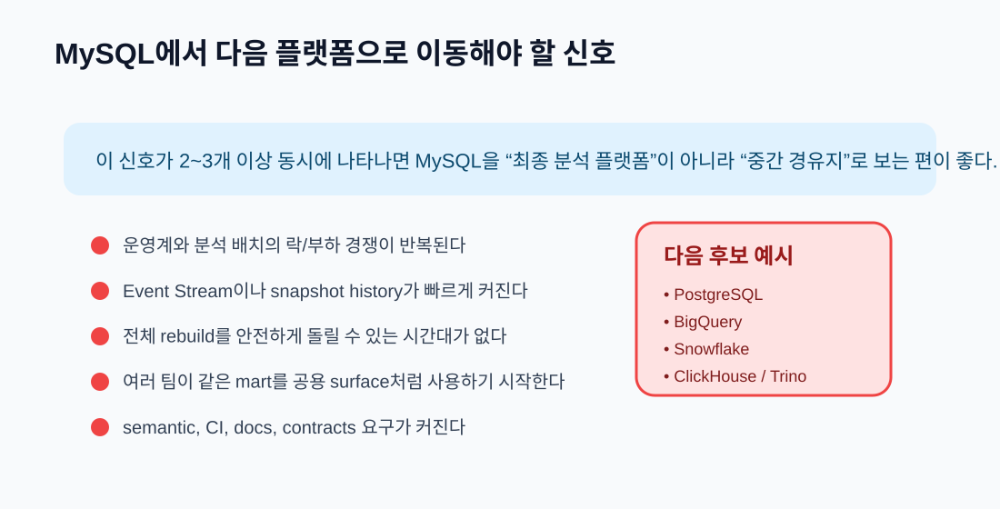

<a id="book-chapters-reference-v3-13-platform-playbook-mysql-md--1371-mysql에서-계속-버틸-수-있는-경우"></a>

#### 13.7.1. MySQL에서 계속 버틸 수 있는 경우

다음 조건이면 MySQL 위에서 dbt를 당분간 유지할 수 있다.

1. 일 배치가 작고 범위가 제한적이다.
2. marts 수가 많지 않다.
3. 주된 목적이 공용 DW라기보다 검증용/내부용이다.
4. 운영계와의 리소스 충돌이 관리 가능하다.
5. docs / tests / selectors / basic CI 정도로도 충분하다.

<a id="book-chapters-reference-v3-13-platform-playbook-mysql-md--1372-별도-플랫폼-이전-신호"></a>

#### 13.7.2. 별도 플랫폼 이전 신호

아래 신호가 보이면 MySQL을 “영구 플랫폼”으로 보기보다 중간 경유지로 봐야 한다.

1. 이벤트성 데이터가 빠르게 누적된다.
2. snapshot과 상태 이력이 계속 커진다.
3. 여러 팀이 같은 모델을 공용 API처럼 쓰기 시작한다.
4. CI에서 `state`, `defer`, `clone`, docs, semantic surface까지 요구한다.
5. 운영계 락/부하 이슈가 반복된다.
6. full rebuild를 더 이상 안전하게 돌릴 수 없다.
7. 모델 성능보다 인프라 병목이 더 자주 문제된다.

이 시점에는 PostgreSQL, BigQuery, Snowflake, ClickHouse, Trino 중에서 실제 워크로드에 맞는 다음 플랫폼을 고르는 편이 좋다.

---

<a id="book-chapters-reference-v3-13-platform-playbook-mysql-md--138-mysql-부트스트랩과-실행-루프"></a>

### 13.8. MySQL 부트스트랩과 실행 루프

<a id="book-chapters-reference-v3-13-platform-playbook-mysql-md--1381-예제별-bootstrap-경로"></a>

#### 13.8.1. 예제별 bootstrap 경로

이 repo의 companion pack에서는 세 casebook 모두 MySQL용 day1/day2 스크립트를 분리해서 둘 수 있다.

| 예제 | day1 bootstrap | day2 변경 |
| --- | --- | --- |
| Retail Orders | `03_platform_bootstrap/retail/mysql/setup_day1.sql` | `03_platform_bootstrap/retail/mysql/apply_day2.sql` |
| Event Stream | `03_platform_bootstrap/events/mysql/setup_day1.sql` | `03_platform_bootstrap/events/mysql/apply_day2.sql` |
| Subscription & Billing | `03_platform_bootstrap/subscription/mysql/setup_day1.sql` | `03_platform_bootstrap/subscription/mysql/apply_day2.sql` |

<a id="book-chapters-reference-v3-13-platform-playbook-mysql-md--1382-가장-현실적인-실행-순서"></a>

#### 13.8.2. 가장 현실적인 실행 순서

처음 MySQL에서 세 예제를 돌릴 때는 아래 순서를 추천한다.

1. bootstrap SQL 실행
2. `dbt debug`
3. `dbt seed` (필요 시)
4. `dbt build -s staging`
5. `dbt build -s marts`
6. `dbt test -s marts+`
7. `dbt docs generate`

이 흐름을 지키면 “모든 걸 한 번에 build”하는 것보다 실패 범위를 더 빨리 좁힐 수 있다.

<a id="book-chapters-reference-v3-13-platform-playbook-mysql-md--1383-안전한-개발-루틴"></a>

#### 13.8.3. 안전한 개발 루틴

- `dbt ls -s ...`로 선택 범위를 먼저 확인한다.
- 전체 재실행보다 필요한 모델만 `--select`.
- 운영계와 같은 인스턴스라면 대량 rebuild 금지.
- snapshot은 작은 범위에서 먼저 검증.
- Event Stream은 반드시 toy data부터.
- MRR이나 semantic-ready surface는 작은 mart에서부터 시작.

---

<a id="book-chapters-reference-v3-13-platform-playbook-mysql-md--139-실수와-안티패턴"></a>

### 13.9. 실수와 안티패턴

<a id="book-chapters-reference-v3-13-platform-playbook-mysql-md--1391-운영계와-같은-인스턴스에서-무거운-rebuild를-반복하는-것"></a>

#### 13.9.1. 운영계와 같은 인스턴스에서 무거운 rebuild를 반복하는 것

이건 가장 흔한 실수다. dbt가 잘못이 아니라, 플랫폼에 맞지 않는 실행 전략이 문제다.

<a id="book-chapters-reference-v3-13-platform-playbook-mysql-md--1392-event-stream을-mysql에서-장기-운영-플랫폼처럼-다루는-것"></a>

#### 13.9.2. Event Stream을 MySQL에서 장기 운영 플랫폼처럼 다루는 것

작은 검증은 가능해도, 이벤트 로그의 장기 축적과 빠른 증분은 MySQL의 대표 강점이 아니다.

<a id="book-chapters-reference-v3-13-platform-playbook-mysql-md--1393-snapshot과-timestamp-설정을-검증하지-않고-바로-운영에-넣는-것"></a>

#### 13.9.3. snapshot과 timestamp 설정을 검증하지 않고 바로 운영에 넣는 것

특히 5.7 계열은 timestamp 관련 기본 동작을 꼭 먼저 확인해야 한다.

<a id="book-chapters-reference-v3-13-platform-playbook-mysql-md--1394-버전-제약을-무시하고-ephemeral을-남발하는-것"></a>

#### 13.9.4. 버전 제약을 무시하고 ephemeral을 남발하는 것

ephemeral은 편하지만, MySQL 버전에 따라 기대한 방식으로 동작하지 않을 수 있다.

<a id="book-chapters-reference-v3-13-platform-playbook-mysql-md--1395-일단-mysql에서-시작했으니-계속-mysql이어야-한다고-생각하는-것"></a>

#### 13.9.5. “일단 MySQL에서 시작했으니 계속 MySQL이어야 한다”고 생각하는 것

이 장의 목적은 MySQL을 만능 분석 플랫폼으로 미화하는 것이 아니라, 작게 시작하고 옮겨 갈 시점을 판단하는 기준을 주는 데 있다.

---

<a id="book-chapters-reference-v3-13-platform-playbook-mysql-md--1310-직접-해보기"></a>

### 13.10. 직접 해보기

<a id="book-chapters-reference-v3-13-platform-playbook-mysql-md--13101-retail-orders를-mysql에서-완주해-보기"></a>

#### 13.10.1. Retail Orders를 MySQL에서 완주해 보기

1. `setup_day1.sql` 실행
2. `dbt build -s stg_orders+`
3. `dbt test -s fct_orders+`
4. `order_id = 5003`을 기준으로 결과 추적
5. `apply_day2.sql` 실행 후 snapshot 또는 재계산 비교

<a id="book-chapters-reference-v3-13-platform-playbook-mysql-md--13102-event-stream을-toy-data로만-검증해-보기"></a>

#### 13.10.2. Event Stream을 toy data로만 검증해 보기

1. 작은 event 데이터로 bootstrap
2. event/day grain의 차이 확인
3. lookback 없이 먼저 daily mart를 만들고
4. 그 다음 late-arriving data를 넣어 결과 차이를 본다

<a id="book-chapters-reference-v3-13-platform-playbook-mysql-md--13103-subscription-casebook에서-status-history를-검증해-보기"></a>

#### 13.10.3. Subscription casebook에서 status history를 검증해 보기

1. day1 bootstrap
2. current subscription mart 생성
3. day2 status 변경 적용
4. snapshot 또는 current mart 결과 비교
5. `fct_mrr`에 포함/제외되어야 할 상태를 singular test로 검증

---

<a id="book-chapters-reference-v3-13-platform-playbook-mysql-md--1311-체크리스트"></a>

### 13.11. 체크리스트

<a id="book-chapters-reference-v3-13-platform-playbook-mysql-md--13111-환경-체크리스트"></a>

#### 13.11.1. 환경 체크리스트

- MySQL 8.0 / 5.7 / MariaDB 중 무엇인가?
- 운영계와 같은 인스턴스인가?
- dev schema를 별도로 분리했는가?
- `dbt debug`가 통과하는가?
- bootstrap SQL이 작은 데이터로 먼저 검증되었는가?

<a id="book-chapters-reference-v3-13-platform-playbook-mysql-md--13112-모델링-체크리스트"></a>

#### 13.11.2. 모델링 체크리스트

- Retail Orders에서는 grain을 명확히 분리했는가?
- Event Stream을 toy data 범위로 제한했는가?
- Subscription의 상태 이력을 어디까지 MySQL에 둘지 정했는가?
- incremental / snapshot을 넣기 전에 key와 timestamp 규칙을 검증했는가?

<a id="book-chapters-reference-v3-13-platform-playbook-mysql-md--13113-운영-체크리스트"></a>

#### 13.11.3. 운영 체크리스트

- full rebuild가 운영계에 부담을 주지 않는가?
- heavy CI가 필요한 단계인가?
- docs / tests / contracts / semantic surface 요구가 커지고 있는가?
- 별도 DW 이전 신호가 이미 나오고 있지 않은가?

---

<a id="book-chapters-reference-v3-13-platform-playbook-mysql-md--1312-마무리"></a>

### 13.12. 마무리

MySQL 플레이북의 핵심은 기술적으로 “가능하다/불가능하다”를 따지는 데 있지 않다.
핵심은 이 플랫폼 위에서 어디까지를 안전하게 맡기고, 어느 시점에 다음 플랫폼으로 넘어갈지를 판단하는 기준을 배우는 데 있다.

세 casebook를 기준으로 보면 다음처럼 정리할 수 있다.

1. Retail Orders
   MySQL에서 가장 자연스럽게 시작할 수 있다.

2. Event Stream
   구조와 모델링 감각은 익히되, 장기 운영 플랫폼으로 보기에는 제약이 빨리 드러난다.

3. Subscription & Billing
   상태 이력과 작은 mart는 가능하지만, 공용 API surface와 history가 커질수록 다음 단계 플랫폼이 필요해진다.

따라서 MySQL은 이 책에서 “최종 답”이라기보다, 제약이 있는 현실에서 dbt를 시작하고 운영 원칙을 익히는 플랫폼으로 이해하는 편이 가장 정확하다.

---

<a id="book-chapters-reference-v3-14-platform-playbook-postgresql-md"></a>

장별 원고: [chapters/reference-v3/14-platform-playbook-postgresql.md](chapters/reference-v3/14-platform-playbook-postgresql.md)

<a id="book-chapters-reference-v3-14-platform-playbook-postgresql-md--chapter-14--platform-playbook--postgresql"></a>

## CHAPTER 14 · Platform Playbook · PostgreSQL

> **마당마켓 본편 연결:** [J13 · 메달리온 말고 다른 설계를 선택해야 할 때](#book-journey-13-architecture-alternatives-md)에서 같은 상점의 누적 실습으로 돌아갈 수 있다. 이 참고편의 `codes/` 스니펫에는 독립 fixture가 포함되어 있으며 본편 `lab/`의 P1~P5와 섞지 않는다. 플랫폼별 구문·기능은 실행 버전에 맞춰 재확인한다.


PostgreSQL은 이 책에서 DuckDB 다음 단계의 기준 플랫폼이다.
DuckDB가 “로컬에서 가장 빠르게 개념을 익히는 환경”이라면, PostgreSQL은 스키마, 권한, 트랜잭션, 인덱스, 운영 시간대 같은 현실적인 제약을 가장 이해하기 쉬운 형태로 드러내는 플랫폼이다.

이 장의 목적은 단순히 `profiles.yml` 예시를 하나 보여주는 데 있지 않다.
PostgreSQL 위에서 세 casebook — `Retail Orders`, `Event Stream`, `Subscription & Billing` — 을 어떤 방식으로 올리고, 어느 지점에서 구조를 바꾸고, 어떤 순간에 더 큰 분석 플랫폼으로 옮겨야 하는지를 끝까지 설명하는 데 있다.

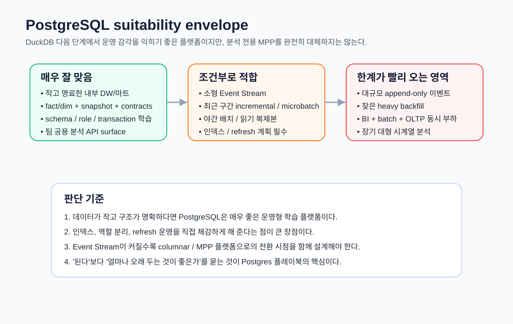

<a id="book-chapters-reference-v3-14-platform-playbook-postgresql-md--141-postgresql을-이-책의-플레이북에-포함하는-이유"></a>

### 14.1. PostgreSQL을 이 책의 플레이북에 포함하는 이유

<a id="book-chapters-reference-v3-14-platform-playbook-postgresql-md--1411-postgresql이-잘-맞는-상황"></a>

#### 14.1.1. PostgreSQL이 잘 맞는 상황

PostgreSQL은 다음과 같은 상황에서 특히 좋다.

1. dbt를 DuckDB 다음 단계에서 익히고 싶을 때
2. 작고 명료한 내부 DW/마트를 운영할 때
3. `schema`, `role`, `transaction`, `index`를 포함한 운영 감각을 배우고 싶을 때
4. 애플리케이션 DB와 비슷한 세계 안에서 변환 작업의 부담을 체감하고 싶을 때
5. BI용 소형 fact/dim, 계약형 데이터셋(contracted dataset), 팀 공용 마트를 만들고 싶을 때

dbt 문서 기준으로 PostgreSQL은 dbt Labs가 유지하는 supported adapter이고, `dbt-postgres`는 `dbt-core`와 별도로 설치한다. `profiles.yml`에는 `host`, `user`, `password`, `port`, `dbname` 또는 `database`, `schema`, `threads` 외에 `keepalives_idle`, `connect_timeout`, `retries`, `search_path`, `role`, `sslmode` 등도 둘 수 있다.
즉, 이 장은 “연결은 쉽지만 운영 감각은 훨씬 빨리 생기는 플랫폼”이라는 전제에서 PostgreSQL을 다룬다.

<a id="book-chapters-reference-v3-14-platform-playbook-postgresql-md--1412-postgresql이-덜-맞는-상황"></a>

#### 14.1.2. PostgreSQL이 덜 맞는 상황

반대로 다음과 같은 상황에서는 PostgreSQL이 한계에 빨리 닿을 수 있다.

1. 수십억 건의 append-only 이벤트를 장기간 보관하며 고빈도 분석을 돌릴 때
2. BI와 ad hoc 분석, 대규모 backfill이 같은 인스턴스에 몰릴 때
3. 잦은 full rebuild, 넓은 merge, 대형 snapshot, 대용량 sessionization이 필요할 때
4. OLTP 인스턴스와 동일한 자원을 공유하면서 무거운 dbt 배치를 돌릴 때

Postgres는 범용 SQL 엔진으로 매우 강력하지만, 분석 전용 MPP/columnar 플랫폼처럼 큰 스캔과 병렬 분석을 위해 설계된 세계는 아니다.
그래서 이 장의 핵심 질문은 단순하다.

> “PostgreSQL에서도 되는가?”보다
> “PostgreSQL에 얼마나 오래 머무는 게 좋은가?”

<a id="book-chapters-reference-v3-14-platform-playbook-postgresql-md--142-로컬서버-환경에서-postgresql-연결하기"></a>

### 14.2. 로컬/서버 환경에서 PostgreSQL 연결하기

<a id="book-chapters-reference-v3-14-platform-playbook-postgresql-md--1421-설치와-adapter"></a>

#### 14.2.1. 설치와 adapter

```bash
python -m pip install dbt-core dbt-postgres
```

Postgres는 dbt Labs가 유지하는 supported adapter이므로, 학습용/소형 운영용 모두에 비교적 안전한 선택이다.

<a id="book-chapters-reference-v3-14-platform-playbook-postgresql-md--1422-최소-profilesyml"></a>

#### 14.2.2. 최소 `profiles.yml`

아래는 이 책에서 가장 기본이 되는 profile 예시다.

```yaml
dbt_all_in_one:
  target: dev
  outputs:
    dev:
      type: postgres
      host: localhost
      port: 5432
      dbname: analytics
      schema: dbt_dev
      user: analytics
      password: "{{ env_var('DBT_ENV_SECRET_PG_PASSWORD') }}"
      threads: 4
      connect_timeout: 10
      retries: 1
      keepalives_idle: 0
      sslmode: prefer
```

파일 예시는 `codes/04_chapter_snippets/ch14/profiles.postgres.example.yml`에 있다.

<a id="book-chapters-reference-v3-14-platform-playbook-postgresql-md--1423-search_path와-role은-언제-건드려야-하나"></a>

#### 14.2.3. `search_path`와 `role`은 언제 건드려야 하나

문서 기준으로 `search_path`를 커스텀 값으로 바꾸는 것은 일반적인 사용에서는 필요하지도, 권장되지도 않는다.
dbt는 가능한 한 relation을 완전한 형태(database / schema / identifier)로 다루는 편이 안전하다.
즉, `search_path`로 “암묵적인 기본 스키마 탐색”을 만들기보다, 명시적 relation과 `source()` / `ref()`를 유지하는 편이 좋다.

`role`은 dev와 prod에서 수행 권한을 분리해야 할 때 유용하다.
예를 들어 로컬 개발자는 `dbt_dev` 스키마에만 쓰기 권한이 있고, 배포 환경은 `analytics` 스키마에만 쓰기 권한이 있게 나누면, 실수로 운영 스키마를 건드릴 위험을 크게 줄일 수 있다.

<a id="book-chapters-reference-v3-14-platform-playbook-postgresql-md--1424-첫-연결-전-preflight-체크"></a>

#### 14.2.4. 첫 연결 전 preflight 체크

`dbt debug` 전에 아래 SQL로 최소 상태를 확인해 두면 좋다.

```sql
select version();
select current_user;
select current_database();
select current_schema();
show search_path;
```

파일: `codes/04_chapter_snippets/ch14/postgres_preflight.sql`

<a id="book-chapters-reference-v3-14-platform-playbook-postgresql-md--143-postgresql에서-스키마와-권한을-어떻게-설계할까"></a>

### 14.3. PostgreSQL에서 스키마와 권한을 어떻게 설계할까


<a id="book-chapters-reference-v3-14-platform-playbook-postgresql-md--1431-기본-권장-구조"></a>

#### 14.3.1. 기본 권장 구조

가장 단순한 권장 구조는 다음과 같다.

- `raw` : 원천 적재 영역
- `dbt_dev_<user>` 또는 `dbt_dev` : 개인/팀 개발 스키마
- `analytics` : 배포된 분석용 스키마
- `snapshots` : 상태 이력 전용 스키마
- `audit` : 운영 로그, quality triage, failure table 보관 스키마

Postgres에서는 schema 개념과 권한 모델이 명확하므로, 이 구조만 잘 잡아도 dbt의 운영 감각을 빠르게 배울 수 있다.

<a id="book-chapters-reference-v3-14-platform-playbook-postgresql-md--1432-애플리케이션-db와-분리하는-게-좋은-이유"></a>

#### 14.3.2. 애플리케이션 DB와 분리하는 게 좋은 이유

애플리케이션이 쓰는 테이블과 dbt가 만드는 변환 결과를 같은 schema에 섞어 두면 다음 문제가 생긴다.

1. 실수로 raw/operational table을 직접 덮어쓸 위험
2. 백업/권한/모니터링 정책이 섞임
3. app query와 analytics query가 서로의 성능에 영향을 줌
4. schema-level grants 관리가 어려워짐

가능하면 같은 인스턴스 안이라도 schema는 반드시 분리하는 것이 좋다.
더 좋다면 읽기 복제본, 별도 DB, 별도 인스턴스로 분리한다.

<a id="book-chapters-reference-v3-14-platform-playbook-postgresql-md--144-postgresql에서-materialization을-고르는-기준"></a>

### 14.4. PostgreSQL에서 materialization을 고르는 기준

<a id="book-chapters-reference-v3-14-platform-playbook-postgresql-md--1441-가장-안전한-기본값"></a>

#### 14.4.1. 가장 안전한 기본값

Postgres에서는 아래 기본값으로 시작하는 편이 안전하다.

- `staging` → `view`
- `intermediate` → `view` 또는 작은 reusable table
- `marts` → `table`
- 매우 큰 이벤트성 모델 → `incremental`
- 자주 읽히고 SQL 정의가 안정된 결과 → `materialized_view` 검토

핵심은 DuckDB에서처럼 개념을 단순하게 시작하되, Postgres에서는 조회 성능과 재생성 비용이 더 빨리 문제로 드러난다는 점이다.

<a id="book-chapters-reference-v3-14-platform-playbook-postgresql-md--1442-postgres에서-지원되는-incremental-전략"></a>

#### 14.4.2. Postgres에서 지원되는 incremental 전략

dbt 문서 기준으로 Postgres adapter는 다음 incremental 전략을 지원한다.

- `append`
- `merge`
- `delete+insert`
- `microbatch`

여기서 practical default는 대개 이렇게 생각하면 된다.

1. 고유 key 없이 append-only이면 `append`
2. 고유 key가 있고 upsert가 필요하면 `merge` 또는 `delete+insert`
3. 시간 컬럼이 분명한 대형 이벤트 스트림이면 `microbatch`

단, `merge`와 `delete+insert`는 기존 행을 읽고 비교하고 갱신하는 비용이 있으므로, 작은 테이블엔 좋지만 매우 큰 테이블에서 만능 해법은 아니다.

<a id="book-chapters-reference-v3-14-platform-playbook-postgresql-md--1443-unlogged는-빠르지만-안전하지-않다"></a>

#### 14.4.3. `unlogged`는 빠르지만 안전하지 않다

Postgres config 문서 기준으로 `unlogged=True`인 테이블은 WAL에 기록되지 않고 replica에도 복제되지 않으므로 일반 테이블보다 빠를 수 있지만, 훨씬 덜 안전하다.

```sql
{{ config(materialized='table', unlogged=True) }}

select ...
```

이 옵션은 다음에만 고려하자.

- 재생성 가능한 임시형 intermediate
- failure 시 다시 만들 수 있는 staging helper table
- 절대 시스템 오브 레코드가 아닌 데이터셋

반대로 아래에는 권장하지 않는다.

- 팀 공용 mart
- audit / logging table
- 중요한 snapshot-like 결과
- 배포 API surface

<a id="book-chapters-reference-v3-14-platform-playbook-postgresql-md--1444-indexes는-postgres-플레이북의-핵심이다"></a>

#### 14.4.4. `indexes`는 Postgres 플레이북의 핵심이다

문서 기준으로 Postgres는 table, incremental, seed, snapshot, materialized view에 `indexes` 설정을 둘 수 있다.
즉, PostgreSQL 플레이북에서 가장 중요한 차별점은 “모델을 어떻게 만들지”뿐 아니라 “어떤 컬럼에 인덱스를 둘지”까지 같이 설계해야 한다는 점이다.

예:

```sql
{{ config(
    materialized='table',
    indexes=[
      {"columns": ["order_id"], "unique": true},
      {"columns": ["customer_id"], "type": "btree"},
      {"columns": ["order_date"], "type": "btree"}
    ]
) }}

select ...
```

파일: `codes/04_chapter_snippets/ch14/retail_orders_indexed_table.sql`

<a id="book-chapters-reference-v3-14-platform-playbook-postgresql-md--1445-materialized_view는-언제-좋은가"></a>

#### 14.4.5. `materialized_view`는 언제 좋은가

Postgres config 문서 기준으로 adapter는 `materialized_view`와 `on_configuration_change`, `indexes`를 지원한다.
하지만 일반 문서 흐름에서 중요한 차이는 이것이다.

- table / incremental / snapshot은 dbt run/build를 통해 데이터가 갱신된다.
- materialized view는 deploy action에 가깝고, refresh 전략은 플랫폼 특성과 운영 방식에 의존한다.
- 그리고 materialized view의 “자동 refresh”는 대부분의 플랫폼에서 논의되지만, Postgres는 그 자동 refresh의 대표 플랫폼이 아니다.

즉, Postgres에서 materialized view는 “자동으로 항상 최신”이라고 생각하면 안 된다.
refresh를 누가 언제 실행할지까지 운영 계획에 포함해야 한다.

예:

```sql
{{ config(
    materialized='materialized_view',
    on_configuration_change='apply',
    indexes=[
      {"columns": ["metric_date"], "type": "btree"},
      {"columns": ["customer_segment"], "type": "btree"}
    ]
) }}

select
    metric_date,
    customer_segment,
    sum(mrr_amount) as mrr_amount
from {{ ref('fct_mrr_v2') }}
group by 1, 2
```

파일: `codes/04_chapter_snippets/ch14/mrr_materialized_view.sql`

<a id="book-chapters-reference-v3-14-platform-playbook-postgresql-md--145-postgresql의-트랜잭션과-hooks"></a>

### 14.5. PostgreSQL의 트랜잭션과 hooks

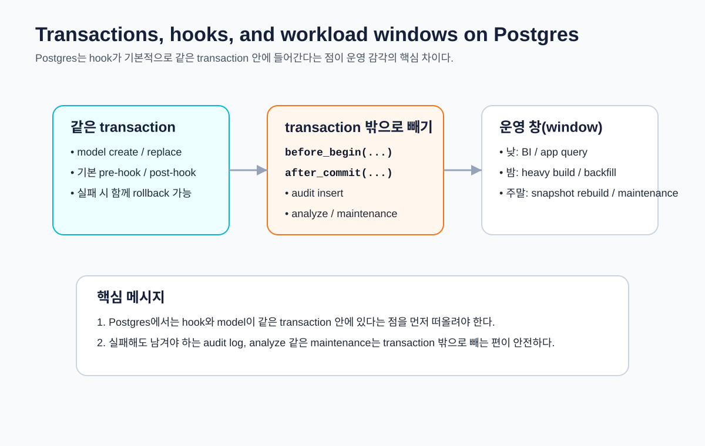

<a id="book-chapters-reference-v3-14-platform-playbook-postgresql-md--1451-왜-postgres-플레이북에서-hooks를-따로-봐야-하나"></a>

#### 14.5.1. 왜 Postgres 플레이북에서 hooks를 따로 봐야 하나

dbt 문서 기준으로 Postgres와 Redshift처럼 transaction을 쓰는 adapter에서는 기본적으로 hooks도 모델 생성과 같은 transaction 안에서 실행된다.
이건 Snowflake나 BigQuery 같은 세계와 체감이 다른 지점이다.

즉, 다음 같은 작업은 의도와 다르게 동작할 수 있다.

- 시작 로그를 `pre-hook`로 남겼는데 모델 실패 시 로그도 함께 롤백됨
- `post-hook`에서 maintenance 작업을 했는데 transaction 문맥 때문에 제한됨
- 실패한 모델의 흔적을 남기고 싶었지만 한 transaction으로 묶여 모두 사라짐

<a id="book-chapters-reference-v3-14-platform-playbook-postgresql-md--1452-언제-transaction-밖으로-빼야-하나"></a>

#### 14.5.2. 언제 transaction 밖으로 빼야 하나

문서 기준으로 Postgres/Redshift에서는 `before_begin` / `after_commit`, 또는 `transaction: false`를 이용해 hook를 transaction 밖에서 실행할 수 있다.

예:

```sql
{{ config(
    pre_hook=before_begin("insert into audit.run_log(model_name, status) values ('{{ this.name }}', 'RUNNING')"),
    post_hook=after_commit("analyze {{ this }}")
) }}
```

파일: `codes/04_chapter_snippets/ch14/post_hook_after_commit.sql`

이 패턴은 다음에 유용하다.

1. 실패해도 남겨야 하는 audit log
2. transaction 안에서 실행하기 곤란한 maintenance SQL
3. 장기 배치 후 통계/분석 정보 갱신

<a id="book-chapters-reference-v3-14-platform-playbook-postgresql-md--146-casebook-i--retail-orders를-postgresql에-올리기"></a>

### 14.6. Casebook I · Retail Orders를 PostgreSQL에 올리기

<a id="book-chapters-reference-v3-14-platform-playbook-postgresql-md--1461-왜-retail-orders는-postgres와-잘-맞는가"></a>

#### 14.6.1. 왜 Retail Orders는 Postgres와 잘 맞는가

Retail Orders는 다음 특징 때문에 Postgres에서 가장 먼저 올리기 좋은 casebook이다.

- row 수가 상대적으로 통제 가능하다
- `order_id`, `customer_id`, `order_date` 같은 key/index 후보가 분명하다
- fact/dim 구조가 직관적이다
- snapshot, tests, contract, semantic-ready surface까지 무리 없이 붙일 수 있다

<a id="book-chapters-reference-v3-14-platform-playbook-postgresql-md--1462-권장-materialization"></a>

#### 14.6.2. 권장 materialization

- `stg_orders`, `stg_order_items`, `stg_customers`, `stg_products` → `view`
- `int_order_lines` → `view` 또는 작은 `table`
- `fct_orders`, `dim_customers` → `table`
- `orders_status_snapshot` → snapshot table
- 반복 조회가 많은 요약 API면 materialized view 검토

<a id="book-chapters-reference-v3-14-platform-playbook-postgresql-md--1463-인덱스-전략"></a>

#### 14.6.3. 인덱스 전략

`fct_orders`에서는 아래 인덱스가 가장 기본이다.

- `order_id` unique
- `customer_id`
- `order_date`

`dim_customers`에서는

- `customer_id` unique
- 자주 필터링한다면 `customer_segment`

이 정도면 대부분의 교육용/소형 운영형 마트에서 충분하다.

<a id="book-chapters-reference-v3-14-platform-playbook-postgresql-md--1464-bootstrap과-day2-적용"></a>

#### 14.6.4. bootstrap과 day2 적용

- day1: `03_platform_bootstrap/retail/postgres/setup_day1.sql`
- day2: `03_platform_bootstrap/retail/postgres/apply_day2.sql`

권장 실행 루틴:

```bash
dbt seed
dbt run -s staging
dbt run -s intermediate
dbt run -s marts
dbt test -s marts+
dbt snapshot -s orders_status_snapshot
```

<a id="book-chapters-reference-v3-14-platform-playbook-postgresql-md--147-casebook-ii--event-stream을-postgresql에-올리기"></a>

### 14.7. Casebook II · Event Stream을 PostgreSQL에 올리기

<a id="book-chapters-reference-v3-14-platform-playbook-postgresql-md--1471-event-stream은-왜-더-조심해야-하나"></a>

#### 14.7.1. Event Stream은 왜 더 조심해야 하나

Event Stream은 PostgreSQL에 올릴 수는 있지만, 여기서부터는 단순한 “된다/안 된다”보다 어떻게 제한을 걸어 운영할지가 중요해진다.

이 casebook에는 보통 다음이 따라온다.

- append-only row 증가
- `event_time` 기반 filter/backfill
- sessionization
- daily aggregates
- late-arriving events
- lookback window
- freshness와 incremental 전략의 결합

이런 구조는 분석 전용 columnar/MPP 플랫폼에 더 자연스럽다.
Postgres에서 가능하더라도, 무제한적으로 큰 스캔과 backfill을 반복하는 것은 좋지 않다.

<a id="book-chapters-reference-v3-14-platform-playbook-postgresql-md--1472-postgresql에서-event-stream을-다룰-때의-실무-기준"></a>

#### 14.7.2. PostgreSQL에서 Event Stream을 다룰 때의 실무 기준

1. raw 이벤트 보관 기간을 무한정 늘리지 않는다
2. 최근 구간 중심의 incremental / microbatch를 쓴다
3. `event_time`, `user_id`, `session_id` 후보 인덱스를 미리 생각한다
4. sessionization을 한 번 더 요약한 mart를 별도로 둔다
5. OLTP와 같은 인스턴스를 공유 중이라면 야간 윈도우로 몰아넣는다

<a id="book-chapters-reference-v3-14-platform-playbook-postgresql-md--1473-microbatch를-언제-고려할까"></a>

#### 14.7.3. microbatch를 언제 고려할까

dbt 문서 기준으로 Postgres adapter는 `microbatch` incremental 전략을 지원한다.
따라서 이 casebook에서 time-series window를 잘라 처리하고 싶다면, Postgres에서도 학습과 소형 운영은 충분히 가능하다.

예:

```sql
{{ config(
    materialized='incremental',
    incremental_strategy='microbatch',
    event_time='event_time',
    unique_key='event_id'
) }}

select *
from {{ ref('stg_events') }}
```

파일: `codes/04_chapter_snippets/ch14/events_microbatch.sql`

<a id="book-chapters-reference-v3-14-platform-playbook-postgresql-md--1474-언제-다른-플랫폼으로-넘어가야-하나"></a>

#### 14.7.4. 언제 다른 플랫폼으로 넘어가야 하나

다음 신호가 보이면 Postgres만으로 버티기보다 BigQuery / ClickHouse / Snowflake / Trino 쪽을 검토하는 것이 자연스럽다.

- 하루 이벤트 수가 급격히 증가
- backfill이 자주 필요
- sessionization/retention/funnel이 무거워짐
- BI와 batch가 서로 느려짐
- 인덱스를 늘려도 scan 비용이 줄지 않음

<a id="book-chapters-reference-v3-14-platform-playbook-postgresql-md--148-casebook-iii--subscription--billing을-postgresql에-올리기"></a>

### 14.8. Casebook III · Subscription & Billing을 PostgreSQL에 올리기

<a id="book-chapters-reference-v3-14-platform-playbook-postgresql-md--1481-왜-subscription--billing도-postgres와-잘-맞는가"></a>

#### 14.8.1. 왜 Subscription & Billing도 Postgres와 잘 맞는가

이 casebook은 이벤트성 폭증보다 상태 변화와 이력 관리가 중요하기 때문에 Postgres와 잘 맞는다.

- `subscription_id`, `account_id` key가 분명하다
- snapshot으로 상태 변화를 다루기 좋다
- invoice/fact/mrr surface를 명확히 계약할 수 있다
- finance/ops와 함께 보는 작은 공용 API surface를 만들기 좋다

<a id="book-chapters-reference-v3-14-platform-playbook-postgresql-md--1482-추천-구조"></a>

#### 14.8.2. 추천 구조

- raw subscription / invoice / payment source
- staging에서 상태 표준화
- intermediate에서 billing period / MRR candidate 계산
- `fct_mrr_v1` → `fct_mrr_v2`로 정의를 점진적으로 안정화
- `subscription_status_snapshot`으로 상태 이력 저장
- 계약이 안정되면 contract + version 부여
- 반복 조회 surface는 materialized view 검토

<a id="book-chapters-reference-v3-14-platform-playbook-postgresql-md--1483-snapshot과-materialized-view를-함께-볼-때"></a>

#### 14.8.3. snapshot과 materialized view를 함께 볼 때

Subscription 도메인에서는 snapshot과 materialized view를 혼동하지 않는 것이 중요하다.

- snapshot = 상태 이력 보존
- materialized view = 현재/요약 surface를 빠르게 제공

즉, snapshot은 history이고, materialized view는 serving layer다.
둘은 대체 관계가 아니라 서로 다른 목적을 가진다.

<a id="book-chapters-reference-v3-14-platform-playbook-postgresql-md--149-postgresql-플레이북에서-자주-보는-안티패턴"></a>

### 14.9. PostgreSQL 플레이북에서 자주 보는 안티패턴

<a id="book-chapters-reference-v3-14-platform-playbook-postgresql-md--1491-search_path로-모든-문제를-해결하려는-시도"></a>

#### 14.9.1. `search_path`로 모든 문제를 해결하려는 시도

스키마를 명시하지 않고 `search_path`만 믿고 relation을 다루면, 환경이 늘어날수록 디버깅이 어려워진다.
dbt에서는 명시적 relation과 `source()` / `ref()`가 기본이다.

<a id="book-chapters-reference-v3-14-platform-playbook-postgresql-md--1492-인덱스를-전혀-두지-않은-채-postgres가-느리다고-결론내리기"></a>

#### 14.9.2. 인덱스를 전혀 두지 않은 채 “Postgres가 느리다”고 결론내리기

Postgres는 작은/중간 규모에서는 매우 훌륭하지만, 조인·필터 컬럼에 기본적인 인덱스가 없으면 금방 체감 성능이 나빠진다.

<a id="book-chapters-reference-v3-14-platform-playbook-postgresql-md--1493-중요한-테이블에-unloggedtrue를-남발하기"></a>

#### 14.9.3. 중요한 테이블에 `unlogged=True`를 남발하기

빠를 수는 있지만 복구/복제 안정성이 낮다.
재생성 가능한 helper table 정도로 제한하는 것이 좋다.

<a id="book-chapters-reference-v3-14-platform-playbook-postgresql-md--1494-materialized-view를-자동-최신-데이터라고-오해하기"></a>

#### 14.9.4. materialized view를 “자동 최신 데이터”라고 오해하기

Postgres에서 materialized view는 refresh 운영까지 설계해야 한다.
그렇지 않으면 사용자는 항상 최신이라고 믿고, 실제로는 stale한 결과를 보게 된다.

<a id="book-chapters-reference-v3-14-platform-playbook-postgresql-md--1495-oltp-인스턴스에서-주간-업무시간에-heavy-backfill을-돌리기"></a>

#### 14.9.5. OLTP 인스턴스에서 주간 업무시간에 heavy backfill을 돌리기

가장 현실적인 실패 패턴이다.
학습용이나 소형 환경에서는 괜찮아 보여도, 실제 운영에서는 애플리케이션과 분석 배치가 서로의 적이 될 수 있다.

<a id="book-chapters-reference-v3-14-platform-playbook-postgresql-md--1410-postgresql에서-세-casebook을-운영할-때의-실행-루프"></a>

### 14.10. PostgreSQL에서 세 casebook을 운영할 때의 실행 루프

<a id="book-chapters-reference-v3-14-platform-playbook-postgresql-md--14101-기본-루프"></a>

#### 14.10.1. 기본 루프

```bash
dbt debug
dbt parse
dbt ls -s +fct_orders+
dbt build -s marts
dbt snapshot
dbt docs generate
```

<a id="book-chapters-reference-v3-14-platform-playbook-postgresql-md--14102-retail-orders"></a>

#### 14.10.2. Retail Orders

```bash
dbt build -s +fct_orders+
dbt snapshot -s orders_status_snapshot
```

<a id="book-chapters-reference-v3-14-platform-playbook-postgresql-md--14103-event-stream"></a>

#### 14.10.3. Event Stream

```bash
dbt build -s +fct_sessions_daily+
dbt build -s tag:event_incremental
```

<a id="book-chapters-reference-v3-14-platform-playbook-postgresql-md--14104-subscription--billing"></a>

#### 14.10.4. Subscription & Billing

```bash
dbt build -s +fct_mrr_v2+
dbt snapshot -s subscription_status_snapshot
```

<a id="book-chapters-reference-v3-14-platform-playbook-postgresql-md--1411-이-장의-핵심-정리"></a>

### 14.11. 이 장의 핵심 정리

PostgreSQL 플레이북의 핵심은 네 줄이면 충분하다.

1. PostgreSQL은 개념 학습 + 소형 운영형 DW/마트에 매우 좋은 플랫폼이다.
2. DuckDB보다 빨리 schema / role / transaction / index / workload 감각을 준다.
3. Event Stream처럼 큰 시계열 분석은 가능하더라도 언제 다른 플랫폼으로 넘어갈지를 항상 같이 판단해야 한다.
4. Postgres에서의 성공은 SQL 기교보다 인덱스, 권한 분리, refresh 계획, 운영 시간대를 얼마나 잘 설계했는지에 달려 있다.

<a id="book-chapters-reference-v3-14-platform-playbook-postgresql-md--1412-직접-해보기"></a>

### 14.12. 직접 해보기

1. `profiles.postgres.example.yml`을 자신의 환경에 맞게 수정한다.
2. `postgres_preflight.sql`을 실행해 현재 유저, DB, schema, search_path를 확인한다.
3. Retail Orders day1 bootstrap을 로드하고 `dbt build -s marts`를 실행한다.
4. `fct_orders`에 인덱스를 추가하기 전/후의 실행 계획을 비교한다.
5. Event Stream에서 `microbatch` 전략으로 최근 7일만 다시 처리해 본다.
6. Subscription & Billing에서 snapshot과 materialized view가 각각 어떤 역할인지 직접 확인한다.

<a id="book-chapters-reference-v3-14-platform-playbook-postgresql-md--1413-다음-장으로-이어지는-질문"></a>

### 14.13. 다음 장으로 이어지는 질문

PostgreSQL까지 오면 이제 질문이 바뀐다.

- “dbt가 뭔가요?”가 아니라
- “이 모델을 이 플랫폼에 얼마나 오래 둘 것인가?”

다음 장들에서는 이 질문을 BigQuery, ClickHouse, Snowflake, Trino, NoSQL + SQL Layer로 확장해 나간다.

---

<a id="book-chapters-reference-v3-15-platform-playbook-bigquery-md"></a>

장별 원고: [chapters/reference-v3/15-platform-playbook-bigquery.md](chapters/reference-v3/15-platform-playbook-bigquery.md)

<a id="book-chapters-reference-v3-15-platform-playbook-bigquery-md--chapter-15--platform-playbook--bigquery"></a>

## CHAPTER 15 · Platform Playbook · BigQuery

> **마당마켓 본편 연결:** [J13 · 메달리온 말고 다른 설계를 선택해야 할 때](#book-journey-13-architecture-alternatives-md)에서 같은 상점의 누적 실습으로 돌아갈 수 있다. 이 참고편의 `codes/` 스니펫에는 독립 fixture가 포함되어 있으며 본편 `lab/`의 P1~P5와 섞지 않는다. 플랫폼별 구문·기능은 실행 버전에 맞춰 재확인한다.


BigQuery는 이 책에서 가장 중요한 관리형 DW 플레이북이다.
DuckDB가 개념을 빠르게 익히는 기준 플랫폼이라면, BigQuery는 같은 개념이 비용·파티션·클러스터링·실행 범위와 직접 연결되는 운영 플랫폼이다.
즉, BigQuery에서는 “dbt로 만들 수 있는가?”보다 먼저 “얼마를 다시 읽고, 얼마를 다시 쓰는가?”를 묻게 된다.


<a id="book-chapters-reference-v3-15-platform-playbook-bigquery-md--151-왜-bigquery를-별도-플레이북으로-다뤄야-하는가"></a>

### 15.1. 왜 BigQuery를 별도 플레이북으로 다뤄야 하는가

BigQuery는 서버리스 DW다. 서버를 직접 관리하지 않아도 되기 때문에 시작은 빠르지만, 그만큼 모델 설계가 스캔 비용과 바로 연결된다.
같은 `source()`, `ref()`, `incremental`, `snapshot`이라도 BigQuery에서는 아래 질문이 먼저 나온다.

1. 이 모델은 어느 dataset에 써야 하는가
2. 어떤 컬럼으로 partition할 것인가
3. 어떤 컬럼으로 cluster할 것인가
4. 이 모델은 `merge`가 맞는가, `insert_overwrite`가 맞는가
5. 개발 중 매번 전체를 빌드하면 얼마를 다시 스캔하는가
6. 이 테이블은 `require_partition_filter`를 켜야 하는가
7. 운영 메타데이터를 `labels`와 `resource_tags`로 어떻게 남길 것인가

dbt 문서도 BigQuery에서 `schema`는 `dataset`, `database`는 `project` 개념과 대응된다고 설명하고, `partition_by`, `cluster_by`, `require_partition_filter`, `partition_expiration_days`, `insert_overwrite`, `copy_partitions`, `labels`, `resource_tags`, `materialized_view` 같은 BigQuery 전용 surface를 별도 설정으로 다룬다.
즉, BigQuery 플레이북은 단순 연결법이 아니라 비용을 포함한 데이터 제품 설계법이다.

<a id="book-chapters-reference-v3-15-platform-playbook-bigquery-md--1511-bigquery가-특히-잘-맞는-경우"></a>

#### 15.1.1. BigQuery가 특히 잘 맞는 경우

- append-only 또는 near-append에 가까운 이벤트 데이터
- 일/월 단위 파티션을 명확히 설계할 수 있는 사실 테이블
- 여러 팀이 공용 dataset을 안전하게 나눠 쓰는 환경
- semantic-ready mart와 governed API를 공유해야 하는 환경
- batch와 ad-hoc 조회가 동시에 많은 조직

<a id="book-chapters-reference-v3-15-platform-playbook-bigquery-md--1512-bigquery에서-특히-먼저-주의해야-하는-경우"></a>

#### 15.1.2. BigQuery에서 특히 먼저 주의해야 하는 경우

- 파티션 기준이 아직 합의되지 않은 대형 테이블
- late-arriving data가 많지만 lookback/window 설계가 없는 이벤트 파이프라인
- `merge`를 무조건 기본값처럼 쓰는 습관
- 테스트나 downstream 모델이 partition filter 없이 넓게 테이블을 읽는 구조
- 개발 환경에서 production-sized dataset을 그대로 전체 스캔하는 작업 방식

---

<a id="book-chapters-reference-v3-15-platform-playbook-bigquery-md--152-bigquery에서-먼저-잡아야-하는-정신-모델"></a>

### 15.2. BigQuery에서 먼저 잡아야 하는 정신 모델

<a id="book-chapters-reference-v3-15-platform-playbook-bigquery-md--1521-project--dataset--location"></a>

#### 15.2.1. project / dataset / location

BigQuery에서는 보통 다음처럼 생각하면 가장 덜 헷갈린다.

- project = dbt 문서의 `database`와 대응
- dataset = dbt 문서의 `schema`와 대응
- location = 작업이 실제로 수행되는 지역
- table / view / materialized view = relation의 물리 형태

따라서 `profiles.yml`에서 `project`와 `dataset`을 분리해 생각해야 하고, 한 프로젝트 안에 `raw`, `staging`, `analytics`, `sandbox` dataset을 나누는 방식이 흔하다.

<a id="book-chapters-reference-v3-15-platform-playbook-bigquery-md--1522-bigquery에서는-쿼리-성능--비용-감각이다"></a>

#### 15.2.2. BigQuery에서는 쿼리 성능 = 비용 감각이다

BigQuery에서는 웨어하우스 크기를 키워 해결하는 대신, 아래 다섯 축으로 비용과 성능을 함께 잡는다.

1. partition pruning
2. clustering
3. incremental strategy
4. selector 범위 최소화
5. dataset / table lifecycle 관리

이 중 첫 번째가 제일 중요하다.
dbt 문서도 partition pruning은 literal value로 파티션을 필터링할 때 가장 잘 작동한다고 설명한다.
즉, 파티션이 있어도 `where event_date in (select ...)`처럼 우회하면 기대한 만큼 비용이 줄지 않을 수 있다.

<a id="book-chapters-reference-v3-15-platform-playbook-bigquery-md--1523-bigquery에서-좋은-모델의-기준"></a>

#### 15.2.3. BigQuery에서 “좋은 모델”의 기준

BigQuery에서 좋은 모델은 SQL이 짧은 모델이 아니라 아래를 만족하는 모델이다.

- 읽는 범위가 좁다
- 쓰는 범위가 예측 가능하다
- 파티션 기준이 명확하다
- late-arriving data 처리 방식이 문서화돼 있다
- downstream 팀이 잘못된 전체 스캔을 하기 어렵다
- labels / tags / comments로 운영 흔적이 남는다

---

<a id="book-chapters-reference-v3-15-platform-playbook-bigquery-md--153-연결-인증-첫-실행"></a>

### 15.3. 연결, 인증, 첫 실행

<a id="book-chapters-reference-v3-15-platform-playbook-bigquery-md--1531-가장-기본적인-profile"></a>

#### 15.3.1. 가장 기본적인 profile

아래 스니펫 파일을 함께 제공한다.

- [`profiles.bigquery.example.yml`](codes/04_chapter_snippets/ch15/profiles.bigquery.example.yml)
- [`bigquery_preflight.sh`](codes/04_chapter_snippets/ch15/bigquery_preflight.sh)

```yaml
my_bigquery:
  target: dev
  outputs:
    dev:
      type: bigquery
      method: service-account
      project: my-gcp-project
      dataset: analytics_dev
      keyfile: /path/to/keyfile.json
      location: asia-northeast3
      threads: 4
      priority: interactive
      retries: 1
      job_execution_timeout_seconds: 300
```

실무에서는 `method: oauth`로 로컬 개발을 시작하고, CI/배포 환경에서는 `service-account`로 전환하는 경우도 흔하다.
다만 책의 기준선은 service account 기반 reproducible profile로 두는 편이 안정적이다.

<a id="book-chapters-reference-v3-15-platform-playbook-bigquery-md--1532-첫-실행-전에-반드시-확인할-것"></a>

#### 15.3.2. 첫 실행 전에 반드시 확인할 것

1. 프로젝트 ID와 dataset 이름이 맞는가
2. keyfile 경로가 맞는가
3. location이 실제 dataset location과 일치하는가
4. `dbt debug`가 통과하는가
5. `bq ls`로 dataset이 보이는가
6. `dbt run -s model_name` 대신 먼저 `dbt ls -s model_name`가 의도한 노드를 가리키는가

<a id="book-chapters-reference-v3-15-platform-playbook-bigquery-md--1533-location-mismatch는-자주-나는-초기-오류다"></a>

#### 15.3.3. location mismatch는 자주 나는 초기 오류다

BigQuery는 region / multi-region 개념이 있기 때문에, profile의 `location`과 dataset 실제 위치가 다르면 예상치 못한 오류가 난다.
책에서는 이걸 “연결 오류”가 아니라 환경 설계 오류로 구분해 다룬다.

---

<a id="book-chapters-reference-v3-15-platform-playbook-bigquery-md--154-bigquery에서-테이블-설계를-시작하는-기준"></a>

### 15.4. BigQuery에서 테이블 설계를 시작하는 기준


<a id="book-chapters-reference-v3-15-platform-playbook-bigquery-md--1541-partition_by"></a>

#### 15.4.1. partition_by

BigQuery는 `partition_by`를 통해 date / datetime / timestamp / int64 기준으로 파티션을 만들 수 있다.

```sql
{{ config(
    materialized='table',
    partition_by={
      "field": "order_date",
      "data_type": "date",
      "granularity": "day"
    }
) }}

select * from {{ ref('stg_orders') }}
```

이 장에서 가장 중요한 규칙은 단순하다.

- Retail Orders: `order_date`
- Event Stream: `event_date` 또는 `event_ts`
- Subscription & Billing: `metric_date`, `invoice_date`, `effective_date`

파티션 키는 “가장 자주 묻는 날짜”와 “가장 자주 재처리하는 날짜”가 겹치는 편이 좋다.

<a id="book-chapters-reference-v3-15-platform-playbook-bigquery-md--1542-require_partition_filter"></a>

#### 15.4.2. require_partition_filter

BigQuery에서는 `require_partition_filter=true`를 켜면 파티션 필터 없이 조회가 실패한다.
대형 event 테이블에서는 매우 유용하지만, dbt 문서도 이 설정이 다른 dbt 모델이나 테스트에도 영향을 준다고 설명한다.
따라서 다음 기준으로 생각하면 좋다.

켜기 좋은 경우:
- 사실 테이블이 매우 크다
- 조회 패턴이 날짜 필터 중심이다
- BI/adhoc 사용자에게 전체 스캔을 강하게 막고 싶다

조심할 경우:
- downstream 모델이나 테스트가 아직 partition-aware하지 않다
- prototype 단계라 전체 조회가 자주 필요하다

<a id="book-chapters-reference-v3-15-platform-playbook-bigquery-md--1543-cluster_by"></a>

#### 15.4.3. cluster_by

클러스터링은 파티션 안에서 관련 데이터를 가까이 모아 주는 장치다.
Retail Orders에서는 `customer_id`, `order_id`, Event Stream에서는 `user_id`, `session_id`, Subscription에서는 `account_id`, `subscription_id`가 흔한 후보가 된다.

클러스터링은 파티션을 대체하지 않는다.
보통은 partition 먼저, cluster는 그 다음이다.

<a id="book-chapters-reference-v3-15-platform-playbook-bigquery-md--1544-partition_expiration_days와-hours_to_expiration"></a>

#### 15.4.4. partition_expiration_days와 hours_to_expiration

BigQuery는 partition expiration이나 table expiration을 둘 수 있다.
이건 임시 중간 모델, short-lived aggregate, 검증용 테이블에 특히 유용하다.

예:
- raw-like temporary landing table: 짧은 만료
- QA용 intermediate table: 몇 시간 후 만료
- semantic-ready mart: 만료 없음

---

<a id="book-chapters-reference-v3-15-platform-playbook-bigquery-md--155-materialization-선택-기준"></a>

### 15.5. materialization 선택 기준

<a id="book-chapters-reference-v3-15-platform-playbook-bigquery-md--1551-view"></a>

#### 15.5.1. view

BigQuery view는 빠르게 정의를 바꾸기 좋지만, 읽을 때마다 원본을 다시 읽는다.
소규모 staging이나 lightweight logic에는 괜찮지만, 큰 event source 위에 두꺼운 view를 여러 겹 얹으면 비용이 금방 커진다.

<a id="book-chapters-reference-v3-15-platform-playbook-bigquery-md--1552-table"></a>

#### 15.5.2. table

table은 비용을 “쓰기 시점”으로 당겨서 이후 조회를 안정화한다.
Retail Orders의 `fct_orders`, Subscription의 `fct_mrr` 같은 mart는 대개 table이 더 안정적이다.

<a id="book-chapters-reference-v3-15-platform-playbook-bigquery-md--1553-incremental--merge"></a>

#### 15.5.3. incremental + merge

`merge`는 BigQuery의 기본 incremental 전략이지만, dbt 문서도 이 방식은 모델 SQL이 읽는 source와 destination을 모두 스캔하므로 데이터가 커질수록 느리고 비싸질 수 있다고 설명한다.
즉, “변경 row를 업데이트하니 무조건 효율적”이라고 생각하면 안 된다.

`merge`가 잘 맞는 경우:
- 변경된 행이 비교적 적다
- `unique_key`가 명확하다
- destination table 크기가 아직 충분히 관리 가능하다
- 복잡한 파티션 교체보다 row-level upsert가 자연스럽다

<a id="book-chapters-reference-v3-15-platform-playbook-bigquery-md--1554-incremental--insert_overwrite"></a>

#### 15.5.4. incremental + insert_overwrite

BigQuery에서 대형 time-series 테이블은 `insert_overwrite`가 자주 더 좋다.
이 전략은 전체 row를 비교하는 대신 파티션 단위로 교체한다.
단, 파티션이 반드시 정의되어 있어야 하고, 어떤 파티션을 교체할지 모델이 분명해야 한다.

Event Stream은 이 전략이 가장 BigQuery다운 예시다.

<a id="book-chapters-reference-v3-15-platform-playbook-bigquery-md--1555-microbatch"></a>

#### 15.5.5. microbatch

dbt 문서는 microbatch를 큰 time-series 데이터셋을 효율적으로 처리하는 incremental 전략으로 설명하고, BigQuery adapter에서는 내부적으로 `insert_overwrite`를 사용한다고 안내한다.
BigQuery에서 microbatch를 쓰려면 `partition_by`가 필요하고, `event_time`, `begin`, `batch_size`, `lookback`을 명시해야 한다.

```sql
{{ config(
    materialized='incremental',
    incremental_strategy='microbatch',
    event_time='event_ts',
    begin='2026-01-01',
    batch_size='day',
    lookback=2,
    full_refresh=false,
    partition_by={
      "field": "event_date",
      "data_type": "date",
      "granularity": "day"
    }
) }}

select *
from {{ ref('stg_events') }}
```

<a id="book-chapters-reference-v3-15-platform-playbook-bigquery-md--1556-materialized_view"></a>

#### 15.5.6. materialized_view

BigQuery는 `materialized_view`도 지원한다.
반복 조회가 많고 SQL이 상대적으로 안정적인 집계 surface에는 좋지만, 모든 로직을 materialized view로 해결하려 하면 관리가 어려워진다.
Subscription & Billing에서는 `daily_mrr_summary`처럼 읽기 중심의 얇은 집계면에 더 잘 맞는다.

---

<a id="book-chapters-reference-v3-15-platform-playbook-bigquery-md--156-bigquery에서-운영-메타데이터를-남기는-방법"></a>

### 15.6. BigQuery에서 운영 메타데이터를 남기는 방법

<a id="book-chapters-reference-v3-15-platform-playbook-bigquery-md--1561-labels"></a>

#### 15.6.1. labels

labels는 테이블/뷰에 도메인, 소유 팀, 민감도 같은 메타데이터를 남기는 좋은 방법이다.

```sql
{{ config(
    materialized='table',
    labels={
      'domain': 'finance',
      'contains_pii': 'yes'
    }
) }}
```

<a id="book-chapters-reference-v3-15-platform-playbook-bigquery-md--1562-query-comment--job-labels"></a>

#### 15.6.2. query comment + job labels

dbt 문서는 query comment를 통해 BigQuery job에 labels를 붙일 수 있다고 설명한다.
이건 비용 추적, job 분류, dbt 메타데이터 연결에 매우 유용하다.

관련 스니펫:
- [`query_comment.sql`](codes/04_chapter_snippets/ch15/query_comment.sql)
- [`dbt_project.bigquery_labels.yml`](codes/04_chapter_snippets/ch15/dbt_project.bigquery_labels.yml)

<a id="book-chapters-reference-v3-15-platform-playbook-bigquery-md--1563-resource_tags"></a>

#### 15.6.3. resource_tags

`resource_tags`는 labels보다 더 governance 쪽에 가깝다.
IAM 정책과 연결되는 태그이므로, 대형 조직에서는 “production / sensitive / restricted” 같은 통제축에 붙이기 좋다.

---

<a id="book-chapters-reference-v3-15-platform-playbook-bigquery-md--157-bigquery에서-python-model을-볼-때의-기준"></a>

### 15.7. BigQuery에서 Python model을 볼 때의 기준

BigQuery는 Python model 실행 표면도 제공하지만, 이 장에서 중요한 건 “쓸 수 있다”보다 어디에 맞는가다.

- SQL이 더 자연스러운 집계면: SQL로 유지
- ML feature engineering이나 Python 라이브러리 의존성이 큰 경우: Python 고려
- Dataproc / BigFrames / serverless 같은 execution surface는 추가 운영 요소가 붙으므로, 책의 기본선은 여전히 SQL 중심

즉, BigQuery는 Python을 지원하지만, 플레이북의 기본선은 partition-aware SQL modeling이다.

---

<a id="book-chapters-reference-v3-15-platform-playbook-bigquery-md--158-세-casebook를-bigquery에서-어떻게-운영할-것인가"></a>

### 15.8. 세 casebook를 BigQuery에서 어떻게 운영할 것인가


<a id="book-chapters-reference-v3-15-platform-playbook-bigquery-md--1581-retail-orders"></a>

### 15.8.1. Retail Orders

Retail Orders는 BigQuery에서 가장 이해하기 쉬운 casebook다.

추천 기준:
- raw / staging: 가볍게, 불필요한 중복 view 피하기
- `fct_orders`: `order_date`로 partition
- `cluster_by`: `customer_id`, `order_id`
- `merge`보다 table + 좁은 rebuild 또는 작은 merge부터 시작
- semantic-ready mart는 너무 일찍 넓히지 말고 `gross_revenue`, `item_count`, `order_count` 중심으로 시작

여기서 핵심은 fanout을 BigQuery 비용 문제로도 읽는 감각이다.
잘못된 join 하나는 숫자만 틀리는 게 아니라, 읽는 양도 늘리고 downstream 비용도 키운다.

<a id="book-chapters-reference-v3-15-platform-playbook-bigquery-md--1582-event-stream"></a>

### 15.8.2. Event Stream

Event Stream은 BigQuery와 가장 잘 맞는 casebook다.

추천 기준:
- raw events는 `event_date` partition이 사실상 기본
- `require_partition_filter=true` 적극 검토
- session / daily aggregate는 `insert_overwrite` 또는 `microbatch`
- late-arriving data는 `lookback` 기준을 명시
- saved query나 semantic surface로 자주 묻는 질문을 좁게 묶기

여기서 BigQuery다운 감각은 단순하다.
한 번의 이벤트 쿼리가 며칠치만 읽도록 설계하라.

<a id="book-chapters-reference-v3-15-platform-playbook-bigquery-md--1583-subscription--billing"></a>

### 15.8.3. Subscription & Billing

Subscription 도메인은 append-only가 아니므로 BigQuery에서 설계가 조금 더 섬세해야 한다.

추천 기준:
- subscription current state와 history를 분리
- snapshot/history는 `effective_date`나 `snapshot_date` 기준으로 파티션을 생각
- `fct_mrr`는 일 단위 mart + semantic-ready surface
- 변동 잦은 current-state 테이블은 무거운 merge를 피할 수 있는 구조를 먼저 생각
- 재무 질의용 얇은 materialized view는 좋은 선택이 될 수 있음

여기서는 “BigQuery는 이벤트엔 강하지만, 상태 모델링은 설계가 더 중요하다”는 감각을 익히면 된다.

---

<a id="book-chapters-reference-v3-15-platform-playbook-bigquery-md--159-bigquery에서-자주-나오는-실패-패턴"></a>

### 15.9. BigQuery에서 자주 나오는 실패 패턴

<a id="book-chapters-reference-v3-15-platform-playbook-bigquery-md--1591-파티션-없는-대형-이벤트-테이블"></a>

#### 15.9.1. 파티션 없는 대형 이벤트 테이블

증상:
- 처음엔 돌아가지만 점점 느리고 비싸짐
- 테스트와 문서 생성도 부담스러워짐

원인:
- `event_date`나 `created_at` 기준이 있는데도 partition이 없음

대응:
- 먼저 staging 또는 intermediate부터 partition candidate를 명확히 드러냄
- mart에서 억지로 해결하려 하지 말고 upstream grain부터 다시 본다

<a id="book-chapters-reference-v3-15-platform-playbook-bigquery-md--1592-merge를-모든-incremental의-기본값처럼-쓰기"></a>

#### 15.9.2. `merge`를 모든 incremental의 기본값처럼 쓰기

증상:
- row-level upsert는 되지만 빌드 시간이 계속 늘어남
- destination scan 비용이 커짐

대응:
- time-series면 `insert_overwrite` 또는 `microbatch` 검토
- 변경 패턴이 truly row-level인지 확인
- cluster_by와 partition_by를 같이 다시 본다

<a id="book-chapters-reference-v3-15-platform-playbook-bigquery-md--1593-require_partition_filter만-켜고-downstream은-안-고치기"></a>

#### 15.9.3. `require_partition_filter`만 켜고 downstream은 안 고치기

증상:
- BI나 downstream dbt 모델에서 조회 실패
- 테스트가 예상보다 자주 깨짐

대응:
- partition-aware selector와 테스트를 함께 설계
- 거대한 public mart에서만 이 옵션을 먼저 사용

<a id="book-chapters-reference-v3-15-platform-playbook-bigquery-md--1594-location을-신경-쓰지-않고-dataset을-섞기"></a>

#### 15.9.4. location을 신경 쓰지 않고 dataset을 섞기

증상:
- 실행 오류
- 환경마다 다르게 깨짐

대응:
- dev/staging/prod dataset의 location을 문서화
- profile 템플릿에서 location을 명시
- 팀 공통 bootstrap 스크립트에 dataset create 규칙을 넣기

<a id="book-chapters-reference-v3-15-platform-playbook-bigquery-md--1595-full-scan을-만드는-테스트"></a>

#### 15.9.5. full scan을 만드는 테스트

증상:
- 모델은 빨리 끝나는데 test가 느림
- 비용이 테스트에 숨어 있음

대응:
- singular test SQL도 partition filter를 의식
- 필요한 경우 최근 N일 범위로 테스트를 제한
- casebook 단계에서부터 테스트 grain을 명시

---

<a id="book-chapters-reference-v3-15-platform-playbook-bigquery-md--1510-bigquery에서의-runbook"></a>

### 15.10. BigQuery에서의 runbook

<a id="book-chapters-reference-v3-15-platform-playbook-bigquery-md--15101-첫-연결"></a>

#### 15.10.1. 첫 연결

```bash
dbt debug
dbt ls -s stg_orders
dbt run -s stg_orders
dbt test -s stg_orders
```

<a id="book-chapters-reference-v3-15-platform-playbook-bigquery-md--15102-retail-orders-첫-루프"></a>

#### 15.10.2. Retail Orders 첫 루프

```bash
dbt seed
dbt run -s stg_orders+
dbt test -s fct_orders
dbt docs generate
```

<a id="book-chapters-reference-v3-15-platform-playbook-bigquery-md--15103-event-stream-대형-루프"></a>

#### 15.10.3. Event Stream 대형 루프

```bash
dbt build -s stg_events+
dbt run -s fct_events_daily
dbt run -s fct_events_daily --full-refresh --event-time-start "2026-04-01" --event-time-end "2026-04-07"
dbt retry
```

<a id="book-chapters-reference-v3-15-platform-playbook-bigquery-md--15104-subscription--billing-운영-루프"></a>

#### 15.10.4. Subscription & Billing 운영 루프

```bash
dbt build -s snapshot_subscriptions+
dbt run -s fct_mrr
dbt test -s fct_mrr
```

---

<a id="book-chapters-reference-v3-15-platform-playbook-bigquery-md--1511-이-장에서-기억할-핵심-기준"></a>

### 15.11. 이 장에서 기억할 핵심 기준

1. BigQuery에서는 설계가 곧 비용이다
2. `project`와 `dataset`을 명확히 분리해 생각한다
3. 대형 사실 테이블은 partition 기준부터 정한다
4. `merge`는 기본값일 뿐, 항상 최선은 아니다
5. Event Stream은 BigQuery에서 `insert_overwrite`/`microbatch`가 특히 강하다
6. `require_partition_filter`는 강력하지만 downstream까지 고려해야 한다
7. labels / resource_tags / query comments로 운영 흔적을 남긴다
8. 세 casebook를 BigQuery에 올릴 때는 “SQL이 돌아간다”보다 “얼마를 다시 읽는가”를 먼저 본다

---

<a id="book-chapters-reference-v3-15-platform-playbook-bigquery-md--1512-직접-해보기"></a>

### 15.12. 직접 해보기

<a id="book-chapters-reference-v3-15-platform-playbook-bigquery-md--15121-retail-orders"></a>

#### 15.12.1. Retail Orders
- `fct_orders`를 `order_date` 기준 partitioned table로 바꿔본다
- `cluster_by=['customer_id', 'order_id']`를 추가해 본다
- 같은 쿼리를 전체 스캔 버전과 비교해 본다

<a id="book-chapters-reference-v3-15-platform-playbook-bigquery-md--15122-event-stream"></a>

#### 15.12.2. Event Stream
- `fct_events_daily`를 `insert_overwrite`로 바꿔본다
- `require_partition_filter=true`를 켜고 downstream 쿼리가 어떻게 달라지는지 본다
- `lookback=2`와 `lookback=7`을 비교해 본다

<a id="book-chapters-reference-v3-15-platform-playbook-bigquery-md--15123-subscription--billing"></a>

#### 15.12.3. Subscription & Billing
- `fct_mrr`를 table로 먼저 만들고, 얇은 materialized view를 하나 추가해 본다
- labels와 resource_tags를 나눠 붙여 본다
- semantic-ready mart와 finance-facing mart를 분리해 본다

---

<a id="book-chapters-reference-v3-15-platform-playbook-bigquery-md--1513-제공-스니펫"></a>

### 15.13. 제공 스니펫

이 장과 함께 제공하는 파일:

- [`profiles.bigquery.example.yml`](codes/04_chapter_snippets/ch15/profiles.bigquery.example.yml)
- [`bigquery_preflight.sh`](codes/04_chapter_snippets/ch15/bigquery_preflight.sh)
- [`retail_fct_orders_partitioned.sql`](codes/04_chapter_snippets/ch15/retail_fct_orders_partitioned.sql)
- [`events_daily_insert_overwrite.sql`](codes/04_chapter_snippets/ch15/events_daily_insert_overwrite.sql)
- [`events_sessions_microbatch.sql`](codes/04_chapter_snippets/ch15/events_sessions_microbatch.sql)
- [`subscription_mrr_materialized_view.sql`](codes/04_chapter_snippets/ch15/subscription_mrr_materialized_view.sql)
- [`query_comment.sql`](codes/04_chapter_snippets/ch15/query_comment.sql)
- [`dbt_project.bigquery_labels.yml`](codes/04_chapter_snippets/ch15/dbt_project.bigquery_labels.yml)

BigQuery 플레이북의 목표는 단순하다.
같은 dbt 프로젝트를 BigQuery 위에 올렸을 때, 무엇을 먼저 설계해야 하는지 체감하게 만드는 것이다.

---

<a id="book-chapters-reference-v3-16-platform-playbook-clickhouse-md"></a>

장별 원고: [chapters/reference-v3/16-platform-playbook-clickhouse.md](chapters/reference-v3/16-platform-playbook-clickhouse.md)

<a id="book-chapters-reference-v3-16-platform-playbook-clickhouse-md--chapter-16--platform-playbook--clickhouse"></a>

## CHAPTER 16 · Platform Playbook · ClickHouse

> **마당마켓 본편 연결:** [J13 · 메달리온 말고 다른 설계를 선택해야 할 때](#book-journey-13-architecture-alternatives-md)에서 같은 상점의 누적 실습으로 돌아갈 수 있다. 이 참고편의 `codes/` 스니펫에는 독립 fixture가 포함되어 있으며 본편 `lab/`의 P1~P5와 섞지 않는다. 플랫폼별 구문·기능은 실행 버전에 맞춰 재확인한다.


ClickHouse는 단순히 “SQL이 빠른 데이터베이스”가 아니다.
이 플랫폼에서는 모델링과 물리 설계가 함께 움직인다.
같은 `select` 문을 써도 `engine`, `order_by`, `partition_by`, `ttl`, `cluster`, `materialized_view`를 어떻게 잡느냐에 따라 실행 성능, 적재 패턴, 운영 위험이 크게 달라진다.

그래서 이 장은 앞에서 이미 배운 `source`, `ref`, layered modeling, tests, snapshots, contracts, semantics를 다시 설명하지 않는다.
대신 그 원리들이 ClickHouse라는 엔진 위에서 어떻게 다르게 구현되는지를 보여준다.
핵심은 다음 세 가지다.

1. ClickHouse에서는 물리 설계가 모델의 일부다.
2. append-only 이벤트, line-level fact, 시계열 집계처럼 읽기 패턴이 선명할수록 ClickHouse의 장점이 커진다.
3. `SET` 문, cluster, distributed table, materialized view, TTL 같은 기능은 강력하지만, 무턱대고 섞으면 오히려 운영 난도가 올라간다.


---

<a id="book-chapters-reference-v3-16-platform-playbook-clickhouse-md--161-왜-clickhouse를-별도-플랫폼-플레이북으로-다뤄야-하는가"></a>

### 16.1. 왜 ClickHouse를 별도 플랫폼 플레이북으로 다뤄야 하는가

DuckDB, PostgreSQL, BigQuery 같은 플랫폼도 물론 각자의 물리 특성이 있다.
하지만 ClickHouse는 그 특성이 더 전면에 드러난다.

예를 들어 다음 질문은 ClickHouse에서 특히 중요하다.

- 이 모델은 `view`로 둘까, `table`로 둘까, `incremental`로 둘까, `materialized_view`로 둘까?
- `MergeTree` 계열 중 어떤 engine이 맞을까?
- `order_by`는 어떤 조회 패턴을 최적화해야 할까?
- `partition_by`는 월 단위가 맞을까, 일 단위가 맞을까?
- raw 이벤트는 얼마나 오래 보존할까? TTL을 걸까?
- cluster 환경이라면 `ON CLUSTER`와 read-after-write 일관성을 어떻게 맞출까?

즉, ClickHouse에서는 “dbt 모델이 SQL로 컴파일된다”는 사실보다
“그 결과가 어떤 저장 구조로 배치되는가”가 더 중요해지는 구간이 많다.

dbt-clickhouse는 현재 기준으로 contracts, docs generate, seeds, sources, snapshots, tests를 지원하고, materialization도 `table`, `view`, `incremental`, `microbatch incremental`, `ephemeral`을 지원한다. 따라서 기능 부족 때문에 ClickHouse를 못 쓰는 경우보다는, 어떤 기능을 어디까지 사용할지의 판단이 더 중요하다.

<a id="book-chapters-reference-v3-16-platform-playbook-clickhouse-md--1611-clickhouse가-특히-잘-맞는-경우"></a>

#### 16.1.1. ClickHouse가 특히 잘 맞는 경우

다음과 같은 패턴은 ClickHouse와 궁합이 좋다.

- append-only 또는 append-mostly 이벤트 로그
- line-level fact를 오래 쌓고 빠르게 집계해야 하는 분석
- 고카디널리티 이벤트에서 필터 + 집계를 자주 수행하는 쿼리
- time-series 데이터의 대용량 스캔, sessionization, funnel, rollup
- 빠른 대시보드 조회를 위해 쿼리 비용을 insert 시점으로 옮기고 싶은 경우

반대로 다음과 같은 상황에서는 신중해야 한다.

- 행 단위 업데이트가 매우 잦고, 최신값 정합성이 절대적으로 중요한 OLTP성 워크로드
- 자주 바뀌는 dimension을 복잡한 join으로 매 실행마다 다시 계산해야 하는 경우
- 팀이 아직 `engine` / `order_by` / `partition_by` / cluster 운영을 충분히 이해하지 못한 상태
- “우선은 개념만 익히고 싶다”는 단계인데 너무 일찍 분산/복제/TTL까지 함께 도입하려는 경우

---

<a id="book-chapters-reference-v3-16-platform-playbook-clickhouse-md--162-연결과-첫-실행-profile을-어떻게-잡아야-하는가"></a>

### 16.2. 연결과 첫 실행: profile을 어떻게 잡아야 하는가

ClickHouse profile은 단순해 보이지만, 몇 가지 포인트가 있다.

- ClickHouse에는 전통적인 의미의 `database.schema.table` 구조가 없다.
- dbt-clickhouse에서는 `schema`를 ClickHouse의 database 개념으로 사용한다.
- `default` 데이터베이스를 계속 쓰기보다, 책 실습이나 팀 프로젝트용 database를 별도로 두는 편이 낫다.
- HTTP 연결과 native 연결이 모두 가능하지만, 팀 표준을 정해 두는 것이 좋다.

대표 예시는 아래 파일로 같이 넣어 두었다.

- [`profiles.clickhouse.example.yml`](codes/04_chapter_snippets/ch16/profiles.clickhouse.example.yml)
- [`first_run_clickhouse.sh`](codes/04_chapter_snippets/ch16/first_run_clickhouse.sh)
- [`clickhouse_preflight.sql`](codes/04_chapter_snippets/ch16/clickhouse_preflight.sql)

<a id="book-chapters-reference-v3-16-platform-playbook-clickhouse-md--1621-profile에서-특히-봐야-할-것"></a>

#### 16.2.1. profile에서 특히 봐야 할 것

1. `driver`
   - 보통 `http` 또는 `native`
2. `schema`
   - ClickHouse database 개념
3. `cluster`
   - 분산 환경에서 `ON CLUSTER`를 붙일지 결정
4. `threads`
   - 무작정 올리기 전에 read-after-write 특성을 확인
5. `custom_settings`
   - 세션 설정을 pre-hook의 `SET`에 의존하지 말고 여기서 관리
6. `secure`, `verify`, `client_cert`
   - TLS/HTTPS 환경에서 필요

<a id="book-chapters-reference-v3-16-platform-playbook-clickhouse-md--1622-pre-hook에서-set-하지-말아야-하는-이유"></a>

#### 16.2.2. pre-hook에서 `SET` 하지 말아야 하는 이유

ClickHouse 문서에서도 강조하는 주의점이 있다.
다수 환경에서는 `SET` 문으로 ClickHouse 설정을 모든 dbt 쿼리에 걸쳐 유지하려는 시도가 신뢰하기 어렵고, 특히 HTTP + 로드밸런서 환경에서는 예기치 않은 실패를 낳을 수 있다.
따라서 `pre-hook`에서 `SET max_threads = ...` 같은 식으로 관리하기보다, 필요한 설정은 가능하면 profile의 `custom_settings`로 두는 편이 낫다.

<a id="book-chapters-reference-v3-16-platform-playbook-clickhouse-md--1623-seeds를-쓴다면-quote_columns를-명시하라"></a>

#### 16.2.3. seeds를 쓴다면 `quote_columns`를 명시하라

ClickHouse에서는 seed를 쓸 때 `quote_columns`를 명시적으로 적지 않으면 경고를 만날 수 있다.
작은 참조 데이터라도 seed를 쓴다면 아래처럼 프로젝트 설정에 미리 넣어 두는 편이 안전하다.

```yaml
seeds:
  +quote_columns: false
```

---

<a id="book-chapters-reference-v3-16-platform-playbook-clickhouse-md--163-clickhouse에서-가장-중요한-것-물리-설계가-모델링의-일부다"></a>

### 16.3. ClickHouse에서 가장 중요한 것: 물리 설계가 모델링의 일부다

ClickHouse에서 `stg_events`, `int_sessions`, `fct_orders`, `fct_mrr` 같은 모델 이름은 여전히 중요하다.
하지만 그보다 더 중요한 질문이 있다.

> “이 모델을 어떤 물리 객체로 만들고, 어떤 읽기 패턴에 맞춰 정렬할 것인가?”

<a id="book-chapters-reference-v3-16-platform-playbook-clickhouse-md--1631-engine"></a>

#### 16.3.1. `engine`

가장 기본은 `MergeTree()`다.
입문과 실습, 그리고 대부분의 fact/mart 출발점은 여기서 시작해도 된다.

그 다음에 필요에 따라 고민한다.

- `ReplacingMergeTree`
  - 중복 제거/최신값 대체 패턴이 필요할 때
- `SummingMergeTree`
  - 누적/가산 집계 결과를 저장할 때
- `AggregatingMergeTree`
  - aggregate states를 다루는 고급 패턴
- `ReplicatedMergeTree`
  - 복제 환경에서 사용
- `Distributed`
  - 분산 질의를 위한 테이블 계층

중요한 건 엔진을 기능 이름처럼 선택하지 말고 데이터의 갱신 방식과 읽기 패턴으로 선택해야 한다는 점이다.

<a id="book-chapters-reference-v3-16-platform-playbook-clickhouse-md--1632-order_by"></a>

#### 16.3.2. `order_by`

ClickHouse에서 `order_by`는 단순 정렬 옵션이 아니라, 희소 인덱스를 만드는 핵심 수단이다.
자주 쓰는 필터/집계 패턴을 기준으로 잡아야 한다.

잘못된 접근:
- “일단 PK처럼 id만 두자”
- “특별한 생각 없이 tuple()로 두자”

더 나은 접근:
- Retail Orders: `(order_date, order_id, line_id)`
- Event Stream: `(event_date, event_time, user_id, session_id)`
- Subscription & Billing: `(snapshot_date, subscription_id)` 또는 `(customer_id, plan_id, snapshot_date)`

<a id="book-chapters-reference-v3-16-platform-playbook-clickhouse-md--1633-partition_by"></a>

#### 16.3.3. `partition_by`

`partition_by`는 “조회가 빨라지는 옵션”이 아니라 데이터 lifecycle과 운영 단위를 정하는 옵션에 가깝다.
너무 잘게 쪼개면 파티션 수가 폭증하고, 너무 크게 잡으면 유지관리 이점이 줄어든다.

보통 다음처럼 생각하면 된다.

- 월 단위 fact: `toYYYYMM(order_date)`
- 일 단위 이벤트: `toDate(event_time)` 또는 월 단위 + `order_by` 세분화
- 구독 상태 이력: `toYYYYMM(snapshot_date)` 또는 `toYYYYMM(valid_from)`

<a id="book-chapters-reference-v3-16-platform-playbook-clickhouse-md--1634-ttl"></a>

#### 16.3.4. TTL

ClickHouse TTL은 단순 삭제만이 아니라, 오래된 데이터를 이동하거나 롤업하는 데도 쓸 수 있다.
이건 Event Stream처럼 raw 로그가 오래 누적되는 사례에서 특히 중요하다.

예:
- raw 이벤트 90일 보관 후 삭제
- 1년 지난 데이터는 요약 테이블로만 남기고 세부 행은 제거
- hot/warm/cold 스토리지 이동

다만 TTL은 “나중에 정리할게”가 아니라 처음 설계할 때 의도적으로 넣을지 말지를 판단하는 것이 좋다.


---

<a id="book-chapters-reference-v3-16-platform-playbook-clickhouse-md--164-materialization을-clickhouse에서-다시-읽기"></a>

### 16.4. Materialization을 ClickHouse에서 다시 읽기

ClickHouse에서 materialization은 단순한 dbt 옵션이 아니라 물리 운영 전략이다.

<a id="book-chapters-reference-v3-16-platform-playbook-clickhouse-md--1641-view"></a>

#### 16.4.1. `view`

언제 쓰나:
- 아주 얇은 staging
- 빈번히 바뀌는 탐색용 논리 레이어
- 물리 저장보다 가독성이 중요한 경우

주의:
- 무거운 집계를 `view`에 오래 두면 조회 시점 비용이 그대로 남는다.

<a id="book-chapters-reference-v3-16-platform-playbook-clickhouse-md--1642-table"></a>

#### 16.4.2. `table`

언제 쓰나:
- 최종 fact/dim
- 반복 조회가 많고 결과 shape가 안정적인 모델
- `engine`, `order_by`, `partition_by`를 명확히 설계할 수 있는 경우

대부분의 ClickHouse 플레이북은 결국 `table` 설계로 수렴한다.

<a id="book-chapters-reference-v3-16-platform-playbook-clickhouse-md--1643-incremental"></a>

#### 16.4.3. `incremental`

언제 쓰나:
- line-level fact를 매 실행 전체 재생성하기엔 비싸고
- 새 데이터 중심으로 지속 적재할 수 있으며
- late-arriving data 범위를 명확히 잡을 수 있을 때

ClickHouse에서는 incremental을 “dbt에서 편해서”가 아니라, 대용량 fact에 대한 운영 비용을 낮추기 위해 쓴다.

<a id="book-chapters-reference-v3-16-platform-playbook-clickhouse-md--1644-microbatch-incremental"></a>

#### 16.4.4. `microbatch incremental`

Event Stream처럼 시간 축이 분명한 대형 fact에서는 microbatch가 잘 맞는다.
한 번에 한 배치를 처리하도록 모델 SQL을 쓰고, dbt가 `event_time`, `begin`, `batch_size`, `lookback`에 따라 여러 쿼리로 나눠 실행하게 하는 방식이다.

장점:
- 거대한 backfill을 더 안전하게 나눌 수 있다.
- late-arriving data를 `lookback`으로 흡수하기 쉽다.
- 실패 배치만 다시 다루기 좋다.

주의:
- 배치 크기와 lookback을 운영 SLA에 맞게 잡아야 한다.
- upstream ref 중 auto-filter가 걸리는 모델과 그렇지 않은 모델을 구분해야 한다.

<a id="book-chapters-reference-v3-16-platform-playbook-clickhouse-md--1645-materialized_view"></a>

#### 16.4.5. `materialized_view`

ClickHouse의 `materialized_view`는 매우 강력하다.
이건 단순한 “결과 캐시”라기보다, source insert를 target table로 밀어 넣는 트리거형 변환 계층으로 보는 편이 더 정확하다.

장점:
- insert 시점에 계산을 옮겨 SELECT를 빠르게 만들 수 있다.
- 이벤트성 집계에 특히 잘 맞는다.
- 명시적 target table 패턴을 쓰면 운영 제어력이 좋아진다.

주의:
- `catchup=True`와 target table의 재적재 설정을 같이 쓰면 중복 위험이 있다.
- `--full-refresh` 시 materialized view가 잠깐 drop/recreate되면 “blind window”가 생길 수 있다.
- active ingestion 중 full refresh는 데이터 손실/중복 위험을 동반한다.

<a id="book-chapters-reference-v3-16-platform-playbook-clickhouse-md--1646-distributed_table--distributed_incremental-experimental"></a>

#### 16.4.6. `distributed_table` / `distributed_incremental` (experimental)

cluster 환경에서 sharding을 전면적으로 쓰는 경우 실험적으로 사용할 수 있다.
다만 이건 “책 실습에서 기본으로 쓰는 수준”이 아니라 운영 고급 패턴이다.

- cluster profile이 필요하다.
- `insert_distributed_sync = 1` 영향으로 insert 속도가 느려질 수 있다.
- 로컬 테이블과 distributed 테이블의 역할을 함께 이해해야 한다.

---

<a id="book-chapters-reference-v3-16-platform-playbook-clickhouse-md--165-casebook-i--retail-orders를-clickhouse에서-어떻게-가져갈-것인가"></a>

### 16.5. Casebook I · Retail Orders를 ClickHouse에서 어떻게 가져갈 것인가

Retail Orders는 ClickHouse의 대표 use case처럼 보이지 않을 수 있다.
하지만 line-level fact가 크고 조회가 반복된다면 충분히 잘 맞는다.

<a id="book-chapters-reference-v3-16-platform-playbook-clickhouse-md--1651-어디를-clickhouse에-맡길까"></a>

#### 16.5.1. 어디를 ClickHouse에 맡길까

좋은 후보:
- `int_order_lines`
- `fct_orders`
- 카테고리/상품/일자 rollup
- 대시보드용 일별/월별 매출 집계

덜 적합한 후보:
- 자주 업데이트되는 작은 reference dimension
- row-level mutation이 매우 잦은 테이블

<a id="book-chapters-reference-v3-16-platform-playbook-clickhouse-md--1652-추천-구조"></a>

#### 16.5.2. 추천 구조

- staging: `view`
- order line fact: `table`
- 최종 집계: `table`
- 자주 반복되는 집계: 경우에 따라 `materialized_view`

대표 예시는 다음 파일에 넣어 두었다.

- [`retail_order_lines_clickhouse.sql`](codes/04_chapter_snippets/ch16/retail_order_lines_clickhouse.sql)

이 예시에서는 line-level fact를 `MergeTree` 테이블로 만들고,
`order_date`, `order_id`, `line_id`를 기준으로 `order_by`를 잡는다.
이렇게 하면 날짜 범위 + 주문 단위 조회가 반복되는 패턴에서 꽤 안정적인 성능을 얻을 수 있다.

<a id="book-chapters-reference-v3-16-platform-playbook-clickhouse-md--1653-retail-orders에서의-안티패턴"></a>

#### 16.5.3. Retail Orders에서의 안티패턴

- `order_by`를 `order_id` 하나만 두는 것
- `partition_by`를 주문번호처럼 고카디널리티 키로 두는 것
- line-level fact를 `view`로 두고 매번 무거운 집계를 다시 계산하는 것
- 작은 reference update 패턴까지 모두 ClickHouse에 몰아넣는 것

---

<a id="book-chapters-reference-v3-16-platform-playbook-clickhouse-md--166-casebook-ii--event-stream은-clickhouse와-가장-잘-맞는다"></a>

### 16.6. Casebook II · Event Stream은 ClickHouse와 가장 잘 맞는다

세 casebook 중 Event Stream이 ClickHouse와 가장 자연스럽게 맞물린다.
append-only, time-series, 세션화, 고속 집계라는 특성이 ClickHouse의 장점과 정확히 겹치기 때문이다.

<a id="book-chapters-reference-v3-16-platform-playbook-clickhouse-md--1661-기본-레이어"></a>

#### 16.6.1. 기본 레이어

- `stg_events`: 타입 정리, `event_time`, `event_date`, `event_type` 표준화
- `int_sessions`: session grain으로 재구성
- `fct_events_daily`: 일 단위 fact
- semantic-ready surface: active users, sessions, purchases, retention

<a id="book-chapters-reference-v3-16-platform-playbook-clickhouse-md--1662-microbatch로-세션-테이블-만들기"></a>

#### 16.6.2. microbatch로 세션 테이블 만들기

- [`events_sessions_microbatch.sql`](codes/04_chapter_snippets/ch16/events_sessions_microbatch.sql)

이 예시는 `event_time`, `begin`, `batch_size`, `lookback`을 기준으로 session grain 모델을 microbatch incremental로 만드는 패턴이다.
핵심은 SQL을 “한 배치만 처리하는 관점”으로 쓰는 것이다.
dbt가 배치를 나누고, 각 배치를 ClickHouse 테이블에 반영한다.

<a id="book-chapters-reference-v3-16-platform-playbook-clickhouse-md--1663-materialized-view로-일별-집계-만들기"></a>

#### 16.6.3. materialized view로 일별 집계 만들기

Event Stream에서는 raw events → daily aggregate로 가는 반복 집계가 아주 흔하다.
이때 ClickHouse `materialized_view`가 강력하다.

같이 넣은 예시:
- [`events_daily_target.sql`](codes/04_chapter_snippets/ch16/events_daily_target.sql)
- [`events_daily_mv.sql`](codes/04_chapter_snippets/ch16/events_daily_mv.sql)

여기서는 target table을 명시적으로 두고,
materialized view가 새 insert를 target으로 밀어 넣게 하는 구조를 보여준다.

<a id="book-chapters-reference-v3-16-platform-playbook-clickhouse-md--1664-catchup-blind-window-중복의-관계"></a>

#### 16.6.4. `catchup`, blind window, 중복의 관계

ClickHouse materialized view는 insert trigger처럼 동작한다.
그래서 full refresh나 재생성 시점에는 아래 위험을 이해해야 한다.

- MV가 drop/recreate되는 동안 새로 들어온 row는 놓칠 수 있다.
- `catchup=True`로 backfill하면서 동시에 live insert가 들어오면 중복 위험이 생길 수 있다.
- explicit target table을 재생성할 때도 target이 비거나 partial state가 될 수 있다.

즉, Event Stream에서 materialized view를 쓸 때는 성능 이득과 운영 블라인드 윈도우를 같이 이해해야 한다.


<a id="book-chapters-reference-v3-16-platform-playbook-clickhouse-md--1665-ttl은-event-stream에서-특히-중요하다"></a>

#### 16.6.5. TTL은 Event Stream에서 특히 중요하다

raw 이벤트를 무기한 full-detail로 들고 가면 결국 보관 비용과 운영 복잡성이 커진다.
ClickHouse에서는 TTL로 다음 전략을 고민할 수 있다.

- raw는 90일만 유지
- daily aggregate는 2년 유지
- 아주 오래된 raw는 rollup 후 삭제

이건 dbt 한 모델의 설정이라기보다, 플랫폼 설계의 일부다.

---

<a id="book-chapters-reference-v3-16-platform-playbook-clickhouse-md--167-casebook-iii--subscription--billing은-시계열-관찰-쪽에-강점이-있다"></a>

### 16.7. Casebook III · Subscription & Billing은 “시계열 관찰” 쪽에 강점이 있다

구독/청구 도메인은 ClickHouse의 첫 번째 추천 플랫폼은 아닐 수 있다.
하지만 usage event, 상태 이력, daily MRR snapshot처럼 시간에 따라 누적되는 분석 표면은 충분히 잘 맞는다.

<a id="book-chapters-reference-v3-16-platform-playbook-clickhouse-md--1671-어떤-부분이-잘-맞는가"></a>

#### 16.7.1. 어떤 부분이 잘 맞는가

- usage events
- 일별 MRR 스냅샷
- plan/change history 집계
- cohort / retention / churn 관찰

<a id="book-chapters-reference-v3-16-platform-playbook-clickhouse-md--1672-어떤-부분은-단순하게-가져가야-하는가"></a>

#### 16.7.2. 어떤 부분은 단순하게 가져가야 하는가

- 계약/회계 로직이 매우 복잡한 current-state dimension
- row-level mutation이 많은 최신 상태 테이블
- 매우 잦은 upsert와 strict point correctness가 필요한 서빙 레이어

<a id="book-chapters-reference-v3-16-platform-playbook-clickhouse-md--1673-추천-접근"></a>

#### 16.7.3. 추천 접근

- raw invoice / subscription status는 staging에서 표준화
- current 상태보다 daily snapshot fact 중심으로 설계
- `fct_mrr_daily` 같은 테이블은 `MergeTree` 기반 table로 두고
- semantic surface는 여기서 파생

같이 넣은 예시:
- [`subscription_mrr_table.sql`](codes/04_chapter_snippets/ch16/subscription_mrr_table.sql)
- [`subscription_status_snapshot.sql`](codes/04_chapter_snippets/ch16/subscription_status_snapshot.sql)

<a id="book-chapters-reference-v3-16-platform-playbook-clickhouse-md--1674-subscription-케이스에서의-clickhouse-포지셔닝"></a>

#### 16.7.4. Subscription 케이스에서의 ClickHouse 포지셔닝

Subscription & Billing은 보통 “정답 플랫폼”보다 “좋은 보조 플랫폼”으로 보는 편이 낫다.
즉, 운영계/원장계 정합성을 ClickHouse에 모두 맡기기보다, 관찰·분석·시계열 집계 표면을 ClickHouse에 싣는 방식이 더 자연스럽다.

---

<a id="book-chapters-reference-v3-16-platform-playbook-clickhouse-md--168-cluster-distributed-일관성-운영-단계에서-꼭-알아야-할-것"></a>

### 16.8. cluster, distributed, 일관성: 운영 단계에서 꼭 알아야 할 것

ClickHouse를 단일 노드에서 벗어나 cluster로 쓰기 시작하면, dbt 운영 감각도 바뀐다.

<a id="book-chapters-reference-v3-16-platform-playbook-clickhouse-md--1681-cluster"></a>

#### 16.8.1. `cluster`

profile에 `cluster`를 두면 일부 DDL/테이블 작업이 `ON CLUSTER` 절과 함께 수행된다.
다만 replicated engine은 내부적으로 replication을 관리하므로 동일하게 동작하지 않는다.

<a id="book-chapters-reference-v3-16-platform-playbook-clickhouse-md--1682-distributed-table"></a>

#### 16.8.2. distributed table

분산 읽기/쓰기 계층을 만들려면 `distributed_table` materialization을 고려할 수 있다.
하지만 이건 실험적 기능이고, shard/local table/distributed table의 역할을 모두 이해해야 한다.

<a id="book-chapters-reference-v3-16-platform-playbook-clickhouse-md--1683-read-after-write-consistency"></a>

#### 16.8.3. read-after-write consistency

dbt는 read-after-insert 일관성에 의존한다.
replica가 여러 개인 cluster에서 이 보장이 깨지면, 방금 만든 relation을 다음 단계가 즉시 읽지 못하는 문제가 생길 수 있다.

운영 원칙:
- Cloud에서는 문서가 권장하는 `select_sequential_consistency` 같은 설정을 profile `custom_settings`로 관리
- self-hosted cluster는 sticky session / replica-aware routing으로 같은 replica를 유지
- threads를 올리기 전에 consistency 전략을 먼저 확인

<a id="book-chapters-reference-v3-16-platform-playbook-clickhouse-md--1684-운영-전-사전-점검"></a>

#### 16.8.4. 운영 전 사전 점검

같이 넣은 파일:
- [`clickhouse_preflight.sql`](codes/04_chapter_snippets/ch16/clickhouse_preflight.sql)

이 파일에는 다음 확인이 들어 있다.

- `currentDatabase()`
- server version
- target database 존재 여부
- 주요 table engine / part 상태
- row count / last update 검증용 샘플 쿼리

---

<a id="book-chapters-reference-v3-16-platform-playbook-clickhouse-md--169-세-casebook을-clickhouse에-올릴-때의-권장-순서"></a>

### 16.9. 세 casebook을 ClickHouse에 올릴 때의 권장 순서

1. DuckDB나 단일 노드 ClickHouse에서 개념을 먼저 맞춘다.
2. Retail Orders로 `table + order_by + partition_by` 감각을 익힌다.
3. Event Stream에서 incremental / microbatch / materialized_view를 연습한다.
4. Subscription & Billing은 current-state보다 snapshot / daily fact 중심으로 올린다.
5. 그 다음에야 cluster, distributed, TTL, refreshable MV를 검토한다.

이 순서를 거꾸로 가면, ClickHouse의 강력한 기능 때문에 오히려 설계가 불안정해질 수 있다.

---

<a id="book-chapters-reference-v3-16-platform-playbook-clickhouse-md--1610-clickhouse에서-자주-나오는-안티패턴"></a>

### 16.10. ClickHouse에서 자주 나오는 안티패턴

<a id="book-chapters-reference-v3-16-platform-playbook-clickhouse-md--16101-dbt-모델을-그냥-sql-번역하듯-옮기기"></a>

#### 16.10.1. “dbt 모델을 그냥 SQL 번역하듯 옮기기”
ClickHouse에서는 그보다 저장 구조를 먼저 생각해야 한다.

<a id="book-chapters-reference-v3-16-platform-playbook-clickhouse-md--16102-set을-pre-hook로-남발하기"></a>

#### 16.10.2. `SET`을 pre-hook로 남발하기
문서가 권장하는 대로 필요한 설정은 profile `custom_settings`로 옮기는 편이 좋다.

<a id="book-chapters-reference-v3-16-platform-playbook-clickhouse-md--16103-event-stream에-무조건-table만-쓰기"></a>

#### 16.10.3. Event Stream에 무조건 `table`만 쓰기
일별/시간별 반복 집계가 뚜렷하면 materialized view가 더 자연스러울 수 있다.

<a id="book-chapters-reference-v3-16-platform-playbook-clickhouse-md--16104-mv-full-refresh-시-blind-window를-무시하기"></a>

#### 16.10.4. MV full refresh 시 blind window를 무시하기
live ingestion이 있는 시스템에서 이걸 무시하면 누락/중복을 만난다.

<a id="book-chapters-reference-v3-16-platform-playbook-clickhouse-md--16105-order_by와-partition_by를-아무-생각-없이-복붙하기"></a>

#### 16.10.5. `order_by`와 `partition_by`를 아무 생각 없이 복붙하기
가장 흔한 실수다. 쿼리 패턴과 보관 정책을 먼저 적고 설계해야 한다.

---

<a id="book-chapters-reference-v3-16-platform-playbook-clickhouse-md--1611-직접-해보기"></a>

### 16.11. 직접 해보기

<a id="book-chapters-reference-v3-16-platform-playbook-clickhouse-md--16111-최소-실행-루프"></a>

#### 16.11.1. 최소 실행 루프

```bash
dbt debug --target dev
dbt run --select stg_orders
dbt run --select fct_order_lines_clickhouse
dbt test --select fct_order_lines_clickhouse
```

<a id="book-chapters-reference-v3-16-platform-playbook-clickhouse-md--16112-event-stream-확인-루프"></a>

#### 16.11.2. Event Stream 확인 루프

```bash
dbt run --select events_sessions_clickhouse
dbt run --select events_daily_target events_daily_mv
dbt test --select events_daily_target
```

<a id="book-chapters-reference-v3-16-platform-playbook-clickhouse-md--16113-운영-검증-루프"></a>

#### 16.11.3. 운영 검증 루프

```bash
dbt ls --select tag:clickhouse
dbt compile --select events_daily_mv
dbt run --select events_daily_mv --full-refresh
```

full refresh는 특히 materialized view blind window와 catchup 동작을 이해한 다음에 수행해야 한다.

---

<a id="book-chapters-reference-v3-16-platform-playbook-clickhouse-md--1612-이-장의-핵심-정리"></a>

### 16.12. 이 장의 핵심 정리

- ClickHouse에서는 물리 설계가 모델링의 일부다.
- `engine`, `order_by`, `partition_by`, `ttl`은 부가 옵션이 아니라 핵심 설계 축이다.
- Retail Orders는 line-level fact와 rollup, Event Stream은 microbatch와 MV, Subscription은 snapshot/daily fact 중심으로 가져가는 편이 자연스럽다.
- `SET`을 pre-hook로 남발하지 말고 `custom_settings`를 우선 검토하라.
- cluster와 distributed는 강력하지만, 단일 노드 패턴이 안정화된 뒤에 올리는 것이 좋다.

---

<a id="book-chapters-reference-v3-16-platform-playbook-clickhouse-md--1613-다음으로-이어지는-것"></a>

### 16.13. 다음으로 이어지는 것

ClickHouse를 이해했다면, 다음 장의 Snowflake에서는 전혀 다른 감각이 나온다.
ClickHouse가 저장 구조와 질의 패턴을 강하게 의식하게 만드는 플랫폼이라면, Snowflake는 warehouse, role, 비용, merge 중심 운영을 더 의식하게 만든다.

즉, 두 플랫폼 모두 강력하지만 “무엇을 먼저 고민해야 하는가”가 다르다.

---

<a id="book-chapters-reference-v3-17-platform-playbook-snowflake-md"></a>

장별 원고: [chapters/reference-v3/17-platform-playbook-snowflake.md](chapters/reference-v3/17-platform-playbook-snowflake.md)

<a id="book-chapters-reference-v3-17-platform-playbook-snowflake-md--chapter-17--platform-playbook--snowflake"></a>

## CHAPTER 17 · Platform Playbook · Snowflake

> **마당마켓 본편 연결:** [J13 · 메달리온 말고 다른 설계를 선택해야 할 때](#book-journey-13-architecture-alternatives-md)에서 같은 상점의 누적 실습으로 돌아갈 수 있다. 이 참고편의 `codes/` 스니펫에는 독립 fixture가 포함되어 있으며 본편 `lab/`의 P1~P5와 섞지 않는다. 플랫폼별 구문·기능은 실행 버전에 맞춰 재확인한다.


Snowflake는 이 책에서 “엔터프라이즈 데이터웨어하우스에서 dbt를 어떻게 운영 계층까지 밀어 올릴 것인가”를 설명하기 가장 좋은 플랫폼이다.
DuckDB가 학습용 기준 플랫폼이라면, Snowflake는 역할(Role)·Warehouse·Database·Schema·권한·비용·공개면(Published Surface)을 함께 생각해야 하는 운영형 플랫폼이다.

현재 repository의 Chapter 17은 프로필 예시와 한두 문단의 개요 정도만 담고 있어서, Snowflake가 왜 별도 플레이북이 필요한지와 세 개의 casebook를 어떻게 이 플랫폼 위에서 운영해야 하는지가 충분히 펼쳐지지 못했다.
그래서 이 장은 다음을 끝까지 설명한다.

1. Snowflake를 별도 플레이북으로 다뤄야 하는 이유
2. Role / Warehouse / Database / Schema를 운영 표면으로 읽는 법
3. Snowflake 전용 또는 Snowflake에서 특히 중요한 dbt 설정
4. Retail Orders / Event Stream / Subscription & Billing 세 casebook를 Snowflake에서 실행할 때의 기준
5. 비용·성능·권한·공개면을 함께 보는 운영 runbook

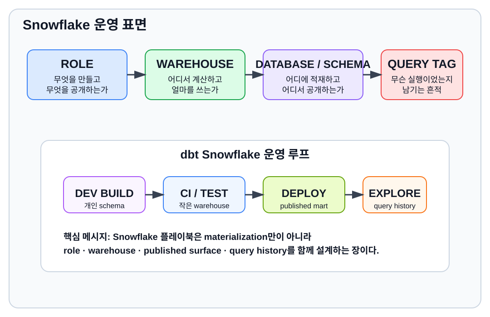

<a id="book-chapters-reference-v3-17-platform-playbook-snowflake-md--171-snowflake를-왜-별도-플레이북으로-다뤄야-하는가"></a>

### 17.1. Snowflake를 왜 별도 플레이북으로 다뤄야 하는가

같은 dbt 프로젝트라도 Snowflake에서는 다음 질문을 먼저 하게 된다.

- 어느 role로 실행할 것인가
- 어느 warehouse에서 빌드할 것인가
- 어느 database / schema에 어떤 계층을 둘 것인가
- 어떤 모델을 copy_grants / secure view / published surface로 노출할 것인가
- 어떤 모델은 dynamic table로 자동 갱신하고, 어떤 모델은 명시적 배치로 둘 것인가
- 같은 모델이라도 비용과 쿼리 이력 추적성을 어떻게 남길 것인가

즉, Snowflake에서는 dbt를 “SQL 실행기”보다 운영 설계 도구로 읽는 편이 정확하다.
특히 Snowflake는 warehouse가 계산 리소스와 직접 연결되기 때문에, 모델 구조와 실행 범위뿐 아니라 어떤 warehouse에서 돌리는지 자체가 성능과 비용의 핵심 변수가 된다.

<a id="book-chapters-reference-v3-17-platform-playbook-snowflake-md--1711-이-장에서-snowflake를-보는-기본-관점"></a>

#### 17.1.1. 이 장에서 Snowflake를 보는 기본 관점

이 장은 Snowflake를 다음 여섯 층으로 본다.

1. Connection layer
   profile, account, role, warehouse, database, schema
2. Execution layer
   model build, tests, snapshots, query_tag, run history
3. Storage layer
   transient table, table, view, incremental, dynamic table
4. Governance layer
   grants, copy_grants, secure view, contract, version
5. Published surface
   public mart, semantic-ready model, finance-safe surface
6. Operating loop
   dev → CI → deploy → investigate → tune

---

<a id="book-chapters-reference-v3-17-platform-playbook-snowflake-md--172-snowflake-운영-표면-role--warehouse--database--schema"></a>

### 17.2. Snowflake 운영 표면: Role · Warehouse · Database · Schema

Snowflake를 처음 다룰 때 가장 많이 헷갈리는 지점은 “dbt profile이 곧 Snowflake 구조”라고 착각하는 것이다.
profile은 연결 진입점일 뿐이고, 실제 운영 표면은 다음 네 축이 함께 움직인다.

<a id="book-chapters-reference-v3-17-platform-playbook-snowflake-md--1721-role"></a>

#### 17.2.1. Role
Role은 무엇을 만들고, 무엇을 읽고, 무엇을 공개할 수 있는지를 정한다.
개발자 개인이 dev schema에 만드는 권한과, 배포 환경이 prod mart에 반영하는 권한은 분리하는 것이 기본이다.

<a id="book-chapters-reference-v3-17-platform-playbook-snowflake-md--1722-warehouse"></a>

#### 17.2.2. Warehouse
Warehouse는 계산 리소스다.
같은 SQL이라도 어떤 warehouse에서 도느냐에 따라 시간과 비용이 달라진다.
따라서 Snowflake에서는 “materialization 선택”만큼이나 “warehouse 배치 전략”이 중요하다.

<a id="book-chapters-reference-v3-17-platform-playbook-snowflake-md--1723-database--schema"></a>

#### 17.2.3. Database / Schema
Database와 schema는 저장 위치이자 노출 경계다.
예를 들어 다음과 같이 나누면 운영 감각이 좋아진다.

- `RAW` / `raw_*` 계열: 외부 적재 데이터
- `ANALYTICS_DEV` / `dbt_<name>`: 개인 개발 영역
- `ANALYTICS` / `staging`, `intermediate`, `mart_core`, `mart_published`: 운영 영역

<a id="book-chapters-reference-v3-17-platform-playbook-snowflake-md--1724-query-history--auditability"></a>

#### 17.2.4. Query history / auditability
Snowflake는 query history를 강하게 제공하므로, dbt 실행 쿼리에 `query_tag`를 붙여두면 나중에
“이 비용은 어떤 모델에서 발생했는가”, “어떤 배포가 warehouse를 오래 점유했는가”를 추적하기 쉬워진다.

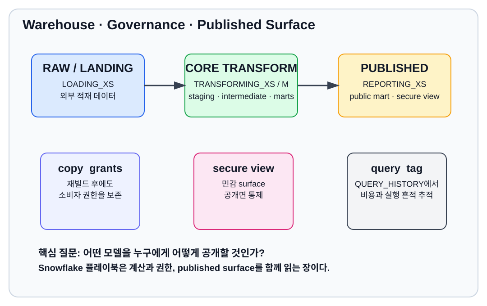

<a id="book-chapters-reference-v3-17-platform-playbook-snowflake-md--1725-최소-권장-구조"></a>

#### 17.2.5. 최소 권장 구조

가장 단순한 시작점은 아래와 같다.

- 개발자 role: dev schema 생성/수정 가능
- 배포 role: published schema 생성/수정 가능
- small warehouse: docs / tests / light marts
- medium or large warehouse: heavy incremental / session build / snapshots
- published mart는 `copy_grants` 또는 별도 grants 정책으로 외부 소비자와 연결

---

<a id="book-chapters-reference-v3-17-platform-playbook-snowflake-md--173-연결과-부트스트랩-snowflake-profile을-어떻게-읽을-것인가"></a>

### 17.3. 연결과 부트스트랩: Snowflake profile을 어떻게 읽을 것인가

Snowflake profile은 DuckDB나 Postgres보다 “길이가 길어서 어렵다”기보다, 운영 경계가 많이 드러나서 더 중요하다.

```yaml
acme_snowflake:
  target: dev
  outputs:
    dev:
      type: snowflake
      account: acme.ap-northeast-2
      user: analytics_user
      password: "{{ env_var('DBT_ENV_SECRET_SNOWFLAKE_PASSWORD') }}"
      role: TRANSFORMER
      database: ANALYTICS_DEV
      warehouse: TRANSFORMING_XS
      schema: dbt_jkim
      threads: 8
      client_session_keep_alive: false
      query_tag: dbt_local_dev
```

전체 예시는 [`../codes/04_chapter_snippets/ch17/profiles.snowflake.example.yml`](codes/04_chapter_snippets/ch17/profiles.snowflake.example.yml)에 넣어 두었다.

<a id="book-chapters-reference-v3-17-platform-playbook-snowflake-md--1731-profile에서-먼저-보는-항목"></a>

#### 17.3.1. profile에서 먼저 보는 항목

1. `account`
   어느 Snowflake 계정에 붙는가
2. `role`
   무엇을 만들 수 있는가
3. `warehouse`
   어느 계산 리소스를 쓰는가
4. `database` / `schema`
   어디에 쓰는가
5. `threads`
   병렬 실행 강도
6. `query_tag`
   실행 흔적을 어떻게 남길 것인가

<a id="book-chapters-reference-v3-17-platform-playbook-snowflake-md--1732-local-dev와-deploy의-차이"></a>

#### 17.3.2. local dev와 deploy의 차이

local dev는 비교적 작은 warehouse와 개인 schema를 쓰는 것이 일반적이다.
반대로 deploy는 다음 원칙을 가진다.

- published schema를 직접 만질 수 있는 role
- prod mart를 처리할 충분한 warehouse
- model / test / snapshot의 warehouse 분리 가능성
- query history를 읽기 쉬운 query_tag 규칙
- copy_grants, secure view, contracts를 함께 검토할 published layer

<a id="book-chapters-reference-v3-17-platform-playbook-snowflake-md--1733-bootstrap은-warehouse--role-설계까지-포함한다"></a>

#### 17.3.3. bootstrap은 warehouse / role 설계까지 포함한다

Snowflake bootstrap은 단순히 raw 테이블 생성 SQL이 아니다.
이 장의 bootstrap 예시는 database, schema, warehouse, role, grants까지 포함한다.

- [`../codes/04_chapter_snippets/ch17/snowflake_bootstrap.sql`](codes/04_chapter_snippets/ch17/snowflake_bootstrap.sql)

이 스크립트는 다음 구조를 전제로 한다.

- `RAW`
- `ANALYTICS_DEV`
- `ANALYTICS`
- `LOADING_XS`
- `TRANSFORMING_XS`
- `TRANSFORMING_L`
- `REPORTING_XS`

---

<a id="book-chapters-reference-v3-17-platform-playbook-snowflake-md--174-snowflake에서-중요한-dbt-설정"></a>

### 17.4. Snowflake에서 중요한 dbt 설정

Snowflake에서는 단순히 `table` / `view`를 고르는 것보다, 아래 설정을 묶어서 읽는 것이 중요하다.

<a id="book-chapters-reference-v3-17-platform-playbook-snowflake-md--1741-snowflake_warehouse"></a>

#### 17.4.1. `snowflake_warehouse`
Snowflake에서는 모델별, 테스트별로 warehouse를 따로 지정할 수 있다.
무거운 build는 큰 warehouse, 가벼운 test는 작은 warehouse로 분리하면 운영 비용을 다루기 쉬워진다.

```yaml
models:
  my_project:
    marts:
      +snowflake_warehouse: "TRANSFORMING_L"

data_tests:
  +snowflake_warehouse: "TRANSFORMING_XS"
```

<a id="book-chapters-reference-v3-17-platform-playbook-snowflake-md--1742-query_tag"></a>

#### 17.4.2. `query_tag`
query_tag는 Snowflake query history를 읽는 핵심 힌트다.
기본 tag를 profile에서 주고, 특정 모델만 override하거나 model name 기반으로 macro에서 세분화할 수 있다.

주의할 점도 있다. query tag는 session-level로 세팅되므로, build가 중간에 실패하면 이후 쿼리가 의도치 않은 tag로 남을 수 있다.
즉, “태그를 붙인다”에서 끝나는 게 아니라, 태그 reset 동작까지 운영 표면으로 이해해야 한다.

- 예시 매크로: [`../codes/04_chapter_snippets/ch17/set_query_tag.sql`](codes/04_chapter_snippets/ch17/set_query_tag.sql)

<a id="book-chapters-reference-v3-17-platform-playbook-snowflake-md--1743-transient"></a>

#### 17.4.3. `transient`
Snowflake에서 dbt가 만드는 table은 기본적으로 transient다.
이건 비용 면에서 유리하지만, time travel / fail-safe 보존 전략이 일반 table과 다르므로 published layer에 무조건 같은 기준을 적용하면 안 된다.

가볍게 정리하면:

- dev / intermediate / scratch mart: transient에 잘 맞음
- 장기 보존·감사 요구가 큰 public mart: transient 기본값을 그대로 둘지 검토 필요

<a id="book-chapters-reference-v3-17-platform-playbook-snowflake-md--1744-copy_grants"></a>

#### 17.4.4. `copy_grants`
published mart를 재구축할 때 grants를 유지하려면 `copy_grants`가 도움이 된다.
특히 BI나 downstream consumer가 이미 권한을 받은 view/table을 dbt가 교체하는 경우에 중요하다.

<a id="book-chapters-reference-v3-17-platform-playbook-snowflake-md--1745-secure"></a>

#### 17.4.5. `secure`
민감 정보가 포함된 published view는 secure view로 노출할 수 있다.
다만 secure view는 성능 비용이 있을 수 있으므로, 모든 모델에 습관적으로 쓰기보다 published sensitive surface에 집중하는 편이 좋다.

<a id="book-chapters-reference-v3-17-platform-playbook-snowflake-md--1746-cluster_by와-automatic_clustering"></a>

#### 17.4.6. `cluster_by`와 `automatic_clustering`
Event Stream 같은 큰 테이블은 clustering 전략을 고민할 수 있다.
현재 Snowflake에서는 automatic clustering이 기본적으로 활성화된 경우가 많고, 수동 클러스터링 계정을 위한 `automatic_clustering` config는 예전 계정에서만 의미가 있는 경우가 있다.

<a id="book-chapters-reference-v3-17-platform-playbook-snowflake-md--1747-tmp_relation_type"></a>

#### 17.4.7. `tmp_relation_type`
Snowflake incremental은 중간 relation으로 view를 선호하지만, `delete+insert` + `unique_key` 정확성이 중요할 때는 temporary table이 더 안전한 경우가 있다.
즉, “기본값이 항상 최적”이라고 보기보다, incremental 전략과 함께 읽어야 한다.

---

<a id="book-chapters-reference-v3-17-platform-playbook-snowflake-md--175-snowflake-materialization-선택-기준"></a>

### 17.5. Snowflake materialization 선택 기준

Snowflake에서는 같은 모델이라도 비용 / 공개면 / refresh 요구 / 권한 정책에 따라 materialization 선택이 달라진다.

<a id="book-chapters-reference-v3-17-platform-playbook-snowflake-md--1751-가장-자주-쓰는-선택지"></a>

#### 17.5.1. 가장 자주 쓰는 선택지

1. `view`
2. `table`
3. `incremental`
4. `dynamic_table`
5. `materialized_view` (warehouse-native object와 함께 읽는 주제)

<a id="book-chapters-reference-v3-17-platform-playbook-snowflake-md--1752-기본-의사결정표"></a>

#### 17.5.2. 기본 의사결정표

| 상황 | 권장 형태 | 이유 |
| --- | --- | --- |
| 개발 중 빠른 확인 | `view` | 재빌드 부담이 작다 |
| published mart, 질의 안정성 우선 | `table` | 소비자 관점에서 읽기 쉽다 |
| 대용량 append/merge | `incremental` | 계산 비용을 줄인다 |
| 이벤트 집계 자동 갱신 | `dynamic_table` | target lag 기반 refresh를 활용할 수 있다 |
| 민감 노출면 | `secure view` | 공개면을 통제하기 쉽다 |

<a id="book-chapters-reference-v3-17-platform-playbook-snowflake-md--1753-snowflake-incremental-전략을-어떻게-읽을까"></a>

#### 17.5.3. Snowflake incremental 전략을 어떻게 읽을까

Snowflake adapter는 다음 incremental 전략을 지원한다.

- `merge` (기본)
- `append`
- `delete+insert`
- `insert_overwrite`
- `microbatch`

여기서 중요한 감각은 이거다.

- `merge`: key가 안정적일 때 가장 일반적
- `delete+insert`: nondeterministic merge가 나거나 key 품질이 애매한 경우 차선책
- `insert_overwrite`: Snowflake에서는 partition overwrite가 아니라 사실상 전체 overwrite 감각으로 읽어야 함
- `microbatch`: time-series를 batch window로 나누어 처리할 때

<a id="book-chapters-reference-v3-17-platform-playbook-snowflake-md--1754-dynamic-table을-언제-고려할까"></a>

#### 17.5.4. dynamic table을 언제 고려할까

dynamic table은 Snowflake 고유의 자동 refresh 면을 제공하지만, “모든 incremental의 상위호환”은 아니다.

다음 질문을 먼저 해야 한다.

1. refresh 지연 허용 범위가 있는가 (`target_lag`)
2. SQL이 dynamic table 제한 안에서 동작하는가
3. model contract가 꼭 필요한가
4. `copy_grants`가 필요한가
5. 이 모델이 다른 dynamic table 아래로 이어질 예정인가

공식 문서 기준으로 dynamic table은 model contracts와 copy_grants를 지원하지 않는다.
그러므로 public API surface에는 table + contract + grants 조합이 더 적합한 경우가 많다.

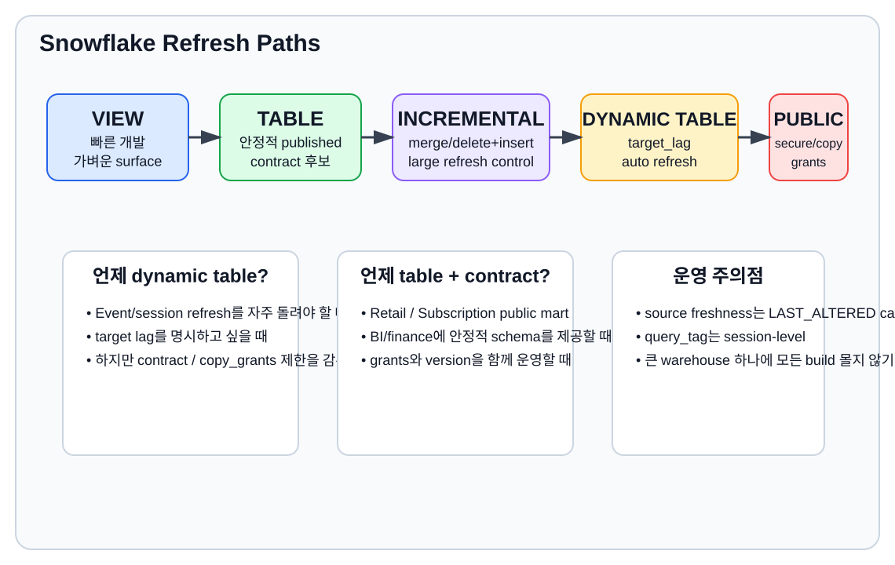

---

<a id="book-chapters-reference-v3-17-platform-playbook-snowflake-md--176-세-casebook를-snowflake에서-어떻게-진행할까"></a>

### 17.6. 세 casebook를 Snowflake에서 어떻게 진행할까

이 장의 핵심은 “Snowflake가 기능이 많다”가 아니라,
앞에서 배운 세 casebook가 Snowflake에서 어떤 운영 결정을 요구하는가를 읽는 데 있다.

<a id="book-chapters-reference-v3-17-platform-playbook-snowflake-md--1761-casebook-i--retail-orders"></a>

### 17.6.1. Casebook I · Retail Orders

Retail Orders는 Snowflake에서 published mart + grants + secure view + copy_grants를 시험하기 좋은 예제다.

권장 흐름은 이렇다.

1. raw 주문/주문상세/상품 데이터를 `RAW.RETAIL` 계열 schema에 둔다
2. dev에서는 `ANALYTICS_DEV.dbt_<name>` schema에 staging/intermediate/marts를 만든다
3. published surface는 `ANALYTICS.mart_published` 또는 유사 schema에 `fct_orders`, `dim_customers`를 배치한다
4. 공개용 view가 민감 컬럼을 포함한다면 secure view를 고려한다
5. downstream BI 권한을 유지해야 한다면 `copy_grants`를 검토한다

특히 Retail Orders는 contract와 published API surface를 붙이기 좋다.

- `fct_orders_v1` → 기본 주문 매출
- `fct_orders_v2` → 반환/환불 규칙을 명시한 개정 버전
- published consumer는 `public` model만 참조

예시:
- [`../codes/04_chapter_snippets/ch17/retail_fct_orders_published.sql`](codes/04_chapter_snippets/ch17/retail_fct_orders_published.sql)

<a id="book-chapters-reference-v3-17-platform-playbook-snowflake-md--17611-retail-orders에서-snowflake다운-결정"></a>

#### 17.6.1.1. Retail Orders에서 Snowflake다운 결정

- build는 `TRANSFORMING_XS` 또는 `TRANSFORMING_M`
- quality test는 더 작은 warehouse로 분리 가능
- published view는 secure 여부를 business 요구로 판단
- grants가 이미 외부 BI에 전달되었다면 `copy_grants` 고려

<a id="book-chapters-reference-v3-17-platform-playbook-snowflake-md--1762-casebook-ii--event-stream"></a>

### 17.6.2. Casebook II · Event Stream

Event Stream은 Snowflake에서 비용과 refresh 전략을 가장 강하게 묻는 예제다.

이 도메인에서는 다음 질문이 중요하다.

1. raw event를 얼마나 자주 읽는가
2. session mart를 매번 rebuild할 것인가
3. microbatch가 적절한가
4. dynamic table로 target lag를 줄 것인가
5. clustering / warehouse sizing을 어떻게 둘 것인가

이벤트 스트림은 append-only 성향이 강하므로, Snowflake에서 다음 경로가 자주 등장한다.

- source freshness는 참고 지표로만 본다
  (Snowflake freshness는 `LAST_ALTERED` 기반이라 metadata 작업에도 흔들릴 수 있음)
- sessionized mart는 incremental 또는 dynamic table 후보
- daily aggregate는 `table` 또는 `incremental`
- semantic-ready aggregate는 published small surface로 별도 분리

예시:
- [`../codes/04_chapter_snippets/ch17/events_sessions_dynamic_table.sql`](codes/04_chapter_snippets/ch17/events_sessions_dynamic_table.sql)

<a id="book-chapters-reference-v3-17-platform-playbook-snowflake-md--17621-event-stream에서-snowflake다운-결정"></a>

#### 17.6.2.1. Event Stream에서 Snowflake다운 결정

- 작은 warehouse로 full scan을 반복하지 않기
- clustering이 필요한지 query pattern 기준으로 판단
- dynamic table은 편하지만 contracts/copy_grants 제한이 있다는 점 고려
- heavy event job과 light mart test를 같은 warehouse에 몰지 않기

<a id="book-chapters-reference-v3-17-platform-playbook-snowflake-md--1763-casebook-iii--subscription--billing"></a>

### 17.6.3. Casebook III · Subscription & Billing

Subscription & Billing은 Snowflake에서 governed API surface를 설명하기 가장 좋은 예제다.

이 도메인에서는:

- status history를 snapshot으로 관리하고
- current MRR mart를 table/incremental로 운영하고
- public finance-facing surface를 versioned model로 배포하고
- semantic-ready starter를 붙여 반복 질문을 정리하는 흐름이 잘 맞는다

특히 finance/ops/sales/customer-success가 같은 지표를 다르게 해석할 수 있으므로, Snowflake에서는
`published mart + version + grants + secure view`를 함께 설계하는 편이 좋다.

예시:
- [`../codes/04_chapter_snippets/ch17/subscription_mrr_public_v2.yml`](codes/04_chapter_snippets/ch17/subscription_mrr_public_v2.yml)

<a id="book-chapters-reference-v3-17-platform-playbook-snowflake-md--17631-subscription--billing에서-snowflake다운-결정"></a>

#### 17.6.3.1. Subscription & Billing에서 Snowflake다운 결정

- `mrr_current`는 table 또는 incremental
- `subscription_status_history`는 YAML snapshot
- finance-facing view는 secure 후보
- published v1/v2를 grants와 함께 관리
- semantic-ready surface는 공용 metric layer 후보

---

<a id="book-chapters-reference-v3-17-platform-playbook-snowflake-md--177-snowflake에서-특히-주의할-운영-포인트"></a>

### 17.7. Snowflake에서 특히 주의할 운영 포인트

<a id="book-chapters-reference-v3-17-platform-playbook-snowflake-md--1771-source-freshness는-정확한-적재-시각의-완전한-대체재가-아니다"></a>

#### 17.7.1. source freshness는 “정확한 적재 시각”의 완전한 대체재가 아니다

Snowflake의 source freshness는 `LAST_ALTERED` 컬럼 기반으로 동작하므로,
DDL, DML, metadata maintenance도 freshness에 영향을 줄 수 있다.
따라서 Event Stream처럼 엄격한 ingestion freshness가 필요한 경우에는
raw table의 실제 적재 시각 컬럼 또는 별도 ingestion audit를 함께 보는 편이 낫다.

<a id="book-chapters-reference-v3-17-platform-playbook-snowflake-md--1772-query_tag는-유용하지만-session-level이라는-점을-기억해야-한다"></a>

#### 17.7.2. query_tag는 유용하지만 session-level이라는 점을 기억해야 한다

실패한 build 중간에 query_tag가 reset되지 않으면 이후 쿼리 이력 해석이 어색해질 수 있다.
따라서 query_tag 전략은 “설정”만이 아니라 “운영 관찰 규칙”까지 포함한다.

<a id="book-chapters-reference-v3-17-platform-playbook-snowflake-md--1773-warehouse를-모델-크기가-아니라-질문-비용으로-나눠라"></a>

#### 17.7.3. warehouse를 모델 크기가 아니라 질문 비용으로 나눠라

가장 흔한 실수는 다음 두 가지다.

- 모든 것을 큰 warehouse 하나에서 돌리기
- 반대로 너무 작은 warehouse 하나에 모든 build를 몰아넣기

현실적인 기준은 이렇다.

- docs / light tests / metadata tasks → 작은 warehouse
- marts / snapshots / moderate incremental → 중간 warehouse
- heavy event backfill / Python / large join → 큰 warehouse

<a id="book-chapters-reference-v3-17-platform-playbook-snowflake-md--1774-dynamic-table은-운영-편의성이지-보편적-승자가-아니다"></a>

#### 17.7.4. dynamic table은 운영 편의성이지 보편적 승자가 아니다

dynamic table은 target lag와 자동 refresh가 매력적이지만,
- SQL 제약이 있고
- `--full-refresh`가 필요할 수 있고
- contract / copy_grants 제약이 있고
- downstream topology 제약도 있다

즉, Event Stream에서는 강력한 후보지만, Subscription public API surface에는 오히려 부적절할 수 있다.

---

<a id="book-chapters-reference-v3-17-platform-playbook-snowflake-md--178-추천-bootstrap--config--runbook"></a>

### 17.8. 추천 bootstrap / config / runbook

<a id="book-chapters-reference-v3-17-platform-playbook-snowflake-md--1781-bootstrap-sql"></a>

#### 17.8.1. bootstrap SQL
- [`../codes/04_chapter_snippets/ch17/snowflake_bootstrap.sql`](codes/04_chapter_snippets/ch17/snowflake_bootstrap.sql)

<a id="book-chapters-reference-v3-17-platform-playbook-snowflake-md--1782-profile-예시"></a>

#### 17.8.2. profile 예시
- [`../codes/04_chapter_snippets/ch17/profiles.snowflake.example.yml`](codes/04_chapter_snippets/ch17/profiles.snowflake.example.yml)

<a id="book-chapters-reference-v3-17-platform-playbook-snowflake-md--1783-project-level-config-예시"></a>

#### 17.8.3. project-level config 예시
- [`../codes/04_chapter_snippets/ch17/dbt_project.snowflake.configs.yml`](codes/04_chapter_snippets/ch17/dbt_project.snowflake.configs.yml)

<a id="book-chapters-reference-v3-17-platform-playbook-snowflake-md--1784-runbook"></a>

#### 17.8.4. runbook
- [`../codes/04_chapter_snippets/ch17/snowflake_runbook.sh`](codes/04_chapter_snippets/ch17/snowflake_runbook.sh)

---

<a id="book-chapters-reference-v3-17-platform-playbook-snowflake-md--179-직접-해보기"></a>

### 17.9. 직접 해보기

<a id="book-chapters-reference-v3-17-platform-playbook-snowflake-md--1791-retail-orders"></a>

#### 17.9.1. Retail Orders
1. bootstrap SQL로 warehouse / database / schema를 만든다
2. profile을 local dev 기준으로 맞춘다
3. `stg_orders`, `int_order_lines`, `fct_orders`를 build한다
4. `fct_orders_published`를 secure view 후보로 검토한다
5. `copy_grants` on/off 차이를 확인한다

<a id="book-chapters-reference-v3-17-platform-playbook-snowflake-md--1792-event-stream"></a>

#### 17.9.2. Event Stream
1. raw event bootstrap을 적재한다
2. session mart를 table 버전과 dynamic table 버전으로 각각 만든다
3. query history에서 비용/시간 차이를 비교한다
4. source freshness가 예상과 다르게 흔들리는지 확인한다

<a id="book-chapters-reference-v3-17-platform-playbook-snowflake-md--1793-subscription--billing"></a>

#### 17.9.3. Subscription & Billing
1. snapshot으로 subscription status history를 만든다
2. current MRR mart를 table로 만든다
3. public v1 / v2 definition을 versioned model로 정리한다
4. finance-facing secure view가 필요한지 판단한다

---

<a id="book-chapters-reference-v3-17-platform-playbook-snowflake-md--1710-안티패턴"></a>

### 17.10. 안티패턴

<a id="book-chapters-reference-v3-17-platform-playbook-snowflake-md--17101-모든-모델을-같은-warehouse에서-돌리는-것"></a>

#### 17.10.1. 모든 모델을 같은 warehouse에서 돌리는 것
간단하지만 비용 통제가 어렵고 병목이 잘 생긴다.

<a id="book-chapters-reference-v3-17-platform-playbook-snowflake-md--17102-dynamic-table을-public-mart의-만능-해답처럼-쓰는-것"></a>

#### 17.10.2. dynamic table을 public mart의 만능 해답처럼 쓰는 것
contracts, grants, topology 제약을 무시하게 된다.

<a id="book-chapters-reference-v3-17-platform-playbook-snowflake-md--17103-secure-view를-성능-영향-없이-무료로-얻는-기능처럼-생각하는-것"></a>

#### 17.10.3. secure view를 성능 영향 없이 무료로 얻는 기능처럼 생각하는 것
민감 surface에만 집중적으로 써야 한다.

<a id="book-chapters-reference-v3-17-platform-playbook-snowflake-md--17104-source-freshness를-ingestion-sla의-정확한-대체재로-읽는-것"></a>

#### 17.10.4. source freshness를 ingestion SLA의 정확한 대체재로 읽는 것
Snowflake의 `LAST_ALTERED` caveat를 반드시 기억해야 한다.

<a id="book-chapters-reference-v3-17-platform-playbook-snowflake-md--17105-query_tag를-켜기만-하고-query-history를-보지-않는-것"></a>

#### 17.10.5. query_tag를 켜기만 하고 query history를 보지 않는 것
태그가 운영 관찰 루프에 연결되지 않으면 가치가 줄어든다.

---

<a id="book-chapters-reference-v3-17-platform-playbook-snowflake-md--1711-이-장의-체크리스트"></a>

### 17.11. 이 장의 체크리스트

아래 질문에 답할 수 있으면 이 장을 제대로 이해한 것이다.

- Snowflake에서 role / warehouse / database / schema를 왜 함께 봐야 하는가
- `snowflake_warehouse`를 model/test별로 나누는 이유는 무엇인가
- `copy_grants`, `secure`, `transient`는 각각 언제 고려하는가
- Event Stream에서 dynamic table을 쓸 때 얻는 것과 잃는 것은 무엇인가
- Subscription & Billing에서 versioned public mart를 왜 Snowflake에서 특히 잘 운영할 수 있는가
- source freshness를 해석할 때 Snowflake 특유의 caveat는 무엇인가

---

<a id="book-chapters-reference-v3-17-platform-playbook-snowflake-md--1712-이-장에서-가져가야-할-핵심"></a>

### 17.12. 이 장에서 가져가야 할 핵심

Snowflake 플레이북의 핵심은 “Snowflake용 SQL 문법”이 아니다.
핵심은 dbt 프로젝트를 엔터프라이즈 운영 표면으로 밀어 올리는 법이다.

따라서 Snowflake에서 좋은 dbt 설계는 다음을 함께 만족해야 한다.

1. 모델 구조가 분리되어 있다
2. 비용과 warehouse 경계가 보인다
3. published surface와 grants가 설계되어 있다
4. 필요한 곳에 secure / version / contract가 붙는다
5. query history와 운영 흔적을 남길 수 있다

이 감각이 잡히면, Snowflake는 단순히 비싼 웨어하우스가 아니라
dbt의 운영 성숙도를 시험하는 플랫폼으로 읽히기 시작한다.

---

<a id="book-chapters-reference-v3-18-platform-playbook-trino-md"></a>

장별 원고: [chapters/reference-v3/18-platform-playbook-trino.md](chapters/reference-v3/18-platform-playbook-trino.md)

<a id="book-chapters-reference-v3-18-platform-playbook-trino-md--chapter-18--platform-playbook--trino"></a>

## CHAPTER 18 · Platform Playbook · Trino

> **마당마켓 본편 연결:** [J14 · 이름·소유권·권한을 코드 밖에서도 관리하기](#book-journey-14-configuration-md)에서 같은 상점의 누적 실습으로 돌아갈 수 있다. 이 참고편의 `codes/` 스니펫에는 독립 fixture가 포함되어 있으며 본편 `lab/`의 P1~P5와 섞지 않는다. 플랫폼별 구문·기능은 실행 버전에 맞춰 재확인한다.


Trino는 하나의 저장소에 접속해서 테이블을 만드는 전통적인 데이터웨어하우스보다 여러 catalog 위의 데이터를 한 SQL 계층에서 읽고 조합하는 분산 query engine에 가깝다.
따라서 Trino를 dbt로 다룰 때는 "어떤 SQL을 쓸까"보다 먼저 어디에서 읽고, 어디에 쓰고, 어떤 naming rule과 orchestration contract를 쓸 것인가를 정해야 한다.

이 장의 목표는 앞서 학습한 `source()`, `ref()`, layered modeling, tests, incremental, hooks, vars, artifacts, CI 개념이
Trino / Iceberg / Airflow 조합에서 어떻게 실제 운영 패턴으로 바뀌는지 끝까지 설명하는 것이다.


<a id="book-chapters-reference-v3-18-platform-playbook-trino-md--181-왜-trino는-별도-플레이북이-필요한가"></a>

### 18.1. 왜 Trino는 별도 플레이북이 필요한가

DuckDB, PostgreSQL, BigQuery, Snowflake는 "target platform 자체가 저장과 실행의 중심"인 경우가 많다.
반면 Trino는 다음 특징 때문에 별도 플레이북이 필요하다.

1. catalog가 곧 데이터 위치의 힌트다. `database`가 일반적인 "하나의 DB 이름"이 아니라 Trino catalog를 뜻한다.
2. source와 target이 같은 위치일 필요가 없다.
3. 읽기 가능한 connector와 쓰기 가능한 connector가 다를 수 있다.
4. SQL은 하나처럼 보여도, 실제 성능/권한/파일 포맷/메타데이터는 connector에 의해 좌우된다.
5. Airflow 같은 외부 orchestrator와 함께 쓰는 운영 패턴이 많다.

즉, Trino 장에서는 "문법"보다 runtime boundary를 먼저 이해해야 한다.

<a id="book-chapters-reference-v3-18-platform-playbook-trino-md--182-trino를-시작할-때-먼저-정해야-할-네-가지"></a>

### 18.2. Trino를 시작할 때 먼저 정해야 할 네 가지

<a id="book-chapters-reference-v3-18-platform-playbook-trino-md--1821-어떤-catalog에서-읽을-것인가"></a>

#### 18.2.1. 어떤 catalog에서 읽을 것인가

예를 들어 raw 입력이 `iceberg.sample_db.raw_sales`라면:

- `iceberg`는 catalog
- `sample_db`는 schema
- `raw_sales`는 table

Trino에서는 이 세 층을 항상 의식해야 한다.
특히 source가 여러 catalog에 흩어져 있으면, source contract를 YAML로 먼저 선언하는 편이 훨씬 안전하다.

<a id="book-chapters-reference-v3-18-platform-playbook-trino-md--1822-어떤-catalogschema에-쓸-것인가"></a>

#### 18.2.2. 어떤 catalog/schema에 쓸 것인가

Trino는 여러 catalog를 읽을 수 있지만, 모든 connector가 쓰기에 강한 것은 아니다.
따라서 intermediate, marts, snapshots를 실제로 어떤 catalog에 materialize할지 먼저 정해야 한다.

실무에서는 자주 이렇게 나뉜다.

- 입력: 여러 catalog / 여러 lakehouse table
- 출력: 한 write-capable catalog (예: Iceberg)
- 운영 로그: 별도 schema 또는 별도 catalog

<a id="book-chapters-reference-v3-18-platform-playbook-trino-md--1823-naming-rule을-어떻게-둘-것인가"></a>

#### 18.2.3. naming rule을 어떻게 둘 것인가

Trino / Iceberg 환경에서는 `target.schema`와 model config의 `schema`가 겹칠 때 relation naming이 어색해질 수 있다.
기본 naming rule을 유지할지, `generate_schema_name` override로 단순화할지 정해야 한다.

<a id="book-chapters-reference-v3-18-platform-playbook-trino-md--1824-orchestration-run과-dbt-run을-어떻게-연결할-것인가"></a>

#### 18.2.4. orchestration run과 dbt run을 어떻게 연결할 것인가

Airflow가 있다면 최소한 아래 변수는 표준화하는 것이 좋다.

- `airflow_run_id`
- `from_dt`
- `end_dt`

이 세 가지가 있으면 backfill, retry, audit logging, 기간 기반 실행을 모두 연결하기 쉬워진다.

<a id="book-chapters-reference-v3-18-platform-playbook-trino-md--183-first-run-profile부터-coordinator-상태까지-한-번에-확인하기"></a>

### 18.3. first-run: profile부터 coordinator 상태까지 한 번에 확인하기

아래는 Trino 실습/운영에서 사용할 수 있는 최소 profile 예시다.

```yaml
trino_test:
  target: dev
  outputs:
    dev:
      type: trino
      method: none
      user: "{{ env_var('DBT_TRINO_USER', 'dbt') }}"
      host: "{{ env_var('DBT_TRINO_HOST', 'localhost') }}"
      port: "{{ env_var('DBT_TRINO_PORT', '8080') | int }}"
      database: "{{ env_var('DBT_TRINO_CATALOG', 'iceberg') }}"
      schema: "{{ env_var('DBT_TRINO_SCHEMA', 'sample_db') }}"
      threads: 4
      prepared_statements_enabled: true
      retries: 3
      timezone: Asia/Seoul
```

관련 파일:
- `../codes/04_chapter_snippets/ch18/trino/profiles.trino.sample.yml`

<a id="book-chapters-reference-v3-18-platform-playbook-trino-md--1831-여기서-자주-헷갈리는-것"></a>

#### 18.3.1. 여기서 자주 헷갈리는 것

- `database`는 Trino의 catalog다.
- `schema`는 catalog 아래 schema다.
- `dbt debug`가 YAML 문법과 연결 자격을 일부 확인해 주더라도, coordinator가 죽어 있으면 run은 실패한다.
- `prepared_statements_enabled`는 seed에서 특히 영향이 크다.
- `retries`는 일시적 네트워크 문제에는 도움이 되지만, coordinator가 완전히 죽어 있으면 해결되지 않는다.

<a id="book-chapters-reference-v3-18-platform-playbook-trino-md--1832-connection-refused가-나오면-sql보다-먼저-볼-것"></a>

#### 18.3.2. Connection refused가 나오면 SQL보다 먼저 볼 것

업무 로그에서 대표적으로 나온 오류는 `localhost:8080` connection refused였다.
이건 모델 SQL보다 Trino launcher / coordinator / PID 권한을 먼저 봐야 하는 신호다.

실전 점검 순서:

1. `dbt debug`
2. `curl http://localhost:8080/v1/info`
3. Trino launcher 상태 확인
4. PID 파일 권한 확인
5. 필요한 catalog가 로딩됐는지 확인

관련 파일:
- `../codes/04_chapter_snippets/ch18/trino/trino_service_first_run.sh`
- `../codes/04_chapter_snippets/ch18/trino/diagnosis_checklist.sh`

<a id="book-chapters-reference-v3-18-platform-playbook-trino-md--184-trino에서는-source-contract를-더-빨리-세워야-한다"></a>

### 18.4. Trino에서는 source contract를 더 빨리 세워야 한다

업무 메모에서도 `sources.yml`을 먼저 만드는 이유를 강조하고 있었다.
Trino에서는 relation을 직접 `iceberg.sample_db.raw_sales`처럼 하드코딩하기 쉽지만, 그렇게 하면 다음 문제가 생긴다.

1. raw 입력이 lineage에 드러나지 않는다.
2. catalog/schema가 바뀌면 SQL 파일 전체를 수정해야 한다.
3. source-level test/freshness로 확장하기 어렵다.
4. 여러 catalog를 섞는 순간 relation 하드코딩이 빠르게 퍼진다.

예시:

```yaml
version: 2

sources:
  - name: my_source
    database: iceberg
    schema: sample_db
    tables:
      - name: raw_data
      - name: raw_sales
      - name: raw_sales2
      - name: country
```

```sql
select
    sale_id,
    product_name,
    amount,
    current_timestamp at time zone 'Asia/Seoul' as last_updated
from {{ source('my_source', 'raw_sales') }}
```

관련 파일:
- `../codes/04_chapter_snippets/ch18/trino/sources.trino.sample.yml`

<a id="book-chapters-reference-v3-18-platform-playbook-trino-md--1841-source-선언으로-얻는-것"></a>

#### 18.4.1. source 선언으로 얻는 것

- lineage
- source-level tests
- freshness check
- 환경 분리
- catalog/schema rename 비용 절감

<a id="book-chapters-reference-v3-18-platform-playbook-trino-md--1842-세-casebook에-어떻게-연결되는가"></a>

#### 18.4.2. 세 casebook에 어떻게 연결되는가

Retail Orders
`raw_sales`, `country`, `raw_order_items` 같은 입력을 source로 선언하면 lookup과 fact 흐름이 선명해진다.

Event Stream
append-only event log에서 freshness와 late-arrival을 분리해서 볼 수 있다.

Subscription & Billing
현재 상태 테이블과 billing lookup 테이블을 contract 관점에서 관리하기 쉽다.

<a id="book-chapters-reference-v3-18-platform-playbook-trino-md--185-schema-naming과-generate_schema_name-override"></a>

### 18.5. Schema naming과 `generate_schema_name` override

업무 메모의 가장 실무적인 부분 중 하나가 이 매크로였다.
Trino / Iceberg 환경에서는 target schema와 custom schema가 같은 이름으로 겹치면 relation naming이 길고 어색해질 수 있다.

예:

- target schema = `sample_db`
- model config schema = `sample_db`

기본 naming rule을 그대로 두면 `sample_db_sample_db` 같은 이름이 생길 수 있다.

이를 피하려고 아래 macro를 둘 수 있다.

```sql

    
        {{ target.schema }}
    
        {{ custom_schema_name | trim }}
    

```

관련 파일:
- `../codes/04_chapter_snippets/ch18/trino/generate_schema_name.sql`

<a id="book-chapters-reference-v3-18-platform-playbook-trino-md--1851-이-매크로의-성격"></a>

#### 18.5.1. 이 매크로의 성격

이건 편의성 macro가 아니라 프로젝트 전역 naming rule override다.
따라서 아래를 먼저 확인해야 한다.

- 개인 dev schema 분리 전략과 충돌하지 않는가
- prod naming convention과 충돌하지 않는가
- schema를 model 단위로 직접 지정하는 팀 규칙과 맞는가

<a id="book-chapters-reference-v3-18-platform-playbook-trino-md--1852-언제-쓰는가"></a>

#### 18.5.2. 언제 쓰는가

- target.schema와 custom schema가 자주 겹치는 구조
- catalog/schema naming을 짧고 명확하게 유지해야 하는 경우
- Trino write target이 명확히 고정돼 있는 경우

<a id="book-chapters-reference-v3-18-platform-playbook-trino-md--1853-언제-보수적으로-접근하는가"></a>

#### 18.5.3. 언제 보수적으로 접근하는가

- 사람마다 dev schema를 다르게 써야 하는 경우
- schema prefix를 environment isolation에 적극 활용하는 경우
- 이미 naming convention이 조직 전반에서 굳어 있는 경우

<a id="book-chapters-reference-v3-18-platform-playbook-trino-md--186-logging-table-hooks-results를-이용한-운영-가시성"></a>

### 18.6. Logging table, hooks, `results`를 이용한 운영 가시성

Trino / Airflow 환경에서는 "모델이 실패했다"보다 어느 run에서 어떤 모델이 얼마나 오래 걸렸고 왜 실패했는가가 더 중요할 때가 많다.
그래서 업무 메모의 `dbt_log`, `log_model_start`, `log_run_end` 패턴은 교재에 넣을 가치가 높다.


<a id="book-chapters-reference-v3-18-platform-playbook-trino-md--1861-bootstrap-sql"></a>

#### 18.6.1. bootstrap SQL

```sql
create table if not exists iceberg.sample_db.dbt_log (
    invocation_id  varchar,
    model_name     varchar,
    status         varchar,
    start_dt       timestamp(6) with time zone,
    end_dt         timestamp(6) with time zone,
    duration       varchar,
    error_message  varchar,
    run_info       varchar
)
with (
    format = 'PARQUET'
);
```

관련 파일:
- `../codes/03_platform_bootstrap/trino/dbt_log_bootstrap.sql`

<a id="book-chapters-reference-v3-18-platform-playbook-trino-md--1862-왜-pre_hook--on-run-end-조합이-좋은가"></a>

#### 18.6.2. 왜 `pre_hook + on-run-end` 조합이 좋은가

`post_hook`는 개별 모델 성공 뒤에만 기대하기 쉽다.
반면 `on-run-end`는 전체 실행 결과 목록인 `results`를 훑을 수 있어서, 성공/실패/오류 메시지를 run 단위로 정리하기 좋다.

여기서 핵심은 세 가지다.

1. 모델 시작 시점에는 `RUNNING`을 남긴다.
2. 종료 시점에는 `results`를 순회하며 상태를 갱신한다.
3. `airflow_run_id`가 있으면 orchestration run과 dbt run을 연결한다.

<a id="book-chapters-reference-v3-18-platform-playbook-trino-md--1863-일반화한-logging-macro"></a>

#### 18.6.3. 일반화한 logging macro

이 장에서는 업무 메모를 그대로 복사하지 않고, 아래처럼 조금 일반화해서 제안한다.

- log relation을 `var()`로 지정 가능
- timezone을 `var()`로 지정 가능
- `airflow_run_id`가 없으면 `invocation_id` fallback
- `results`는 on-run-end context에서 인자로 받음

관련 파일:
- `../codes/04_chapter_snippets/ch18/trino/log_utils.sql`
- `../codes/04_chapter_snippets/ch18/trino/dbt_project_hooks.example.yml`

<a id="book-chapters-reference-v3-18-platform-playbook-trino-md--1864-운영-팁"></a>

#### 18.6.4. 운영 팁

- duration을 문자열로 저장할지, 초 단위 숫자로 저장할지 먼저 정한다.
- error_message는 길이 제한을 둔다.
- 로그 테이블을 business mart와 같은 schema에 두지 않는다.
- retry 시 중복 로그를 막으려면 `airflow_run_id`를 merge key로 활용하는 것이 좋다.

<a id="book-chapters-reference-v3-18-platform-playbook-trino-md--187-업무-case01case06을-trino-운영-패턴으로-다시-읽기"></a>

### 18.7. 업무 case01~case06을 Trino 운영 패턴으로 다시 읽기

이 절은 "실무 메모에 있던 예제를 교재의 언어로 다시 해석"하는 부분이다.

<a id="book-chapters-reference-v3-18-platform-playbook-trino-md--1871-case01--전체-재적재형-배치"></a>

#### 18.7.1. case01 · 전체 재적재형 배치

`incremental` + `append` + `pre_hook delete all` 조합은 이름만 보면 incremental 같지만, 의미상으로는 truncate-insert 배치에 가깝다.

언제 유용한가:

- 대상 테이블이 작다
- 완전 재계산이 더 단순하다
- 정확성이 성능보다 중요하다
- legacy batch를 dbt 안으로 옮기는 초기 단계다

주의점:

- 대형 fact에는 부적합
- 재실행 비용이 크다
- "incremental을 쓴다"는 말만 보고 merge/upsert와 동일시하면 안 된다

관련 파일:
- `../codes/04_chapter_snippets/ch18/trino/case01_truncate_insert.sql`

<a id="book-chapters-reference-v3-18-platform-playbook-trino-md--1872-case02--lookup-기반-분기-제어"></a>

#### 18.7.2. case02 · lookup 기반 분기 제어

`run_query()`로 작은 lookup 값을 읽고 분기하는 패턴이다.

이 패턴이 useful한 경우:

- 실행 모드 플래그가 아주 작다
- 제어 테이블을 통해 SQL branch를 나누고 싶다
- side effect 없이 조회성 분기만 필요하다

주의점:

- `run_query()`는 live connection이 있으면 `dbt compile`, `dbt docs generate`에서도 실행될 수 있다
- 따라서 DML이나 side effect 쿼리를 넣지 않는다
- `if execute`와 fallback 값을 반드시 둔다

관련 파일:
- `../codes/04_chapter_snippets/ch18/trino/case02_branch_query.sql`

<a id="book-chapters-reference-v3-18-platform-playbook-trino-md--1873-case03--데이터-존재-여부-기반-분기"></a>

#### 18.7.3. case03 · 데이터 존재 여부 기반 분기

row count가 0일 때도 최종 스키마를 유지해야 한다는 점이 핵심이다.
특히 merge incremental에서는 source와 target 모두에서 `unique_key`가 살아 있어야 한다.

즉, 분기문 양쪽이 모두 다음 계약을 지켜야 한다.

- 최종 SELECT shape가 안정적일 것
- `unique_key` 컬럼이 빠지지 않을 것
- 0건일 때도 valid SQL일 것

관련 파일:
- `../codes/04_chapter_snippets/ch18/trino/case03_branch_query_fixed.sql`

<a id="book-chapters-reference-v3-18-platform-playbook-trino-md--1874-case04--의도적-실패와-로그-전달"></a>

#### 18.7.4. case04 · 의도적 실패와 로그 전달

Trino의 `fail()`을 이용해 의도적 오류를 발생시키고, `on-run-end` 훅에서 메시지를 남기는 패턴이다.

이 패턴이 useful한 경우:

- 사전 조건이 깨졌을 때 명시적 실패를 내고 싶다
- 운영자가 에러 메시지를 로그 테이블에서 바로 보고 싶다
- 조용한 빈 결과보다 loud failure가 더 안전하다

주의점:

- execute 단계에서만 실패를 발생시켜야 한다
- compile용 fallback query를 둔다

관련 파일:
- `../codes/04_chapter_snippets/ch18/trino/case04_raise_except.sql`

<a id="book-chapters-reference-v3-18-platform-playbook-trino-md--1875-case05--vars-기반-배치-모드-전환"></a>

#### 18.7.5. case05 · vars 기반 배치 모드 전환

`from_date`, `to_date`가 있으면 range batch, 없으면 daily batch처럼 동작시키는 패턴이다.

장점:

- Airflow backfill
- 수동 rerun
- ad hoc 기간 실행
- daily schedule

을 하나의 모델에서 흡수할 수 있다.

주의점:

- 날짜 포맷을 팀 표준으로 고정한다
- vars 이름을 프로젝트 전체에서 통일한다

관련 파일:
- `../codes/04_chapter_snippets/ch18/trino/case05_use_parameter.sql`

<a id="book-chapters-reference-v3-18-platform-playbook-trino-md--1876-case06--loop-기반-동적-sql"></a>

#### 18.7.6. case06 · loop 기반 동적 SQL

작은 제어 집합을 읽어서 `UNION ALL` 쿼리를 만드는 패턴이다.

언제 useful한가:

- 국가 코드, 서비스 코드, channel 코드처럼 제어 집합이 작다
- 반복되는 projection을 생성하고 싶다

주의점:

- raw relation을 직접 하드코딩하지 말고 `source()`로 읽는다
- 제어 집합이 커지면 loop보다 모델링 구조를 다시 봐야 한다
- loop는 SQL 생성 도구이지, orchestration 대체재가 아니다

관련 파일:
- `../codes/04_chapter_snippets/ch18/trino/case06_loop.sql`

<a id="book-chapters-reference-v3-18-platform-playbook-trino-md--188-세-casebook를-trino에-올리면-무엇이-달라지는가"></a>

### 18.8. 세 casebook를 Trino에 올리면 무엇이 달라지는가

<a id="book-chapters-reference-v3-18-platform-playbook-trino-md--1881-retail-orders"></a>

#### 18.8.1. Retail Orders

- 입력: `raw_sales`, `country`, `raw_order_items`
- target: write-capable Iceberg catalog
- 주의점: lookup join보다 먼저 catalog/schema 정합성을 맞춘다
- 추천 흐름: source 선언 → staged cleanup → mart write → logging hooks

<a id="book-chapters-reference-v3-18-platform-playbook-trino-md--1882-event-stream"></a>

#### 18.8.2. Event Stream

- 입력: append-only event log
- target: incremental 또는 append + downstream rollup
- 주의점: event key, window, target catalog write 성능
- 추천 흐름: raw source → window filter → incremental target → freshness / slim CI

<a id="book-chapters-reference-v3-18-platform-playbook-trino-md--1883-subscription--billing"></a>

#### 18.8.3. Subscription & Billing

- 입력: current-state 테이블 + history 보강 입력
- target: merge형 current state + snapshot/history layer
- 주의점: `unique_key`, target schema, naming rule
- 추천 흐름: current-state mart → snapshot / history → contract / semantic-ready surface

<a id="book-chapters-reference-v3-18-platform-playbook-trino-md--189-trino에서-자주-만나는-장애와-1차-대응"></a>

### 18.9. Trino에서 자주 만나는 장애와 1차 대응


<a id="book-chapters-reference-v3-18-platform-playbook-trino-md--1891-connection-refused"></a>

#### 18.9.1. `Connection refused`

먼저 볼 것:

1. coordinator / launcher
2. PID 파일 권한
3. `curl`로 health 확인
4. catalog 로딩

나중에 볼 것:

- model SQL
- Jinja
- selector

<a id="book-chapters-reference-v3-18-platform-playbook-trino-md--1892-dbt_internal_sourceid-cannot-be-resolved"></a>

#### 18.9.2. `dbt_internal_source.id` cannot be resolved

이건 merge incremental에서 source 최종 SELECT에 `unique_key`가 없을 때 자주 발생한다.

먼저 볼 것:

1. compiled SQL
2. 분기 로직 양쪽 SELECT
3. `unique_key` 컬럼 존재 여부

<a id="book-chapters-reference-v3-18-platform-playbook-trino-md--1893-dbt_internal_destid-cannot-be-resolved"></a>

#### 18.9.3. `dbt_internal_dest.id` cannot be resolved

이건 target relation에 `id`가 실제로 없거나, schema drift가 생겼을 때 자주 발생한다.

먼저 볼 것:

1. target table DDL
2. full refresh 필요 여부
3. 모델 alias/schema가 바뀌지 않았는지

<a id="book-chapters-reference-v3-18-platform-playbook-trino-md--1894-왜-chapter-05-디버깅-장과-연결해야-하는가"></a>

#### 18.9.4. 왜 Chapter 05 디버깅 장과 연결해야 하는가

이 장은 Trino 사례를 보여 주지만, 실제 해결은 결국 다음 순서를 따른다.

1. `dbt debug`
2. `dbt parse`
3. `dbt compile`
4. `target/compiled` 확인
5. `target/run` 확인
6. `run_results.json` 확인
7. 그 다음 platform/runtime 확인

관련 파일:
- `../codes/04_chapter_snippets/ch18/trino/diagnosis_checklist.sh`

<a id="book-chapters-reference-v3-18-platform-playbook-trino-md--1810-trino-플레이북-체크리스트"></a>

### 18.10. Trino 플레이북 체크리스트

- source catalog / target catalog를 먼저 정했는가
- write-capable connector를 확인했는가
- `sources.yml`을 만들어 lineage를 살렸는가
- naming override가 dev/prod 분리와 충돌하지 않는가
- `airflow_run_id`, `from_dt`, `end_dt`를 표준화했는가
- logging hooks를 start/end 역할로 분리했는가
- `run_query()`는 조회성 분기로만 제한했는가
- merge incremental의 `unique_key`가 source/target 양쪽에 존재하는가
- connection refused를 SQL 문제로 오해하지 않는가
- compiled SQL과 runtime 문제를 구분해서 보는가

<a id="book-chapters-reference-v3-18-platform-playbook-trino-md--1811-같이-보면-좋은-코드-경로"></a>

### 18.11. 같이 보면 좋은 코드 경로

- `../codes/04_chapter_snippets/ch18/trino/profiles.trino.sample.yml`
- `../codes/04_chapter_snippets/ch18/trino/sources.trino.sample.yml`
- `../codes/04_chapter_snippets/ch18/trino/generate_schema_name.sql`
- `../codes/03_platform_bootstrap/trino/dbt_log_bootstrap.sql`
- `../codes/04_chapter_snippets/ch18/trino/log_utils.sql`
- `../codes/04_chapter_snippets/ch18/trino/dbt_project_hooks.example.yml`
- `../codes/04_chapter_snippets/ch18/trino/case01_truncate_insert.sql`
- `../codes/04_chapter_snippets/ch18/trino/case02_branch_query.sql`
- `../codes/04_chapter_snippets/ch18/trino/case03_branch_query_fixed.sql`
- `../codes/04_chapter_snippets/ch18/trino/case04_raise_except.sql`
- `../codes/04_chapter_snippets/ch18/trino/case05_use_parameter.sql`
- `../codes/04_chapter_snippets/ch18/trino/case06_loop.sql`
- `../codes/04_chapter_snippets/ch18/trino/trino_service_first_run.sh`
- `../codes/04_chapter_snippets/ch18/trino/diagnosis_checklist.sh`

<a id="book-chapters-reference-v3-18-platform-playbook-trino-md--1812-마무리"></a>

### 18.12. 마무리

Trino 장의 핵심은 "여러 저장소를 한 SQL로 읽을 수 있다"는 장점 자체가 아니다.
진짜 핵심은 그 장점을 source contract, target boundary, naming rule, hook logging, orchestration vars로 통제하는 데 있다.

정리하면 Trino에서의 dbt는 다음 순서로 안정화된다.

1. source를 선언한다.
2. target catalog/schema를 고정한다.
3. naming rule을 결정한다.
4. orchestration 변수와 logging을 연결한다.
5. `run_query` 분기와 loop는 작고 조회성인 경우에만 사용한다.
6. merge incremental의 `unique_key` 계약을 source/target 모두에서 보장한다.
7. 장애가 나면 SQL보다 runtime과 compiled SQL을 먼저 분리해서 본다.

그 감각이 생기면 Trino는 "까다로운 플랫폼"이 아니라
여러 catalog를 통제 가능한 방식으로 묶는 dbt 실행면으로 바뀐다.

<a id="book-chapters-reference-v3-18-platform-playbook-trino-md--보조-설계도-엔진테이블-형식오케스트레이션"></a>

### 보조 설계도: 엔진·테이블 형식·오케스트레이션


이 그림은 참고용 운영 구조다. 본 전달본은 Trino·Iceberg·Airflow를 실제로 배포하거나 통합 실행하지 않았다. 마당마켓 로컬 검사와 운영 플랫폼 검증을 구별한다.

---

<a id="book-chapters-reference-v3-19-platform-playbook-nosql-sql-layer-md"></a>

장별 원고: [chapters/reference-v3/19-platform-playbook-nosql-sql-layer.md](chapters/reference-v3/19-platform-playbook-nosql-sql-layer.md)

<a id="book-chapters-reference-v3-19-platform-playbook-nosql-sql-layer-md--chapter-19--platform-playbook--nosql--sql-layer"></a>

## CHAPTER 19 · Platform Playbook · NoSQL + SQL Layer

> **마당마켓 본편 연결:** [J13 · 메달리온 말고 다른 설계를 선택해야 할 때](#book-journey-13-architecture-alternatives-md)에서 같은 상점의 누적 실습으로 돌아갈 수 있다. 이 참고편의 `codes/` 스니펫에는 독립 fixture가 포함되어 있으며 본편 `lab/`의 P1~P5와 섞지 않는다. 플랫폼별 구문·기능은 실행 버전에 맞춰 재확인한다.


문서형 저장소와 검색 엔진을 그대로 dbt에 붙이는 일은 생각보다 자주 오해를 부른다.
이 장에서 말하는 NoSQL + SQL Layer 패턴은 dbt가 MongoDB나 Elasticsearch 같은 저장소를 직접 변환 엔진처럼 다룬다는 뜻이 아니다. 오히려 반대다. 문서형·검색형 원천은 SQL 레이어 뒤로 숨기고, dbt는 SQL 레이어에 드러난 source를 기준으로 변환 계층을 설계하는 운영 패턴을 뜻한다.

이 구성을 별도 플랫폼 플레이북으로 다루는 이유는 간단하다.
Trino 장은 연결, catalog, hooks, logging, Airflow, 장애 대응 같은 런타임 운영을 중심으로 설명했다. 반면 이 장은 느슨한 스키마를 어떻게 source 계약으로 바꾸고, staging에서 얼마나 보수적으로 정규화하며, 그 결과를 어떻게 신뢰 가능한 marts로 연결할 것인가를 다룬다. 다시 말해, Trino 장이 *엔진 운영 플레이북*이라면 이 장은 *데이터 모델링 플레이북*이다.

문서형 원천과 검색형 원천을 SQL 레이어 뒤에 두는 이유는 세 가지다.

1. 리니지와 테스트를 다시 되찾기 위해서다.
   dbt는 `source()`를 기준으로 lineage, docs, freshness, tests를 붙인다. raw JSON 파일이나 API 응답을 직접 모델 안에서 해석하는 방식으로는 이 계약을 만들기 어렵다.

2. 스키마 흔들림을 staging 경계에서 흡수하기 위해서다.
   문서형 원천은 키 누락, nested object 차이, 배열 길이 변화, 타입 흔들림이 관계형 원천보다 훨씬 흔하다. 이때 staging은 “예쁘게 rename 하는 곳”이 아니라 정규화와 방어적 캐스팅의 벽이 된다.

3. 쓰기 경로를 읽기 경로와 분리하기 위해서다.
   MongoDB나 Elasticsearch는 원천 저장소로는 유용하지만, 최종 fact/dim/mart를 오래 보관하고 조인·집계·배치를 운영하기에는 별도 쓰기 가능한 SQL catalog(Iceberg, Hive, warehouse 등)가 더 낫다. 그래서 이 패턴은 대개
   NoSQL source → SQL layer → dbt transform → writable analytic catalog
   구조로 읽는 편이 맞다.

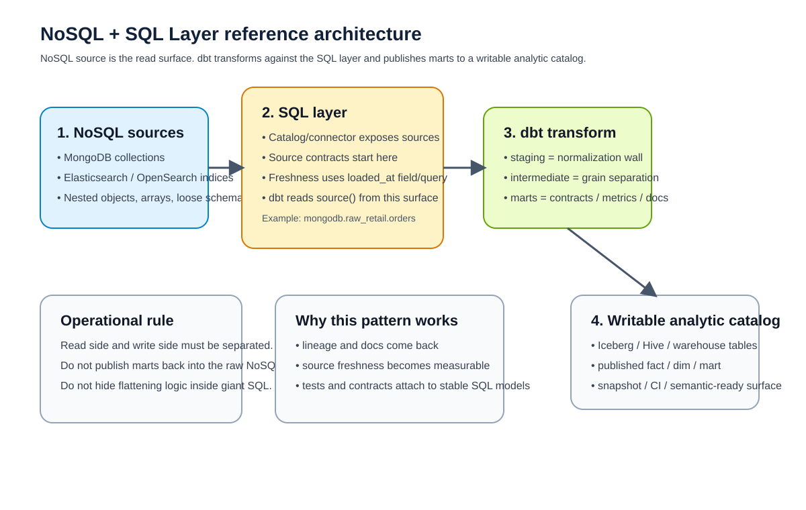

<a id="book-chapters-reference-v3-19-platform-playbook-nosql-sql-layer-md--191-이-패턴을-언제-쓰는가"></a>

### 19.1. 이 패턴을 언제 쓰는가

NoSQL + SQL Layer는 “가장 쉬운” 선택이 아니다.
다만 아래 같은 조건에서는 꽤 현실적인 선택이 된다.

<a id="book-chapters-reference-v3-19-platform-playbook-nosql-sql-layer-md--1911-잘-맞는-경우"></a>

#### 19.1.1. 잘 맞는 경우

- 운영계는 MongoDB인데, 분석계는 SQL로 통일하고 싶은 경우
- Elasticsearch/OpenSearch에 쌓인 검색·로그 문서를 SQL로 집계하고 싶은 경우
- 원천 저장소는 다양하지만, dbt 프로젝트는 하나의 SQL surface로 유지하고 싶은 경우
- raw는 문서형이어도, 최종 모델은 결국 fact/dim/metric 형태로 가야 하는 경우
- BI, semantic layer, contracts, tests, slim CI 같은 dbt 운영 습관을 그대로 가져가고 싶은 경우

<a id="book-chapters-reference-v3-19-platform-playbook-nosql-sql-layer-md--1912-덜-맞는-경우"></a>

#### 19.1.2. 덜 맞는 경우

- 문서 구조가 너무 자주 바뀌는데 SQL layer 쪽 table definition을 관리할 사람이 없는 경우
- nested object와 array가 지나치게 복잡해서 flatten 비용이 raw 자체보다 더 큰 경우
- source freshness를 판단할 `loaded_at` 성격의 필드가 전혀 없고, 운영 메타데이터도 약한 경우
- 검색 엔진의 relevance / full-text query가 핵심인데, 분석 팀이 이를 관계형 집계로 오해할 위험이 큰 경우
- writable analytic catalog가 따로 없어서 source와 mart를 같은 저장소 안에 뒤섞어야 하는 경우

핵심은 이거다.

> NoSQL + SQL Layer는 “dbt가 NoSQL을 직접 잘 다룬다”는 패턴이 아니라,
> “NoSQL을 SQL 표면 뒤에 두어 dbt가 강한 부분만 사용한다”는 패턴이다.

---

<a id="book-chapters-reference-v3-19-platform-playbook-nosql-sql-layer-md--192-읽기-면과-쓰기-면을-분리해-생각하기"></a>

### 19.2. 읽기 면과 쓰기 면을 분리해 생각하기

이 패턴에서는 read surface와 write surface를 분리해서 보는 것이 중요하다.

<a id="book-chapters-reference-v3-19-platform-playbook-nosql-sql-layer-md--1921-read-surface"></a>

#### 19.2.1. Read surface

read surface는 SQL layer가 노출하는 source다.
예를 들어:

- `mongodb.raw_retail.orders`
- `mongodb.raw_subscription.subscriptions`
- `elasticsearch.default.events_raw`

dbt 입장에서는 이들이 모두 “source table”처럼 보인다.
하지만 실제 저장소의 성격은 관계형 테이블과 전혀 다를 수 있다. 따라서 source 선언을 할 때부터 다음 질문을 함께 던져야 한다.

1. 비즈니스 키는 무엇인가?
2. 문서의 내부 `_id`와 비즈니스 키를 분리할 것인가?
3. freshness를 판단할 필드는 무엇인가?
4. 스키마가 흔들릴 때 어느 단계에서 fail 시킬 것인가?
5. array/nested object를 어느 레벨까지 staging에서 flatten 할 것인가?

<a id="book-chapters-reference-v3-19-platform-playbook-nosql-sql-layer-md--1922-write-surface"></a>

#### 19.2.2. Write surface

write surface는 dbt가 최종 모델을 남길 수 있는 곳이다.
보통은 Iceberg, Hive, DuckDB, warehouse table 같은 분석용 저장면이 된다.

이걸 분리하지 않으면 생기는 문제는 뻔하다.

- source와 mart의 경계가 흐려진다
- lineage 상에서 원천과 산출물의 역할이 섞인다
- snapshot/history/logging/contracts 적용 면이 애매해진다
- 배치 재실행이나 slim CI가 source 저장소 특성에 끌려간다

따라서 이 장의 기본 전제는 다음과 같다.

- 문서형·검색형 저장소는 읽기 면
- 최종 fact/dim/mart는 쓰기 가능한 SQL catalog

---

<a id="book-chapters-reference-v3-19-platform-playbook-nosql-sql-layer-md--193-source-계약부터-더-엄격하게-잡아야-한다"></a>

### 19.3. source 계약부터 더 엄격하게 잡아야 한다

관계형 원천에서는 `database.schema.table`만 맞으면 source 정의가 비교적 단순하다.
반면 NoSQL + SQL Layer에서는 source 정의가 사실상 계약의 시작점이다.

<a id="book-chapters-reference-v3-19-platform-playbook-nosql-sql-layer-md--1931-freshness는-거의-항상-명시적으로-두는-편이-낫다"></a>

#### 19.3.1. freshness는 거의 항상 명시적으로 두는 편이 낫다

dbt 공식 문서 기준으로 freshness는 `warn_after` / `error_after`와 함께 `loaded_at_field` 또는 `loaded_at_query`를 사용해 계산한다. 일부 adapter는 warehouse metadata 기반 freshness를 지원하지만, NoSQL source를 SQL layer로 읽는 경로에서는 대부분 `loaded_at_field`를 명시하는 편이 안전하다. `dbt source freshness` 결과는 `sources.json` artifact에도 남는다.
이건 문서형 원천에서 “데이터가 늦었는지”를 확인하는 거의 유일한 객관적 지표가 되기도 한다.

아래 예시는 MongoDB와 Elasticsearch를 SQL layer를 통해 source처럼 읽는다는 가정의 source YAML이다.

```yaml
version: 2

sources:
  - name: nosql_retail
    database: mongodb
    schema: raw_retail
    tables:
      - name: orders
        description: "MongoDB retail orders documents exposed through SQL layer"
        config:
          freshness:
            warn_after: {count: 2, period: hour}
            error_after: {count: 6, period: hour}
          loaded_at_field: "loaded_at_ts"
        columns:
          - name: sale_id
            description: "Business key for order-level analytics"
          - name: loaded_at_ts
            description: "Ingestion timestamp projected by SQL layer"

  - name: search_events
    database: elasticsearch
    schema: default
    tables:
      - name: events_raw
        description: "Event documents indexed in Elasticsearch and queried through SQL layer"
        config:
          freshness:
            warn_after: {count: 30, period: minute}
            error_after: {count: 90, period: minute}
          loaded_at_field: "ingest_ts"
```

전체 예시는 [`../codes/04_chapter_snippets/ch19/sources.nosql_sql_layer.yml`](codes/04_chapter_snippets/ch19/sources.nosql_sql_layer.yml)에 넣어 두었다.

<a id="book-chapters-reference-v3-19-platform-playbook-nosql-sql-layer-md--1932-내부-식별자와-비즈니스-키를-분리한다"></a>

#### 19.3.2. 내부 식별자와 비즈니스 키를 분리한다

MongoDB에는 `_id`가 있고, 검색 문서에는 `_id`, `_index`, `_score` 같은 메타 필드가 있다.
하지만 최종 mart에서 필요한 키가 항상 그것과 같지는 않다.

예를 들어 Retail Orders에서는:

- 문서 `_id`: 저장소 내부 식별자
- `sale_id`: 주문 비즈니스 키
- `customer_id`: 차후 dimension join 키

Subscription & Billing에서는:

- 문서 `_id`: 상태 스냅샷 row identity
- `subscription_id`: 계약/과금 추적용 비즈니스 키
- `account_id`: 고객 단위 rollup 키

이걸 초반에 섞어 버리면 contracts, tests, snapshots, merge key가 전부 흔들린다.

<a id="book-chapters-reference-v3-19-platform-playbook-nosql-sql-layer-md--1933-source-단계에서는-원형-보존--최소-계약만-잡는다"></a>

#### 19.3.3. source 단계에서는 “원형 보존 + 최소 계약”만 잡는다

source는 가능한 한 원형을 보존한다.
하지만 다음 정도는 source 설명 또는 source-level tests에서 먼저 고정하는 편이 좋다.

- 필수 필드 존재 여부
- loaded_at 성격의 시각 필드
- business key 후보
- 문서 상태를 나타내는 enum 성격 필드
- 삭제/취소/만료 같은 lifecycle 상태 필드

---

<a id="book-chapters-reference-v3-19-platform-playbook-nosql-sql-layer-md--194-staging은-정규화-벽이다"></a>

### 19.4. staging은 정규화 벽이다

문서형 원천을 관계형처럼 만드는 핵심은 staging이다.
이 장에서는 staging을 “rename 구간”이 아니라 normalization wall로 본다.

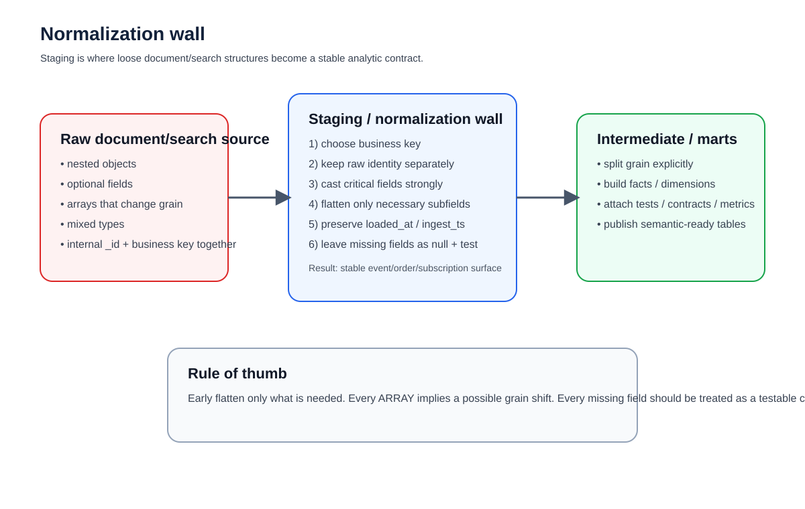

<a id="book-chapters-reference-v3-19-platform-playbook-nosql-sql-layer-md--1941-nested-object는-early-flatten-wide-flatten을-피한다"></a>

#### 19.4.1. nested object는 early flatten, wide flatten을 피한다

nested object를 처리할 때는 “가능한 한 빨리 모두 펼친다”보다
“후속 모델에서 바로 필요한 필드만 안정적으로 꺼낸다”가 더 낫다.

예를 들어 subscription document가 아래처럼 생겼다고 가정하자.

```json
{
  "_id": "6650...",
  "subscription_id": "sub_2003",
  "account": {
    "account_id": "acct_18",
    "segment": "enterprise"
  },
  "plan": {
    "plan_code": "pro_annual",
    "billing_cycle": "annual"
  },
  "status": "active",
  "mrr": 320.00,
  "loaded_at_ts": "2026-04-09T00:10:00Z"
}
```

staging에서는 다음 정도만 확정하면 충분하다.

- `subscription_id`
- `account.account_id AS account_id`
- `plan.plan_code AS plan_code`
- `status`
- `mrr`
- `loaded_at_ts`

모든 하위 구조를 한 번에 wide table로 만들기 시작하면, 이후 스키마 변화 때 수정 범위가 과도하게 커진다.

<a id="book-chapters-reference-v3-19-platform-playbook-nosql-sql-layer-md--1942-array는-기준-grain을-정한-뒤에만-explode-한다"></a>

#### 19.4.2. array는 기준 grain을 정한 뒤에만 explode 한다

Event Stream과 Retail Orders에서 특히 중요하다.

- `order_items`가 array면 주문 grain과 order_item grain을 나눠야 한다.
- event payload 안에 `products: []`가 있으면 event grain과 product impression grain을 분리해야 한다.

이걸 무시하고 explode 후 바로 aggregate하면 fanout을 알아채기 어렵다.
문서형 원천일수록 “array는 곧 grain 변경”이라는 감각이 더 중요하다.

<a id="book-chapters-reference-v3-19-platform-playbook-nosql-sql-layer-md--1943-강한-캐스팅과-기본값-전략을-같이-둔다"></a>

#### 19.4.3. 강한 캐스팅과 기본값 전략을 같이 둔다

문서형 원천에서는 `"100"`, `100`, `"100.0"`, `null`이 섞이는 일이 흔하다.
staging에서는 다음 기준을 고정하는 편이 좋다.

- 키 컬럼: 실패를 허용하지 않고 cast
- 지표 컬럼: cast 후 실패하면 `null`, downstream에서 별도 검증
- 상태 컬럼: `lower()` + enum test
- 날짜/시각: timestamp 표준화
- 없는 필드: 임의 기본값으로 채우기보다 `null` 유지 후 테스트

---

<a id="book-chapters-reference-v3-19-platform-playbook-nosql-sql-layer-md--195-mongodb-예시-retail-orders를-문서형-source에서-시작하기"></a>

### 19.5. MongoDB 예시: Retail Orders를 문서형 source에서 시작하기

MongoDB는 문서형 원천을 source로 드러내기에 가장 직관적이다.
Trino MongoDB connector는 MongoDB collection을 table처럼 노출하고, connector가 스키마 정보를 관리할 수 있는 schema collection(기본값 `_schema`)과 그에 대한 write access를 요구한다.

<a id="book-chapters-reference-v3-19-platform-playbook-nosql-sql-layer-md--1951-bootstrap-관점"></a>

#### 19.5.1. Bootstrap 관점

companion pack 기준으로는 JSONL을 `mongoimport`로 넣고, SQL layer가 그 컬렉션을 읽는 식이 가장 단순하다.

- day1: `orders_day1.jsonl`, `customers.jsonl`, `products.jsonl`, `order_items.jsonl`
- day2: `orders_day2_patch.jsonl` 또는 upsert/replace 방식
- source: SQL layer에서 `mongodb.raw_retail.orders`처럼 노출
- write: dbt는 Iceberg/Hive/warehouse 쪽 marts로 저장

Bootstrap 예시는 아래 스크립트에 넣어 두었다.

- [`../codes/04_chapter_snippets/ch19/mongo_retail_day1_import.sh`](codes/04_chapter_snippets/ch19/mongo_retail_day1_import.sh)
- [`../codes/04_chapter_snippets/ch19/mongo_retail_day2_import.sh`](codes/04_chapter_snippets/ch19/mongo_retail_day2_import.sh)

<a id="book-chapters-reference-v3-19-platform-playbook-nosql-sql-layer-md--1952-retail-orders에서-보는-핵심-포인트"></a>

#### 19.5.2. Retail Orders에서 보는 핵심 포인트

Retail Orders를 MongoDB source에서 시작하면 가장 먼저 드러나는 문제는 다음 두 가지다.

1. 주문 문서와 주문상세 array를 어떻게 나눌 것인가
2. `sale_id`와 문서 `_id` 중 어떤 것을 merge/snapshot/contracts의 기준으로 쓸 것인가

추천 기준은 이렇다.

- `_id`: raw identity로 보존
- `sale_id`: mart key와 business key로 사용
- order item array가 raw 안에 있다면 staging에서 line grain으로 분리
- `loaded_at_ts`를 반드시 유지해서 freshness와 retry 진단에 사용

예시 staging 모델:

```sql
with src as (
    select *
    from {{ source('nosql_retail', 'orders') }}
)

select
    cast(_id as varchar) as raw_document_id,
    cast(sale_id as varchar) as sale_id,
    cast(customer_id as varchar) as customer_id,
    cast(order_status as varchar) as order_status,
    cast(total_amount as decimal(18, 2)) as total_amount,
    cast(loaded_at_ts as timestamp) as loaded_at_ts
from src
where sale_id is not null
```

전체 예시는 [`../codes/04_chapter_snippets/ch19/stg_orders_from_mongo.sql`](codes/04_chapter_snippets/ch19/stg_orders_from_mongo.sql)에 있다.

---

<a id="book-chapters-reference-v3-19-platform-playbook-nosql-sql-layer-md--196-elasticsearch-예시-event-stream을-검색-문서에서-시작하기"></a>

### 19.6. Elasticsearch 예시: Event Stream을 검색 문서에서 시작하기

검색 엔진 source는 문서형 source와 비슷하지만, 읽는 목적이 다르다.
Elasticsearch/OpenSearch는 “검색과 indexing”이 중심이지, fact table 저장소가 아니다. 따라서 이 장에서는 search documents를 source처럼 읽되, 집계와 published metrics는 별도 analytic surface로 옮긴다는 기준을 분명히 둔다.

Trino Elasticsearch connector는 Elasticsearch 7.x/8.x를 대상으로 하고, host/port/default-schema-name 같은 catalog 설정을 사용한다. 또 array types, raw JSON transform, full text query, special columns 같은 별도 특성이 있다.

<a id="book-chapters-reference-v3-19-platform-playbook-nosql-sql-layer-md--1961-event-stream에서-보는-핵심-포인트"></a>

#### 19.6.1. Event Stream에서 보는 핵심 포인트

Event Stream을 search document로 읽으면 다음 문제가 먼저 나온다.

- 한 문서가 곧 event grain인지, session summary인지 혼재될 수 있음
- `attributes`, `context`, `items` 같은 nested field가 유동적
- `@timestamp`, `ingest_ts`, `event_time`이 서로 다를 수 있음
- full text 검색용 field와 집계용 field의 설계 목적이 다름

그래서 staging에서는 먼저 event grain만 고정해야 한다.

- `event_id`
- `user_id`
- `event_name`
- `event_ts`
- `session_id`
- `ingest_ts`
- `platform`
- `country_code`

그 후 intermediate/marts에서만 session/day grain으로 올린다.

예시 staging 모델:

```sql
with src as (
    select *
    from {{ source('search_events', 'events_raw') }}
)

select
    cast(event_id as varchar) as event_id,
    cast(user_id as varchar) as user_id,
    cast(event_name as varchar) as event_name,
    cast(session_id as varchar) as session_id,
    cast(platform as varchar) as platform,
    cast(country_code as varchar) as country_code,
    cast(event_ts as timestamp) as event_ts,
    cast(ingest_ts as timestamp) as ingest_ts
from src
where event_id is not null
```

전체 예시는 [`../codes/04_chapter_snippets/ch19/stg_events_from_search.sql`](codes/04_chapter_snippets/ch19/stg_events_from_search.sql)에 넣어 두었다.

<a id="book-chapters-reference-v3-19-platform-playbook-nosql-sql-layer-md--1962-elasticsearch에서는-source-freshness와-query-cost를-같이-본다"></a>

#### 19.6.2. Elasticsearch에서는 source freshness와 query cost를 같이 본다

검색 엔진 source를 analytics에 쓰면 “문서가 늦게 들어온 것”과 “scroll/scan 비용이 비싼 것”이 동시에 문제가 된다.
따라서 Event Stream에서는 다음 루틴을 추천한다.

1. source freshness로 ingestion delay 먼저 확인
2. session/day marts는 batch window 기준으로 incremental
3. full scan을 줄이기 위해 lookback을 과도하게 넓히지 않기
4. 필요한 경우 raw document 전체를 다시 읽지 않고 curated staging table을 source처럼 재사용

---

<a id="book-chapters-reference-v3-19-platform-playbook-nosql-sql-layer-md--197-subscription--billing-문서형-상태-변화와-snapshot의-만남"></a>

### 19.7. Subscription & Billing: 문서형 상태 변화와 snapshot의 만남

Subscription 도메인은 문서형 원천과 특히 잘 맞기도 하고, 특히 위험하기도 하다.

잘 맞는 이유:
- 계약 상태, 플랜, 고객 속성이 문서형으로 묶여 들어오기 쉬움

위험한 이유:
- status change가 누락되면 MRR/active subscriber 계산이 틀어짐
- current document만 보고는 상태 이력을 잃기 쉬움
- “invoice가 있었으니 active” 같은 잘못된 추론이 생기기 쉬움

<a id="book-chapters-reference-v3-19-platform-playbook-nosql-sql-layer-md--1971-이-도메인에서-가장-먼저-정할-것"></a>

#### 19.7.1. 이 도메인에서 가장 먼저 정할 것

- `subscription_id`가 business key인가?
- 한 문서가 current snapshot인가, change event인가?
- `loaded_at_ts`와 business effective time이 다른가?
- status history를 snapshot으로 만들 것인가, raw source의 change log를 신뢰할 것인가?

staging 예시는 아래처럼 최소 surface만 확정하는 식이 좋다.

```sql
with src as (
    select *
    from {{ source('nosql_subscription', 'subscriptions') }}
)

select
    cast(_id as varchar) as raw_document_id,
    cast(subscription_id as varchar) as subscription_id,
    cast(account_id as varchar) as account_id,
    cast(plan_code as varchar) as plan_code,
    cast(status as varchar) as status,
    cast(mrr as decimal(18, 2)) as mrr,
    cast(effective_at as timestamp) as effective_at,
    cast(loaded_at_ts as timestamp) as loaded_at_ts
from src
where subscription_id is not null
```

전체 예시는 [`../codes/04_chapter_snippets/ch19/stg_subscription_docs.sql`](codes/04_chapter_snippets/ch19/stg_subscription_docs.sql)에 있다.

<a id="book-chapters-reference-v3-19-platform-playbook-nosql-sql-layer-md--1972-snapshot이-특히-중요한-이유"></a>

#### 19.7.2. snapshot이 특히 중요한 이유

문서형 source가 current state만 제공하면, 구독 상태 이력은 금방 사라진다.
이때 dbt snapshot은 여전히 유용하다. 다만 기억할 점은 이것이다.

- snapshot은 source change log를 대체하는 것이 아니라 이력을 보강하는 배치 계층이다
- current surface와 historical surface를 따로 본다
- `subscription_id`는 business key, `dbt_valid_from`/`dbt_valid_to`는 history key다

---

<a id="book-chapters-reference-v3-19-platform-playbook-nosql-sql-layer-md--198-테스트-전략은-관계형보다-더-엄격해야-한다"></a>

### 19.8. 테스트 전략은 관계형보다 더 엄격해야 한다

NoSQL + SQL Layer에서는 테스트를 덜 붙이면 안 된다.
오히려 더 일찍, 더 엄격하게 붙여야 한다.

<a id="book-chapters-reference-v3-19-platform-playbook-nosql-sql-layer-md--1981-가장-먼저-붙일-것"></a>

#### 19.8.1. 가장 먼저 붙일 것

- `not_null` on business key
- `accepted_values` on status / event_name
- `relationships` on downstream marts
- singular test for required fields after flattening
- source freshness

예를 들어 문서형 source는 “필드가 존재하긴 하는데 null”과 “필드 자체가 없다”가 섞인다.
SQL layer에선 결국 둘 다 null처럼 보일 수 있으므로, staging 이후에 required field singular test를 따로 두는 것이 좋다.

예시 singular test:

```sql
select *
from {{ ref('stg_orders_from_mongo') }}
where sale_id is null
   or customer_id is null
```

전체 예시는 [`../codes/04_chapter_snippets/ch19/schema_drift_required_fields.sql`](codes/04_chapter_snippets/ch19/schema_drift_required_fields.sql)에 있다.

<a id="book-chapters-reference-v3-19-platform-playbook-nosql-sql-layer-md--1982-source-freshness는-지연을-보고-tests는-모양을-본다"></a>

#### 19.8.2. source freshness는 “지연”을 보고, tests는 “모양”을 본다

둘은 대체 관계가 아니다.

- freshness: 데이터가 늦었는가
- tests: 데이터 모양이 깨졌는가

NoSQL source에서는 두 축이 자주 동시에 깨진다.
예를 들어 Elasticsearch ingestion이 지연되면 freshness가 먼저 이상해지고, 그 과정에서 일부 field 매핑이 바뀌면 tests도 깨질 수 있다.

---

<a id="book-chapters-reference-v3-19-platform-playbook-nosql-sql-layer-md--199-세-casebook를-이-패턴에서-어떻게-읽을까"></a>

### 19.9. 세 casebook를 이 패턴에서 어떻게 읽을까

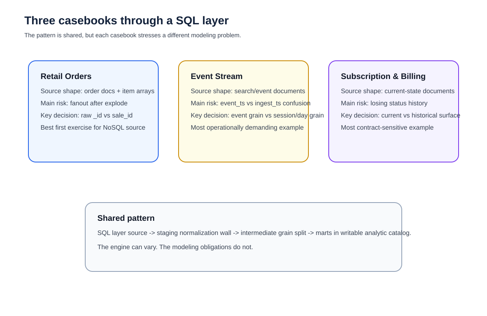

<a id="book-chapters-reference-v3-19-platform-playbook-nosql-sql-layer-md--1991-retail-orders"></a>

#### 19.9.1. Retail Orders

가장 적합한 학습용 예제다.
문서형 orders + nested items를 line grain으로 분리하는 연습이 좋다.
핵심 질문은 “주문 grain과 line grain을 어디서 나누는가”다.

<a id="book-chapters-reference-v3-19-platform-playbook-nosql-sql-layer-md--1992-event-stream"></a>

#### 19.9.2. Event Stream

가장 운영 난도가 높은 예제다.
검색 문서를 analytics surface로 옮길 때, event grain과 session/day grain을 분리하지 않으면 비용과 품질이 동시에 흔들린다.
핵심 질문은 “ingest_ts와 event_ts를 어떻게 함께 다룰 것인가”다.

<a id="book-chapters-reference-v3-19-platform-playbook-nosql-sql-layer-md--1993-subscription--billing"></a>

#### 19.9.3. Subscription & Billing

가장 계약/이력 관리가 중요한 예제다.
current document는 보기 쉽지만, 상태 변화와 effective time을 잃기 쉽다.
핵심 질문은 “subscription current state와 historical state를 어떻게 분리할 것인가”다.

---

<a id="book-chapters-reference-v3-19-platform-playbook-nosql-sql-layer-md--1910-운영-체크리스트"></a>

### 19.10. 운영 체크리스트

<a id="book-chapters-reference-v3-19-platform-playbook-nosql-sql-layer-md--19101-mongodb-source를-붙일-때"></a>

#### 19.10.1. MongoDB source를 붙일 때

- collection별 business key가 명확한가
- `_schema` 관리 책임이 있는가
- source freshness용 `loaded_at_ts`를 projection 했는가
- array/nested field를 어느 단계에서 flatten 할지 합의했는가
- `_id`를 raw identity로만 쓰는지, business key로도 쓸지 명확한가

<a id="book-chapters-reference-v3-19-platform-playbook-nosql-sql-layer-md--19102-elasticsearch-source를-붙일-때"></a>

#### 19.10.2. Elasticsearch source를 붙일 때

- event time과 ingest time을 구분했는가
- full-text search field와 analytics field를 혼동하지 않는가
- scan cost와 scroll 특성을 감안해 incremental/lookback을 잡았는가
- source freshness 기준이 명확한가
- raw document 전체를 marts까지 끌고 가지 않는가

<a id="book-chapters-reference-v3-19-platform-playbook-nosql-sql-layer-md--19103-공통"></a>

#### 19.10.3. 공통

- source는 SQL layer를 기준으로 선언한다
- marts는 writable analytic catalog에 남긴다
- source freshness와 required-field tests를 함께 본다
- raw identity와 business key를 구분한다
- staging에서 “가능한 만큼”이 아니라 “필요한 만큼만” flatten 한다

---

<a id="book-chapters-reference-v3-19-platform-playbook-nosql-sql-layer-md--1911-안티패턴"></a>

### 19.11. 안티패턴

<a id="book-chapters-reference-v3-19-platform-playbook-nosql-sql-layer-md--안티패턴-1-raw-json을-model-sql-안에서-직접-파싱한다"></a>

#### 안티패턴 1. raw JSON을 model SQL 안에서 직접 파싱한다
이렇게 하면 lineage가 끊기고, source freshness와 docs가 약해진다.

<a id="book-chapters-reference-v3-19-platform-playbook-nosql-sql-layer-md--안티패턴-2-array를-explode한-뒤-grain-설명-없이-바로-aggregate-한다"></a>

#### 안티패턴 2. array를 explode한 뒤 grain 설명 없이 바로 aggregate 한다
fanout을 눈치채기 가장 어려운 패턴이다.

<a id="book-chapters-reference-v3-19-platform-playbook-nosql-sql-layer-md--안티패턴-3-_id를-아무-설명-없이-mart-primary-key처럼-사용한다"></a>

#### 안티패턴 3. `_id`를 아무 설명 없이 mart primary key처럼 사용한다
내부 식별자와 비즈니스 키를 섞게 된다.

<a id="book-chapters-reference-v3-19-platform-playbook-nosql-sql-layer-md--안티패턴-4-source-freshness-없이-최신이라고-가정한다"></a>

#### 안티패턴 4. source freshness 없이 “최신이라고 가정”한다
NoSQL source는 지연 여부가 눈에 덜 보인다. freshness를 따로 봐야 한다.

<a id="book-chapters-reference-v3-19-platform-playbook-nosql-sql-layer-md--안티패턴-5-nosql-source에-바로-public-contract를-건다"></a>

#### 안티패턴 5. NoSQL source에 바로 public contract를 건다
먼저 staging/int를 안정화하고, marts에서 contract를 거는 편이 낫다.

---

<a id="book-chapters-reference-v3-19-platform-playbook-nosql-sql-layer-md--1912-직접-해보기"></a>

### 19.12. 직접 해보기

1. MongoDB retail orders day1 import 후 `dbt source freshness`를 실행해 본다.
2. `stg_orders_from_mongo`에서 `sale_id`, `customer_id`, `loaded_at_ts`만 남기고 나머지는 보존 컬럼으로 넘겨 본다.
3. Elasticsearch event documents에서 `event_ts`와 `ingest_ts`를 둘 다 노출한 staging 모델을 만든다.
4. Subscription 문서에서 `subscription_id`를 business key로, `_id`를 raw identity로 유지하는 staging 모델을 작성한다.
5. singular test로 required fields 검사를 붙이고, 하나의 필드를 일부러 누락시켜 실패를 재현한다.

---

<a id="book-chapters-reference-v3-19-platform-playbook-nosql-sql-layer-md--1913-이-장의-핵심"></a>

### 19.13. 이 장의 핵심

- NoSQL + SQL Layer는 Trino를 또 설명하는 장이 아니라, 느슨한 source를 dbt 계약으로 바꾸는 장이다.
- 핵심은 connector 자체보다 source 계약, normalization wall, business key, freshness, tests다.
- 문서형·검색형 source는 raw를 오래 믿지 말고, staging에서 보수적으로 정리해야 한다.
- 세 casebook는 이 패턴에서 모두 돌아가지만, 가장 쉬운 건 Retail, 가장 까다로운 건 Event Stream, 가장 계약 관리가 중요한 건 Subscription & Billing이다.

---

<a id="book-chapters-reference-v3-20-platform-playbook-databricks-md"></a>

장별 원고: [chapters/reference-v3/20-platform-playbook-databricks.md](chapters/reference-v3/20-platform-playbook-databricks.md)

<a id="book-chapters-reference-v3-20-platform-playbook-databricks-md--chapter-20--platform-playbook--databricks"></a>

## CHAPTER 20 · Platform Playbook · Databricks

> **마당마켓 본편 연결:** [J13 · 메달리온 말고 다른 설계를 선택해야 할 때](#book-journey-13-architecture-alternatives-md)에서 같은 상점의 누적 실습으로 돌아갈 수 있다. 이 참고편의 `codes/` 스니펫에는 독립 fixture가 포함되어 있으며 본편 `lab/`의 P1~P5와 섞지 않는다. 플랫폼별 구문·기능은 실행 버전에 맞춰 재확인한다.


> Unity Catalog, SQL Warehouse, Jobs Cluster, Delta, Python model, Materialized View / Streaming Table을 한 플랫폼 안에서 함께 가져가는 운영형 플레이북

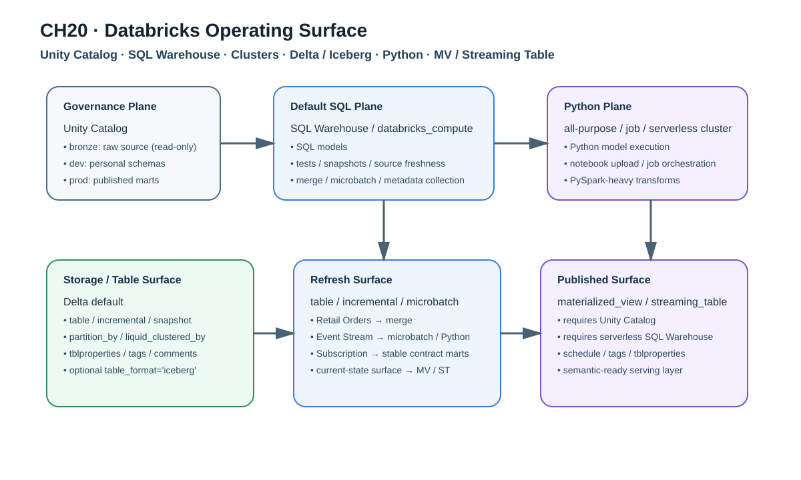

Databricks는 이 책에서 다루는 다른 플랫폼과 결이 조금 다르다.
DuckDB처럼 "가볍게 로컬에서 개념을 익히는 엔진"도 아니고, PostgreSQL처럼 "관계형 데이터베이스 위에서 dbt 모델을 오래 운영하는 플랫폼"도 아니며, Snowflake처럼 "warehouse/role/query tag를 축으로 운영을 설계하는 엔터프라이즈 DW"와도 1:1로 같지 않다.

Databricks에서 dbt를 쓴다는 것은 보통 아래를 한꺼번에 다룬다는 뜻이다.

- Unity Catalog를 기준으로 catalog / schema / privilege를 설계한다.
- Delta Lake를 기본 저장 포맷으로 생각한다.
- SQL Warehouse와 all-purpose cluster, job cluster를 함께 쓴다.
- SQL model뿐 아니라 Python model까지 같은 프로젝트 안에서 운영할 수 있다.
- 경우에 따라 incremental 대신 materialized view / streaming table로 넘길 수 있다.
- 세 예제 트랙(Retail Orders / Event Stream / Subscription & Billing)을 모두 한 플랫폼 안에서 실험할 수 있다.

그래서 Databricks 플레이북은 단순히 `profiles.yml` 한 장으로 끝나지 않는다.
이 장의 목적은 Databricks에서 dbt를 어디까지 맡길지, 어떤 계산은 SQL Warehouse에서 하고 어떤 계산은 Python cluster로 보낼지, 어떤 surface를 Delta table로 남기고 어떤 surface를 Materialized View 또는 Streaming Table로 승격할지를 판단할 수 있게 만드는 것이다.

---

<a id="book-chapters-reference-v3-20-platform-playbook-databricks-md--201-왜-databricks는-별도-플레이북이어야-하는가"></a>

### 20.1. 왜 Databricks는 별도 플레이북이어야 하는가

Databricks는 dbt에게 단순한 SQL 실행 대상이 아니다.
lakehouse라는 말이 과장처럼 들릴 때도 있지만, dbt 관점에서는 최소한 다음 네 가지를 동시에 고려하게 만든다는 점에서 분명히 별도 플레이북이 필요하다.

1. 저장 구조
   Delta가 기본이며, 경우에 따라 Iceberg compatibility까지 고려할 수 있다.

2. 거버넌스 구조
   Unity Catalog를 기준으로 dev / prod / personal schema를 설계해야 한다.

3. 실행 구조
   SQL Warehouse, all-purpose cluster, job cluster, serverless cluster가 각기 다른 속도와 비용 특성을 가진다.

4. 산출 구조
   table / incremental뿐 아니라 materialized_view, streaming_table, Python model, query tags, tags, tblproperties까지 같이 운영할 수 있다.

즉, Databricks는 "어댑터 하나 추가"가 아니라 운영 표면이 넓은 플랫폼이다.
이 장에서는 그래서 단순 설치보다 어떤 surface를 어떤 목적으로 써야 하는가에 집중한다.

<a id="book-chapters-reference-v3-20-platform-playbook-databricks-md--2011-먼저-어댑터부터-바로잡자"></a>

#### 20.1.1. 먼저 어댑터부터 바로잡자

Databricks에서 dbt를 쓸 때는 `dbt-spark`가 아니라 `dbt-databricks`를 기준으로 보는 것이 맞다.
이 어댑터는 Databricks 전용 connection surface, Unity Catalog, SQL Warehouse, Python submission methods, materialized views / streaming tables, query tags 같은 기능을 직접 다룬다.

실무에서 오래된 프로젝트를 볼 때는 아직도 `dbt-spark` 기반 흔적이 남아 있을 수 있다.
하지만 새로 정리하는 책이나 팀 표준 문서에서는 Databricks 전용 어댑터를 기준으로 쓰는 것이 안전하다.

<a id="book-chapters-reference-v3-20-platform-playbook-databricks-md--2012-unity-catalog를-기준으로-생각해야-하는-이유"></a>

#### 20.1.2. Unity Catalog를 기준으로 생각해야 하는 이유

Databricks를 제대로 쓰려면 catalog를 먼저 생각해야 한다.
이 책에서 반복해서 강조한 "개발/운영 환경 분리", "source는 읽기 전용", "public mart는 계약된 surface" 같은 원칙이 Databricks에서는 Unity Catalog와 잘 맞물린다.

가장 안전한 기본선은 아래와 같다.

- bronze catalog: raw source를 읽기 전용으로 둔다.
- dev catalog: 개발자 개인 schema를 둔다.
- prod catalog: 팀이 publish하는 shared schema를 둔다.

그러면 모든 환경이 같은 source를 참조하면서도, 개발자가 실수로 운영 surface를 덮어쓸 가능성을 줄일 수 있다.

---

<a id="book-chapters-reference-v3-20-platform-playbook-databricks-md--202-databricks의-운영-표면을-먼저-그려-보자"></a>

### 20.2. Databricks의 운영 표면을 먼저 그려 보자

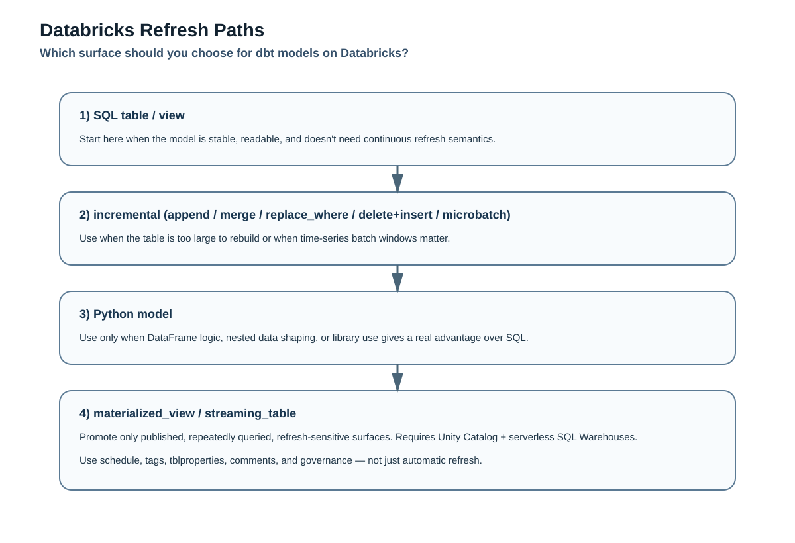

Databricks에서 dbt를 운영할 때 가장 자주 헷갈리는 것은 "어느 compute에서 무엇이 실행되는가"다.
이를 먼저 분리해 두면 materialization과 성능, 비용 판단이 쉬워진다.

<a id="book-chapters-reference-v3-20-platform-playbook-databricks-md--2021-sql-warehouse와-cluster는-역할이-다르다"></a>

#### 20.2.1. SQL Warehouse와 cluster는 역할이 다르다

<a id="book-chapters-reference-v3-20-platform-playbook-databricks-md--sql-warehouse"></a>

##### SQL Warehouse
- 대부분의 SQL model
- tests
- snapshots
- docs metadata collection
- source freshness
- 일반적인 incremental merge

에 잘 맞는다.

<a id="book-chapters-reference-v3-20-platform-playbook-databricks-md--all-purpose-cluster"></a>

##### all-purpose cluster
- 개발 중 Python model을 빠르게 반복 실행할 때
- notebook을 열어 확인하며 디버깅할 때
- interactive한 PySpark 실험이 필요할 때

에 잘 맞는다.

<a id="book-chapters-reference-v3-20-platform-playbook-databricks-md--job-cluster"></a>

##### job cluster
- 길게 도는 Python model
- production batch
- cluster를 짧게 띄웠다가 내리는 실행
- 개발보다 비용을 더 신경 쓸 때

에 잘 맞는다.

즉, SQL Warehouse = 기본 실행면,
cluster = Python 또는 특수 계산의 실행면으로 생각하면 감각이 잡힌다.

<a id="book-chapters-reference-v3-20-platform-playbook-databricks-md--2022-databricks에서-compute를-두-층으로-보라"></a>

#### 20.2.2. Databricks에서 compute를 두 층으로 보라

Databricks chapter에서 자주 나오는 혼란은 이거다.

- "profile의 `http_path`가 있는데, 왜 Python model 안에서 또 compute를 적어야 하지?"
- "`databricks_compute`를 줬는데 왜 Python은 다른 cluster에서 돌아가지?"
- "왜 SQL은 빠른데 Python model은 시작이 느리지?"

이건 SQL phase와 Python phase가 같은 compute를 공유하지 않을 수 있기 때문이다.

특히 Python incremental model은
1. Python 코드로 stage를 만들고
2. 그 결과를 SQL로 merge
하는 식으로 움직이기 때문에,

- Python execution compute
- SQL merge compute

를 따로 생각해야 하는 경우가 많다.

<a id="book-chapters-reference-v3-20-platform-playbook-databricks-md--2023-notebook-생성-위치도-운영-포인트다"></a>

#### 20.2.3. Notebook 생성 위치도 운영 포인트다

Databricks Python model은 compiled PySpark 코드를 notebook 형태로 업로드해 실행할 수 있다.
이때 notebook이 어디에 쓰이는지, 누가 볼 수 있는지, debugging 후 사람이 UI에서 수정을 해버리는지 같은 운영 문제가 생긴다.

따라서 팀 규칙을 이렇게 잡는 것이 좋다.

- 개발 중: notebook 생성 허용, UI 확인 가능
- 운영: code is source of truth, UI 수정을 절대 정답으로 보지 않음
- Python model path, user folder, Shared folder 정책을 명시

---

<a id="book-chapters-reference-v3-20-platform-playbook-databricks-md--203-연결과-bootstrap을-어떻게-시작할까"></a>

### 20.3. 연결과 bootstrap을 어떻게 시작할까

<a id="book-chapters-reference-v3-20-platform-playbook-databricks-md--2031-최소-profile의-기준선"></a>

#### 20.3.1. 최소 profile의 기준선

Databricks에서는 보통 아래 네 값이 핵심이다.

- `host`
- `http_path`
- `token`
- `schema`

Unity Catalog를 쓰고 있다면 `catalog`도 함께 둔다.

예시는 companion code에 넣어 두었다.

- [`profiles.databricks.example.yml`](codes/04_chapter_snippets/ch20/profiles.databricks.example.yml)

실무에서는 dev / prod target을 분리하고, 공통 query tag를 profile 수준에서 넣어 두는 편이 좋다.

<a id="book-chapters-reference-v3-20-platform-playbook-databricks-md--2032-source는-bronze를-읽기-전용으로-선언하라"></a>

#### 20.3.2. source는 bronze를 읽기 전용으로 선언하라

Databricks에서는 raw source를 별도 bronze catalog에 두는 설계가 자연스럽다.
이 책의 세 예제도 Databricks에서는 아래처럼 source를 정의하는 것이 좋다.

- Retail Orders → `bronze.raw_retail.orders`
- Event Stream → `bronze.raw_events.events`
- Subscription & Billing → `bronze.raw_billing.subscriptions`

중요한 점은 dev와 prod가 모두 같은 bronze를 읽되, dbt가 쓰는 대상만 dev/prod로 나뉘게 하는 것이다.

이렇게 해야 development 환경에서 본 결과가 production에서도 재현된다.

<a id="book-chapters-reference-v3-20-platform-playbook-databricks-md--2033-first-run-전에-확인할-것"></a>

#### 20.3.3. first run 전에 확인할 것

Databricks는 connection success만으로 끝나지 않는다.
아래 네 가지를 같이 봐야 한다.

1. 내가 접속한 compute가 SQL Warehouse인지, all-purpose cluster인지
2. target catalog/schema에 create 권한이 있는지
3. bronze source catalog에 read 권한이 있는지
4. Python model을 돌릴 경우 cluster execution path가 준비되어 있는지

이를 위해 preflight SQL과 first-run shell 예시를 companion code에 넣어 두었다.

- [`databricks_preflight.sql`](codes/04_chapter_snippets/ch20/databricks_preflight.sql)
- [`first_run_databricks.sh`](codes/04_chapter_snippets/ch20/first_run_databricks.sh)

---

<a id="book-chapters-reference-v3-20-platform-playbook-databricks-md--204-databricks에서-materialization을-고르는-법"></a>

### 20.4. Databricks에서 materialization을 고르는 법

<a id="book-chapters-reference-v3-20-platform-playbook-databricks-md--2041-기본선은-delta-table--incremental이다"></a>

#### 20.4.1. 기본선은 Delta table / incremental이다

Databricks에서는 다른 이유가 없으면 다음을 기본선으로 두는 것이 좋다.

- staging: view 또는 table
- intermediate: table 또는 incremental
- marts: table 또는 incremental
- event/time-series mart: incremental with microbatch 고려
- published surface: 경우에 따라 materialized_view / streaming_table 고려

핵심은 Delta를 기준으로 안정적인 운영 루프를 먼저 만든 뒤,
정말 필요한 곳만 Databricks-native refresh surface로 승격하는 것이다.

<a id="book-chapters-reference-v3-20-platform-playbook-databricks-md--2042-incremental-전략은-케이스별로-나뉜다"></a>

#### 20.4.2. incremental 전략은 케이스별로 나뉜다

Databricks adapter는 여러 incremental 전략을 지원한다.
실무 감각으로 정리하면 대략 이렇게 본다.

<a id="book-chapters-reference-v3-20-platform-playbook-databricks-md--append"></a>

##### append
- 단순 append-only 원천
- 중복이나 update 처리 필요가 적음
- 가장 단순

<a id="book-chapters-reference-v3-20-platform-playbook-databricks-md--merge"></a>

##### merge
- business key가 분명함
- 업데이트/정정이 들어옴
- Retail Orders, Subscription 상태 테이블에 적합

<a id="book-chapters-reference-v3-20-platform-playbook-databricks-md--replace_where"></a>

##### replace_where
- 특정 범위만 다시 덮어쓰고 싶음
- 날짜 파티션 재계산 등에 적합

<a id="book-chapters-reference-v3-20-platform-playbook-databricks-md--deleteinsert"></a>

##### delete+insert
- 명시적으로 교체하고 싶음
- `unique_key` 기준으로 기존 행 삭제 후 삽입

<a id="book-chapters-reference-v3-20-platform-playbook-databricks-md--microbatch"></a>

##### microbatch
- time-series, 대용량 이벤트
- `event_time` 기준 배치 계산
- Event Stream casebook에 특히 잘 맞음

<a id="book-chapters-reference-v3-20-platform-playbook-databricks-md--2043-partition과-liquid-clustering을-같이-보라"></a>

#### 20.4.3. partition과 liquid clustering을 같이 보라

Databricks에서 흔한 실수는 파티션을 너무 많이 잘게 쪼개는 것이다.
또 다른 실수는 모든 테이블에 무작정 liquid clustering을 붙이는 것이다.

안전한 기준은 다음과 같다.

- 날짜 기반 pruning이 아주 중요하다 → `partition_by`
- selective filter가 있고 file layout 최적화가 필요하다 → `liquid_clustered_by`
- 둘을 동시에 쓰려 하지 않는다
- 작은 테이블에는 둘 다 과할 수 있다

<a id="book-chapters-reference-v3-20-platform-playbook-databricks-md--2044-delta를-기본으로-두고-iceberg는-의도적으로-선택하라"></a>

#### 20.4.4. Delta를 기본으로 두고 Iceberg는 의도적으로 선택하라

Databricks는 `table_format='iceberg'`도 지원하지만, 이것을 "Delta 대신 그냥 쓰는 옵션"으로 이해하면 안 된다.

이 책 기준으로는 다음처럼 보는 게 안전하다.

- 기본선: Delta
- 특수 목적: Iceberg compatibility가 필요한 published surface
- 주의점: `table_format='iceberg'`일 때는 `file_format='delta'` 조건과 table property의 의미를 함께 이해해야 한다

즉, Databricks chapter에서 Iceberg는 "기본값"이 아니라 상호운용성 선택지다.

---

<a id="book-chapters-reference-v3-20-platform-playbook-databricks-md--205-databricks-고유-surface-materialized_view-streaming_table-tags"></a>

### 20.5. Databricks 고유 surface: materialized_view, streaming_table, tags

<a id="book-chapters-reference-v3-20-platform-playbook-databricks-md--2051-언제-incremental-대신-mvst를-볼까"></a>

#### 20.5.1. 언제 incremental 대신 MV/ST를 볼까

Databricks에서는 materialized view와 streaming table을 incremental의 대체 surface로 쓸 수 있다.
하지만 모든 곳에 쓰는 것이 아니라, refresh 주기와 publish 목적이 분명한 surface에 쓰는 편이 좋다.

예를 들면:

- `fct_orders`처럼 강한 배치 통제가 필요 → 일반 incremental/table
- `fct_events_daily`처럼 시간 단위 반복 집계가 많음 → microbatch 또는 materialized view 검토
- `current_mrr_surface`처럼 "현재 상태"를 자주 읽는 surface → materialized view 또는 streaming table 검토

중요한 점은 이 기능을 쓰려면 Unity Catalog + serverless SQL Warehouses가 준비되어 있어야 한다는 것이다.

<a id="book-chapters-reference-v3-20-platform-playbook-databricks-md--2052-schedule-tags-tblproperties는-운영-메타데이터다"></a>

#### 20.5.2. schedule, tags, tblproperties는 운영 메타데이터다

Databricks의 materialized view / streaming table은 단순히 "자동 갱신되는 객체"로만 보면 아깝다.
schedule, `tblproperties`, `databricks_tags`, `description`을 함께 써야 운영 surface가 된다.

예:
- schedule: 얼마나 자주 refresh할지
- tags: 이 surface가 finance용인지, pii가 있는지
- tblproperties: optimize 관련 정책이나 format interoperability
- description: published surface의 의미를 남기는 설명

<a id="book-chapters-reference-v3-20-platform-playbook-databricks-md--2053-query-tags는-databricks에서-특히-유용하다"></a>

#### 20.5.3. query tags는 Databricks에서 특히 유용하다

Databricks query history와 system table을 보는 팀이라면 query tags는 단순 장식이 아니다.
팀, 환경, cost center, 프로젝트 이름, casebook 이름을 남기면 비용/디버깅/감사 추적이 쉬워진다.

권장 패턴은 아래와 같다.

- profile: 공통 태그 (`team`, `project`, `env`)
- model-level: 특화 태그 (`casebook`, `cost_center`, `priority`)

단, query tags는 workspace 가용성 차이가 있을 수 있고, 기본 dbt 태그와 합쳐서 총 개수 제한을 넘지 않도록 주의해야 한다.

---

<a id="book-chapters-reference-v3-20-platform-playbook-databricks-md--206-python-models는-databricks에서-어떻게-보아야-하나"></a>

### 20.6. Python models는 Databricks에서 어떻게 보아야 하나

Databricks는 Python model을 진지하게 고려할 만한 몇 안 되는 주요 플랫폼이다.
그렇다고 모든 모델을 Python으로 바꾸라는 뜻은 아니다.

<a id="book-chapters-reference-v3-20-platform-playbook-databricks-md--2061-sql로-충분한-것은-sql로-남겨라"></a>

#### 20.6.1. SQL로 충분한 것은 SQL로 남겨라

이 책 기준으로 대부분의 모델은 SQL로 충분하다.

- Retail Orders의 staging / marts
- Subscription & Billing의 current MRR mart
- Event Stream의 일 단위 집계

는 기본적으로 SQL이 더 단순하고 diff/review도 쉽다.

<a id="book-chapters-reference-v3-20-platform-playbook-databricks-md--2062-python-model이-특히-빛나는-경우"></a>

#### 20.6.2. Python model이 특히 빛나는 경우

Python model은 아래처럼 SQL보다 DataFrame 연산이나 라이브러리 사용 이점이 큰 경우에 고려한다.

- sessionization이 복잡함
- array / map / nested JSON 정리가 무거움
- feature engineering이나 통계 전처리가 필요함
- Pandas / PySpark / ML 라이브러리를 함께 써야 함

<a id="book-chapters-reference-v3-20-platform-playbook-databricks-md--2063-개발과-운영은-compute를-다르게-가져가라"></a>

#### 20.6.3. 개발과 운영은 compute를 다르게 가져가라

가장 안전한 기본선은 다음과 같다.

- 개발: all-purpose cluster
- 운영: job_cluster
- 모델별 SQL merge는 필요하면 별도 SQL Warehouse 사용

예제 코드:
- [`events_sessions_python.py`](codes/04_chapter_snippets/ch20/events_sessions_python.py)

---

<a id="book-chapters-reference-v3-20-platform-playbook-databricks-md--207-세-casebook를-databricks에서-어떻게-진행할까"></a>

### 20.7. 세 casebook를 Databricks에서 어떻게 진행할까


<a id="book-chapters-reference-v3-20-platform-playbook-databricks-md--2071-retail-orders"></a>

#### 20.7.1. Retail Orders

Retail Orders는 Databricks에서 가장 무난하게 Delta merge 기반 fact/dim 설계를 검증하기 좋은 예제다.

권장 흐름:
1. bronze raw source를 source로 선언
2. staging은 가볍게 정리
3. `int_order_lines`로 grain을 안정화
4. `fct_orders`는 `merge` incremental 또는 table
5. order_date 기반 pruning이 중요하면 `partition_by=['order_date']` 검토

이 예제의 핵심은 Databricks-specific 기능을 과하게 쓰지 않아도 된다는 점이다.
Databricks chapter에서 Retail Orders는 "기본선"을 잡는 데 쓴다.

예제 코드:
- [`retail_fct_orders_merge.sql`](codes/04_chapter_snippets/ch20/retail_fct_orders_merge.sql)

<a id="book-chapters-reference-v3-20-platform-playbook-databricks-md--2072-event-stream"></a>

#### 20.7.2. Event Stream

Event Stream은 Databricks에서 가장 Databricks답게 빛나는 예제다.

이유:
- append-only 성격이 강하다
- late-arriving data를 처리해야 한다
- event grain / session grain / daily grain을 분리해야 한다
- microbatch와 Python model을 모두 검토할 수 있다

권장 흐름:
1. raw events를 bronze catalog에서 source로 선언
2. staging에서 timestamp / user / session key 정리
3. `fct_events_daily`는 `microbatch`
4. sessionization이 단순하면 SQL, 복잡하면 Python model
5. published surface는 materialized view 또는 streaming table 검토

예제 코드:
- [`events_daily_microbatch.sql`](codes/04_chapter_snippets/ch20/events_daily_microbatch.sql)
- [`events_sessions_python.py`](codes/04_chapter_snippets/ch20/events_sessions_python.py)

<a id="book-chapters-reference-v3-20-platform-playbook-databricks-md--2073-subscription--billing"></a>

#### 20.7.3. Subscription & Billing

Subscription casebook는 Databricks에서 상태 변화 + published finance surface를 운영하는 감각을 주기 좋다.

권장 흐름:
1. subscription / invoice / plan source 선언
2. staging에서 상태값 표준화
3. snapshot 또는 상태 이력 모델 유지
4. `fct_mrr`는 contract 중심의 stable surface로 유지
5. current surface는 materialized view로 승격 가능

이 예제는 Databricks-native refresh를 "멋있어서 쓰는 기능"이 아니라
재무/운영이 반복해서 읽는 current surface를 안정적으로 공급하기 위한 도구로 이해하게 만든다.

예제 코드:
- [`subscription_current_mrr_mv.sql`](codes/04_chapter_snippets/ch20/subscription_current_mrr_mv.sql)

---

<a id="book-chapters-reference-v3-20-platform-playbook-databricks-md--208-databricks에서-특히-주의할-실수"></a>

### 20.8. Databricks에서 특히 주의할 실수

<a id="book-chapters-reference-v3-20-platform-playbook-databricks-md--2081-dbt-spark와-dbt-databricks를-뒤섞는-것"></a>

#### 20.8.1. `dbt-spark`와 `dbt-databricks`를 뒤섞는 것
새 프로젝트 기준으로는 Databricks 전용 어댑터를 기준으로 가져가는 편이 훨씬 안전하다.

<a id="book-chapters-reference-v3-20-platform-playbook-databricks-md--2082-unity-catalog-없이도-같은-설계가-될-거라고-생각하는-것"></a>

#### 20.8.2. Unity Catalog 없이도 같은 설계가 될 거라고 생각하는 것
Databricks에서 dev/prod, bronze/source, published surface를 분리하는 핵심은 UC다.
없으면 가능한 것은 많아도 운영 설계가 쉽게 흔들린다.

<a id="book-chapters-reference-v3-20-platform-playbook-databricks-md--2083-python-model-compute를-따로-보지-않는-것"></a>

#### 20.8.3. Python model compute를 따로 보지 않는 것
SQL Warehouse만 profile에 잡아 놓고 Python model이 돌아가길 기대하면 곧 막힌다.
Python 실행 compute와 SQL merge compute를 분리해서 생각해야 한다.

<a id="book-chapters-reference-v3-20-platform-playbook-databricks-md--2084-materialized-view--streaming-table를-기본값처럼-쓰는-것"></a>

#### 20.8.4. materialized view / streaming table를 기본값처럼 쓰는 것
이 기능들은 강력하지만, 모든 모델에 필요한 것은 아니다.
refresh 책임이 분명한 published surface에만 의도적으로 쓴다.

<a id="book-chapters-reference-v3-20-platform-playbook-databricks-md--2085-partition--liquid-clustering를-동시에-욕심내는-것"></a>

#### 20.8.5. partition / liquid clustering를 동시에 욕심내는 것
Databricks는 두 기능을 같은 materialization에서 섞을 수 없거나, 섞어도 운영 가치를 잃기 쉽다.
먼저 쿼리 패턴을 보고 하나를 선택하라.

<a id="book-chapters-reference-v3-20-platform-playbook-databricks-md--2086-query-tags를-dbt_projectyml에만-두고-끝내는-것"></a>

#### 20.8.6. query tags를 `dbt_project.yml`에만 두고 끝내는 것
Databricks에서는 profile-level + model-level을 같이 설계하는 편이 운영성이 높다.

<a id="book-chapters-reference-v3-20-platform-playbook-databricks-md--2087-notebook에서-직접-고친-것을-정답으로-착각하는-것"></a>

#### 20.8.7. notebook에서 직접 고친 것을 정답으로 착각하는 것
Python notebook은 디버깅 창이지, source of truth가 아니다.
정답은 repo 안 `.py` 모델이어야 한다.

---

<a id="book-chapters-reference-v3-20-platform-playbook-databricks-md--209-databricks에서의-직접-해보기"></a>

### 20.9. Databricks에서의 직접 해보기

아래 순서로 해 보면 이 chapter의 핵심을 가장 빨리 익힐 수 있다.

1. profile을 작성한다.
   → `profiles.databricks.example.yml`

2. preflight SQL로 catalog / schema / 권한 / warehouse를 확인한다.
   → `databricks_preflight.sql`

3. Retail Orders를 Delta merge로 먼저 돌린다.
   → `retail_fct_orders_merge.sql`

4. Event Stream에서 microbatch를 실험한다.
   → `events_daily_microbatch.sql`

5. Python model을 job cluster로 넘겨 본다.
   → `events_sessions_python.py`

6. Subscription current surface를 MV로 올려 본다.
   → `subscription_current_mrr_mv.sql`

7. query tags를 profile-level과 model-level에 동시에 넣어 본다.
   → `profiles.databricks.example.yml`, `dbt_project.databricks.defaults.yml`

---

<a id="book-chapters-reference-v3-20-platform-playbook-databricks-md--2010-이-장에서-기억할-것"></a>

### 20.10. 이 장에서 기억할 것

Databricks에서 dbt를 잘 쓰는 핵심은 "Databricks 전용 기능을 많이 쓴다"가 아니다.
핵심은 어느 surface를 SQL Warehouse에 맡기고, 어느 계산을 cluster로 보내며, 어느 데이터셋을 Delta table로 남기고, 어느 published surface를 MV/ST로 승격할지 판단하는 것이다.

이 장을 끝까지 읽었다면 다음을 설명할 수 있어야 한다.

- 왜 Databricks에는 별도 플레이북이 필요한가
- 왜 Unity Catalog를 먼저 생각해야 하는가
- 왜 Python model compute를 SQL compute와 분리해 생각해야 하는가
- Retail / Events / Subscription 세 casebook를 Databricks에서 각각 어떤 materialization으로 운영하면 좋은가
- 언제 Delta incremental이면 충분하고, 언제 MV/ST를 고려해야 하는가

---

<a id="book-chapters-reference-v3-20-platform-playbook-databricks-md--2011-코드-인덱스"></a>

### 20.11. 코드 인덱스

| 파일 | 용도 |
|---|---|
| [`profiles.databricks.example.yml`](codes/04_chapter_snippets/ch20/profiles.databricks.example.yml) | Databricks profile + query tags + alternate compute |
| [`sources.unity_catalog.example.yml`](codes/04_chapter_snippets/ch20/sources.unity_catalog.example.yml) | bronze catalog source 선언 예시 |
| [`dbt_project.databricks.defaults.yml`](codes/04_chapter_snippets/ch20/dbt_project.databricks.defaults.yml) | Delta 기본값, compute, docs/query tag 기본값 |
| [`databricks_preflight.sql`](codes/04_chapter_snippets/ch20/databricks_preflight.sql) | first-run 전 catalog/schema/warehouse 점검 |
| [`first_run_databricks.sh`](codes/04_chapter_snippets/ch20/first_run_databricks.sh) | 권장 첫 실행 루틴 |
| [`retail_fct_orders_merge.sql`](codes/04_chapter_snippets/ch20/retail_fct_orders_merge.sql) | Retail Orders용 Delta merge 예시 |
| [`events_daily_microbatch.sql`](codes/04_chapter_snippets/ch20/events_daily_microbatch.sql) | Event Stream용 microbatch 예시 |
| [`events_sessions_python.py`](codes/04_chapter_snippets/ch20/events_sessions_python.py) | Event Stream용 Python model 예시 |
| [`subscription_current_mrr_mv.sql`](codes/04_chapter_snippets/ch20/subscription_current_mrr_mv.sql) | Subscription current surface를 MV로 publish하는 예시 |


---

<a id="book-chapters-reference-v3-appendix-a-companion-pack-bootstrap-and-answer-keys-md"></a>

장별 원고: [chapters/reference-v3/appendix-a-companion-pack-bootstrap-and-answer-keys.md](chapters/reference-v3/appendix-a-companion-pack-bootstrap-and-answer-keys.md)

<a id="book-chapters-reference-v3-appendix-a-companion-pack-bootstrap-and-answer-keys-md--appendix-a--companion-pack-example-data-bootstrap-answer-keys"></a>

## APPENDIX A · Companion Pack, Example Data, Bootstrap, Answer Keys

> **참고편 범위:** 이 부록은 기존 Companion Pack의 별도 fixture와 참조 코드다. 마당마켓 연속 실습의 명령과 수치는 [lab/README](#book-lab-readme-md)를 기준으로 한다. 두 데이터 세트를 같은 원천에 섞지 않는다.


> 이 부록은 `codes/` 아래 companion pack을 그냥 파일 묶음이 아니라 실습 교재처럼 읽기 위한 안내서다.
> 책 본문이 개념과 설계 원리를 설명한다면, 이 부록은 어디서 day1/day2를 넣고, 무엇을 먼저 실행하고, 어떤 파일과 값으로 정답을 비교할지를 한곳에 모아 둔다.
>
> 이 부록의 기본 원칙은 단순하다.
> day1 raw 상태를 먼저 만들고 → dbt build로 첫 결과를 만들고 → day2 변경 상태를 다시 주입하고 → snapshot / incremental / semantic surface가 어떻게 달라지는지 비교한다.
>
> 이 문서는 `Platform Playbook`을 대신하지 않는다.
> 본문 챕터가 공통 개념과 플랫폼별 차이를 설명하고, 이 부록은 companion pack을 실제로 따라 하는 순서를 설명한다.

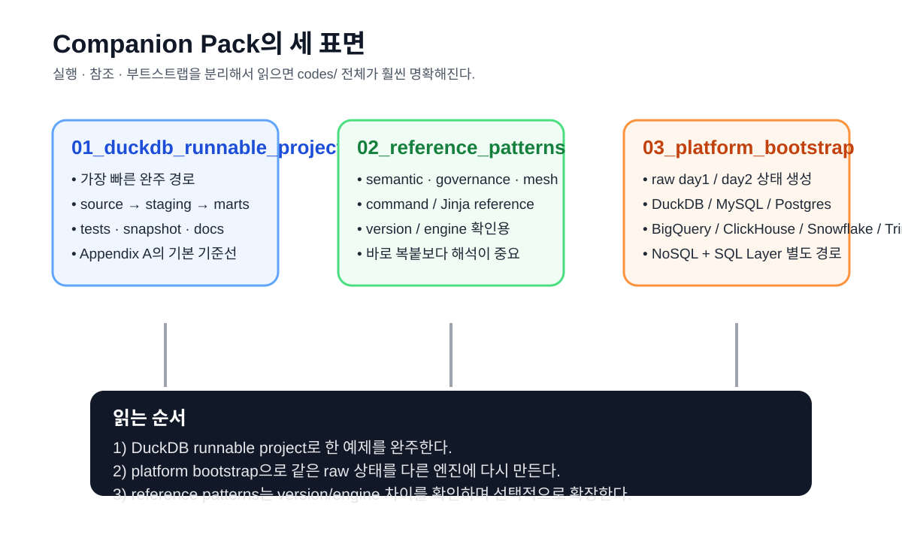

<a id="book-chapters-reference-v3-appendix-a-companion-pack-bootstrap-and-answer-keys-md--a1-이-부록을-왜-먼저-보는가"></a>

### A.1. 이 부록을 왜 먼저 보는가

<a id="book-chapters-reference-v3-appendix-a-companion-pack-bootstrap-and-answer-keys-md--a11-companion-pack은-책의-두-번째-본문이다"></a>

#### A.1.1. companion pack은 책의 두 번째 본문이다

처음부터 `codes/`를 열어 보면 폴더가 많아 보여서 오히려 막막할 수 있다.
그래서 이 부록은 companion pack을 세 개의 표면으로 나눠 읽게 만든다.

1. 실행 표면
   - `codes/01_duckdb_runnable_project/`
   - 가장 빠르게 end-to-end를 완주하는 경로다.
   - CLI, profile, source, staging, marts, tests, snapshot, docs를 실제로 돌리는 감각을 먼저 익힌다.

2. 참조 표면
   - `codes/02_reference_patterns/`
   - governance, semantic, mesh, functions/UDF, command/Jinja reference 같은 확장 예시와 레퍼런스가 모여 있다.
   - 이 폴더는 “바로 복붙해서 운영에 넣는 경로”가 아니라, 현재 쓰는 dbt 버전과 엔진에 맞게 다시 해석하는 참고 묶음으로 보는 편이 맞다.

3. 부트스트랩 표면
   - `codes/03_platform_bootstrap/`
   - 같은 예제 데이터를 각 데이터플랫폼에 다시 넣어 보고 싶을 때 여는 폴더다.
   - `setup_day1.sql`과 `apply_day2.sql`을 중심으로 raw 상태 자체를 다시 만드는 용도다.

핵심은 이 셋을 한꺼번에 보지 않는 것이다.
처음에는 실행 표면만 따라 하고, 그다음 부트스트랩 표면으로 플랫폼을 바꾸고,
필요할 때만 참조 표면으로 올라가는 것이 가장 덜 흔들린다.

<a id="book-chapters-reference-v3-appendix-a-companion-pack-bootstrap-and-answer-keys-md--a12-repo-안에서-어디로-이동해야-하는가"></a>

#### A.1.2. repo 안에서 어디로 이동해야 하는가

```text
repo-root/
├─ chapters/
│  ├─ ch09_casebook-i-retail-orders.md
│  ├─ ch10_casebook-ii-event-stream.md
│  ├─ ch11_casebook-iii-subscription-billing.md
│  ├─ ch12~ch20_platform-playbook-*.md
│  └─ app_a_companion-pack-example-data-bootstrap-answer-keys.md
└─ codes/
   ├─ 01_duckdb_runnable_project/
   ├─ 02_reference_patterns/
   ├─ 03_platform_bootstrap/
   └─ 04_chapter_snippets/
```

이 부록을 읽을 때는 항상 다음 네 군데를 함께 펼쳐 두면 좋다.

1. 현재 읽고 있는 casebook chapter
2. 해당 casebook의 platform playbook
3. `codes/01_duckdb_runnable_project/`
4. 필요한 경우 `codes/03_platform_bootstrap/`

<a id="book-chapters-reference-v3-appendix-a-companion-pack-bootstrap-and-answer-keys-md--a13-처음-따라-할-때-권장-순서"></a>

#### A.1.3. 처음 따라 할 때 권장 순서

1. `chapters/ch09_casebook-i-retail-orders.md`
2. `codes/01_duckdb_runnable_project/README.md`
3. `chapters/ch12_platform-playbook-duckdb.md`
4. 이 부록의 A.3, A.4, A.5
5. 그 다음에 Event Stream, Subscription & Billing 순서로 확장

처음부터 여러 플랫폼을 동시에 올리거나, 세 예제를 한 번에 build하려 들면
오히려 어느 계층에서 막혔는지 구분이 어려워진다.

<a id="book-chapters-reference-v3-appendix-a-companion-pack-bootstrap-and-answer-keys-md--a2-세-예제-데이터는-무엇을-보여-주는가"></a>

### A.2. 세 예제 데이터는 무엇을 보여 주는가

이 책의 세 예제는 단순히 분야를 바꿔 놓은 샘플이 아니다.
서로 다른 데이터 성격을 일부러 대비시킨 것이다.

- Retail Orders: 명확한 비즈니스 키와 fact/dim, fanout, snapshot, contract 입문
- Event Stream: append-only, late-arriving data, microbatch, semantic-ready 집계
- Subscription & Billing: 상태 변화, MRR 정의, snapshot, versions, governed API surface

<a id="book-chapters-reference-v3-appendix-a-companion-pack-bootstrap-and-answer-keys-md--a21-retail-orders"></a>

#### A.2.1. Retail Orders

Retail Orders는 세 예제 중에서 가장 먼저 따라 하기 좋다.
주문 도메인은 비교적 익숙하고, `customers / products / order_items / orders` 같은 raw 테이블도 이해하기 쉽다.

이 예제의 핵심은 다음 두 가지다.

1. grain을 지키는 join
   - `order_items`는 line grain이고 `orders`는 order grain이다.
   - 두 테이블을 join한 뒤 바로 집계하면 fanout이 생길 수 있다.
   - 그래서 `int_order_lines`로 line grain을 고정한 후 `fct_orders`에서 다시 주문 grain으로 모은다.

2. day2에서의 상태 변화
   - `order_id = 5003`이 day1에는 `paid`, day2에는 `cancelled`로 바뀐다.
   - 이 변화는 snapshot, marts 재계산, business rule 문서화의 차이를 한 번에 보여 준다.

<a id="book-chapters-reference-v3-appendix-a-companion-pack-bootstrap-and-answer-keys-md--a22-event-stream"></a>

#### A.2.2. Event Stream

Event Stream은 append-only 도메인이다.
raw에서는 대개 `users`와 `events`가 있고, 질문의 grain이 자주 달라진다.

- 이벤트 자체를 보고 싶을 때는 event grain
- 사용자 행동 흐름을 보고 싶을 때는 session grain
- DAU / WAU를 보고 싶을 때는 daily grain

이 예제의 핵심은 다음 세 가지다.

1. `event_at`와 `event_ingested_at`를 분리해서 본다.
2. day2에 late-arriving event가 들어오므로, 과거 날짜가 다시 바뀔 수 있다.
3. 따라서 incremental 설계는 단순 append보다 lookback window를 함께 생각해야 한다.

<a id="book-chapters-reference-v3-appendix-a-companion-pack-bootstrap-and-answer-keys-md--a23-subscription--billing"></a>

#### A.2.3. Subscription & Billing

Subscription & Billing은 상태 변화와 지표 정의 충돌이 핵심이다.
같은 subscription이라도 시점에 따라 `trialing / active / canceled`로 바뀌고,
finance와 product가 “이 구독이 MRR에 포함되는가”를 다르게 정의할 수 있다.

이 예제의 핵심은 다음과 같다.

1. `subscription_id`를 중심으로 상태 이력을 추적한다.
2. invoice와 current MRR을 혼동하지 않는다.
3. `contracts`와 `versions`를 통해 `fct_mrr`를 공용 surface처럼 다듬는다.

<a id="book-chapters-reference-v3-appendix-a-companion-pack-bootstrap-and-answer-keys-md--a24-세-예제를-끝까지-추적하는-기준-레코드"></a>

#### A.2.4. 세 예제를 끝까지 추적하는 기준 레코드

이 부록에서는 세 예제를 다음 세 기준점으로 추적한다.

1. Retail Orders: `order_id = 5003`
2. Event Stream: `event_id = e1010`과 `2026-04-01`의 DAU
3. Subscription & Billing: `subscription_id = sub_2003`

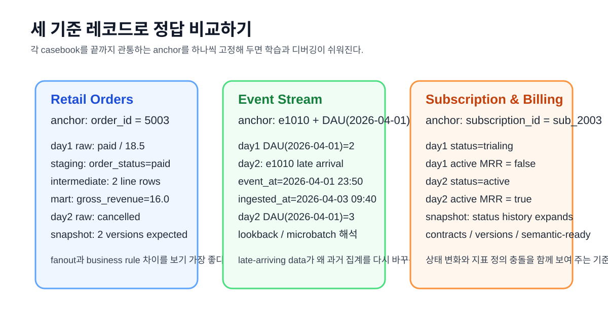

기준 레코드를 정해 두는 이유는 단순하다.
책 전체를 따라가면서도 “지금 내가 같은 데이터를 보고 있는가”를 빠르게 확인할 수 있기 때문이다.

<a id="book-chapters-reference-v3-appendix-a-companion-pack-bootstrap-and-answer-keys-md--a3-dbms별-bootstrap은-어떤-순서로-해야-하는가"></a>

### A.3. DBMS별 bootstrap은 어떤 순서로 해야 하는가

<a id="book-chapters-reference-v3-appendix-a-companion-pack-bootstrap-and-answer-keys-md--a31-모든-플랫폼에-공통인-학습-리듬"></a>

#### A.3.1. 모든 플랫폼에 공통인 학습 리듬

플랫폼이 달라도 학습 리듬은 같다.

1. day1 raw 상태 만들기
2. `dbt debug`
3. `dbt seed`
4. `dbt build`
5. 정답표와 비교
6. day2 raw 상태 다시 주입
7. `dbt snapshot` 또는 incremental 관련 모델 재실행
8. day1 / day2 차이 해석

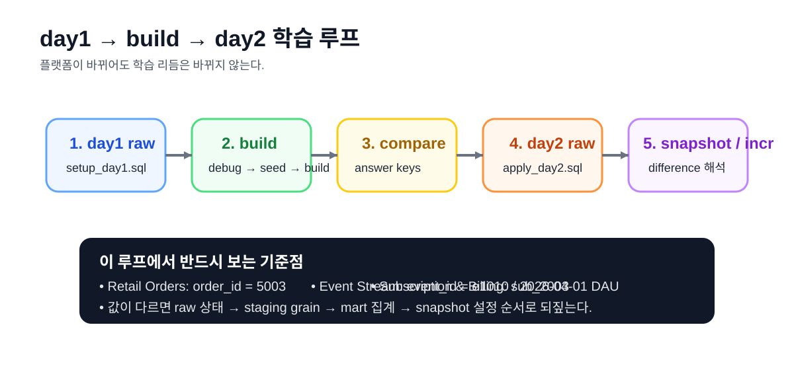

이 루프를 먼저 몸에 넣어 두면, 플랫폼이 바뀌어도 “무엇을 먼저 해야 하는가”가 흔들리지 않는다.

<a id="book-chapters-reference-v3-appendix-a-companion-pack-bootstrap-and-answer-keys-md--a32-sql-계열-플랫폼-quickstart"></a>

#### A.3.2. SQL 계열 플랫폼 quickstart

| 플랫폼 | 가장 빠른 시작점 | 먼저 열 파일 | 핵심 주의점 |
| --- | --- | --- | --- |
| DuckDB | 로컬 file DB | `../codes/01_duckdb_runnable_project/README.md` | 가장 단순하다. companion pack의 기본 기준 플랫폼이다. |
| MySQL | dev DB에 raw schema 생성 | `../codes/03_platform_bootstrap/retail/mysql/setup_day1.sql` | OLTP와 분석 변환을 섞지 않는 감각이 중요하다. |
| PostgreSQL | dev DB와 schema 권한 준비 | `../codes/03_platform_bootstrap/subscription/postgres/setup_day1.sql` | `search_path`, 권한, transaction hook 동작을 먼저 본다. |
| BigQuery | project / dataset / location 준비 | `../codes/03_platform_bootstrap/events/bigquery/setup_day1.sql` | partition / cluster / 비용 통제가 같이 따라온다. |
| ClickHouse | raw MergeTree 테이블 생성 | `../codes/03_platform_bootstrap/events/clickhouse/setup_day1.sql` | `ORDER BY`, `partition_by`, materialized view 주의가 크다. |
| Snowflake | role / warehouse / database / schema 준비 | `../codes/03_platform_bootstrap/subscription/snowflake/setup_day1.sql` | query tag, warehouse 분리, transient / secure surface를 함께 본다. |
| Trino | catalog + schema 준비 | `../codes/03_platform_bootstrap/retail/trino/setup_day1.sql` | catalog/database 개념과 backing storage를 먼저 이해해야 한다. |

<a id="book-chapters-reference-v3-appendix-a-companion-pack-bootstrap-and-answer-keys-md--a33-databricks는-지금-어디서-시작하면-되는가"></a>

#### A.3.3. Databricks는 지금 어디서 시작하면 되는가

현재 repo에서는 Databricks를 위한 전용 raw bootstrap 폴더를 아직 크게 두지 않았다.
대신 Databricks는 다음 경로를 기준으로 시작하는 것이 자연스럽다.

- `chapters/ch20_platform-playbook-databricks.md`
- `../codes/04_chapter_snippets/ch20/`

즉, Databricks는 지금 단계에서 `03_platform_bootstrap/`의 정적 SQL 경로보다
Chapter 20 snippets를 템플릿 삼아 Unity Catalog / dev-prod catalog / Delta refresh 전략을 같이 보는 편이 낫다.

<a id="book-chapters-reference-v3-appendix-a-companion-pack-bootstrap-and-answer-keys-md--a34-nosql--sql-layer는-별도-패턴으로-읽는다"></a>

#### A.3.4. NoSQL + SQL Layer는 별도 패턴으로 읽는다

NoSQL + SQL Layer는 SQL 계열 플랫폼과 같은 방식으로 읽지 않는다.
핵심은 raw 문서/검색 인덱스를 직접 dbt에 붙이는 것이 아니라,
SQL layer를 사이에 두고 dbt는 그 SQL 계층에 연결한다는 점이다.

대표 경로:

- `../codes/03_platform_bootstrap/nosql_sql_layer_mongodb_via_trino/`
- `chapters/ch19_platform-playbook-nosql-sql-layer.md`

실습 리듬도 다소 다르다.

1. JSONL 또는 bulk payload로 raw 문서를 적재
2. SQL layer catalog를 연다
3. `sources.yml`에서 SQL layer table로 source를 선언
4. staging에서 flatten / normalize / cast
5. mart로 넘긴다

<a id="book-chapters-reference-v3-appendix-a-companion-pack-bootstrap-and-answer-keys-md--a35-trino-운영형-부속물은-어디에-있는가"></a>

#### A.3.5. Trino 운영형 부속물은 어디에 있는가

업무형 Trino / Iceberg / Airflow 패턴은 일반 bootstrap과 별도 감각이 필요하다.
이 repo에서는 다음 위치를 함께 보면 좋다.

- `chapters/ch18_platform-playbook-trino.md`
- `../codes/03_platform_bootstrap/trino/dbt_log_bootstrap.sql`
- `../codes/04_chapter_snippets/ch18/trino/`

여기서 특히 봐야 하는 것은 다음 네 가지다.

1. `profiles.yml`과 `sources.yml`
2. `generate_schema_name` override
3. `dbt_log` bootstrap과 `log_model_start` / `log_run_end`
4. `case01`~`case06` 운영 패턴

> 중요한 주의
> `case01` 같은 “전부 지우고 다시 적재” 패턴은 incremental의 기본형이 아니라
> 레거시 배치를 dbt 안으로 옮길 때의 운영 타협안으로 보는 것이 맞다.
> Appendix A는 그것을 정답 패턴이 아니라 패턴 사례집으로 안내한다.

<a id="book-chapters-reference-v3-appendix-a-companion-pack-bootstrap-and-answer-keys-md--a4-정답표와-비교는-어떻게-하는가"></a>

### A.4. 정답표와 비교는 어떻게 하는가

이 부록의 정답표는 “값 하나를 외우는 표”가 아니다.
오히려 다음 질문에 답할 수 있게 만드는 용도다.

1. 지금 내가 같은 raw 상태를 만들었는가?
2. 내가 만든 staging과 mart가 같은 grain을 유지하고 있는가?
3. day2 변경이 snapshot / incremental / semantic surface에 어떻게 반영돼야 하는가?

<a id="book-chapters-reference-v3-appendix-a-companion-pack-bootstrap-and-answer-keys-md--a41-retail-orders--order_id--5003"></a>

#### A.4.1. Retail Orders · `order_id = 5003`

Retail Orders는 `5003`이 가장 좋은 기준점이다.

- day1: `paid`
- day2: `cancelled`

빠르게 확인해야 할 값은 다음이다.

| 층/시점 | 확인 포인트 | 기대 해석 |
| --- | --- | --- |
| raw day1 | `status=paid`, `total_amount=18.5` | 원천 상태 |
| stg day1 | `order_status=paid` | rename + cast + 표준화 |
| int day1 | line 2행 | line grain 유지 |
| mart day1 | `gross_revenue=16.0` | 주문 grain 1행 재집계 |
| raw day2 | `status=cancelled` | late change 반영 |
| snapshot | paid + cancelled 2버전 | 이력 구조 |

<a id="book-chapters-reference-v3-appendix-a-companion-pack-bootstrap-and-answer-keys-md--a42-event-stream--event_id--e1010와-2026-04-01-dau"></a>

#### A.4.2. Event Stream · `event_id = e1010`와 `2026-04-01` DAU

Event Stream은 한 행의 값보다 날짜별 집계가 왜 바뀌는가를 보는 편이 더 중요하다.
그래서 기준점은 `e1010`과 `2026-04-01` DAU다.

- day1에는 `2026-04-01` DAU가 2다.
- day2에는 `e1010`이 늦게 들어오면서 `2026-04-01` DAU가 3이 된다.

즉, 이 예제는 “과거 날짜가 뒤늦게 바뀔 수 있다”는 것을 보여 준다.

<a id="book-chapters-reference-v3-appendix-a-companion-pack-bootstrap-and-answer-keys-md--a43-subscription--billing--sub_2003"></a>

#### A.4.3. Subscription & Billing · `sub_2003`

Subscription & Billing은 `sub_2003`이 가장 좋은 기준점이다.

- day1: `trialing`
- day2: `active`

여기서 중요한 것은 단순 상태 변화만이 아니다.

- `committed MRR`에 포함되는가?
- `active MRR`에 포함되는가?
- snapshot에서 상태 이력은 어떻게 남는가?
- contract/semantic surface에선 어떤 컬럼이 공개 API가 되는가?

<a id="book-chapters-reference-v3-appendix-a-companion-pack-bootstrap-and-answer-keys-md--a44-빠른-정답-비교용-파일"></a>

#### A.4.4. 빠른 정답 비교용 파일

정답 비교를 위해 가장 먼저 열어야 하는 파일은 다음 셋이다.

- [`../codes/04_chapter_snippets/app_a/expected_anchor_keys.csv`](codes/04_chapter_snippets/app_a/expected_anchor_keys.csv)
- [`../codes/04_chapter_snippets/app_a/reference_check_queries.sql`](codes/04_chapter_snippets/app_a/reference_check_queries.sql)
- `reference_outputs/` 또는 `workbook/` 아래 각 예제별 expected CSV

추가로 Chapter 09~11에서 만든 예제별 expected 파일도 함께 본다.

- `../codes/04_chapter_snippets/ch09/`
- `../codes/04_chapter_snippets/ch10/`
- `../codes/04_chapter_snippets/ch11/`

<a id="book-chapters-reference-v3-appendix-a-companion-pack-bootstrap-and-answer-keys-md--a5-처음-따라-하는-사람을-위한-runbook"></a>

### A.5. 처음 따라 하는 사람을 위한 runbook

<a id="book-chapters-reference-v3-appendix-a-companion-pack-bootstrap-and-answer-keys-md--a51-30분-quickstart"></a>

#### A.5.1. 30분 quickstart

처음에는 한 예제만 잡는 편이 좋다.
가장 안전한 경로는 DuckDB + Retail Orders다.

```bash
# 0) 가상환경
python -m venv .venv
source .venv/bin/activate

# 1) 설치
python -m pip install --upgrade pip wheel setuptools
python -m pip install dbt-core dbt-duckdb

# 2) profile 확인
dbt debug

# 3) seed / build
dbt seed
dbt build --select retail+

# 4) 정답 비교
# order_id = 5003 확인
```

더 자세한 명령 모음은
[`../codes/04_chapter_snippets/app_a/quickstart_companion.sh`](codes/04_chapter_snippets/app_a/quickstart_companion.sh)
에 정리해 두었다.

<a id="book-chapters-reference-v3-appendix-a-companion-pack-bootstrap-and-answer-keys-md--a52-플랫폼을-바꿀-때의-기준"></a>

#### A.5.2. 플랫폼을 바꿀 때의 기준

다음과 같이 생각하면 된다.

- 개념과 완주감이 먼저면 DuckDB
- OLTP 친화 환경에서의 제약을 보고 싶으면 MySQL / PostgreSQL
- 비용 / partition / warehouse-native refresh를 보고 싶으면 BigQuery / Snowflake
- 물리 설계가 모델링과 함께 움직이는 모습을 보고 싶으면 ClickHouse
- catalog + schema + backing storage + orchestration 감각을 보고 싶으면 Trino
- 문서형 원천을 SQL layer 뒤로 넣는 패턴을 보고 싶으면 NoSQL + SQL Layer
- Unity Catalog / Delta / Python / streaming table surface를 보고 싶으면 Databricks

<a id="book-chapters-reference-v3-appendix-a-companion-pack-bootstrap-and-answer-keys-md--a53-값이-안-맞을-때-먼저-볼-것"></a>

#### A.5.3. 값이 안 맞을 때 먼저 볼 것

| 증상 | 가장 먼저 볼 곳 | 흔한 원인 | 빠른 복구 |
| --- | --- | --- | --- |
| `Profile not found` | `~/.dbt/profiles.yml` | profile 이름 불일치 | project의 `profile:` 값과 맞춘다 |
| `source not found` | `models/sources.yml`, `dbt parse` | source/table 이름 오타 | YAML 이름과 `source()` 인자를 동일하게 맞춘다 |
| 매출이 두 배 | `int_order_lines`와 `fct_orders` row count | grain 누락 / fanout | intermediate에서 line grain을 먼저 고정한다 |
| snapshot 행이 늘지 않음 | snapshot config + day2 raw 상태 | `updated_at` 또는 `check_cols` 미설정 | day2 변경이 실제 raw에 반영됐는지부터 본다 |
| Trino `Connection refused` | Trino 서비스 상태 | coordinator 미기동 / 권한 | Trino launcher / service 상태를 먼저 본다 |
| `dbt_internal_source.id` | compiled SQL, source select | merge `unique_key` 컬럼이 source에 없음 | source 쿼리와 config의 key를 맞춘다 |
| `dbt_internal_dest.id` | target relation DDL | merge `unique_key` 컬럼이 target에 없음 | target relation과 key 정의를 맞춘다 |

`dbt_internal_source.id`, `dbt_internal_dest.id` 같은 Trino merge 오류와
`Connection refused localhost:8080` 오류는 실제 운영 메모에서 자주 나오는 사례이기도 하다.
그래서 이 부록에서는 그것을 “특수한 에러”가 아니라 대표적인 bootstrap / 운영 오류로 분류한다.

<a id="book-chapters-reference-v3-appendix-a-companion-pack-bootstrap-and-answer-keys-md--a6-companion-pack을-쓸-때-자주-하는-실수"></a>

### A.6. companion pack을 쓸 때 자주 하는 실수

<a id="book-chapters-reference-v3-appendix-a-companion-pack-bootstrap-and-answer-keys-md--a61-bootstrap-sql만-보고-모델-계층을-건너뛰는-것"></a>

#### A.6.1. bootstrap SQL만 보고 모델 계층을 건너뛰는 것

`setup_day1.sql`이 돌아갔다고 해서 casebook를 이해한 것은 아니다.
부트스트랩은 raw 상태를 만드는 단계일 뿐이고,
실제 학습의 핵심은 `source → staging → intermediate → marts → tests → snapshot → docs` 흐름이다.

<a id="book-chapters-reference-v3-appendix-a-companion-pack-bootstrap-and-answer-keys-md--a62-day2를-생략하는-것"></a>

#### A.6.2. day2를 생략하는 것

day1만 보면 책의 절반만 본 셈이다.

- snapshot은 왜 필요한가
- incremental은 왜 단순 append가 아닌가
- freshness와 운영 runbook은 왜 필요한가

이 질문들은 대부분 day2를 넣어야만 살아난다.

<a id="book-chapters-reference-v3-appendix-a-companion-pack-bootstrap-and-answer-keys-md--a63-플랫폼-플레이북보다-먼저-플랫폼을-늘리는-것"></a>

#### A.6.3. 플랫폼 플레이북보다 먼저 플랫폼을 늘리는 것

한 번에 DuckDB, Postgres, BigQuery를 다 띄우는 건 멋있어 보이지만,
실제로는 어느 platform surface에서 막혔는지 분간하기 어렵게 만든다.
처음엔 한 플랫폼 + 한 예제로 끝까지 완주하는 편이 훨씬 빠르다.

<a id="book-chapters-reference-v3-appendix-a-companion-pack-bootstrap-and-answer-keys-md--a64-trino-운영-패턴을-일반-패턴처럼-받아들이는-것"></a>

#### A.6.4. Trino 운영 패턴을 일반 패턴처럼 받아들이는 것

Trino/Iceberg/Airflow 패턴은 운영형 예시다.
`dbt_log`, `generate_schema_name`, `run_query` 기반 분기, `case01~06`은 아주 유용하지만,
그 자체가 모든 플랫폼의 기본형은 아니다.

특히 다음은 꼭 구분해야 한다.

- `case01`은 “incremental 대표 패턴”이 아니라 truncate-insert형 운영 타협안
- `run_query`는 compile/docs generate 때도 live connection 아래선 실행될 수 있으므로 side effect 주의
- `generate_schema_name` override는 relation naming 전체를 바꾸는 전역 매크로

편의상 한 번 동작했다고 해서, 모든 플랫폼에서 그대로 옮길 수 있다고 생각하면 안 된다.

<a id="book-chapters-reference-v3-appendix-a-companion-pack-bootstrap-and-answer-keys-md--a7-어디서-무엇을-찾을지-빠르게-보는-인덱스"></a>

### A.7. 어디서 무엇을 찾을지 빠르게 보는 인덱스

| 하고 싶은 일 | 먼저 열 파일 |
| --- | --- |
| DuckDB로 가장 빠르게 한 번 돌려 보기 | `../codes/01_duckdb_runnable_project/README.md` |
| 세 예제의 day1/day2 raw 상태 만들기 | `../codes/03_platform_bootstrap/` |
| Retail Orders 정답 비교 | `../codes/04_chapter_snippets/ch09/` |
| Event Stream 정답 비교 | `../codes/04_chapter_snippets/ch10/` |
| Subscription 정답 비교 | `../codes/04_chapter_snippets/ch11/` |
| Trino 운영형 bootstrap | `../codes/03_platform_bootstrap/trino/dbt_log_bootstrap.sql` |
| Trino logging / cases / hooks | `../codes/04_chapter_snippets/ch18/trino/` |
| 공통 빠른 명령 모음 | `../codes/04_chapter_snippets/app_a/quickstart_companion.sh` |
| 세 기준 레코드 점검 SQL | `../codes/04_chapter_snippets/app_a/reference_check_queries.sql` |
| 기준 정답표 CSV | `../codes/04_chapter_snippets/app_a/expected_anchor_keys.csv` |

<a id="book-chapters-reference-v3-appendix-a-companion-pack-bootstrap-and-answer-keys-md--a8-마지막-조언"></a>

### A.8. 마지막 조언

companion pack은 “파일이 많아서 어려운 묶음”이 아니다.
오히려 어느 순서로 열어야 하는지만 분명하면, 책을 따라가기에 가장 쉬운 실습 경로가 된다.

이 부록의 핵심 규칙만 기억하면 된다.

1. 한 번에 하나의 예제, 하나의 플랫폼부터 시작한다.
2. day1 → build → day2 → snapshot/incremental 비교 루프를 지킨다.
3. 기준 레코드(5003, e1010/DAU, sub_2003)를 끝까지 추적한다.
4. platform playbook은 platform 차이를 이해할 때 열고, appendix는 companion pack을 실제로 따라 할 때 연다.
5. 운영형 Trino 패턴은 공통 기본형이 아니라 사례집으로 읽는다.

이 부록을 잘 쓰면 `codes/` 디렉터리가 “부속 파일 창고”가 아니라
책 전체를 실제로 재현하게 해 주는 두 번째 교재가 된다.

---

<a id="book-chapters-reference-v3-appendix-b-dbt-command-reference-md"></a>

장별 원고: [chapters/reference-v3/appendix-b-dbt-command-reference.md](chapters/reference-v3/appendix-b-dbt-command-reference.md)

<a id="book-chapters-reference-v3-appendix-b-dbt-command-reference-md--appendix-b--dbt-명령어-레퍼런스"></a>

## APPENDIX B · DBT 명령어 레퍼런스

> **참고편 범위:** 이 부록은 기존 Companion Pack의 별도 fixture와 참조 코드다. 마당마켓 연속 실습의 명령과 수치는 [lab/README](#book-lab-readme-md)를 기준으로 한다. 두 데이터 세트를 같은 원천에 섞지 않는다.


> 이 부록은 dbt 명령어를 단순 치트시트가 아니라 실행 순서와 운영 장면 기준으로 다시 묶은 reference chapter다.
> Chapter 02의 첫 실행, Chapter 05의 디버깅, Chapter 06의 CI/CD, Chapter 18의 Trino 운영형 예시까지 다시 연결하는 명령어 중심 부록으로 읽으면 된다.


<a id="book-chapters-reference-v3-appendix-b-dbt-command-reference-md--b1-이-부록을-어떻게-읽을까"></a>

### B.1. 이 부록을 어떻게 읽을까

많은 입문자는 `dbt run`, `dbt test`, `dbt build` 정도만 기억하고 시작한다.
하지만 책 전체를 따라오다 보면 실제로 더 자주 쓰는 것은 `dbt debug`, `dbt parse`, `dbt ls`, `dbt compile`, `dbt show`, `dbt source freshness`, `dbt clone`, `dbt retry`, `dbt run-operation` 같은 명령들이다.

이 부록은 명령어를 세 층으로 나눈다.

1. 관찰과 확인
   - `dbt debug`
   - `dbt parse`
   - `dbt ls`
   - `dbt compile`
   - `dbt show`
   - `dbt docs generate`

2. 관계를 만들고 검증하는 실행
   - `dbt seed`
   - `dbt run`
   - `dbt test`
   - `dbt build`
   - `dbt snapshot`
   - `dbt source freshness`

3. 운영과 복구
   - `dbt deps`
   - `dbt clone`
   - `dbt retry`
   - `dbt run-operation`

핵심은 명령 하나를 외우는 것이 아니라, 어떤 장면에서 어떤 순서로 호출하는가를 익히는 것이다.
예를 들어 YAML을 수정했을 때는 `run`보다 `parse`가 먼저고, Jinja를 손댔을 때는 `compile`이 먼저며, 실패한 배치를 복구할 때는 처음부터 다시 `build`하는 대신 `retry`나 `clone`이 더 적합할 수 있다.

<a id="book-chapters-reference-v3-appendix-b-dbt-command-reference-md--b2-명령어를-기능이-아니라-실행-흐름으로-이해하기"></a>

### B.2. 명령어를 기능이 아니라 실행 흐름으로 이해하기

<a id="book-chapters-reference-v3-appendix-b-dbt-command-reference-md--b21-가장-먼저-잡아야-할-기본-루프"></a>

#### B.2.1. 가장 먼저 잡아야 할 기본 루프


dbt 프로젝트의 기본 루프는 다음과 같이 기억하면 편하다.

```text
설치/연결 확인
  ↓
구조 확인
  ↓
선택 범위 확인
  ↓
컴파일/미리보기
  ↓
실행
  ↓
검증
  ↓
문서/아티팩트 확인
```

이 루프를 명령으로 바꾸면 대개 아래와 같다.

```bash
dbt --version
dbt debug
dbt parse
dbt ls -s ...
dbt compile -s ...
dbt show --select ...
dbt build -s ...
dbt docs generate
```

이 순서는 입문자에게도 중요하지만, 실무 운영에서도 그대로 통한다.
전체 프로젝트를 매번 `dbt build`로 밀어붙이기보다, 문제 범위를 줄이고 관찰한 뒤 실행하는 습관이 장기적으로 훨씬 안정적이다.

<a id="book-chapters-reference-v3-appendix-b-dbt-command-reference-md--b22-read-계열과-write-계열을-구분하자"></a>

#### B.2.2. read 계열과 write 계열을 구분하자

| 구분 | 명령 | 무엇을 하나 | 언제 먼저 쓰는가 |
| --- | --- | --- | --- |
| read 중심 | `debug`, `parse`, `ls`, `compile`, `show`, `docs generate` | 현재 상태를 관찰하거나 산출물을 만든다 | 고치기 전, 범위를 확인할 때 |
| write 중심 | `seed`, `run`, `test`, `build`, `snapshot`, `clone`, `run-operation` | relation, 테스트 결과, snapshot, 운영 대상에 영향을 준다 | dev/prod 대상과 schema를 확인한 뒤 |
| hybrid | `source freshness`, `retry` | freshness 결과 계산, 실패 범위 재실행 | 운영 중 체크·복구 장면 |

특히 `show`는 관계를 새로 materialize하지 않고 선택한 노드의 결과를 미리 보기하는 데 유용하고, `source freshness`는 source SLA를 점검하면서 `sources.json` artifact를 남기는 흐름으로 이해하면 좋다.

<a id="book-chapters-reference-v3-appendix-b-dbt-command-reference-md--b3-설치연결프로젝트-준비-명령"></a>

### B.3. 설치·연결·프로젝트 준비 명령

<a id="book-chapters-reference-v3-appendix-b-dbt-command-reference-md--b31-dbt---version"></a>

#### B.3.1. `dbt --version`

가장 먼저 adapter가 인식되는지 확인한다.

```bash
dbt --version
```

이 명령으로 확인할 것:

- 현재 dbt Core / adapter 버전
- 원하는 가상환경이 활성화되어 있는지
- 여러 Python 환경이 섞이지 않았는지

<a id="book-chapters-reference-v3-appendix-b-dbt-command-reference-md--b32-dbt-init"></a>

#### B.3.2. `dbt init`

새 프로젝트의 가장 작은 시작점이다.

```bash
dbt init retail_dbt_lab
```

이 부록에서는 새 프로젝트 생성 자체보다, 초기화 후 어떤 파일을 먼저 보는가가 더 중요하다.

1. `dbt_project.yml`
2. `profiles.yml`
3. `models/`
4. `packages.yml`

<a id="book-chapters-reference-v3-appendix-b-dbt-command-reference-md--b33-dbt-deps"></a>

#### B.3.3. `dbt deps`

패키지를 설치하거나 갱신한다.

```bash
dbt deps
```

이 명령이 필요한 대표 장면:

- `packages.yml`을 처음 추가했을 때
- package 버전을 올렸을 때
- 새 개발 환경에서 프로젝트를 처음 띄울 때

package를 많이 쓰는 팀일수록 `dbt deps`를 환경 bootstrap 루틴에 포함시키는 편이 안정적이다.

<a id="book-chapters-reference-v3-appendix-b-dbt-command-reference-md--b34-dbt-debug"></a>

#### B.3.4. `dbt debug`

프로젝트/설치/연결의 1차 헬스체크다.

```bash
dbt debug
dbt debug --config-dir
```

`dbt debug`는 “SQL이 틀렸는가?”보다 앞 단계의 질문에 답한다.

- profile 이름이 맞는가
- adapter가 설치되어 있는가
- 연결이 실제로 되는가
- `profiles.yml` 위치가 맞는가

Trino처럼 서비스가 떠 있지 않으면 SQL이 맞아도 이 단계에서 막힌다.
업무 메모에 있던 `localhost:8080 Connection refused` 사례는 모델 오류가 아니라 Trino 프로세스/권한 문제였고, 이런 유형은 반드시 `debug` 관점에서 먼저 분리해서 봐야 한다.

<a id="book-chapters-reference-v3-appendix-b-dbt-command-reference-md--b4-구조와-범위를-확인하는-명령"></a>

### B.4. 구조와 범위를 확인하는 명령

<a id="book-chapters-reference-v3-appendix-b-dbt-command-reference-md--b41-dbt-parse"></a>

#### B.4.1. `dbt parse`

연결 없이 graph와 YAML 구조를 빠르게 확인한다.

```bash
dbt parse
dbt parse --warn-error
```

언제 좋은가:

- `sources.yml`을 고쳤을 때
- `schema.yml` 들여쓰기를 수정했을 때
- tests, exposures, semantic 설정을 바꿨을 때
- CI에서 최소 정적 검사를 하고 싶을 때

<a id="book-chapters-reference-v3-appendix-b-dbt-command-reference-md--b42-dbt-ls"></a>

#### B.4.2. `dbt ls`

실행 전에 무엇이 선택되는지 나열한다.

```bash
dbt ls -s +fct_orders+
dbt ls -s path:models/retail
dbt ls -s state:modified+
dbt ls -s source:raw_retail.orders
```

실무에서 `dbt ls`는 사소해 보이지만 아주 중요하다.
특히 selector가 복잡해질수록 바로 `build`를 날리기보다 `ls`로 노드 범위를 먼저 확인하는 편이 훨씬 안전하다.

<a id="book-chapters-reference-v3-appendix-b-dbt-command-reference-md--b43-dbt-compile"></a>

#### B.4.3. `dbt compile`

Jinja, `ref()`, `source()`, macro가 어떤 SQL로 풀리는지 확인한다.

```bash
dbt compile -s stg_orders
dbt compile -s case03_branch_query
```

좋은 장면:

- `run_query()` 분기나 loop를 손댔을 때
- `incremental merge`가 어떤 SQL로 생성되는지 보고 싶을 때
- `dbt_internal_source` / `dbt_internal_dest` 관련 오류를 재현할 때
- custom materialization이나 macro override를 손댔을 때

<a id="book-chapters-reference-v3-appendix-b-dbt-command-reference-md--b44-dbt-show"></a>

#### B.4.4. `dbt show`

작은 결과를 빠르게 확인한다.

```bash
dbt show --select stg_orders
dbt show --select fct_orders --limit 20
```

`show`는 “이미 만들어진 테이블을 그냥 읽는 도구”라기보다, 선택한 노드를 기준으로 결과를 preview하는 명령으로 이해하는 편이 정확하다.
작게 데이터를 훑어보는 장면에서는 `run`보다 훨씬 가볍고 안전하다.

<a id="book-chapters-reference-v3-appendix-b-dbt-command-reference-md--b5-모델을-만들고-검증하는-명령"></a>

### B.5. 모델을 만들고 검증하는 명령

<a id="book-chapters-reference-v3-appendix-b-dbt-command-reference-md--b51-dbt-seed"></a>

#### B.5.1. `dbt seed`

작은 참조 데이터를 프로젝트 안에서 relation로 올린다.

```bash
dbt seed
dbt seed -s country_codes
```

대표 장면:

- 국가 코드, 상태 코드, 매핑 테이블 적재
- 학습용 초기 참조 데이터 복원
- Day 1 bootstrap의 일부

<a id="book-chapters-reference-v3-appendix-b-dbt-command-reference-md--b52-dbt-run"></a>

#### B.5.2. `dbt run`

선택한 모델을 materialize한다.

```bash
dbt run -s stg_orders
dbt run -s int_order_lines+
dbt run -s tag:daily
```

가장 많이 쓰는 개발 루틴:

```bash
dbt run -s stg_orders
dbt run -s fct_orders
```

하지만 모델을 하나 고쳤을 때도 무조건 `run`만 쓰는 건 아쉽다.
테스트까지 같이 보고 싶다면 보통 `build`가 더 자연스럽다.

<a id="book-chapters-reference-v3-appendix-b-dbt-command-reference-md--b53-dbt-test"></a>

#### B.5.3. `dbt test`

generic, singular, unit test를 실행한다.

```bash
dbt test
dbt test -s test_type:generic
dbt test -s test_type:singular
dbt test -s test_type:unit
```

좋은 습관:

- key / grain / relationships 확인용 generic test
- 도메인 규칙 확인용 singular test
- 계산 로직 확인용 unit test

<a id="book-chapters-reference-v3-appendix-b-dbt-command-reference-md--b54-dbt-build"></a>

#### B.5.4. `dbt build`

가장 자주 쓰는 “실행 + 검증” 명령이다.

```bash
dbt build -s fct_orders+
dbt build -s +events_daily+
dbt build -s state:modified+ --defer --state path/to/prod_artifacts
```

`build`는 model / test / snapshot 등 buildable resource를 한 흐름에서 실행한다.
입문자에게는 `run + test`를 손으로 연결하는 습관을 만들어 주고, 실무자에게는 CI의 기본 명령이 된다.

<a id="book-chapters-reference-v3-appendix-b-dbt-command-reference-md--b55-dbt-snapshot"></a>

#### B.5.5. `dbt snapshot`

상태 이력을 남긴다.

```bash
dbt snapshot
dbt snapshot -s orders_status_snapshot
```

대표 장면:

- 주문 상태 변화
- 구독 상태 변화
- slowly changing dimension 유사 이력 보존

<a id="book-chapters-reference-v3-appendix-b-dbt-command-reference-md--b56-dbt-source-freshness"></a>

#### B.5.6. `dbt source freshness`

raw source의 freshness SLA를 확인한다.

```bash
dbt source freshness
dbt source freshness -s source:raw_retail.orders
```

이 명령은 source freshness 결과를 계산하고 `sources.json`을 남긴다.
source freshness는 `dbt build`의 자동 일부라기보다 별도의 운영 확인 루틴으로 기억하는 편이 좋다.

<a id="book-chapters-reference-v3-appendix-b-dbt-command-reference-md--b6-selector와-옵션을-제대로-이해하기"></a>

### B.6. selector와 옵션을 제대로 이해하기


<a id="book-chapters-reference-v3-appendix-b-dbt-command-reference-md--b61-가장-자주-쓰는-표현"></a>

#### B.6.1. 가장 자주 쓰는 표현

| 표현 | 뜻 | 빠른 기억법 |
| --- | --- | --- |
| `-s model_name` | 그 모델만 | 가장 좁은 범위 |
| `-s model_name+` | 현재 + downstream | 소비처 확인 |
| `-s +model_name` | 현재 + upstream | 원인 추적 |
| `-s +model_name+` | 양방향 | 전체 영향 확인 |
| `-s tag:daily` | 태그 선택 | 배치 주기 |
| `-s path:models/retail` | 경로 선택 | 트랙 단위 |
| `-s source:raw_retail.orders` | source 선택 | raw 중심 |
| `-s state:modified+` | 변경분 + 영향 범위 | slim CI 핵심 |

<a id="book-chapters-reference-v3-appendix-b-dbt-command-reference-md--b62---exclude"></a>

#### B.6.2. `--exclude`

넓게 잡은 뒤 일부를 뺄 때 쓴다.

```bash
dbt build -s marts --exclude tag:slow
```

<a id="book-chapters-reference-v3-appendix-b-dbt-command-reference-md--b63---defer---state"></a>

#### B.6.3. `--defer --state`

운영/CI에서 upstream를 이전 상태로 참조하게 한다.

```bash
dbt build -s state:modified+ --defer --state path/to/prod_artifacts
```

이 패턴은 slim CI의 핵심이다.
내 PR에서 바뀐 부분만 계산하고, 나머지 upstream는 이미 배포된 상태를 참조하게 한다.

<a id="book-chapters-reference-v3-appendix-b-dbt-command-reference-md--b64---vars"></a>

#### B.6.4. `--vars`

실행 시 파라미터를 주입한다.

```bash
dbt run -s case05_use_parameter --vars '{"from_date":"20260101","to_date":"20260102"}'
dbt run -s case01_truncate_insert --vars '{"airflow_run_id":"123456","from_dt":"2026-04-02","end_dt":"2026-04-08"}'
```

업무 메모에 있던 Trino/Airflow 샘플처럼, `--vars`는 날짜 범위나 외부 배치 ID를 dbt 실행에 싣는 데 자주 쓰인다.
다만 너무 많은 제어를 vars에 몰아넣으면 SQL보다 실행 명령이 더 복잡해지므로, 반복되는 제어는 macro나 control table로 옮길지 함께 판단해야 한다.

<a id="book-chapters-reference-v3-appendix-b-dbt-command-reference-md--b7-운영과-복구-명령"></a>

### B.7. 운영과 복구 명령

<a id="book-chapters-reference-v3-appendix-b-dbt-command-reference-md--b71-dbt-clone"></a>

#### B.7.1. `dbt clone`

기준 state의 노드를 빠르게 복제한다.

```bash
dbt clone -s state:modified+ --state path/to/prod_artifacts
```

큰 테이블이 많은 CI에서 유용하다.
특히 프로덕션의 큰 relation을 그대로 참조하거나 복제해, CI 시간을 줄이는 데 도움이 된다.

<a id="book-chapters-reference-v3-appendix-b-dbt-command-reference-md--b72-dbt-retry"></a>

#### B.7.2. `dbt retry`

직전 실행의 실패 범위를 다시 시도한다.

```bash
dbt retry
```

대표 장면:

- 네트워크/warehouse 일시 실패
- 배치 중간에 일부만 실패
- 전체를 처음부터 다시 돌리기 아까운 경우

<a id="book-chapters-reference-v3-appendix-b-dbt-command-reference-md--b73-dbt-run-operation"></a>

#### B.7.3. `dbt run-operation`

관리용 macro를 실행한다.

```bash
dbt run-operation backfill_partition --args '{"from_date":"2026-04-01","to_date":"2026-04-07"}'
dbt run-operation register_upstream_external_models
```

이 명령은 모델을 materialize하는 것이 아니라 운영 매크로를 직접 호출하는 장면에서 쓴다.
정리 작업, bootstrap, catalog 등록, 보조 메타데이터 작업에 자주 쓴다.

<a id="book-chapters-reference-v3-appendix-b-dbt-command-reference-md--b74-dbt-clean"></a>

#### B.7.4. `dbt clean`

로컬 산출물 정리에 쓴다.

```bash
dbt clean
```

`target/`, `dbt_packages/` 같은 산출물을 정리한 뒤 다시 `deps`/`compile`을 해 보는 것도 디버깅에 유용하다.

<a id="book-chapters-reference-v3-appendix-b-dbt-command-reference-md--b8-docs와-semantic-계열-명령"></a>

### B.8. docs와 semantic 계열 명령

<a id="book-chapters-reference-v3-appendix-b-dbt-command-reference-md--b81-dbt-docs-generate"></a>

#### B.8.1. `dbt docs generate`

문서 artifact를 만든다.

```bash
dbt docs generate
```

무엇이 갱신되는가:

- `manifest.json`
- `catalog.json`
- lineage, description, column metadata

<a id="book-chapters-reference-v3-appendix-b-dbt-command-reference-md--b82-dbt-docs-serve"></a>

#### B.8.2. `dbt docs serve`

로컬에서 문서 사이트를 확인한다.

```bash
dbt docs serve
```

책 전체에서는 docs generate를 더 자주 쓰지만, 로컬에서 lineage를 빠르게 확인할 때는 serve도 여전히 유용하다.

<a id="book-chapters-reference-v3-appendix-b-dbt-command-reference-md--b83-semantic-관련-명령"></a>

#### B.8.3. semantic 관련 명령

Semantic Layer를 쓰는 팀이라면 아래 흐름을 별도 운영 루틴으로 둔다.

```bash
dbt parse
dbt sl list metrics
dbt sl validate
dbt sl query --metrics gross_revenue --group-by order__order_date
```

semantic 기능을 아직 도입하지 않은 팀은 이 루틴을 나중으로 미루고, 먼저 `parse → build → docs` 루프를 굳히는 편이 낫다.

<a id="book-chapters-reference-v3-appendix-b-dbt-command-reference-md--b9-장면별-추천-명령-시나리오"></a>

### B.9. 장면별 추천 명령 시나리오

<a id="book-chapters-reference-v3-appendix-b-dbt-command-reference-md--b91-설치-직후-첫-확인"></a>

#### B.9.1. 설치 직후 첫 확인

```bash
dbt --version
dbt debug
dbt parse
```

<a id="book-chapters-reference-v3-appendix-b-dbt-command-reference-md--b92-yaml을-고친-직후"></a>

#### B.9.2. YAML을 고친 직후

```bash
dbt parse
dbt ls -s source:raw_retail.orders
```

<a id="book-chapters-reference-v3-appendix-b-dbt-command-reference-md--b93-jinjamacro를-고친-직후"></a>

#### B.9.3. Jinja/macro를 고친 직후

```bash
dbt compile -s case03_branch_query
dbt show --select case03_branch_query
```

<a id="book-chapters-reference-v3-appendix-b-dbt-command-reference-md--b94-모델-하나를-고친-직후"></a>

#### B.9.4. 모델 하나를 고친 직후

```bash
dbt build -s model_name+
```

<a id="book-chapters-reference-v3-appendix-b-dbt-command-reference-md--b95-source-sla를-확인할-때"></a>

#### B.9.5. source SLA를 확인할 때

```bash
dbt source freshness -s source:raw_events.app_events
```

<a id="book-chapters-reference-v3-appendix-b-dbt-command-reference-md--b96-pr에서-변경분만-확인할-때"></a>

#### B.9.6. PR에서 변경분만 확인할 때

```bash
dbt build -s state:modified+ --defer --state path/to/prod_artifacts
```

<a id="book-chapters-reference-v3-appendix-b-dbt-command-reference-md--b97-실패-후-복구할-때"></a>

#### B.9.7. 실패 후 복구할 때

```bash
dbt retry
```

<a id="book-chapters-reference-v3-appendix-b-dbt-command-reference-md--b10-세-casebook를-명령어로-다시-보기"></a>

### B.10. 세 casebook를 명령어로 다시 보기

<a id="book-chapters-reference-v3-appendix-b-dbt-command-reference-md--b101-retail-orders"></a>

#### B.10.1. Retail Orders

```bash
dbt seed -s country_codes
dbt build -s +fct_orders+
dbt source freshness -s source:raw_retail.orders
dbt snapshot -s orders_status_snapshot
```

Retail Orders는 fanout, grain, fact/dim, snapshot, contract starter를 가장 먼저 훈련하기 좋은 트랙이다.

<a id="book-chapters-reference-v3-appendix-b-dbt-command-reference-md--b102-event-stream"></a>

#### B.10.2. Event Stream

```bash
dbt build -s stg_events+
dbt build -s events_sessions+
dbt source freshness -s source:raw_events.app_events
dbt build -s state:modified+ --defer --state path/to/prod_artifacts
```

Event Stream은 late-arriving data, daily/session grain, microbatch, semantic-ready surface가 중심이다.

<a id="book-chapters-reference-v3-appendix-b-dbt-command-reference-md--b103-subscription--billing"></a>

#### B.10.3. Subscription & Billing

```bash
dbt build -s stg_subscriptions+
dbt snapshot -s subscription_status_snapshot
dbt build -s fct_mrr+
dbt source freshness -s source:raw_billing.invoices
```

Subscription & Billing은 state change, snapshot, versioned public surface, finance/BI 소비면의 차이를 다루기에 좋다.

<a id="book-chapters-reference-v3-appendix-b-dbt-command-reference-md--b11-trino-운영형-예시를-명령어-관점으로-다시-읽기"></a>

### B.11. Trino 운영형 예시를 명령어 관점으로 다시 읽기

업무 메모에서 가져온 사례를 명령어 관점으로 다시 요약하면 이렇다.

<a id="book-chapters-reference-v3-appendix-b-dbt-command-reference-md--b111-trino-서비스가-안-떠-있을-때"></a>

#### B.11.1. Trino 서비스가 안 떠 있을 때

```bash
dbt debug
```

여기서 `localhost:8080` connection refused가 나면, 모델 로직을 보기 전에 Trino 프로세스/권한부터 확인해야 한다.

<a id="book-chapters-reference-v3-appendix-b-dbt-command-reference-md--b112-merge--unique_key-오류를-재현할-때"></a>

#### B.11.2. `merge + unique_key` 오류를 재현할 때

```bash
dbt compile -s case03_branch_query
dbt run -s case03_branch_query
```

이 장면에서 봐야 하는 것:

1. compiled SQL
2. source 쪽 key 존재 여부
3. target 쪽 key 존재 여부
4. `dbt_internal_source` / `dbt_internal_dest` alias가 어떤 merge SQL로 만들어졌는지

<a id="book-chapters-reference-v3-appendix-b-dbt-command-reference-md--b113-airflow-run-id와-날짜-범위를-넘길-때"></a>

#### B.11.3. Airflow run id와 날짜 범위를 넘길 때

```bash
dbt run -s case01_truncate_insert --vars '{"airflow_run_id":"{{ run_id }}","from_dt":"2026-04-02","end_dt":"2026-04-08"}'
```

명령어 레벨에서 중요한 건 vars는 실행 계약의 일부라는 점이다.
같은 모델이라도 배치 context가 다르면 명령행도 함께 버전 관리 대상으로 봐야 한다.

<a id="book-chapters-reference-v3-appendix-b-dbt-command-reference-md--b12-자주-하는-실수"></a>

### B.12. 자주 하는 실수

1. `dbt debug`를 건너뛰고 바로 `run`부터 시작한다.
2. 복잡한 selector를 `dbt ls` 없이 바로 실행한다.
3. `compile`을 생략한 채 macro/Jinja 오류를 SQL 오류로 오해한다.
4. source freshness를 build 일부로 오해한다.
5. `retry`나 `clone` 대신 무조건 전체 build를 다시 실행한다.
6. `--vars`를 너무 많이 쌓아 두고 실행 계약을 문서화하지 않는다.
7. Trino나 Snowflake처럼 환경 문제가 흔한 플랫폼에서 target/schema/warehouse를 확인하지 않는다.

<a id="book-chapters-reference-v3-appendix-b-dbt-command-reference-md--b13-가장-많이-참조하게-될-미니-치트시트"></a>

### B.13. 가장 많이 참조하게 될 미니 치트시트

| 장면 | 먼저 칠 명령 | 다음 명령 |
| --- | --- | --- |
| 연결이 의심될 때 | `dbt debug` | `dbt parse` |
| YAML/source가 의심될 때 | `dbt parse` | `dbt ls -s ...` |
| macro/Jinja가 의심될 때 | `dbt compile -s ...` | `dbt show --select ...` |
| 모델 하나를 검증할 때 | `dbt build -s model+` | `dbt docs generate` |
| source SLA 확인 | `dbt source freshness` | `dbt build -s ...` |
| PR slim CI | `dbt build -s state:modified+ --defer --state ...` | 필요 시 `dbt retry` |
| 운영용 macro 호출 | `dbt run-operation ...` | 로그/산출물 확인 |

<a id="book-chapters-reference-v3-appendix-b-dbt-command-reference-md--b14-코드-인덱스"></a>

### B.14. 코드 인덱스

이 부록과 함께 제공되는 snippet:

- `codes/04_chapter_snippets/app_b/local_dev_loop.sh`
- `codes/04_chapter_snippets/app_b/ci_slim_loop.sh`
- `codes/04_chapter_snippets/app_b/trino_airflow_vars_examples.sh`
- `codes/04_chapter_snippets/app_b/semantic_cli_examples.sh`
- `codes/04_chapter_snippets/app_b/selector_examples.sh`

필요할 때 이 부록은 “한 번에 다 읽는 장”보다 실행 중 옆에 띄워 두는 레퍼런스처럼 쓰는 편이 더 좋다.

---

<a id="book-chapters-reference-v3-appendix-c-jinja-macro-and-extensibility-reference-md"></a>

장별 원고: [chapters/reference-v3/appendix-c-jinja-macro-and-extensibility-reference.md](chapters/reference-v3/appendix-c-jinja-macro-and-extensibility-reference.md)

<a id="book-chapters-reference-v3-appendix-c-jinja-macro-and-extensibility-reference-md--appendix-c--jinja-macro-extensibility-reference"></a>

## APPENDIX C · Jinja, Macro, Extensibility Reference

> **참고편 범위:** 이 부록은 기존 Companion Pack의 별도 fixture와 참조 코드다. 마당마켓 연속 실습의 명령과 수치는 [lab/README](#book-lab-readme-md)를 기준으로 한다. 두 데이터 세트를 같은 원천에 섞지 않는다.


> Jinja는 SQL을 대체하는 언어가 아니다.
> 좋은 dbt 프로젝트에서 SQL은 여전히 중심이고, Jinja와 macro는 반복을 줄이고, 운영 규칙을 코드화하고, 플랫폼 차이를 흡수하는 보조 계층이다.
> 이 appendix는 “얼마나 화려하게 쓸 수 있는가”보다 어디까지 쓰면 읽기 쉽고, 운영 가능하고, 확장 가능한가를 기준으로 Jinja·macro·확장 포인트를 정리한다.

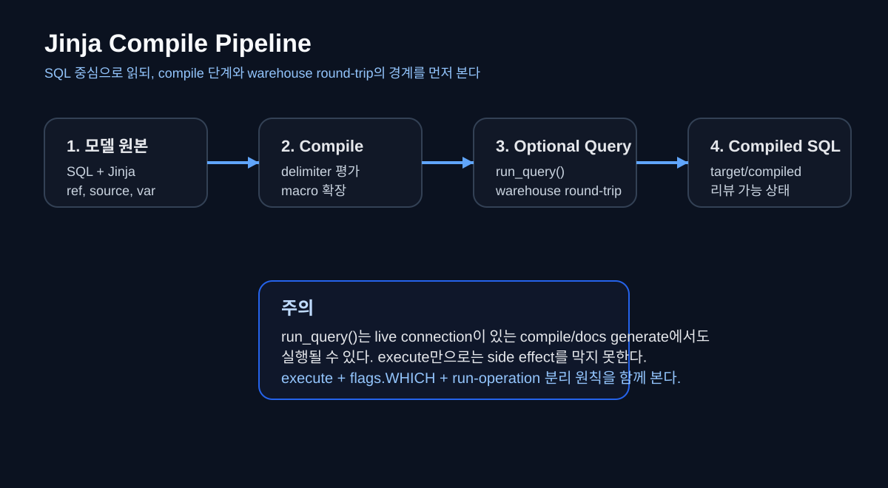

<a id="book-chapters-reference-v3-appendix-c-jinja-macro-and-extensibility-reference-md--c1-왜-jinja와-macro를-따로-정리해야-하는가"></a>

### C.1. 왜 Jinja와 macro를 따로 정리해야 하는가

dbt를 처음 배울 때는 `ref()`, `source()`, `config()` 정도만 익혀도 충분하다.
하지만 프로젝트가 커지면 다음과 같은 이유로 Jinja와 macro를 따로 배워야 한다.

1. 반복 제거
   같은 `CASE WHEN`, 같은 컬럼 목록, 같은 스키마 규칙이 여러 모델에 반복된다.
2. 운영 규칙의 코드화
   `target`, `var`, `env_var`, `flags`, `invocation_id`를 이용해 개발/운영/배치 실행 방식을 통일할 수 있다.
3. 플랫폼 차이 흡수
   adapter.dispatch, cross-database macro, naming override로 플랫폼 차이를 감쌀 수 있다.
4. 확장 개발자 관점
   custom generic test, custom materialization, package author 관점은 결국 macro 이해를 요구한다.

하지만 Jinja를 잘못 쓰면 오히려 프로젝트가 더 나빠진다.

- SQL보다 템플릿이 더 많이 보인다.
- compiled SQL을 열어보지 않으면 모델을 이해할 수 없다.
- `run_query()`가 compile이나 docs generate에서도 live connection을 타면서 예기치 않은 side effect를 낸다.
- 플랫폼별 분기가 모델 본문에 뒤섞여 리뷰가 어려워진다.

이 appendix의 목표는 Jinja를 “많이 쓰는 법”이 아니라 “안전하게 쓰는 법”을 정리하는 데 있다.

---

<a id="book-chapters-reference-v3-appendix-c-jinja-macro-and-extensibility-reference-md--c2-jinja의-기본-정신-compile-단계와-execute-단계를-구분하라"></a>

### C.2. Jinja의 기본 정신: compile 단계와 execute 단계를 구분하라

<a id="book-chapters-reference-v3-appendix-c-jinja-macro-and-extensibility-reference-md--c21-dbt는-sql-파일을-그대로-실행하지-않는다"></a>

#### C.2.1. dbt는 SQL 파일을 그대로 실행하지 않는다

dbt는 모델을 읽을 때 바로 warehouse에 SQL을 던지지 않는다.
먼저 Jinja를 평가하고, macro를 펼치고, selector와 config를 적용해서 compiled SQL을 만든다.
그 뒤에야 materialization 전략에 따라 warehouse에 relation을 만든다.

따라서 Jinja를 쓸 때는 항상 두 질문을 먼저 던져야 한다.

1. 이 코드는 compile 시점에 평가되는가?
2. 이 코드는 warehouse round-trip을 일으키는가?

이 질문이 중요한 이유는 `run_query()` 때문이다.
`run_query()`는 “실행 중”에만 동작하는 것처럼 보이지만, live connection이 있는 compile workflow에서도 실행될 수 있다.
따라서 Jinja에서 side effect가 있는 SQL을 호출하는 순간, 단순 compile이나 docs generate 중에도 예기치 않은 동작이 날 수 있다.

<a id="book-chapters-reference-v3-appendix-c-jinja-macro-and-extensibility-reference-md--c22-세-가지-delimiter"></a>

#### C.2.2. 세 가지 delimiter

| 형태 | 역할 | 대표 예시 |
| --- | --- | --- |
| `{{ ... }}` | 값을 출력 | `{{ ref('fct_orders') }}` |
| `` | 제어 흐름 / 선언 | `` |
| `{# ... #}` | Jinja 주석 | `{# compile 시 제거됨 #}` |

<a id="book-chapters-reference-v3-appendix-c-jinja-macro-and-extensibility-reference-md--c23-자주-쓰는-기본-문법-조각"></a>

#### C.2.3. 자주 쓰는 기본 문법 조각

```jinja


select
    order_id,
    
    sum(case when payment_method = '{{ method }}' then amount end) as {{ method }}_amount,
    
    sum(amount) as total_amount
from {{ ref('stg_payments') }}
group by 1
```

이 예시는 Jinja의 세 가지 핵심 사용처를 한 번에 보여 준다.

- `set`: 미리 리스트나 문자열을 선언한다.
- `for`: 반복 SQL을 생성한다.
- `{{ }}`: ref, 값, 식 결과를 출력한다.

하지만 이런 패턴은 반복 컬럼 생성에만 쓰는 것이 좋다.
모델의 핵심 business logic 전체를 loop와 if에 묻어버리면 읽기 어려워진다.

<a id="book-chapters-reference-v3-appendix-c-jinja-macro-and-extensibility-reference-md--c24-whitespace-control"></a>

#### C.2.4. whitespace control

```jinja

{{ col }}, 

```

``는 공백을 줄여 준다.
다만 공백을 너무 aggressively 줄이면 compiled SQL이 한 줄에 몰려 읽기 어려워진다.
“DRY”보다 “읽기 쉬운 compiled SQL”이 우선이라는 원칙을 지켜야 한다.

<a id="book-chapters-reference-v3-appendix-c-jinja-macro-and-extensibility-reference-md--c25-filter와-작은-도구들"></a>

#### C.2.5. filter와 작은 도구들

| 패턴 | 의미 | 예시 |
| --- | --- | --- |
| `| lower` | 소문자화 | `{{ target.name | lower }}` |
| `| upper` | 대문자화 | `{{ var('country') | upper }}` |
| `| default(...)` | 기본값 지정 | `{{ var('lookback_days') | default(3) }}` |
| `| join(', ')` | 리스트 결합 | `{{ cols | join(', ') }}` |
| `is none` | null 분기 | `` |
| `loop.last` | 마지막 요소 확인 | `, ` |

---

<a id="book-chapters-reference-v3-appendix-c-jinja-macro-and-extensibility-reference-md--c3-dbt에서-자주-쓰는-helper와-context-변수"></a>

### C.3. dbt에서 자주 쓰는 helper와 context 변수

<a id="book-chapters-reference-v3-appendix-c-jinja-macro-and-extensibility-reference-md--c31-가장-많이-보는-helper"></a>

#### C.3.1. 가장 많이 보는 helper

| helper / variable | 언제 쓰는가 | 짧은 설명 |
| --- | --- | --- |
| `ref()` | 프로젝트 내부 모델 참조 | dependency graph와 build 순서를 만든다 |
| `source()` | 프로젝트 외부 raw 입력 참조 | lineage, freshness, source test의 시작점 |
| `var()` | 실행 시 전달된 변수 사용 | Airflow, batch date, feature flag |
| `env_var()` | 비밀값·환경값 분리 | password, token, path |
| `target` | dev/prod 분기 | target name, schema, database |
| `this` | 현재 relation 자기 자신 | incremental, post-hook, delete/merge 대상 |
| `log()` / `print()` | 디버깅 메시지 출력 | compile/execute 맥락 점검 |
| `flags` | 현재 명령 종류 판단 | compile/docs/build/run 분기 |
| `invocation_id` | 현재 dbt 실행의 UUID | logging, audit key |
| `results` | `on-run-end` 결과 목록 | run-end hook에서 상태 업데이트 |
| `adapter` | adapter wrapper | cross-database 동작, relation 확인 |
| `dispatch` | multi-dispatch | 플랫폼별 macro override |
| `exceptions` | 경고/에러 제어 | `raise_compiler_error`, `warn` |

<a id="book-chapters-reference-v3-appendix-c-jinja-macro-and-extensibility-reference-md--c32-어떤-helper를-언제-써야-하는가"></a>

#### C.3.2. 어떤 helper를 언제 써야 하는가

<a id="book-chapters-reference-v3-appendix-c-jinja-macro-and-extensibility-reference-md--ref와-source"></a>

##### `ref()`와 `source()`
이 둘은 단순 문자열 치환이 아니다.
`ref()`는 내부 dependency를, `source()`는 외부 contract와 lineage를 만든다.
직접 스키마/테이블명을 조합하는 문자열 Jinja는 가능하면 피해야 한다.

<a id="book-chapters-reference-v3-appendix-c-jinja-macro-and-extensibility-reference-md--var와-env_var"></a>

##### `var()`와 `env_var()`
- `var()`는 실행 파라미터다.
- `env_var()`는 환경/비밀 설정이다.

날짜 범위, 강제 full refresh 같은 값은 `var()`로,
비밀번호, 토큰, endpoint는 `env_var()`로 분리하는 것이 좋다.

<a id="book-chapters-reference-v3-appendix-c-jinja-macro-and-extensibility-reference-md--target"></a>

##### `target`
`target.name == 'prod'` 분기는 가볍게는 유용하지만, 너무 많아지면 모델이 환경 분기 덩어리가 된다.
환경 차이는 모델 본문보다 `dbt_project.yml`, profile, macro layer로 흡수하는 편이 낫다.

---

<a id="book-chapters-reference-v3-appendix-c-jinja-macro-and-extensibility-reference-md--c4-run_query와-warehouse-round-trip을-안전하게-다루는-법"></a>

### C.4. `run_query()`와 warehouse round-trip을 안전하게 다루는 법

<a id="book-chapters-reference-v3-appendix-c-jinja-macro-and-extensibility-reference-md--c41-run_query는-언제-필요한가"></a>

#### C.4.1. `run_query()`는 언제 필요한가

`run_query()`는 다음처럼 warehouse 결과를 받아 다음 SQL을 생성해야 할 때만 꺼내는 것이 좋다.

1. 동적 pivot 컬럼 목록 만들기
2. 정보 스키마를 읽어 union 순서 맞추기
3. 분기용 제어 테이블 읽기
4. `on-run-end`에서 결과 상태를 audit table에 반영하기

반대로, 단순 모델 로직은 `run_query()` 없이도 대부분 해결된다.
`source()`, `ref()`, `is_incremental()`, 일반 SQL만으로 되는 문제에 `run_query()`를 쓰면 compile cost와 이해 비용만 늘어난다.

<a id="book-chapters-reference-v3-appendix-c-jinja-macro-and-extensibility-reference-md--c42-안전한-기본-패턴"></a>

#### C.4.2. 안전한 기본 패턴

```jinja

    select distinct country_code
    from {{ source('raw_retail', 'orders') }}
    where country_code is not null
    order by 1



    
    

    

```

여기서 핵심은 두 가지다.

1. `execute`만으로는 충분하지 않다.
   compile/docs generate에서도 live connection이 있으면 `execute`는 `True`일 수 있다.
2. 그래서 side effect가 있을 수 있는 흐름은 `flags.WHICH`까지 같이 보아야 한다.

<a id="book-chapters-reference-v3-appendix-c-jinja-macro-and-extensibility-reference-md--c43-agate-result-읽기"></a>

#### C.4.3. agate result 읽기

`run_query()` 결과는 agate table로 들어온다.
가장 자주 쓰는 패턴은 다음이다.

```jinja

    
    

    

```

주의할 점:

- `results.columns[0].values()`처럼 컬럼별 values를 뽑을 수 있다.
- row가 없을 수 있으니 default 값을 준비해 둔다.
- compile 단계 fallback이 꼭 필요하다.

<a id="book-chapters-reference-v3-appendix-c-jinja-macro-and-extensibility-reference-md--c44-side-effect가-있는-sql은-더-조심하라"></a>

#### C.4.4. side effect가 있는 SQL은 더 조심하라

`run_query()` 안에 `insert`, `update`, `delete`, `alter`, `grant` 같은 side effect SQL을 넣으면 compile/docs generate에서도 실행될 수 있다.
이런 성격의 SQL은 가능하면:

1. hook로 옮기거나
2. `dbt run-operation`으로 분리하거나
3. `flags.WHICH` + execute + 명시적 var 조건을 함께 두는 것이 좋다.

---

<a id="book-chapters-reference-v3-appendix-c-jinja-macro-and-extensibility-reference-md--c5-macro는-어떻게-설계해야-하는가"></a>

### C.5. macro는 어떻게 설계해야 하는가

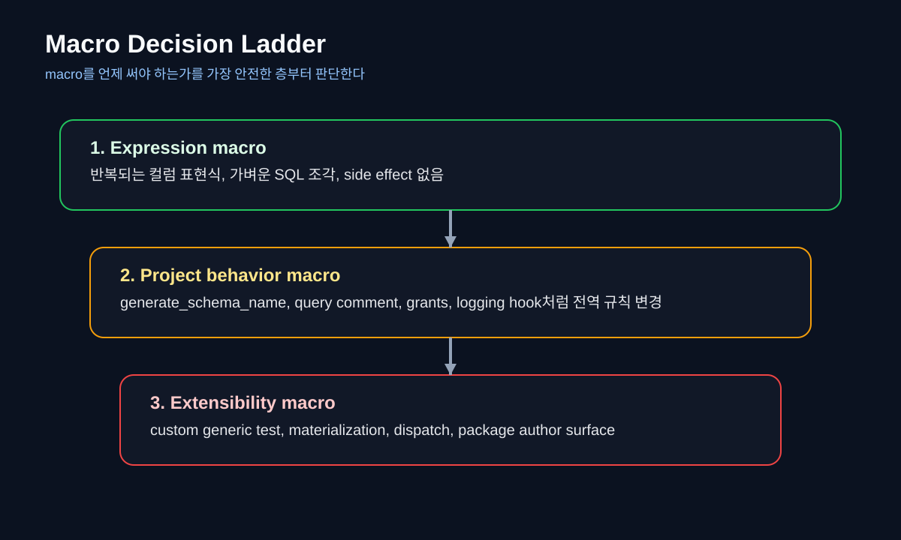

macro는 세 가지 층으로 생각하면 좋다.

1. expression macro
   컬럼 표현식, 반복되는 SQL 조각
2. project behavior macro
   naming, grants, comments, hooks 등 프로젝트 동작 자체를 바꾸는 것
3. extensibility macro
   custom generic tests, custom materializations, package dispatch

<a id="book-chapters-reference-v3-appendix-c-jinja-macro-and-extensibility-reference-md--c51-가장-안전한-시작점-expression-macro"></a>

#### C.5.1. 가장 안전한 시작점: expression macro

```jinja

    round({{ column_name }} / 100.0, {{ scale }})

```

```sql
select
    order_id,
    {{ cents_to_currency('gross_revenue_cents') }} as gross_revenue
from {{ ref('fct_orders_raw') }}
```

좋은 expression macro의 기준:

- input과 output이 단순하다
- compiled SQL이 읽기 쉽다
- 플랫폼-specific SQL이 숨어 있지 않다
- side effect가 없다

<a id="book-chapters-reference-v3-appendix-c-jinja-macro-and-extensibility-reference-md--c52-프로젝트-전역-동작을-바꾸는-macro-generate_schema_name"></a>

#### C.5.2. 프로젝트 전역 동작을 바꾸는 macro: `generate_schema_name`

업무 메모에서 온 `generate_schema_name` override는 Appendix C에 넣기 좋은 대표 사례다.
이건 모델 안에서 직접 호출하는 macro가 아니라, dbt가 relation 이름을 정할 때 내부적으로 사용하는 hook point다.

```jinja

    
        {{ target.schema }}
    
        {{ custom_schema_name | trim }}
    

```

이 패턴의 장점:

- `target.schema + '_' + custom_schema_name` 규칙 대신 custom schema를 그대로 쓸 수 있다
- `sample_db_sample_db` 같은 중복 스키마 이름을 피할 수 있다

이 패턴의 위험:

- 프로젝트 전체 relation naming 규칙을 바꾼다
- dev/prod 분리 전략과 충돌할 수 있다
- 팀 공통 규칙 없이 넣으면 혼란을 만든다

따라서 이 macro는 “편의 기능”이 아니라 프로젝트 전역 정책으로 다뤄야 한다.

<a id="book-chapters-reference-v3-appendix-c-jinja-macro-and-extensibility-reference-md--c53-운영형-macro-logging-hook용-macro"></a>

#### C.5.3. 운영형 macro: logging hook용 macro

업무 메모의 `log_model_start` / `log_run_end`는 아주 좋은 실무 예시지만, 교재에서는 일반화해서 보여 주는 편이 낫다.
catalog/schema/timezone/table명을 하드코딩하지 않고 var와 target을 활용하는 식으로 바꾸면 플랫폼 이동성이 좋아진다.

```jinja

    
    
    

    
        merge into {{ audit_relation }} as target
        using (
            select
                '{{ run_key }}' as run_key,
                '{{ this.name }}' as model_name
        ) as source
        on target.invocation_id = source.run_key
       and target.model_name = source.model_name
        when matched then update set
            status = 'RUNNING',
            start_dt = current_timestamp,
            end_dt = null,
            error_message = null,
            run_info = '{{ run_info }}'
        when not matched then insert (
            invocation_id, model_name, status, start_dt, run_info
        ) values (
            '{{ run_key }}', '{{ this.name }}', 'RUNNING', current_timestamp, '{{ run_info }}'
        )
    

    
        
    

```

운영형 macro의 핵심 원칙:

- 직접 호출 경로와 hook 호출 경로를 분리한다
- 하드코딩된 database/schema를 줄인다
- compile/docs generate에서 side effect가 나지 않도록 guard를 둔다
- `on-run-end`는 `results` context를 이해하고 써야 한다

<a id="book-chapters-reference-v3-appendix-c-jinja-macro-and-extensibility-reference-md--c54-언제-macro로-빼야-하는가"></a>

#### C.5.4. 언제 macro로 빼야 하는가

다음 질문 중 두 개 이상에 “예”가 나오면 macro 후보로 본다.

1. 같은 SQL 조각이 세 번 이상 반복되는가?
2. 바뀔 때 항상 함께 바뀌어야 하는가?
3. 플랫폼마다 문법 차이를 감싸야 하는가?
4. 팀 규칙을 코드화해야 하는가?

반대로 다음이면 macro로 빼지 않는 편이 좋다.

- 한 번만 쓰는 복잡한 business logic
- 모델 본문보다 macro 쪽이 더 길어지는 로직
- SQL이 보이지 않게 되는 giant macro wrapper

---

<a id="book-chapters-reference-v3-appendix-c-jinja-macro-and-extensibility-reference-md--c6-custom-generic-tests-가장-좋은-첫-확장-포인트"></a>

### C.6. custom generic tests: 가장 좋은 첫 확장 포인트

<a id="book-chapters-reference-v3-appendix-c-jinja-macro-and-extensibility-reference-md--c61-왜-generic-test가-좋은-출발점인가"></a>

#### C.6.1. 왜 generic test가 좋은 출발점인가

custom materialization이나 adapter dispatch는 확실히 고급 기능이다.
반면 custom generic test는 팀 규칙을 재사용 가능한 품질 규칙으로 바꾸는 가장 쉬운 확장 포인트다.

예를 들면 이런 규칙을 생각해 볼 수 있다.

- 필수 컬럼은 비어 있으면 안 된다
- 국가 코드는 특정 목록에 포함돼야 한다
- 주문 상태가 `placed/shipped/delivered/cancelled` 중 하나여야 한다
- 문서형 원천의 required field set이 항상 존재해야 한다

<a id="book-chapters-reference-v3-appendix-c-jinja-macro-and-extensibility-reference-md--c62-기본-구조"></a>

#### C.6.2. 기본 구조

```jinja

    with base as (
        select {{ column_name }} as field_name
        from {{ model }}
    )
    select *
    from base
    where field_name not in (
        
        '{{ value }}', 
        
    )

```

이 테스트는 `tests/generic/` 또는 `macros/` 아래에 둘 수 있다.

<a id="book-chapters-reference-v3-appendix-c-jinja-macro-and-extensibility-reference-md--c63-yaml에서-호출하기"></a>

#### C.6.3. YAML에서 호출하기

```yaml
version: 2

models:
  - name: stg_subscription_docs
    columns:
      - name: field_name
        data_tests:
          - required_fields:
              arguments:
                required_values: ['subscription_id', 'account_id', 'status']
```

여기서 중요한 점은 test input을 `arguments:` 아래에 두는 현재 스타일을 따르는 것이다.
이렇게 해 두면 최신 deprecation guidance와도 더 잘 맞는다.

<a id="book-chapters-reference-v3-appendix-c-jinja-macro-and-extensibility-reference-md--c64-세-casebook에서-어떻게-쓰는가"></a>

#### C.6.4. 세 casebook에서 어떻게 쓰는가

- Retail Orders: 주문 상태, 국가 코드, 필수 raw 컬럼 체크
- Event Stream: 필수 event field set, event_time null 방지
- Subscription & Billing: subscription/account/plan/status contract 확인

---

<a id="book-chapters-reference-v3-appendix-c-jinja-macro-and-extensibility-reference-md--c7-custom-materialization과-adapterdispatch는-어디서부터-시작해야-하는가"></a>

### C.7. custom materialization과 adapter.dispatch는 어디서부터 시작해야 하는가

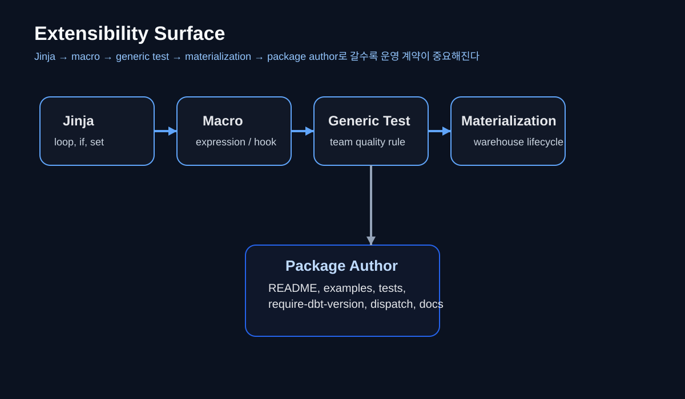

<a id="book-chapters-reference-v3-appendix-c-jinja-macro-and-extensibility-reference-md--c71-custom-materialization은-마지막-수단에-가깝다"></a>

#### C.7.1. custom materialization은 “마지막 수단”에 가깝다

dbt는 built-in materialization으로도 꽤 많은 일을 할 수 있다.

- view
- table
- incremental
- ephemeral
- materialized view

대부분의 프로젝트는 여기서 충분하다.
custom materialization은 표준 materialization으로는 표현할 수 없는 warehouse-specific lifecycle이 있을 때만 고려하는 편이 좋다.

예:
- 특별한 staging-to-swap 전략
- 데이터베이스 특화 object type
- 조직 특화 publish / archive workflow

<a id="book-chapters-reference-v3-appendix-c-jinja-macro-and-extensibility-reference-md--c72-최소-skeleton"></a>

#### C.7.2. 최소 skeleton

```jinja

    
    

    
        create or replace table {{ target_relation }} as (
            {{ compiled_sql }}
        )
    

    {{ return({'relations': [target_relation]}) }}

```

이 예시는 단순화된 skeleton이다.
중요한 점은 materialization도 결국 macro이며, relation 반환 규약과 statement block을 이해해야 한다는 것이다.

<a id="book-chapters-reference-v3-appendix-c-jinja-macro-and-extensibility-reference-md--c73-adapterdispatch는-package-author-관점에서-중요하다"></a>

#### C.7.3. `adapter.dispatch`는 package author 관점에서 중요하다

여러 플랫폼을 동시에 지원하는 package를 만들 때는 플랫폼-specific SQL을 본문에 if-else로 늘어놓는 대신 `dispatch`를 이용하는 편이 좋다.

예:
- `my_pkg__datediff`
- `snowflake__datediff`
- `bigquery__datediff`
- `default__datediff`

이렇게 하면 package 사용자는 같은 macro 이름을 호출하고, adapter별 구현이 자동으로 선택된다.

---

<a id="book-chapters-reference-v3-appendix-c-jinja-macro-and-extensibility-reference-md--c8-package-author-관점에서-보면"></a>

### C.8. package author 관점에서 보면

<a id="book-chapters-reference-v3-appendix-c-jinja-macro-and-extensibility-reference-md--c81-package는-공개-api다"></a>

#### C.8.1. package는 “공개 API”다

내 프로젝트 안에서만 쓰던 macro와 package로 배포하는 macro는 기준이 다르다.
package가 되는 순간 사용자에게는 공용 API surface가 된다.

<a id="book-chapters-reference-v3-appendix-c-jinja-macro-and-extensibility-reference-md--c82-package-author-최소-체크리스트"></a>

#### C.8.2. package author 최소 체크리스트

1. `require-dbt-version`을 명시한다
2. 지원 adapter를 README에 적는다
3. examples와 integration tests를 함께 둔다
4. seeds 기반 mock data와 expected output을 둔다
5. docs site나 예시 프로젝트를 제공한다
6. override / dispatch 구조를 명확히 문서화한다

<a id="book-chapters-reference-v3-appendix-c-jinja-macro-and-extensibility-reference-md--c83-추천-구조"></a>

#### C.8.3. 추천 구조

```text
dbt-my-package/
├─ macros/
├─ models/
├─ tests/
├─ integration_tests/
├─ seeds/
├─ dbt_project.yml
├─ packages.yml
└─ README.md
```

<a id="book-chapters-reference-v3-appendix-c-jinja-macro-and-extensibility-reference-md--c84-readme에-꼭-있어야-할-것"></a>

#### C.8.4. README에 꼭 있어야 할 것

- 무엇을 해결하는 package인지
- 지원 dbt version / adapter
- 설치 방법
- 기본 사용 예시
- configuration surface
- breaking change / deprecation 정책

---

<a id="book-chapters-reference-v3-appendix-c-jinja-macro-and-extensibility-reference-md--c9-세-casebook에-jinja와-macro를-어떻게-적용할-것인가"></a>

### C.9. 세 casebook에 Jinja와 macro를 어떻게 적용할 것인가

<a id="book-chapters-reference-v3-appendix-c-jinja-macro-and-extensibility-reference-md--c91-retail-orders"></a>

#### C.9.1. Retail Orders

이 트랙에서는 Jinja를 가장 보수적으로 쓴다.

- `ref()`, `source()`, `config()`
- 간단한 expression macro
- 상태값 accepted set
- contract / docs block

목표는 SQL 구조를 또렷하게 유지하면서 반복을 조금 줄이는 것이다.

<a id="book-chapters-reference-v3-appendix-c-jinja-macro-and-extensibility-reference-md--c92-event-stream"></a>

#### C.9.2. Event Stream

이 트랙에서는 운영형 Jinja가 늘어난다.

- lookback window를 `var()`로 제어
- dynamic pivot / dynamic field map
- freshness 기준을 var로 조정
- microbatch date range injection

목표는 시간축 데이터의 운영 압력을 Jinja로 흡수하는 것이다.

<a id="book-chapters-reference-v3-appendix-c-jinja-macro-and-extensibility-reference-md--c93-subscription--billing"></a>

#### C.9.3. Subscription & Billing

이 트랙에서는 governance와 published API surface가 더 중요해진다.

- contract + version
- query comment
- semantic-ready naming
- logging hooks
- publish table / secure surface 분리

목표는 재현 가능한 finance-friendly surface를 유지하는 것이다.

---

<a id="book-chapters-reference-v3-appendix-c-jinja-macro-and-extensibility-reference-md--c10-jinja와-macro에서-자주-생기는-실수"></a>

### C.10. Jinja와 macro에서 자주 생기는 실수

<a id="book-chapters-reference-v3-appendix-c-jinja-macro-and-extensibility-reference-md--c101-giant-macro-anti-pattern"></a>

#### C.10.1. giant macro anti-pattern

모델 전체를 macro 호출 하나로 감싸서 원래 SQL이 보이지 않게 만드는 패턴은 피한다.

```jinja
{{ giant_company_magic_macro('orders', 'payments', 'customers') }}
```

이런 코드는 처음에는 편해 보여도,
- compiled SQL을 열어봐야 이해할 수 있고
- review가 어려우며
- business logic와 framework logic가 뒤섞인다.

<a id="book-chapters-reference-v3-appendix-c-jinja-macro-and-extensibility-reference-md--c102-run_query-남용"></a>

#### C.10.2. `run_query()` 남용

제어 테이블 한 번 읽는 건 괜찮다.
하지만 모든 모델이 compile 시 warehouse round-trip을 일으키기 시작하면:

- docs generate가 느려지고
- compile이 예상보다 무거워지고
- 운영 사고가 날 가능성이 커진다

<a id="book-chapters-reference-v3-appendix-c-jinja-macro-and-extensibility-reference-md--c103-문자열로-relation-만들기"></a>

#### C.10.3. 문자열로 relation 만들기

```jinja
select * from {{ target.schema }}.stg_orders
```

이런 패턴은 가능하면 피한다.
`ref()`와 `source()`를 놔두고 relation 문자열을 직접 조합하면 lineage와 rename safety를 잃는다.

<a id="book-chapters-reference-v3-appendix-c-jinja-macro-and-extensibility-reference-md--c104-환경-분기-과잉"></a>

#### C.10.4. 환경 분기 과잉

```jinja

...

...

...
```

환경 분기가 모델 곳곳에 퍼지면, 나중에는 “이 모델의 business logic”이 아니라 “이 모델의 배포 조건문”만 보이게 된다.

---

<a id="book-chapters-reference-v3-appendix-c-jinja-macro-and-extensibility-reference-md--c11-실무-리뷰-체크리스트"></a>

### C.11. 실무 리뷰 체크리스트

Jinja나 macro가 들어간 모델을 리뷰할 때는 다음을 묻는 것이 좋다.

1. SQL이 여전히 읽히는가?
2. compiled SQL을 열었을 때 구조가 납득되는가?
3. `run_query()`가 꼭 필요한가?
4. compile/docs generate 중 side effect가 날 수 있는가?
5. 플랫폼 분기가 macro layer로 모여 있는가?
6. 이 로직은 generic test나 materialization보다 단순한 수단으로 해결 가능한가?
7. package 수준 public API라면 README / tests / examples가 충분한가?

---

<a id="book-chapters-reference-v3-appendix-c-jinja-macro-and-extensibility-reference-md--c12-직접-해보기"></a>

### C.12. 직접 해보기

<a id="book-chapters-reference-v3-appendix-c-jinja-macro-and-extensibility-reference-md--c121-retail-orders"></a>

#### C.12.1. Retail Orders
- `cents_to_currency` macro를 만들어 `gross_revenue_cents`를 변환해 본다.
- `required_fields` generic test로 `order_status` 필수값 검증을 추가한다.

<a id="book-chapters-reference-v3-appendix-c-jinja-macro-and-extensibility-reference-md--c122-event-stream"></a>

#### C.12.2. Event Stream
- `var('lookback_days', 3)`를 받아 incremental filter를 바꾸는 모델을 만든다.
- `run_query()`로 결제수단 목록을 읽어 동적 pivot을 구성해 본다.

<a id="book-chapters-reference-v3-appendix-c-jinja-macro-and-extensibility-reference-md--c123-subscription--billing"></a>

#### C.12.3. Subscription & Billing
- `generate_schema_name` override를 sandbox 환경에서만 시험해 본다.
- logging hook를 var 기반으로 일반화해 실행 로그를 남겨 본다.

---

<a id="book-chapters-reference-v3-appendix-c-jinja-macro-and-extensibility-reference-md--c13-마무리"></a>

### C.13. 마무리

Jinja와 macro는 dbt 프로젝트를 프로그래밍 가능한 SQL 환경으로 만들어 준다.
하지만 그 힘은 SQL을 감추는 데 쓰일 때가 아니라, 반복을 줄이고 운영 규칙을 명확하게 남기는 데 쓰일 때 가장 가치가 크다.

이 appendix를 읽을 때 기억해야 할 한 문장은 이것이다.

> SQL이 주인공이고, Jinja와 macro는 조연이다. 조연이 주인공을 가리면 프로젝트는 오히려 이해하기 어려워진다.

---

<a id="book-chapters-reference-v3-appendix-c-jinja-macro-and-extensibility-reference-md--c14-함께-보면-좋은-공식-문서"></a>

### C.14. 함께 보면 좋은 공식 문서

- Jinja and macros
  <https://docs.getdbt.com/docs/build/jinja-macros>
- Jinja functions and context variables
  <https://docs.getdbt.com/reference/dbt-jinja-functions-context-variables>
- run_query
  <https://docs.getdbt.com/reference/dbt-jinja-functions/run_query>
- Hooks and operations
  <https://docs.getdbt.com/docs/build/hooks-operations>
- Writing custom generic data tests
  <https://docs.getdbt.com/best-practices/writing-custom-generic-tests>
- Materializations
  <https://docs.getdbt.com/docs/build/materializations>
- Building packages
  <https://docs.getdbt.com/guides/building-packages>

---

<a id="book-chapters-reference-v3-appendix-d-troubleshooting-decision-guides-glossary-and-support-matrix-md"></a>

장별 원고: [chapters/reference-v3/appendix-d-troubleshooting-decision-guides-glossary-and-support-matrix.md](chapters/reference-v3/appendix-d-troubleshooting-decision-guides-glossary-and-support-matrix.md)

<a id="book-chapters-reference-v3-appendix-d-troubleshooting-decision-guides-glossary-and-support-matrix-md--appendix-d--troubleshooting-decision-guides-glossary-official-sources-support-matrix"></a>

## APPENDIX D · Troubleshooting, Decision Guides, Glossary, Official Sources, Support Matrix

> **참고편 범위:** 이 부록은 기존 Companion Pack의 별도 fixture와 참조 코드다. 마당마켓 연속 실습의 명령과 수치는 [lab/README](#book-lab-readme-md)를 기준으로 한다. 두 데이터 세트를 같은 원천에 섞지 않는다.


실무에서 자주 꺼내 보는 정보는 두 가지다.
첫째는 지금 어디가 고장 났는지 빠르게 좁히는 정보다.
둘째는 지금 하려는 선택이 구조적으로 맞는지 판별하는 기준이다.

이 부록은 그 두 가지를 한 곳에 모은다.
앞선 본문이 개념과 사례를 설명했다면, 이 부록은 그 개념과 사례를 다시 꺼내 쓸 때 필요한 백맵(back map) 역할을 한다.

핵심 원칙은 단순하다.

1. 전체 실행을 반복하기 전에 문제 범위를 줄인다.
2. SQL만 다시 쓰기 전에 compiled SQL, artifacts, selector 결과를 먼저 본다.
3. 지금 고민이 “오류 해결”인지 “설계 선택”인지 먼저 구분한다.
4. platform/plan/engine 차이가 개입되는 기능은 가용성부터 확인한다.

---

<a id="book-chapters-reference-v3-appendix-d-troubleshooting-decision-guides-glossary-and-support-matrix-md--d1-이-부록을-어떻게-쓰면-좋은가"></a>

### D.1. 이 부록을 어떻게 쓰면 좋은가

이 부록은 처음부터 끝까지 읽는 장이 아니다.
문제가 생겼을 때는 D.2 Troubleshooting, 설계 판단이 필요할 때는 D.3 Decision Guides, 용어가 헷갈릴 때는 D.4 Glossary, 최신성 확인이 필요할 때는 D.5 Official Sources, 기능 가용성이 궁금할 때는 D.6 Support Matrix로 바로 가면 된다.

세 casebook를 다시 연결할 때는 아래를 기준으로 생각하면 된다.

- Retail Orders: grain / fanout / status 기반 KPI 규칙
- Event Stream: freshness / incremental / late-arriving / microbatch
- Subscription & Billing: 상태 이력 / snapshot / 공용 API surface / versioning

아래 그림은 이 부록의 성격을 요약한다.


---

<a id="book-chapters-reference-v3-appendix-d-troubleshooting-decision-guides-glossary-and-support-matrix-md--d2-troubleshooting--실패를-좁히는-진단-사다리"></a>

### D.2. Troubleshooting · 실패를 좁히는 진단 사다리

<a id="book-chapters-reference-v3-appendix-d-troubleshooting-decision-guides-glossary-and-support-matrix-md--d21-가장-먼저-구분할-것-연결-문제인가-구조-문제인가-데이터-문제인가"></a>

#### D.2.1. 가장 먼저 구분할 것: 연결 문제인가, 구조 문제인가, 데이터 문제인가

dbt에서 실패는 얼핏 비슷해 보여도 성격이 다르다.
성격을 구분하지 못하면 가장 느린 방법인 “전체 재실행”을 반복하게 된다.

문제를 크게 다섯 층으로 나누면 빠르게 좁힐 수 있다.

1. 로컬/연결 층
   - 가상환경
   - adapter 설치
   - profile
   - database connection
   - 네트워크, 권한, 서비스 기동 상태

2. 프로젝트 구조 층
   - `dbt_project.yml`
   - `profiles.yml`
   - YAML 파싱
   - `source()` / `ref()` 이름 불일치
   - selector 오해

3. 컴파일 층
   - Jinja 분기
   - macro override
   - compiled SQL
   - `is_incremental()`
   - `run_query()` side effect

4. 데이터 계약 층
   - `unique_key`
   - `grain`
   - source freshness
   - relationships
   - contract / constraints
   - snapshot strategy

5. 운영/가용성 층
   - Core vs Fusion
   - dbt platform plan 제한
   - Semantic Layer availability
   - project dependency / Mesh availability
   - docs / Catalog / Studio 차이

문제를 볼 때는 “어느 층인가?”를 먼저 묻는다.

---

<a id="book-chapters-reference-v3-appendix-d-troubleshooting-decision-guides-glossary-and-support-matrix-md--d22-기본-진단-루프"></a>

#### D.2.2. 기본 진단 루프

<a id="book-chapters-reference-v3-appendix-d-troubleshooting-decision-guides-glossary-and-support-matrix-md--1단계-연결과-설치를-분리한다"></a>

##### 1단계. 연결과 설치를 분리한다

```bash
dbt --version
dbt debug
```

여기서 막히면 아직 모델 SQL로 넘어가면 안 된다.

<a id="book-chapters-reference-v3-appendix-d-troubleshooting-decision-guides-glossary-and-support-matrix-md--2단계-구조를-본다"></a>

##### 2단계. 구조를 본다

```bash
dbt parse
dbt ls -s my_model+
```

이 단계는 YAML, selector, DAG 범위를 검증한다.

<a id="book-chapters-reference-v3-appendix-d-troubleshooting-decision-guides-glossary-and-support-matrix-md--3단계-sql을-본다"></a>

##### 3단계. SQL을 본다

```bash
dbt compile -s my_model
dbt show --select my_model
```

Jinja, `source()`, `ref()`, macro 결과를 확인한다.

<a id="book-chapters-reference-v3-appendix-d-troubleshooting-decision-guides-glossary-and-support-matrix-md--4단계-최소-범위만-실행한다"></a>

##### 4단계. 최소 범위만 실행한다

```bash
dbt build -s my_model+
```

필요한 upstream/downstream만 포함한다.

<a id="book-chapters-reference-v3-appendix-d-troubleshooting-decision-guides-glossary-and-support-matrix-md--5단계-artifacts로-원인을-남긴다"></a>

##### 5단계. artifacts로 원인을 남긴다

확인 순서:

1. `target/compiled/`
2. `target/run/`
3. `target/run_results.json`
4. `target/manifest.json`
5. `target/sources.json`
6. `logs/dbt.log`

---

<a id="book-chapters-reference-v3-appendix-d-troubleshooting-decision-guides-glossary-and-support-matrix-md--d23-trino-연결-오류-카드--localhost8080-connection-refused"></a>

#### D.2.3. Trino 연결 오류 카드 · `localhost:8080 connection refused`

이 오류는 SQL이 틀린 것이 아니라 Trino coordinator에 연결하지 못한 경우에 가깝다.
업로드된 실제 장애 기록에서는 `./launcher run`으로 띄운 Trino가 죽어 있었고, `launcher.pid` 권한 문제 때문에 `sudo ./launcher run`으로 재기동해야 했다.

대표 증상:

```text
HTTPConnectionPool(host='localhost', port=8080): Max retries exceeded
Failed to establish a new connection: [Errno 111] Connection refused
```

먼저 볼 것:

1. Trino coordinator가 떠 있는가
2. `host`, `port`, `method`, `database`, `schema`가 profile과 일치하는가
3. `dbt debug`가 통과하는가
4. `curl http://localhost:8080/v1/info` 같은 health check가 되는가
5. PID/권한 문제는 없는가

Trino preflight 예시는 companion snippet에 포함되어 있다.

```bash
bash codes/04_chapter_snippets/app_d/trino_connection_preflight.sh
```

---

<a id="book-chapters-reference-v3-appendix-d-troubleshooting-decision-guides-glossary-and-support-matrix-md--d24-trino-incremental-merge-오류-카드--dbt_internal_sourceid-cannot-be-resolved"></a>

#### D.2.4. Trino incremental merge 오류 카드 · `dbt_internal_source.id cannot be resolved`

이 오류는 대개 `incremental_strategy='merge'`와 `unique_key='id'`를 설정해 두고, source 쪽 SELECT 결과에 `id` 컬럼이 없을 때 발생한다.

대표 증상:

```text
Column 'dbt_internal_source.id' cannot be resolved
```

이럴 때 묻는 질문:

1. 최종 SELECT에 `id`가 진짜 존재하는가
2. alias 때문에 이름이 바뀌진 않았는가
3. 분기 SQL(`if/elif/else`)의 모든 경로에서 `id`를 반환하는가
4. `run_query()` 결과에 따라 빈 경로나 다른 컬럼명이 나오지 않는가

빠른 확인:

```bash
dbt compile -s case03_branch_query
```

그리고 `target/compiled/.../case03_branch_query.sql`에서 최종 SELECT 컬럼을 직접 본다.

---

<a id="book-chapters-reference-v3-appendix-d-troubleshooting-decision-guides-glossary-and-support-matrix-md--d25-trino-incremental-merge-오류-카드--dbt_internal_destid-cannot-be-resolved"></a>

#### D.2.5. Trino incremental merge 오류 카드 · `dbt_internal_dest.id cannot be resolved`

이번엔 반대다.
source SELECT에는 `id`가 있지만 타겟 테이블에 `id` 컬럼이 없을 때 난다.

대표 증상:

```text
Column 'dbt_internal_dest.id' cannot be resolved
```

확인 순서:

1. 기존 테이블 스키마를 직접 조회한다.
2. target relation이 예전 구조로 남아 있지는 않은가
3. full refresh가 필요한 구조 변경이었는가
4. merge가 아니라 append/table로 가야 하는 모델은 아닌가

빠른 확인 예시:

```sql
DESCRIBE iceberg.sample_db.case03_branch_query;
```

또는 companion snippet의 precheck SQL을 사용한다.

```sql
-- codes/04_chapter_snippets/app_d/trino_merge_unique_key_precheck.sql
```

---

<a id="book-chapters-reference-v3-appendix-d-troubleshooting-decision-guides-glossary-and-support-matrix-md--d26-run_query가-compiledocs-generate에서도-실행되는-문제"></a>

#### D.2.6. `run_query()`가 compile/docs generate에서도 실행되는 문제

`run_query()`는 Jinja helper지만, live connection이 있으면 `dbt compile`이나 `dbt docs generate` 중에도 실제로 SQL을 날릴 수 있다.
그래서 다음 원칙을 지켜야 한다.

1. `if execute`로 감싼다.
2. side effect가 있는 DML/DDL은 model body보다 `run-operation`이나 hook로 뺀다.
3. compile 시점 기본값을 명시한다.
4. 결과가 0행일 때 fallback을 둔다.

안전한 패턴:

```jinja

    select country_code
    from {{ source('ops', 'country') }}



    
    

    

```

---

<a id="book-chapters-reference-v3-appendix-d-troubleshooting-decision-guides-glossary-and-support-matrix-md--d27-source-freshness가-안-맞을-때"></a>

#### D.2.7. source freshness가 안 맞을 때

대표 증상:

- source freshness가 stale
- 배치는 성공했는데 대시보드 수치가 어제 값
- `dbt build --select source_status:fresher+`가 기대만큼 안 좁혀짐

먼저 볼 것:

1. source YAML의 `loaded_at_field`
2. freshness 기준 (`warn_after`, `error_after`)
3. source raw table의 실제 적재 시각
4. `target/sources.json`
5. upstream batch의 실패/지연 여부

이 문제는 Event Stream casebook에서 가장 자주 드러난다.

---

<a id="book-chapters-reference-v3-appendix-d-troubleshooting-decision-guides-glossary-and-support-matrix-md--d28-docs-catalog-studio-vs-code-extension-혼동"></a>

#### D.2.8. docs, Catalog, Studio, VS Code extension 혼동

현재 운영 표면은 비슷해 보여도 서로 다르다.

- Core CLI: `dbt docs generate`, `dbt docs serve`
- Fusion: VS Code extension, Fusion CLI, supported-features matrix
- dbt platform: Studio, Catalog, environments, jobs

자주 생기는 오해:

1. Core 프로젝트에 VS Code extension을 붙이려고 한다.
2. Fusion에서 Core와 똑같이 local docs를 기대한다.
3. Catalog와 `dbt docs`를 같은 것으로 본다.

이건 “오류”라기보다 실행 표면을 잘못 선택한 문제다.

---

<a id="book-chapters-reference-v3-appendix-d-troubleshooting-decision-guides-glossary-and-support-matrix-md--d29-문제-해결-체크리스트-20"></a>

#### D.2.9. 문제 해결 체크리스트 20

아래는 실무에서 가장 자주 쓰는 체크리스트다.

1. 가상환경이 활성화되어 있는가
2. `dbt --version`에 adapter가 함께 보이는가
3. `dbt debug`가 통과하는가
4. profile 이름과 `profiles.yml` 최상위 키가 같은가
5. `dbt parse`로 YAML 구조를 먼저 검증했는가
6. `dbt ls -s ...`로 selector 결과를 보았는가
7. 실패 범위를 `-s model_name`까지 줄였는가
8. `dbt compile -s ...`로 compiled SQL을 보았는가
9. `target/compiled`와 `target/run`을 구분해서 보고 있는가
10. `logs/dbt.log`를 열어 보았는가
11. `run_results.json`으로 실패 지점을 확인했는가
12. `sources.json`으로 freshness 상태를 확인했는가
13. `source()` / `ref()` 이름이 실제 정의와 같은가
14. relation 이름을 직접 하드코딩하지 않았는가
15. `unique_key`가 source와 target 양쪽에 존재하는가
16. `grain`을 문장으로 설명할 수 있는가
17. 문제를 데이터 품질과 로직 오류로 분리했는가
18. hook / `run_query()`가 compile 시점에도 실행될 수 있음을 고려했는가
19. platform/plan/engine 제약이 없는지 확인했는가
20. full refresh가 필요한 구조 변경인지 판단했는가

---

<a id="book-chapters-reference-v3-appendix-d-troubleshooting-decision-guides-glossary-and-support-matrix-md--d3-decision-guides--설계-선택을-위한-질문-순서"></a>

### D.3. Decision Guides · 설계 선택을 위한 질문 순서


<a id="book-chapters-reference-v3-appendix-d-troubleshooting-decision-guides-glossary-and-support-matrix-md--d31-materialization-선택표"></a>

#### D.3.1. materialization 선택표

| 상황 | 추천 | 이유 | 지금 보류해야 할 경우 |
| --- | --- | --- | --- |
| 모델이 아직 자주 바뀌고 빠르게 확인해야 한다 | `view` | 수정-재실행 루프가 빠르다 | 조회 비용/지연이 이미 문제라면 `table` 검토 |
| downstream 조회가 많고 결과를 안정적으로 재사용해야 한다 | `table` | 읽기 속도와 예측 가능성이 높다 | 전체 재생성 비용이 너무 크면 incremental 고민 |
| append 중심 대용량이고 `unique_key`와 재처리 기준이 명확하다 | `incremental` | 전체 재생성 비용을 줄인다 | late-arriving / lookback 규칙이 비어 있으면 아직 금지 |
| 아주 작은 helper 로직을 인라인해도 충분하다 | `ephemeral` | relation을 만들지 않고 SQL만 재사용 | 재사용/디버깅 포인트가 필요하면 view/table |

한 문장 규칙:
정확한 모델 구조와 테스트가 먼저고, incremental은 그다음 최적화다.

---

<a id="book-chapters-reference-v3-appendix-d-troubleshooting-decision-guides-glossary-and-support-matrix-md--d32-snapshot을-언제-쓰는가"></a>

#### D.3.2. snapshot을 언제 쓰는가

| 질문 | snapshot | 다른 대안 |
| --- | --- | --- |
| 현재 상태만 있는 테이블에서 과거 상태 이력이 필요하다 | 예 | snapshot |
| 원천이 이미 CDC / history table을 제공한다 | 아니오 | 그 이력 source를 그대로 모델링 |
| 작은 코드 매핑이나 상태 사전이다 | 아니오 | seed |
| 상태 변화 시점을 나중에 분석해야 한다 | 예 | check / timestamp strategy 검토 |

Subscription & Billing casebook에서는 status history가 필요할 때 snapshot이 자연스럽다.

---

<a id="book-chapters-reference-v3-appendix-d-troubleshooting-decision-guides-glossary-and-support-matrix-md--d33-intermediate를-언제-만드는가"></a>

#### D.3.3. intermediate를 언제 만드는가

| 징후 | intermediate로 올릴까? | 설명 |
| --- | --- | --- |
| 같은 join이 mart 두세 곳에 반복된다 | 예 | 재사용 가능한 join/logic을 한 번으로 모은다 |
| line grain 계산이 있고 여러 최종 모델이 소비한다 | 예 | mart마다 fanout 설명을 줄인다 |
| 한 mart 안에서만 한 번 쓰이고 다시 설명할 필요가 없다 | 아니오 | 파일 수만 늘 수 있다 |
| staging이 giant SQL처럼 길어지고 rename·join·집계가 섞인다 | 예 | 책임 경계를 다시 나눌 신호다 |

Retail Orders의 `int_order_lines`, Event Stream의 `int_sessions`, Subscription의 `int_subscription_status_daily`가 대표 예다.

---

<a id="book-chapters-reference-v3-appendix-d-troubleshooting-decision-guides-glossary-and-support-matrix-md--d34-macro를-언제-묶는가"></a>

#### D.3.4. macro를 언제 묶는가

| 질문 | macro로 묶기 | 그냥 SQL로 둔다 |
| --- | --- | --- |
| 같은 SQL 조각이 세 번 이상 반복되고 함께 바뀌어야 하는가 | 예 | 반복 제거와 변경 일관성 |
| 모델 로직보다 템플릿 문법이 더 많이 보이는가 | 아니오 | 가독성이 먼저 |
| 팀원이 compiled SQL 없이 읽기 어려운가 | 아니오 | 추상화가 과한 신호 |
| 환경 변수 주입이나 가벼운 포맷 변환 정도인가 | 예 | macro가 잘 맞는다 |

---

<a id="book-chapters-reference-v3-appendix-d-troubleshooting-decision-guides-glossary-and-support-matrix-md--d35-run_query를-쓸까-operation으로-뺄까"></a>

#### D.3.5. `run_query()`를 쓸까, operation으로 뺄까

| 상황 | 추천 | 이유 |
| --- | --- | --- |
| 조회 결과로 분기할 뿐이고 side effect가 없다 | `run_query()` + `if execute` | model/Jinja 안에서 안전하게 제어 가능 |
| DDL/DML을 직접 실행해야 한다 | `dbt run-operation` / hook | compile/docs generate 중 side effect 방지 |
| 반복 실행·로깅·배치 파라미터가 중요하다 | hook + `var()` + operation | 운영형 실행 흐름과 잘 맞는다 |

업로드된 Trino 예시의 logging macro와 `case02~06`은 이 기준으로 읽으면 된다.

---

<a id="book-chapters-reference-v3-appendix-d-troubleshooting-decision-guides-glossary-and-support-matrix-md--d36-package-dependency-vs-project-dependency"></a>

#### D.3.6. package dependency vs project dependency

| 질문 | package dependency | project dependency |
| --- | --- | --- |
| 다른 프로젝트의 전체 소스코드를 함께 설치해도 되는가 | 예 | package로 충분 |
| cross-project ref와 메타데이터 서비스가 필요한가 | 아니오 | project dependency 검토 |
| dbt platform Enterprise / Enterprise+가 있는가 | 없어도 됨 | 있어야 의미 있음 |
| “코드 재사용”이 중심인가 “공개 모델 API”가 중심인가 | 코드 재사용 | 공개 모델 API |

---

<a id="book-chapters-reference-v3-appendix-d-troubleshooting-decision-guides-glossary-and-support-matrix-md--d37-core--fusion--dbt-platform-중-어디를-쓸까"></a>

#### D.3.7. Core / Fusion / dbt platform 중 어디를 쓸까

| 지금 목적 | 추천 표면 | 이유 |
| --- | --- | --- |
| 로컬에서 CLI와 파일 중심으로 배우고 싶다 | Core CLI | 가장 직관적이고 교재와 잘 맞다 |
| Fusion 기반 개발 경험과 extension을 쓰고 싶다 | Fusion + VS Code extension | extension은 Fusion 전용 |
| jobs / Catalog / Studio / account-level 운영이 필요하다 | dbt platform | 운영 표면과 메타데이터 경험이 다르다 |

---

<a id="book-chapters-reference-v3-appendix-d-troubleshooting-decision-guides-glossary-and-support-matrix-md--d38-state--defer--clone을-언제-쓰나"></a>

#### D.3.8. state / defer / clone을 언제 쓰나

| 상황 | 먼저 볼 것 | 이유 |
| --- | --- | --- |
| PR CI에서 수정 범위만 빠르게 검증하고 싶다 | `state:modified+` | 변경된 노드와 downstream만 좁힐 수 있다 |
| 개발 환경에 없는 upstream relation 때문에 CI가 실패한다 | `--defer` | applied state relation을 참조 |
| 반복 개발에서 relation 준비 비용이 크다 | `dbt clone` | zero-copy clone 계열 플랫폼에서 유리 |
| 실패 지점부터 다시 이어가고 싶다 | `dbt retry` | 직전 `run_results.json` 기준 재시도 |

---

<a id="book-chapters-reference-v3-appendix-d-troubleshooting-decision-guides-glossary-and-support-matrix-md--d4-glossary--용어집"></a>

### D.4. Glossary · 용어집

<a id="book-chapters-reference-v3-appendix-d-troubleshooting-decision-guides-glossary-and-support-matrix-md--d41-핵심-용어"></a>

#### D.4.1. 핵심 용어

| 용어 | 설명 |
| --- | --- |
| adapter | dbt가 데이터플랫폼과 통신하기 위해 쓰는 플러그인 |
| artifact | dbt 실행 후 남는 JSON 산출물. `manifest.json`, `run_results.json`, `sources.json` 등이 있다 |
| contract | 모델이 반환해야 하는 컬럼 형태와 타입에 대한 약속 |
| defer | 현재 환경에 없는 upstream 리소스를 기준 환경의 relation로 참조하는 기능 |
| exposure | 대시보드·앱 등 downstream 사용처를 DAG에 연결하는 정의 |
| freshness | 원천 또는 모델이 얼마나 최근 상태인지 측정하는 기준 |
| grain | 모델 한 행이 무엇을 대표하는지에 대한 약속 |
| hook | 실행 전후에 추가 SQL/동작을 붙이는 config |
| invocation_id | dbt run 한 번을 식별하는 실행 단위 ID |
| materialization | 모델 결과를 어떤 형태로 남길지 정하는 설정 |
| metric | 질문 가능한 지표 정의 |
| node | 모델·테스트·seed·snapshot 등 DAG를 구성하는 리소스 하나 |
| relation | warehouse에 실제로 존재하는 table / view 같은 객체 |
| saved query | semantic surface 위에서 미리 정의한 질의 |
| selector | 실행할 노드를 고르는 문법 (`--select`, tags, state 등) |
| singular test | 자유 SQL로 작성하는 테스트 |
| source | 프로젝트 외부 입력으로 선언된 원천 테이블 |
| state | 이전 실행/기준 환경의 metadata 상태 |
| unique_key | incremental / snapshot에서 레코드를 식별하는 키 |
| unit test | 작은 입력/기대 출력으로 로직을 검증하는 테스트 |

---

<a id="book-chapters-reference-v3-appendix-d-troubleshooting-decision-guides-glossary-and-support-matrix-md--d5-official-sources--공식-자료를-어떤-순서로-볼까"></a>

### D.5. Official Sources · 공식 자료를 어떤 순서로 볼까

<a id="book-chapters-reference-v3-appendix-d-troubleshooting-decision-guides-glossary-and-support-matrix-md--d51-추천-조회-순서"></a>

#### D.5.1. 추천 조회 순서

1. 현재 표면이 Core인지 Fusion인지 platform인지 먼저 확인
2. 설치/가용성/plan 제약 문서를 먼저 확인
3. 그다음 개별 기능 문서로 들어간다.
4. 마지막에 changelog / release track / support matrix를 본다.

<a id="book-chapters-reference-v3-appendix-d-troubleshooting-decision-guides-glossary-and-support-matrix-md--d52-주제별-공식-문서-지도"></a>

#### D.5.2. 주제별 공식 문서 지도

| 주제 | 문서 키워드 | 왜 먼저 봐야 하나 |
| --- | --- | --- |
| 설치와 실행 표면 | `Install dbt`, `Install dbt extension`, `Fusion quickstart` | Core / Fusion / extension 혼동 방지 |
| source와 freshness | `Add sources to your DAG`, `Source freshness` | lineage와 freshness는 source 계약의 출발점 |
| tests | `Add data tests to your DAG`, `Unit tests` | generic / singular / unit 역할 분리 |
| snapshots | `Add snapshots to your DAG`, `Snapshot configurations` | YAML snapshot 권장 흐름과 이력 해석 |
| artifacts | `About dbt artifacts`, `run_results.json`, `manifest.json` | state / docs / failure triage 기준 |
| selectors | `Graph operators`, `node selection`, `selectors` | CI와 디버깅 범위를 줄이는 핵심 |
| 운영 | `Defer`, `clone`, `retry`, `continuous integration` | slim CI와 applied state 운영 |
| packages / mesh | `Packages`, `Project dependencies`, `Mesh` | 코드 재사용과 cross-project ref 구분 |
| governance | `Model governance`, `Model access`, `Model versions` | public surface와 안정성 관리 |
| semantic | `dbt Semantic Layer`, `saved queries`, `exports`, `cache` | metric surface와 plan/engine 제약 |
| release / support | `Release tracks`, `About dbt versions`, `Fusion supported features` | 최신 가용성 확인 |

---

<a id="book-chapters-reference-v3-appendix-d-troubleshooting-decision-guides-glossary-and-support-matrix-md--d6-support-matrix--core--fusion--dbt-platform--plan-차이를-한눈에-보기"></a>

### D.6. Support Matrix · Core / Fusion / dbt platform / Plan 차이를 한눈에 보기


아래 표는 책을 읽는 관점에서의 실무형 요약표다.
정확한 rollout 전에는 반드시 공식 문서를 다시 확인해야 한다.

| 기능/표면 | Core CLI | Fusion local | dbt platform | 주의점 |
| --- | --- | --- | --- | --- |
| 로컬 CLI 실행 (`run`, `build`, `test`) | 예 | 예 | 일부는 Studio/Jobs로 대체 | 실행 표면이 다르다 |
| `dbt docs generate/serve` 로컬 docs | 예 | 제한/미지원 구간 있음 | Catalog가 기본 경험 | local docs가 꼭 필요하면 Core가 안전 |
| VS Code extension | 아니오 | 예 | 해당 없음 | extension은 Fusion 전용 |
| packages (`dbt deps`) | 예 | 예 | 예 | package와 project dependency는 다르다 |
| source freshness | 예 | 예 | 예 | `sources.json` artifact 확인 |
| state / defer / clone | 예 | 예 | CI/Jobs와 함께 더 자주 씀 | applied state 운영이 중요 |
| model governance (access, contracts, versions) | 예 | 예 | 예 | plan/표면별 차이 존재 |
| project dependency / cross-project ref | package 방식만 일반적 | 일부/메타데이터 연동 | Enterprise / Enterprise+ 중심 | package와 혼동 금지 |
| Semantic Layer API / integrations | 제한적(local query 중심) | 예 | Starter+ / Enterprise+ 기능 차이 | caching/exports는 plan 차이 큼 |
| Catalog / multi-project explore | 아니오 | 아니오 | platform 기능 | Starter와 Enterprise 범위 차이 |
| Copilot / MCP / Studio AI surface | 아니오 | Fusion/platform 중심 | platform 중심 | 빠르게 변하는 영역 |

<a id="book-chapters-reference-v3-appendix-d-troubleshooting-decision-guides-glossary-and-support-matrix-md--d61-지원-매트릭스를-읽는-법"></a>

#### D.6.1. 지원 매트릭스를 읽는 법

1. 엔진 표면과 플랜 가용성을 분리한다.
2. “Core에서 전혀 못 쓴다”와 “Core에선 다른 형태로만 쓴다”를 구분한다.
3. Semantic, Mesh, Catalog, Copilot처럼 빠르게 변하는 영역은 rollout 직전에 공식 문서를 다시 본다.
4. 교재 예제는 우선 Core-compatible 경로를 중심으로 따라가고, platform 기능은 나중에 확장한다.

---

<a id="book-chapters-reference-v3-appendix-d-troubleshooting-decision-guides-glossary-and-support-matrix-md--d7-현업-시나리오-실전-지도"></a>

### D.7. 현업 시나리오 실전 지도

<a id="book-chapters-reference-v3-appendix-d-troubleshooting-decision-guides-glossary-and-support-matrix-md--d71-요청을-dbt-작업으로-바꾸는-4단계"></a>

#### D.7.1. 요청을 dbt 작업으로 바꾸는 4단계

| 단계 | 질문 | 예시 | 산출물 |
| --- | --- | --- | --- |
| 1 | 요청문이 바꾸려는 규칙은 무엇인가? | “취소 주문은 총액에서 빼 주세요” | rule memo |
| 2 | 그 규칙은 어느 grain에서 정의돼야 하는가? | order grain / line grain / customer grain | 수정 레이어 후보 |
| 3 | 가장 가까운 모델은 어디인가? | `stg_orders`, `int_order_lines`, `fct_orders` | 편집 대상 SQL/YML |
| 4 | 무엇으로 검증하고 남길 것인가? | unit test, data test, docs, PR 설명 | review-ready 변경 묶음 |

가장 중요한 질문은 이것이다.

> 이 규칙이 어디서 살아야 가장 재사용 가능하고, 가장 덜 놀라운가?

---

<a id="book-chapters-reference-v3-appendix-d-troubleshooting-decision-guides-glossary-and-support-matrix-md--d72-시나리오-카드-1--취소-주문을-매출에서-제외해-주세요"></a>

#### D.7.2. 시나리오 카드 1 · “취소 주문을 매출에서 제외해 주세요”

| 항목 | 실무 해석 |
| --- | --- |
| 보통 수정 위치 | staging이 아니라 `fct_orders` 같은 mart 집계 규칙 |
| 먼저 실행할 명령 | `dbt build -s fct_orders+` / `dbt show --select fct_orders` |
| 같이 바꿔야 할 것 | unit test, docs, PR 설명 |
| 리뷰어에게 남길 한 줄 | “주문 grain 집계 규칙만 바꾸고 staging의 status 표준화는 유지했다.” |

---

<a id="book-chapters-reference-v3-appendix-d-troubleshooting-decision-guides-glossary-and-support-matrix-md--d73-시나리오-카드-2--오늘-매출이-두-배로-나왔어요"></a>

#### D.7.3. 시나리오 카드 2 · “오늘 매출이 두 배로 나왔어요”

이 경우는 “SQL 어디가 틀렸지?”보다 먼저 grain이 바뀌었나 / fanout이 생겼나를 본다.

빠른 확인:

```sql
select count(*) as rows_all,
       count(distinct order_id) as rows_distinct_order
from {{ ref('int_order_lines') }};
```

문제 해결 루프:

1. `dbt ls -s +fct_orders+`
2. `dbt compile -s fct_orders`
3. join 직후 row 수 확인
4. mart에서 다시 grain을 묶는지 확인
5. singular test / unit test로 재발 방지

---

<a id="book-chapters-reference-v3-appendix-d-troubleshooting-decision-guides-glossary-and-support-matrix-md--d74-시나리오-카드-3--새-raw-원천을-추가해-주세요"></a>

#### D.7.4. 시나리오 카드 3 · “새 raw 원천을 추가해 주세요”

안전한 순서:

1. `sources.yml`에 추가
2. staging에서 타입/상태만 정리
3. 필요하면 intermediate로 재사용 join 분리
4. mart로 KPI surface 올리기
5. docs / tests / selector 갱신

---

<a id="book-chapters-reference-v3-appendix-d-troubleshooting-decision-guides-glossary-and-support-matrix-md--d75-시나리오-카드-4--오늘은-필요한-범위만-다시-돌리고-싶어요"></a>

#### D.7.5. 시나리오 카드 4 · “오늘은 필요한 범위만 다시 돌리고 싶어요”

| 상황 | 먼저 할 일 | 왜 이 순서인가 |
| --- | --- | --- |
| source 적재가 늦어 일부 모델만 다시 돌리고 싶다 | `dbt source freshness` | freshness 기준을 먼저 갱신 |
| fresher source downstream만 다시 빌드하고 싶다 | `dbt build --select source_status:fresher+` | 비용과 시간을 함께 줄인다 |
| PR CI에서 upstream relation이 없다 | `state:modified+` 와 `--defer` 확인 | 적용된 기준 relation을 참조하게 한다 |
| 반복 개발에서 relation 준비 비용이 크다 | `dbt clone` 검토 | zero-copy clone 계열 플랫폼에서 유리 |

---

<a id="book-chapters-reference-v3-appendix-d-troubleshooting-decision-guides-glossary-and-support-matrix-md--d8-팀-규칙-템플릿-초안"></a>

### D.8. 팀 규칙 템플릿 초안

아래는 책 전반의 운영 원칙을 팀 규칙으로 옮긴 초안이다.

1. 원천을 읽는 첫 모델은 반드시 `source()`에서 시작한다.
2. join 전에 각 모델의 grain을 문장으로 남긴다.
3. fact 계열 모델에는 최소 `not_null`, `unique`, `relationships` 중 필요한 테스트를 붙인다.
4. incremental 도입 전에는 `unique_key`, late-arriving data, full-refresh 기준을 리뷰에서 확인한다.
5. `run_query()`는 `if execute`와 fallback 없이 쓰지 않는다.
6. hook / operation은 compile 시점 side effect를 고려해 분리한다.
7. PR 설명에는 변경된 business rule, 영향 받는 모델, 확인한 selector 범위를 적는다.
8. platform/plan/engine 제약이 있는 기능은 rollout 전에 공식 문서를 다시 확인한다.

---

<a id="book-chapters-reference-v3-appendix-d-troubleshooting-decision-guides-glossary-and-support-matrix-md--d9-직접-해보기"></a>

### D.9. 직접 해보기

<a id="book-chapters-reference-v3-appendix-d-troubleshooting-decision-guides-glossary-and-support-matrix-md--d91-diagnostic-quickstart"></a>

#### D.9.1. Diagnostic quickstart

```bash
bash codes/04_chapter_snippets/app_d/diagnostic_quickstart.sh
```

<a id="book-chapters-reference-v3-appendix-d-troubleshooting-decision-guides-glossary-and-support-matrix-md--d92-trino-connection-preflight"></a>

#### D.9.2. Trino connection preflight

```bash
bash codes/04_chapter_snippets/app_d/trino_connection_preflight.sh
```

<a id="book-chapters-reference-v3-appendix-d-troubleshooting-decision-guides-glossary-and-support-matrix-md--d93-merge-unique-key-precheck"></a>

#### D.9.3. merge unique key precheck

```sql
-- codes/04_chapter_snippets/app_d/trino_merge_unique_key_precheck.sql
```

<a id="book-chapters-reference-v3-appendix-d-troubleshooting-decision-guides-glossary-and-support-matrix-md--d94-statedeferclone-예시"></a>

#### D.9.4. state/defer/clone 예시

```bash
bash codes/04_chapter_snippets/app_d/state_defer_clone_examples.sh
```

<a id="book-chapters-reference-v3-appendix-d-troubleshooting-decision-guides-glossary-and-support-matrix-md--d95-vars--airflow-실행-예시"></a>

#### D.9.5. vars / Airflow 실행 예시

```bash
bash codes/04_chapter_snippets/app_d/vars_airflow_examples.sh
```

---

<a id="book-chapters-reference-v3-appendix-d-troubleshooting-decision-guides-glossary-and-support-matrix-md--d10-마지막-조언"></a>

### D.10. 마지막 조언

이 부록의 목적은 모든 문제의 답을 외우는 것이 아니다.
답보다 먼저 질문 순서를 익히는 데 있다.

- 지금 이건 연결 문제인가?
- 구조 문제인가?
- 데이터 계약 문제인가?
- 운영 표면을 잘못 고른 문제인가?
- 아니면 단순히 더 좁은 selector부터 봐야 하는 문제인가?

이 질문 순서가 몸에 들어오면, dbt 프로젝트는 훨씬 덜 무너지고 훨씬 빨리 회복된다.

---

<a id="book-governance-readme-md"></a>

장별 원고: [governance/README.md](governance/README.md)

<a id="book-governance-readme-md--마당마켓-설계운영-문서-묶음"></a>

## 마당마켓 설계·운영 문서 묶음

다음 파일은 같은 교재 사례를 팀의 관리 문서로 옮긴 예시다. 실제 회사 정책이나 운영 승인 기록이 아니다. 담당자의 실명·연락처·운영 계정·비밀정보는 넣지 않았다.

| 문서 | 목적 |
| --- | --- |
| [아키텍처 결정](#book-governance-adr-001-architecture-md) | 후보·채택·보류·재검토 조건 |
| [데이터 계약](#book-governance-data-contract-md) | grain·상태·단위·정정·품질 경계 |
| [계층 정책](governance/layer-policy.yml) | L0~L3 소유권·통과 조건·발행 규칙 |
| [버스 매트릭스](#book-governance-bus-matrix-md) | 공통 차원과 업무별 사실의 연결 |
| [운영 runbook](#book-governance-operations-runbook-md) | 진단·재시도·backfill·발행·복구 |
| [공개 모델 변경](#book-governance-change-policy-md) | 의미·스키마·물리 위치 변경의 분리 |
| [검증 수준](#book-governance-capability-matrix-md) | 실행된 것과 설명만 제공한 것 |

YAML은 운영 설계 문서다. dbt가 자동으로 읽어 권한·발행을 강제하는 내장 설정은 아니다. 실제 통합 구현 전에는 사용하는 엔진과 조직 정책으로 검증한다.

---

<a id="book-governance-adr-001-architecture-md"></a>

장별 원고: [governance/adr-001-architecture.md](governance/adr-001-architecture.md)

<a id="book-governance-adr-001-architecture-md--adr-001--마당마켓의-기본-아키텍처"></a>

## ADR-001 · 마당마켓의 기본 아키텍처

상태: **교재에서 채택한 설계 예시**. 실제 운영 승인 아님. 사례 이름: 마당마켓(Madang Market), 통계마당에서 이름을 딴 합성 온라인 상점.

<a id="book-governance-adr-001-architecture-md--문제와-제약"></a>

### 문제와 제약

일 단위 보고가 가능하고 정정·지연·취소가 발생한다. 외부 원천을 읽되 결제를 직접 승인하지 않는다. 작은 팀이 이해하고 재처리할 수 있어야 한다. 과거 입력은 교재의 P1~P5로 재현하고, 고객의 현재 속성과 주문 당시 속성을 별도로 제공한다.

<a id="book-governance-adr-001-architecture-md--비교한-후보"></a>

### 비교한 후보

단일 배치, 람다, 카파를 처리 흐름 후보로 비교한다. 메달리온은 품질 경계, 허브앤스포크·버스는 통합 방식, 스타·Vault·Anchor는 데이터 표현, 메시·패브릭은 소유권과 관리의 질문으로 분리한다. 모두 같은 수준의 대체재라고 보지 않는다.

<a id="book-governance-adr-001-architecture-md--선택"></a>

### 선택

원본 보존 → 표준화 → 통합·검증 → 팩트/차원·마트의 네 논리 계층을 둔다. 이를 Bronze–Silver–Gold로도 설명하되 L1·L2는 Silver 내부 책임을 나눈 예로 취급한다. dbt SQL 모델은 source/ref로 연결하고 물리 위치는 설정으로 분리한다. 기본 실습은 table로 전체 결과를 만들며, 부분 갱신의 영향 키와 재시도는 별도 기준 실행기로 증명한다.

<a id="book-governance-adr-001-architecture-md--보류와-이유"></a>

### 보류와 이유

카파는 짧은 지연과 스트림 상태 운영 요구가 아직 없다. 람다는 두 처리 경로의 대사 비용이 현재 이득보다 클 수 있다. Vault·Anchor는 이력·다중 원천의 복잡성이 커질 때 검토한다. 메시 조직 구조는 독립 도메인 소유권과 셀프서비스 플랫폼이 실제로 필요할 때 채택한다. 메달리온이 다른 후보를 금지하는 것은 아니다.

<a id="book-governance-adr-001-architecture-md--결과와-비용"></a>

### 결과와 비용

독자가 데이터와 실패를 쉽게 추적할 수 있지만 대규모 전체 재계산 비용은 해결하지 않는다. 로컬 SQL 결과가 분산 엔진 성능·동시성을 입증하지 않는다. 격리 데이터가 있으면 교재 발행 정책은 보류이며 정상 데이터만 공개해야 하는 업무는 별도 승인 절차가 필요하다.

<a id="book-governance-adr-001-architecture-md--재검토-조건"></a>

### 재검토 조건

분 단위 반응 요구, 원천 합병, 법적 감사, 팀 독립 배포, 전체 재생 불가능한 데이터량, 실제 성능 병목이 발생하면 관련 후보를 다시 검토한다. 먼저 문제의 측정값을 기록하고 특정 패턴 도입을 결론으로 미리 정하지 않는다.

---

<a id="book-governance-data-contract-md"></a>

장별 원고: [governance/data-contract.md](governance/data-contract.md)

<a id="book-governance-data-contract-md--데이터-계약--마당마켓-기준선"></a>

## 데이터 계약 · 마당마켓 기준선

<a id="book-governance-data-contract-md--식별과-데이터-버전"></a>

### 식별과 데이터 버전

기준 파일은 `lab/data/*.csv`, 예상 지표는 `lab/expected/phases.json`이다. 모든 금액은 단일 가상 통화의 정수 cents다. 고객·주문 식별자는 교육용이며 실제 고객을 가리키지 않는다. 기존 `codes/`의 별도 fixture와 합쳐 적재하지 않는다.

<a id="book-governance-data-contract-md--주문-계약"></a>

### 주문 계약

현재 주문 키는 order_id, 전달 키는 ingestion_id, 업무 변경 키는 change_id다. source_seq는 주문별 업무 순서이며 전역 시계가 아니다. 같은 change_id의 재전송은 내용이 같다는 가정이다. 최신 행을 선택한 뒤 op=D를 현재 집합에서 제외한다. cancelled는 정상 업무 상태로 유지하되 인정 매출은 0이다.

정상 현재 주문 한 행은 유효 고객·상세를 참조하고, 헤더 금액과 상세 금액 합이 같으며 음수가 아니다. 이 교재의 인정 상태는 paid/shipped/delivered다. 주문 5003은 고객 103, 4월 2일 주문, P1/P2 2900, P3 이후 3300이다.

<a id="book-governance-data-contract-md--시간과-이력"></a>

### 시간과 이력

고객 effective_from은 원천이 제공한 업무 유효시각이라고 가정한다. valid_from 포함, valid_to 미포함의 반열린 구간을 사용한다. 같은 고객·같은 유효시각의 충돌은 fixture에 없으며 운영 구현에서는 별도 정책이 필요하다. 날짜만 있는 주문은 자정으로 비교하므로 일중 변경 분석에는 더 정밀한 원천 시각이 필요하다.

<a id="book-governance-data-contract-md--이벤트구독-계약"></a>

### 이벤트·구독 계약

웹 이벤트는 event_id로 중복을 제거한 뒤 일별 고유 사용자를 계산한다. 월 고유 사용자는 일 고유 사용자 합으로 계산하지 않는다. MRR은 현재 active 구독의 monthly_cents 합이며 무료 체험·취소를 제외한다. 현금 수납액·주문 인정 매출과 같은 지표가 아니다.

<a id="book-governance-data-contract-md--품질발행"></a>

### 품질·발행

현재 주문 집합은 정상과 격리로 빠짐없이 분할한다. 삭제된 주문은 이 분모에 포함되지 않는다. 품질 사유는 교재에서 대표 오류 한 개를 선택한다. 계산 성공 여부와 공개 승인 여부를 구별한다. 격리의 복구 소유자는 해당 원천 책임자이며, 고객 도착도 주문 재판정을 유발할 수 있다.

<a id="book-governance-data-contract-md--미구현-범위"></a>

### 미구현 범위

다중 통화·세금·부분 환불·부분 배송·동시 다중 작성자·다중 원천 고객 병합·법적 삭제 전파·실제 지급은 구현하지 않는다. 이러한 요구가 생길 때 계약부터 확장해야 한다.

---

<a id="book-governance-bus-matrix-md"></a>

장별 원고: [governance/bus-matrix.md](governance/bus-matrix.md)

<a id="book-governance-bus-matrix-md--마당마켓-버스-매트릭스"></a>

## 마당마켓 버스 매트릭스

공통 차원의 정의를 공유하면서 업무별 마트를 단계적으로 확장하는 설계 예다. 원시 팩트를 공통 고객 키로 바로 N:M 조인하라는 뜻은 아니다.

| 업무/사실 | 고객 | 날짜 | 상품 | 구독 플랜 | 사실의 grain |
| --- | --- | --- | --- | --- | --- |
| 주문 | 공통 고객 | 주문일 | 상세에서 연결 | 해당 없음 | 주문 한 건 |
| 주문 상세 | 공통 고객 | 주문일 | 상품 | 해당 없음 | 주문 상세 한 건 |
| 웹 방문 | 연결된 사용자 키 | 이벤트 발생일 | 선택적 | 해당 없음 | 이벤트 한 번 |
| 현재 구독 | 공통 고객 | 관측 기준시점 | 해당 없음 | 플랜 | 현재 구독 한 건 |
| 일별 매출 | 선택적 집계 | 매출 기준일 | 선택적 집계 | 해당 없음 | 일별/선택 차원 조합 |

사용자 키와 고객 키의 매핑, 날짜의 시간대, 상품 코드의 원천 범위를 먼저 합의한다. 이 교재 데이터는 그 매핑이 단순화된 합성 사례다. 고객 ID 숫자가 같은 다른 원천을 같은 사람으로 자동 합치지 않는다.

비교 실습 `lab/comparisons/06-bus-aggregation.sql`은 주문과 구독을 각각 고객 grain으로 집계하고 결합한다. 총 주문 매출과 총 MRR이 결합 전후 보존되는지 검사한다. 그 값들을 서로 더한 ‘총매출’을 만들지는 않는다.

---

<a id="book-governance-operations-runbook-md"></a>

장별 원고: [governance/operations-runbook.md](governance/operations-runbook.md)

<a id="book-governance-operations-runbook-md--마당마켓-운영-runbook--설계용"></a>

## 마당마켓 운영 runbook · 설계용

이 문서는 로컬 모델 논리를 운영 절차로 옮길 때 필요한 검토 예다. 실제 서버에 작업을 등록하거나 배포한 기록은 아니다.

<a id="book-governance-operations-runbook-md--1-입력이-없다"></a>

### 1. 입력이 없다

기대 입력이 실제로 0건인지, 파일 manifest·배치 시간·원천 오프셋으로 완전성을 확인한다. 경로·프로필·스키마가 잘못되어 0건인지 먼저 구별한다. 0건이라는 사실만으로 대상 테이블을 비우지 않는다.

<a id="book-governance-operations-runbook-md--2-source-또는-ref를-찾지-못한다"></a>

### 2. source 또는 ref를 찾지 못한다

선택 모델 이름보다 전체 프로젝트 파싱과 선언을 확인한다. source 논리 이름, YAML 경로, enabled 설정, 패키지·모델 변경을 살펴본다. 경로를 하드코딩해 임시로 우회하면 lineage가 깨질 수 있다. 기준 실행기의 그래프 검사는 dbt parse의 대체가 아니다.

<a id="book-governance-operations-runbook-md--3-매출이-예상과-다르다"></a>

### 3. 매출이 예상과 다르다

원천 누락 → 전달 중복 → 최신 업무 상태 → 삭제 → 품질 격리 → grain → 인정 상태 → 집계 순서로 좁힌다. 동일 주문 5003을 raw부터 따라가되 키·버전·시각을 같이 본다. 전체 합계가 우연히 맞는 경우에도 행별 대사를 수행한다.

<a id="book-governance-operations-runbook-md--4-과거-값을-정정한다"></a>

### 4. 과거 값을 정정한다

입력 범위·코드 버전·참조 데이터 버전을 정하고, 직접 변경 및 차원 변경으로 영향을 받는 키를 구한다. 대상 후보를 재계산해 전체 기준선 또는 독립 대사와 비교한다. 공개 결과를 갱신하는 범위는 후속 일별 마트와 소비 캐시까지 포함한다.

<a id="book-governance-operations-runbook-md--5-쓰기는-성공했는데-응답을-못-받았다"></a>

### 5. 쓰기는 성공했는데 응답을 못 받았다

재시도 전에 배치 식별자와 커밋 결과를 확인한다. 응답 유실을 실패로만 간주해 append를 반복하지 않는다. 같은 batch_id의 중복 부작용을 막는 멱등 키를 설계한다. 본 교재는 네트워크 응답 유실을 실제 주입하지 않았으므로 운영 시험이 별도로 필요하다.

<a id="book-governance-operations-runbook-md--6-품질은-실패했지만-계산은-성공했다"></a>

### 6. 품질은 실패했지만 계산은 성공했다

기존 공개 결과를 유지하고 격리 이유·영향 범위·복구 책임자를 기록한다. 부분 공개가 필요하면 승인을 남기고 누락 범위와 기준 시각을 소비자에게 제공한다. 오류 행을 제거한 뒤 전체 성공으로 표시하지 않는다.

<a id="book-governance-operations-runbook-md--7-로그-저장만-실패했다"></a>

### 7. 로그 저장만 실패했다

계산·발행·로그 상태를 각각 기록할 수 있는 보조 경로를 사용한다. 성공한 계산을 무조건 재실행하거나 로그 실패를 숨기지 않는다. 로그 relation과 파일 경로도 중앙 설정으로 관리한다. 원천·실행 배치·시도 ID를 같은 것으로 뭉개지 않는다.

<a id="book-governance-operations-runbook-md--8-배포를-되돌린다"></a>

### 8. 배포를 되돌린다

코드 revert, 데이터 버전 전환, 소비 API/캐시 복구, 외부 전달 중복 방지는 서로 다른 작업이다. 엔진의 원자적 전환 기능을 실제로 검증하고 이전 버전의 접근 가능성을 확인한다. 파괴적 DDL은 별도 승인과 백업·복구 검증 없이 실행하지 않는다.

---

<a id="book-governance-change-policy-md"></a>

장별 원고: [governance/change-policy.md](governance/change-policy.md)

<a id="book-governance-change-policy-md--공개-모델-변경-정책--예시"></a>

## 공개 모델 변경 정책 · 예시

<a id="book-governance-change-policy-md--변경을-세-종류로-나눈다"></a>

### 변경을 세 종류로 나눈다

물리 위치 변경은 catalog/schema/identifier의 변화다. 구조 변경은 컬럼·타입·nullability의 변화다. 의미 변경은 같은 컬럼의 포함 상태·통화 단위·grain·시간 정의의 변화다. 의미가 바뀌었는데 타입이 같다는 이유로 호환 변경이라고 보지 않는다.

<a id="book-governance-change-policy-md--마당마켓의-이름-변경"></a>

### 마당마켓의 이름 변경

문서와 화면의 표시명은 마당마켓, 영어 표기는 Madang Market이다. dbt project와 profile은 madang_market으로 일치시킨다. source의 논리 이름 shop_raw는 ‘상점 원천’이라는 안정된 내부 별칭으로 유지한다. 표시명 변경이 데이터 키와 source 계약을 무조건 깨뜨려야 한다는 뜻은 아니다.

<a id="book-governance-change-policy-md--배포-절차"></a>

### 배포 절차

변경 이유와 소비자를 적고, 계약 diff를 작성하며, 전후 결과를 고정 데이터로 대사한다. 호환이 깨지는 공개 모델은 새 버전·병행 제공·종료 공지를 검토한다. 실제 적용 여부와 소유자 승인은 운영 조직에서 결정한다. 후보가 실패하면 기존 공개 버전을 유지한다.

<a id="book-governance-change-policy-md--권한과-문서"></a>

### 권한과 문서

문서의 공개 범위와 데이터의 조회 범위는 같지 않을 수 있다. 스키마·테이블 comment 변경도 DBA 관리 정책에 포함될 수 있으므로 자동 persist_docs·grant 동작을 확인한다. 로컬 dbt 실습의 DDL 권한을 운영 표준으로 일반화하지 않는다.

---

<a id="book-governance-capability-matrix-md"></a>

장별 원고: [governance/capability-matrix.md](governance/capability-matrix.md)

<a id="book-governance-capability-matrix-md--실행설계플랫폼-적용의-구분"></a>

## 실행·설계·플랫폼 적용의 구분

| 항목 | 제공 수준 | 검증 경계 |
| --- | --- | --- |
| 21개 핵심 SQL 모델 | SQLite 기준 실행 | 리터럴 ref/source만 해석 |
| 5개 입력 단계 | 실제 재계산·대사 | 합성 소규모 데이터 |
| 11개 코드 체크포인트 | 전체 단계별 SQL 실행 | dbt parse/adapter 실행과 다름 |
| 스타/코어/와이드/Vault/Anchor 비교 | SQL 단편 실행 | 완전한 방법론 인증·성능 비교 아님 |
| 전달 중복·정정·삭제·격리 | 반례와 결과 검증 | 다중 작성자·분산 동시성 미검증 |
| 영향 키 갱신 | SQLite 대상 갱신 동등성 | upstream 전체 증분화 아님 |
| 로컬 DuckDB + dbt | 프로젝트·실행 절차 제공 | 패키지 설치 실패로 엔진 미실행 |
| 람다·카파·메시·패브릭 | 설계 비교·개념도 | Kafka/Flink/클라우드 배포 안 함 |
| 운영 발행·롤백·권한 | 설계 문서·체크리스트 | 실제 운영 승인/적용 아님 |
| 스크린샷 | 실제 로컬 결과 뷰어 캡처 | 상용 dbt UI 또는 dbt 성공 화면 아님 |
| 기존 플랫폼 플레이북 | 보존한 참고 원고 | 모든 최신 기능·플랫폼 통합 실행 재검증 아님 |

새로운 검증을 수행하면 실행 버전과 로그를 보고서에 추가한다. ‘예시 코드가 있다’는 상태를 ‘운영 검증 완료’로 바꾸지 않는다.

---

<a id="book-lab-readme-md"></a>

장별 원고: [lab/README.md](lab/README.md)

<a id="book-lab-readme-md--마당마켓-실습-프로젝트"></a>

## 마당마켓 실습 프로젝트

마당마켓(Madang Market)은 통계마당에서 이름을 딴 가상 상점이다. 실제 회사 거래·고객 자료가 아니다. 본편 숫자와 시간 흐름의 단일 기준은 이 폴더의 data와 expected다.

<a id="book-lab-readme-md--가장-빠른-실행-외부-패키지-없음"></a>

### 가장 빠른 실행: 외부 패키지 없음

저장소 루트에서 Python 3.10 이상으로 실행한다.

```bash
python lab/run_reference.py --phase 1
python lab/run_reference.py --verify --output reports/sql-reference-validation.json
python lab/run_stage.py --stage 1
python lab/run_stage.py --stage 11
python lab/run_comparisons.py --output reports/model-comparisons.json
```

기준 실행기는 SQLite이며 dbt 엔진이 아니다. 외부 DB에 연결하지 않고 메모리 안에서 소규모 합성 데이터를 실행한다. 숫자·중복·시간·정정·삭제·격리·영향 키를 확인하는 도구다.

<a id="book-lab-readme-md--코드와-데이터의-단계"></a>

### 코드와 데이터의 단계

checkpoints.json의 01~11은 코드 단계다. 각 폴더에 완전한 dbt 프로젝트 설정·해당 모델·필요한 테스트와 changes.diff가 있다. 첫 단계는 한 모델이고 최종 단계는 21개다. 데이터 P1~P5는 같은 CSV의 phase 값으로 누적된다. 코드 단계 07은 이력 학습을 위해 데이터 P3로 돌아간다.

<a id="book-lab-readme-md--선택-실습-실제-dbt--duckdb"></a>

### 선택 실습: 실제 dbt + DuckDB

아래는 독자 로컬 환경의 실행 절차다. 제공 환경에서는 설치를 완료하지 못했으므로 이 절차를 dbt 실행 통과 기록으로 보지 않는다.

```bash
python -m venv .venv
source .venv/bin/activate
python -m pip install -r lab/requirements-dbt.in
python lab/load_duckdb.py --phase 1
export BOOK_DB_PATH="$(pwd)/lab/.local/madang_market.duckdb"
dbt debug --project-dir lab/dbt --profiles-dir lab/dbt/profiles
dbt build --project-dir lab/dbt --profiles-dir lab/dbt/profiles
# 다음 입력 단계: 같은 파일을 다시 준비하고 같은 프로젝트를 실행
python lab/load_duckdb.py --phase 2
dbt build --project-dir lab/dbt --profiles-dir lab/dbt/profiles
```

PowerShell: `.venv\Scripts\Activate.ps1` 뒤 `$env:BOOK_DB_PATH = (Resolve-Path 'lab/.local/madang_market.duckdb').Path`로 절대 경로를 설정한다. 항상 저장소 루트에서 실행한다. 원천 로더는 lab/.local 밖의 경로를 거부한다.

단계별 실제 dbt 실행은 다음과 같다. 선택한 체크포인트의 기본 데이터 phase는 checkpoints.json에서 확인한다.

```bash
python lab/load_duckdb.py --phase 1
dbt build --project-dir lab/checkpoints/03-grain-and-quality --profiles-dir lab/dbt/profiles
```

기본 dbt 실습은 table materialization이며 스키마와 모델을 생성·교체할 수 있다. 운영의 기존 테이블 전용 정책과 다르다. production profile이나 실제 회사의 계정을 넣지 않는다. requirements-dbt.in은 잠금 파일이 아니며 성공한 설치의 버전을 freeze해 사용한다.

<a id="book-lab-readme-md--실행하지-않은-범위"></a>

### 실행하지 않은 범위

SQLite 통과는 dbt parse/compile/build, 어댑터 MERGE, 클라우드 DDL, 동시성·성능·권한의 보증이 아니다. 실제 dbt artifacts는 이 전달본에서 생성하지 않았다. 비교용 Vault·Anchor는 원리를 설명하는 SQL 단편이며 완전한 방법론/생성기 구현이 아니다.

<a id="book-lab-readme-md--파일-찾기"></a>

### 파일 찾기

models의 l1/l2/l3가 계산을 담당한다. data는 합성 원천이고 expected는 고정 fixture 예상 지표다. run_reference.py는 기준 SQL, run_stage.py는 장별 재현, run_comparisons.py는 모델링 대안 비교다. SQL tests는 실패 행을 반환하는 검사이며 정상 실행 시 0행을 기대한다.

---

<a id="book-references-readme-md"></a>

장별 원고: [references/README.md](references/README.md)

<a id="book-references-readme-md--참고-자료와-검증-경계"></a>

## 참고 자료와 검증 경계

확장 원고의 외부 개념·제품 구문 확인일: **2026-09-10**. 문서의 `current`·`latest` 경로는 변경될 수 있다. 실행 환경의 버전은 별도로 잠가야 한다. 실제 회사의 저장소·고객 데이터·업무 SQL은 이 확장본에 복제하지 않았다.

<a id="book-references-readme-md--s01"></a>

<a id="book-references-readme-md--s01--databricks--medallion-architecture"></a>

### S01 · Databricks — Medallion architecture

[Databricks — Medallion architecture](https://docs.databricks.com/aws/en/lakehouse/medallion)

확인 범위: 메달리온의 세 품질 구역. 최초 발명자를 단정하지 않는다.

<a id="book-references-readme-md--s02"></a>

<a id="book-references-readme-md--s02--dbt--how-we-structure-our-dbt-projects"></a>

### S02 · dbt — How we structure our dbt projects

[dbt — How we structure our dbt projects](https://docs.getdbt.com/best-practices/how-we-structure/1-guide-overview)

확인 범위: staging, intermediate, marts는 권장 구조이지 강제 스키마 규격이 아니다.

<a id="book-references-readme-md--s03"></a>

<a id="book-references-readme-md--s03--kimball-group--enterprise-dw-bus-architecture"></a>

### S03 · Kimball Group — Enterprise DW Bus Architecture

[Kimball Group — Enterprise DW Bus Architecture](https://www.kimballgroup.com/data-warehouse-business-intelligence-resources/kimball-techniques/kimball-data-warehouse-bus-architecture/)

확인 범위: 업무 프로세스와 적합 차원의 전사 통합.

<a id="book-references-readme-md--s04"></a>

<a id="book-references-readme-md--s04--nathan-marz--how-to-beat-the-cap-theorem"></a>

### S04 · Nathan Marz — How to beat the CAP theorem

[Nathan Marz — How to beat the CAP theorem](https://nathanmarz.com/blog/how-to-beat-the-cap-theorem.html)

확인 범위: 배치·저지연 경로 논의의 원문. 제목을 CAP 정리의 수학적 반박으로 해석하지 않는다.

<a id="book-references-readme-md--s05"></a>

<a id="book-references-readme-md--s05--jay-kreps--questioning-the-lambda-architecture-2014-07-02"></a>

### S05 · Jay Kreps — Questioning the Lambda Architecture (2014-07-02)

[Jay Kreps — Questioning the Lambda Architecture (2014-07-02)](https://www.oreilly.com/radar/questioning-the-lambda-architecture/)

확인 범위: 중복 처리 로직 문제와 로그 재생 접근의 논의.

<a id="book-references-readme-md--s06"></a>

<a id="book-references-readme-md--s06--microsoft--big-data-architectures"></a>

### S06 · Microsoft — Big data architectures

[Microsoft — Big data architectures](https://learn.microsoft.com/en-us/azure/architecture/databases/guide/big-data-architectures)

확인 범위: Lambda, Kappa, lakehouse의 구성과 적용 범위.

<a id="book-references-readme-md--s07"></a>

<a id="book-references-readme-md--s07--zhamak-dehghani--data-mesh-principles-and-logical-architecture-2020-12-03"></a>

### S07 · Zhamak Dehghani — Data Mesh Principles and Logical Architecture (2020-12-03)

[Zhamak Dehghani — Data Mesh Principles and Logical Architecture (2020-12-03)](https://martinfowler.com/articles/data-mesh-principles.html)

확인 범위: 도메인 소유권·제품·셀프서비스·연합 거버넌스.

<a id="book-references-readme-md--s08"></a>

<a id="book-references-readme-md--s08--ibm--what-is-a-data-fabric"></a>

### S08 · IBM — What is a data fabric?

[IBM — What is a data fabric?](https://www.ibm.com/think/topics/data-fabric)

확인 범위: 공급업체 관점의 통합·메타데이터 설명. 보편 단일 표준으로 간주하지 않는다.

<a id="book-references-readme-md--s09"></a>

<a id="book-references-readme-md--s09--rocha-et-al--kimball-and-inmon-architecture-comparison-2026"></a>

### S09 · Rocha et al. — Kimball and Inmon architecture comparison (2026)

[Rocha et al. — Kimball and Inmon architecture comparison (2026)](https://arxiv.org/abs/2606.27571)

확인 범위: Hub-and-spoke와 bus 비교 연구. 실행 성능의 보편 우열을 증명하지 않는다.

<a id="book-references-readme-md--s10"></a>

<a id="book-references-readme-md--s10--automatedv--hubs"></a>

### S10 · AutomateDV — Hubs

[AutomateDV — Hubs](https://automate-dv.readthedocs.io/en/latest/tutorial/tut_hubs/)

확인 범위: 업무 키·적재 시각·원천의 역할.

<a id="book-references-readme-md--s11"></a>

<a id="book-references-readme-md--s11--automatedv--satellites"></a>

### S11 · AutomateDV — Satellites

[AutomateDV — Satellites](https://automate-dv.readthedocs.io/en/latest/tutorial/tut_satellites/)

확인 범위: 속성 이력과 유효시간·적재시간 구분.

<a id="book-references-readme-md--s12"></a>

<a id="book-references-readme-md--s12--kimball-group--dimensional-modeling-techniques"></a>

### S12 · Kimball Group — Dimensional modeling techniques

[Kimball Group — Dimensional modeling techniques](https://www.kimballgroup.com/data-warehouse-business-intelligence-resources/kimball-techniques/dimensional-modeling-techniques/)

확인 범위: 팩트·차원·SCD·bridge 기술의 분류.

<a id="book-references-readme-md--s13"></a>

<a id="book-references-readme-md--s13--dbt--incremental-models"></a>

### S13 · dbt — Incremental models

[dbt — Incremental models](https://docs.getdbt.com/docs/build/incremental-models)

확인 범위: is_incremental, unique_key, 필터와 재실행 조건.

<a id="book-references-readme-md--s14"></a>

<a id="book-references-readme-md--s14--dbt--incremental-strategy"></a>

### S14 · dbt — Incremental strategy

[dbt — Incremental strategy](https://docs.getdbt.com/docs/build/incremental-strategy)

확인 범위: 전략별 어댑터 지원 확인이 필요하다.

<a id="book-references-readme-md--s15"></a>

<a id="book-references-readme-md--s15--dbt--snapshots"></a>

### S15 · dbt — Snapshots

[dbt — Snapshots](https://docs.getdbt.com/docs/build/snapshots)

확인 범위: 관측 시점 이력 기록. 원천 CDC 전체 역사를 자동 복원하지 않는다.

<a id="book-references-readme-md--s16"></a>

<a id="book-references-readme-md--s16--dbt--custom-schemas"></a>

### S16 · dbt — Custom schemas

[dbt — Custom schemas](https://docs.getdbt.com/docs/build/custom-schemas)

확인 범위: 기본 target schema 접두어와 개발자 격리.

<a id="book-references-readme-md--s17"></a>

<a id="book-references-readme-md--s17--dbt--node-selection-syntax"></a>

### S17 · dbt — Node selection syntax

[dbt — Node selection syntax](https://docs.getdbt.com/reference/node-selection/syntax)

확인 범위: 선택 구문과 그래프 연산자.

<a id="book-references-readme-md--s18"></a>

<a id="book-references-readme-md--s18--dbt--state-comparison-caveats"></a>

### S18 · dbt — State comparison caveats

[dbt — State comparison caveats](https://docs.getdbt.com/reference/node-selection/state-comparison-caveats)

확인 범위: 상태 비교의 경계와 기준 manifest 보존.

<a id="book-references-readme-md--s19"></a>

<a id="book-references-readme-md--s19--dbt--model-contracts"></a>

### S19 · dbt — Model contracts

[dbt — Model contracts](https://docs.getdbt.com/docs/mesh/govern/model-contracts)

확인 범위: 구조 계약과 지원 조건.

<a id="book-references-readme-md--s20"></a>

<a id="book-references-readme-md--s20--dbt--unit-tests"></a>

### S20 · dbt — Unit tests

[dbt — Unit tests](https://docs.getdbt.com/docs/build/unit-tests)

확인 범위: 고정 입력과 예상 결과에 대한 논리 검증.

<a id="book-references-readme-md--s21"></a>

<a id="book-references-readme-md--s21--debezium--outbox-event-router"></a>

### S21 · Debezium — Outbox event router

[Debezium — Outbox event router](https://debezium.io/documentation/reference/stable/transformations/outbox-event-router.html)

확인 범위: outbox 이벤트 구조와 전달.

<a id="book-references-readme-md--s22"></a>

<a id="book-references-readme-md--s22--martin-fowler--event-sourcing"></a>

### S22 · Martin Fowler — Event sourcing

[Martin Fowler — Event sourcing](https://martinfowler.com/eaaDev/EventSourcing.html)

확인 범위: 이벤트로 상태 변화를 표현하는 접근.

<a id="book-references-readme-md--s23"></a>

<a id="book-references-readme-md--s23--microsoft--cqrs"></a>

### S23 · Microsoft — CQRS

[Microsoft — CQRS](https://learn.microsoft.com/en-us/azure/architecture/patterns/cqrs)

확인 범위: 쓰기·읽기 모델 책임 분리와 복잡성.

<a id="book-references-readme-md--s24"></a>

<a id="book-references-readme-md--s24--trino--concepts"></a>

### S24 · Trino — Concepts

[Trino — Concepts](https://trino.io/docs/current/overview/concepts.html)

확인 범위: 쿼리 엔진·카탈로그·스키마 개념.

<a id="book-references-readme-md--s25"></a>

<a id="book-references-readme-md--s25--trino--iceberg-connector"></a>

### S25 · Trino — Iceberg connector

[Trino — Iceberg connector](https://trino.io/docs/current/connector/iceberg.html)

확인 범위: 커넥터 기능과 운영 제약은 실제 버전에서 확인.

<a id="book-references-readme-md--s26"></a>

<a id="book-references-readme-md--s26--automatedv--staging"></a>

### S26 · AutomateDV — Staging

[AutomateDV — Staging](https://automate-dv.readthedocs.io/en/latest/tutorial/tut_staging/)

확인 범위: Vault 입력 준비·해시·메타데이터.

<a id="book-references-readme-md--s27"></a>

<a id="book-references-readme-md--s27--databricks--what-is-medallion-architecture"></a>

### S27 · Databricks — What is Medallion Architecture?

[Databricks — What is Medallion Architecture?](https://www.databricks.com/blog/what-is-medallion-architecture)

확인 범위: Bronze/Silver/Gold와 다른 모델링 방식의 조합.

<a id="book-references-readme-md--코드-검증-수준"></a>

### 코드 검증 수준

`lab/run_reference.py`는 Python 표준 라이브러리의 SQLite로 21개 모델의 SQL 논리를 실행한다. 이것은 dbt 자체의 파싱·매크로·materialization·어댑터·권한 검사가 아니다. `load_duckdb.py`와 `lab/dbt`는 독자의 로컬 dbt 실습용이며, 본 환경에서 통합 실행하지 못했다. 모든 그림은 직접 만든 개념도이며, 스크린샷은 동봉 기준 실행 결과를 표시한 로컬 교재 뷰어의 실제 브라우저 캡처다. 상용 플랫폼 화면으로 위장하지 않는다.

<a id="book-references-readme-md--s28"></a>

<a id="book-references-readme-md--s28--anchor-modeling-공식-프로젝트"></a>

### S28 · Anchor Modeling 공식 프로젝트

[Anchor Modeling](https://www.anchormodeling.com/)

확인일 2026-09-10. Anchor·Attribute·Tie·Knot와 시간 기반 모델링의 공식 프로젝트 자료. 교재 축소 SQL은 공식 생성기 결과나 완전 구현이 아니다.

<a id="book-references-readme-md--s29"></a>

<a id="book-references-readme-md--s29--dbt--materializations"></a>

### S29 · dbt — Materializations

[dbt — Materializations](https://docs.getdbt.com/docs/build/materializations)

확인일: 2026-09-11. 확인 범위: view・table・ephemeral의 차이와 CTE로 결합되는 ephemeral의 동작.

<a id="book-references-readme-md--s30"></a>

<a id="book-references-readme-md--s30--dbt--about-dbt-artifacts"></a>

### S30 · dbt — About dbt artifacts

[dbt — About dbt artifacts](https://docs.getdbt.com/reference/artifacts/dbt-artifacts)

확인일: 2026-09-11. 확인 범위: manifest・run_results 등 산출물의 종류와 스키마 버전.

<a id="book-references-readme-md--s31"></a>

<a id="book-references-readme-md--s31--dbt--defer"></a>

### S31 · dbt — Defer

[dbt — Defer](https://docs.getdbt.com/reference/node-selection/defer)

확인일: 2026-09-11. 확인 범위: 상태 기준선과 다른 환경의 relation을 참조할 때의 조건.

<a id="book-references-readme-md--s32"></a>

<a id="book-references-readme-md--s32--trino--select--with-clause"></a>

### S32 · Trino — SELECT / WITH clause

[Trino — SELECT / WITH clause](https://trino.io/docs/current/sql/select.html)

확인일: 2026-09-11. 확인 범위: WITH 정의가 사용 위치에 인라인되는 동작과 반복 참조의 경계.

<a id="book-references-readme-md--s33"></a>

<a id="book-references-readme-md--s33--dbt--source-freshness"></a>

### S33 · dbt — Source freshness

[dbt — Source freshness](https://docs.getdbt.com/docs/deploy/source-freshness)

확인일: 2026-09-11. 확인 범위: 원천 신선도 평가와 실행・설정의 범위.

<a id="book-references-readme-md--s34"></a>

<a id="book-references-readme-md--s34--dbt--data-tests"></a>

### S34 · dbt — Data tests

[dbt — Data tests](https://docs.getdbt.com/docs/build/data-tests)

확인일: 2026-09-11. 확인 범위: 데이터에 대한 가정과 위반 행을 확인하는 테스트의 역할.

<a id="book-references-readme-md--s35"></a>

<a id="book-references-readme-md--s35--martin-fowler--strangler-fig"></a>

### S35 · Martin Fowler — Strangler Fig

[Martin Fowler — Strangler Fig](https://martinfowler.com/bliki/StranglerFigApplication.html)

확인일: 2026-09-11. 확인 범위: 기존 시스템을 단계적으로 대체하는 이행 접근.

---

<a id="book-reports-delivery-validation-md"></a>

장별 원고: [reports/delivery-validation.md](reports/delivery-validation.md)

<a id="book-reports-delivery-validation-md--v3-제작-시점-검증-보고서--마당마켓-에디션"></a>

## v3 제작 시점 검증 보고서 · 마당마켓 에디션

<a id="book-reports-delivery-validation-md--기준과-이름"></a>

### 기준과 이름

확인 가능한 첨부 원본 `DBT_all_in_one-main.zip`과 이번 v3 작업물을 기준으로 확장했다. 기존 응답의 v2 파일은 조회에서 확보하지 못했으며, v2의 모든 변경을 병합했다고 표시하지 않는다. 원본 ZIP을 그대로 보존했고 SHA-256은 `static-validation.json`에 기록했다.

상점 이름은 **마당마켓(Madang Market)**, 이름의 바탕은 **통계마당**이다. 신규 dbt project/profile은 `madang_market`으로 일치시켰다. 이름 검사는 독자에게 보이는 원고·화면·모델·설정에서 이전 임시명이 남지 않는지 확인한다. 검사 프로그램의 금지어 목록과 원본 보존 ZIP은 이 검사 범위에서 제외한다.

<a id="book-reports-delivery-validation-md--실제-실행한-검증"></a>

### 실제 실행한 검증

| 검사 | 결과 | 무엇을 확인했는가 |
| --- | --- | --- |
| 기준 SQL 검사 | **92 / 92 통과** | 21개 모델, P1~P5, 금액·키·상태·이력·격리·정정·삭제·반례 |
| 모델링 대안 비교 | **36 / 36 통과** | P3/P4/P5의 스타·정규화 코어·wide·축소 Vault·축소 Anchor 결과와 버스 집계 보존 |
| 코드 체크포인트 | **11개 실행** | 단계별 완전한 SQL 집합과 결과, 최종 인정 매출 130.00 |
| Python 구문 | **9개 파일 통과** | 새 실습·생성·검사 스크립트의 AST 파싱 |
| YAML 구문·중복키 | **36개 파일 통과** | 실습·체크포인트·관리 정책과 프로젝트/profile 이름 |
| SVG 구조 | **104개 파일 통과** | 원본 70개 + 신규 개념도 34개의 XML 구조 |
| 실제 결과 화면 | **12개 생성·검사** | SQLite 산출물을 표시한 로컬 HTML을 Chromium으로 캡처 |
| HTML 브라우저 검사 | **23 / 23 통과** | 목차·본문 검색·출처 앵커·116개 이미지 디코딩·확대·소스 보기·모바일·외부 요청 없음 |

실행 버전은 Python 3.13.5, SQLite 3.46.1이다. 위 숫자는 통과하지 않은 항목을 성공으로 채운 것이 아니라 실제 검사 산출물에서 가져왔다. [기준 SQL 전체 결과](reports/sql-reference-validation.json), [모델 비교 결과](reports/model-comparisons.json), [체크포인트 결과](reports/checkpoint-results.json), [정적 검사 결과](reports/static-validation.json)를 동봉했다.

<a id="book-reports-delivery-validation-md--부분-갱신-검사의-정확한-범위"></a>

### 부분 갱신 검사의 정확한 범위

기준 실행기는 현재 staging·통합 입력을 준비한 뒤 영향 키의 최종 주문 변환식을 다시 평가해 대상 키를 교체한다. 완전 계산 fct_orders의 행을 그대로 복사해 정답으로 삼지 않는다. 그 결과를 전체 계산과 행 단위로 비교하고 같은 배치를 다시 적용한다. 모든 upstream의 증분 처리·대규모 성능·분산 동시성을 검증한 것은 아니다.

<a id="book-reports-delivery-validation-md--html과-그림"></a>

### HTML과 그림

원고 68편은 연속 실습 17장, 패턴편 26장, 기존 기초·플랫폼·부록 25편이다. 안내·거버넌스·출처·검증 문서까지 포함한 HTML의 읽기 섹션은 79개다. 시각 자산은 SVG 104개와 실제 로컬 결과 화면 12개다. 새 개념도는 .dot 소스, 화면은 원천 결과 JSON과 재캡처 스크립트를 함께 제공한다. 개념도는 실행된 인프라의 화면이 아니다.

HTML 빌더는 상대 경로와 그림 파일을 확인하고 본문·이미지·다수 소스 파일을 한 파일에 넣는다. 최종 Chromium 144.0.7559.96에서 1500×1000 및 390×900 화면으로 23개 검사를 통과했다. 목차·검색·그림 확대·소스 보기·모바일 레이아웃 검사는 [브라우저 검사 결과](reports/reader-validation.json)에 기록했다. `scripts/validate_reader.py`로 재현할 수 있고 실제 독서 화면 캡처도 `reports/reader-*.png`로 제공한다. 생성 환경의 파일 URL 탐색 제한 때문에 동일 HTML 바이트를 Chromium 페이지에 직접 로드하여 검사하며, 외부 사이트나 상용 dbt UI를 재현하지 않는다.

<a id="book-reports-delivery-validation-md--실행하지-않은-범위"></a>

### 실행하지 않은 범위

**dbt 엔진·DuckDB 어댑터·실제 클라우드 데이터 플랫폼 통합 실행은 미완료다.** 패키지 저장소의 이름 해석 오류로 설치 시도가 실패했다. [설치 시도 로그](reports/dbt-install-attempt.log)를 동봉했다. `requirements-dbt.in`은 검증된 잠금 파일이 아니다.

따라서 dbt parse/compile/build, dbt materialization과 MERGE, 실제 manifest/run_results, 운영 권한·DDL·comment·grant, Kafka/Flink의 상태 재생, 클라우드 성능을 검증했다고 주장하지 않는다. 화면 속 SQL 결과를 dbt 성공 로그로 표시하지 않았다.

기존 플랫폼 참고 원고 전체의 최신 제품 기능과 운영 호환성을 재검증한 것도 아니다. 그 원고의 독립 fixture는 마당마켓 본편의 lab 데이터와 경계를 명시했다. 본편 J00~J16은 같은 상점·같은 버전의 데이터 흐름을 기준으로 읽는다.

<a id="book-reports-delivery-validation-md--외부-변경"></a>

### 외부 변경

GitHub 원격 저장소, Google Drive, 실제 회사 데이터베이스, 운영 스케줄은 변경하지 않았다. 본 결과는 로컬 산출물이며 공개 배포 전에 저장소 소유자의 라이선스·운영 적용 검토가 필요하다.


<a id="book-reports-delivery-validation-md--github-markdown-반영판"></a>

### GitHub Markdown 반영판

이 문서는 v3 제작 시점의 검증 기록이다. GitHub 반영 작업의 재검사 결과와 원본 보존 근거는 [GitHub 반영 검증](reports/github-publication.md), [원본 해시 목록](reports/original-preservation.json)을 본다. 원래 `chapters/`의 25개 본문·부록은 수정하지 않고, 개정 참고편을 `chapters/reference-v3/`에 분리했다.
