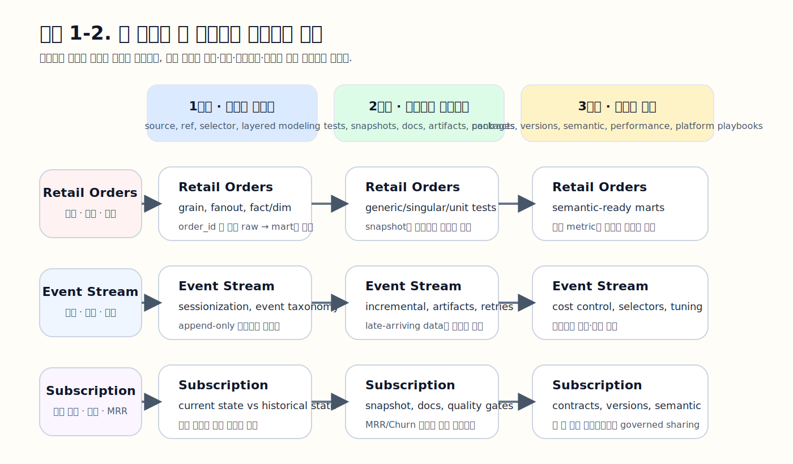

# 이 책을 읽는 방법

이 책은 dbt를 처음 배우는 사람도 따라올 수 있도록 앞쪽에서 기본 개념과 작업 흐름을 충분히 설명하고, 뒤로 갈수록 운영, 거버넌스, semantic layer, casebook, platform playbook으로 서서히 확장되도록 설계했다.

핵심은 세 가지다.

1. 앞쪽 챕터에서 공통 원리를 배운다.  
2. 중간의 casebook에서 세 예제가 어떻게 자라나는지 확인한다.  
3. 뒤쪽의 platform playbook에서 같은 설계를 각 플랫폼에 어떻게 옮기는지 본다.  

## 세 가지 연속 예제

이 책은 세 예제를 처음부터 끝까지 끌고 간다.

1. Retail Orders  
2. Event Stream  
3. Subscription & Billing  

각 예제는 day1/day2 데이터, expected 결과, snippets, bootstrap 경로를 함께 제공한다.

## 권장 읽기 경로

| 독자 유형 | 먼저 읽을 부분 | 그 다음 볼 부분 |
| --- | --- | --- |
| dbt를 처음 배우는 사람 | Chapter 01 → 05 | Chapter 09~11, Chapter 12 |
| 실무 프로젝트를 맡은 사람 | Chapter 01 → 08 | 해당 casebook + 해당 platform playbook |
| 리드, 플랫폼 오너 | Chapter 05 → 08 | Chapter 17~20, Appendix D |

## 전체 목차

### 1. 핵심 개념과 기본기

1.1. [DBT overview and three example tracks](./01-dbt-overview-and-three-example-tracks.md)  
1.2. [Development environment, project structure, commands, and Jinja](./02-development-environment-project-structure-commands-and-jinja.md)  
1.3. [Source/ref, selectors, layered modeling, grain, and materializations](./03-source-ref-selectors-layered-modeling-grain-and-materializations.md)  
1.4. [Tests, seeds, snapshots, documentation, macros, and packages](./04-tests-seeds-snapshots-documentation-macros-and-packages.md)  

### 2. 신뢰성, 운영, 거버넌스, 확장

2.1. [Debugging, artifacts, runbook, and anti-patterns](./05-debugging-artifacts-runbook-and-anti-patterns.md)  
2.2. [Operations, CI/CD, state/defer/clone, vars/env/hooks, and upgrades](./06-operations-cicd-state-defer-clone-vars-env-hooks-and-upgrades.md)  
2.3. [Governance, contracts, versions, grants, quality, and metadata](./07-governance-contracts-versions-grants-quality-and-metadata.md)  
2.4. [Semantic layer, Python/UDF, mesh, performance, platform, and AI](./08-semantic-layer-python-udf-mesh-performance-platform-and-ai.md)  

### 3. Casebook

3.1. [Retail Orders](./09-casebook-retail-orders.md)  
3.2. [Event Stream](./10-casebook-event-stream.md)  
3.3. [Subscription & Billing](./11-casebook-subscription-billing.md)  

### 4. Platform Playbook

4.1. [DuckDB](./12-platform-playbook-duckdb.md)  
4.2. [MySQL](./13-platform-playbook-mysql.md)  
4.3. [PostgreSQL](./14-platform-playbook-postgresql.md)  
4.4. [BigQuery](./15-platform-playbook-bigquery.md)  
4.5. [ClickHouse](./16-platform-playbook-clickhouse.md)  
4.6. [Snowflake](./17-platform-playbook-snowflake.md)  
4.7. [Trino](./18-platform-playbook-trino.md)  
4.8. [NoSQL + SQL Layer](./19-platform-playbook-nosql-sql-layer.md)  
4.9. [Databricks](./20-platform-playbook-databricks.md)  

### 5. Appendix

5.1. [Companion pack, bootstrap, and answer keys](./appendix-a-companion-pack-bootstrap-and-answer-keys.md)  
5.2. [dbt command reference](./appendix-b-dbt-command-reference.md)  
5.3. [Jinja, macro, and extensibility reference](./appendix-c-jinja-macro-and-extensibility-reference.md)  
5.4. [Troubleshooting, decision guides, glossary, and support matrix](./appendix-d-troubleshooting-decision-guides-glossary-and-support-matrix.md)  

## 저장소에서 파일을 찾는 법

- 본문과 부록은 `chapters/`
- 그림은 `chapters/images/`
- 코드와 bootstrap 파일은 `codes/`
- 책 범위와 구조 문서는 `00_meta/`, `01_outline/`

이 구조만 기억하면 GitHub 안에서 길을 잃지 않고 이동할 수 있다.
