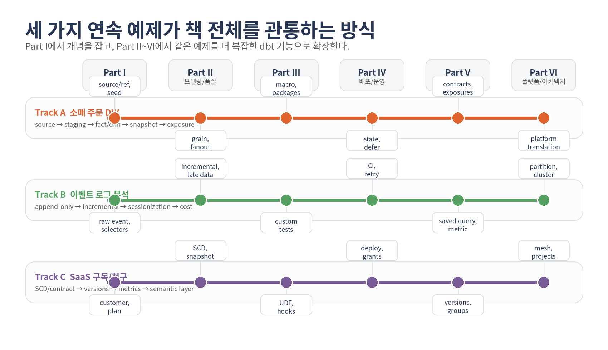

# 이 책을 읽는 방법

이 교재는 초보자용 입문서처럼 앞에서 하나씩 기능을 소개하지만, 뒤로 갈수록 실무 운영과 고급 기능, 예제 케이스북, 플랫폼 플레이북으로 서서히 확장되도록 설계했다. 그래서 앞쪽 장은 일반 원리를 충분히 설명하고, 뒤쪽 장은 그 원리가 특정 도메인과 특정 플랫폼에서 어떤 순서와 제약으로 나타나는지를 사례 중심으로 보여 준다.

중요한 점은 반복되는 요약 표로 예제와 플랫폼을 매번 훑지 않는다는 것이다. 대신 본문은 큰 개념 장으로 묶고, 뒤에서 Retail Orders / Event Stream / Subscription & Billing 세 가지 케이스북과 DuckDB / MySQL / PostgreSQL / BigQuery / ClickHouse / Snowflake / Trino + NoSQL + SQL Layer 플레이북을 각각 별도 챕터로 두어, 앞에서 배운 내용을 실제 문맥 안에서 다시 전개한다.

**책 전체의 흐름**

Part I는 개념과 기본기, Part II는 신뢰성·운영·확장, Part III는 예제 케이스북, Part IV는 플랫폼 플레이북, 마지막 Appendices는 실행과 참조를 위한 백업 장치로 구성된다. 따라서 책을 처음 읽을 때는 앞쪽 장을 순서대로 보고, 실제 프로젝트에 옮길 때는 뒤쪽 casebook과 platform playbook을 병행해서 보는 방식이 가장 효과적이다.

*세 가지 연속 예제의 성장 지도*

### 권장 읽기 경로

| 독자 유형 | 먼저 읽을 부분 | 그 다음 볼 부분 |
| --- | --- | --- |
| dbt를 처음 배우는 사람 | Chapter 01 → 05 | Casebook 09~11, DuckDB/BigQuery 플레이북 |
| 실무 프로젝트를 맡은 사람 | Chapter 01 → 08 | 해당 도메인 Casebook + 해당 플랫폼 Playbook |
| 리드·플랫폼 오너 | Chapter 05 → 08을 먼저 훑고 01~04로 복귀 | Governance/Semantic + Platform chapters |

# 차례

| 번호 | 제목 | 구분 |
| --- | --- | --- |
| 1. | DBT의 전체 그림과 세 가지 연속 예제 | 장 |
| 1.1. | 왜 dbt를 쓰는가 | 절 |
| 2. | 개발 환경, 프로젝트 구조, DBT 명령어와 Jinja, 첫 실행 | 장 |
| 2.1. | 실습 환경 구축 | 절 |
| 2.2. | 프로젝트 구조 해부 | 절 |
| 2.3. | 첫 End-to-End 실행 | 절 |
| 2.4. | 프로젝트를 실제로 움직이는 워크플로 명령 | 절 |
| 3. | source/ref, selectors, layered modeling, grain, materializations | 장 |
| 3.1. | source()와 ref() | 절 |
| 3.2. | --select와 DAG 제어 | 절 |
| 3.3. | 계층형 모델링과 grain 클리닉 | 절 |
| 3.4. | Materializations와 incremental 실전 | 절 |
| 4. | Tests, Seeds, Snapshots, Documentation, Macros, Packages | 장 |
| 4.1. | generic·singular·unit test | 절 |
| 4.2. | Seeds와 Snapshots | 절 |
| 4.3. | 문서화·Jinja·Macros·Packages | 절 |
| 4.4. | 고급 테스트·문서화·메타데이터 | 절 |
| 5. | 디버깅, artifacts, runbook, anti-patterns | 장 |
| 5.1. | 디버깅과 실패 재현 랩 | 절 |
| 5.2. | 문제 해결 체크리스트 | 절 |
| 5.3. | 따라하기 워크북 모드 | 절 |
| 5.4. | 초보자 안티패턴 아틀라스 | 절 |
| 6. | 운영, CI/CD, state/defer/clone, vars/env/hooks, 업그레이드 | 장 |
| 6.1. | 운영·배포·협업 | 절 |
| 6.2. | Artifacts · State · Slim CI | 절 |
| 6.3. | Vars · Env · Hooks · Operations · Packages | 절 |
| 6.4. | dbt platform 작업환경 가이드 | 절 |
| 6.5. | 업그레이드·릴리스 트랙·행동 변화 체크리스트 | 절 |
| 7. | Governance, Contracts, Versions, Grants, Quality Metadata | 장 |
| 7.1. | Governance · Grants · Contracts · Versions | 절 |
| 7.2. | 고급 테스트·문서화·메타데이터 | 절 |
| 7.3. | 기능 가용성 배지와 지원 매트릭스 | 절 |
| 8. | Semantic Layer, Python/UDF, Mesh, Performance, dbt platform, AI | 장 |
| 8.1. | Semantic Models · Metrics · Saved Queries | 절 |
| 8.2. | Python Models · Functions · UDFs | 절 |
| 8.3. | Mesh · dependencies.yml · cross-project ref | 절 |
| 8.4. | Performance · Cost · Real-time · materialized_view | 절 |
| 8.5. | Semantic Layer 운영 Runbook | 절 |
| 8.6. | AI · Copilot · MCP 빠른 안내 | 절 |
| 8.7. | 확장 개발자 트랙 | 절 |
| 9. | Casebook I · Retail Orders | 장 |
| 10. | Casebook II · Event Stream | 장 |
| 11. | Casebook III · Subscription & Billing | 장 |
| 12. | Platform Playbook · DuckDB | 장 |
| 13. | Platform Playbook · MySQL | 장 |
| 14. | Platform Playbook · PostgreSQL | 장 |
| 15. | Platform Playbook · BigQuery | 장 |
| 16. | Platform Playbook · ClickHouse | 장 |
| 17. | Platform Playbook · Snowflake | 장 |
| 18. | Platform Playbook · Trino | 장 |
| 18.1. | 가장 먼저 확인할 profile / setup 예시 | 절 |
| 19. | Platform Playbook · NoSQL + SQL Layer | 장 |
| 19.1. | NoSQL + SQL Layer 패턴을 읽는 법 | 절 |
| A. | Companion Pack, Example Data, Bootstrap, Answer Keys | 장 |
| A.1. | 예제 데이터와 DBMS별 초기 셋업 | 절 |
| A.2. | 따라하기 워크북 모드 | 절 |
| A.3. | 장별 미션 빠른 정답 가이드 | 절 |
| B. | DBT 명령어 레퍼런스 | 장 |
| B.1. | 명령어 치트시트 | 절 |
| B.2. | DBT 명령어 레퍼런스 | 절 |
| C. | Jinja, Macro, Extensibility Reference | 장 |
| C.1. | Jinja 문법 레퍼런스 | 절 |
| C.2. | 확장 개발자 트랙 | 절 |
| D. | Troubleshooting, Decision Guides, Glossary, Official Sources, Support Matrix | 장 |
| D.1. | 문제 해결 체크리스트 | 절 |
| D.2. | 용어집 | 절 |
| D.3. | 공식 자료와 추가 학습 순서 | 절 |
| D.4. | 현업 시나리오 실전 지도 | 절 |
| D.5. | 의사결정 가이드 | 절 |
| D.6. | 장별 1분 복습 퀴즈와 자기 점검 | 절 |
| D.7. | 올인원 기능 지도와 버전·엔진 체크포인트 | 절 |
| D.8. | 기능 가용성 배지와 지원 매트릭스 | 절 |
| D.9. | Semantic Layer 운영 Runbook | 절 |
| D.10. | dbt platform 작업환경 가이드 | 절 |
| D.11. | 고급 테스트·문서화·메타데이터 | 절 |
| D.12. | 업그레이드·릴리스 트랙·행동 변화 체크리스트 | 절 |
| D.13. | AI · Copilot · MCP 빠른 안내 | 절 |
| D.14. | Trino 실전 메모 | 절 |
| D.15. | NoSQL + SQL Layer 실전 메모 | 절 |

# PART I · 핵심 개념과 기본기

## 핵심 개념과 기본기

dbt를 데이터 스택의 어디에 놓아야 하는지, 이 책이 끝까지 끌고 가는 세 가지 예제가 무엇인지, 그리고 각 플랫폼이 어떤 성격의 실행 환경인지 먼저 잡는다.
