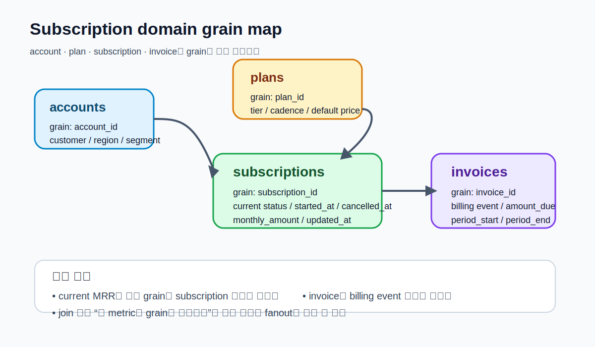
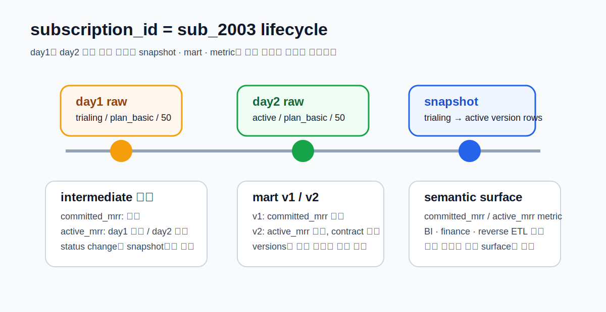
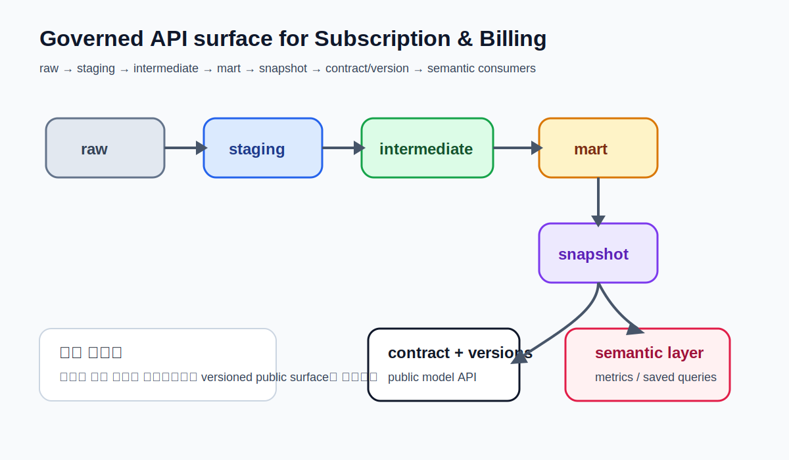

# CHAPTER 11 · Casebook III · Subscription & Billing

> 상태 변화, 계약, 버전, metric 정의가 한꺼번에 얽히는 도메인을 통해
> snapshot · contracts · versions · semantic-ready modeling이 왜 필요한지 끝까지 따라간다.

Subscription & Billing 예제는 세 개의 casebook 중에서 정의가 흔들리기 가장 쉬운 도메인을 다룬다.
Retail Orders는 비교적 안정적인 주문 사실을, Event Stream은 append-only 시간축을 중심으로 배웠다.
반면 구독 도메인은 현재 상태와 과거 상태가 다르고, 같은 금액 컬럼이라도 “계약상 월 금액”인지 “이번 달 청구 금액”인지,
또는 “active만 포함한 MRR”인지 “trialing까지 포함한 committed MRR”인지에 따라 의미가 달라진다.

이 장의 목적은 단순히 `fct_mrr` 하나를 만드는 것이 아니다.
다음 네 가지를 한 장 안에서 끝까지 연결하는 데 있다.

1. 구독 도메인의 grain과 상태 전이를 정확히 이해한다.
2. `source → staging → intermediate → mart` 흐름 안에서 MRR 정의를 안정화한다.
3. snapshot으로 상태 변화를 이력으로 보존한다.
4. contracts, versions, semantic model을 붙여 공용 API처럼 믿고 쓰는 surface를 만든다.

---

## 11.1. 이 예제가 왜 세 번째 Casebook이어야 하는가

Subscription & Billing은 앞선 두 예제에서 배운 거의 모든 개념을 다시 묶어 준다.

- Retail Orders에서 배운 grain 구분이 필요하다.
- Event Stream에서 배운 시간축과 freshness 감각이 필요하다.
- 그리고 여기서는 그 위에 상태 변화, 정의 충돌, 공용 metric, governed API가 추가된다.

즉, 이 예제는 “dbt 기능을 더 많이 보여 주는 도메인”이 아니라,
지금까지 배운 구조를 왜 더 엄격하게 써야 하는지 설득하는 도메인이다.

### 11.1.1. 구독 도메인에서 흔히 헷갈리는 세 가지 질문

첫째, 현재 상태를 보고 싶은가, 과거 상태의 변화를 보고 싶은가?
현재 상태는 `stg_subscriptions` 또는 current mart에서 볼 수 있지만, 과거 상태 변화는 snapshot이 있어야 안전하게 볼 수 있다.

둘째, MRR을 구독 상태에서 계산할 것인가, 인보이스에서 계산할 것인가?
대부분의 “현재 MRR”은 구독 현재 상태를 기준으로 계산하고, 인보이스는 billed revenue 검증이나 수금 확인에 더 가깝다.

셋째, trialing을 MRR에 포함할 것인가?
조직마다 정의가 다르다. 그래서 이 장에서는 처음부터 “정답 metric 하나”를 강요하지 않고,
`v1 → v2`로 정의를 명시적으로 버전업하는 방식을 택한다.

### 11.1.2. 이 장에서 추적할 대표 레코드

이 장에서는 `subscription_id = 'sub_2003'`을 계속 따라간다.

- day1: `trialing`
- day2: `active`
- snapshot: 상태 전이 이력 생성
- mart: 어떤 metric에 포함되는지 확인
- contract/version: 이 모델을 팀이 어떤 공용 API처럼 소비하는지 확인

이렇게 한 레코드를 끝까지 따라가면 snapshot, version, semantic layer가 왜 필요한지 훨씬 빨리 체감된다.

---

## 11.2. 먼저 이해해야 할 grain 지도



구독 도메인에서 가장 먼저 잡아야 하는 것은 행의 단위다.

### 11.2.1. account grain
`accounts`는 고객 또는 계약 주체 수준의 차원이다.
보통 한 계정은 여러 개의 subscription을 가질 수 있다.

### 11.2.2. plan grain
`plans`는 요금제 카탈로그다.
기본 월 금액과 billing cadence, plan tier 같은 비교적 안정적인 속성을 갖는다.

### 11.2.3. subscription grain
`subscriptions`는 현재 계약 상태를 나타내는 핵심 테이블이다.
한 row가 한 구독을 의미하지만, 상태는 시간에 따라 바뀐다. 그래서 현재 상태만 보면 과거 변화를 잃어버리기 쉽다.

### 11.2.4. invoice grain
`invoices`는 청구 이벤트 또는 청구 문서 단위다.
`subscription_id`와 연결되지만, MRR을 직접 대체하지는 않는다.
구독은 상태 중심, 인보이스는 청구 중심이라는 점을 구분해야 한다.

### 11.2.5. 왜 이 구분이 중요한가

가장 흔한 실수는 subscription과 invoice를 무심코 join해서
구독 하나가 여러 invoice row와 만나며 금액이 부풀어 오르는 것이다.

예를 들어:

- `subscriptions`는 `subscription_id` grain
- `invoices`는 `invoice_id` grain
- 따라서 invoice를 붙이기 전에 “내가 현재 필요한 metric의 grain이 subscription인지 invoice인지”를 먼저 정해야 한다.

구독 도메인의 품질은 SQL 문법보다 grain discipline에서 더 크게 갈린다.

---

## 11.3. day1 / day2 시나리오를 먼저 이해하자



이 예제는 day1과 day2 두 시점을 이용한다.

### 11.3.1. day1
day1에서는 비교적 안정된 초기 상태를 넣는다.

- `sub_2001`: Basic plan, active
- `sub_2002`: Pro plan, active
- `sub_2003`: Basic plan, trialing

### 11.3.2. day2
day2에서는 실제 운영에서 흔히 일어나는 세 가지 변화를 넣는다.

- `sub_2001`: canceled
- `sub_2002`: plan upgrade (`plan_pro → plan_enterprise`)
- `sub_2003`: `trialing → active`

이렇게 해야 다음을 동시에 실험할 수 있다.

1. status change snapshot
2. MRR 재계산
3. versioned metric 정의 비교
4. 계약/공용 API 관점의 변경 영향

### 11.3.3. 왜 이 시나리오가 좋은가

이 시나리오는 단순히 더 많은 데이터를 보여 주기 위한 게 아니다.
dbt가 강한 지점을 한 번에 드러내기 좋다.

- `source freshness`로 raw 상태를 확인할 수 있다.
- staging에서 상태값을 표준화할 수 있다.
- mart에서 “어떤 상태를 MRR에 포함할지”를 코드화할 수 있다.
- snapshot으로 status transition을 history row로 남길 수 있다.
- contract/version/semantic surface로 정의를 공용 API화할 수 있다.

---

## 11.4. 이 예제를 시작할 때 가장 먼저 볼 파일

| 구분 | 파일 경로 | 왜 먼저 보는가 |
| --- | --- | --- |
| bootstrap | `03_platform_bootstrap/subscription/setup_day1.sql` | accounts / plans / subscriptions / invoices raw 생성 |
| day2 변경 | `03_platform_bootstrap/subscription/apply_day2.sql` | 상태 전이, 취소, 업그레이드 삽입 |
| source 정의 | `models/subscription/subscription_sources.yml` | raw_billing source 범위와 freshness 확인 |
| 핵심 staging | `models/subscription/staging/stg_subscriptions.sql` | 상태값, 날짜, 월금액 표준화 |
| intermediate | `models/subscription/intermediate/int_subscription_mrr_basis.sql` | 현재 MRR 자격과 상태 해석을 분리 |
| mart v1 | `models/subscription/marts/fct_mrr_v1.sql` | 단순한 현재 MRR |
| mart v2 | `models/subscription/marts/fct_mrr_v2.sql` | 공용 API용 contract/version 확장 |
| snapshot | `snapshots/subscriptions_status_snapshot.yml` | 상태 이력 보존 방식 |
| semantic | `models/subscription/semantic/subscription_semantic.yml` | semantic-ready metric 정의 |

---

## 11.5. source 단계: raw를 공식 입력으로 선언하기

구독 도메인에서는 `subscriptions`와 `invoices`를 하드코딩으로 읽지 않는 것이 특히 중요하다.

그 이유는 세 가지다.

1. source freshness를 붙일 수 있다.
2. raw lineage가 docs에서 끊기지 않는다.
3. `loaded_at_field`를 기준으로 운영 체크를 자동화할 수 있다.

```yaml
version: 2

sources:
  - name: raw_billing
    database: analytics
    schema: raw_billing
    freshness:
      warn_after: {count: 6, period: hour}
      error_after: {count: 24, period: hour}
    tables:
      - name: subscriptions
        loaded_at_field: updated_at
      - name: invoices
        loaded_at_field: updated_at
      - name: plans
      - name: accounts
```

공식 문서 기준으로 freshness는 source에 `freshness:` 블록을 두고,
table에는 `loaded_at_field`를 둬서 column 기반 또는 warehouse metadata 기반으로 계산할 수 있다.
즉, 이 예제의 운영 시작점은 `dbt build`가 아니라 “raw가 제때 들어왔는가”를 확인하는 데 있다.
([freshness](https://docs.getdbt.com/reference/resource-properties/freshness), [sources](https://docs.getdbt.com/docs/build/sources))

### 11.5.1. source freshness는 tests를 대체하지 않는다

- freshness는 “들어오긴 했는가”를 본다.
- data tests는 “shape가 맞는가”를 본다.
- contract는 “public model이 약속한 컬럼을 지키는가”를 본다.

이 셋은 서로 다른 품질 계층이다.

---

## 11.6. staging: 상태와 날짜를 표준화하는 첫 관문

구독 도메인에서 staging은 단순 rename 단계가 아니다.
상태 변화와 metric 계산이 downstream으로 번지기 전에,
상태값과 날짜 컬럼을 먼저 정리해 두는 가장 중요한 단계다.

### 11.6.1. 핵심 staging 모델: `stg_subscriptions`

```sql
select
    subscription_id,
    account_id,
    plan_id,
    lower(status) as subscription_status,
    cast(started_at as date) as started_at,
    case
        when cancelled_at is null or cancelled_at = '' then null
        else cast(cancelled_at as date)
    end as cancelled_at,
    cast(monthly_amount as numeric) as monthly_amount,
    cast(updated_at as timestamp) as updated_at
from {{ source('raw_billing', 'subscriptions') }}
```

여기서 중요한 건 다음이다.

- `lower(status)`로 상태값 정규화
- 날짜 타입 정리
- `monthly_amount` 타입 고정
- snapshot을 위해 `updated_at`를 신뢰 가능한 컬럼으로 유지

### 11.6.2. `plans`와 `invoices`는 왜 따로 stage하는가

`plans`는 plan 카탈로그 차원이고, `invoices`는 billing event다.
나중에 둘을 한 번에 섞어 버리면 “현재 MRR 계산용 상태”와 “실제 청구 이벤트”가 뒤섞인다.

따라서 여기서는 다음처럼 책임을 분리한다.

- `stg_plans`: plan tier, billing cadence, default amount
- `stg_invoices`: invoice status, amount_due, period_start/end
- `stg_accounts`: account status, segment, region

즉, staging의 목적은 하나의 giant SQL을 만들기 위한 재료 준비가 아니라,
나중에 각 metric이 어디에서 출발하는지 추적 가능하게 만드는 것이다.

---

## 11.7. intermediate: “MRR 자격”을 별도 계층으로 빼는 이유

구독 도메인에서는 intermediate가 특히 중요하다.
왜냐하면 대부분의 혼란이 status 해석에서 생기기 때문이다.

예를 들어 이런 질문이 있다.

- `trialing`을 MRR에 포함하는가?
- `canceled`인데 `cancelled_at`이 미래 날짜면 어떻게 보는가?
- `past_due`는 active로 볼 것인가?

이런 판단을 mart의 최종 집계 SQL 안에 바로 넣으면,
v1과 v2를 비교하거나 metric 정의를 바꾸기 어려워진다.

그래서 `int_subscription_mrr_basis` 같은 intermediate 모델에서 먼저 해석한다.

```sql
with subs as (
    select * from {{ ref('stg_subscriptions') }}
),
plans as (
    select * from {{ ref('stg_plans') }}
)
select
    s.subscription_id,
    s.account_id,
    s.plan_id,
    p.plan_tier,
    s.subscription_status,
    s.started_at,
    s.cancelled_at,
    s.monthly_amount,
    case
        when s.subscription_status in ('active', 'trialing') then true
        else false
    end as contributes_to_committed_mrr,
    case
        when s.subscription_status = 'active' then true
        else false
    end as contributes_to_active_mrr,
    s.updated_at
from subs s
left join plans p
  on s.plan_id = p.plan_id
```

여기서 핵심은 정의 분리다.

- `committed_mrr` 기준
- `active_mrr` 기준
- 향후 churn 또는 expansion 계산 기준

이 intermediate가 있으면 mart는 “무엇을 집계할지”에 더 집중할 수 있다.

---

## 11.8. mart v1: 가장 단순한 현재 MRR부터 만든다

처음부터 완벽한 metric 레이어를 만들려고 하지 말자.
우선은 팀이 이해하기 쉬운 단순 버전부터 만든다.

### 11.8.1. `fct_mrr_v1`

```sql
with basis as (
    select * from {{ ref('int_subscription_mrr_basis') }}
)
select
    plan_id,
    count_if(contributes_to_committed_mrr) as committed_subscription_count,
    sum(case when contributes_to_committed_mrr then monthly_amount else 0 end) as committed_mrr
from basis
group by 1
```

이 모델은 단순하다.
`active + trialing`을 합친 committed MRR을 plan 기준으로 보여 준다.

### 11.8.2. 왜 v1이 필요한가

v1은 최종 정답이 아니라 정의 초안이다.
구독 도메인은 보통 처음엔 이렇게 시작한다.

1. 우선 합리적인 초안을 만든다.
2. 정의가 실제 조직 요구와 맞지 않는 지점을 찾는다.
3. v2에서 contract/versions를 붙여 공용 API로 안정화한다.

즉, versioning은 “고급 기능”이 아니라
정의가 바뀔 수밖에 없는 도메인을 안전하게 다루는 도구다.

---

## 11.9. mart v2: contract와 version을 붙인 공용 API



Subscription & Billing 예제는 공용 API surface의 필요성을 가장 강하게 보여 준다.
finance, BI, growth, reverse ETL, AI agent가 서로 다른 해석으로 MRR을 쓰기 시작하면 혼란이 커진다.

그래서 `fct_mrr`는 버전을 나눠 관리하는 것이 좋다.

### 11.9.1. v2에서 추가하는 것

- 컬럼 정의 고정
- contract enforced
- versioned model
- `latest_version: 2`
- `v1`은 하위 호환용으로 유지
- grants / access / group 부여

### 11.9.2. 예시 YAML

```yaml
version: 2

groups:
  - name: finance
    owner:
      name: finance-data
      email: finance-data@example.com

models:
  - name: fct_mrr
    latest_version: 2
    config:
      access: public
      group: finance

    versions:
      - v: 1
      - v: 2
        config:
          contract:
            enforced: true

    columns:
      - name: plan_id
        data_type: string
      - name: committed_subscription_count
        data_type: bigint
      - name: committed_mrr
        data_type: numeric
      - name: active_mrr
        data_type: numeric
```

공식 문서 기준으로 contract를 enforce하면
dbt는 YAML에 정의한 column `name`과 `data_type`을 기준으로
모델의 반환 shape가 정확히 일치하는지 확인한다.
versions는 `latest_version`과 `versions:`를 이용해 모델 API의 진화를 관리한다.
([contract](https://docs.getdbt.com/reference/resource-configs/contract), [versions](https://docs.getdbt.com/reference/resource-properties/versions))

### 11.9.3. 왜 Subscription 예제가 versioning에 잘 맞는가

MRR은 자주 바뀐다.

- trialing 포함 여부
- annual plan의 monthly normalization 방식
- canceled but paid-through 처리
- paused status 포함 여부

이건 코드 변경이면서 동시에 정의 변경이다.
그러므로 versioning이 자연스럽게 필요하다.

---

## 11.10. snapshot: 현재 상태와 과거 상태를 분리해 보존하기

Subscription 예제에서 snapshot은 선택이 아니라 거의 필수다.
왜냐하면 `stg_subscriptions`는 언제나 “현재 상태”만 말해 주기 쉽기 때문이다.

`sub_2003`이 day1에는 `trialing`, day2에는 `active`라면
현재 테이블만 봐서는 이전 상태를 잃어버린다.

### 11.10.1. YAML 기반 snapshot을 우선 고려하자

현재 공식 문서는 dbt Latest release track과 dbt Core v1.9+ 기준으로
새 snapshot은 YAML 기반 config를 권장하고,
SQL 파일의 `config()` block 방식은 legacy로 본다.
([snapshot configs](https://docs.getdbt.com/reference/snapshot-configs), [snapshot command](https://docs.getdbt.com/reference/commands/snapshot))

### 11.10.2. 예시: `subscriptions_status_snapshot.yml`

```yaml
snapshots:
  - name: subscriptions_status_snapshot
    relation: ref('stg_subscriptions')
    config:
      strategy: check
      unique_key: subscription_id
      check_cols:
        - subscription_status
        - plan_id
        - monthly_amount
      updated_at: updated_at
```

이 방식의 장점은 snapshot query와 config를 더 명확히 분리할 수 있다는 점이다.

### 11.10.3. snapshot이 보여 주는 것

- `sub_2001`: active → canceled
- `sub_2002`: plan_pro → plan_enterprise
- `sub_2003`: trialing → active

이 세 변화는 모두 “MRR 변화”와 연결되지만,
그 자체가 곧 metric은 아니다. snapshot은 먼저 상태 변화의 사실을 보존한다.

---

## 11.11. semantic-ready modeling: metric을 나중에 붙이는 게 아니라 준비하는 것

Subscription 예제는 semantic layer가 왜 필요한지 가장 잘 보여 준다.

### 11.11.1. semantic layer가 특별히 중요한 이유

같은 MRR라도 소비자가 다르면 해석이 달라진다.

- BI: dashboard용 현재 MRR
- finance: month-end close용 billable MRR
- growth: trialing 포함 committed MRR
- reverse ETL: active subscriptions only
- AI / analyst chatbot: metric name 하나로 질문

이때 semantic model과 metric을 정의해 두면
“질문 표면”을 통제하기 쉬워진다.

### 11.11.2. 이 장에서의 semantic starter

이 장에서는 semantic model을 full production 스펙으로 완성하기보다,
semantic-ready mart를 만들고 starter YAML을 붙이는 데 집중한다.

예를 들면:

```yaml
semantic_models:
  - name: subscription_mrr
    model: ref('fct_mrr_v2')
    defaults:
      agg_time_dimension: metric_date

    entities:
      - name: plan
        type: primary
        expr: plan_id

    dimensions:
      - name: metric_date
        type: time
        expr: metric_date
        type_params:
          time_granularity: day

    measures:
      - name: committed_mrr
        agg: sum
        expr: committed_mrr

metrics:
  - name: committed_mrr
    label: Committed MRR
    type: simple
    type_params:
      measure:
        name: committed_mrr
```

공식 문서상 최신 semantic/YAML spec의 가용성은 엔진과 release track에 따라 차이가 있으므로,
이 장에서는 semantic-ready design을 중심으로 설명하고,
실행 환경별 차이는 semantic/playbook 파트에서 다시 본다.
([semantic layer FAQs](https://docs.getdbt.com/docs/use-dbt-semantic-layer/sl-faqs))

---

## 11.12. `sub_2003`을 끝까지 따라가 보자

이 장의 대표 레코드는 `sub_2003`이다.

### 11.12.1. day1
- status = `trialing`
- plan = `plan_basic`
- monthly_amount = 50

### 11.12.2. staging
`stg_subscriptions`에서 상태값과 타입이 정리된다.

### 11.12.3. intermediate
`int_subscription_mrr_basis`에서

- `contributes_to_committed_mrr = true`
- `contributes_to_active_mrr = false`

처럼 정의가 분리된다.

### 11.12.4. day2
- status = `active`
- monthly_amount = 50
- `updated_at` 변경

### 11.12.5. snapshot
snapshot은 이 상태 변화를 새 version row로 남긴다.

### 11.12.6. mart v1 / v2
- v1에서는 committed MRR에 포함
- v2에서는 active MRR과 committed MRR을 분리해 더 정확히 표현 가능

즉, 이 한 레코드만 따라가도
staging → intermediate → mart → snapshot → contract/version → semantic 흐름이 모두 연결된다.

---

## 11.13. 품질 계층: tests, freshness, contract를 한 덩어리로 보지 말자

이 장에서는 품질 장치를 세 계층으로 구분하는 것이 중요하다.

### 11.13.1. source freshness
raw가 제때 들어왔는가?

### 11.13.2. data tests
shape와 관계가 맞는가?

예:
- `subscription_id` unique / not_null
- `plan_id` relationships to `stg_plans`
- `subscription_status` accepted_values

### 11.13.3. contract
공용 모델이 약속한 컬럼과 타입을 지키는가?

이 셋을 섞어 생각하면 운영이 어려워진다.
특히 Subscription 도메인에서는 freshness는 raw ingestion 문제를,
data tests는 관계/상태값 문제를,
contracts는 downstream API 신뢰 문제를 각각 담당한다.

---

## 11.14. 안티패턴

### 11.14.1. invoice와 subscription을 바로 join해서 current MRR을 계산하는 것
청구 이벤트와 현재 상태를 섞으면 중복 집계가 생기기 쉽다.

### 11.14.2. `active`, `trialing`, `canceled`를 raw 문자열 그대로 mart에서 처리하는 것
상태 정규화는 staging에서 해야 한다.

### 11.14.3. snapshot 없이 “이전 상태도 대충 알 수 있겠지”라고 생각하는 것
상태 변화 이력은 시간이 지나면 사라진다.

### 11.14.4. MRR 정의를 버전 없이 바꾸는 것
finance, BI, growth가 동시에 쓰는 metric은 버전 없이 바꾸면 혼란이 커진다.

### 11.14.5. contract를 너무 일찍 모든 모델에 붙이는 것
contract는 public API 성격이 강한 mart부터 적용하는 편이 좋다.

---

## 11.15. 직접 해보기

1. `setup_day1.sql` 실행
2. `dbt source freshness -s source:raw_billing`
3. `dbt build -s subscription`
4. `sub_2003`이 trialing 상태로 들어왔는지 확인
5. `apply_day2.sql` 실행
6. `dbt snapshot -s subscriptions_status_snapshot`
7. `sub_2003`의 상태 전이가 snapshot에 남았는지 확인
8. `fct_mrr_v1`과 `fct_mrr_v2`를 비교
9. `contracts / versions` YAML을 적용해 public model처럼 정리

---

## 11.16. 이 장의 핵심 정리

Subscription & Billing은 dbt의 고급 기능을 뽐내기 위한 예제가 아니다.
오히려 “정의가 흔들리기 쉬운 도메인을 어떻게 안정된 API로 바꾸는가”를 보여 주는 예제다.

이 장에서 기억해야 할 핵심은 다섯 가지다.

1. 구독 도메인은 grain discipline이 먼저다.
2. MRR 해석은 intermediate에서 먼저 분리한다.
3. snapshot은 현재 상태와 과거 상태를 분리해 보존한다.
4. contract와 versions는 metric 정의의 진화를 안전하게 만든다.
5. semantic-ready surface는 여러 소비자가 같은 질문을 하게 만든다.

다음 플랫폼 플레이북에서는 이 Subscription 예제를 각 엔진과 저장소 위에 실제로 어떻게 올릴지 다시 본다.
