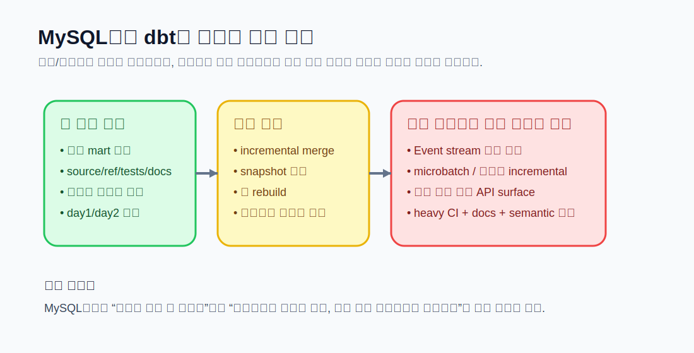
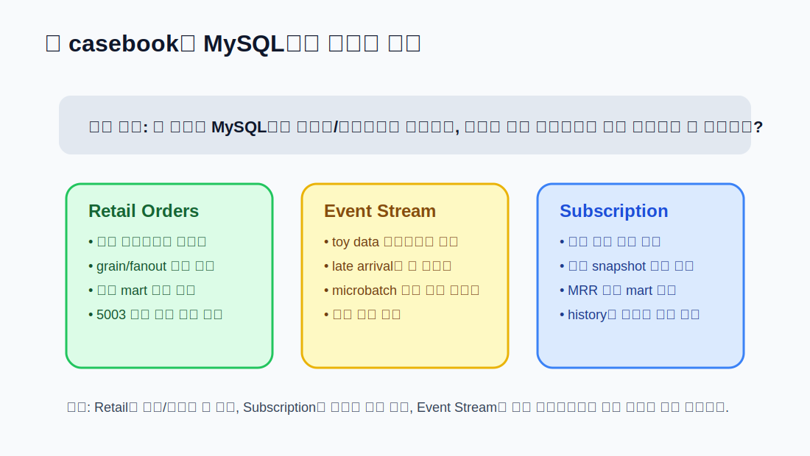
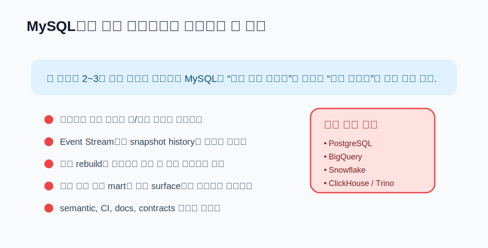

# CHAPTER 13 · Platform Playbook · MySQL

> MySQL은 dbt의 이상적인 분석 플랫폼이라기보다, 레거시 제약이 있는 조직에서 가장 먼저 현실적으로 마주치는 플랫폼에 가깝다.
> 따라서 이 장의 핵심 질문은 “MySQL에서도 되는가?”보다 “어디까지를 MySQL에 맡기고, 어디서 별도 분석 플랫폼으로 넘겨야 하는가?”이다.



MySQL 플레이북은 DuckDB 플레이북과 목적이 다르다. DuckDB 장이 학습과 빠른 반복을 위한 기준 플랫폼을 설명했다면, 이 장은 운영계 데이터와 가까운 곳에서 dbt를 시작해야 하는 현실적 제약 환경을 다룬다.

MySQL은 다음과 같은 상황에서 자주 등장한다.

1. 아직 별도의 DW가 없어서 운영계와 가까운 곳에서 작게 dbt를 시작해야 할 때
2. 애플리케이션 팀이 이미 MySQL을 사용하고 있어, 검증용 마트나 작은 리포트를 같은 인프라 위에서 빠르게 만들고 싶을 때
3. DW 이전 전에 모델링 구조, 테스트, 문서화, 실행 규칙을 먼저 정착시키고 싶을 때

반대로 MySQL은 다음 상황에서는 주의가 크다.

1. 이벤트성 데이터가 빠르게 누적되는 대용량 time-series 처리
2. 무거운 full rebuild를 자주 수행하는 배치 운영
3. snapshot, contracts, docs, CI, 여러 팀의 공용 API surface를 한꺼번에 밀어 넣는 경우
4. 운영계 트랜잭션과 분석 배치가 같은 인스턴스를 경쟁하는 경우

즉, MySQL 플레이북의 핵심은 작게 시작하되, 어디서 경계를 그을지 빨리 아는 것이다.

---

## 13.1. MySQL을 플랫폼 플레이북으로 따로 다뤄야 하는 이유

### 13.1.1. MySQL은 “가능하지만 신중해야 하는” 선택지다

dbt에서 MySQL은 사용할 수 있다. 다만 이 장의 관점은 “기능 체크리스트가 몇 개 켜져 있느냐”가 아니라, 실제 운영에서 어떤 식으로 안전하게 사용할 수 있느냐에 있다.

현실적으로 MySQL 위의 dbt는 다음 세 수준으로 나눠서 생각하는 편이 좋다.

1. 학습/검증 수준
   작은 예제를 올려 구조를 시험하고, source / ref / tests / docs 감각을 익힌다.

2. 제약된 내부 마트 수준
   작은 fact/dim, 일간 리포트, 재현 가능한 검증용 모델을 만든다.

3. 확장 한계 구간
   이벤트성 대량 데이터, 무거운 incremental merge, aggressive CI, 다수 팀의 공용 semantic surface가 몰리면 다른 플랫폼을 검토한다.

이 장은 세 번째 구간으로 넘어가기 전에 어떤 신호를 보아야 하는지까지 같이 설명한다.

### 13.1.2. DuckDB와 비교했을 때 MySQL의 위치

DuckDB는 학습을 위해 이상적이지만, 운영계 애플리케이션 데이터와는 거리가 있다. 반대로 MySQL은 운영계와 가깝지만, 분석 전용 플랫폼은 아니다.
따라서 두 장의 목적은 다르다.

- DuckDB 장: 개념을 가장 쉽게 검증하는 기준 환경
- MySQL 장: 운영계 제약 속에서 dbt를 어떻게 작고 안전하게 시작할지에 대한 지침

### 13.1.3. 이 장에서 볼 질문

이 장은 다음 질문에 답하는 구조로 읽으면 좋다.

1. MySQL에서 dbt를 시작할 때 가장 먼저 확인해야 할 환경 변수와 profile은 무엇인가?
2. 세 casebook를 MySQL에서 어느 범위까지 시험할 수 있는가?
3. 어떤 materialization과 테스트 전략이 안전한가?
4. MySQL 위에서 오래 버티기보다 다른 플랫폼으로 옮겨야 할 시점은 언제인가?

---

## 13.2. MySQL adapter와 지원 표면을 먼저 이해하기

### 13.2.1. Community plugin이라는 사실부터 받아들여야 한다

MySQL adapter는 “쓸 수 있지만, dbt Labs가 직접 지원하는 핵심 조합”으로 보기는 어렵다.
이 말은 곧 다음을 뜻한다.

1. 설치와 연결은 가능해도, 항상 다른 adapter와 같은 수준의 검증 범위를 기대하면 안 된다.
2. 공식 문서와 더불어 adapter repo 이슈, 실제 실행 로그, 사내 검증 결과를 함께 봐야 한다.
3. 책에 나오는 예제 역시 “모든 기능을 MySQL에서 완벽 재현한다”보다 어디까지 실험 가능하고 어디가 위험한지에 초점을 맞춰야 한다.

### 13.2.2. 버전과 표면

실무에서 가장 먼저 점검할 것은 아래다.

- MySQL 5.7인지, 8.0인지
- MariaDB인지
- snapshot을 쓸 계획이 있는지
- CTE가 필요한 ephemeral을 쓸지
- docs generate / tests / seeds / sources가 어느 정도까지 필요한지

이 장에서는 MySQL 8.0 또는 MariaDB 10.5+를 우선 권장하고, 5.7은 유지보수/레거시 호환 관점으로만 본다.

### 13.2.3. 왜 버전 차이가 중요한가

MySQL 8.0 이상이면 CTE 기반 로직과 ephemeral을 상대적으로 더 자연스럽게 다룰 수 있다. 반대로 5.7 환경은 snapshot과 timestamp 동작, sql_mode, CTE 미지원 등으로 인해 모델링 선택 폭이 줄어든다.
즉, “같은 MySQL”이라도 책에서의 권장 전략은 버전에 따라 달라진다.

---

## 13.3. profile, 연결, 첫 실행

### 13.3.1. 가장 먼저 보는 profile 예시

아래는 시작점으로 가장 단순한 예시다.

```yaml
my_mysql:
  target: dev
  outputs:
    dev:
      type: mysql
      server: localhost
      port: 3306
      schema: analytics
      username: analytics
      password: "{{ env_var('DBT_ENV_SECRET_MYSQL_PASSWORD') }}"
      ssl_disabled: true
```

이 예시를 쓸 때의 핵심은 다음 세 가지다.

1. `schema`는 dbt가 relation을 생성할 데이터베이스 이름 역할을 한다.
2. 민감한 값은 처음부터 `env_var()`로 분리한다.
3. 운영 환경과 같은 인스턴스를 쓰더라도, 개발용 schema를 분리해 운영계 테이블과 직접 충돌하지 않게 한다.

> companion snippet: `../codes/04_chapter_snippets/ch13/profiles.mysql.example.yml`

### 13.3.2. 첫 연결 확인 순서

MySQL에서 가장 먼저 해야 할 일은 모델을 쓰는 것이 아니라, 연결과 권한을 확인하는 것이다.

1. `dbt debug`
2. `SHOW DATABASES`
3. 대상 schema에 create / drop / alter가 가능한지 확인
4. 샘플 seed 또는 작은 staging 모델로 relation 생성 테스트
5. `dbt docs generate`까지 한 번 돌려 metadata surface를 확인

이 순서를 지키면 “SQL이 문제인지, 연결/권한이 문제인지”를 빨리 분리할 수 있다.

### 13.3.3. 운영계와 같은 인스턴스를 쓸 때의 원칙

운영계 MySQL과 같은 인스턴스를 쓰는 경우, 아래 원칙을 먼저 팀 규칙으로 정해 두는 편이 낫다.

1. 무거운 full rebuild는 비업무 시간대에만 수행
2. 개발자는 자신만의 schema를 사용
3. 큰 join과 rebuild는 꼭 필요한 범위만 `--select`
4. schema 변경이 필요한 모델은 사전 검토
5. 장시간 잠금을 유발할 가능성이 있는 모델은 다른 플랫폼 이전 후보로 분류

---

## 13.4. MySQL에서 materialization을 고를 때의 기준



### 13.4.1. view부터 시작하되, marts는 table을 신중하게 쓴다

MySQL에서 가장 무난한 출발점은 대체로 이렇다.

- staging: `view`
- intermediate: 작은 경우 `view`, 재사용 빈도가 높으면 `table`
- marts: 작은 검증용 `table`

이렇게 시작하면 모델의 구조는 충분히 익히면서도, 매 실행마다 무거운 물리 재생성을 최소화할 수 있다.

### 13.4.2. incremental은 “성능 최적화”이지 “설계 보정”이 아니다

MySQL 위에서 incremental을 도입할 때는 특히 더 보수적으로 판단하는 편이 좋다.
운영계와 가까운 플랫폼에서는 “조금 더 빨라 보인다”는 이유만으로 incremental을 빨리 붙이면 나중에 디버깅 비용이 더 커지기 쉽다.

먼저 확인해야 할 질문은 다음이다.

1. append-only인가?
2. late-arriving data가 있는가?
3. update가 자주 일어나는가?
4. `unique_key`를 source와 target 모두에서 안정적으로 보장할 수 있는가?
5. merge/replace 성격의 작업이 실제로 운영계에 부담을 주지 않는가?

### 13.4.3. ephemeral 사용 기준

ephemeral은 작은 helper logic를 인라인하기에는 편하지만, MySQL에서는 버전과 CTE 지원 여부를 고려해야 한다.
따라서 이 장의 기준은 다음과 같다.

- MySQL 8.0 이상: 작은 reusable helper에 한해 제한적으로 검토
- MySQL 5.7: ephemeral보다 view/table로 명시화하는 쪽을 기본 전략으로 본다

### 13.4.4. snapshot은 버전과 timestamp 설정을 먼저 확인한다

MySQL에서 snapshot을 쓸 때는 “syntax가 맞는가”보다 “서버 설정과 timestamp 동작이 안전한가”가 더 중요하다.
특히 5.7 계열에서는 timestamp 기본값과 자동 갱신 규칙 때문에 예기치 않은 동작이 생길 수 있으므로, subscription casebook 같은 상태 추적 모델은 사전 검증이 필요하다.

---

## 13.5. 세 casebook를 MySQL에서 어떻게 진행할까

### 13.5.1. Casebook I · Retail Orders

Retail Orders는 MySQL에서 가장 무난하게 실험할 수 있는 예제다.

왜냐하면:

1. grain이 비교적 명확하다.
   `orders`는 주문 grain, `order_items`는 주문 라인 grain으로 나뉜다.

2. day1/day2 변경도 설명하기 쉽다.
   상태값, 금액, 새로운 주문 추가 같은 변화를 작은 범위에서 재현할 수 있다.

3. 테스트와 docs도 비교적 자연스럽다.
   `not_null`, `unique`, `relationships`, 간단한 singular test를 붙이기 좋다.

MySQL에서 Retail Orders를 돌릴 때의 권장 전략은 이렇다.

- raw bootstrap은 작은 SQL 파일로 로드
- `stg_orders`, `stg_order_items`, `stg_products`, `stg_customers`는 view
- `int_order_lines`는 필요 시 table
- `fct_orders`, `dim_customers`는 작은 mart table
- `order_id = 5003` 같은 대표 주문을 추적하며 결과 확인

### 13.5.2. Casebook II · Event Stream

Event Stream은 MySQL에서 “될 수는 있지만 권장 범위가 좁다”는 사실을 보여 주는 예제다.

이유는 간단하다.

1. 이벤트는 append-only라 빠르게 커진다.
2. session/day grain 계산이 무거워질 수 있다.
3. late-arriving data까지 고려하면 incremental 설계가 금방 복잡해진다.
4. 운영계와 같은 인스턴스라면 리소스 경합이 빨리 드러난다.

그래서 MySQL에서 Event Stream을 다룰 때는 아래 수준까지만 추천한다.

- 작은 day1/day2 데이터를 사용한 모델 구조 검증
- event → session → daily grain의 개념 훈련
- freshness / selector / runbook 연습
- `dbt build -s` 범위 제어 훈련

반대로 대량 스트림과 microbatch 운영은 BigQuery, ClickHouse, Snowflake, Trino 계열 플레이북에서 본격적으로 다루는 편이 낫다.

### 13.5.3. Casebook III · Subscription & Billing

Subscription & Billing은 MySQL에서 상태 추적과 작은 마트 실험에는 의미가 있다.
특히 다음이 가능하다.

- subscription status history 실험
- 작은 snapshot 검증
- `fct_mrr`와 유사한 작은 mart 설계
- contracts / versions를 “공용 surface” 관점으로 맛보기

다만 이 예제는 시간이 지나면 곧 아래 문제가 나온다.

1. status history가 쌓인다.
2. invoice와 current subscription 상태를 함께 다루게 된다.
3. 재계산 범위가 커진다.
4. finance / BI / ops가 같은 모델을 참조하기 시작한다.

이쯤 되면 MySQL만으로 버티기보다, 별도 DW나 query layer 위로 옮겨 가는 기준을 세워야 한다.

---

## 13.6. MySQL 위의 테스트, 문서화, 품질 운영

### 13.6.1. 기본 테스트를 더 엄격하게 본다

MySQL은 운영계와 가까운 경우가 많기 때문에, 모델이 작더라도 기본 테스트를 더 엄격하게 붙이는 편이 좋다.

최소 권장:

1. primary/business key `not_null`
2. primary/business key `unique`
3. fact → dim `relationships`
4. 상태값 `accepted_values`

특히 Retail Orders와 Subscription 예제에서는 key 컬럼 품질을 먼저 잡아야 한다.

### 13.6.2. singular test를 자주 활용한다

MySQL 플레이북에서는 generic test만으로 부족한 경우가 많다.
예를 들면:

- fanout으로 인해 주문 금액이 부풀어지지 않았는가
- cancellation 상태가 MRR에 잘못 포함되지 않았는가
- 특정 날짜 범위에만 들어와야 할 데이터가 섞이지 않았는가

이런 건 singular test로 풀어 주는 편이 더 명확하다.

### 13.6.3. docs는 “나중에”가 아니라 처음부터 남긴다

MySQL은 DW처럼 자동 메타데이터 체계가 화려하지 않을 수 있으므로, dbt docs와 YAML 설명의 가치가 오히려 커진다.
특히 운영계 테이블과 분석용 모델의 경계를 팀이 헷갈리지 않게 하려면, source / model / column 설명이 더 중요하다.

---

## 13.7. 운영 원칙: MySQL에서 버틸 수 있는 범위와 버티면 안 되는 범위



### 13.7.1. MySQL에서 계속 버틸 수 있는 경우

다음 조건이면 MySQL 위에서 dbt를 당분간 유지할 수 있다.

1. 일 배치가 작고 범위가 제한적이다.
2. marts 수가 많지 않다.
3. 주된 목적이 공용 DW라기보다 검증용/내부용이다.
4. 운영계와의 리소스 충돌이 관리 가능하다.
5. docs / tests / selectors / basic CI 정도로도 충분하다.

### 13.7.2. 별도 플랫폼 이전 신호

아래 신호가 보이면 MySQL을 “영구 플랫폼”으로 보기보다 중간 경유지로 봐야 한다.

1. 이벤트성 데이터가 빠르게 누적된다.
2. snapshot과 상태 이력이 계속 커진다.
3. 여러 팀이 같은 모델을 공용 API처럼 쓰기 시작한다.
4. CI에서 `state`, `defer`, `clone`, docs, semantic surface까지 요구한다.
5. 운영계 락/부하 이슈가 반복된다.
6. full rebuild를 더 이상 안전하게 돌릴 수 없다.
7. 모델 성능보다 인프라 병목이 더 자주 문제된다.

이 시점에는 PostgreSQL, BigQuery, Snowflake, ClickHouse, Trino 중에서 실제 워크로드에 맞는 다음 플랫폼을 고르는 편이 좋다.

---

## 13.8. MySQL 부트스트랩과 실행 루프

### 13.8.1. 예제별 bootstrap 경로

이 repo의 companion pack에서는 세 casebook 모두 MySQL용 day1/day2 스크립트를 분리해서 둘 수 있다.

| 예제 | day1 bootstrap | day2 변경 |
| --- | --- | --- |
| Retail Orders | `03_platform_bootstrap/retail/mysql/setup_day1.sql` | `03_platform_bootstrap/retail/mysql/apply_day2.sql` |
| Event Stream | `03_platform_bootstrap/events/mysql/setup_day1.sql` | `03_platform_bootstrap/events/mysql/apply_day2.sql` |
| Subscription & Billing | `03_platform_bootstrap/subscription/mysql/setup_day1.sql` | `03_platform_bootstrap/subscription/mysql/apply_day2.sql` |

### 13.8.2. 가장 현실적인 실행 순서

처음 MySQL에서 세 예제를 돌릴 때는 아래 순서를 추천한다.

1. bootstrap SQL 실행
2. `dbt debug`
3. `dbt seed` (필요 시)
4. `dbt build -s staging`
5. `dbt build -s marts`
6. `dbt test -s marts+`
7. `dbt docs generate`

이 흐름을 지키면 “모든 걸 한 번에 build”하는 것보다 실패 범위를 더 빨리 좁힐 수 있다.

### 13.8.3. 안전한 개발 루틴

- `dbt ls -s ...`로 선택 범위를 먼저 확인한다.
- 전체 재실행보다 필요한 모델만 `--select`.
- 운영계와 같은 인스턴스라면 대량 rebuild 금지.
- snapshot은 작은 범위에서 먼저 검증.
- Event Stream은 반드시 toy data부터.
- MRR이나 semantic-ready surface는 작은 mart에서부터 시작.

---

## 13.9. 실수와 안티패턴

### 13.9.1. 운영계와 같은 인스턴스에서 무거운 rebuild를 반복하는 것

이건 가장 흔한 실수다. dbt가 잘못이 아니라, 플랫폼에 맞지 않는 실행 전략이 문제다.

### 13.9.2. Event Stream을 MySQL에서 장기 운영 플랫폼처럼 다루는 것

작은 검증은 가능해도, 이벤트 로그의 장기 축적과 빠른 증분은 MySQL의 대표 강점이 아니다.

### 13.9.3. snapshot과 timestamp 설정을 검증하지 않고 바로 운영에 넣는 것

특히 5.7 계열은 timestamp 관련 기본 동작을 꼭 먼저 확인해야 한다.

### 13.9.4. 버전 제약을 무시하고 ephemeral을 남발하는 것

ephemeral은 편하지만, MySQL 버전에 따라 기대한 방식으로 동작하지 않을 수 있다.

### 13.9.5. “일단 MySQL에서 시작했으니 계속 MySQL이어야 한다”고 생각하는 것

이 장의 목적은 MySQL을 만능 분석 플랫폼으로 미화하는 것이 아니라, 작게 시작하고 옮겨 갈 시점을 판단하는 기준을 주는 데 있다.

---

## 13.10. 직접 해보기

### 13.10.1. Retail Orders를 MySQL에서 완주해 보기

1. `setup_day1.sql` 실행
2. `dbt build -s stg_orders+`
3. `dbt test -s fct_orders+`
4. `order_id = 5003`을 기준으로 결과 추적
5. `apply_day2.sql` 실행 후 snapshot 또는 재계산 비교

### 13.10.2. Event Stream을 toy data로만 검증해 보기

1. 작은 event 데이터로 bootstrap
2. event/day grain의 차이 확인
3. lookback 없이 먼저 daily mart를 만들고
4. 그 다음 late-arriving data를 넣어 결과 차이를 본다

### 13.10.3. Subscription casebook에서 status history를 검증해 보기

1. day1 bootstrap
2. current subscription mart 생성
3. day2 status 변경 적용
4. snapshot 또는 current mart 결과 비교
5. `fct_mrr`에 포함/제외되어야 할 상태를 singular test로 검증

---

## 13.11. 체크리스트

### 13.11.1. 환경 체크리스트

- MySQL 8.0 / 5.7 / MariaDB 중 무엇인가?
- 운영계와 같은 인스턴스인가?
- dev schema를 별도로 분리했는가?
- `dbt debug`가 통과하는가?
- bootstrap SQL이 작은 데이터로 먼저 검증되었는가?

### 13.11.2. 모델링 체크리스트

- Retail Orders에서는 grain을 명확히 분리했는가?
- Event Stream을 toy data 범위로 제한했는가?
- Subscription의 상태 이력을 어디까지 MySQL에 둘지 정했는가?
- incremental / snapshot을 넣기 전에 key와 timestamp 규칙을 검증했는가?

### 13.11.3. 운영 체크리스트

- full rebuild가 운영계에 부담을 주지 않는가?
- heavy CI가 필요한 단계인가?
- docs / tests / contracts / semantic surface 요구가 커지고 있는가?
- 별도 DW 이전 신호가 이미 나오고 있지 않은가?

---

## 13.12. 마무리

MySQL 플레이북의 핵심은 기술적으로 “가능하다/불가능하다”를 따지는 데 있지 않다.
핵심은 이 플랫폼 위에서 어디까지를 안전하게 맡기고, 어느 시점에 다음 플랫폼으로 넘어갈지를 판단하는 기준을 배우는 데 있다.

세 casebook를 기준으로 보면 다음처럼 정리할 수 있다.

1. Retail Orders
   MySQL에서 가장 자연스럽게 시작할 수 있다.

2. Event Stream
   구조와 모델링 감각은 익히되, 장기 운영 플랫폼으로 보기에는 제약이 빨리 드러난다.

3. Subscription & Billing
   상태 이력과 작은 mart는 가능하지만, 공용 API surface와 history가 커질수록 다음 단계 플랫폼이 필요해진다.

따라서 MySQL은 이 책에서 “최종 답”이라기보다, 제약이 있는 현실에서 dbt를 시작하고 운영 원칙을 익히는 플랫폼으로 이해하는 편이 가장 정확하다.
