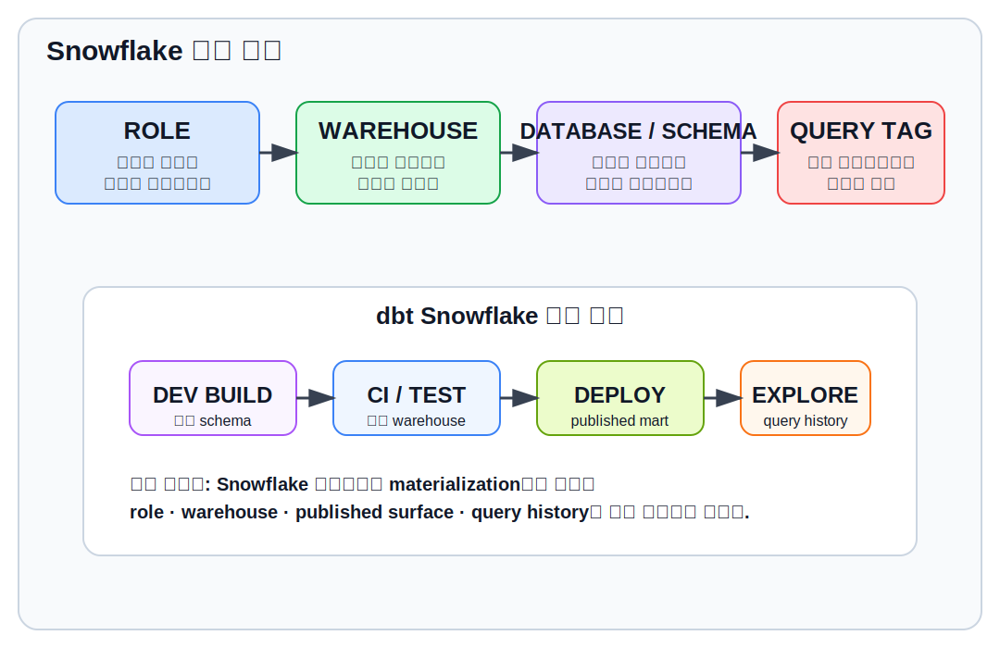
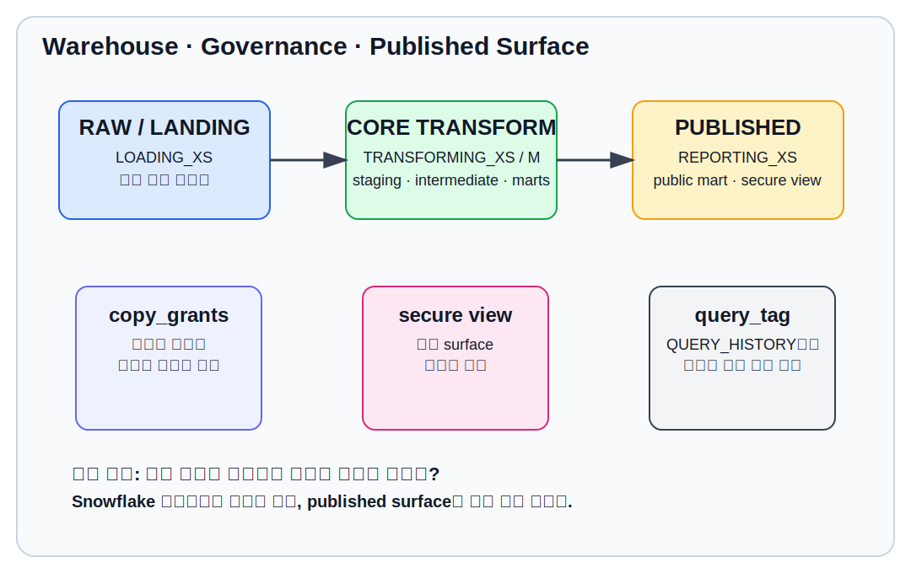
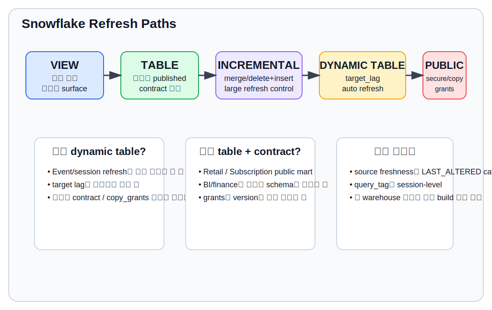

# CHAPTER 17 · Platform Playbook · Snowflake

Snowflake는 이 책에서 “엔터프라이즈 데이터웨어하우스에서 dbt를 어떻게 운영 계층까지 밀어 올릴 것인가”를 설명하기 가장 좋은 플랫폼이다.
DuckDB가 학습용 기준 플랫폼이라면, Snowflake는 역할(Role)·Warehouse·Database·Schema·권한·비용·공개면(Published Surface)을 함께 생각해야 하는 운영형 플랫폼이다.

현재 repository의 Chapter 17은 프로필 예시와 한두 문단의 개요 정도만 담고 있어서, Snowflake가 왜 별도 플레이북이 필요한지와 세 개의 casebook를 어떻게 이 플랫폼 위에서 운영해야 하는지가 충분히 펼쳐지지 못했다.
그래서 이 장은 다음을 끝까지 설명한다.

1. Snowflake를 별도 플레이북으로 다뤄야 하는 이유
2. Role / Warehouse / Database / Schema를 운영 표면으로 읽는 법
3. Snowflake 전용 또는 Snowflake에서 특히 중요한 dbt 설정
4. Retail Orders / Event Stream / Subscription & Billing 세 casebook를 Snowflake에서 실행할 때의 기준
5. 비용·성능·권한·공개면을 함께 보는 운영 runbook



## 17.1. Snowflake를 왜 별도 플레이북으로 다뤄야 하는가

같은 dbt 프로젝트라도 Snowflake에서는 다음 질문을 먼저 하게 된다.

- 어느 role로 실행할 것인가
- 어느 warehouse에서 빌드할 것인가
- 어느 database / schema에 어떤 계층을 둘 것인가
- 어떤 모델을 copy_grants / secure view / published surface로 노출할 것인가
- 어떤 모델은 dynamic table로 자동 갱신하고, 어떤 모델은 명시적 배치로 둘 것인가
- 같은 모델이라도 비용과 쿼리 이력 추적성을 어떻게 남길 것인가

즉, Snowflake에서는 dbt를 “SQL 실행기”보다 운영 설계 도구로 읽는 편이 정확하다.
특히 Snowflake는 warehouse가 계산 리소스와 직접 연결되기 때문에, 모델 구조와 실행 범위뿐 아니라 어떤 warehouse에서 돌리는지 자체가 성능과 비용의 핵심 변수가 된다.

### 17.1.1. 이 장에서 Snowflake를 보는 기본 관점

이 장은 Snowflake를 다음 여섯 층으로 본다.

1. Connection layer
   profile, account, role, warehouse, database, schema
2. Execution layer
   model build, tests, snapshots, query_tag, run history
3. Storage layer
   transient table, table, view, incremental, dynamic table
4. Governance layer
   grants, copy_grants, secure view, contract, version
5. Published surface
   public mart, semantic-ready model, finance-safe surface
6. Operating loop
   dev → CI → deploy → investigate → tune

---

## 17.2. Snowflake 운영 표면: Role · Warehouse · Database · Schema

Snowflake를 처음 다룰 때 가장 많이 헷갈리는 지점은 “dbt profile이 곧 Snowflake 구조”라고 착각하는 것이다.
profile은 연결 진입점일 뿐이고, 실제 운영 표면은 다음 네 축이 함께 움직인다.

### 17.2.1. Role
Role은 무엇을 만들고, 무엇을 읽고, 무엇을 공개할 수 있는지를 정한다.
개발자 개인이 dev schema에 만드는 권한과, 배포 환경이 prod mart에 반영하는 권한은 분리하는 것이 기본이다.

### 17.2.2. Warehouse
Warehouse는 계산 리소스다.
같은 SQL이라도 어떤 warehouse에서 도느냐에 따라 시간과 비용이 달라진다.
따라서 Snowflake에서는 “materialization 선택”만큼이나 “warehouse 배치 전략”이 중요하다.

### 17.2.3. Database / Schema
Database와 schema는 저장 위치이자 노출 경계다.
예를 들어 다음과 같이 나누면 운영 감각이 좋아진다.

- `RAW` / `raw_*` 계열: 외부 적재 데이터
- `ANALYTICS_DEV` / `dbt_<name>`: 개인 개발 영역
- `ANALYTICS` / `staging`, `intermediate`, `mart_core`, `mart_published`: 운영 영역

### 17.2.4. Query history / auditability
Snowflake는 query history를 강하게 제공하므로, dbt 실행 쿼리에 `query_tag`를 붙여두면 나중에
“이 비용은 어떤 모델에서 발생했는가”, “어떤 배포가 warehouse를 오래 점유했는가”를 추적하기 쉬워진다.



### 17.2.5. 최소 권장 구조

가장 단순한 시작점은 아래와 같다.

- 개발자 role: dev schema 생성/수정 가능
- 배포 role: published schema 생성/수정 가능
- small warehouse: docs / tests / light marts
- medium or large warehouse: heavy incremental / session build / snapshots
- published mart는 `copy_grants` 또는 별도 grants 정책으로 외부 소비자와 연결

---

## 17.3. 연결과 부트스트랩: Snowflake profile을 어떻게 읽을 것인가

Snowflake profile은 DuckDB나 Postgres보다 “길이가 길어서 어렵다”기보다, 운영 경계가 많이 드러나서 더 중요하다.

```yaml
acme_snowflake:
  target: dev
  outputs:
    dev:
      type: snowflake
      account: acme.ap-northeast-2
      user: analytics_user
      password: "{{ env_var('DBT_ENV_SECRET_SNOWFLAKE_PASSWORD') }}"
      role: TRANSFORMER
      database: ANALYTICS_DEV
      warehouse: TRANSFORMING_XS
      schema: dbt_jkim
      threads: 8
      client_session_keep_alive: false
      query_tag: dbt_local_dev
```

전체 예시는 [`../codes/04_chapter_snippets/ch17/profiles.snowflake.example.yml`](../codes/04_chapter_snippets/ch17/profiles.snowflake.example.yml)에 넣어 두었다.

### 17.3.1. profile에서 먼저 보는 항목

1. `account`
   어느 Snowflake 계정에 붙는가
2. `role`
   무엇을 만들 수 있는가
3. `warehouse`
   어느 계산 리소스를 쓰는가
4. `database` / `schema`
   어디에 쓰는가
5. `threads`
   병렬 실행 강도
6. `query_tag`
   실행 흔적을 어떻게 남길 것인가

### 17.3.2. local dev와 deploy의 차이

local dev는 비교적 작은 warehouse와 개인 schema를 쓰는 것이 일반적이다.
반대로 deploy는 다음 원칙을 가진다.

- published schema를 직접 만질 수 있는 role
- prod mart를 처리할 충분한 warehouse
- model / test / snapshot의 warehouse 분리 가능성
- query history를 읽기 쉬운 query_tag 규칙
- copy_grants, secure view, contracts를 함께 검토할 published layer

### 17.3.3. bootstrap은 warehouse / role 설계까지 포함한다

Snowflake bootstrap은 단순히 raw 테이블 생성 SQL이 아니다.
이 장의 bootstrap 예시는 database, schema, warehouse, role, grants까지 포함한다.

- [`../codes/04_chapter_snippets/ch17/snowflake_bootstrap.sql`](../codes/04_chapter_snippets/ch17/snowflake_bootstrap.sql)

이 스크립트는 다음 구조를 전제로 한다.

- `RAW`
- `ANALYTICS_DEV`
- `ANALYTICS`
- `LOADING_XS`
- `TRANSFORMING_XS`
- `TRANSFORMING_L`
- `REPORTING_XS`

---

## 17.4. Snowflake에서 중요한 dbt 설정

Snowflake에서는 단순히 `table` / `view`를 고르는 것보다, 아래 설정을 묶어서 읽는 것이 중요하다.

### 17.4.1. `snowflake_warehouse`
Snowflake에서는 모델별, 테스트별로 warehouse를 따로 지정할 수 있다.
무거운 build는 큰 warehouse, 가벼운 test는 작은 warehouse로 분리하면 운영 비용을 다루기 쉬워진다.

```yaml
models:
  my_project:
    marts:
      +snowflake_warehouse: "TRANSFORMING_L"

data_tests:
  +snowflake_warehouse: "TRANSFORMING_XS"
```

### 17.4.2. `query_tag`
query_tag는 Snowflake query history를 읽는 핵심 힌트다.
기본 tag를 profile에서 주고, 특정 모델만 override하거나 model name 기반으로 macro에서 세분화할 수 있다.

주의할 점도 있다. query tag는 session-level로 세팅되므로, build가 중간에 실패하면 이후 쿼리가 의도치 않은 tag로 남을 수 있다.
즉, “태그를 붙인다”에서 끝나는 게 아니라, 태그 reset 동작까지 운영 표면으로 이해해야 한다.

- 예시 매크로: [`../codes/04_chapter_snippets/ch17/set_query_tag.sql`](../codes/04_chapter_snippets/ch17/set_query_tag.sql)

### 17.4.3. `transient`
Snowflake에서 dbt가 만드는 table은 기본적으로 transient다.
이건 비용 면에서 유리하지만, time travel / fail-safe 보존 전략이 일반 table과 다르므로 published layer에 무조건 같은 기준을 적용하면 안 된다.

가볍게 정리하면:

- dev / intermediate / scratch mart: transient에 잘 맞음
- 장기 보존·감사 요구가 큰 public mart: transient 기본값을 그대로 둘지 검토 필요

### 17.4.4. `copy_grants`
published mart를 재구축할 때 grants를 유지하려면 `copy_grants`가 도움이 된다.
특히 BI나 downstream consumer가 이미 권한을 받은 view/table을 dbt가 교체하는 경우에 중요하다.

### 17.4.5. `secure`
민감 정보가 포함된 published view는 secure view로 노출할 수 있다.
다만 secure view는 성능 비용이 있을 수 있으므로, 모든 모델에 습관적으로 쓰기보다 published sensitive surface에 집중하는 편이 좋다.

### 17.4.6. `cluster_by`와 `automatic_clustering`
Event Stream 같은 큰 테이블은 clustering 전략을 고민할 수 있다.
현재 Snowflake에서는 automatic clustering이 기본적으로 활성화된 경우가 많고, 수동 클러스터링 계정을 위한 `automatic_clustering` config는 예전 계정에서만 의미가 있는 경우가 있다.

### 17.4.7. `tmp_relation_type`
Snowflake incremental은 중간 relation으로 view를 선호하지만, `delete+insert` + `unique_key` 정확성이 중요할 때는 temporary table이 더 안전한 경우가 있다.
즉, “기본값이 항상 최적”이라고 보기보다, incremental 전략과 함께 읽어야 한다.

---

## 17.5. Snowflake materialization 선택 기준

Snowflake에서는 같은 모델이라도 비용 / 공개면 / refresh 요구 / 권한 정책에 따라 materialization 선택이 달라진다.

### 17.5.1. 가장 자주 쓰는 선택지

1. `view`
2. `table`
3. `incremental`
4. `dynamic_table`
5. `materialized_view` (warehouse-native object와 함께 읽는 주제)

### 17.5.2. 기본 의사결정표

| 상황 | 권장 형태 | 이유 |
| --- | --- | --- |
| 개발 중 빠른 확인 | `view` | 재빌드 부담이 작다 |
| published mart, 질의 안정성 우선 | `table` | 소비자 관점에서 읽기 쉽다 |
| 대용량 append/merge | `incremental` | 계산 비용을 줄인다 |
| 이벤트 집계 자동 갱신 | `dynamic_table` | target lag 기반 refresh를 활용할 수 있다 |
| 민감 노출면 | `secure view` | 공개면을 통제하기 쉽다 |

### 17.5.3. Snowflake incremental 전략을 어떻게 읽을까

Snowflake adapter는 다음 incremental 전략을 지원한다.

- `merge` (기본)
- `append`
- `delete+insert`
- `insert_overwrite`
- `microbatch`

여기서 중요한 감각은 이거다.

- `merge`: key가 안정적일 때 가장 일반적
- `delete+insert`: nondeterministic merge가 나거나 key 품질이 애매한 경우 차선책
- `insert_overwrite`: Snowflake에서는 partition overwrite가 아니라 사실상 전체 overwrite 감각으로 읽어야 함
- `microbatch`: time-series를 batch window로 나누어 처리할 때

### 17.5.4. dynamic table을 언제 고려할까

dynamic table은 Snowflake 고유의 자동 refresh 면을 제공하지만, “모든 incremental의 상위호환”은 아니다.

다음 질문을 먼저 해야 한다.

1. refresh 지연 허용 범위가 있는가 (`target_lag`)
2. SQL이 dynamic table 제한 안에서 동작하는가
3. model contract가 꼭 필요한가
4. `copy_grants`가 필요한가
5. 이 모델이 다른 dynamic table 아래로 이어질 예정인가

공식 문서 기준으로 dynamic table은 model contracts와 copy_grants를 지원하지 않는다.
그러므로 public API surface에는 table + contract + grants 조합이 더 적합한 경우가 많다.



---

## 17.6. 세 casebook를 Snowflake에서 어떻게 진행할까

이 장의 핵심은 “Snowflake가 기능이 많다”가 아니라,
앞에서 배운 세 casebook가 Snowflake에서 어떤 운영 결정을 요구하는가를 읽는 데 있다.

## 17.6.1. Casebook I · Retail Orders

Retail Orders는 Snowflake에서 published mart + grants + secure view + copy_grants를 시험하기 좋은 예제다.

권장 흐름은 이렇다.

1. raw 주문/주문상세/상품 데이터를 `RAW.RETAIL` 계열 schema에 둔다
2. dev에서는 `ANALYTICS_DEV.dbt_<name>` schema에 staging/intermediate/marts를 만든다
3. published surface는 `ANALYTICS.mart_published` 또는 유사 schema에 `fct_orders`, `dim_customers`를 배치한다
4. 공개용 view가 민감 컬럼을 포함한다면 secure view를 고려한다
5. downstream BI 권한을 유지해야 한다면 `copy_grants`를 검토한다

특히 Retail Orders는 contract와 published API surface를 붙이기 좋다.

- `fct_orders_v1` → 기본 주문 매출
- `fct_orders_v2` → 반환/환불 규칙을 명시한 개정 버전
- published consumer는 `public` model만 참조

예시:
- [`../codes/04_chapter_snippets/ch17/retail_fct_orders_published.sql`](../codes/04_chapter_snippets/ch17/retail_fct_orders_published.sql)

### 17.6.1.1. Retail Orders에서 Snowflake다운 결정

- build는 `TRANSFORMING_XS` 또는 `TRANSFORMING_M`
- quality test는 더 작은 warehouse로 분리 가능
- published view는 secure 여부를 business 요구로 판단
- grants가 이미 외부 BI에 전달되었다면 `copy_grants` 고려

## 17.6.2. Casebook II · Event Stream

Event Stream은 Snowflake에서 비용과 refresh 전략을 가장 강하게 묻는 예제다.

이 도메인에서는 다음 질문이 중요하다.

1. raw event를 얼마나 자주 읽는가
2. session mart를 매번 rebuild할 것인가
3. microbatch가 적절한가
4. dynamic table로 target lag를 줄 것인가
5. clustering / warehouse sizing을 어떻게 둘 것인가

이벤트 스트림은 append-only 성향이 강하므로, Snowflake에서 다음 경로가 자주 등장한다.

- source freshness는 참고 지표로만 본다
  (Snowflake freshness는 `LAST_ALTERED` 기반이라 metadata 작업에도 흔들릴 수 있음)
- sessionized mart는 incremental 또는 dynamic table 후보
- daily aggregate는 `table` 또는 `incremental`
- semantic-ready aggregate는 published small surface로 별도 분리

예시:
- [`../codes/04_chapter_snippets/ch17/events_sessions_dynamic_table.sql`](../codes/04_chapter_snippets/ch17/events_sessions_dynamic_table.sql)

### 17.6.2.1. Event Stream에서 Snowflake다운 결정

- 작은 warehouse로 full scan을 반복하지 않기
- clustering이 필요한지 query pattern 기준으로 판단
- dynamic table은 편하지만 contracts/copy_grants 제한이 있다는 점 고려
- heavy event job과 light mart test를 같은 warehouse에 몰지 않기

## 17.6.3. Casebook III · Subscription & Billing

Subscription & Billing은 Snowflake에서 governed API surface를 설명하기 가장 좋은 예제다.

이 도메인에서는:

- status history를 snapshot으로 관리하고
- current MRR mart를 table/incremental로 운영하고
- public finance-facing surface를 versioned model로 배포하고
- semantic-ready starter를 붙여 반복 질문을 정리하는 흐름이 잘 맞는다

특히 finance/ops/sales/customer-success가 같은 지표를 다르게 해석할 수 있으므로, Snowflake에서는
`published mart + version + grants + secure view`를 함께 설계하는 편이 좋다.

예시:
- [`../codes/04_chapter_snippets/ch17/subscription_mrr_public_v2.yml`](../codes/04_chapter_snippets/ch17/subscription_mrr_public_v2.yml)

### 17.6.3.1. Subscription & Billing에서 Snowflake다운 결정

- `mrr_current`는 table 또는 incremental
- `subscription_status_history`는 YAML snapshot
- finance-facing view는 secure 후보
- published v1/v2를 grants와 함께 관리
- semantic-ready surface는 공용 metric layer 후보

---

## 17.7. Snowflake에서 특히 주의할 운영 포인트

### 17.7.1. source freshness는 “정확한 적재 시각”의 완전한 대체재가 아니다

Snowflake의 source freshness는 `LAST_ALTERED` 컬럼 기반으로 동작하므로,
DDL, DML, metadata maintenance도 freshness에 영향을 줄 수 있다.
따라서 Event Stream처럼 엄격한 ingestion freshness가 필요한 경우에는
raw table의 실제 적재 시각 컬럼 또는 별도 ingestion audit를 함께 보는 편이 낫다.

### 17.7.2. query_tag는 유용하지만 session-level이라는 점을 기억해야 한다

실패한 build 중간에 query_tag가 reset되지 않으면 이후 쿼리 이력 해석이 어색해질 수 있다.
따라서 query_tag 전략은 “설정”만이 아니라 “운영 관찰 규칙”까지 포함한다.

### 17.7.3. warehouse를 모델 크기가 아니라 질문 비용으로 나눠라

가장 흔한 실수는 다음 두 가지다.

- 모든 것을 큰 warehouse 하나에서 돌리기
- 반대로 너무 작은 warehouse 하나에 모든 build를 몰아넣기

현실적인 기준은 이렇다.

- docs / light tests / metadata tasks → 작은 warehouse
- marts / snapshots / moderate incremental → 중간 warehouse
- heavy event backfill / Python / large join → 큰 warehouse

### 17.7.4. dynamic table은 운영 편의성이지 보편적 승자가 아니다

dynamic table은 target lag와 자동 refresh가 매력적이지만,
- SQL 제약이 있고
- `--full-refresh`가 필요할 수 있고
- contract / copy_grants 제약이 있고
- downstream topology 제약도 있다

즉, Event Stream에서는 강력한 후보지만, Subscription public API surface에는 오히려 부적절할 수 있다.

---

## 17.8. 추천 bootstrap / config / runbook

### 17.8.1. bootstrap SQL
- [`../codes/04_chapter_snippets/ch17/snowflake_bootstrap.sql`](../codes/04_chapter_snippets/ch17/snowflake_bootstrap.sql)

### 17.8.2. profile 예시
- [`../codes/04_chapter_snippets/ch17/profiles.snowflake.example.yml`](../codes/04_chapter_snippets/ch17/profiles.snowflake.example.yml)

### 17.8.3. project-level config 예시
- [`../codes/04_chapter_snippets/ch17/dbt_project.snowflake.configs.yml`](../codes/04_chapter_snippets/ch17/dbt_project.snowflake.configs.yml)

### 17.8.4. runbook
- [`../codes/04_chapter_snippets/ch17/snowflake_runbook.sh`](../codes/04_chapter_snippets/ch17/snowflake_runbook.sh)

---

## 17.9. 직접 해보기

### 17.9.1. Retail Orders
1. bootstrap SQL로 warehouse / database / schema를 만든다
2. profile을 local dev 기준으로 맞춘다
3. `stg_orders`, `int_order_lines`, `fct_orders`를 build한다
4. `fct_orders_published`를 secure view 후보로 검토한다
5. `copy_grants` on/off 차이를 확인한다

### 17.9.2. Event Stream
1. raw event bootstrap을 적재한다
2. session mart를 table 버전과 dynamic table 버전으로 각각 만든다
3. query history에서 비용/시간 차이를 비교한다
4. source freshness가 예상과 다르게 흔들리는지 확인한다

### 17.9.3. Subscription & Billing
1. snapshot으로 subscription status history를 만든다
2. current MRR mart를 table로 만든다
3. public v1 / v2 definition을 versioned model로 정리한다
4. finance-facing secure view가 필요한지 판단한다

---

## 17.10. 안티패턴

### 17.10.1. 모든 모델을 같은 warehouse에서 돌리는 것
간단하지만 비용 통제가 어렵고 병목이 잘 생긴다.

### 17.10.2. dynamic table을 public mart의 만능 해답처럼 쓰는 것
contracts, grants, topology 제약을 무시하게 된다.

### 17.10.3. secure view를 성능 영향 없이 무료로 얻는 기능처럼 생각하는 것
민감 surface에만 집중적으로 써야 한다.

### 17.10.4. source freshness를 ingestion SLA의 정확한 대체재로 읽는 것
Snowflake의 `LAST_ALTERED` caveat를 반드시 기억해야 한다.

### 17.10.5. query_tag를 켜기만 하고 query history를 보지 않는 것
태그가 운영 관찰 루프에 연결되지 않으면 가치가 줄어든다.

---

## 17.11. 이 장의 체크리스트

아래 질문에 답할 수 있으면 이 장을 제대로 이해한 것이다.

- Snowflake에서 role / warehouse / database / schema를 왜 함께 봐야 하는가
- `snowflake_warehouse`를 model/test별로 나누는 이유는 무엇인가
- `copy_grants`, `secure`, `transient`는 각각 언제 고려하는가
- Event Stream에서 dynamic table을 쓸 때 얻는 것과 잃는 것은 무엇인가
- Subscription & Billing에서 versioned public mart를 왜 Snowflake에서 특히 잘 운영할 수 있는가
- source freshness를 해석할 때 Snowflake 특유의 caveat는 무엇인가

---

## 17.12. 이 장에서 가져가야 할 핵심

Snowflake 플레이북의 핵심은 “Snowflake용 SQL 문법”이 아니다.
핵심은 dbt 프로젝트를 엔터프라이즈 운영 표면으로 밀어 올리는 법이다.

따라서 Snowflake에서 좋은 dbt 설계는 다음을 함께 만족해야 한다.

1. 모델 구조가 분리되어 있다
2. 비용과 warehouse 경계가 보인다
3. published surface와 grants가 설계되어 있다
4. 필요한 곳에 secure / version / contract가 붙는다
5. query history와 운영 흔적을 남길 수 있다

이 감각이 잡히면, Snowflake는 단순히 비싼 웨어하우스가 아니라
dbt의 운영 성숙도를 시험하는 플랫폼으로 읽히기 시작한다.
