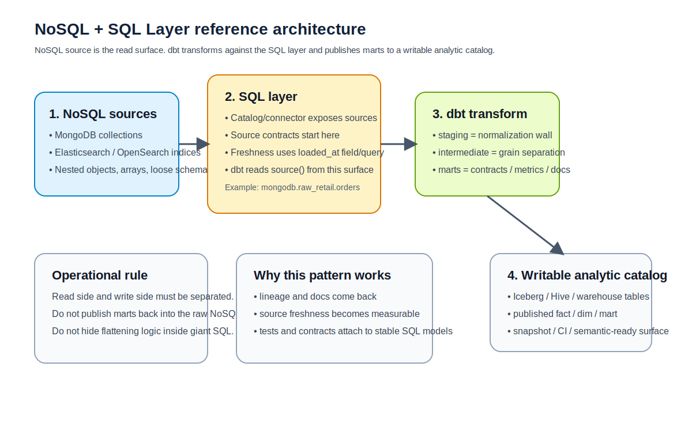
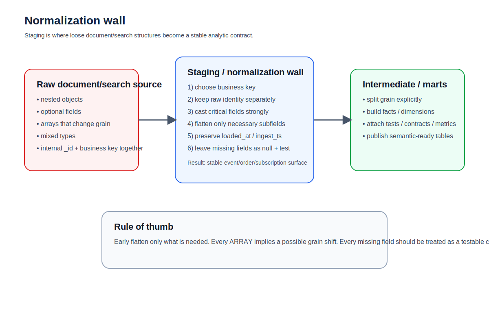
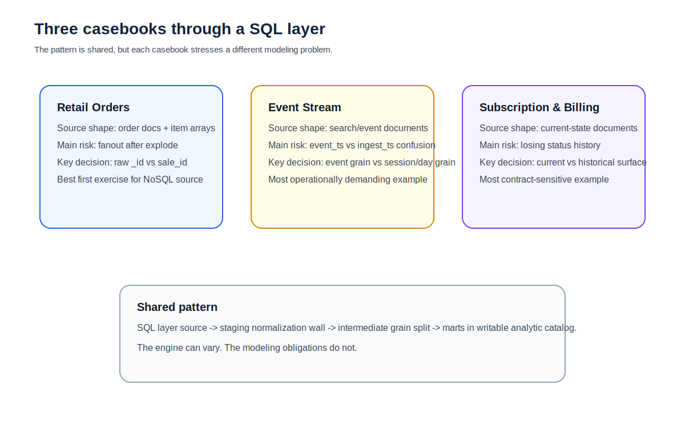

# CHAPTER 19 · Platform Playbook · NoSQL + SQL Layer

문서형 저장소와 검색 엔진을 그대로 dbt에 붙이는 일은 생각보다 자주 오해를 부른다.
이 장에서 말하는 NoSQL + SQL Layer 패턴은 dbt가 MongoDB나 Elasticsearch 같은 저장소를 직접 변환 엔진처럼 다룬다는 뜻이 아니다. 오히려 반대다. 문서형·검색형 원천은 SQL 레이어 뒤로 숨기고, dbt는 SQL 레이어에 드러난 source를 기준으로 변환 계층을 설계하는 운영 패턴을 뜻한다.

이 구성을 별도 플랫폼 플레이북으로 다루는 이유는 간단하다.
Trino 장은 연결, catalog, hooks, logging, Airflow, 장애 대응 같은 런타임 운영을 중심으로 설명했다. 반면 이 장은 느슨한 스키마를 어떻게 source 계약으로 바꾸고, staging에서 얼마나 보수적으로 정규화하며, 그 결과를 어떻게 신뢰 가능한 marts로 연결할 것인가를 다룬다. 다시 말해, Trino 장이 *엔진 운영 플레이북*이라면 이 장은 *데이터 모델링 플레이북*이다.

문서형 원천과 검색형 원천을 SQL 레이어 뒤에 두는 이유는 세 가지다.

1. 리니지와 테스트를 다시 되찾기 위해서다.
   dbt는 `source()`를 기준으로 lineage, docs, freshness, tests를 붙인다. raw JSON 파일이나 API 응답을 직접 모델 안에서 해석하는 방식으로는 이 계약을 만들기 어렵다.

2. 스키마 흔들림을 staging 경계에서 흡수하기 위해서다.
   문서형 원천은 키 누락, nested object 차이, 배열 길이 변화, 타입 흔들림이 관계형 원천보다 훨씬 흔하다. 이때 staging은 “예쁘게 rename 하는 곳”이 아니라 정규화와 방어적 캐스팅의 벽이 된다.

3. 쓰기 경로를 읽기 경로와 분리하기 위해서다.
   MongoDB나 Elasticsearch는 원천 저장소로는 유용하지만, 최종 fact/dim/mart를 오래 보관하고 조인·집계·배치를 운영하기에는 별도 쓰기 가능한 SQL catalog(Iceberg, Hive, warehouse 등)가 더 낫다. 그래서 이 패턴은 대개
   NoSQL source → SQL layer → dbt transform → writable analytic catalog
   구조로 읽는 편이 맞다.



## 19.1. 이 패턴을 언제 쓰는가

NoSQL + SQL Layer는 “가장 쉬운” 선택이 아니다.
다만 아래 같은 조건에서는 꽤 현실적인 선택이 된다.

### 19.1.1. 잘 맞는 경우

- 운영계는 MongoDB인데, 분석계는 SQL로 통일하고 싶은 경우
- Elasticsearch/OpenSearch에 쌓인 검색·로그 문서를 SQL로 집계하고 싶은 경우
- 원천 저장소는 다양하지만, dbt 프로젝트는 하나의 SQL surface로 유지하고 싶은 경우
- raw는 문서형이어도, 최종 모델은 결국 fact/dim/metric 형태로 가야 하는 경우
- BI, semantic layer, contracts, tests, slim CI 같은 dbt 운영 습관을 그대로 가져가고 싶은 경우

### 19.1.2. 덜 맞는 경우

- 문서 구조가 너무 자주 바뀌는데 SQL layer 쪽 table definition을 관리할 사람이 없는 경우
- nested object와 array가 지나치게 복잡해서 flatten 비용이 raw 자체보다 더 큰 경우
- source freshness를 판단할 `loaded_at` 성격의 필드가 전혀 없고, 운영 메타데이터도 약한 경우
- 검색 엔진의 relevance / full-text query가 핵심인데, 분석 팀이 이를 관계형 집계로 오해할 위험이 큰 경우
- writable analytic catalog가 따로 없어서 source와 mart를 같은 저장소 안에 뒤섞어야 하는 경우

핵심은 이거다.

> NoSQL + SQL Layer는 “dbt가 NoSQL을 직접 잘 다룬다”는 패턴이 아니라,
> “NoSQL을 SQL 표면 뒤에 두어 dbt가 강한 부분만 사용한다”는 패턴이다.

---

## 19.2. 읽기 면과 쓰기 면을 분리해 생각하기

이 패턴에서는 read surface와 write surface를 분리해서 보는 것이 중요하다.

### 19.2.1. Read surface

read surface는 SQL layer가 노출하는 source다.
예를 들어:

- `mongodb.raw_retail.orders`
- `mongodb.raw_subscription.subscriptions`
- `elasticsearch.default.events_raw`

dbt 입장에서는 이들이 모두 “source table”처럼 보인다.
하지만 실제 저장소의 성격은 관계형 테이블과 전혀 다를 수 있다. 따라서 source 선언을 할 때부터 다음 질문을 함께 던져야 한다.

1. 비즈니스 키는 무엇인가?
2. 문서의 내부 `_id`와 비즈니스 키를 분리할 것인가?
3. freshness를 판단할 필드는 무엇인가?
4. 스키마가 흔들릴 때 어느 단계에서 fail 시킬 것인가?
5. array/nested object를 어느 레벨까지 staging에서 flatten 할 것인가?

### 19.2.2. Write surface

write surface는 dbt가 최종 모델을 남길 수 있는 곳이다.
보통은 Iceberg, Hive, DuckDB, warehouse table 같은 분석용 저장면이 된다.

이걸 분리하지 않으면 생기는 문제는 뻔하다.

- source와 mart의 경계가 흐려진다
- lineage 상에서 원천과 산출물의 역할이 섞인다
- snapshot/history/logging/contracts 적용 면이 애매해진다
- 배치 재실행이나 slim CI가 source 저장소 특성에 끌려간다

따라서 이 장의 기본 전제는 다음과 같다.

- 문서형·검색형 저장소는 읽기 면
- 최종 fact/dim/mart는 쓰기 가능한 SQL catalog

---

## 19.3. source 계약부터 더 엄격하게 잡아야 한다

관계형 원천에서는 `database.schema.table`만 맞으면 source 정의가 비교적 단순하다.
반면 NoSQL + SQL Layer에서는 source 정의가 사실상 계약의 시작점이다.

### 19.3.1. freshness는 거의 항상 명시적으로 두는 편이 낫다

dbt 공식 문서 기준으로 freshness는 `warn_after` / `error_after`와 함께 `loaded_at_field` 또는 `loaded_at_query`를 사용해 계산한다. 일부 adapter는 warehouse metadata 기반 freshness를 지원하지만, NoSQL source를 SQL layer로 읽는 경로에서는 대부분 `loaded_at_field`를 명시하는 편이 안전하다. `dbt source freshness` 결과는 `sources.json` artifact에도 남는다.
이건 문서형 원천에서 “데이터가 늦었는지”를 확인하는 거의 유일한 객관적 지표가 되기도 한다.

아래 예시는 MongoDB와 Elasticsearch를 SQL layer를 통해 source처럼 읽는다는 가정의 source YAML이다.

```yaml
version: 2

sources:
  - name: nosql_retail
    database: mongodb
    schema: raw_retail
    tables:
      - name: orders
        description: "MongoDB retail orders documents exposed through SQL layer"
        config:
          freshness:
            warn_after: {count: 2, period: hour}
            error_after: {count: 6, period: hour}
          loaded_at_field: "loaded_at_ts"
        columns:
          - name: sale_id
            description: "Business key for order-level analytics"
          - name: loaded_at_ts
            description: "Ingestion timestamp projected by SQL layer"

  - name: search_events
    database: elasticsearch
    schema: default
    tables:
      - name: events_raw
        description: "Event documents indexed in Elasticsearch and queried through SQL layer"
        config:
          freshness:
            warn_after: {count: 30, period: minute}
            error_after: {count: 90, period: minute}
          loaded_at_field: "ingest_ts"
```

전체 예시는 [`../codes/04_chapter_snippets/ch19/sources.nosql_sql_layer.yml`](../codes/04_chapter_snippets/ch19/sources.nosql_sql_layer.yml)에 넣어 두었다.

### 19.3.2. 내부 식별자와 비즈니스 키를 분리한다

MongoDB에는 `_id`가 있고, 검색 문서에는 `_id`, `_index`, `_score` 같은 메타 필드가 있다.
하지만 최종 mart에서 필요한 키가 항상 그것과 같지는 않다.

예를 들어 Retail Orders에서는:

- 문서 `_id`: 저장소 내부 식별자
- `sale_id`: 주문 비즈니스 키
- `customer_id`: 차후 dimension join 키

Subscription & Billing에서는:

- 문서 `_id`: 상태 스냅샷 row identity
- `subscription_id`: 계약/과금 추적용 비즈니스 키
- `account_id`: 고객 단위 rollup 키

이걸 초반에 섞어 버리면 contracts, tests, snapshots, merge key가 전부 흔들린다.

### 19.3.3. source 단계에서는 “원형 보존 + 최소 계약”만 잡는다

source는 가능한 한 원형을 보존한다.
하지만 다음 정도는 source 설명 또는 source-level tests에서 먼저 고정하는 편이 좋다.

- 필수 필드 존재 여부
- loaded_at 성격의 시각 필드
- business key 후보
- 문서 상태를 나타내는 enum 성격 필드
- 삭제/취소/만료 같은 lifecycle 상태 필드

---

## 19.4. staging은 정규화 벽이다

문서형 원천을 관계형처럼 만드는 핵심은 staging이다.
이 장에서는 staging을 “rename 구간”이 아니라 normalization wall로 본다.



### 19.4.1. nested object는 early flatten, wide flatten을 피한다

nested object를 처리할 때는 “가능한 한 빨리 모두 펼친다”보다
“후속 모델에서 바로 필요한 필드만 안정적으로 꺼낸다”가 더 낫다.

예를 들어 subscription document가 아래처럼 생겼다고 가정하자.

```json
{
  "_id": "6650...",
  "subscription_id": "sub_2003",
  "account": {
    "account_id": "acct_18",
    "segment": "enterprise"
  },
  "plan": {
    "plan_code": "pro_annual",
    "billing_cycle": "annual"
  },
  "status": "active",
  "mrr": 320.00,
  "loaded_at_ts": "2026-04-09T00:10:00Z"
}
```

staging에서는 다음 정도만 확정하면 충분하다.

- `subscription_id`
- `account.account_id AS account_id`
- `plan.plan_code AS plan_code`
- `status`
- `mrr`
- `loaded_at_ts`

모든 하위 구조를 한 번에 wide table로 만들기 시작하면, 이후 스키마 변화 때 수정 범위가 과도하게 커진다.

### 19.4.2. array는 기준 grain을 정한 뒤에만 explode 한다

Event Stream과 Retail Orders에서 특히 중요하다.

- `order_items`가 array면 주문 grain과 order_item grain을 나눠야 한다.
- event payload 안에 `products: []`가 있으면 event grain과 product impression grain을 분리해야 한다.

이걸 무시하고 explode 후 바로 aggregate하면 fanout을 알아채기 어렵다.
문서형 원천일수록 “array는 곧 grain 변경”이라는 감각이 더 중요하다.

### 19.4.3. 강한 캐스팅과 기본값 전략을 같이 둔다

문서형 원천에서는 `"100"`, `100`, `"100.0"`, `null`이 섞이는 일이 흔하다.
staging에서는 다음 기준을 고정하는 편이 좋다.

- 키 컬럼: 실패를 허용하지 않고 cast
- 지표 컬럼: cast 후 실패하면 `null`, downstream에서 별도 검증
- 상태 컬럼: `lower()` + enum test
- 날짜/시각: timestamp 표준화
- 없는 필드: 임의 기본값으로 채우기보다 `null` 유지 후 테스트

---

## 19.5. MongoDB 예시: Retail Orders를 문서형 source에서 시작하기

MongoDB는 문서형 원천을 source로 드러내기에 가장 직관적이다.
Trino MongoDB connector는 MongoDB collection을 table처럼 노출하고, connector가 스키마 정보를 관리할 수 있는 schema collection(기본값 `_schema`)과 그에 대한 write access를 요구한다.

### 19.5.1. Bootstrap 관점

companion pack 기준으로는 JSONL을 `mongoimport`로 넣고, SQL layer가 그 컬렉션을 읽는 식이 가장 단순하다.

- day1: `orders_day1.jsonl`, `customers.jsonl`, `products.jsonl`, `order_items.jsonl`
- day2: `orders_day2_patch.jsonl` 또는 upsert/replace 방식
- source: SQL layer에서 `mongodb.raw_retail.orders`처럼 노출
- write: dbt는 Iceberg/Hive/warehouse 쪽 marts로 저장

Bootstrap 예시는 아래 스크립트에 넣어 두었다.

- [`../codes/04_chapter_snippets/ch19/mongo_retail_day1_import.sh`](../codes/04_chapter_snippets/ch19/mongo_retail_day1_import.sh)
- [`../codes/04_chapter_snippets/ch19/mongo_retail_day2_import.sh`](../codes/04_chapter_snippets/ch19/mongo_retail_day2_import.sh)

### 19.5.2. Retail Orders에서 보는 핵심 포인트

Retail Orders를 MongoDB source에서 시작하면 가장 먼저 드러나는 문제는 다음 두 가지다.

1. 주문 문서와 주문상세 array를 어떻게 나눌 것인가
2. `sale_id`와 문서 `_id` 중 어떤 것을 merge/snapshot/contracts의 기준으로 쓸 것인가

추천 기준은 이렇다.

- `_id`: raw identity로 보존
- `sale_id`: mart key와 business key로 사용
- order item array가 raw 안에 있다면 staging에서 line grain으로 분리
- `loaded_at_ts`를 반드시 유지해서 freshness와 retry 진단에 사용

예시 staging 모델:

```sql
with src as (
    select *
    from {{ source('nosql_retail', 'orders') }}
)

select
    cast(_id as varchar) as raw_document_id,
    cast(sale_id as varchar) as sale_id,
    cast(customer_id as varchar) as customer_id,
    cast(order_status as varchar) as order_status,
    cast(total_amount as decimal(18, 2)) as total_amount,
    cast(loaded_at_ts as timestamp) as loaded_at_ts
from src
where sale_id is not null
```

전체 예시는 [`../codes/04_chapter_snippets/ch19/stg_orders_from_mongo.sql`](../codes/04_chapter_snippets/ch19/stg_orders_from_mongo.sql)에 있다.

---

## 19.6. Elasticsearch 예시: Event Stream을 검색 문서에서 시작하기

검색 엔진 source는 문서형 source와 비슷하지만, 읽는 목적이 다르다.
Elasticsearch/OpenSearch는 “검색과 indexing”이 중심이지, fact table 저장소가 아니다. 따라서 이 장에서는 search documents를 source처럼 읽되, 집계와 published metrics는 별도 analytic surface로 옮긴다는 기준을 분명히 둔다.

Trino Elasticsearch connector는 Elasticsearch 7.x/8.x를 대상으로 하고, host/port/default-schema-name 같은 catalog 설정을 사용한다. 또 array types, raw JSON transform, full text query, special columns 같은 별도 특성이 있다.

### 19.6.1. Event Stream에서 보는 핵심 포인트

Event Stream을 search document로 읽으면 다음 문제가 먼저 나온다.

- 한 문서가 곧 event grain인지, session summary인지 혼재될 수 있음
- `attributes`, `context`, `items` 같은 nested field가 유동적
- `@timestamp`, `ingest_ts`, `event_time`이 서로 다를 수 있음
- full text 검색용 field와 집계용 field의 설계 목적이 다름

그래서 staging에서는 먼저 event grain만 고정해야 한다.

- `event_id`
- `user_id`
- `event_name`
- `event_ts`
- `session_id`
- `ingest_ts`
- `platform`
- `country_code`

그 후 intermediate/marts에서만 session/day grain으로 올린다.

예시 staging 모델:

```sql
with src as (
    select *
    from {{ source('search_events', 'events_raw') }}
)

select
    cast(event_id as varchar) as event_id,
    cast(user_id as varchar) as user_id,
    cast(event_name as varchar) as event_name,
    cast(session_id as varchar) as session_id,
    cast(platform as varchar) as platform,
    cast(country_code as varchar) as country_code,
    cast(event_ts as timestamp) as event_ts,
    cast(ingest_ts as timestamp) as ingest_ts
from src
where event_id is not null
```

전체 예시는 [`../codes/04_chapter_snippets/ch19/stg_events_from_search.sql`](../codes/04_chapter_snippets/ch19/stg_events_from_search.sql)에 넣어 두었다.

### 19.6.2. Elasticsearch에서는 source freshness와 query cost를 같이 본다

검색 엔진 source를 analytics에 쓰면 “문서가 늦게 들어온 것”과 “scroll/scan 비용이 비싼 것”이 동시에 문제가 된다.
따라서 Event Stream에서는 다음 루틴을 추천한다.

1. source freshness로 ingestion delay 먼저 확인
2. session/day marts는 batch window 기준으로 incremental
3. full scan을 줄이기 위해 lookback을 과도하게 넓히지 않기
4. 필요한 경우 raw document 전체를 다시 읽지 않고 curated staging table을 source처럼 재사용

---

## 19.7. Subscription & Billing: 문서형 상태 변화와 snapshot의 만남

Subscription 도메인은 문서형 원천과 특히 잘 맞기도 하고, 특히 위험하기도 하다.

잘 맞는 이유:
- 계약 상태, 플랜, 고객 속성이 문서형으로 묶여 들어오기 쉬움

위험한 이유:
- status change가 누락되면 MRR/active subscriber 계산이 틀어짐
- current document만 보고는 상태 이력을 잃기 쉬움
- “invoice가 있었으니 active” 같은 잘못된 추론이 생기기 쉬움

### 19.7.1. 이 도메인에서 가장 먼저 정할 것

- `subscription_id`가 business key인가?
- 한 문서가 current snapshot인가, change event인가?
- `loaded_at_ts`와 business effective time이 다른가?
- status history를 snapshot으로 만들 것인가, raw source의 change log를 신뢰할 것인가?

staging 예시는 아래처럼 최소 surface만 확정하는 식이 좋다.

```sql
with src as (
    select *
    from {{ source('nosql_subscription', 'subscriptions') }}
)

select
    cast(_id as varchar) as raw_document_id,
    cast(subscription_id as varchar) as subscription_id,
    cast(account_id as varchar) as account_id,
    cast(plan_code as varchar) as plan_code,
    cast(status as varchar) as status,
    cast(mrr as decimal(18, 2)) as mrr,
    cast(effective_at as timestamp) as effective_at,
    cast(loaded_at_ts as timestamp) as loaded_at_ts
from src
where subscription_id is not null
```

전체 예시는 [`../codes/04_chapter_snippets/ch19/stg_subscription_docs.sql`](../codes/04_chapter_snippets/ch19/stg_subscription_docs.sql)에 있다.

### 19.7.2. snapshot이 특히 중요한 이유

문서형 source가 current state만 제공하면, 구독 상태 이력은 금방 사라진다.
이때 dbt snapshot은 여전히 유용하다. 다만 기억할 점은 이것이다.

- snapshot은 source change log를 대체하는 것이 아니라 이력을 보강하는 배치 계층이다
- current surface와 historical surface를 따로 본다
- `subscription_id`는 business key, `dbt_valid_from`/`dbt_valid_to`는 history key다

---

## 19.8. 테스트 전략은 관계형보다 더 엄격해야 한다

NoSQL + SQL Layer에서는 테스트를 덜 붙이면 안 된다.
오히려 더 일찍, 더 엄격하게 붙여야 한다.

### 19.8.1. 가장 먼저 붙일 것

- `not_null` on business key
- `accepted_values` on status / event_name
- `relationships` on downstream marts
- singular test for required fields after flattening
- source freshness

예를 들어 문서형 source는 “필드가 존재하긴 하는데 null”과 “필드 자체가 없다”가 섞인다.
SQL layer에선 결국 둘 다 null처럼 보일 수 있으므로, staging 이후에 required field singular test를 따로 두는 것이 좋다.

예시 singular test:

```sql
select *
from {{ ref('stg_orders_from_mongo') }}
where sale_id is null
   or customer_id is null
```

전체 예시는 [`../codes/04_chapter_snippets/ch19/schema_drift_required_fields.sql`](../codes/04_chapter_snippets/ch19/schema_drift_required_fields.sql)에 있다.

### 19.8.2. source freshness는 “지연”을 보고, tests는 “모양”을 본다

둘은 대체 관계가 아니다.

- freshness: 데이터가 늦었는가
- tests: 데이터 모양이 깨졌는가

NoSQL source에서는 두 축이 자주 동시에 깨진다.
예를 들어 Elasticsearch ingestion이 지연되면 freshness가 먼저 이상해지고, 그 과정에서 일부 field 매핑이 바뀌면 tests도 깨질 수 있다.

---

## 19.9. 세 casebook를 이 패턴에서 어떻게 읽을까



### 19.9.1. Retail Orders

가장 적합한 학습용 예제다.
문서형 orders + nested items를 line grain으로 분리하는 연습이 좋다.
핵심 질문은 “주문 grain과 line grain을 어디서 나누는가”다.

### 19.9.2. Event Stream

가장 운영 난도가 높은 예제다.
검색 문서를 analytics surface로 옮길 때, event grain과 session/day grain을 분리하지 않으면 비용과 품질이 동시에 흔들린다.
핵심 질문은 “ingest_ts와 event_ts를 어떻게 함께 다룰 것인가”다.

### 19.9.3. Subscription & Billing

가장 계약/이력 관리가 중요한 예제다.
current document는 보기 쉽지만, 상태 변화와 effective time을 잃기 쉽다.
핵심 질문은 “subscription current state와 historical state를 어떻게 분리할 것인가”다.

---

## 19.10. 운영 체크리스트

### 19.10.1. MongoDB source를 붙일 때

- collection별 business key가 명확한가
- `_schema` 관리 책임이 있는가
- source freshness용 `loaded_at_ts`를 projection 했는가
- array/nested field를 어느 단계에서 flatten 할지 합의했는가
- `_id`를 raw identity로만 쓰는지, business key로도 쓸지 명확한가

### 19.10.2. Elasticsearch source를 붙일 때

- event time과 ingest time을 구분했는가
- full-text search field와 analytics field를 혼동하지 않는가
- scan cost와 scroll 특성을 감안해 incremental/lookback을 잡았는가
- source freshness 기준이 명확한가
- raw document 전체를 marts까지 끌고 가지 않는가

### 19.10.3. 공통

- source는 SQL layer를 기준으로 선언한다
- marts는 writable analytic catalog에 남긴다
- source freshness와 required-field tests를 함께 본다
- raw identity와 business key를 구분한다
- staging에서 “가능한 만큼”이 아니라 “필요한 만큼만” flatten 한다

---

## 19.11. 안티패턴

### 안티패턴 1. raw JSON을 model SQL 안에서 직접 파싱한다
이렇게 하면 lineage가 끊기고, source freshness와 docs가 약해진다.

### 안티패턴 2. array를 explode한 뒤 grain 설명 없이 바로 aggregate 한다
fanout을 눈치채기 가장 어려운 패턴이다.

### 안티패턴 3. `_id`를 아무 설명 없이 mart primary key처럼 사용한다
내부 식별자와 비즈니스 키를 섞게 된다.

### 안티패턴 4. source freshness 없이 “최신이라고 가정”한다
NoSQL source는 지연 여부가 눈에 덜 보인다. freshness를 따로 봐야 한다.

### 안티패턴 5. NoSQL source에 바로 public contract를 건다
먼저 staging/int를 안정화하고, marts에서 contract를 거는 편이 낫다.

---

## 19.12. 직접 해보기

1. MongoDB retail orders day1 import 후 `dbt source freshness`를 실행해 본다.
2. `stg_orders_from_mongo`에서 `sale_id`, `customer_id`, `loaded_at_ts`만 남기고 나머지는 보존 컬럼으로 넘겨 본다.
3. Elasticsearch event documents에서 `event_ts`와 `ingest_ts`를 둘 다 노출한 staging 모델을 만든다.
4. Subscription 문서에서 `subscription_id`를 business key로, `_id`를 raw identity로 유지하는 staging 모델을 작성한다.
5. singular test로 required fields 검사를 붙이고, 하나의 필드를 일부러 누락시켜 실패를 재현한다.

---

## 19.13. 이 장의 핵심

- NoSQL + SQL Layer는 Trino를 또 설명하는 장이 아니라, 느슨한 source를 dbt 계약으로 바꾸는 장이다.
- 핵심은 connector 자체보다 source 계약, normalization wall, business key, freshness, tests다.
- 문서형·검색형 source는 raw를 오래 믿지 말고, staging에서 보수적으로 정리해야 한다.
- 세 casebook는 이 패턴에서 모두 돌아가지만, 가장 쉬운 건 Retail, 가장 까다로운 건 Event Stream, 가장 계약 관리가 중요한 건 Subscription & Billing이다.
