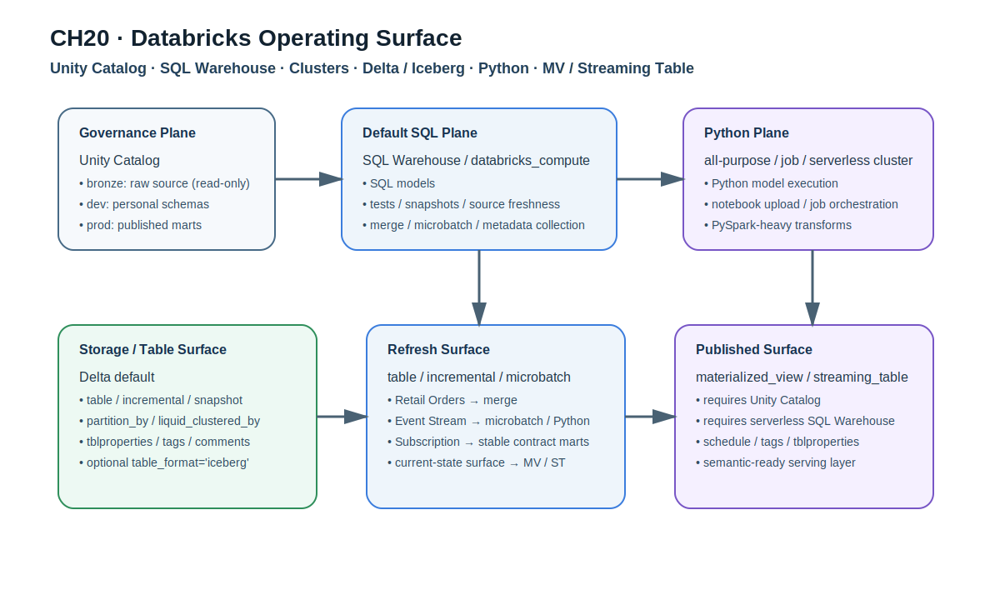
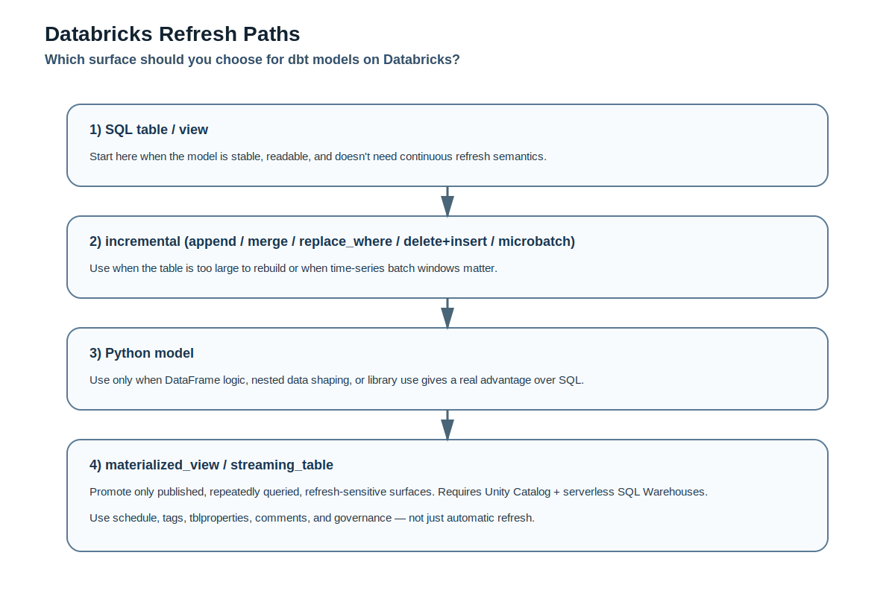

# CHAPTER 20 · Platform Playbook · Databricks

> Unity Catalog, SQL Warehouse, Jobs Cluster, Delta, Python model, Materialized View / Streaming Table을 한 플랫폼 안에서 함께 가져가는 운영형 플레이북

Databricks는 이 책에서 다루는 다른 플랫폼과 결이 조금 다르다.
DuckDB처럼 "가볍게 로컬에서 개념을 익히는 엔진"도 아니고, PostgreSQL처럼 "관계형 데이터베이스 위에서 dbt 모델을 오래 운영하는 플랫폼"도 아니며, Snowflake처럼 "warehouse/role/query tag를 축으로 운영을 설계하는 엔터프라이즈 DW"와도 1:1로 같지 않다.

Databricks에서 dbt를 쓴다는 것은 보통 아래를 한꺼번에 다룬다는 뜻이다.

- Unity Catalog를 기준으로 catalog / schema / privilege를 설계한다.
- Delta Lake를 기본 저장 포맷으로 생각한다.
- SQL Warehouse와 all-purpose cluster, job cluster를 함께 쓴다.
- SQL model뿐 아니라 Python model까지 같은 프로젝트 안에서 운영할 수 있다.
- 경우에 따라 incremental 대신 materialized view / streaming table로 넘길 수 있다.
- 세 예제 트랙(Retail Orders / Event Stream / Subscription & Billing)을 모두 한 플랫폼 안에서 실험할 수 있다.

그래서 Databricks 플레이북은 단순히 `profiles.yml` 한 장으로 끝나지 않는다.
이 장의 목적은 Databricks에서 dbt를 어디까지 맡길지, 어떤 계산은 SQL Warehouse에서 하고 어떤 계산은 Python cluster로 보낼지, 어떤 surface를 Delta table로 남기고 어떤 surface를 Materialized View 또는 Streaming Table로 승격할지를 판단할 수 있게 만드는 것이다.

---

## 20.1. 왜 Databricks는 별도 플레이북이어야 하는가

Databricks는 dbt에게 단순한 SQL 실행 대상이 아니다.
lakehouse라는 말이 과장처럼 들릴 때도 있지만, dbt 관점에서는 최소한 다음 네 가지를 동시에 고려하게 만든다는 점에서 분명히 별도 플레이북이 필요하다.

1. 저장 구조
   Delta가 기본이며, 경우에 따라 Iceberg compatibility까지 고려할 수 있다.

2. 거버넌스 구조
   Unity Catalog를 기준으로 dev / prod / personal schema를 설계해야 한다.

3. 실행 구조
   SQL Warehouse, all-purpose cluster, job cluster, serverless cluster가 각기 다른 속도와 비용 특성을 가진다.

4. 산출 구조
   table / incremental뿐 아니라 materialized_view, streaming_table, Python model, query tags, tags, tblproperties까지 같이 운영할 수 있다.

즉, Databricks는 "어댑터 하나 추가"가 아니라 운영 표면이 넓은 플랫폼이다.
이 장에서는 그래서 단순 설치보다 어떤 surface를 어떤 목적으로 써야 하는가에 집중한다.

### 20.1.1. 먼저 어댑터부터 바로잡자

Databricks에서 dbt를 쓸 때는 `dbt-spark`가 아니라 `dbt-databricks`를 기준으로 보는 것이 맞다.
이 어댑터는 Databricks 전용 connection surface, Unity Catalog, SQL Warehouse, Python submission methods, materialized views / streaming tables, query tags 같은 기능을 직접 다룬다.

실무에서 오래된 프로젝트를 볼 때는 아직도 `dbt-spark` 기반 흔적이 남아 있을 수 있다.
하지만 새로 정리하는 책이나 팀 표준 문서에서는 Databricks 전용 어댑터를 기준으로 쓰는 것이 안전하다.

### 20.1.2. Unity Catalog를 기준으로 생각해야 하는 이유

Databricks를 제대로 쓰려면 catalog를 먼저 생각해야 한다.
이 책에서 반복해서 강조한 "개발/운영 환경 분리", "source는 읽기 전용", "public mart는 계약된 surface" 같은 원칙이 Databricks에서는 Unity Catalog와 잘 맞물린다.

가장 안전한 기본선은 아래와 같다.

- bronze catalog: raw source를 읽기 전용으로 둔다.
- dev catalog: 개발자 개인 schema를 둔다.
- prod catalog: 팀이 publish하는 shared schema를 둔다.

그러면 모든 환경이 같은 source를 참조하면서도, 개발자가 실수로 운영 surface를 덮어쓸 가능성을 줄일 수 있다.

---

## 20.2. Databricks의 운영 표면을 먼저 그려 보자

Databricks에서 dbt를 운영할 때 가장 자주 헷갈리는 것은 "어느 compute에서 무엇이 실행되는가"다.
이를 먼저 분리해 두면 materialization과 성능, 비용 판단이 쉬워진다.

### 20.2.1. SQL Warehouse와 cluster는 역할이 다르다

#### SQL Warehouse
- 대부분의 SQL model
- tests
- snapshots
- docs metadata collection
- source freshness
- 일반적인 incremental merge

에 잘 맞는다.

#### all-purpose cluster
- 개발 중 Python model을 빠르게 반복 실행할 때
- notebook을 열어 확인하며 디버깅할 때
- interactive한 PySpark 실험이 필요할 때

에 잘 맞는다.

#### job cluster
- 길게 도는 Python model
- production batch
- cluster를 짧게 띄웠다가 내리는 실행
- 개발보다 비용을 더 신경 쓸 때

에 잘 맞는다.

즉, SQL Warehouse = 기본 실행면,
cluster = Python 또는 특수 계산의 실행면으로 생각하면 감각이 잡힌다.

### 20.2.2. Databricks에서 compute를 두 층으로 보라

Databricks chapter에서 자주 나오는 혼란은 이거다.

- "profile의 `http_path`가 있는데, 왜 Python model 안에서 또 compute를 적어야 하지?"
- "`databricks_compute`를 줬는데 왜 Python은 다른 cluster에서 돌아가지?"
- "왜 SQL은 빠른데 Python model은 시작이 느리지?"

이건 SQL phase와 Python phase가 같은 compute를 공유하지 않을 수 있기 때문이다.

특히 Python incremental model은
1. Python 코드로 stage를 만들고
2. 그 결과를 SQL로 merge
하는 식으로 움직이기 때문에,

- Python execution compute
- SQL merge compute

를 따로 생각해야 하는 경우가 많다.

### 20.2.3. Notebook 생성 위치도 운영 포인트다

Databricks Python model은 compiled PySpark 코드를 notebook 형태로 업로드해 실행할 수 있다.
이때 notebook이 어디에 쓰이는지, 누가 볼 수 있는지, debugging 후 사람이 UI에서 수정을 해버리는지 같은 운영 문제가 생긴다.

따라서 팀 규칙을 이렇게 잡는 것이 좋다.

- 개발 중: notebook 생성 허용, UI 확인 가능
- 운영: code is source of truth, UI 수정을 절대 정답으로 보지 않음
- Python model path, user folder, Shared folder 정책을 명시

---

## 20.3. 연결과 bootstrap을 어떻게 시작할까

### 20.3.1. 최소 profile의 기준선

Databricks에서는 보통 아래 네 값이 핵심이다.

- `host`
- `http_path`
- `token`
- `schema`

Unity Catalog를 쓰고 있다면 `catalog`도 함께 둔다.

예시는 companion code에 넣어 두었다.

- [`profiles.databricks.example.yml`](../codes/04_chapter_snippets/ch20/profiles.databricks.example.yml)

실무에서는 dev / prod target을 분리하고, 공통 query tag를 profile 수준에서 넣어 두는 편이 좋다.

### 20.3.2. source는 bronze를 읽기 전용으로 선언하라

Databricks에서는 raw source를 별도 bronze catalog에 두는 설계가 자연스럽다.
이 책의 세 예제도 Databricks에서는 아래처럼 source를 정의하는 것이 좋다.

- Retail Orders → `bronze.raw_retail.orders`
- Event Stream → `bronze.raw_events.events`
- Subscription & Billing → `bronze.raw_billing.subscriptions`

중요한 점은 dev와 prod가 모두 같은 bronze를 읽되, dbt가 쓰는 대상만 dev/prod로 나뉘게 하는 것이다.

이렇게 해야 development 환경에서 본 결과가 production에서도 재현된다.

### 20.3.3. first run 전에 확인할 것

Databricks는 connection success만으로 끝나지 않는다.
아래 네 가지를 같이 봐야 한다.

1. 내가 접속한 compute가 SQL Warehouse인지, all-purpose cluster인지
2. target catalog/schema에 create 권한이 있는지
3. bronze source catalog에 read 권한이 있는지
4. Python model을 돌릴 경우 cluster execution path가 준비되어 있는지

이를 위해 preflight SQL과 first-run shell 예시를 companion code에 넣어 두었다.

- [`databricks_preflight.sql`](../codes/04_chapter_snippets/ch20/databricks_preflight.sql)
- [`first_run_databricks.sh`](../codes/04_chapter_snippets/ch20/first_run_databricks.sh)

---

## 20.4. Databricks에서 materialization을 고르는 법

### 20.4.1. 기본선은 Delta table / incremental이다

Databricks에서는 다른 이유가 없으면 다음을 기본선으로 두는 것이 좋다.

- staging: view 또는 table
- intermediate: table 또는 incremental
- marts: table 또는 incremental
- event/time-series mart: incremental with microbatch 고려
- published surface: 경우에 따라 materialized_view / streaming_table 고려

핵심은 Delta를 기준으로 안정적인 운영 루프를 먼저 만든 뒤,
정말 필요한 곳만 Databricks-native refresh surface로 승격하는 것이다.

### 20.4.2. incremental 전략은 케이스별로 나뉜다

Databricks adapter는 여러 incremental 전략을 지원한다.
실무 감각으로 정리하면 대략 이렇게 본다.

#### append
- 단순 append-only 원천
- 중복이나 update 처리 필요가 적음
- 가장 단순

#### merge
- business key가 분명함
- 업데이트/정정이 들어옴
- Retail Orders, Subscription 상태 테이블에 적합

#### replace_where
- 특정 범위만 다시 덮어쓰고 싶음
- 날짜 파티션 재계산 등에 적합

#### delete+insert
- 명시적으로 교체하고 싶음
- `unique_key` 기준으로 기존 행 삭제 후 삽입

#### microbatch
- time-series, 대용량 이벤트
- `event_time` 기준 배치 계산
- Event Stream casebook에 특히 잘 맞음

### 20.4.3. partition과 liquid clustering을 같이 보라

Databricks에서 흔한 실수는 파티션을 너무 많이 잘게 쪼개는 것이다.
또 다른 실수는 모든 테이블에 무작정 liquid clustering을 붙이는 것이다.

안전한 기준은 다음과 같다.

- 날짜 기반 pruning이 아주 중요하다 → `partition_by`
- selective filter가 있고 file layout 최적화가 필요하다 → `liquid_clustered_by`
- 둘을 동시에 쓰려 하지 않는다
- 작은 테이블에는 둘 다 과할 수 있다

### 20.4.4. Delta를 기본으로 두고 Iceberg는 의도적으로 선택하라

Databricks는 `table_format='iceberg'`도 지원하지만, 이것을 "Delta 대신 그냥 쓰는 옵션"으로 이해하면 안 된다.

이 책 기준으로는 다음처럼 보는 게 안전하다.

- 기본선: Delta
- 특수 목적: Iceberg compatibility가 필요한 published surface
- 주의점: `table_format='iceberg'`일 때는 `file_format='delta'` 조건과 table property의 의미를 함께 이해해야 한다

즉, Databricks chapter에서 Iceberg는 "기본값"이 아니라 상호운용성 선택지다.

---

## 20.5. Databricks 고유 surface: materialized_view, streaming_table, tags

### 20.5.1. 언제 incremental 대신 MV/ST를 볼까

Databricks에서는 materialized view와 streaming table을 incremental의 대체 surface로 쓸 수 있다.
하지만 모든 곳에 쓰는 것이 아니라, refresh 주기와 publish 목적이 분명한 surface에 쓰는 편이 좋다.

예를 들면:

- `fct_orders`처럼 강한 배치 통제가 필요 → 일반 incremental/table
- `fct_events_daily`처럼 시간 단위 반복 집계가 많음 → microbatch 또는 materialized view 검토
- `current_mrr_surface`처럼 "현재 상태"를 자주 읽는 surface → materialized view 또는 streaming table 검토

중요한 점은 이 기능을 쓰려면 Unity Catalog + serverless SQL Warehouses가 준비되어 있어야 한다는 것이다.

### 20.5.2. schedule, tags, tblproperties는 운영 메타데이터다

Databricks의 materialized view / streaming table은 단순히 "자동 갱신되는 객체"로만 보면 아깝다.
schedule, `tblproperties`, `databricks_tags`, `description`을 함께 써야 운영 surface가 된다.

예:
- schedule: 얼마나 자주 refresh할지
- tags: 이 surface가 finance용인지, pii가 있는지
- tblproperties: optimize 관련 정책이나 format interoperability
- description: published surface의 의미를 남기는 설명

### 20.5.3. query tags는 Databricks에서 특히 유용하다

Databricks query history와 system table을 보는 팀이라면 query tags는 단순 장식이 아니다.
팀, 환경, cost center, 프로젝트 이름, casebook 이름을 남기면 비용/디버깅/감사 추적이 쉬워진다.

권장 패턴은 아래와 같다.

- profile: 공통 태그 (`team`, `project`, `env`)
- model-level: 특화 태그 (`casebook`, `cost_center`, `priority`)

단, query tags는 workspace 가용성 차이가 있을 수 있고, 기본 dbt 태그와 합쳐서 총 개수 제한을 넘지 않도록 주의해야 한다.

---

## 20.6. Python models는 Databricks에서 어떻게 보아야 하나

Databricks는 Python model을 진지하게 고려할 만한 몇 안 되는 주요 플랫폼이다.
그렇다고 모든 모델을 Python으로 바꾸라는 뜻은 아니다.

### 20.6.1. SQL로 충분한 것은 SQL로 남겨라

이 책 기준으로 대부분의 모델은 SQL로 충분하다.

- Retail Orders의 staging / marts
- Subscription & Billing의 current MRR mart
- Event Stream의 일 단위 집계

는 기본적으로 SQL이 더 단순하고 diff/review도 쉽다.

### 20.6.2. Python model이 특히 빛나는 경우

Python model은 아래처럼 SQL보다 DataFrame 연산이나 라이브러리 사용 이점이 큰 경우에 고려한다.

- sessionization이 복잡함
- array / map / nested JSON 정리가 무거움
- feature engineering이나 통계 전처리가 필요함
- Pandas / PySpark / ML 라이브러리를 함께 써야 함

### 20.6.3. 개발과 운영은 compute를 다르게 가져가라

가장 안전한 기본선은 다음과 같다.

- 개발: all-purpose cluster
- 운영: job_cluster
- 모델별 SQL merge는 필요하면 별도 SQL Warehouse 사용

예제 코드:
- [`events_sessions_python.py`](../codes/04_chapter_snippets/ch20/events_sessions_python.py)

---

## 20.7. 세 casebook를 Databricks에서 어떻게 진행할까

### 20.7.1. Retail Orders

Retail Orders는 Databricks에서 가장 무난하게 Delta merge 기반 fact/dim 설계를 검증하기 좋은 예제다.

권장 흐름:
1. bronze raw source를 source로 선언
2. staging은 가볍게 정리
3. `int_order_lines`로 grain을 안정화
4. `fct_orders`는 `merge` incremental 또는 table
5. order_date 기반 pruning이 중요하면 `partition_by=['order_date']` 검토

이 예제의 핵심은 Databricks-specific 기능을 과하게 쓰지 않아도 된다는 점이다.
Databricks chapter에서 Retail Orders는 "기본선"을 잡는 데 쓴다.

예제 코드:
- [`retail_fct_orders_merge.sql`](../codes/04_chapter_snippets/ch20/retail_fct_orders_merge.sql)

### 20.7.2. Event Stream

Event Stream은 Databricks에서 가장 Databricks답게 빛나는 예제다.

이유:
- append-only 성격이 강하다
- late-arriving data를 처리해야 한다
- event grain / session grain / daily grain을 분리해야 한다
- microbatch와 Python model을 모두 검토할 수 있다

권장 흐름:
1. raw events를 bronze catalog에서 source로 선언
2. staging에서 timestamp / user / session key 정리
3. `fct_events_daily`는 `microbatch`
4. sessionization이 단순하면 SQL, 복잡하면 Python model
5. published surface는 materialized view 또는 streaming table 검토

예제 코드:
- [`events_daily_microbatch.sql`](../codes/04_chapter_snippets/ch20/events_daily_microbatch.sql)
- [`events_sessions_python.py`](../codes/04_chapter_snippets/ch20/events_sessions_python.py)

### 20.7.3. Subscription & Billing

Subscription casebook는 Databricks에서 상태 변화 + published finance surface를 운영하는 감각을 주기 좋다.

권장 흐름:
1. subscription / invoice / plan source 선언
2. staging에서 상태값 표준화
3. snapshot 또는 상태 이력 모델 유지
4. `fct_mrr`는 contract 중심의 stable surface로 유지
5. current surface는 materialized view로 승격 가능

이 예제는 Databricks-native refresh를 "멋있어서 쓰는 기능"이 아니라
재무/운영이 반복해서 읽는 current surface를 안정적으로 공급하기 위한 도구로 이해하게 만든다.

예제 코드:
- [`subscription_current_mrr_mv.sql`](../codes/04_chapter_snippets/ch20/subscription_current_mrr_mv.sql)

---

## 20.8. Databricks에서 특히 주의할 실수

### 20.8.1. `dbt-spark`와 `dbt-databricks`를 뒤섞는 것
새 프로젝트 기준으로는 Databricks 전용 어댑터를 기준으로 가져가는 편이 훨씬 안전하다.

### 20.8.2. Unity Catalog 없이도 같은 설계가 될 거라고 생각하는 것
Databricks에서 dev/prod, bronze/source, published surface를 분리하는 핵심은 UC다.
없으면 가능한 것은 많아도 운영 설계가 쉽게 흔들린다.

### 20.8.3. Python model compute를 따로 보지 않는 것
SQL Warehouse만 profile에 잡아 놓고 Python model이 돌아가길 기대하면 곧 막힌다.
Python 실행 compute와 SQL merge compute를 분리해서 생각해야 한다.

### 20.8.4. materialized view / streaming table를 기본값처럼 쓰는 것
이 기능들은 강력하지만, 모든 모델에 필요한 것은 아니다.
refresh 책임이 분명한 published surface에만 의도적으로 쓴다.

### 20.8.5. partition / liquid clustering를 동시에 욕심내는 것
Databricks는 두 기능을 같은 materialization에서 섞을 수 없거나, 섞어도 운영 가치를 잃기 쉽다.
먼저 쿼리 패턴을 보고 하나를 선택하라.

### 20.8.6. query tags를 `dbt_project.yml`에만 두고 끝내는 것
Databricks에서는 profile-level + model-level을 같이 설계하는 편이 운영성이 높다.

### 20.8.7. notebook에서 직접 고친 것을 정답으로 착각하는 것
Python notebook은 디버깅 창이지, source of truth가 아니다.
정답은 repo 안 `.py` 모델이어야 한다.

---

## 20.9. Databricks에서의 직접 해보기

아래 순서로 해 보면 이 chapter의 핵심을 가장 빨리 익힐 수 있다.

1. profile을 작성한다.
   → `profiles.databricks.example.yml`

2. preflight SQL로 catalog / schema / 권한 / warehouse를 확인한다.
   → `databricks_preflight.sql`

3. Retail Orders를 Delta merge로 먼저 돌린다.
   → `retail_fct_orders_merge.sql`

4. Event Stream에서 microbatch를 실험한다.
   → `events_daily_microbatch.sql`

5. Python model을 job cluster로 넘겨 본다.
   → `events_sessions_python.py`

6. Subscription current surface를 MV로 올려 본다.
   → `subscription_current_mrr_mv.sql`

7. query tags를 profile-level과 model-level에 동시에 넣어 본다.
   → `profiles.databricks.example.yml`, `dbt_project.databricks.defaults.yml`

---

## 20.10. 이 장에서 기억할 것

Databricks에서 dbt를 잘 쓰는 핵심은 "Databricks 전용 기능을 많이 쓴다"가 아니다.
핵심은 어느 surface를 SQL Warehouse에 맡기고, 어느 계산을 cluster로 보내며, 어느 데이터셋을 Delta table로 남기고, 어느 published surface를 MV/ST로 승격할지 판단하는 것이다.

이 장을 끝까지 읽었다면 다음을 설명할 수 있어야 한다.

- 왜 Databricks에는 별도 플레이북이 필요한가
- 왜 Unity Catalog를 먼저 생각해야 하는가
- 왜 Python model compute를 SQL compute와 분리해 생각해야 하는가
- Retail / Events / Subscription 세 casebook를 Databricks에서 각각 어떤 materialization으로 운영하면 좋은가
- 언제 Delta incremental이면 충분하고, 언제 MV/ST를 고려해야 하는가

---

## 20.11. 코드 인덱스

| 파일 | 용도 |
|---|---|
| [`profiles.databricks.example.yml`](../codes/04_chapter_snippets/ch20/profiles.databricks.example.yml) | Databricks profile + query tags + alternate compute |
| [`sources.unity_catalog.example.yml`](../codes/04_chapter_snippets/ch20/sources.unity_catalog.example.yml) | bronze catalog source 선언 예시 |
| [`dbt_project.databricks.defaults.yml`](../codes/04_chapter_snippets/ch20/dbt_project.databricks.defaults.yml) | Delta 기본값, compute, docs/query tag 기본값 |
| [`databricks_preflight.sql`](../codes/04_chapter_snippets/ch20/databricks_preflight.sql) | first-run 전 catalog/schema/warehouse 점검 |
| [`first_run_databricks.sh`](../codes/04_chapter_snippets/ch20/first_run_databricks.sh) | 권장 첫 실행 루틴 |
| [`retail_fct_orders_merge.sql`](../codes/04_chapter_snippets/ch20/retail_fct_orders_merge.sql) | Retail Orders용 Delta merge 예시 |
| [`events_daily_microbatch.sql`](../codes/04_chapter_snippets/ch20/events_daily_microbatch.sql) | Event Stream용 microbatch 예시 |
| [`events_sessions_python.py`](../codes/04_chapter_snippets/ch20/events_sessions_python.py) | Event Stream용 Python model 예시 |
| [`subscription_current_mrr_mv.sql`](../codes/04_chapter_snippets/ch20/subscription_current_mrr_mv.sql) | Subscription current surface를 MV로 publish하는 예시 |

