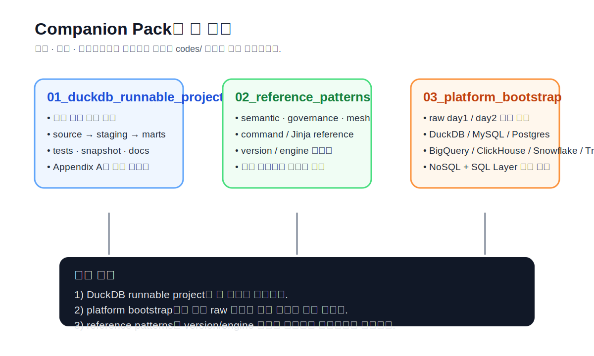
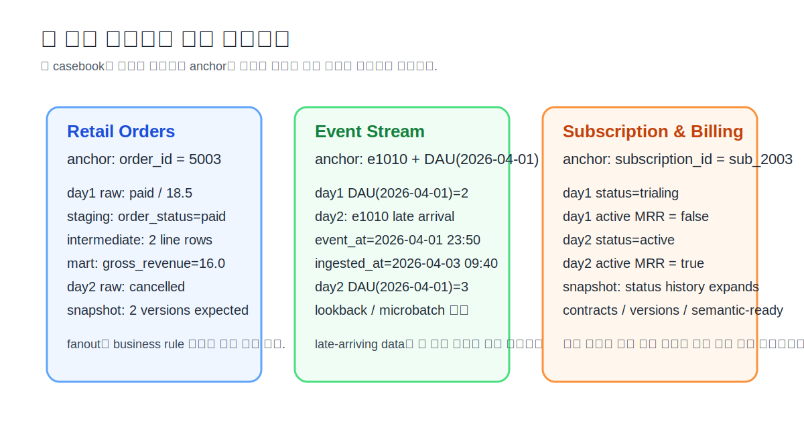
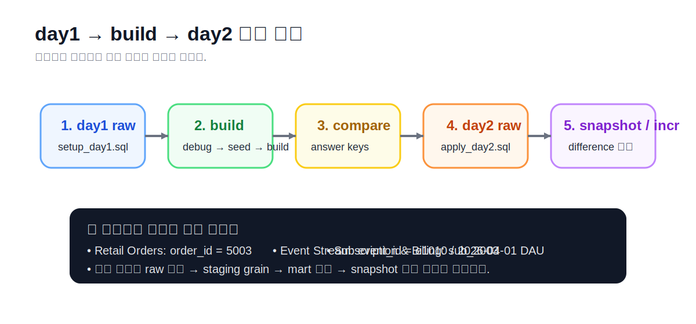

# APPENDIX A · Companion Pack, Example Data, Bootstrap, Answer Keys

> 이 부록은 `codes/` 아래 companion pack을 **그냥 파일 묶음이 아니라 실습 교재처럼 읽기 위한 안내서**다.  
> 책 본문이 개념과 설계 원리를 설명한다면, 이 부록은 **어디서 day1/day2를 넣고, 무엇을 먼저 실행하고, 어떤 파일과 값으로 정답을 비교할지**를 한곳에 모아 둔다.
>
> 이 부록의 기본 원칙은 단순하다.  
> **day1 raw 상태를 먼저 만들고 → dbt build로 첫 결과를 만들고 → day2 변경 상태를 다시 주입하고 → snapshot / incremental / semantic surface가 어떻게 달라지는지 비교한다.**
>
> 이 문서는 `Platform Playbook`을 대신하지 않는다.  
> 본문 챕터가 공통 개념과 플랫폼별 차이를 설명하고, 이 부록은 **companion pack을 실제로 따라 하는 순서**를 설명한다.



## A.1. 이 부록을 왜 먼저 보는가

### A.1.1. companion pack은 책의 두 번째 본문이다

처음부터 `codes/`를 열어 보면 폴더가 많아 보여서 오히려 막막할 수 있다.  
그래서 이 부록은 companion pack을 세 개의 표면으로 나눠 읽게 만든다.

1. **실행 표면**
   - `codes/01_duckdb_runnable_project/`
   - 가장 빠르게 end-to-end를 완주하는 경로다.
   - CLI, profile, source, staging, marts, tests, snapshot, docs를 **실제로 돌리는 감각**을 먼저 익힌다.

2. **참조 표면**
   - `codes/02_reference_patterns/`
   - governance, semantic, mesh, functions/UDF, command/Jinja reference 같은 **확장 예시와 레퍼런스**가 모여 있다.
   - 이 폴더는 “바로 복붙해서 운영에 넣는 경로”가 아니라, **현재 쓰는 dbt 버전과 엔진에 맞게 다시 해석하는 참고 묶음**으로 보는 편이 맞다.

3. **부트스트랩 표면**
   - `codes/03_platform_bootstrap/`
   - 같은 예제 데이터를 각 데이터플랫폼에 다시 넣어 보고 싶을 때 여는 폴더다.
   - `setup_day1.sql`과 `apply_day2.sql`을 중심으로 **raw 상태 자체를 다시 만드는 용도**다.

핵심은 이 셋을 한꺼번에 보지 않는 것이다.  
처음에는 **실행 표면**만 따라 하고, 그다음 **부트스트랩 표면**으로 플랫폼을 바꾸고,  
필요할 때만 **참조 표면**으로 올라가는 것이 가장 덜 흔들린다.

### A.1.2. repo 안에서 어디로 이동해야 하는가

```text
repo-root/
├─ chapters/
│  ├─ ch09_casebook-i-retail-orders.md
│  ├─ ch10_casebook-ii-event-stream.md
│  ├─ ch11_casebook-iii-subscription-billing.md
│  ├─ ch12~ch20_platform-playbook-*.md
│  └─ app_a_companion-pack-example-data-bootstrap-answer-keys.md
└─ codes/
   ├─ 01_duckdb_runnable_project/
   ├─ 02_reference_patterns/
   ├─ 03_platform_bootstrap/
   └─ 04_chapter_snippets/
```

이 부록을 읽을 때는 항상 다음 네 군데를 함께 펼쳐 두면 좋다.

1. 현재 읽고 있는 **casebook chapter**
2. 해당 casebook의 **platform playbook**
3. `codes/01_duckdb_runnable_project/`
4. 필요한 경우 `codes/03_platform_bootstrap/`

### A.1.3. 처음 따라 할 때 권장 순서

1. `chapters/ch09_casebook-i-retail-orders.md`
2. `codes/01_duckdb_runnable_project/README.md`
3. `chapters/ch12_platform-playbook-duckdb.md`
4. 이 부록의 **A.3, A.4, A.5**
5. 그 다음에 Event Stream, Subscription & Billing 순서로 확장

처음부터 여러 플랫폼을 동시에 올리거나, 세 예제를 한 번에 build하려 들면  
오히려 어느 계층에서 막혔는지 구분이 어려워진다.

## A.2. 세 예제 데이터는 무엇을 보여 주는가

이 책의 세 예제는 단순히 분야를 바꿔 놓은 샘플이 아니다.  
서로 다른 데이터 성격을 일부러 대비시킨 것이다.

- **Retail Orders**: 명확한 비즈니스 키와 fact/dim, fanout, snapshot, contract 입문
- **Event Stream**: append-only, late-arriving data, microbatch, semantic-ready 집계
- **Subscription & Billing**: 상태 변화, MRR 정의, snapshot, versions, governed API surface

### A.2.1. Retail Orders

Retail Orders는 세 예제 중에서 가장 먼저 따라 하기 좋다.  
주문 도메인은 비교적 익숙하고, `customers / products / order_items / orders` 같은 raw 테이블도 이해하기 쉽다.

이 예제의 핵심은 다음 두 가지다.

1. **grain을 지키는 join**
   - `order_items`는 line grain이고 `orders`는 order grain이다.
   - 두 테이블을 join한 뒤 바로 집계하면 fanout이 생길 수 있다.
   - 그래서 `int_order_lines`로 line grain을 고정한 후 `fct_orders`에서 다시 주문 grain으로 모은다.

2. **day2에서의 상태 변화**
   - `order_id = 5003`이 day1에는 `paid`, day2에는 `cancelled`로 바뀐다.
   - 이 변화는 snapshot, marts 재계산, business rule 문서화의 차이를 한 번에 보여 준다.

### A.2.2. Event Stream

Event Stream은 append-only 도메인이다.  
raw에서는 대개 `users`와 `events`가 있고, 질문의 grain이 자주 달라진다.

- 이벤트 자체를 보고 싶을 때는 **event grain**
- 사용자 행동 흐름을 보고 싶을 때는 **session grain**
- DAU / WAU를 보고 싶을 때는 **daily grain**

이 예제의 핵심은 다음 세 가지다.

1. `event_at`와 `event_ingested_at`를 분리해서 본다.
2. day2에 **late-arriving event**가 들어오므로, 과거 날짜가 다시 바뀔 수 있다.
3. 따라서 incremental 설계는 단순 append보다 **lookback window**를 함께 생각해야 한다.

### A.2.3. Subscription & Billing

Subscription & Billing은 상태 변화와 지표 정의 충돌이 핵심이다.  
같은 subscription이라도 시점에 따라 `trialing / active / canceled`로 바뀌고,  
finance와 product가 **“이 구독이 MRR에 포함되는가”**를 다르게 정의할 수 있다.

이 예제의 핵심은 다음과 같다.

1. `subscription_id`를 중심으로 **상태 이력**을 추적한다.
2. invoice와 current MRR을 혼동하지 않는다.
3. `contracts`와 `versions`를 통해 `fct_mrr`를 공용 surface처럼 다듬는다.

### A.2.4. 세 예제를 끝까지 추적하는 기준 레코드

이 부록에서는 세 예제를 다음 세 기준점으로 추적한다.

1. **Retail Orders**: `order_id = 5003`
2. **Event Stream**: `event_id = e1010`과 `2026-04-01`의 DAU
3. **Subscription & Billing**: `subscription_id = sub_2003`



기준 레코드를 정해 두는 이유는 단순하다.  
책 전체를 따라가면서도 “지금 내가 같은 데이터를 보고 있는가”를 빠르게 확인할 수 있기 때문이다.

## A.3. DBMS별 bootstrap은 어떤 순서로 해야 하는가

### A.3.1. 모든 플랫폼에 공통인 학습 리듬

플랫폼이 달라도 학습 리듬은 같다.

1. **day1 raw 상태 만들기**
2. `dbt debug`
3. `dbt seed`
4. `dbt build`
5. **정답표와 비교**
6. **day2 raw 상태 다시 주입**
7. `dbt snapshot` 또는 incremental 관련 모델 재실행
8. day1 / day2 차이 해석



이 루프를 먼저 몸에 넣어 두면, 플랫폼이 바뀌어도 “무엇을 먼저 해야 하는가”가 흔들리지 않는다.

### A.3.2. SQL 계열 플랫폼 quickstart

| 플랫폼 | 가장 빠른 시작점 | 먼저 열 파일 | 핵심 주의점 |
| --- | --- | --- | --- |
| DuckDB | 로컬 file DB | `../codes/01_duckdb_runnable_project/README.md` | 가장 단순하다. companion pack의 기본 기준 플랫폼이다. |
| MySQL | dev DB에 raw schema 생성 | `../codes/03_platform_bootstrap/retail/mysql/setup_day1.sql` | OLTP와 분석 변환을 섞지 않는 감각이 중요하다. |
| PostgreSQL | dev DB와 schema 권한 준비 | `../codes/03_platform_bootstrap/subscription/postgres/setup_day1.sql` | `search_path`, 권한, transaction hook 동작을 먼저 본다. |
| BigQuery | project / dataset / location 준비 | `../codes/03_platform_bootstrap/events/bigquery/setup_day1.sql` | partition / cluster / 비용 통제가 같이 따라온다. |
| ClickHouse | raw MergeTree 테이블 생성 | `../codes/03_platform_bootstrap/events/clickhouse/setup_day1.sql` | `ORDER BY`, `partition_by`, materialized view 주의가 크다. |
| Snowflake | role / warehouse / database / schema 준비 | `../codes/03_platform_bootstrap/subscription/snowflake/setup_day1.sql` | query tag, warehouse 분리, transient / secure surface를 함께 본다. |
| Trino | catalog + schema 준비 | `../codes/03_platform_bootstrap/retail/trino/setup_day1.sql` | catalog/database 개념과 backing storage를 먼저 이해해야 한다. |

### A.3.3. Databricks는 지금 어디서 시작하면 되는가

현재 repo에서는 Databricks를 위한 전용 raw bootstrap 폴더를 아직 크게 두지 않았다.  
대신 Databricks는 다음 경로를 기준으로 시작하는 것이 자연스럽다.

- `chapters/ch20_platform-playbook-databricks.md`
- `../codes/04_chapter_snippets/ch20/`

즉, Databricks는 지금 단계에서 `03_platform_bootstrap/`의 정적 SQL 경로보다  
**Chapter 20 snippets를 템플릿 삼아 Unity Catalog / dev-prod catalog / Delta refresh 전략**을 같이 보는 편이 낫다.

### A.3.4. NoSQL + SQL Layer는 별도 패턴으로 읽는다

NoSQL + SQL Layer는 SQL 계열 플랫폼과 같은 방식으로 읽지 않는다.  
핵심은 raw 문서/검색 인덱스를 직접 dbt에 붙이는 것이 아니라,  
**SQL layer를 사이에 두고 dbt는 그 SQL 계층에 연결한다**는 점이다.

대표 경로:

- `../codes/03_platform_bootstrap/nosql_sql_layer_mongodb_via_trino/`
- `chapters/ch19_platform-playbook-nosql-sql-layer.md`

실습 리듬도 다소 다르다.

1. JSONL 또는 bulk payload로 raw 문서를 적재
2. SQL layer catalog를 연다
3. `sources.yml`에서 SQL layer table로 source를 선언
4. staging에서 flatten / normalize / cast
5. mart로 넘긴다

### A.3.5. Trino 운영형 부속물은 어디에 있는가

업무형 Trino / Iceberg / Airflow 패턴은 일반 bootstrap과 별도 감각이 필요하다.  
이 repo에서는 다음 위치를 함께 보면 좋다.

- `chapters/ch18_platform-playbook-trino.md`
- `../codes/03_platform_bootstrap/trino/dbt_log_bootstrap.sql`
- `../codes/04_chapter_snippets/ch18/trino/`

여기서 특히 봐야 하는 것은 다음 네 가지다.

1. `profiles.yml`과 `sources.yml`
2. `generate_schema_name` override
3. `dbt_log` bootstrap과 `log_model_start` / `log_run_end`
4. `case01`~`case06` 운영 패턴

> 중요한 주의  
> `case01` 같은 “전부 지우고 다시 적재” 패턴은 **incremental의 기본형**이 아니라  
> 레거시 배치를 dbt 안으로 옮길 때의 운영 타협안으로 보는 것이 맞다.  
> Appendix A는 그것을 정답 패턴이 아니라 **패턴 사례집**으로 안내한다.

## A.4. 정답표와 비교는 어떻게 하는가

이 부록의 정답표는 “값 하나를 외우는 표”가 아니다.  
오히려 다음 질문에 답할 수 있게 만드는 용도다.

1. 지금 내가 **같은 raw 상태**를 만들었는가?
2. 내가 만든 staging과 mart가 **같은 grain**을 유지하고 있는가?
3. day2 변경이 snapshot / incremental / semantic surface에 **어떻게 반영돼야 하는가?**

### A.4.1. Retail Orders · `order_id = 5003`

Retail Orders는 `5003`이 가장 좋은 기준점이다.

- day1: `paid`
- day2: `cancelled`

빠르게 확인해야 할 값은 다음이다.

| 층/시점 | 확인 포인트 | 기대 해석 |
| --- | --- | --- |
| raw day1 | `status=paid`, `total_amount=18.5` | 원천 상태 |
| stg day1 | `order_status=paid` | rename + cast + 표준화 |
| int day1 | line 2행 | line grain 유지 |
| mart day1 | `gross_revenue=16.0` | 주문 grain 1행 재집계 |
| raw day2 | `status=cancelled` | late change 반영 |
| snapshot | paid + cancelled 2버전 | 이력 구조 |

### A.4.2. Event Stream · `event_id = e1010`와 `2026-04-01` DAU

Event Stream은 한 행의 값보다 **날짜별 집계가 왜 바뀌는가**를 보는 편이 더 중요하다.  
그래서 기준점은 `e1010`과 `2026-04-01` DAU다.

- day1에는 `2026-04-01` DAU가 2다.
- day2에는 `e1010`이 늦게 들어오면서 `2026-04-01` DAU가 3이 된다.

즉, 이 예제는 “과거 날짜가 뒤늦게 바뀔 수 있다”는 것을 보여 준다.

### A.4.3. Subscription & Billing · `sub_2003`

Subscription & Billing은 `sub_2003`이 가장 좋은 기준점이다.

- day1: `trialing`
- day2: `active`

여기서 중요한 것은 단순 상태 변화만이 아니다.

- `committed MRR`에 포함되는가?
- `active MRR`에 포함되는가?
- snapshot에서 상태 이력은 어떻게 남는가?
- contract/semantic surface에선 어떤 컬럼이 공개 API가 되는가?

### A.4.4. 빠른 정답 비교용 파일

정답 비교를 위해 가장 먼저 열어야 하는 파일은 다음 셋이다.

- [`../codes/04_chapter_snippets/app_a/expected_anchor_keys.csv`](../codes/04_chapter_snippets/app_a/expected_anchor_keys.csv)
- [`../codes/04_chapter_snippets/app_a/reference_check_queries.sql`](../codes/04_chapter_snippets/app_a/reference_check_queries.sql)
- `reference_outputs/` 또는 `workbook/` 아래 각 예제별 expected CSV

추가로 Chapter 09~11에서 만든 예제별 expected 파일도 함께 본다.

- `../codes/04_chapter_snippets/ch09/`
- `../codes/04_chapter_snippets/ch10/`
- `../codes/04_chapter_snippets/ch11/`

## A.5. 처음 따라 하는 사람을 위한 runbook

### A.5.1. 30분 quickstart

처음에는 한 예제만 잡는 편이 좋다.  
가장 안전한 경로는 DuckDB + Retail Orders다.

```bash
# 0) 가상환경
python -m venv .venv
source .venv/bin/activate

# 1) 설치
python -m pip install --upgrade pip wheel setuptools
python -m pip install dbt-core dbt-duckdb

# 2) profile 확인
dbt debug

# 3) seed / build
dbt seed
dbt build --select retail+

# 4) 정답 비교
# order_id = 5003 확인
```

더 자세한 명령 모음은  
[`../codes/04_chapter_snippets/app_a/quickstart_companion.sh`](../codes/04_chapter_snippets/app_a/quickstart_companion.sh)  
에 정리해 두었다.

### A.5.2. 플랫폼을 바꿀 때의 기준

다음과 같이 생각하면 된다.

- **개념과 완주감**이 먼저면 DuckDB
- **OLTP 친화 환경에서의 제약**을 보고 싶으면 MySQL / PostgreSQL
- **비용 / partition / warehouse-native refresh**를 보고 싶으면 BigQuery / Snowflake
- **물리 설계가 모델링과 함께 움직이는 모습**을 보고 싶으면 ClickHouse
- **catalog + schema + backing storage + orchestration** 감각을 보고 싶으면 Trino
- **문서형 원천을 SQL layer 뒤로 넣는 패턴**을 보고 싶으면 NoSQL + SQL Layer
- **Unity Catalog / Delta / Python / streaming table surface**를 보고 싶으면 Databricks

### A.5.3. 값이 안 맞을 때 먼저 볼 것

| 증상 | 가장 먼저 볼 곳 | 흔한 원인 | 빠른 복구 |
| --- | --- | --- | --- |
| `Profile not found` | `~/.dbt/profiles.yml` | profile 이름 불일치 | project의 `profile:` 값과 맞춘다 |
| `source not found` | `models/sources.yml`, `dbt parse` | source/table 이름 오타 | YAML 이름과 `source()` 인자를 동일하게 맞춘다 |
| 매출이 두 배 | `int_order_lines`와 `fct_orders` row count | grain 누락 / fanout | intermediate에서 line grain을 먼저 고정한다 |
| snapshot 행이 늘지 않음 | snapshot config + day2 raw 상태 | `updated_at` 또는 `check_cols` 미설정 | day2 변경이 실제 raw에 반영됐는지부터 본다 |
| Trino `Connection refused` | Trino 서비스 상태 | coordinator 미기동 / 권한 | Trino launcher / service 상태를 먼저 본다 |
| `dbt_internal_source.id` | compiled SQL, source select | merge `unique_key` 컬럼이 source에 없음 | source 쿼리와 config의 key를 맞춘다 |
| `dbt_internal_dest.id` | target relation DDL | merge `unique_key` 컬럼이 target에 없음 | target relation과 key 정의를 맞춘다 |

`dbt_internal_source.id`, `dbt_internal_dest.id` 같은 Trino merge 오류와  
`Connection refused localhost:8080` 오류는 실제 운영 메모에서 자주 나오는 사례이기도 하다.  
그래서 이 부록에서는 그것을 “특수한 에러”가 아니라 **대표적인 bootstrap / 운영 오류**로 분류한다.

## A.6. companion pack을 쓸 때 자주 하는 실수

### A.6.1. bootstrap SQL만 보고 모델 계층을 건너뛰는 것

`setup_day1.sql`이 돌아갔다고 해서 casebook를 이해한 것은 아니다.  
부트스트랩은 raw 상태를 만드는 단계일 뿐이고,  
실제 학습의 핵심은 `source → staging → intermediate → marts → tests → snapshot → docs` 흐름이다.

### A.6.2. day2를 생략하는 것

day1만 보면 책의 절반만 본 셈이다.

- snapshot은 왜 필요한가
- incremental은 왜 단순 append가 아닌가
- freshness와 운영 runbook은 왜 필요한가

이 질문들은 대부분 **day2를 넣어야만** 살아난다.

### A.6.3. 플랫폼 플레이북보다 먼저 플랫폼을 늘리는 것

한 번에 DuckDB, Postgres, BigQuery를 다 띄우는 건 멋있어 보이지만,  
실제로는 어느 platform surface에서 막혔는지 분간하기 어렵게 만든다.  
처음엔 **한 플랫폼 + 한 예제**로 끝까지 완주하는 편이 훨씬 빠르다.

### A.6.4. Trino 운영 패턴을 일반 패턴처럼 받아들이는 것

Trino/Iceberg/Airflow 패턴은 운영형 예시다.  
`dbt_log`, `generate_schema_name`, `run_query` 기반 분기, `case01~06`은 아주 유용하지만,  
그 자체가 모든 플랫폼의 기본형은 아니다.

특히 다음은 꼭 구분해야 한다.

- `case01`은 “incremental 대표 패턴”이 아니라 **truncate-insert형 운영 타협안**
- `run_query`는 compile/docs generate 때도 live connection 아래선 실행될 수 있으므로 **side effect 주의**
- `generate_schema_name` override는 relation naming 전체를 바꾸는 **전역 매크로**

편의상 한 번 동작했다고 해서, 모든 플랫폼에서 그대로 옮길 수 있다고 생각하면 안 된다.

## A.7. 어디서 무엇을 찾을지 빠르게 보는 인덱스

| 하고 싶은 일 | 먼저 열 파일 |
| --- | --- |
| DuckDB로 가장 빠르게 한 번 돌려 보기 | `../codes/01_duckdb_runnable_project/README.md` |
| 세 예제의 day1/day2 raw 상태 만들기 | `../codes/03_platform_bootstrap/` |
| Retail Orders 정답 비교 | `../codes/04_chapter_snippets/ch09/` |
| Event Stream 정답 비교 | `../codes/04_chapter_snippets/ch10/` |
| Subscription 정답 비교 | `../codes/04_chapter_snippets/ch11/` |
| Trino 운영형 bootstrap | `../codes/03_platform_bootstrap/trino/dbt_log_bootstrap.sql` |
| Trino logging / cases / hooks | `../codes/04_chapter_snippets/ch18/trino/` |
| 공통 빠른 명령 모음 | `../codes/04_chapter_snippets/app_a/quickstart_companion.sh` |
| 세 기준 레코드 점검 SQL | `../codes/04_chapter_snippets/app_a/reference_check_queries.sql` |
| 기준 정답표 CSV | `../codes/04_chapter_snippets/app_a/expected_anchor_keys.csv` |

## A.8. 마지막 조언

companion pack은 “파일이 많아서 어려운 묶음”이 아니다.  
오히려 **어느 순서로 열어야 하는지**만 분명하면, 책을 따라가기에 가장 쉬운 실습 경로가 된다.

이 부록의 핵심 규칙만 기억하면 된다.

1. **한 번에 하나의 예제, 하나의 플랫폼부터 시작한다.**
2. **day1 → build → day2 → snapshot/incremental 비교 루프를 지킨다.**
3. **기준 레코드(5003, e1010/DAU, sub_2003)를 끝까지 추적한다.**
4. **platform playbook은 platform 차이를 이해할 때 열고, appendix는 companion pack을 실제로 따라 할 때 연다.**
5. **운영형 Trino 패턴은 공통 기본형이 아니라 사례집으로 읽는다.**

이 부록을 잘 쓰면 `codes/` 디렉터리가 “부속 파일 창고”가 아니라  
책 전체를 실제로 재현하게 해 주는 **두 번째 교재**가 된다.
