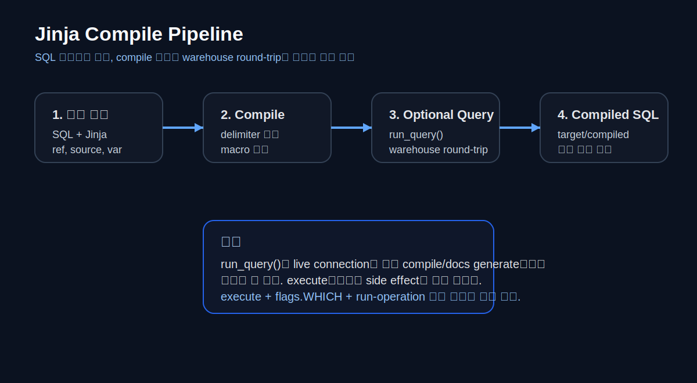
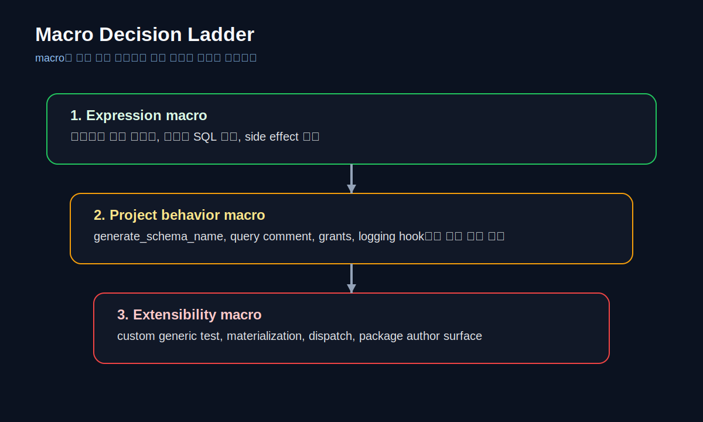
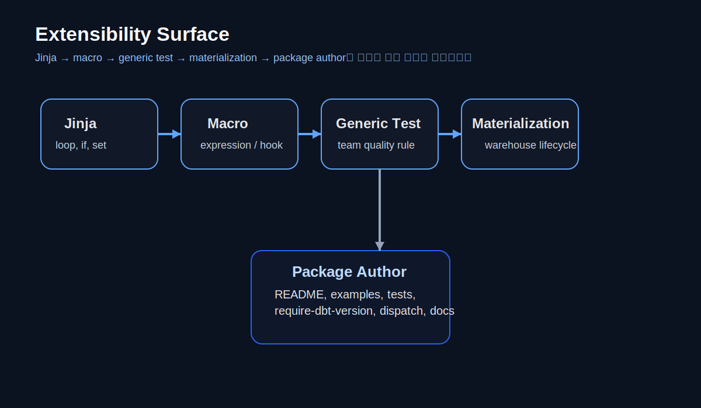

# APPENDIX C · Jinja, Macro, Extensibility Reference

> Jinja는 SQL을 대체하는 언어가 아니다.
> 좋은 dbt 프로젝트에서 SQL은 여전히 중심이고, Jinja와 macro는 반복을 줄이고, 운영 규칙을 코드화하고, 플랫폼 차이를 흡수하는 보조 계층이다.
> 이 appendix는 “얼마나 화려하게 쓸 수 있는가”보다 어디까지 쓰면 읽기 쉽고, 운영 가능하고, 확장 가능한가를 기준으로 Jinja·macro·확장 포인트를 정리한다.



## C.1. 왜 Jinja와 macro를 따로 정리해야 하는가

dbt를 처음 배울 때는 `ref()`, `source()`, `config()` 정도만 익혀도 충분하다.
하지만 프로젝트가 커지면 다음과 같은 이유로 Jinja와 macro를 따로 배워야 한다.

1. 반복 제거
   같은 `CASE WHEN`, 같은 컬럼 목록, 같은 스키마 규칙이 여러 모델에 반복된다.
2. 운영 규칙의 코드화
   `target`, `var`, `env_var`, `flags`, `invocation_id`를 이용해 개발/운영/배치 실행 방식을 통일할 수 있다.
3. 플랫폼 차이 흡수
   adapter.dispatch, cross-database macro, naming override로 플랫폼 차이를 감쌀 수 있다.
4. 확장 개발자 관점
   custom generic test, custom materialization, package author 관점은 결국 macro 이해를 요구한다.

하지만 Jinja를 잘못 쓰면 오히려 프로젝트가 더 나빠진다.

- SQL보다 템플릿이 더 많이 보인다.
- compiled SQL을 열어보지 않으면 모델을 이해할 수 없다.
- `run_query()`가 compile이나 docs generate에서도 live connection을 타면서 예기치 않은 side effect를 낸다.
- 플랫폼별 분기가 모델 본문에 뒤섞여 리뷰가 어려워진다.

이 appendix의 목표는 Jinja를 “많이 쓰는 법”이 아니라 “안전하게 쓰는 법”을 정리하는 데 있다.

---

## C.2. Jinja의 기본 정신: compile 단계와 execute 단계를 구분하라

### C.2.1. dbt는 SQL 파일을 그대로 실행하지 않는다

dbt는 모델을 읽을 때 바로 warehouse에 SQL을 던지지 않는다.
먼저 Jinja를 평가하고, macro를 펼치고, selector와 config를 적용해서 compiled SQL을 만든다.
그 뒤에야 materialization 전략에 따라 warehouse에 relation을 만든다.

따라서 Jinja를 쓸 때는 항상 두 질문을 먼저 던져야 한다.

1. 이 코드는 compile 시점에 평가되는가?
2. 이 코드는 warehouse round-trip을 일으키는가?

이 질문이 중요한 이유는 `run_query()` 때문이다.
`run_query()`는 “실행 중”에만 동작하는 것처럼 보이지만, live connection이 있는 compile workflow에서도 실행될 수 있다.
따라서 Jinja에서 side effect가 있는 SQL을 호출하는 순간, 단순 compile이나 docs generate 중에도 예기치 않은 동작이 날 수 있다.

### C.2.2. 세 가지 delimiter

| 형태 | 역할 | 대표 예시 |
| --- | --- | --- |
| `{{ ... }}` | 값을 출력 | `{{ ref('fct_orders') }}` |
| `` | 제어 흐름 / 선언 | `` |
| `{# ... #}` | Jinja 주석 | `{# compile 시 제거됨 #}` |

### C.2.3. 자주 쓰는 기본 문법 조각

```jinja


select
    order_id,
    
    sum(case when payment_method = '{{ method }}' then amount end) as {{ method }}_amount,
    
    sum(amount) as total_amount
from {{ ref('stg_payments') }}
group by 1
```

이 예시는 Jinja의 세 가지 핵심 사용처를 한 번에 보여 준다.

- `set`: 미리 리스트나 문자열을 선언한다.
- `for`: 반복 SQL을 생성한다.
- `{{ }}`: ref, 값, 식 결과를 출력한다.

하지만 이런 패턴은 반복 컬럼 생성에만 쓰는 것이 좋다.
모델의 핵심 business logic 전체를 loop와 if에 묻어버리면 읽기 어려워진다.

### C.2.4. whitespace control

```jinja

{{ col }}, 

```

``는 공백을 줄여 준다.
다만 공백을 너무 aggressively 줄이면 compiled SQL이 한 줄에 몰려 읽기 어려워진다.
“DRY”보다 “읽기 쉬운 compiled SQL”이 우선이라는 원칙을 지켜야 한다.

### C.2.5. filter와 작은 도구들

| 패턴 | 의미 | 예시 |
| --- | --- | --- |
| `| lower` | 소문자화 | `{{ target.name | lower }}` |
| `| upper` | 대문자화 | `{{ var('country') | upper }}` |
| `| default(...)` | 기본값 지정 | `{{ var('lookback_days') | default(3) }}` |
| `| join(', ')` | 리스트 결합 | `{{ cols | join(', ') }}` |
| `is none` | null 분기 | `` |
| `loop.last` | 마지막 요소 확인 | `, ` |

---

## C.3. dbt에서 자주 쓰는 helper와 context 변수

### C.3.1. 가장 많이 보는 helper

| helper / variable | 언제 쓰는가 | 짧은 설명 |
| --- | --- | --- |
| `ref()` | 프로젝트 내부 모델 참조 | dependency graph와 build 순서를 만든다 |
| `source()` | 프로젝트 외부 raw 입력 참조 | lineage, freshness, source test의 시작점 |
| `var()` | 실행 시 전달된 변수 사용 | Airflow, batch date, feature flag |
| `env_var()` | 비밀값·환경값 분리 | password, token, path |
| `target` | dev/prod 분기 | target name, schema, database |
| `this` | 현재 relation 자기 자신 | incremental, post-hook, delete/merge 대상 |
| `log()` / `print()` | 디버깅 메시지 출력 | compile/execute 맥락 점검 |
| `flags` | 현재 명령 종류 판단 | compile/docs/build/run 분기 |
| `invocation_id` | 현재 dbt 실행의 UUID | logging, audit key |
| `results` | `on-run-end` 결과 목록 | run-end hook에서 상태 업데이트 |
| `adapter` | adapter wrapper | cross-database 동작, relation 확인 |
| `dispatch` | multi-dispatch | 플랫폼별 macro override |
| `exceptions` | 경고/에러 제어 | `raise_compiler_error`, `warn` |

### C.3.2. 어떤 helper를 언제 써야 하는가

#### `ref()`와 `source()`
이 둘은 단순 문자열 치환이 아니다.
`ref()`는 내부 dependency를, `source()`는 외부 contract와 lineage를 만든다.
직접 스키마/테이블명을 조합하는 문자열 Jinja는 가능하면 피해야 한다.

#### `var()`와 `env_var()`
- `var()`는 실행 파라미터다.
- `env_var()`는 환경/비밀 설정이다.

날짜 범위, 강제 full refresh 같은 값은 `var()`로,
비밀번호, 토큰, endpoint는 `env_var()`로 분리하는 것이 좋다.

#### `target`
`target.name == 'prod'` 분기는 가볍게는 유용하지만, 너무 많아지면 모델이 환경 분기 덩어리가 된다.
환경 차이는 모델 본문보다 `dbt_project.yml`, profile, macro layer로 흡수하는 편이 낫다.

---

## C.4. `run_query()`와 warehouse round-trip을 안전하게 다루는 법

### C.4.1. `run_query()`는 언제 필요한가

`run_query()`는 다음처럼 warehouse 결과를 받아 다음 SQL을 생성해야 할 때만 꺼내는 것이 좋다.

1. 동적 pivot 컬럼 목록 만들기
2. 정보 스키마를 읽어 union 순서 맞추기
3. 분기용 제어 테이블 읽기
4. `on-run-end`에서 결과 상태를 audit table에 반영하기

반대로, 단순 모델 로직은 `run_query()` 없이도 대부분 해결된다.
`source()`, `ref()`, `is_incremental()`, 일반 SQL만으로 되는 문제에 `run_query()`를 쓰면 compile cost와 이해 비용만 늘어난다.

### C.4.2. 안전한 기본 패턴

```jinja

    select distinct country_code
    from {{ source('raw_retail', 'orders') }}
    where country_code is not null
    order by 1



    
    

    

```

여기서 핵심은 두 가지다.

1. `execute`만으로는 충분하지 않다.
   compile/docs generate에서도 live connection이 있으면 `execute`는 `True`일 수 있다.
2. 그래서 side effect가 있을 수 있는 흐름은 `flags.WHICH`까지 같이 보아야 한다.

### C.4.3. agate result 읽기

`run_query()` 결과는 agate table로 들어온다.
가장 자주 쓰는 패턴은 다음이다.

```jinja

    
    

    

```

주의할 점:

- `results.columns[0].values()`처럼 컬럼별 values를 뽑을 수 있다.
- row가 없을 수 있으니 default 값을 준비해 둔다.
- compile 단계 fallback이 꼭 필요하다.

### C.4.4. side effect가 있는 SQL은 더 조심하라

`run_query()` 안에 `insert`, `update`, `delete`, `alter`, `grant` 같은 side effect SQL을 넣으면 compile/docs generate에서도 실행될 수 있다.
이런 성격의 SQL은 가능하면:

1. hook로 옮기거나
2. `dbt run-operation`으로 분리하거나
3. `flags.WHICH` + execute + 명시적 var 조건을 함께 두는 것이 좋다.

---

## C.5. macro는 어떻게 설계해야 하는가



macro는 세 가지 층으로 생각하면 좋다.

1. expression macro
   컬럼 표현식, 반복되는 SQL 조각
2. project behavior macro
   naming, grants, comments, hooks 등 프로젝트 동작 자체를 바꾸는 것
3. extensibility macro
   custom generic tests, custom materializations, package dispatch

### C.5.1. 가장 안전한 시작점: expression macro

```jinja

    round({{ column_name }} / 100.0, {{ scale }})

```

```sql
select
    order_id,
    {{ cents_to_currency('gross_revenue_cents') }} as gross_revenue
from {{ ref('fct_orders_raw') }}
```

좋은 expression macro의 기준:

- input과 output이 단순하다
- compiled SQL이 읽기 쉽다
- 플랫폼-specific SQL이 숨어 있지 않다
- side effect가 없다

### C.5.2. 프로젝트 전역 동작을 바꾸는 macro: `generate_schema_name`

업무 메모에서 온 `generate_schema_name` override는 Appendix C에 넣기 좋은 대표 사례다.
이건 모델 안에서 직접 호출하는 macro가 아니라, dbt가 relation 이름을 정할 때 내부적으로 사용하는 hook point다.

```jinja

    
        {{ target.schema }}
    
        {{ custom_schema_name | trim }}
    

```

이 패턴의 장점:

- `target.schema + '_' + custom_schema_name` 규칙 대신 custom schema를 그대로 쓸 수 있다
- `sample_db_sample_db` 같은 중복 스키마 이름을 피할 수 있다

이 패턴의 위험:

- 프로젝트 전체 relation naming 규칙을 바꾼다
- dev/prod 분리 전략과 충돌할 수 있다
- 팀 공통 규칙 없이 넣으면 혼란을 만든다

따라서 이 macro는 “편의 기능”이 아니라 프로젝트 전역 정책으로 다뤄야 한다.

### C.5.3. 운영형 macro: logging hook용 macro

업무 메모의 `log_model_start` / `log_run_end`는 아주 좋은 실무 예시지만, 교재에서는 일반화해서 보여 주는 편이 낫다.
catalog/schema/timezone/table명을 하드코딩하지 않고 var와 target을 활용하는 식으로 바꾸면 플랫폼 이동성이 좋아진다.

```jinja

    
    
    

    
        merge into {{ audit_relation }} as target
        using (
            select
                '{{ run_key }}' as run_key,
                '{{ this.name }}' as model_name
        ) as source
        on target.invocation_id = source.run_key
       and target.model_name = source.model_name
        when matched then update set
            status = 'RUNNING',
            start_dt = current_timestamp,
            end_dt = null,
            error_message = null,
            run_info = '{{ run_info }}'
        when not matched then insert (
            invocation_id, model_name, status, start_dt, run_info
        ) values (
            '{{ run_key }}', '{{ this.name }}', 'RUNNING', current_timestamp, '{{ run_info }}'
        )
    

    
        
    

```

운영형 macro의 핵심 원칙:

- 직접 호출 경로와 hook 호출 경로를 분리한다
- 하드코딩된 database/schema를 줄인다
- compile/docs generate에서 side effect가 나지 않도록 guard를 둔다
- `on-run-end`는 `results` context를 이해하고 써야 한다

### C.5.4. 언제 macro로 빼야 하는가

다음 질문 중 두 개 이상에 “예”가 나오면 macro 후보로 본다.

1. 같은 SQL 조각이 세 번 이상 반복되는가?
2. 바뀔 때 항상 함께 바뀌어야 하는가?
3. 플랫폼마다 문법 차이를 감싸야 하는가?
4. 팀 규칙을 코드화해야 하는가?

반대로 다음이면 macro로 빼지 않는 편이 좋다.

- 한 번만 쓰는 복잡한 business logic
- 모델 본문보다 macro 쪽이 더 길어지는 로직
- SQL이 보이지 않게 되는 giant macro wrapper

---

## C.6. custom generic tests: 가장 좋은 첫 확장 포인트

### C.6.1. 왜 generic test가 좋은 출발점인가

custom materialization이나 adapter dispatch는 확실히 고급 기능이다.
반면 custom generic test는 팀 규칙을 재사용 가능한 품질 규칙으로 바꾸는 가장 쉬운 확장 포인트다.

예를 들면 이런 규칙을 생각해 볼 수 있다.

- 필수 컬럼은 비어 있으면 안 된다
- 국가 코드는 특정 목록에 포함돼야 한다
- 주문 상태가 `placed/shipped/delivered/cancelled` 중 하나여야 한다
- 문서형 원천의 required field set이 항상 존재해야 한다

### C.6.2. 기본 구조

```jinja

    with base as (
        select {{ column_name }} as field_name
        from {{ model }}
    )
    select *
    from base
    where field_name not in (
        
        '{{ value }}', 
        
    )

```

이 테스트는 `tests/generic/` 또는 `macros/` 아래에 둘 수 있다.

### C.6.3. YAML에서 호출하기

```yaml
version: 2

models:
  - name: stg_subscription_docs
    columns:
      - name: field_name
        data_tests:
          - required_fields:
              arguments:
                required_values: ['subscription_id', 'account_id', 'status']
```

여기서 중요한 점은 test input을 `arguments:` 아래에 두는 현재 스타일을 따르는 것이다.
이렇게 해 두면 최신 deprecation guidance와도 더 잘 맞는다.

### C.6.4. 세 casebook에서 어떻게 쓰는가

- Retail Orders: 주문 상태, 국가 코드, 필수 raw 컬럼 체크
- Event Stream: 필수 event field set, event_time null 방지
- Subscription & Billing: subscription/account/plan/status contract 확인

---

## C.7. custom materialization과 adapter.dispatch는 어디서부터 시작해야 하는가



### C.7.1. custom materialization은 “마지막 수단”에 가깝다

dbt는 built-in materialization으로도 꽤 많은 일을 할 수 있다.

- view
- table
- incremental
- ephemeral
- materialized view

대부분의 프로젝트는 여기서 충분하다.
custom materialization은 표준 materialization으로는 표현할 수 없는 warehouse-specific lifecycle이 있을 때만 고려하는 편이 좋다.

예:
- 특별한 staging-to-swap 전략
- 데이터베이스 특화 object type
- 조직 특화 publish / archive workflow

### C.7.2. 최소 skeleton

```jinja

    
    

    
        create or replace table {{ target_relation }} as (
            {{ compiled_sql }}
        )
    

    {{ return({'relations': [target_relation]}) }}

```

이 예시는 단순화된 skeleton이다.
중요한 점은 materialization도 결국 macro이며, relation 반환 규약과 statement block을 이해해야 한다는 것이다.

### C.7.3. `adapter.dispatch`는 package author 관점에서 중요하다

여러 플랫폼을 동시에 지원하는 package를 만들 때는 플랫폼-specific SQL을 본문에 if-else로 늘어놓는 대신 `dispatch`를 이용하는 편이 좋다.

예:
- `my_pkg__datediff`
- `snowflake__datediff`
- `bigquery__datediff`
- `default__datediff`

이렇게 하면 package 사용자는 같은 macro 이름을 호출하고, adapter별 구현이 자동으로 선택된다.

---

## C.8. package author 관점에서 보면

### C.8.1. package는 “공개 API”다

내 프로젝트 안에서만 쓰던 macro와 package로 배포하는 macro는 기준이 다르다.
package가 되는 순간 사용자에게는 공용 API surface가 된다.

### C.8.2. package author 최소 체크리스트

1. `require-dbt-version`을 명시한다
2. 지원 adapter를 README에 적는다
3. examples와 integration tests를 함께 둔다
4. seeds 기반 mock data와 expected output을 둔다
5. docs site나 예시 프로젝트를 제공한다
6. override / dispatch 구조를 명확히 문서화한다

### C.8.3. 추천 구조

```text
dbt-my-package/
├─ macros/
├─ models/
├─ tests/
├─ integration_tests/
├─ seeds/
├─ dbt_project.yml
├─ packages.yml
└─ README.md
```

### C.8.4. README에 꼭 있어야 할 것

- 무엇을 해결하는 package인지
- 지원 dbt version / adapter
- 설치 방법
- 기본 사용 예시
- configuration surface
- breaking change / deprecation 정책

---

## C.9. 세 casebook에 Jinja와 macro를 어떻게 적용할 것인가

### C.9.1. Retail Orders

이 트랙에서는 Jinja를 가장 보수적으로 쓴다.

- `ref()`, `source()`, `config()`
- 간단한 expression macro
- 상태값 accepted set
- contract / docs block

목표는 SQL 구조를 또렷하게 유지하면서 반복을 조금 줄이는 것이다.

### C.9.2. Event Stream

이 트랙에서는 운영형 Jinja가 늘어난다.

- lookback window를 `var()`로 제어
- dynamic pivot / dynamic field map
- freshness 기준을 var로 조정
- microbatch date range injection

목표는 시간축 데이터의 운영 압력을 Jinja로 흡수하는 것이다.

### C.9.3. Subscription & Billing

이 트랙에서는 governance와 published API surface가 더 중요해진다.

- contract + version
- query comment
- semantic-ready naming
- logging hooks
- publish table / secure surface 분리

목표는 재현 가능한 finance-friendly surface를 유지하는 것이다.

---

## C.10. Jinja와 macro에서 자주 생기는 실수

### C.10.1. giant macro anti-pattern

모델 전체를 macro 호출 하나로 감싸서 원래 SQL이 보이지 않게 만드는 패턴은 피한다.

```jinja
{{ giant_company_magic_macro('orders', 'payments', 'customers') }}
```

이런 코드는 처음에는 편해 보여도,
- compiled SQL을 열어봐야 이해할 수 있고
- review가 어려우며
- business logic와 framework logic가 뒤섞인다.

### C.10.2. `run_query()` 남용

제어 테이블 한 번 읽는 건 괜찮다.
하지만 모든 모델이 compile 시 warehouse round-trip을 일으키기 시작하면:

- docs generate가 느려지고
- compile이 예상보다 무거워지고
- 운영 사고가 날 가능성이 커진다

### C.10.3. 문자열로 relation 만들기

```jinja
select * from {{ target.schema }}.stg_orders
```

이런 패턴은 가능하면 피한다.
`ref()`와 `source()`를 놔두고 relation 문자열을 직접 조합하면 lineage와 rename safety를 잃는다.

### C.10.4. 환경 분기 과잉

```jinja

...

...

...
```

환경 분기가 모델 곳곳에 퍼지면, 나중에는 “이 모델의 business logic”이 아니라 “이 모델의 배포 조건문”만 보이게 된다.

---

## C.11. 실무 리뷰 체크리스트

Jinja나 macro가 들어간 모델을 리뷰할 때는 다음을 묻는 것이 좋다.

1. SQL이 여전히 읽히는가?
2. compiled SQL을 열었을 때 구조가 납득되는가?
3. `run_query()`가 꼭 필요한가?
4. compile/docs generate 중 side effect가 날 수 있는가?
5. 플랫폼 분기가 macro layer로 모여 있는가?
6. 이 로직은 generic test나 materialization보다 단순한 수단으로 해결 가능한가?
7. package 수준 public API라면 README / tests / examples가 충분한가?

---

## C.12. 직접 해보기

### C.12.1. Retail Orders
- `cents_to_currency` macro를 만들어 `gross_revenue_cents`를 변환해 본다.
- `required_fields` generic test로 `order_status` 필수값 검증을 추가한다.

### C.12.2. Event Stream
- `var('lookback_days', 3)`를 받아 incremental filter를 바꾸는 모델을 만든다.
- `run_query()`로 결제수단 목록을 읽어 동적 pivot을 구성해 본다.

### C.12.3. Subscription & Billing
- `generate_schema_name` override를 sandbox 환경에서만 시험해 본다.
- logging hook를 var 기반으로 일반화해 실행 로그를 남겨 본다.

---

## C.13. 마무리

Jinja와 macro는 dbt 프로젝트를 프로그래밍 가능한 SQL 환경으로 만들어 준다.
하지만 그 힘은 SQL을 감추는 데 쓰일 때가 아니라, 반복을 줄이고 운영 규칙을 명확하게 남기는 데 쓰일 때 가장 가치가 크다.

이 appendix를 읽을 때 기억해야 할 한 문장은 이것이다.

> SQL이 주인공이고, Jinja와 macro는 조연이다. 조연이 주인공을 가리면 프로젝트는 오히려 이해하기 어려워진다.

---

## C.14. 함께 보면 좋은 공식 문서

- Jinja and macros
  <https://docs.getdbt.com/docs/build/jinja-macros>
- Jinja functions and context variables
  <https://docs.getdbt.com/reference/dbt-jinja-functions-context-variables>
- run_query
  <https://docs.getdbt.com/reference/dbt-jinja-functions/run_query>
- Hooks and operations
  <https://docs.getdbt.com/docs/build/hooks-operations>
- Writing custom generic data tests
  <https://docs.getdbt.com/best-practices/writing-custom-generic-tests>
- Materializations
  <https://docs.getdbt.com/docs/build/materializations>
- Building packages
  <https://docs.getdbt.com/guides/building-packages>
