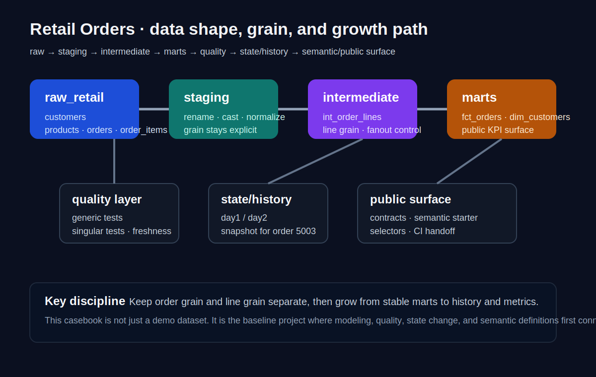
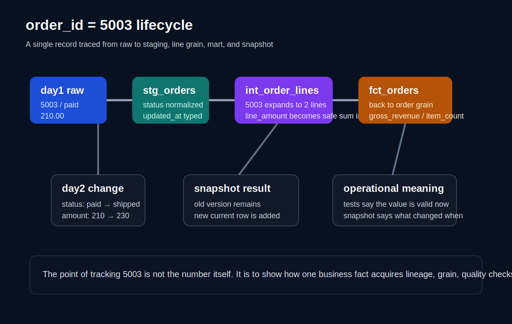

# CHAPTER 09 · Casebook I · Retail Orders

> 소매 주문 도메인을 처음부터 끝까지 다시 따라가며, 이 책 앞부분에서 배운 개념이 실제 프로젝트 안에서 어떻게 연결되는지 보여 준다.  
> 이 장의 목적은 단순히 `orders` 예제를 한 번 더 보는 것이 아니라, **raw 변화 → 모델 설계 → 테스트 → 상태 이력 → 의미 계층 → 운영 루틴**이 하나의 사례 안에서 어떻게 자라나는지 체감하게 만드는 데 있다.



## 9.1. 왜 Retail Orders를 첫 번째 Casebook으로 두는가

Retail Orders는 이 책의 세 가지 예제 가운데 가장 먼저 깊게 파고들 가치가 있는 사례다. 이유는 단순하다. 주문, 주문상세, 고객, 상품이라는 네 가지 raw 테이블만으로도 dbt의 핵심 문제를 거의 모두 설명할 수 있기 때문이다.

첫째, **grain 설계**가 명확하다. 주문 테이블은 order grain이고, 주문상세는 line grain이다. 이 둘의 차이를 모르면 `JOIN` 한 번에 매출이 두 배, 세 배로 부풀 수 있다.  
둘째, **상태 변화**가 자연스럽다. `placed → paid → shipped → delivered` 같은 주문 상태는 snapshot이나 freshness를 설명하기에 좋다.  
셋째, **KPI 정의**가 풍부하다. 주문 수, 매출, 고객 수, 객단가, 상품 카테고리별 성과 등은 mart와 semantic layer를 연결하기에 적합하다.  
넷째, **운영 실습**으로도 좋다. day1/day2를 분리해 raw 데이터를 바꾸면 테스트, snapshot, source freshness, slim CI 같은 운영 장치를 왜 써야 하는지 자연스럽게 보인다.

즉, Retail Orders는 "가장 단순한 예제"가 아니라 **dbt의 가장 많은 기능을 무리 없이 연결할 수 있는 기본 도메인**이다.

## 9.2. 이 장에서 먼저 잡아야 할 전반 개념

이 장은 예제 장이지만, 예제를 바로 던지기 전에 먼저 세 가지 큰 관점을 분명히 해 두어야 한다.

### 9.2.1. 이 장에서 가장 중요한 설계 질문은 SQL 문법이 아니라 grain이다

소매 주문 예제에서 가장 먼저 정해야 할 것은 "이 테이블 한 행이 무엇을 뜻하는가"다.

- `raw_retail.orders` 한 행: 주문 1건
- `raw_retail.order_items` 한 행: 주문 1건 안의 주문 라인 1건
- `stg_orders` 한 행: 주문 1건의 정리된 상태
- `int_order_lines` 한 행: 주문 라인 1건 + 상품 정보
- `fct_orders` 한 행: 주문 1건 기준 집계 결과
- `dim_customers` 한 행: 고객 1명

주문 도메인에서 가장 흔한 사고는 order grain과 line grain을 섞어 쓰는 것이다. 예를 들어 `orders.total_amount`를 `order_items`와 조인한 뒤 그대로 합산하면, 주문 라인 수만큼 금액이 중복된다. 그래서 이 장은 SQL을 보여 줄 때마다 항상 "현재 이 쿼리의 grain이 무엇인가"를 같이 물어보도록 구성한다.

### 9.2.2. day1/day2 시나리오를 왜 따로 두는가

많은 입문 교재는 정적인 초기 데이터만 보여 주고 끝난다. 하지만 실제 프로젝트는 항상 데이터가 바뀐다. 새 주문이 들어오고, 상태가 바뀌고, 금액이 수정되고, 늦게 도착한 데이터가 끼어든다.

그래서 Retail Orders는 두 단계로 나눈다.

1. **day1**: 초기 raw 상태를 만들고 기본 모델을 검증하는 단계  
2. **day2**: 주문 상태, 금액, 업데이트 시각을 바꿔서 snapshot·freshness·재실행 판단을 시험하는 단계

이렇게 해야 dbt를 "한 번 모델 만드는 도구"가 아니라 **변화하는 데이터를 안정적으로 설명하는 도구**로 볼 수 있다.

### 9.2.3. order_id = 5003을 끝까지 추적한다

이 장에서는 `order_id = 5003`을 공통 추적 대상으로 삼는다.

- day1 raw orders에서 어떤 값으로 시작하는지
- `stg_orders`에서 상태/금액/시각이 어떻게 정리되는지
- `int_order_lines`에서 몇 개의 line으로 풀리는지
- `fct_orders`에서 어떤 metric으로 집계되는지
- day2 적용 후 snapshot에서 어떤 이력 행이 생기는지

예제 전체를 관통하는 하나의 레코드를 정해 두면, 독자는 DAG를 "파일의 숲"이 아니라 **하나의 값이 이동하고 변형되는 흐름**으로 이해할 수 있다.

## 9.3. Retail Orders의 raw 도메인과 bootstrap

### 9.3.1. raw 테이블은 네 개면 충분하다

Retail Orders는 다음 네 raw 테이블로 시작한다.

| raw 테이블 | 기본 grain | 핵심 컬럼 | 이 장에서의 역할 |
| --- | --- | --- | --- |
| `customers` | customer 1명 | `customer_id`, `segment`, `country_code` | 고객 차원 기준 |
| `products` | product 1개 | `product_id`, `category_name` | 상품/카테고리 기준 |
| `orders` | order 1건 | `order_id`, `customer_id`, `status`, `total_amount`, `updated_at` | 주문 상태와 매출 기준 |
| `order_items` | order line 1건 | `order_id`, `product_id`, `quantity`, `unit_price` | line grain과 fanout 설명 |

이 네 테이블만 있어도 source → staging → intermediate → mart → tests → snapshot → semantic까지 충분히 확장할 수 있다.

### 9.3.2. day1 bootstrap은 "정적인 샘플"이 아니라 기준선이다

day1 bootstrap의 목적은 단순히 데이터를 넣는 것이 아니다. 앞으로 들어올 모든 논의의 기준선을 만드는 것이다.  
특히 아래 세 가지를 의도적으로 포함해야 한다.

- line item이 2개 이상인 주문
- 여러 customer segment를 가진 주문
- 추후 day2에서 상태와 금액을 바꿀 주문 (`5003`)

아래 스니펫은 DuckDB 기준의 최소 bootstrap 예시다. 전체 예시는 별도 코드 파일을 참고하면 된다.

```sql
-- 파일: ../codes/04_chapter_snippets/ch09/retail_bootstrap_day1_duckdb.sql
CREATE SCHEMA IF NOT EXISTS raw_retail;

DROP TABLE IF EXISTS raw_retail.orders;
CREATE TABLE raw_retail.orders (
    order_id INTEGER,
    customer_id INTEGER,
    order_date DATE,
    status VARCHAR,
    total_amount DECIMAL(18,2),
    updated_at TIMESTAMP
);

INSERT INTO raw_retail.orders
(order_id, customer_id, order_date, status, total_amount, updated_at)
VALUES
    (5001, 101, '2026-04-01', 'placed',    120.00, '2026-04-01 09:00:00'),
    (5002, 101, '2026-04-01', 'paid',       90.00, '2026-04-01 10:15:00'),
    (5003, 102, '2026-04-02', 'paid',      210.00, '2026-04-02 08:30:00'),
    (5004, 103, '2026-04-02', 'shipped',   140.00, '2026-04-02 12:00:00');
```

### 9.3.3. day2는 왜 상태와 금액을 동시에 바꾸는가

day2에서는 보통 아래 두 종류의 변화를 준다.

1. **상태 변화**  
   예: `5003`이 `paid`에서 `shipped`로 바뀐다.  
2. **값 변화**  
   예: `5003`의 `total_amount`가 보정되어 `210.00`에서 `230.00`으로 바뀐다.

이 두 가지가 함께 있어야 snapshot과 data quality의 차이를 동시에 느낄 수 있다.  
snapshot은 "무엇이 언제 바뀌었는가"를 저장하고, test는 "지금 이 값이 허용 가능한가"를 검증한다. 둘은 비슷해 보여도 역할이 다르다.

```sql
-- 파일: ../codes/04_chapter_snippets/ch09/retail_apply_day2.sql
UPDATE raw_retail.orders
SET status = 'shipped',
    total_amount = 230.00,
    updated_at = '2026-04-03 09:05:00'
WHERE order_id = 5003;
```

## 9.4. source와 staging: raw를 공식 입력으로 바꾸는 단계

### 9.4.1. source는 단순 경로 별칭이 아니라 프로젝트의 입력 계약이다

`source()`를 쓰면 스키마·테이블명을 감추는 정도를 넘어서, dbt에게 "이 프로젝트는 이 raw 데이터를 공식 입력으로 사용한다"라고 선언하게 된다.  
이 선언은 세 가지 효과를 만든다.

1. lineage에 raw 노드가 나타난다  
2. source-level test와 freshness를 붙일 수 있다  
3. 환경이 바뀌어도 YAML 한 곳에서 관리할 수 있다

Retail Orders에서는 `orders`와 `order_items`의 grain이 다르기 때문에, source 단계에서부터 이 차이를 설명으로 남겨 두는 것이 중요하다.

```yaml
# 파일: ../codes/04_chapter_snippets/ch09/retail_sources.yml
version: 2

sources:
  - name: raw_retail
    schema: raw_retail
    tables:
      - name: customers
      - name: products
      - name: orders
        loaded_at_field: updated_at
        freshness:
          warn_after: {count: 12, period: hour}
          error_after: {count: 24, period: hour}
      - name: order_items
```

### 9.4.2. stg_orders는 "정리"만 하고, KPI는 만들지 않는다

`stg_orders`의 목적은 주문을 분석 친화적인 행으로 정리하는 것이다.  
이 단계에서 해야 할 일은 아래와 같다.

- 날짜/시간 타입 통일
- 상태값 소문자화
- 금액 캐스팅
- 불필요한 컬럼 제거
- raw naming을 팀 표준으로 정리

반대로 여기서 **하지 말아야 할 일**은 매출 집계, 객단가 계산, segment-level KPI 산출 같은 최종 분석 로직이다. 그런 계산은 marts에서 해야 재사용성과 테스트 가능성이 좋아진다.

```sql
-- 파일: ../codes/04_chapter_snippets/ch09/stg_orders.sql
with source_data as (
    select *
    from {{ source('raw_retail', 'orders') }}
),
renamed as (
    select
        order_id,
        customer_id,
        cast(order_date as date) as order_date,
        lower(status) as order_status,
        cast(total_amount as numeric) as total_amount,
        cast(updated_at as timestamp) as updated_at
    from source_data
)
select *
from renamed
```

### 9.4.3. 5003을 먼저 staging에서 확인하자

이 장을 실습할 때는 전체 row count보다 먼저 `5003` 한 건을 보는 편이 좋다.  
day1에서는 대략 아래와 같은 값이 보여야 한다.

| 컬럼 | day1 기대값 |
| --- | --- |
| `order_id` | `5003` |
| `customer_id` | `102` |
| `order_status` | `paid` |
| `total_amount` | `210.00` |
| `updated_at` | `2026-04-02 08:30:00` |

day2를 적용한 뒤 다시 같은 row를 보면 `order_status`와 `total_amount`, `updated_at`이 바뀌어 있어야 한다. 이 차이가 이후 snapshot과 freshness의 입력이 된다.

## 9.5. intermediate: line grain을 공식화하고 fanout을 통제하는 단계



### 9.5.1. int_order_lines가 왜 필요한가

초보자는 종종 `orders`와 `order_items`, `products`를 최종 fact 안에서 한 번에 조인하고 싶어 한다. 당장은 빠르지만, 이런 giant SQL은 다음 문제를 만든다.

- 주문 line 로직이 다른 mart에서 재사용되지 못한다
- fanout이 생겨도 어느 단계에서 부풀었는지 찾기 어렵다
- line-level 분석과 order-level 분석을 동시에 설명하기 어렵다

`int_order_lines`는 이 중간 문제를 분리하는 계층이다.  
주문상세 1건당 1행이라는 line grain을 먼저 고정해 두면, 그 다음 집계는 의식적으로 mart에서 하게 된다.

```sql
-- 파일: ../codes/04_chapter_snippets/ch09/int_order_lines.sql
with orders as (
    select * from {{ ref('stg_orders') }}
),
items as (
    select * from {{ ref('stg_order_items') }}
),
products as (
    select * from {{ ref('stg_products') }}
)
select
    i.order_id,
    o.customer_id,
    o.order_date,
    p.product_id,
    p.category_name,
    i.quantity,
    i.unit_price,
    i.quantity * i.unit_price as line_amount
from items i
join orders o using (order_id)
join products p using (product_id)
```

### 9.5.2. fanout은 어떻게 확인하는가

Retail Orders에서는 다음처럼 확인하면 된다.

1. `stg_orders`에서 `count(*)`를 본다  
2. `int_order_lines`에서 같은 `order_id`의 row 수를 본다  
3. line grain으로 풀린 row를 다시 order grain으로 집계할 때 어떤 컬럼을 `sum`, `min`, `max` 해야 하는지 결정한다

예를 들어 `order_id = 5003`이 주문 라인 두 개를 가진다면:

- `stg_orders`에서는 1행
- `int_order_lines`에서는 2행
- `fct_orders`에서는 다시 1행

이때 `orders.total_amount`를 line grain에서 그대로 더하면 중복된다.  
따라서 `fct_orders`에서는 line에서 새로 계산한 `line_amount`를 합산하거나, order grain 금액을 사용할 때는 line과 독립적으로 관리해야 한다.

### 9.5.3. giant SQL보다 line grain 모델이 먼저여야 하는 이유

`int_order_lines`는 단지 중간 테이블이 아니라, 운영 관점에서도 가치가 있다.

- category별 분석을 새로 붙일 때 재사용된다
- line-level anomaly test를 붙일 수 있다
- ClickHouse처럼 line-level fact가 더 자연스러운 플랫폼에서는 이 모델 자체가 핵심 산출물이 되기도 한다

즉, intermediate는 "중간 단계라서 임시로 존재"하는 것이 아니라 **grain을 명시하는 설계 자산**이다.

## 9.6. marts: 주문 단위 KPI를 공식화하는 단계

### 9.6.1. fct_orders는 order grain의 공용 사실 테이블이다

Retail Orders의 대표 mart는 `fct_orders`다.  
이 모델은 order grain으로 다시 돌아와 주문 1건당 1행을 만든다. 핵심은 order grain을 유지하면서도 line-level 계산 결과를 안전하게 집계하는 것이다.

```sql
-- 파일: ../codes/04_chapter_snippets/ch09/fct_orders.sql
with lines as (
    select * from {{ ref('int_order_lines') }}
)
select
    order_id,
    customer_id,
    min(order_date) as order_date,
    sum(line_amount) as gross_revenue,
    sum(quantity) as item_count
from lines
group by 1, 2
```

이 모델에서 중요한 질문은 단순히 SQL이 돌아가는가가 아니다.

- `gross_revenue`는 line 합산이 맞는가?
- 취소 주문은 포함할 것인가?
- 무료 샘플 상품은 제외할 것인가?
- order grain에서 유지해야 할 상태 컬럼은 무엇인가?

즉, mart는 기술적 변환 단계이면서 동시에 **비즈니스 정의를 공식화하는 계층**이다.

### 9.6.2. dim_customers는 왜 지금 같이 두는가

`dim_customers`는 복잡한 모델이 아니어도 꼭 필요하다.  
왜냐하면 `fct_orders.customer_id`가 관계를 맺는 상대가 명확해져야 relationships test, semantic entity, downstream BI join이 모두 자연스러워지기 때문이다.

또 customer segment가 향후 semantic dimension이나 metric slicing의 기준이 되기 때문에, Retail Orders 예제에서는 dimension도 일찍 갖춰 두는 편이 좋다.

## 9.7. 테스트와 품질: "모델이 돌아간다"에서 "설명할 수 있다"로

### 9.7.1. generic test는 최소 안전망이다

Retail Orders에서 가장 먼저 붙일 test는 아래와 같다.

- `fct_orders.order_id`: `not_null`, `unique`
- `fct_orders.customer_id`: `relationships(to=dim_customers)`
- `stg_orders.order_status`: 허용 상태 범위 확인

```yaml
# 파일: ../codes/04_chapter_snippets/ch09/retail_tests.yml
version: 2

models:
  - name: fct_orders
    columns:
      - name: order_id
        data_tests:
          - not_null
          - unique
      - name: customer_id
        data_tests:
          - relationships:
              to: ref('dim_customers')
              field: customer_id

tests:
  - name: retail_no_negative_revenue
    config:
      severity: error
```

### 9.7.2. singular test는 KPI의 상식을 문서화한다

Retail Orders에서 singular test로 가장 쉬운 것은 "gross revenue는 음수가 아니어야 한다" 같은 규칙이다.

```sql
-- 파일: ../codes/04_chapter_snippets/ch09/retail_no_negative_revenue.sql
select *
from {{ ref('fct_orders') }}
where gross_revenue < 0
```

이 테스트는 복잡하지 않지만 중요하다. 왜냐하면 line_amount 계산이나 조인 조건이 무너졌을 때, 겉보기에 row 수는 맞아도 KPI가 비정상적으로 깨질 수 있기 때문이다.

### 9.7.3. source freshness는 test와 다르다

Retail Orders의 `orders` source는 `updated_at`을 freshness 기준으로 삼기에 좋다.  
여기서 중요한 점은 freshness가 "데이터의 값이 올바른가"를 보는 것이 아니라, **데이터가 충분히 최근인가**를 보는 장치라는 것이다.

즉,

- test = 값의 성질 검증
- freshness = 도착 시점과 최신성 검증

실무에서는 두 가지를 같이 써야 한다.  
또 운영 관점에서는 `dbt build`와 별도로 `dbt source freshness`를 돌려 `sources.json`과 문서/모니터링에 연결하는 것이 자연스럽다.

## 9.8. snapshot: 5003의 상태 변화가 이력으로 남는 순간

### 9.8.1. snapshot을 왜 이 예제에 붙이는가

Retail Orders의 day2는 snapshot을 설명하기에 이상적이다.  
`5003`의 `status`와 `total_amount`, `updated_at`이 변하면, snapshot은 "현재 row만 덮어쓴 결과"가 아니라 **이전 상태와 현재 상태가 모두 남은 이력 테이블**을 만든다.

즉, day2 이후에는 아래를 동시에 질문할 수 있다.

- 지금 5003은 어떤 상태인가?
- 5003은 어제 어떤 상태였는가?
- 금액 보정이 언제 일어났는가?

이 차이가 snapshot의 핵심 가치다.

### 9.8.2. snapshot에는 어떤 컬럼을 감시할 것인가

Retail Orders에서는 보통 다음 둘 중 하나로 시작한다.

1. `check_cols=['order_status', 'total_amount']`
2. `updated_at='updated_at'` 기반 timestamp 전략

입문 실습에서는 check strategy가 직관적이지만, 운영 환경에서는 source가 신뢰 가능한 `updated_at`을 준다면 timestamp 전략이 더 단순한 경우도 많다.

```sql
-- 파일: ../codes/04_chapter_snippets/ch09/orders_snapshot.sql

{{
  config(
    target_schema='snapshots',
    unique_key='order_id',
    strategy='check',
    check_cols=['order_status', 'total_amount', 'updated_at']
  )
}}
select * from {{ ref('stg_orders') }}

```

## 9.9. Contracts와 Semantic starter: 공용 API로 키우는 단계

### 9.9.1. contract는 "shape를 고정하는 약속"이다

Retail Orders가 개인 실습을 넘어서 팀 공용 모델이 되려면, `fct_orders`의 컬럼 집합과 데이터 타입이 너무 쉽게 바뀌면 안 된다.  
contract는 바로 이 지점을 다룬다. 테스트가 "데이터가 기대와 맞는가"를 보는 동안, contract는 "이 모델이 약속한 모양으로 실제로 생성되는가"를 본다.

이 장에서는 contract를 full production spec으로 다루기보다는, "공용 mart를 만들기 시작할 때 shape를 고정하는 최소 선언"으로 설명한다.

```yaml
# 파일: ../codes/04_chapter_snippets/ch09/fct_orders_contract.yml
version: 2

models:
  - name: fct_orders
    config:
      contract:
        enforced: true
    columns:
      - name: order_id
        data_type: integer
      - name: customer_id
        data_type: integer
      - name: order_date
        data_type: date
      - name: gross_revenue
        data_type: numeric
      - name: item_count
        data_type: integer
```

### 9.9.2. semantic starter는 mart 위에 의미 계층을 올리는 첫 단계다

Retail Orders는 semantic layer의 첫 실습 대상으로도 좋다.  
이유는 `order_id`, `customer_id`, `order_date`, `gross_revenue` 같은 요소가 직관적이기 때문이다.

- entity: `order`, `customer`
- time dimension: `order_date`
- measure: `gross_revenue`, `item_count`
- downstream metric: `revenue`, `order_count`

아래 YAML은 starter 수준의 예시다.  
현재 환경이 최신 semantic spec을 쓰는지, legacy metric spec을 쓰는지는 프로젝트 버전에 따라 다를 수 있으므로, 이 책에서는 **개념과 설계 포인트**를 먼저 이해하는 데 초점을 둔다.

```yaml
# 파일: ../codes/04_chapter_snippets/ch09/orders_semantic_starter.yml
semantic_models:
  - name: orders_semantic
    model: ref('fct_orders')
    defaults:
      agg_time_dimension: order_date
    entities:
      - name: order
        type: primary
        expr: order_id
      - name: customer
        type: foreign
        expr: customer_id
    dimensions:
      - name: order_date
        type: time
        type_params:
          time_granularity: day
    measures:
      - name: gross_revenue
        agg: sum
        expr: gross_revenue
      - name: order_count
        agg: count
        expr: order_id
```

## 9.10. 운영 루틴: Retail Orders를 실제 프로젝트처럼 돌리기

### 9.10.1. 가장 짧은 day1/day2 실습 루틴

아래 순서가 Retail Orders의 최소 루틴이다.

```bash
# 파일: ../codes/04_chapter_snippets/ch09/retail_runbook.sh

# 1) day1 raw bootstrap
duckdb retail_lab.duckdb < retail_bootstrap_day1_duckdb.sql

# 2) 기본 모델 + 테스트
dbt build --select retail_orders

# 3) order_id=5003 확인
dbt show --select fct_orders --inline "select * from {{ ref('fct_orders') }} where order_id = 5003"

# 4) day2 raw 변화 적용
duckdb retail_lab.duckdb < retail_apply_day2.sql

# 5) source freshness + snapshot
dbt source freshness --select source:raw_retail.orders
dbt snapshot --select orders_snapshot

# 6) 변경 범위만 재검증
dbt build --select +fct_orders
```

### 9.10.2. CI에서는 무엇을 최소로 검증할까

Retail Orders가 PR 검증의 기준 예제가 된다면, 아래 정도가 현실적이다.

- `+fct_orders` 범위 build
- 핵심 tests
- snapshot 관련 YAML/SQL 변경 시 snapshot parse 검증
- semantic starter 변경 시 semantic validation 또는 YAML parse 검증

처음부터 모든 걸 CI에 넣으면 느려진다.  
Casebook의 목적은 "무엇이 필수이고 무엇이 후순위인지"를 실제 예제로 감각화하는 데 있다.

### 9.10.3. 이 예제에서 자주 터지는 실패

Retail Orders에서 자주 보는 실패는 아래와 같다.

1. `order_items` 조인 후 gross revenue 중복 집계  
2. `relationships` 실패 (`customer_id`가 `dim_customers`에 없음)  
3. snapshot이 기대보다 많은 row를 만들어 "중복처럼" 보이는 현상  
4. freshness가 늦어졌는데 테스트는 모두 통과하는 상황  
5. contract를 켠 뒤 컬럼 타입이 바뀌어 build 자체가 멈추는 상황

즉, 이 예제는 "모델이 돌아가는 행복한 경로"보다도 **dbt가 프로젝트를 안정화하는 이유**를 보여 주는 쪽에 더 큰 가치가 있다.

## 9.11. 플랫폼으로 옮길 때 무엇이 달라지는가

이 장은 Retail Orders 예제 자체에 집중하므로 플랫폼별 차이를 길게 반복하지는 않는다. 다만 실제로 옮길 때는 다음을 먼저 떠올리면 된다.

- **DuckDB / PostgreSQL**: 구조를 거의 그대로 옮기기 쉽다
- **BigQuery**: partition / clustering과 scan cost를 같이 본다
- **Snowflake**: warehouse 크기, grants, role이 운영 루틴에 더 크게 들어온다
- **ClickHouse**: line-level fact를 더 오래 유지하는 전략이 강력할 수 있다
- **Trino**: catalog/schema naming, external table 위치, Iceberg/Hive 특성을 함께 본다
- **NoSQL + SQL Layer**: raw를 어디에서 읽고 결과를 어느 catalog에 남길지 먼저 정해야 한다

즉, Casebook은 "무엇을 만들 것인가"를 설명하고, Platform Playbook은 "어디서 어떻게 실행할 것인가"를 설명한다.

## 9.12. 직접 해보기와 체크리스트

### 9.12.1. 직접 해보기

1. day1 bootstrap 후 `stg_orders`에서 `5003`을 확인하라  
2. `int_order_lines`에서 `5003`이 몇 개의 line으로 풀리는지 확인하라  
3. `fct_orders`에서 `gross_revenue`와 `item_count`를 계산하라  
4. day2를 적용한 뒤 `stg_orders`와 snapshot의 차이를 비교하라  
5. `gross_revenue < 0` singular test를 일부러 실패하게 만들어 보라  
6. `fct_orders` contract에 컬럼 하나를 더 넣어 build 실패를 재현해 보라

### 9.12.2. 이 장을 마치고 할 수 있어야 하는 것

- Retail Orders의 raw → staging → intermediate → mart 흐름을 설명할 수 있다  
- order grain과 line grain을 구분하고 fanout 위험을 설명할 수 있다  
- `5003`의 day1/day2 변화를 source, mart, snapshot에서 각각 확인할 수 있다  
- generic test와 singular test, freshness, snapshot의 역할 차이를 설명할 수 있다  
- `fct_orders`를 contract와 semantic starter로 공용 API처럼 키우는 방향을 설명할 수 있다

### 9.12.3. 다음 장과의 연결

다음 Chapter 10의 Event Stream은 이 장과 반대로 **append-heavy, time-series, late-arriving data, incremental 전략**이 중심이 된다.  
Retail Orders가 상태 변화와 grain 분리를 통해 dbt의 기본 구조를 보여 준다면, Event Stream은 규모와 시간축이 커질 때 dbt가 어떻게 달라지는지를 보여 준다.
