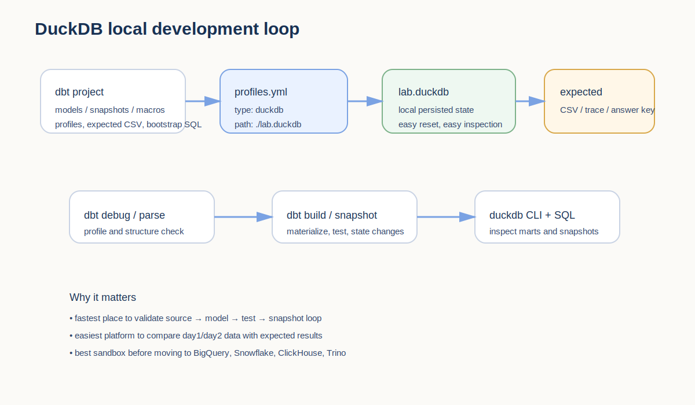
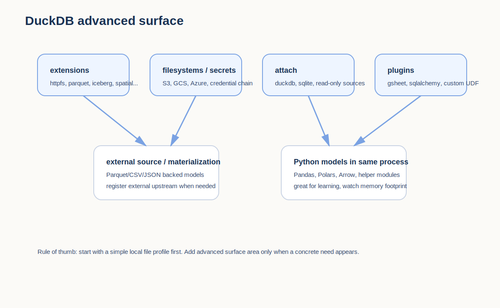
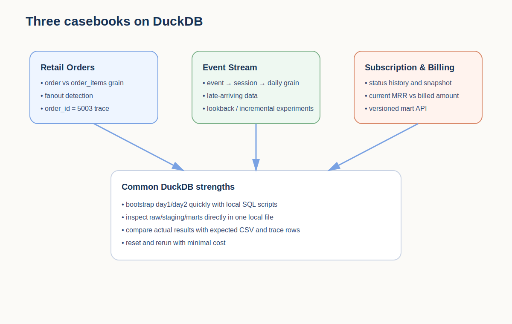

# CHAPTER 12 · Platform Playbook · DuckDB

> DuckDB는 이 책 전체를 실제로 손으로 돌려 보게 만드는 **기준 플랫폼**이다.  
> 앞선 1~11장에서 배운 개념을 가장 빠르게 확인하고, day1/day2 변화 데이터와 expected 결과를 가장 쉽게 대조할 수 있는 환경도 DuckDB다.  
> 하지만 바로 그 단순함 때문에, DuckDB를 다른 플랫폼과 같은 방식으로 오해해서는 안 된다. 이 장의 목적은 **“가장 쉬운 시작점”으로서의 DuckDB**와 **“실전 운영에서의 경계선”**을 동시에 분명하게 만드는 데 있다.



DuckDB 장을 따로 길게 다루는 이유는 단순하다. 이 책의 세 casebook—Retail Orders, Event Stream, Subscription & Billing—을 가장 낮은 비용으로 끝까지 재현할 수 있는 플랫폼이기 때문이다. 로컬 파일 하나만 준비하면 `source → staging → intermediate → marts → tests → snapshots → docs` 루프를 바로 돌릴 수 있고, 결과 파일도 눈으로 비교할 수 있다. 하지만 DuckDB가 학습과 실험에 매우 좋다고 해서, 다중 사용자 환경이나 배포 운영까지 같은 감각으로 보는 것은 위험하다.

이 장은 네 가지 질문에 답한다.

1. DuckDB는 이 책의 기본 실행 플랫폼으로서 어디까지 책임질 수 있는가?
2. DuckDB profile은 어디까지 단순해야 하고, 어디부터 고급 설정이 필요한가?
3. 세 casebook을 DuckDB에서 어떻게 돌리고, 무엇을 확인해야 하는가?
4. DuckDB에서 잘 되는 습관 중 무엇은 다른 플랫폼으로 그대로 옮길 수 있고, 무엇은 옮기면 안 되는가?

---

## 12.1. DuckDB를 첫 번째 플랫폼으로 쓰는 이유

### 12.1.1. DuckDB의 위치: “학습용 장난감”이 아니라 “가장 빠른 분석 샌드박스”
DuckDB는 SQLite처럼 파일 하나로 시작할 수 있지만, 분석 워크로드를 위해 설계된 엔진이다. 그래서 `JOIN`, 집계, 윈도 함수, Parquet/CSV 읽기, Python 연동 같은 분석용 흐름을 빠르게 시험해 볼 수 있다. dbt와 함께 쓰면 “데이터웨어하우스 없이도 analytics engineering workflow를 훈련할 수 있는 가장 작은 실험실”이 된다.

이 책에서 DuckDB가 중요한 이유는 다음과 같다.

- **실행 장벽이 낮다.** 계정 발급, 네트워크 방화벽, 권한 신청, 과금 걱정 없이 시작할 수 있다.
- **반복 속도가 빠르다.** `dbt debug`, `dbt build`, `dbt compile`, `dbt test`를 짧은 루프로 자주 돌리기 좋다.
- **실패 복구가 쉽다.** `.duckdb` 파일을 지우고 다시 bootstrap 하면 초기 상태로 돌아가기 쉽다.
- **세 예제 트랙을 모두 소화할 수 있다.** 주문형 fact/dim, 이벤트형 time-series, 구독형 상태 변화 이력을 모두 낮은 비용으로 재현할 수 있다.

하지만 동시에 DuckDB는 다음을 숨기기도 한다.

- 원격 웨어하우스 연결 문제
- 다중 사용자 동시성
- 역할/권한/warehouse 비용
- 장기 배치 운영과 SLA
- 서비스형 catalog 및 orchestration 경험

즉, DuckDB는 “모든 플랫폼을 대체하는 운영 표준”이 아니라, **다른 플랫폼으로 가기 전에 설계를 단단하게 만드는 기준점**이다.

### 12.1.2. DuckDB가 특히 잘 맞는 상황
DuckDB 장은 다음 상황을 염두에 두고 읽으면 좋다.

1. **개념 학습**
   - `source()`, `ref()`, layered modeling, tests, snapshots의 흐름을 가장 빠르게 익히는 단계
2. **로컬 디버깅**
   - compiled SQL과 결과 테이블을 작게 반복 검증하는 단계
3. **companion pack 실행**
   - day1/day2 bootstrap과 expected CSV를 실제로 대조하는 단계
4. **설계 검증**
   - grain, fanout, incremental 필터, freshness, contracts를 로컬에서 먼저 검증하는 단계
5. **다른 플랫폼 이전 전 준비**
   - BigQuery/Snowflake/ClickHouse/Trino로 옮기기 전에 모델 구조와 품질 규칙을 정리하는 단계

### 12.1.3. DuckDB가 가려 주는 것
DuckDB 장에서 가장 중요한 문장 하나를 고르면 이거다.

> DuckDB에서 잘 돌아간다는 사실은 모델 설계가 맞다는 뜻에 더 가깝고, 운영 구조가 완성됐다는 뜻은 아니다.

그래서 이 장은 항상 “어디까지는 DuckDB에서 충분히 볼 수 있고, 어디부터는 다른 플랫폼에서 다시 검증해야 하는가”를 함께 적는다. 이 구분이 없으면 독자는 DuckDB의 편의성을 곧 운영 보장처럼 오해하게 된다.

---

## 12.2. DuckDB profile을 읽는 법

### 12.2.1. 가장 단순한 로컬 profile
DuckDB는 `type: duckdb`와 `path`만 있어도 시작할 수 있다. 이 책의 기본 profile은 다음 형태를 권장한다.

```yaml
dbt_all_in_one_lab:
  target: dev
  outputs:
    dev:
      type: duckdb
      path: ./lab.duckdb
      schema: main
      threads: 4
```

이 구성에서 핵심은 두 가지다.

- `path`는 실제 `.duckdb` 파일 위치를 결정한다.
- `schema`는 relation을 쌓을 기본 스키마를 결정한다.

DuckDB profile에서 가장 많이 실수하는 지점은 **database 개념을 다른 RDBMS처럼 조작하려는 것**이다. DuckDB는 파일 경로를 기준으로 동작하므로, 처음에는 `path`와 `schema`만 명확히 이해하는 편이 좋다.

코드:
- [`../codes/04_chapter_snippets/ch12/01_profiles_duckdb_local.yml`](../codes/04_chapter_snippets/ch12/01_profiles_duckdb_local.yml)

### 12.2.2. 파일 기반과 `:memory:`의 차이
DuckDB는 파일 기반으로 쓸 수도 있고 in-memory로도 쓸 수 있다. 하지만 이 책에서는 **학습용 기본값으로 파일 기반을 강하게 추천**한다.

파일 기반이 좋은 이유:
- dbt 실행 후 relation이 그대로 남는다.
- `duckdb ./lab.duckdb`로 직접 접속해 결과를 확인하기 쉽다.
- day1 실행 후 day2를 적용해 snapshot이나 incremental 변화를 보기 쉽다.
- expected CSV와 비교할 때 기준점이 명확하다.

반대로 `:memory:`는 빠른 실험에는 좋지만 다음 문제가 생긴다.
- 프로세스가 끝나면 상태가 사라진다.
- subset run 시 upstream state를 다시 등록해야 하는 상황이 생긴다.
- external materialization이나 외부 파일 참조 시 재현성이 떨어질 수 있다.

초보자 기준 추천은 이렇다.

- **기본 학습**: `./lab.duckdb`
- **짧은 실험**: `:memory:`
- **파일/S3/Parquet/attach 실험**: 파일 기반 + 별도 디렉터리 관리

### 12.2.3. DuckDB 프로젝트 디렉터리 추천
DuckDB를 companion pack과 함께 쓸 때는 프로젝트 루트가 깔끔해야 한다.

```text
my_project/
├─ dbt_project.yml
├─ models/
├─ seeds/
├─ snapshots/
├─ macros/
├─ target/
├─ logs/
├─ lab.duckdb
├─ expected/
└─ 03_platform_bootstrap/
```

중요한 점:
- `.duckdb` 파일을 프로젝트 루트에 두면 확인은 쉽지만, Git ignore를 분명히 해야 한다.
- expected CSV는 DB 파일과 분리해 두어야 “결과 비교용 산출물”이라는 의미가 선명해진다.
- day1/day2 SQL은 companion bootstrap 디렉터리 아래에 두고, 장 본문에서는 그 경로를 문서화한다.

---

## 12.3. DuckDB에서 고급 설정이 필요한 시점



DuckDB는 기본 profile만으로도 충분히 시작할 수 있지만, 일정 시점부터는 DuckDB 특유의 강점—extensions, external files, attach, plugins, Python—을 활용하게 된다. 이 부분은 다른 플랫폼 플레이북과 DuckDB 플레이북이 갈라지는 핵심이다.

### 12.3.1. extensions, settings, filesystems
Parquet, HTTP/S3, fsspec 기반 파일시스템을 활용하려면 profile에 추가 설정이 필요하다.

```yaml
dbt_all_in_one_lab:
  target: dev
  outputs:
    dev:
      type: duckdb
      path: ./lab.duckdb
      threads: 4
      extensions:
        - httpfs
        - parquet
      settings:
        timezone: Asia/Seoul
      filesystems:
        - fs: s3
          anon: false
          key: "{{ env_var('S3_ACCESS_KEY_ID') }}"
          secret: "{{ env_var('S3_SECRET_ACCESS_KEY') }}"
```

이 설정은 “DuckDB를 로컬 파일 DB로만 쓰는 단계”를 넘어서, **파일 기반 lakehouse 실험**을 할 때 유용하다.

코드:
- [`../codes/04_chapter_snippets/ch12/02_profiles_duckdb_advanced.yml`](../codes/04_chapter_snippets/ch12/02_profiles_duckdb_advanced.yml)

### 12.3.2. secrets와 credential chain
로컬 환경에서도 S3/GCS/Azure 파일을 읽고 쓰려면 credential 관리가 필요하다.  
이때 단순 `settings`로 키를 박기보다 secret manager 또는 credential chain 전략을 이해하는 편이 낫다.

학습 기준:
- 로컬 단기 실험: env_var 또는 최소 secrets
- 팀 공유 환경: credential chain / 표준 provider
- 교재 예제: 민감값은 항상 env_var로

### 12.3.3. attach: 여러 데이터베이스를 한 런에서 다루기
DuckDB는 추가 데이터베이스를 attach해서 함께 다룰 수 있다. 이 기능은 다음 상황에서 특히 유용하다.

- 하나의 `.duckdb` 파일에 raw/staging/marts를 모두 몰아넣고 싶지 않을 때
- 외부 read-only DuckDB/SQLite 파일을 source처럼 읽고 싶을 때
- 로컬 실험에서 카탈로그 경계를 흉내 내고 싶을 때

```yaml
dbt_all_in_one_lab:
  target: dev
  outputs:
    dev:
      type: duckdb
      path: ./lab.duckdb
      attach:
        - path: ./raw.duckdb
          alias: rawdb
          read_only: true
        - path: ./audit.sqlite
          alias: auditdb
          type: sqlite
```

이 기능은 “DuckDB 하나로 작은 lakehouse 느낌을 내는 법”에 가깝다. 다만 초보자는 처음부터 attach를 쓰기보다, **하나의 lab.duckdb로 구조를 먼저 익힌 뒤** 확장하는 편이 낫다.

### 12.3.4. plugins와 local modules
DuckDB playbook을 고급 단계로 끌어올리는 요소는 plugin 시스템이다.  
이 기능을 통해 Google Sheets, SQLAlchemy, custom Python UDF 같은 확장을 연결할 수 있다. 다만 교재 기준으로는 “할 수 있다”를 보여 주는 정도면 충분하고, 본격적인 확장은 Appendix C와 Chapter 08의 Python/UDF 절에서 다시 다루는 편이 좋다.

```yaml
dbt_all_in_one_lab:
  target: dev
  outputs:
    dev:
      type: duckdb
      path: ./lab.duckdb
      plugins:
        - module: sqlalchemy
          alias: sql
          config:
            connection_url: "{{ env_var('DBT_ENV_SECRET_SQLALCHEMY_URI') }}"
      module_paths:
        - ./python_modules
```

중요한 건 “DuckDB에서는 Python이 같은 프로세스 안에서 실행된다”는 점이다.  
이 특성 덕분에 실험은 쉽지만, 의존성 관리와 메모리 사용을 함께 고민해야 한다.

### 12.3.5. external source와 external materialization
DuckDB는 외부 파일을 source처럼 읽는 패턴과, 모델 결과를 외부 파일로 materialize하는 패턴이 모두 강하다. 이것은 BigQuery나 Snowflake와는 다른 DuckDB 고유의 장점이다.

예를 들어 source에 external location을 주면, `source()`가 단순한 테이블명이 아니라 파일 경로 또는 `read_parquet()` 호출로 풀릴 수 있다. 또한 `materialized='external'`을 사용하면 결과를 Parquet/CSV/JSON 같은 파일로 직접 쓸 수 있다.

코드:
- [`../codes/04_chapter_snippets/ch12/03_external_sources.yml`](../codes/04_chapter_snippets/ch12/03_external_sources.yml)
- [`../codes/04_chapter_snippets/ch12/04_register_external_models.yml`](../codes/04_chapter_snippets/ch12/04_register_external_models.yml)

주의:
- `:memory:`를 사용할 때 external upstream subset run이 깨질 수 있으므로, 필요하면 `register_upstream_external_models()`를 `on-run-start`에 두는 편이 안전하다.
- external materialization은 편리하지만, relation처럼 “언제나 DB 안에 존재하는 상태”와는 다르므로 디버깅 지점이 달라진다.

### 12.3.6. DuckDB에서 Python model이 의미하는 것
DuckDB에서는 Python model이 원격 실행이 아니라 **같은 Python 프로세스 안에서** 동작한다.  
이건 학습용으로 아주 강력하다. Pandas/Polars/Arrow를 바로 써 볼 수 있고, 작은 helper 모듈도 쉽게 가져올 수 있다. 하지만 동시에 “Python이니까 아무거나 넣어도 되겠지”라고 생각하면 안 된다. Python model도 여전히 **grains, contracts, tests, runtime footprint**를 생각해야 한다.

코드:
- [`../codes/04_chapter_snippets/ch12/05_python_model_duckdb_example.py`](../codes/04_chapter_snippets/ch12/05_python_model_duckdb_example.py)

---

## 12.4. 세 casebook을 DuckDB에서 어떻게 읽을 것인가



이 장의 핵심은 “DuckDB가 세 casebook을 모두 같은 방식으로 읽게 해 준다”가 아니다.  
오히려 **같은 장치를 쓰더라도, casebook마다 DuckDB에서 더 쉽게 보이는 포인트가 다르다**는 점이 중요하다.

### 12.4.1. Retail Orders: grain, fanout, 5003 추적
Retail Orders를 DuckDB에서 돌릴 때 가장 좋은 점은 다음 셋이다.

1. `orders`와 `order_items` grain 차이를 가장 쉽게 반복 검증할 수 있다.
2. `order_id = 5003`의 lifecycle을 day1/day2/snapshot까지 바로 확인할 수 있다.
3. `fct_orders` 결과를 expected CSV와 비교하기 쉽다.

추천 루프:
1. `03_platform_bootstrap/retail/duckdb/setup_day1.sql` 실행
2. `dbt build -s path:models/retail`
3. `duckdb ./lab.duckdb`로 `stg_orders`, `int_order_lines`, `fct_orders` 조회
4. `03_platform_bootstrap/retail/duckdb/apply_day2.sql` 실행
5. `dbt build -s path:models/retail`
6. `orders_snapshot`과 `expected/retail/order5003_trace.csv` 비교

DuckDB에서는 이 루프가 매우 가볍다. 그래서 Retail Orders는 **fanout과 snapshot을 배우는 첫 샌드박스**로 좋다.

### 12.4.2. Event Stream: append-only, late arrival, lookback
Event Stream에서 DuckDB가 특히 좋은 이유는 **incremental 실험 반복**이다.

- event grain에서 session/daily grain으로 어떻게 올라가는지
- day2 데이터가 단순 append인지, late-arriving update인지
- lookback window를 넓힐 때 결과가 어떻게 바뀌는지

이걸 빠르게 바꿔 가며 확인할 수 있다.  
즉, DuckDB는 Event Stream에서 “고비용 웨어하우스 없이 incremental 설계 감각을 훈련하는 엔진”이다.

추천 포인트:
- `loaded_at_field`와 freshness 결과를 함께 보기
- microbatch 이전에 먼저 단일 incremental path를 이해하기
- expected daily aggregates와 실제 결과를 SQL로 대조하기

### 12.4.3. Subscription & Billing: status history, snapshot, MRR
Subscription casebook에서 DuckDB는 **상태 변화 추적**과 **정의 점검**에 강하다.

- `subscription_id = sub_2003`의 day1/day2 상태 변화
- YAML 기반 snapshot이 row version을 어떻게 만든는지
- current MRR와 billed amount를 왜 분리해야 하는지
- `fct_mrr_v1`과 `fct_mrr_v2` 같은 버전드 API를 어떻게 검증하는지

DuckDB 환경에서는 snapshot과 mart 버전을 함께 반복 확인하기 쉬워서, **재무적 정의가 안정화되는 과정을 눈으로 학습하기 좋다.**

---

## 12.5. DuckDB에서의 실행 루프와 확인 포인트

### 12.5.1. 가장 추천하는 기본 루프
DuckDB에서 chapter 9~11의 casebook을 읽을 때 추천하는 기본 루프는 다음이다.

```bash
dbt debug
dbt parse
dbt build --select <필요한 범위>
dbt test --select <핵심 모델>
dbt snapshot --select <snapshot 범위>
dbt docs generate
```

그리고 DB 파일을 직접 열어서 relation을 확인한다.

```bash
duckdb ./lab.duckdb
```

이 루프의 장점은 “dbt artifact 관찰”과 “실제 relation 조회”를 같은 로컬 환경에서 함께 할 수 있다는 점이다.

### 12.5.2. 무엇을 직접 확인해야 하는가
DuckDB에서는 다음 확인 항목이 특히 중요하다.

1. **row count**
   - day1과 day2 사이에 행 수가 의도대로 변했는가
2. **grain**
   - `order_id`, `session_id`, `subscription_id` 각각이 mart의 행 단위와 맞는가
3. **snapshot row version**
   - 동일 키가 여러 버전으로 생기는 것이 의도된 것인가
4. **freshness**
   - source freshness 결과가 day2 데이터 반영과 일관되는가
5. **expected CSV**
   - companion pack의 answer key와 실제 쿼리 결과가 일치하는가

코드:
- [`../codes/04_chapter_snippets/ch12/06_expected_checks.sql`](../codes/04_chapter_snippets/ch12/06_expected_checks.sql)

### 12.5.3. 빠른 reset 전략
DuckDB에서 실험이 꼬였을 때 가장 쉬운 복구 전략은 명확하다.

- `lab.duckdb`를 삭제하고 day1 bootstrap부터 다시 시작
- 혹은 snapshot/schema만 정리하고 특정 casebook만 재실행
- expected CSV를 기준으로 어느 시점부터 어긋났는지 먼저 찾기

이 전략은 ClickHouse/BigQuery/Snowflake처럼 비용이나 권한이 큰 환경보다 훨씬 단순하다.  
바로 이 점 때문에 DuckDB는 학습 루프를 빠르게 만들어 준다.

---

## 12.6. DuckDB에서 배운 것 중 무엇은 그대로 옮기고, 무엇은 다시 검증해야 하는가

### 12.6.1. 그대로 옮겨도 되는 것
다음은 DuckDB에서 익힌 뒤 다른 플랫폼으로 옮겨도 된다.

- `source()` / `ref()` 기반 DAG 습관
- layered modeling
- grain 설계
- generic / singular / unit test 사고방식
- snapshot의 역할 구분
- contracts와 versions를 public surface로 보는 관점
- expected result를 함께 두는 학습 방식

### 12.6.2. 다시 검증해야 하는 것
반대로 다음은 플랫폼별로 다시 봐야 한다.

- warehouse 비용과 compute sizing
- 권한 / 역할 / grants
- merge / incremental semantics
- partitioning / clustering / engine 설정
- 다중 사용자 동시성
- orchestration / retries / state-aware deploy
- catalog / dbt platform / service형 문서 경험

즉, DuckDB는 **설계를 검증하는 플랫폼**이지, **운영 아키텍처를 그대로 대체하는 플랫폼**은 아니다.

---

## 12.7. DuckDB에서 자주 나오는 안티패턴

### 12.7.1. `:memory:`를 기본으로 쓰고 subset run을 반복
처음에는 빠르게 보여도, 상태가 사라져서 디버깅이 오히려 어려워진다.  
특히 external upstream 모델이 있을 때 subset run과 문서 생성 흐름이 불안정해질 수 있다.

### 12.7.2. DuckDB가 빠르니 giant SQL도 괜찮다고 생각
로컬에서는 돌아가 보일 수 있지만, 설계가 좋아졌다는 뜻은 아니다.  
DuckDB의 속도가 나쁜 모델 구조를 가려 줄 수 있다.

### 12.7.3. attach / external / plugin을 너무 일찍 섞기
DuckDB의 강점이지만, 초보자는 기본 `.duckdb` + local bootstrap만으로 먼저 충분히 연습하는 편이 좋다.  
고급 surface를 너무 빨리 섞으면 “dbt 개념”보다 “플랫폼 기능”이 먼저 머리에 들어온다.

### 12.7.4. DuckDB 결과를 곧 운영 보장으로 해석
로컬 실행 성공은 설계와 테스트의 출발점일 뿐이다.  
특히 concurrency, grants, orchestration, large-scale incremental, storage engine 특성은 다른 플랫폼에서 다시 검증해야 한다.

---

## 12.8. DuckDB 플레이북 실습 체크리스트

### 12.8.1. 최소 실습
- [ ] `dbt debug`로 profile 연결 확인
- [ ] `setup_day1.sql`로 raw 데이터 적재
- [ ] Retail Orders casebook 한 번 완주
- [ ] `apply_day2.sql` 후 snapshot 변화 확인
- [ ] expected CSV와 대조

### 12.8.2. 확장 실습
- [ ] Event Stream에서 lookback window 바꾸기
- [ ] Subscription casebook에서 `sub_2003` 추적
- [ ] `extensions`와 `settings` 추가 profile 실험
- [ ] attach를 사용해 read-only raw DB 분리
- [ ] Python model 예시 실행
- [ ] external source / external materialization 실험

### 12.8.3. 플랫폼 이전 준비
- [ ] DuckDB에서 검증한 grain 문서를 정리했는가
- [ ] contracts / versions를 public surface처럼 정리했는가
- [ ] expected 결과와 failure lab이 준비됐는가
- [ ] 다른 플랫폼에서 다시 검증할 항목을 따로 적어 두었는가

---

## 12.9. 직접 해보기

### 실습 1. Retail Orders를 day1/day2까지 반복 실행해라
목표는 `order_id = 5003`의 변화를 직접 눈으로 확인하는 것이다.

1. day1 bootstrap 실행
2. `dbt build`
3. `fct_orders`와 snapshot 확인
4. day2 적용
5. 다시 `dbt build`
6. expected trace와 비교

### 실습 2. Event Stream에서 늦게 도착한 이벤트를 반영해라
목표는 incremental 필터와 lookback의 차이를 체감하는 것이다.

1. day1 bootstrap 실행
2. mart build
3. day2 late-arrival 적용
4. lookback 없는 run과 있는 run 비교
5. daily aggregate 차이 기록

### 실습 3. Subscription casebook에서 snapshot과 current mart를 분리해라
목표는 “현재 상태 모델”과 “상태 이력 모델”을 혼동하지 않는 것이다.

1. day1 bootstrap
2. `stg_subscription_events`와 current mart 확인
3. day2 상태 변화 적용
4. snapshot과 current mart를 따로 비교
5. `sub_2003`의 lifecycle을 문장으로 설명

---

## 12.10. 이 장의 결론

DuckDB는 이 책의 세 casebook을 가장 빠르게 실제로 실행해 보게 만드는 **기본 플랫폼**이다.  
그래서 이 장의 목적은 “DuckDB를 빨리 시작하는 법”을 넘어서, **왜 DuckDB가 학습용 기준점으로 좋은지**, **어디부터는 다른 플랫폼으로 넘어가며 다시 생각해야 하는지**를 분명히 만드는 데 있다.

정리하면 다음과 같다.

1. DuckDB는 `source → model → test → snapshot → docs` 루프를 가장 가볍게 반복하게 해 준다.
2. 파일 기반 profile과 expected 결과 비교가 쉬워서 companion pack의 기준 환경으로 적합하다.
3. extensions, attach, plugins, external materialization, Python model 같은 DuckDB 고유 surface가 있다.
4. 하지만 운영 환경의 concurrency, grants, 비용, orchestration은 DuckDB가 대신 검증해 주지 않는다.
5. 따라서 DuckDB는 **기본기를 굳히는 플랫폼**이고, 다른 플레이북으로 넘어가기 전의 가장 좋은 준비 단계다.
