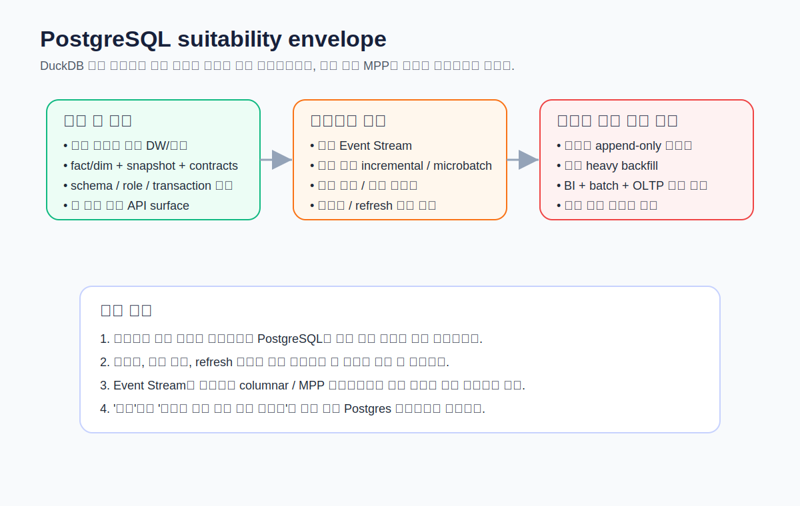
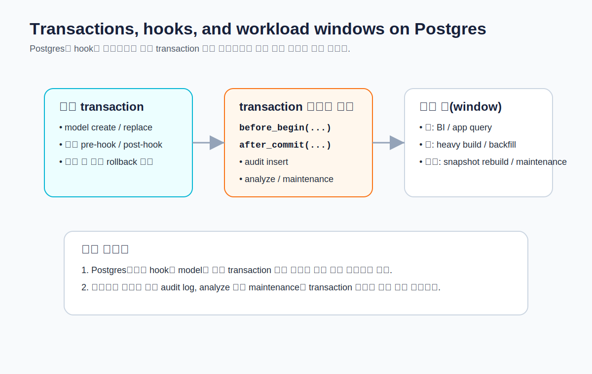

# CHAPTER 14 · Platform Playbook · PostgreSQL

PostgreSQL은 이 책에서 **DuckDB 다음 단계의 기준 플랫폼**이다.  
DuckDB가 “로컬에서 가장 빠르게 개념을 익히는 환경”이라면, PostgreSQL은 **스키마, 권한, 트랜잭션, 인덱스, 운영 시간대** 같은 현실적인 제약을 가장 이해하기 쉬운 형태로 드러내는 플랫폼이다.  

이 장의 목적은 단순히 `profiles.yml` 예시를 하나 보여주는 데 있지 않다.  
PostgreSQL 위에서 **세 casebook** — `Retail Orders`, `Event Stream`, `Subscription & Billing` — 을 어떤 방식으로 올리고, 어느 지점에서 구조를 바꾸고, 어떤 순간에 더 큰 분석 플랫폼으로 옮겨야 하는지를 끝까지 설명하는 데 있다.



## 14.1. PostgreSQL을 이 책의 플레이북에 포함하는 이유

### 14.1.1. PostgreSQL이 잘 맞는 상황

PostgreSQL은 다음과 같은 상황에서 특히 좋다.

1. dbt를 DuckDB 다음 단계에서 익히고 싶을 때  
2. 작고 명료한 내부 DW/마트를 운영할 때  
3. `schema`, `role`, `transaction`, `index`를 포함한 운영 감각을 배우고 싶을 때  
4. 애플리케이션 DB와 비슷한 세계 안에서 변환 작업의 부담을 체감하고 싶을 때  
5. BI용 소형 fact/dim, 계약형 데이터셋(contracted dataset), 팀 공용 마트를 만들고 싶을 때  

dbt 문서 기준으로 PostgreSQL은 dbt Labs가 유지하는 **supported adapter**이고, `dbt-postgres`는 `dbt-core`와 별도로 설치한다. `profiles.yml`에는 `host`, `user`, `password`, `port`, `dbname` 또는 `database`, `schema`, `threads` 외에 `keepalives_idle`, `connect_timeout`, `retries`, `search_path`, `role`, `sslmode` 등도 둘 수 있다.  
즉, 이 장은 “연결은 쉽지만 운영 감각은 훨씬 빨리 생기는 플랫폼”이라는 전제에서 PostgreSQL을 다룬다.

### 14.1.2. PostgreSQL이 덜 맞는 상황

반대로 다음과 같은 상황에서는 PostgreSQL이 한계에 빨리 닿을 수 있다.

1. 수십억 건의 append-only 이벤트를 장기간 보관하며 고빈도 분석을 돌릴 때  
2. BI와 ad hoc 분석, 대규모 backfill이 같은 인스턴스에 몰릴 때  
3. 잦은 full rebuild, 넓은 merge, 대형 snapshot, 대용량 sessionization이 필요할 때  
4. OLTP 인스턴스와 동일한 자원을 공유하면서 무거운 dbt 배치를 돌릴 때  

Postgres는 범용 SQL 엔진으로 매우 강력하지만, 분석 전용 MPP/columnar 플랫폼처럼 **큰 스캔과 병렬 분석을 위해 설계된 세계**는 아니다.  
그래서 이 장의 핵심 질문은 단순하다.

> “PostgreSQL에서도 되는가?”보다  
> **“PostgreSQL에 얼마나 오래 머무는 게 좋은가?”**

## 14.2. 로컬/서버 환경에서 PostgreSQL 연결하기

### 14.2.1. 설치와 adapter

```bash
python -m pip install dbt-core dbt-postgres
```

Postgres는 dbt Labs가 유지하는 supported adapter이므로, 학습용/소형 운영용 모두에 비교적 안전한 선택이다.

### 14.2.2. 최소 `profiles.yml`

아래는 이 책에서 가장 기본이 되는 profile 예시다.

```yaml
dbt_all_in_one:
  target: dev
  outputs:
    dev:
      type: postgres
      host: localhost
      port: 5432
      dbname: analytics
      schema: dbt_dev
      user: analytics
      password: "{{ env_var('DBT_ENV_SECRET_PG_PASSWORD') }}"
      threads: 4
      connect_timeout: 10
      retries: 1
      keepalives_idle: 0
      sslmode: prefer
```

파일 예시는 `codes/04_chapter_snippets/ch14/profiles.postgres.example.yml`에 있다.

### 14.2.3. `search_path`와 `role`은 언제 건드려야 하나

문서 기준으로 `search_path`를 커스텀 값으로 바꾸는 것은 일반적인 사용에서는 **필요하지도, 권장되지도 않는다**.  
dbt는 가능한 한 relation을 완전한 형태(database / schema / identifier)로 다루는 편이 안전하다.  
즉, `search_path`로 “암묵적인 기본 스키마 탐색”을 만들기보다, **명시적 relation**과 `source()` / `ref()`를 유지하는 편이 좋다.

`role`은 dev와 prod에서 수행 권한을 분리해야 할 때 유용하다.  
예를 들어 로컬 개발자는 `dbt_dev` 스키마에만 쓰기 권한이 있고, 배포 환경은 `analytics` 스키마에만 쓰기 권한이 있게 나누면, 실수로 운영 스키마를 건드릴 위험을 크게 줄일 수 있다.

### 14.2.4. 첫 연결 전 preflight 체크

`dbt debug` 전에 아래 SQL로 최소 상태를 확인해 두면 좋다.

```sql
select version();
select current_user;
select current_database();
select current_schema();
show search_path;
```

파일: `codes/04_chapter_snippets/ch14/postgres_preflight.sql`

## 14.3. PostgreSQL에서 스키마와 권한을 어떻게 설계할까


### 14.3.1. 기본 권장 구조

가장 단순한 권장 구조는 다음과 같다.

- `raw` : 원천 적재 영역  
- `dbt_dev_<user>` 또는 `dbt_dev` : 개인/팀 개발 스키마  
- `analytics` : 배포된 분석용 스키마  
- `snapshots` : 상태 이력 전용 스키마  
- `audit` : 운영 로그, quality triage, failure table 보관 스키마  

Postgres에서는 schema 개념과 권한 모델이 명확하므로, 이 구조만 잘 잡아도 dbt의 운영 감각을 빠르게 배울 수 있다.

### 14.3.2. 애플리케이션 DB와 분리하는 게 좋은 이유

애플리케이션이 쓰는 테이블과 dbt가 만드는 변환 결과를 같은 schema에 섞어 두면 다음 문제가 생긴다.

1. 실수로 raw/operational table을 직접 덮어쓸 위험  
2. 백업/권한/모니터링 정책이 섞임  
3. app query와 analytics query가 서로의 성능에 영향을 줌  
4. schema-level grants 관리가 어려워짐  

가능하면 **같은 인스턴스 안이라도 schema는 반드시 분리**하는 것이 좋다.  
더 좋다면 읽기 복제본, 별도 DB, 별도 인스턴스로 분리한다.

## 14.4. PostgreSQL에서 materialization을 고르는 기준

### 14.4.1. 가장 안전한 기본값

Postgres에서는 아래 기본값으로 시작하는 편이 안전하다.

- `staging` → `view`
- `intermediate` → `view` 또는 작은 reusable table
- `marts` → `table`
- 매우 큰 이벤트성 모델 → `incremental`
- 자주 읽히고 SQL 정의가 안정된 결과 → `materialized_view` 검토

핵심은 DuckDB에서처럼 개념을 단순하게 시작하되, Postgres에서는 **조회 성능과 재생성 비용**이 더 빨리 문제로 드러난다는 점이다.

### 14.4.2. Postgres에서 지원되는 incremental 전략

dbt 문서 기준으로 Postgres adapter는 다음 incremental 전략을 지원한다.

- `append`
- `merge`
- `delete+insert`
- `microbatch`

여기서 practical default는 대개 이렇게 생각하면 된다.

1. 고유 key 없이 append-only이면 `append`
2. 고유 key가 있고 upsert가 필요하면 `merge` 또는 `delete+insert`
3. 시간 컬럼이 분명한 대형 이벤트 스트림이면 `microbatch`

단, `merge`와 `delete+insert`는 **기존 행을 읽고 비교하고 갱신하는 비용**이 있으므로, 작은 테이블엔 좋지만 매우 큰 테이블에서 만능 해법은 아니다.

### 14.4.3. `unlogged`는 빠르지만 안전하지 않다

Postgres config 문서 기준으로 `unlogged=True`인 테이블은 WAL에 기록되지 않고 replica에도 복제되지 않으므로 **일반 테이블보다 빠를 수 있지만, 훨씬 덜 안전하다**.

```sql
{{ config(materialized='table', unlogged=True) }}

select ...
```

이 옵션은 다음에만 고려하자.

- 재생성 가능한 임시형 intermediate
- failure 시 다시 만들 수 있는 staging helper table
- 절대 시스템 오브 레코드가 아닌 데이터셋

반대로 아래에는 권장하지 않는다.

- 팀 공용 mart
- audit / logging table
- 중요한 snapshot-like 결과
- 배포 API surface

### 14.4.4. `indexes`는 Postgres 플레이북의 핵심이다

문서 기준으로 Postgres는 table, incremental, seed, snapshot, materialized view에 `indexes` 설정을 둘 수 있다.  
즉, PostgreSQL 플레이북에서 가장 중요한 차별점은 **“모델을 어떻게 만들지”뿐 아니라 “어떤 컬럼에 인덱스를 둘지”까지 같이 설계해야 한다**는 점이다.

예:

```sql
{{ config(
    materialized='table',
    indexes=[
      {"columns": ["order_id"], "unique": true},
      {"columns": ["customer_id"], "type": "btree"},
      {"columns": ["order_date"], "type": "btree"}
    ]
) }}

select ...
```

파일: `codes/04_chapter_snippets/ch14/retail_orders_indexed_table.sql`

### 14.4.5. `materialized_view`는 언제 좋은가

Postgres config 문서 기준으로 adapter는 `materialized_view`와 `on_configuration_change`, `indexes`를 지원한다.  
하지만 일반 문서 흐름에서 중요한 차이는 이것이다.

- table / incremental / snapshot은 **dbt run/build를 통해 데이터가 갱신**된다.
- materialized view는 **deploy action에 가깝고**, refresh 전략은 플랫폼 특성과 운영 방식에 의존한다.
- 그리고 materialized view의 “자동 refresh”는 대부분의 플랫폼에서 논의되지만, **Postgres는 그 자동 refresh의 대표 플랫폼이 아니다**.

즉, Postgres에서 materialized view는 “자동으로 항상 최신”이라고 생각하면 안 된다.  
**refresh를 누가 언제 실행할지**까지 운영 계획에 포함해야 한다.

예:

```sql
{{ config(
    materialized='materialized_view',
    on_configuration_change='apply',
    indexes=[
      {"columns": ["metric_date"], "type": "btree"},
      {"columns": ["customer_segment"], "type": "btree"}
    ]
) }}

select
    metric_date,
    customer_segment,
    sum(mrr_amount) as mrr_amount
from {{ ref('fct_mrr_v2') }}
group by 1, 2
```

파일: `codes/04_chapter_snippets/ch14/mrr_materialized_view.sql`

## 14.5. PostgreSQL의 트랜잭션과 hooks



### 14.5.1. 왜 Postgres 플레이북에서 hooks를 따로 봐야 하나

dbt 문서 기준으로 Postgres와 Redshift처럼 transaction을 쓰는 adapter에서는 **기본적으로 hooks도 모델 생성과 같은 transaction 안에서 실행**된다.  
이건 Snowflake나 BigQuery 같은 세계와 체감이 다른 지점이다.

즉, 다음 같은 작업은 의도와 다르게 동작할 수 있다.

- 시작 로그를 `pre-hook`로 남겼는데 모델 실패 시 로그도 함께 롤백됨
- `post-hook`에서 maintenance 작업을 했는데 transaction 문맥 때문에 제한됨
- 실패한 모델의 흔적을 남기고 싶었지만 한 transaction으로 묶여 모두 사라짐

### 14.5.2. 언제 transaction 밖으로 빼야 하나

문서 기준으로 Postgres/Redshift에서는 `before_begin` / `after_commit`, 또는 `transaction: false`를 이용해 hook를 transaction 밖에서 실행할 수 있다.

예:

```sql
{{ config(
    pre_hook=before_begin("insert into audit.run_log(model_name, status) values ('{{ this.name }}', 'RUNNING')"),
    post_hook=after_commit("analyze {{ this }}")
) }}
```

파일: `codes/04_chapter_snippets/ch14/post_hook_after_commit.sql`

이 패턴은 다음에 유용하다.

1. 실패해도 남겨야 하는 audit log  
2. transaction 안에서 실행하기 곤란한 maintenance SQL  
3. 장기 배치 후 통계/분석 정보 갱신  

## 14.6. Casebook I · Retail Orders를 PostgreSQL에 올리기

### 14.6.1. 왜 Retail Orders는 Postgres와 잘 맞는가

Retail Orders는 다음 특징 때문에 Postgres에서 가장 먼저 올리기 좋은 casebook이다.

- row 수가 상대적으로 통제 가능하다
- `order_id`, `customer_id`, `order_date` 같은 key/index 후보가 분명하다
- fact/dim 구조가 직관적이다
- snapshot, tests, contract, semantic-ready surface까지 무리 없이 붙일 수 있다

### 14.6.2. 권장 materialization

- `stg_orders`, `stg_order_items`, `stg_customers`, `stg_products` → `view`
- `int_order_lines` → `view` 또는 작은 `table`
- `fct_orders`, `dim_customers` → `table`
- `orders_status_snapshot` → snapshot table
- 반복 조회가 많은 요약 API면 materialized view 검토

### 14.6.3. 인덱스 전략

`fct_orders`에서는 아래 인덱스가 가장 기본이다.

- `order_id` unique
- `customer_id`
- `order_date`

`dim_customers`에서는

- `customer_id` unique
- 자주 필터링한다면 `customer_segment`

이 정도면 대부분의 교육용/소형 운영형 마트에서 충분하다.

### 14.6.4. bootstrap과 day2 적용

- day1: `03_platform_bootstrap/retail/postgres/setup_day1.sql`
- day2: `03_platform_bootstrap/retail/postgres/apply_day2.sql`

권장 실행 루틴:

```bash
dbt seed
dbt run -s staging
dbt run -s intermediate
dbt run -s marts
dbt test -s marts+
dbt snapshot -s orders_status_snapshot
```

## 14.7. Casebook II · Event Stream을 PostgreSQL에 올리기

### 14.7.1. Event Stream은 왜 더 조심해야 하나

Event Stream은 PostgreSQL에 올릴 수는 있지만, 여기서부터는 단순한 “된다/안 된다”보다 **어떻게 제한을 걸어 운영할지**가 중요해진다.

이 casebook에는 보통 다음이 따라온다.

- append-only row 증가
- `event_time` 기반 filter/backfill
- sessionization
- daily aggregates
- late-arriving events
- lookback window
- freshness와 incremental 전략의 결합

이런 구조는 분석 전용 columnar/MPP 플랫폼에 더 자연스럽다.  
Postgres에서 가능하더라도, 무제한적으로 큰 스캔과 backfill을 반복하는 것은 좋지 않다.

### 14.7.2. PostgreSQL에서 Event Stream을 다룰 때의 실무 기준

1. raw 이벤트 보관 기간을 무한정 늘리지 않는다  
2. 최근 구간 중심의 incremental / microbatch를 쓴다  
3. `event_time`, `user_id`, `session_id` 후보 인덱스를 미리 생각한다  
4. sessionization을 한 번 더 요약한 mart를 별도로 둔다  
5. OLTP와 같은 인스턴스를 공유 중이라면 야간 윈도우로 몰아넣는다  

### 14.7.3. microbatch를 언제 고려할까

dbt 문서 기준으로 Postgres adapter는 `microbatch` incremental 전략을 지원한다.  
따라서 이 casebook에서 time-series window를 잘라 처리하고 싶다면, Postgres에서도 학습과 소형 운영은 충분히 가능하다.

예:

```sql
{{ config(
    materialized='incremental',
    incremental_strategy='microbatch',
    event_time='event_time',
    unique_key='event_id'
) }}

select *
from {{ ref('stg_events') }}
```

파일: `codes/04_chapter_snippets/ch14/events_microbatch.sql`

### 14.7.4. 언제 다른 플랫폼으로 넘어가야 하나

다음 신호가 보이면 Postgres만으로 버티기보다 BigQuery / ClickHouse / Snowflake / Trino 쪽을 검토하는 것이 자연스럽다.

- 하루 이벤트 수가 급격히 증가
- backfill이 자주 필요
- sessionization/retention/funnel이 무거워짐
- BI와 batch가 서로 느려짐
- 인덱스를 늘려도 scan 비용이 줄지 않음

## 14.8. Casebook III · Subscription & Billing을 PostgreSQL에 올리기

### 14.8.1. 왜 Subscription & Billing도 Postgres와 잘 맞는가

이 casebook은 이벤트성 폭증보다 **상태 변화와 이력 관리**가 중요하기 때문에 Postgres와 잘 맞는다.

- `subscription_id`, `account_id` key가 분명하다
- snapshot으로 상태 변화를 다루기 좋다
- invoice/fact/mrr surface를 명확히 계약할 수 있다
- finance/ops와 함께 보는 작은 공용 API surface를 만들기 좋다

### 14.8.2. 추천 구조

- raw subscription / invoice / payment source
- staging에서 상태 표준화
- intermediate에서 billing period / MRR candidate 계산
- `fct_mrr_v1` → `fct_mrr_v2`로 정의를 점진적으로 안정화
- `subscription_status_snapshot`으로 상태 이력 저장
- 계약이 안정되면 contract + version 부여
- 반복 조회 surface는 materialized view 검토

### 14.8.3. snapshot과 materialized view를 함께 볼 때

Subscription 도메인에서는 snapshot과 materialized view를 혼동하지 않는 것이 중요하다.

- snapshot = **상태 이력 보존**
- materialized view = **현재/요약 surface를 빠르게 제공**

즉, snapshot은 history이고, materialized view는 serving layer다.  
둘은 대체 관계가 아니라 서로 다른 목적을 가진다.

## 14.9. PostgreSQL 플레이북에서 자주 보는 안티패턴

### 14.9.1. `search_path`로 모든 문제를 해결하려는 시도

스키마를 명시하지 않고 `search_path`만 믿고 relation을 다루면, 환경이 늘어날수록 디버깅이 어려워진다.  
dbt에서는 명시적 relation과 `source()` / `ref()`가 기본이다.

### 14.9.2. 인덱스를 전혀 두지 않은 채 “Postgres가 느리다”고 결론내리기

Postgres는 작은/중간 규모에서는 매우 훌륭하지만, 조인·필터 컬럼에 기본적인 인덱스가 없으면 금방 체감 성능이 나빠진다.

### 14.9.3. 중요한 테이블에 `unlogged=True`를 남발하기

빠를 수는 있지만 복구/복제 안정성이 낮다.  
재생성 가능한 helper table 정도로 제한하는 것이 좋다.

### 14.9.4. materialized view를 “자동 최신 데이터”라고 오해하기

Postgres에서 materialized view는 **refresh 운영**까지 설계해야 한다.  
그렇지 않으면 사용자는 항상 최신이라고 믿고, 실제로는 stale한 결과를 보게 된다.

### 14.9.5. OLTP 인스턴스에서 주간 업무시간에 heavy backfill을 돌리기

가장 현실적인 실패 패턴이다.  
학습용이나 소형 환경에서는 괜찮아 보여도, 실제 운영에서는 애플리케이션과 분석 배치가 서로의 적이 될 수 있다.

## 14.10. PostgreSQL에서 세 casebook을 운영할 때의 실행 루프

### 14.10.1. 기본 루프

```bash
dbt debug
dbt parse
dbt ls -s +fct_orders+
dbt build -s marts
dbt snapshot
dbt docs generate
```

### 14.10.2. Retail Orders

```bash
dbt build -s +fct_orders+
dbt snapshot -s orders_status_snapshot
```

### 14.10.3. Event Stream

```bash
dbt build -s +fct_sessions_daily+
dbt build -s tag:event_incremental
```

### 14.10.4. Subscription & Billing

```bash
dbt build -s +fct_mrr_v2+
dbt snapshot -s subscription_status_snapshot
```

## 14.11. 이 장의 핵심 정리

PostgreSQL 플레이북의 핵심은 네 줄이면 충분하다.

1. PostgreSQL은 **개념 학습 + 소형 운영형 DW/마트**에 매우 좋은 플랫폼이다.
2. DuckDB보다 빨리 **schema / role / transaction / index / workload** 감각을 준다.
3. Event Stream처럼 큰 시계열 분석은 가능하더라도 **언제 다른 플랫폼으로 넘어갈지**를 항상 같이 판단해야 한다.
4. Postgres에서의 성공은 SQL 기교보다 **인덱스, 권한 분리, refresh 계획, 운영 시간대**를 얼마나 잘 설계했는지에 달려 있다.

## 14.12. 직접 해보기

1. `profiles.postgres.example.yml`을 자신의 환경에 맞게 수정한다.
2. `postgres_preflight.sql`을 실행해 현재 유저, DB, schema, search_path를 확인한다.
3. Retail Orders day1 bootstrap을 로드하고 `dbt build -s marts`를 실행한다.
4. `fct_orders`에 인덱스를 추가하기 전/후의 실행 계획을 비교한다.
5. Event Stream에서 `microbatch` 전략으로 최근 7일만 다시 처리해 본다.
6. Subscription & Billing에서 snapshot과 materialized view가 각각 어떤 역할인지 직접 확인한다.

## 14.13. 다음 장으로 이어지는 질문

PostgreSQL까지 오면 이제 질문이 바뀐다.

- “dbt가 뭔가요?”가 아니라  
- **“이 모델을 이 플랫폼에 얼마나 오래 둘 것인가?”**

다음 장들에서는 이 질문을 BigQuery, ClickHouse, Snowflake, Trino, NoSQL + SQL Layer로 확장해 나간다.
