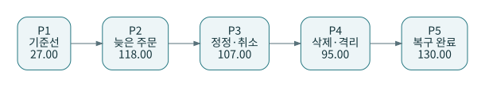

# J00 · 마당마켓: 한 개의 상점으로 처음부터 끝까지

<strong>마당마켓(Madang Market)</strong>은 통계마당의 이름에서 ‘마당’을 가져온 가상의 교육용 온라인 상점이다. 통계마당이 실제로 이 상점을 운영한다는 뜻이 아니며, 주문·고객·방문·구독은 모두 합성 데이터다. 개발 프로젝트 식별자는 `madang_market`이다. 이름을 바꾸더라도 주문번호와 업무 계약은 유지한다.

마당마켓의 첫 담당자는 매일 매출을 보고 싶다. 시간이 지나면 취소, 늦은 주문, 잘못 들어온 고객, 고객 등급 이력, 웹 방문과 정기 구독까지 질문이 늘어난다. 한 장마다 완전히 다른 쇼핑몰을 만들지 않는다. **이미 만든 모델에 어떤 요구가 추가되었고, 어떤 코드가 바뀌었으며, 숫자는 왜 달라졌는지**를 추적한다.

## 성공 기준을 먼저 적는다

이 책은 SQL 문법을 외우는 것만으로 끝나지 않는다. 같은 입력을 다시 실행해도 결과가 같고, 과거 값이 정정되면 영향을 받는 결과가 고쳐지며, 잘못된 행은 조용히 사라지는 대신 이유가 남아야 한다. 또한 결과의 한 행이 무엇인지 설명할 수 있어야 한다. 어떤 아키텍처를 쓰는지는 이 조건을 정한 다음의 문제다.

실습의 금액은 **하나의 가상 통화, 100분의 1 단위인 정수 cents**로 저장한다. 2900은 화면에서 29.00으로 표시한다. 원화·달러·세금 포함 회계 매출로 해석하지 않는다. ‘인정 매출’은 교육용으로 `paid`, `shipped`, `delivered` 상태 주문의 금액 합이라고 정의했다. 회사의 실제 회계정책을 대신하는 정의가 아니다.

## 주문 5003을 끝까지 따라간다

5003은 고객 103의 4월 2일 주문이다. P1에서는 `placed`, 29.00으로 시작하고 P2에서 `shipped`로 바뀐다. P3에서 금액이 33.00으로 정정된다. 같은 때 고객 103의 현재 등급은 VIP가 되지만, 주문 당시 등급은 standard다. 취소를 담당하는 주문은 5002, 삭제를 담당하는 주문은 5004다. 다른 주문의 사건을 5003에게 옮겨 붙이지 않는다.

## 데이터 단계와 코드 단계를 구별한다

P1~P5는 입력이 누적되는 **데이터 단계**다. 체크포인트 01~11은 기능이 늘어나는 **코드 단계**다. 같은 코드를 P1과 P2에 실행할 수도 있고, 같은 P3를 현재 상태와 이력 모델로 각각 볼 수도 있다. J09가 P3를 다시 살펴보는 것은 시간을 거꾸로 운영하라는 뜻이 아니라 이력 개념을 비교하려는 학습 순서다.

기존 원고의 `chapters/`와 `codes/`에는 별도의 day1/day2·단위 테스트 fixture가 남아 있다. 확장편의 숫자 기준은 `lab/data/`와 `lab/expected/phases.json`이다. 이전 스니펫의 주문번호가 같더라도 같은 데이터 버전으로 섞어 사용하지 않는다. 본편을 끝까지 일관되게 재현하려면 **J00~J16과 lab/** 경로를 따른다.

## 독자별 경로

처음이라면 J01에서 실행 환경을 나누고 J02~J06에서 source, ref, grain, 테스트와 마트를 만든다. 실무 경험이 있다면 J07~J12의 정정·격리·증분·이력부터 보고, P00~P25의 설계 패턴을 비교한다. 팀의 표준을 만들 때는 J14~J15와 governance의 문서를 함께 사용한다. 모르는 용어는 본문 기초편과 패턴편으로 이동했다가 같은 상점으로 돌아온다.

---

[다음 장](01-setup.md) · [전체 안내](../README.md)
