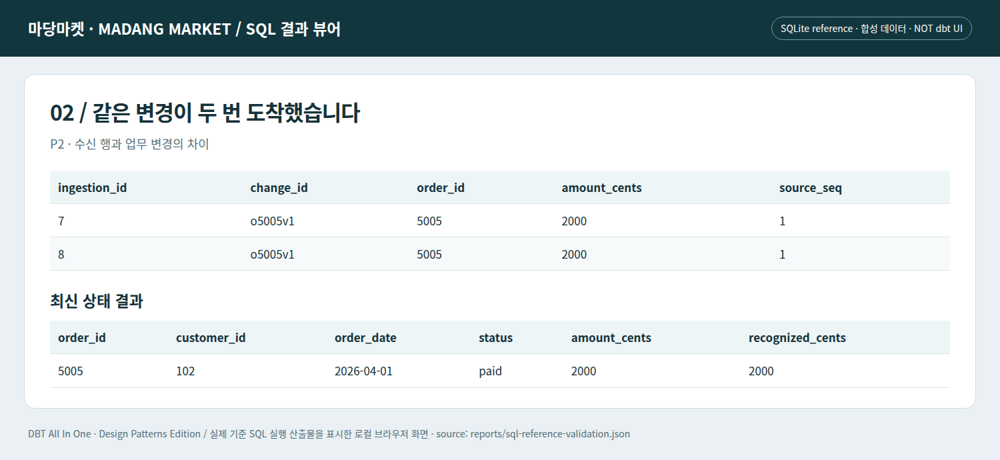

# J03 · 전달 중복과 업무 최신 상태를 두 단계로 분리하기

P2에서 주문 5005의 같은 변경이 두 번 들어온다. ‘행이 두 개니까 주문 두 건’으로 계산하면 지표가 잘못된다. 또한 P3에는 5003의 오래된 v1이 늦게 재전송된다. 수신 시각이 늦다는 이유로 최신 업무 상태를 과거로 되돌려서는 안 된다.

## 1단계: 전달 중복을 없앤다

`change_id`는 하나의 업무 변경을 식별하고 `ingestion_id`는 수신을 식별한다. 이 예제는 같은 change_id의 내용은 동일하다는 원천 계약을 가정한다. 같은 키인데 내용이 다르면 별도의 무결성 오류로 격리해야 하며, 단순히 마지막 수신을 고르는 것만으로 정합성이 보장되지 않는다.

```sql
-- 변경 이벤트 중복 제거: 재전송은 ingestion_id만 새로 생긴다.
with ranked as (
 select *, row_number() over (partition by change_id order by ingestion_id desc) as delivery_rank
 from {{ source('shop_raw', 'order_changes') }}
)
select change_id, order_id, customer_id, order_date, lower(trim(status)) as status,
       amount_cents, source_seq, op, ingestion_id, ingested_at
from ranked where delivery_rank = 1
```

## 2단계: 주문별 최신 상태를 만든다

업무 순서인 `source_seq`를 먼저 비교한다. 이 번호는 주문별로 순서를 표현한다고 가정하며, 서로 다른 주문 사이의 전역 순서로 해석하지 않는다. 최신 행을 고른 **다음** 삭제 표식을 판단한다. 삭제 행을 먼저 제거하면 직전 정상 행이 최신으로 남아 삭제된 주문이 부활한다.

```sql
-- 삭제를 먼저 거르면 과거 행이 되살아난다. 최신 행 선택 후 삭제를 적용한다.
with ranked as (
 select *, row_number() over (partition by order_id order by source_seq desc, ingestion_id desc) as version_rank
 from {{ ref('stg_order_changes') }}
)
select order_id, customer_id, order_date, status, amount_cents, source_seq
from ranked where version_rank = 1 and op <> 'D'
```
```bash
# 저장소 루트에서 실행 — Python 표준 라이브러리 / SQLite 기준 실행
python lab/run_stage.py --stage 2
```

완전한 해당 단계 소스와 직전 단계 대비 `changes.diff`는 `lab/checkpoints/`에 있다. dbt 실행 명령과 검증 경계는 [실습 안내](../lab/README.md)를 참고한다.


*실제 로컬 SQL 결과 뷰어의 Chromium 캡처. 합성 데이터이며 상용 dbt 화면이나 dbt 엔진 실행 증거가 아니다.*

스크린샷은 P2의 전달 중복을 보여주지만 체크포인트 02의 기본 입력은 P1이다. P2까지 포함한 결과는 `python lab/run_reference.py --phase 2`로 확인한다. 코드 단계와 데이터 단계를 독립적으로 바꾸는 훈련이다.

## 다음 변경을 예상한다

현재 상태에서 unique(order_id)가 통과하더라도 과거 이력이 보존되는 것은 아니다. 원천 변경 기록은 남겨 두고 현재 상태 투영을 별도로 만든다. 과거 질문은 J09에서 다룬다. staging에서 취소 주문을 버리지도 않는다. 취소는 잘못된 데이터가 아니라 정상적인 업무 상태이며 인정 매출 계산에서 제외할 대상이다.

---

[이전 장](02-first-query.md) · [다음 장](04-grain.md) · [전체 안내](../README.md)
