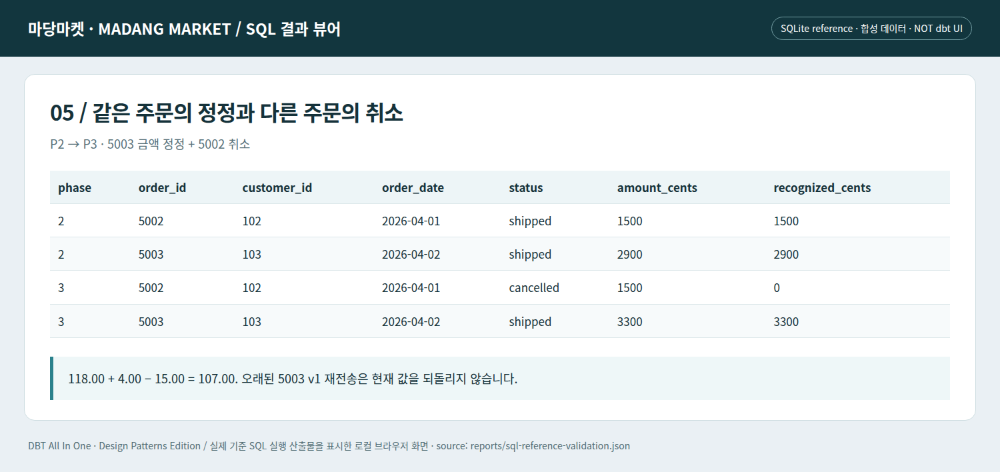
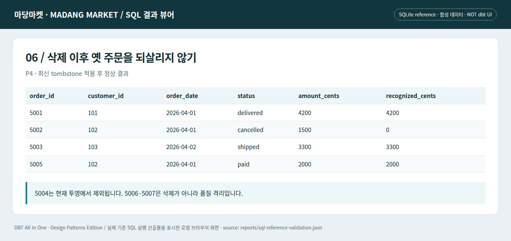

# J08 · 정정·취소·삭제를 같은 처리로 뭉개지 않기

P3에서 주문 5003은 29.00에서 33.00으로 정정된다. 주문 5002는 취소된다. P4에서는 5004의 삭제 표식이 도착한다. 세 사건은 모두 ‘변경’이지만 결과에 반영하는 방식은 다르다.

## P3의 매출을 설명한다

118.00에서 5003의 정정 차이 4.00을 더하고, 5002의 취소 금액 15.00을 빼면 107.00이다. 취소 주문은 현재 주문 집합에 남아 있지만 인정 금액이 0이다. 정정은 기존 주문의 최신 값을 교체한다.



*실제 로컬 SQL 결과 뷰어의 Chromium 캡처. 합성 데이터이며 상용 dbt 화면이나 dbt 엔진 실행 증거가 아니다.*

## P4의 삭제 표식

최신 상태가 D인 5004는 현재 주문에서 빠진다. 이전 12.00을 빼므로 인정 매출은 95.00이 된다. P4에는 고객이 아직 없는 주문 5006과 음수 금액의 5007도 도착하지만, 둘은 정상 결과에 들어가지 않는다.



*실제 로컬 SQL 결과 뷰어의 Chromium 캡처. 합성 데이터이며 상용 dbt 화면이나 dbt 엔진 실행 증거가 아니다.*
```bash
# 저장소 루트에서 실행 — Python 표준 라이브러리 / SQLite 기준 실행
python lab/run_stage.py --stage 6
```

완전한 해당 단계 소스와 직전 단계 대비 `changes.diff`는 `lab/checkpoints/`에 있다. dbt 실행 명령과 검증 경계는 [실습 안내](../lab/README.md)를 참고한다.

## 삭제와 취소를 구별하는 이유

취소는 업무 상태를 보존하면서 특정 지표에서 제외하는 일이다. 삭제는 현재 투영에서 레코드를 제거하는 정책이다. 원천 기록 보존과 개인정보 삭제는 또 다른 문제다. 하나의 D 표식으로 분석 제외·물리 삭제·모든 백업 삭제를 동일하게 처리했다고 말하지 않는다.

## 재처리 범위를 잘못 잡으면

5003의 최신 변경만 원천에 남기면 그 이전 상태를 재현하기 어렵다. 반대로 오래된 v1이 마지막으로 수신되었다고 현재 값을 29.00으로 되돌리면 업무 순서가 깨진다. 변경 식별자와 원천 버전, 수신 시각을 분리한 이유가 여기서 드러난다.

실습에서는 원천 파일과 코드 버전이 고정되어 있기 때문에 언제든 P1~P5를 다시 만들 수 있다. 운영에서는 원천 보존 범위·참조 데이터 버전·코드 해시를 묶어야 같은 재현성을 기대할 수 있다.

---

[이전 장](07-late-data.md) · [다음 장](09-history.md) · [전체 안내](../README.md)
