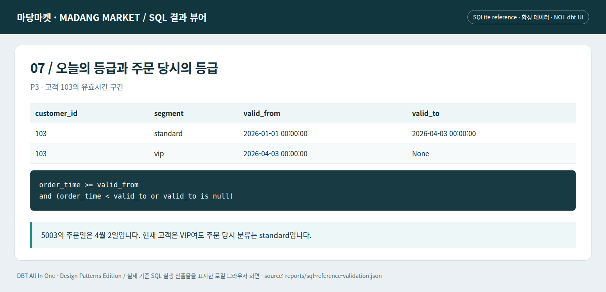

# J09 · 오늘의 고객과 주문 당시의 고객은 다르다

이 장은 P3로 돌아가 시간 축을 자세히 본다. 고객 103은 4월 3일부터 VIP다. 주문 5003의 날짜는 4월 2일이다. 오늘의 고객 차원을 단순 조인하면 과거 주문이 VIP 매출로 다시 분류된다. 그것이 원하는 분석인지부터 결정해야 한다.

## 유효시간 구간을 만든다

```sql
-- 이미 관측한 원천의 업무 유효시간으로 구간을 만든 교육용 SCD2. dbt snapshot 실행이 아니다.
select customer_id, segment, effective_from as valid_from,
       lead(effective_from) over (partition by customer_id order by effective_from, source_seq) as valid_to
from {{ source('shop_raw', 'customer_changes') }}
```

이 구현은 원천이 제공한 `effective_from`을 사용한다. dbt snapshot을 실행한 결과가 아니다. 동일 유효시점 충돌, 고객 삭제·재활성화, 같은 속성의 중복 변경을 모두 해결한 완전한 SCD 프레임워크도 아니다. 이 fixture는 충돌 없는 유효시점이라는 계약으로 구간과 시점 조인을 학습한다.

```sql
select f.*, d.segment as segment_at_order
from {{ ref('fct_orders') }} f
left join {{ ref('dim_customer_history') }} d
 on f.customer_id = d.customer_id
 and (f.order_date || ' 00:00:00') >= d.valid_from
 and ((f.order_date || ' 00:00:00') < d.valid_to or d.valid_to is null)
```


*실제 로컬 SQL 결과 뷰어의 Chromium 캡처. 합성 데이터이며 상용 dbt 화면이나 dbt 엔진 실행 증거가 아니다.*
```bash
# 저장소 루트에서 실행 — Python 표준 라이브러리 / SQLite 기준 실행
python lab/run_stage.py --stage 7
```

완전한 해당 단계 소스와 직전 단계 대비 `changes.diff`는 `lab/checkpoints/`에 있다. dbt 실행 명령과 검증 경계는 [실습 안내](../lab/README.md)를 참고한다.

## 경계에서 두 행을 만나지 않도록 한다

조건은 `valid_from <= t < valid_to`인 반열린 구간이다. 종료 시각에도 등호를 붙이면 다음 구간의 시작점과 겹쳐 주문 한 건이 두 차원 행에 연결될 수 있다. 현재 구간의 valid_to가 NULL이면 끝이 열려 있다고 해석한다.

주문 데이터가 날짜만 보유하므로 이 책은 자정 문자열로 비교한다. 실제 서비스에서 같은 날 등급이 바뀐다면 주문 timestamp와 시간대·유효시각의 정밀도가 필요하다. 날짜 예제의 편의를 실제 시간 모델의 정답으로 확장하지 않는다.

## snapshot과 CDC의 차이

snapshot은 관측한 상태 변화를 이력화한다. 두 snapshot 실행 사이에 변경이 여러 번 발생했다가 되돌아오면 그 모든 중간 사건이 보존된다고 보장할 수 없다. CDC 원천의 유효시간 이력과 관측시점 snapshot은 질문이 다르다. [S15](../references/README.md#s15)

더 어려운 ‘당시에 알고 있던 사실’과 ‘나중에 정정된 당시 사실’의 차이는 [P13의 이중 시간](../patterns/13-history-and-temporal.md)에서 다룬다. 고객의 현재 VIP와 주문 당시 standard를 동시에 맞게 제공할 수 있어야 한다.

---

[이전 장](08-correction-delete.md) · [다음 장](10-quarantine-repair.md) · [전체 안내](../README.md)
