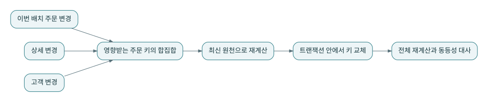
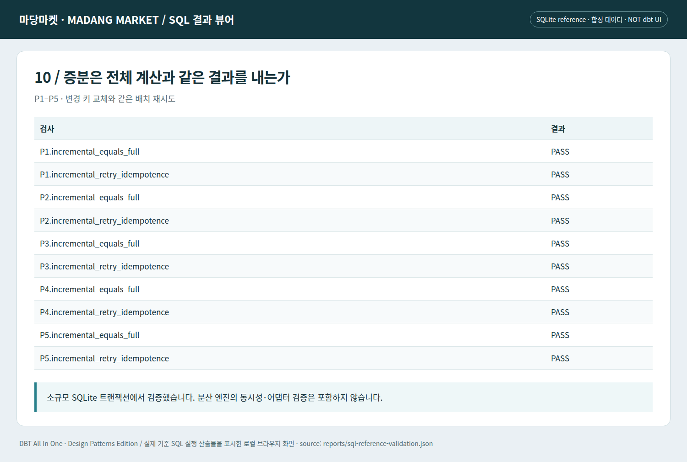

# J11 · 증분 최적화의 출발점은 전체 계산과의 동등성이다

전체를 다시 계산하는 모델은 이해하기 쉽지만 커지면 비용이 부담될 수 있다. 그렇다고 처음부터 증분 필터를 붙이면 정정·삭제·차원 변경이 누락될 수 있다. 기준 결과를 만든 뒤 **영향 키 탐색과 부분 갱신이 같은 결과를 내는지** 확인한다.



## 변경 주문만 찾으면 부족하다

영향 키는 이번 주문 변경의 주문 ID, 상세 변경의 주문 ID, 변경 고객을 참조하는 주문 ID의 합집합이다. P5의 5006이 마지막 항목의 반례다. 고객이 새로 도착했기 때문에 주문 변경이 없어도 품질 판단이 달라진다.

## 기준 구현의 범위를 정확히 이해한다

`run_reference.py`는 작은 SQLite에서 현재 staging·통합 모델을 재생성한 뒤 영향 키에 해당하는 주문 결과를 재평가하여 `incremental_orders`를 교체한다. 이후 완전 재계산의 fct_orders와 행 단위로 비교한다. 모든 upstream까지 증분화하거나 분산 트랜잭션을 구현한 것이 아니다. 이번 검사의 목적은 영향 키·삭제·재시도에 대한 결과 동등성이다.

```bash
python lab/run_reference.py --verify --output reports/sql-reference-validation.json
```

같은 배치를 두 번 적용해도 행이 늘지 않아야 한다. P4의 삭제된 5004는 이전 대상에서 제거되어야 하고, P5의 5006은 정상 대상에 들어와야 한다. 단순히 최종 합계가 같아도 주문별 값이 서로 바뀔 수 있으므로 정렬한 행 집합을 비교한다.

```bash
# 저장소 루트에서 실행 — Python 표준 라이브러리 / SQLite 기준 실행
python lab/run_stage.py --stage 9
```

완전한 해당 단계 소스와 직전 단계 대비 `changes.diff`는 `lab/checkpoints/`에 있다. dbt 실행 명령과 검증 경계는 [실습 안내](../lab/README.md)를 참고한다.


*실제 로컬 SQL 결과 뷰어의 Chromium 캡처. 합성 데이터이며 상용 dbt 화면이나 dbt 엔진 실행 증거가 아니다.*

## 실제 dbt 증분 전략으로 옮길 때

append, merge, delete+insert, insert_overwrite, microbatch는 데이터의 변경 방식과 어댑터 지원에 맞춰 선택한다. 지원 표는 실행 엔진과 어댑터 버전별로 확인해야 한다. [S14](../references/README.md#s14)

이 실습의 dbt 프로젝트는 table materialization을 유지한다. SQLite 부분 갱신 검사를 통과했다고 dbt의 MERGE가 실행되었다고 말하지 않는다. 특히 삭제 대상이 소스 결과에서 사라지는 경우, 일반적인 갱신·삽입만으로 기존 대상 행이 자동 삭제되지 않을 수 있다. 삭제 처리와 트랜잭션 경계를 별도로 검토한다.

## 성능 검토의 순서

정답을 고정하고, 실행 계획과 스캔량을 측정하고, 병목이 실제로 있는지 확인한 뒤 부분 재처리 범위를 줄인다. ‘증분이므로 N배 빠르다’는 수치는 이 책에 만들지 않았다. 파일 수·상태 크기·키 분포·동시 실행에 따라 결과가 달라진다.

---

[이전 장](10-quarantine-repair.md) · [다음 장](12-three-domains.md) · [전체 안내](../README.md)
