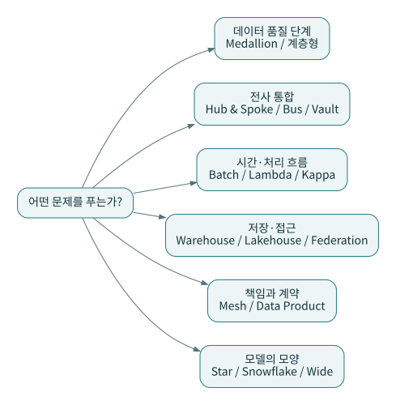

# J13 · 메달리온 말고 다른 설계를 선택해야 할 때

지금까지는 작은 배치형 상점으로 충분했다. 이번 장은 같은 마당마켓에 서로 다른 요구가 추가되었다고 가정해 설계를 갈라 본다. 모든 후보를 최종 구조에 집어넣지는 않는다.



## 여러 원천을 통합해야 한다

오프라인 POS, 온라인몰, CRM이 각각 다른 고객 키를 갖는다면 중앙 정합 코어를 두는 허브앤스포크를 비교한다. 업무별 마트를 점진적으로 납품하면서 공통 고객·상품·날짜를 맞추려면 Kimball 버스 아키텍처의 적합 차원이 중요해진다. 중앙 통합 코어와 차원형 마트는 결합할 수 있다. [P02](../patterns/02-hub-and-spoke.md), [P03](../patterns/03-kimball-bus.md)

## 운영 모니터의 지연을 줄여야 한다

일별 보고가 아니라 거의 즉시 이상을 발견해야 한다면 스트림 처리가 후보가 된다. 배치·저지연 경로를 함께 운영하는 람다와, 보존 로그를 동일 처리 로직으로 재생하는 카파를 비교한다. 두 경로의 경계, 재생 시간, 상태 유지 비용을 따로 본다. dbt 스케줄을 짧게 설정했다고 곧바로 카파 아키텍처가 되는 것은 아니다. [P04](../patterns/04-lambda.md), [P05](../patterns/05-kappa.md)

## 원천과 이력이 계속 바뀐다

원천 합병과 감사 요구가 커지면 Vault의 키·관계·속성 이력 분리나 Anchor Modeling의 속성별 시간 관리를 비교할 수 있다. 소비자의 쉬운 조회를 위해 별도 스타/와이드 마트를 제공하는 비용까지 고려한다. SQL 파일 개수가 늘었다는 사실만으로 확장성이 입증되지는 않는다. [P09](../patterns/09-data-vault.md), [P24](../patterns/24-anchor-modeling.md)

## 조직과 저장 계층의 문제가 생긴다

레이크하우스는 저장·테이블 관리·분석 접근의 구조를 다루고, 메시는 도메인 소유권과 제품 계약을 다룬다. 패브릭은 메타데이터·정책·접근의 통합을 지원하는 접근으로 설명한다. 이들은 동등한 크기의 상호 배타 선택지가 아니다. [P06](../patterns/06-lakehouse.md)~[P08](../patterns/08-data-fabric-and-federation.md)

## 별도 비교 실습

```bash
python lab/run_comparisons.py --output reports/model-comparisons.json
```

비교 실습은 같은 데이터에서 스타/정규화 코어/와이드/Vault 축소/Anchor 축소 모델을 만든다. 이는 구조와 결과를 비교하는 소규모 SQL 예시다. 인증된 Vault 구현, 완전한 Anchor 생성기, 실제 메시·람다·카파 인프라 배포가 아니다. 단순 합계 일치가 설계 우월성을 뜻하지 않는다는 것을 함께 확인한다.

**마당마켓의 기본 선택은 여전히 배치 + 품질 계층 + 팩트/차원 + 명시적인 계약이다.** 더 복잡한 후보는 요구가 바뀔 때 재검토한다. 결정 이유를 ADR에 남기는 편이 유명한 패턴을 모두 쓰는 것보다 실용적이다.

---

[이전 장](12-three-domains.md) · [다음 장](14-configuration.md) · [전체 안내](../README.md)
