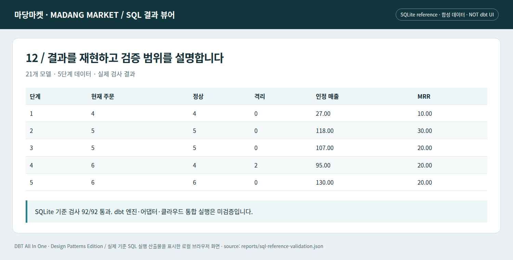

# J15 · 검증·발행·복구까지 포함한 최종 상점

모델 21개가 실행되는 것은 끝이 아니라 발행 후보가 만들어졌다는 뜻이다. 어떤 데이터 범위를 읽었고, 품질 검사를 통과했고, 소비자가 어느 버전을 읽는지 설명할 수 있어야 운영 가능한 데이터 제품에 가까워진다.


```bash
# 저장소 루트에서 실행 — Python 표준 라이브러리 / SQLite 기준 실행
python lab/run_stage.py --stage 11
```

완전한 해당 단계 소스와 직전 단계 대비 `changes.diff`는 `lab/checkpoints/`에 있다. dbt 실행 명령과 검증 경계는 [실습 안내](../lab/README.md)를 참고한다.


*실제 로컬 SQL 결과 뷰어의 Chromium 캡처. 합성 데이터이며 상용 dbt 화면이나 dbt 엔진 실행 증거가 아니다.*

## 후보를 만든 뒤 공개한다

새 결과를 후보 위치에 만들고, 계약·품질·대사를 수행한 후 읽기 포인터를 전환하는 blue-green식 발행을 검토할 수 있다. 모든 엔진이 동일한 원자적 rename/swap을 제공하는 것은 아니므로 실제 어댑터·카탈로그·소비 경로에서 시험한다. 이 책의 그림은 운영 전환 성공 로그가 아니다.

P4처럼 격리 데이터가 있으면, 교재 정책에서는 자동 공개를 보류한다. 기존 공개 버전이 더 오래되었더라도 신뢰 가능한 상태를 유지하는 선택이다. 신선도와 완전성 중 무엇을 우선할지는 업무에 따라 승인받아야 한다.

## 관측 지표도 나누어 저장한다

입력 도착률, SQL 실행 성공, 정상·격리 행 수, 지표 대사, 공개된 버전과 시각, 외부 전달 결과는 서로 다른 신호다. SQL 성공 로그 하나로 이 모두를 대체하지 않는다. 실패한 run_id와 재시도 attempt_id를 구분하고, 로그 기록 실패가 본 처리 성공을 숨기지 않도록 별도 경로를 둔다.

## 배포 전 검증 목록

이번 배포에 사용한 코드 해시, 원천 단계/배치 식별자, dbt·어댑터 버전, 프로필 이름, manifest와 run_results, 테스트 결과를 함께 보관한다. 실제 dbt를 실행한 환경에서만 dbt 산출물을 생성했다고 기록한다. 기준 SQL 결과 파일은 `sql-reference-validation.json`이며 manifest.json인 척 이름을 바꾸지 않는다.

## 되돌리기 전에 확인한다

코드를 되돌려도 데이터와 외부 부작용이 되돌아가는 것은 아니다. 이전 결과 버전, 재계산 가능 범위, 소비 캐시, 외부 전송의 멱등 키를 함께 검토한다. backfill은 날짜 범위를 지정한 재처리이며 무조건 전체 refresh와 같은 말이 아니다.

완전한 운영 체크리스트 예시는 [governance](../governance/README.md), 장애별 판단은 [P20](../patterns/20-observability-and-performance.md), CI와 상태 관리는 [P19](../patterns/19-ci-cd-and-migration.md)로 이어진다.

---

[이전 장](14-configuration.md) · [다음 장](16-workbook.md) · [전체 안내](../README.md)
