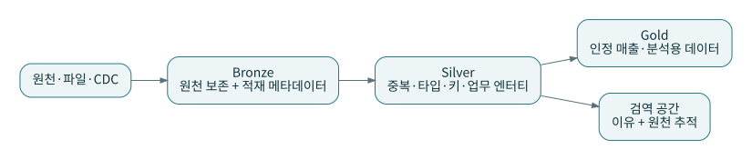
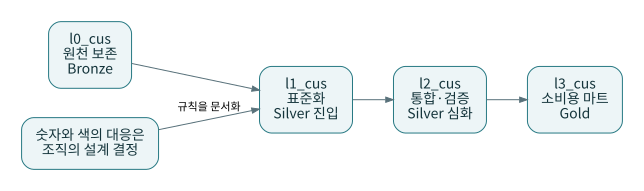

# P01 · 메달리온: 색깔이 아니라 품질과 책임을 나누는 방법

메달리온은 데이터를 단계적으로 정제하는 계층형 설계 패턴이다. Databricks 공식 문서는 Bronze, Silver, Gold를 설명한다. 여기서 이름을 확인할 수 있다는 사실과 누가 이 개념을 최초로 발명했는지는 다른 문제다. 이 책은 확인하지 못한 최초 기원이나 단일 발명자를 단정하지 않는다. 계층형 데이터 처리라는 생각 자체를 dbt가 새로 만든 것으로 설명하지도 않는다. [S01](../references/README.md#s01) [S27](../references/README.md#s27)

## 1. Bronze는 ‘버려도 되는 임시 공간’이 아니다

마당마켓에서는 들어온 주문 변경을 수정하지 않고 보존한다. `change_id`는 원천의 논리적 변경을 식별하고, `ingestion_id`는 전달된 행을 식별한다. 같은 변경이 두 번 전달될 수 있으므로 두 ID를 혼동하면 안 된다. `source_seq`는 주문별 업무 변경 순서를 나타낸다. 실제 CDC에서는 이를 원천 로그 위치·트랜잭션 식별자·행 순서 등으로 구체화해야 한다.

원본 보존은 재처리의 재료를 남기는 일이다. 테이블 이름 앞에 bronze를 붙이는 것만으로 보존성, 접근통제, 스냅샷 일관성, 백업이 생기지 않는다. 삭제 정책과 보존 기한도 별도로 필요하다. 특히 개인정보를 영원히 보존하라는 뜻이 아니다.

## 2. Silver 안에도 성격이 다른 작업이 있다

먼저 상태값 `SHIPPED`를 `shipped`로 통일하고, 같은 이벤트의 재전송을 한 건으로 만든다. 다음으로 업무 키별 최신 순서를 선택한다. 이때 삭제를 먼저 제외하면 삭제 이전의 주문이 최신 행처럼 되살아날 수 있다. 최신 상태 선택 후 삭제 여부를 적용한다.

그다음 주문과 고객, 주문상세를 결합하여 품질을 판단한다. 금액이 음수이거나 고객이 아직 도착하지 않았다면 정상 마트로 보내지 않고 `quarantine_orders`에 이유를 남긴다. 같은 Silver에 속하더라도 ‘원천별 표준화’와 ‘여러 원천의 정합성’은 책임이 다르다. 이를 한 SQL 파일에 몰아넣을 필요는 없다.

## 3. Gold는 무조건 집계 테이블인가?

이 책에서는 소비자가 안전하게 사용할 수 있도록 의미가 확정된 결과를 Gold로 취급한다. 따라서 일별 매출뿐 아니라 주문 grain의 `fct_orders`, 고객 차원, 공개용 상세 모델도 후보가 된다. Gold를 단지 행 수가 적어진 테이블이라고 정의하면 상세 분석용 제품의 자리를 설명하기 어렵다.

소비 가능하다는 말은 최신성, grain, 결측 처리, 취소 정책, 소유자가 설명되어 있다는 뜻으로 구체화한다. 기술적으로 쿼리할 수 있다는 사실과 업무적으로 믿을 수 있다는 사실은 다르다.

## 4. L0·L1·L2·L3와의 대응

| 이 교재의 논리 계층 | 기본 물리 이름 | 책임 | 메달리온과의 예시 대응 |
|---|---|---|---|
| L0 | `l0_cus` | 수신 기록, 원본, 재생 기준 | Bronze |
| L1 | `l1_cus` | 원천별 타입·상태·중복·최신화 | Silver의 앞부분 |
| L2 | `l2_cus` | 고객·상세 통합, 품질, 이력 구간 | Silver의 뒷부분 |
| L3 | `l3_cus` | 팩트·차원·지표·공개 모델 | Gold |

이 표는 **책의 설계 결정**이다. L0가 항상 Bronze이고 L3가 항상 Gold라는 국제 표준은 이 책에서 전제하지 않는다. 숫자 계층과 색 계층을 혼용하려면 매핑을 문서에 한 번 정의하고 코드에서 중앙 관리해야 한다. 개발 환경에서는 dbt 기본 동작에 따라 `book_dev_l1_cus` 같은 실제 이름이 생길 수 있다. 자세한 설명은 [P17](17-configuration-and-ownership.md)에 있다.

## 5. 계층을 늘릴 때 필요한 근거

새 계층을 만들기 전에 별도 보존 기한, 품질 책임, 접근권한, 재처리 방식, 소비 계약 중 무엇이 달라지는지 적는다. 아무것도 달라지지 않는다면 `select *`만 반복하는 계층일 수 있다. 반대로 보안 경계나 통합 책임이 확실히 다르면 색이 세 개라는 이유로 억지로 세 폴더에만 가둘 필요도 없다.

마당마켓은 학습을 위해 L1/L2를 나눴지만 모든 L1 모델을 반드시 물리 테이블로 만들라는 뜻은 아니다. 테이블·뷰·ephemeral의 선택은 실행 계획과 재사용, 복구 단위로 따로 결정한다.

## 6. 적용 결과와 확인

`python lab/run_reference.py --phase 4`를 실행하면 현재 주문 6개 가운데 4개는 정상, 2개는 격리된다. Bronze에 들어온 행이 Gold에서 사라졌다는 말로 끝내지 않는다. `현재 상태 = 허용 + 격리`라는 회계식으로 경로를 설명해야 한다. 원천의 과거 변경 행 수와 현재 업무 엔터티 수는 grain이 다르므로 직접 동일하다고 검사하면 안 된다.

**연습:** Gold에서 잘못된 고객 이름을 발견했다. Gold를 직접 수정하면 되는가?

**해설:** 먼저 원천·정제 규칙·키 매핑 중 어디에서 잘못되었는지 찾는다. 파생 결과만 고치면 다음 실행에 되돌아갈 수 있다. 긴급 보정이 필요하면 원천을 덮지 않는 명시적 보정 입력, 유효기간, 승인자, 제거 조건을 갖춘 별도 경로로 관리한다.
