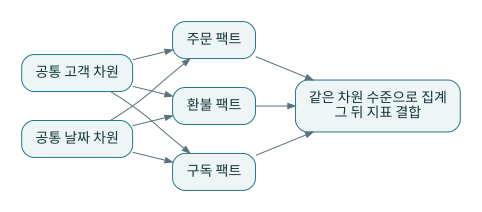

# P03 · Kimball 버스 아키텍처: 작게 납품하고 공통 차원으로 연결하기

버스 아키텍처는 핵심 업무 프로세스와 적합 차원(conformed dimensions)을 중심으로 전사 분석을 단계적으로 확장한다. 여기서 ‘버스’는 Kafka 같은 메시지 버스가 아니다. 여러 업무 팩트가 같은 의미의 차원을 사용하도록 설계하는 통합 방식이다. [S03](../references/README.md#s03)



## 1. 마당마켓의 버스 매트릭스

| 업무 프로세스 | 고객 | 상품 | 주문일 | 채널 | 구독 플랜 |
|---|---:|---:|---:|---:|---:|
| 주문 상세 | ● | ● | ● | ● | |
| 환불 상세 | ● | ● | ● | ● | |
| 웹 행동 | ● | 선택 | ● | ● | |
| 월간 구독 현황 | ● | | 월 기준 | | ● |

이 표를 먼저 작성하면 어떤 차원이 실제로 공유되는지 드러난다. 모든 팩트에 모든 차원을 억지로 붙이지 않는다. 비회원 웹 이벤트는 고객을 모를 수 있고, 월간 구독 현황의 시간 grain은 주문 상세와 다르다.

적합 차원은 컬럼 이름이 같다는 의미를 넘는다. 키의 범위, 코드 값의 의미, 이력 처리, 알려지지 않은 고객의 표현이 같아야 한다. 서로 다른 원천의 `customer_id`가 동명이인이면 공통 차원이 아니다.

## 2. 주문을 먼저 납품해도 전체 구조를 잃지 않는 방법

첫 번째 납품은 `fct_order_lines`, `dim_customers`, 상품·날짜 차원으로 시작한다. 다음 납품에서 환불 팩트를 만들 때 고객 키와 날짜 정의를 재사용한다. 이 과정에서 중앙의 완성된 거대 모델을 기다리는 대신 공유해야 하는 의미를 먼저 합의한다.

하지만 ‘업무별로 만들면 된다’는 말만 믿고 고객 차원을 팀마다 복제하면 독립 마트의 집합으로 남는다. 버스 매트릭스와 적합 차원의 관리 주체가 필요한 이유다.

## 3. 서로 다른 팩트를 직접 조인하지 않는다

고객 101에게 주문 상세가 3행이고 웹 이벤트가 2행 있다면 고객 키만으로 직접 조인한 결과는 6행이 될 수 있다. 주문 금액과 이벤트 수를 동시에 합산하면 서로를 증폭한다. 먼저 각각을 고객 grain으로 집계한 뒤 조인한다.

```sql
-- 설계 예제: 두 팩트의 grain을 맞춘 다음 결합한다.
with sales as (
  select customer_id, sum(recognized_cents) as sales_cents
  from fct_order_lines group by customer_id
), activity as (
  select customer_id, count(*) as event_count
  from stg_events group by customer_id
)
select s.customer_id, s.sales_cents, coalesce(a.event_count, 0) as event_count
from sales s left join activity a on s.customer_id = a.customer_id;
```

이 SQL은 개념 설명용 relation 이름을 사용한다. dbt 모델에서는 `ref()`로 의존성을 선언해야 한다. 실습에서는 `mart_customer_value`가 주문별 데이터를 고객 grain으로 집계하는 역할을 한다.

## 4. 허브앤스포크와 어떻게 비교하는가

허브앤스포크는 중앙 통합 코어를 통한 전달에 강조점이 있다. 버스 아키텍처는 업무 프로세스별 납품과 적합 차원을 통한 결합에 강조점이 있다. 현실의 프로젝트는 공통 고객 코어를 두면서 버스 매트릭스로 마트를 확장할 수 있다. 양자를 오직 하나만 택해야 하는 종교처럼 다루지 않는다.

## 5. 마당마켓의 선택

기본 실습에는 주문·이벤트·구독의 고객 ID 의미를 동일하게 정의했다. 그러나 `mart_current_mrr`와 주문 매출을 더하지 않는다. 월간 계약의 반복 매출 지표와 거래 상태 기반의 인정 매출은 서로 다른 측정이다. 공통 고객이 있다는 사실이 지표끼리 합산 가능하다는 뜻은 아니다.

**연습:** 월말 재고량을 일별 합계로 합쳐 한 달 재고량을 만든다면?

**해설:** 재고 잔액은 시간 방향으로 일반적인 가산 지표가 아니다. 월말 값, 일평균, 최대치 등 의도한 측정을 먼저 정한다. 차원 공유와 측정값의 가산성은 별개의 설계 축이다.
