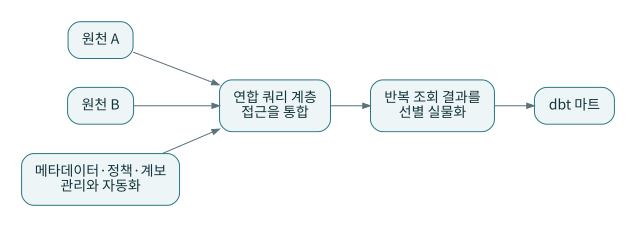

# P08 · 데이터 패브릭과 연합 쿼리: 복제하지 않고 연결하면 끝나는가

데이터 패브릭은 통합·메타데이터·정책·자동화를 함께 강조하는 아키텍처 관점으로 설명된다. 공급업체별 범위가 다를 수 있으므로 단일한 표준 구현처럼 취급하지 않는다. 여기서는 IBM의 설명을 개념 참고로 사용하고, Trino의 연합 접근과 구별한다. [S08](../references/README.md#s08) [S24](../references/README.md#s24)

## 1. 복사하지 않고 읽는다는 장점

마당마켓이 외부 CRM의 고객 데이터를 매일 복사하는 대신 쿼리 엔진을 통해 직접 읽는다고 가정한다. 빠른 탐색이나 일시적인 검증에는 편리할 수 있다. 원천마다 다른 접속 방식을 공통 SQL 진입점으로 묶는 것도 유용하다.

하지만 읽을 때마다 원천이 바뀌면 어제 보고서를 똑같이 다시 만들기 어렵다. 한 번의 쿼리 안에서도 여러 원천의 일관된 시점을 보장할 수 있는지 확인해야 한다. ‘데이터를 안 옮겼으니 모든 것이 실시간으로 정확하다’는 결론은 성립하지 않는다.

## 2. 세 개의 서로 다른 문제

첫째는 접근 문제다. 어느 엔진이 어느 카탈로그를 통해 데이터를 읽는가? 둘째는 의미 문제다. 각 원천의 고객 키가 같은가? 셋째는 관리 문제다. 누가 소유하고 민감도·계보·품질 상태를 어디에 기록하는가? 연합 SQL이 첫 번째를 도와도 두 번째와 세 번째는 별도의 작업이다.

패브릭을 설명하면서 쿼리 가상화만 그려 놓으면 관리 자동화와 정책의 영역이 빠진다. 반대로 메타데이터 카탈로그를 설치했다고 원천 간 정합성이 저절로 해결된다고 생각해도 안 된다.

## 3. 선택적으로 실물화한다

매번 같은 큰 조인을 수행한다면 결과를 내부 테이블에 만들어 재사용하는 편이 나을 수 있다. 원천 시스템 부하, 네트워크 전송, 신선도, 변경 주기를 보고 실물화 대상을 정한다. 실물화한 순간부터는 갱신·재처리·삭제 반영의 책임이 추가된다.

마당마켓의 `stg_customers_current`를 직접 원천에 연결할 때는 마지막 성공 적재 시점이 아니라 마지막 성공 조회 및 사용한 스냅샷을 기록해야 할 수 있다. 신선도의 의미가 달라진다는 점을 문서에 명시한다.

## 4. 실패가 퍼지는 경로

고객 원천의 짧은 중단이 매출 보고 쿼리 전체의 실패로 퍼질 수 있다. 외부 join을 위해 많은 데이터를 가져오면 원천 운영 업무에 부담을 줄 수 있다. 따라서 읽기 계정 권한, 요청 제한, 캐시·스냅샷 정책, 허용된 조인 범위를 검토한다.

실습의 로컬 테이블은 이런 네트워크·분산 실패를 검증하지 않는다. 개념도에 트리노를 표시하는 것과 실제 커넥터의 인증·pushdown·트랜잭션을 테스트하는 일은 다르다.

## 5. 선택 실습

**문제:** 원천 변경이 잦고 보고서 재현이 중요하다. 매번 원천을 직접 조회하는 구조를 그대로 써도 되는가?

**해설:** 원천이 재현 가능한 시점 조회를 지원하는지부터 확인한다. 그렇지 않다면 제한된 범위의 스냅샷 또는 변경 기록을 내부에 보관하는 선택을 검토한다. ‘복제 최소화’와 ‘재현 가능성’ 중 어떤 목표가 우선인지 명시해야 한다.

**문제:** 데이터 메시와 패브릭은 둘 중 하나인가?

**해설:** 이 책의 분류에서는 소유권과 플랫폼 관리 관점을 나눠 본다. 도메인 제품을 운영하면서 공통 메타데이터·접근 관리 기능을 사용할 수 있다. 이름의 조합보다 구체적인 책임과 기능이 중복되거나 빠지지 않는지 검토한다.
