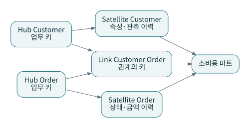

# P09 · Data Vault: 업무 키·관계·속성 이력을 분리하는 통합 모델

Data Vault 모델링을 처음 접할 때는 Hub, Link, Satellite의 역할을 구별하는 것이 출발점이다. Hub는 업무 키, Link는 관계, Satellite는 속성과 이력에 초점을 둔다. 패키지 문서의 모델 생성 예는 이 구조를 구현하는 방법의 하나다. 이 장이 Data Vault 2.0 방법론 전체를 대체하는 인증 교재는 아니다. [S10](../references/README.md#s10) [S11](../references/README.md#s11) [S26](../references/README.md#s26)



## 1. 마당마켓을 다른 방식으로 모델링해 본다

주문 5003의 상태가 바뀌어도 주문이라는 업무 키는 같다. 고객 103과 주문 5003의 관계, 상태와 금액의 변화는 서로 다른 종류의 사실이다. 이를 하나의 넓은 이력 테이블에 함께 저장할 수도 있지만, Vault 접근에서는 역할을 분리한다.

```text
hub_customer(customer_hk, customer_bk, load_dts, record_source)
hub_order(order_hk, order_bk, load_dts, record_source)
link_customer_order(link_hk, customer_hk, order_hk, load_dts, record_source)
sat_order_state(order_hk, load_dts, status, amount_cents, hashdiff, record_source)
```

여기의 예시는 설계 스케치다. `lab/dbt`의 실행 모델을 이 이름으로 모두 바꿨다는 뜻이 아니다. 실제 구현에서는 업무 키의 범위, 같은 시각의 여러 변경, 적재 순서, 소스별 위성 분리 등을 더 정해야 한다.

## 2. 해시 키는 마법의 동일인 판정이 아니다

`103`을 해시해도 온라인의 103과 매장의 103이 같은 사람인지 알 수 없다. 키가 원천별이면 원천 구분을 포함하거나 별도 통합 규칙이 필요하다. NULL, 빈 문자열, 대소문자, 구분자 충돌, 문자 인코딩을 표준화하지 않으면 같은 논리 키가 다른 값으로 계산될 수 있다.

해시 키와 속성 변경 감지용 hashdiff도 역할이 다르다. 전자는 식별, 후자는 비교를 위한 값이다. 개인정보를 해시한 사실만으로 익명화가 보장된다고 설명하지 않는다. 소규모 값 공간이나 결합 가능성을 고려해야 한다.

## 3. 적재 시각과 업무 유효시각

P3에서 고객 103의 VIP 전환 정보를 받았다고 하자. 실제 전환일과 시스템이 그 정보를 받은 날짜는 다를 수 있다. 적재 시각만 저장하면 ‘그 당시 우리가 알고 있던 상태’를 볼 수 있지만 ‘업무상 그 날짜에 유효했던 상태’를 정확히 재현하기 어려울 수 있다. 두 시간을 필요한 수준으로 구분한다.

마당마켓의 단순 이력 실습은 `effective_from`을 가지고 구간을 계산한다. 관측시각까지 이중 시간으로 관리하는 완전한 이력 저장소는 아니다. 설계 요구가 강화되면 [P13](13-history-and-temporal.md)의 이중 시간 질문으로 확장한다.

## 4. 언제 후보가 되는가

원천이 많고 변경 이력과 추적성이 중요하며 입력 변화에 대응하는 통합 구조가 필요할 때 검토할 수 있다. 단일 원천의 작은 대시보드라면 테이블 수와 조인 경로, 모델 생성·운영 규칙이 과해질 수 있다. 감사 요구가 있다고 해서 Vault만이 유일한 해법은 아니다.

원천 친화적인 보존·통합 모델을 만들었다면 소비용 마트는 따로 필요할 수 있다. 분석가에게 Hub와 Satellite를 직접 무제한 조인하게 하면 시점 선택과 중복 문제를 각자 해결해야 한다. 공통 소비 모델에서 이를 통제한다.

## 5. 메달리온과 결합하기

Bronze 원본 위에 Vault 형태의 Silver 통합을 두고 Gold에 팩트·차원을 만들 수 있다. 이 조합이 항상 유리하다는 뜻은 아니다. 같은 상점의 단순 단계별 SQL과 비교하여 추가 모델 수, 재생·감사 요구, 운영 자동화 정도를 평가한다.

**연습:** 위성 테이블에 5003의 상태 이력이 세 행 있다. 주문 건수는 세 건인가?

**해설:** 아니다. 상태 관측 grain과 주문 grain이 다르다. 현재 주문 수, 변경 횟수, 특정 시점의 주문 수를 각각 다른 쿼리로 정의해야 한다. 업무 키가 반복되는 이유부터 설명한다.
