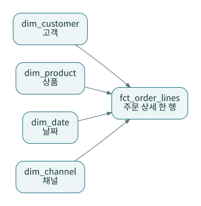
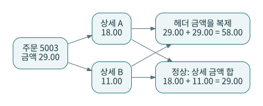
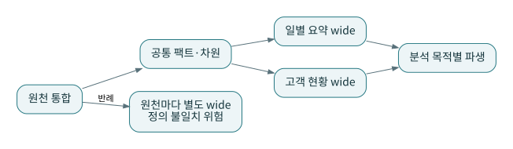

# P11 · 스타·스노플레이크·wide table: 읽기 편의와 의미 일관성의 균형

차원 모델에서는 측정값과 분석 문맥을 구분하고 grain을 먼저 정한다. 스타·스노플레이크·평탄한 소비 모델의 선택은 이 기본 조건을 바꾸지 않는다. 이 장은 구조의 형태보다 잘못된 합계가 생기는 경로에 집중한다. [S12](../references/README.md#s12)

## 1. 같은 데이터의 세 가지 표현

스타는 주문 상세 팩트 주변에 고객·상품·날짜 같은 차원을 둔다. 스노플레이크 형태에서는 상품→카테고리→부서처럼 일부 차원을 더 정규화할 수 있다. Wide table은 소비 목적에 필요한 속성을 한 결과에 넓게 붙여 제공한다. 마지막 형태가 항상 잘못되거나 항상 더 빠른 것은 아니다.

예를 들어 BI 도구가 매번 고객의 현재 등급을 필요로 하면 목적별 고객 요약 테이블이 편리할 수 있다. 반면 과거 주문 당시 등급까지 필요하다면 현재 속성을 그대로 펼치는 것만으로 해결되지 않는다. wide 모델에도 시점과 grain이 필요하다.

## 2. 실습으로 보는 fanout

P1의 주문 5003 헤더 금액은 29.00이고 상세는 두 행이다. 헤더 금액을 상세에 복제한 뒤 합산하면 58.00이 된다. 전체 주문 헤더 합계는 98.00인데 같은 잘못된 조인은 169.00을 만든다. 이 숫자는 `run_reference.py --verify`의 반례 검사로 확인한다.

이 문제는 DISTINCT를 무조건 붙여 해결하지 않는다. 서로 다른 두 주문의 금액이 같으면 `sum(distinct amount)`는 정상 금액까지 지울 수 있다. 주문 grain의 헤더 합계와 상세 grain의 행 금액 합계를 구분해야 한다.

## 3. Wide table을 안전하게 제공하는 방법

공통으로 검증한 팩트·차원에서 목적별 wide를 만든다. 원천별로 팀이 각자 직접 wide를 만들면 취소 제외 조건과 고객 매핑이 여러 군데로 퍼질 수 있다. 읽기 편한 최종 모델과 재사용 가능한 공통 정의는 함께 둘 수 있다.

`select *`로 하류에 모든 컬럼을 전달하면 민감정보가 우연히 공개되거나 상류 컬럼 추가가 소비 계약에 영향을 줄 수 있다. 공개 모델에서는 필요한 컬럼을 명시하고 설명을 남긴다. 내부의 빠른 탐색과 공개 인터페이스는 기준이 다르다.

## 4. 행 수와 열 수 외에 비교할 것

쿼리 패턴, 필터 선택도, 조인 키 분포, 차원 변경 빈도, 데이터 압축, 소비 도구의 기능을 함께 측정한다. 특정 구조가 항상 최적이라는 가정은 피한다. 동일한 입력·지표·조회 조건으로 결과 동등성을 확인한 다음 비용을 비교해야 한다.

## 5. 마당마켓의 선택

주문 한 건을 점검할 `fct_orders`와 상품 분석용 `fct_order_lines`를 둘 다 제공한다. `mart_customer_value`와 `mart_daily_sales`는 각각 고객·일 grain의 목적별 결과다. 소비자는 먼저 어느 grain이 필요한지 고른다. 책의 SQL 테스트는 주문 헤더와 정상 상세 합계를 대사한다.

**연습:** 고객을 포함하는 모든 데이터를 하나의 큰 테이블로 합치면 join 실수가 사라지는가?

**해설:** 조인 실수가 모델 생성 과정으로 이동할 뿐이다. 주문·웹 이벤트·구독을 고객 키만으로 합치면 grain이 폭발한다. 각각 공통 수준으로 집계하거나 별도 팩트로 제공해야 한다.
