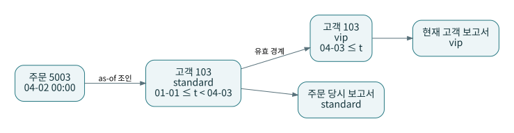
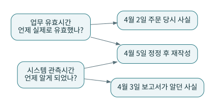

# P13 · SCD와 시점 설계: 현재, 그 당시, 그때 알고 있던 사실

속성이 바뀔 때 기존 값을 덮을지 이력 행을 추가할지는 소비자의 질문에 달려 있다. SCD Type 1·Type 2 등의 기법과 dbt snapshot의 역할을 구별한다. dbt snapshot은 관측한 변경을 기록하는 수단이며, 실행 사이에 지나간 모든 원천 변경을 자동 복원하는 CDC가 아니다. [S12](../references/README.md#s12) [S15](../references/README.md#s15)



## 1. 마당마켓의 고객 103

P1에서 고객 103은 standard다. P3에서 4월 3일부터 VIP였다는 정보가 들어온다. 주문 5003의 주문일은 4월 2일이다. 오늘의 고객 등급별 매출은 VIP로, 주문 당시 등급별 매출은 standard로 분류될 수 있다. 어느 쪽이 맞는지는 보고서의 질문으로 결정한다.

실습의 `int_customer_history`는 `lead(effective_from)`으로 종료 경계를 만든다. `valid_from <= t < valid_to`라는 반열린 구간을 사용하므로 경계 시각이 양쪽 행에 동시에 걸리지 않는다. 종료 경계가 NULL이면 이후 구간으로 해석한다.

## 2. 실제 동봉 조인

```sql
-- fct_orders_asof_segment.sql의 핵심 조건
on f.customer_id = d.customer_id
and (f.order_date || ' 00:00:00') >= d.valid_from
and ((f.order_date || ' 00:00:00') < d.valid_to or d.valid_to is null)
```

여기서는 주문일만 있으므로 자정으로 해석한다. 하루 중 등급 변경이 중요하면 주문 timestamp가 필요하다. 모든 시간이 같은 표준 표기와 시간대라고 가정한 교육용 데이터이므로 운영에서는 timestamp 타입과 시간대 변환을 명시한다.

같은 고객에게 유효 구간이 겹치면 하나의 주문이 여러 차원 행에 매칭되어 금액이 증폭할 수 있다. 동봉 테스트는 이력 구간 겹침을 검사한다. 구간 공백이 허용되는지와 시작 전 주문 처리도 별도로 정해야 한다.

## 3. 유효시간과 관측시간



4월 5일에 ‘4월 3일부터 VIP’라는 정보를 받았다면 업무 유효일은 4월 3일이고 시스템이 알게 된 날은 4월 5일이다. 4월 4일 당시 발행했던 보고서를 그대로 재현하려면 유효시간만으로 부족할 수 있다. 어떤 시점의 지식을 사용하는지도 저장해야 한다.

이중 시간 모델은 저장·조인·수정 규칙이 복잡해지므로 필요한 보고서부터 정의한다. 현재값만 필요한 간단한 분석에 모든 시간을 무조건 추가할 필요는 없다. 반대로 감사·재발행의 요구를 나중에 알게 되면 보관하지 않은 관측 사실을 복원하기 어려울 수 있다.

## 4. 삭제와 정정

업무 취소, 원천 행 삭제, 개인정보 삭제, 데이터 오류 정정은 다르다. 취소 주문은 존재하되 인정 매출이 0일 수 있고, tombstone은 현재 투영에서 제거할 수 있으며, 개인정보 삭제는 이력과 복제 범위까지 별도 처리해야 할 수 있다. 이들을 모두 `is_deleted` 하나로 뭉뚱그리지 않는다.

## 5. 검증 포인트

고객 103의 현재 segment는 VIP여도 P3 이후 `fct_orders_asof_segment`의 5003은 standard여야 한다. 이 결과를 기준 실행기가 검사한다. 단, 소급 정정과 이중 시간 저장까지 검증한 것은 아니다. 그 요구는 본 장의 설계 확장 과제로 남긴다.

**연습:** 어제 snapshot을 시작했다. 작년 모든 고객 등급을 알 수 있는가?

**해설:** 원천에 과거 이력이 없었다면 일반적으로 알 수 없다. 기능을 켠 시점 이전의 사실을 자동 생성할 수는 없다. 원천 이력, 백업, 과거 추출본 같은 근거의 범위를 명시해야 한다.
