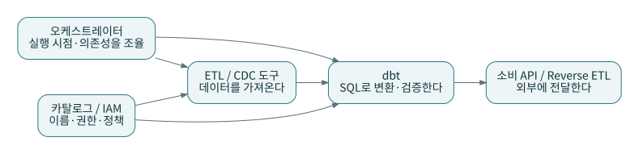

# P14 · CDC·Outbox·이벤트 소싱·CQRS: 비슷해 보이는 변경 패턴 구별하기

CDC는 저장된 데이터의 변경 전달, outbox는 업무 트랜잭션과 발행할 이벤트의 기록을 함께 다루는 구현 패턴, 이벤트 소싱은 상태 변화를 이벤트로 표현하는 접근, CQRS는 읽기·쓰기 모델의 책임 분리다. 각각의 목적을 확인해야 한다. [S21](../references/README.md#s21) [S22](../references/README.md#s22) [S23](../references/README.md#s23)

## 1. 주문 상태가 바뀌었다는 사실을 어떻게 알리는가

운영 DB에서 주문 5003을 shipped로 바꾸고 메시지도 발행하려고 한다. DB 변경은 성공했지만 메시지 전송이 실패하면 두 세계가 어긋난다. outbox 접근에서는 발행할 기록을 원천의 업무 트랜잭션 안에서 저장하고 별도 전달자가 읽도록 구성할 수 있다. 전달 중복은 소비 측에서도 처리해야 한다.

CDC가 읽는 것은 데이터베이스 변경 표현이다. 이벤트 소싱의 업무 이벤트는 ‘OrderShipped’처럼 의도를 표현할 수 있다. 둘은 결합 가능하지만 의미가 같다고 가정하면 안 된다. 상태 컬럼의 단순 UPDATE만으로 업무 이벤트의 모든 맥락을 복원할 수 있는지 검토한다.

## 2. 원천 순서와 수신 순서

P3에는 오래된 `o5003v1`이 다시 전달된다. 수신 시간이 가장 최신이라는 이유로 이 행을 현재 주문으로 선택하면 shipped 33.00이 placed 29.00으로 되돌아간다. 동봉 실습은 같은 change_id의 중복 전달을 제거한 뒤 주문별 `source_seq`로 최신 상태를 선택한다.

실제 CDC에서는 업데이트 전·후 이미지의 형태, 삭제 시 payload, 키 변경, 스냅샷과 증분 로그의 연결, 트랜잭션 내부 순서를 확인해야 한다. 단순한 CSV의 `source_seq`가 모든 DB 커넥터의 실제 동작을 대신하지 않는다.

## 3. 삭제는 필터의 순서까지 중요하다

`WHERE op <> 'D'`로 삭제 행을 먼저 버린 뒤 최신 순위를 매기면 이전 행이 살아남을 수 있다. 최신 순위를 결정한 결과가 삭제인지 판정해야 한다. 원본 기록에 삭제가 있고 현재 상태에는 없다는 차이를 의도된 것으로 설명한다.

P4에서 5004는 현재 투영에서 빠진다. 이 예제는 tombstone의 최신 상태 의미만 검증한다. 실제 개인정보 제거 정책이나 원천 물리 삭제를 실행하는 코드가 아니다.

## 4. CQRS와 분석 마트

읽기 전용 주문 현황 모델을 별도로 제공하면 운영 쓰기 모델과 다른 형태로 최적화할 수 있다. 그렇다고 모든 분석 마트가 완전한 CQRS 시스템이라는 것은 아니다. 업무 명령 처리, 일관성, 오류 복구까지 포함하는 적용 범위를 먼저 정한다.

마당마켓의 dbt 모델은 분석용 읽기 결과다. 주문 승인이나 결제를 수행하지 않는다. BI용 일별 마트를 구매 API의 최신 재고 확인에 바로 사용하지 않는다. 허용 지연이 전혀 다르기 때문이다.

## 5. 도구의 역할 지도

외부 전달에는 별도 멱등 키를 둔다. dbt 후크에서 HTTP 요청을 한 번 실행했다고 외부 시스템까지 exactly-once가 된 것은 아니다. 계산 결과를 outbox 형태의 전송 대기 테이블로 만들고 별도 전송자가 상태를 관리하는 설계도 검토할 수 있다. 이때 원천 outbox와 분석 시스템의 전달 outbox는 위치와 보장 범위가 다르다.

**연습:** 주문 테이블에 `updated_at`만 있으면 모든 삭제와 중간 상태를 수집할 수 있는가?

**해설:** 삭제된 행은 조회에 나타나지 않을 수 있고, 두 번의 수집 사이 중간 변경은 최종값으로 덮일 수 있다. 필요한 이력 수준에 맞춰 변경 로그·삭제 마커·정기 대사 같은 수단을 설계한다.
