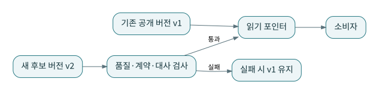

# P19 · CI/CD·Blue–Green·Strangler: 계산 성공에서 안전한 교체까지

상태 기반 선택과 defer는 변경 검증 비용을 줄이는 도구이지만 기준 artifact와 참조 환경을 정확히 관리해야 한다. 기존 시스템을 부분적으로 새 시스템으로 옮기는 Strangler 접근도 이행 설계의 한 후보다. [S18](../references/README.md#s18) [S31](../references/README.md#s31) [S35](../references/README.md#s35)

## 1. 기준선은 움직이지 않도록 저장한다

현재 작업이 만드는 `target/manifest.json`을 동시에 이전 상태 기준으로 사용하면 비교 대상이 덮일 수 있다. 배포된 버전의 artifact는 별도 읽기 전용 경로에 보관하고 코드 SHA, 의존성 버전, 입력 범위를 기록한다.

`state:modified+`처럼 하류를 포함하는 선택은 출발점이다. 변경되지 않았지만 새 환경에 없는 상류 relation, 운영과 다른 seed 값, 외부 source 변경, 환경 변수가 만든 물리 위치 차이를 추가로 검토한다. 선택이 짧다고 검증이 완전한 것은 아니다.

## 2. 후보 테이블을 먼저 검증한다

기존 공개 버전 v1을 유지한 채 후보 v2를 계산한다. 키·행 수·금액·시간대·소비 계약을 비교한 뒤 공개 포인터를 전환한다. 실패하면 v1을 유지한다. 실제 원자적 전환 방법은 DB와 커넥터가 지원하는 뷰 교체·rename·스냅샷 등에서 검증해야 한다.

이 예제에서 P4는 정상 행 계산 자체는 가능하지만 격리 2건이 있다. 운영 정책이 완전성 우선이라면 이 결과를 공개하지 않고 이전 버전을 유지한다. ‘dbt build 성공’과 ‘데이터 제품 발행 승인’을 구별하는 실제 이유다.

## 3. 기존 시스템과 병행 대사

처음부터 모든 모델을 바꾸는 대신 주문 도메인부터 새 모델로 계산한다. 일정 기간 기존 결과와 비교하되, 합계가 다른 이유를 컬럼 정의·시점·중복·취소 정책으로 분류한다. 기존 결과가 언제나 정답이라고 가정하지 않는다. 둘이 같은 버그를 갖고 같은 숫자를 내는 경우도 가능하다.

마당마켓의 기준선은 사람이 미리 정한 단계별 기대값이다. 운영 이행에서는 독립 검증 쿼리와 업무 담당자의 정의 승인이 필요할 수 있다. 성능 검증과 의미 검증도 분리한다.

## 4. 롤백의 한계

코드를 이전 버전으로 돌리는 것과 이미 변경된 데이터·외부 전송을 되돌리는 것은 다르다. 새 컬럼을 삭제하거나 과거 테이블을 drop한 뒤에는 코드만 롤백해도 복구되지 않을 수 있다. 호환 기간, 이전 결과 보존, 소비자 전환 상태, 재처리 입력을 함께 준비한다.

외부 CRM에 보낸 고객 점수를 되돌리려면 전송 버전과 보상 작업이 필요할 수 있다. SQL 트랜잭션 밖의 부작용을 배포 성공 여부 하나로 처리하지 않는다.

## 5. 최소 배포 기록

`governance/release-checklist.md`는 코드 식별자, 입력 배치, 변환 설정, 품질 결과, 발행 대상, 승인자, 복구 경로를 기록하는 양식이다. 기본값을 실제 승인 사실로 채우지 않는다. 미실행 항목은 미실행으로 남긴다.

**연습:** CI에서 defer로 운영 상류를 읽으면 안전한가?

**해설:** 읽기 권한과 민감정보 접근, 운영의 시점, 개발 모델의 기대 스키마를 검토해야 한다. 운영을 읽는 비용과 정책도 있다. defer는 환경 격리와 보안 정책을 자동으로 충족시키는 기능이 아니다.
