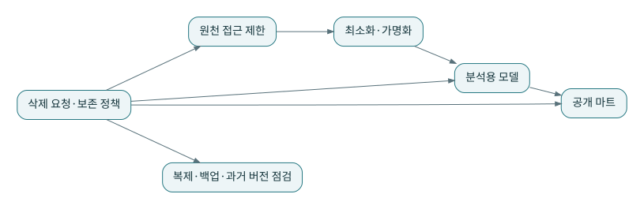

# P21 · 보안과 외부 제공: 모델의 끝이 데이터 책임의 끝은 아니다

이 장은 제품·법률별 준수 인증을 제공하지 않는다. 교육용 설계에서 접근 최소화, 식별정보 분리, 공개 계약, 외부 전달의 재시도 경계를 어떻게 질문해야 하는지 다룬다. 실제 보안·법적 판단은 해당 조직의 정책과 전문가 검토를 거쳐야 한다.

## 1. 원천 전체를 모든 모델에 전달하지 않는다

분석에 고객번호와 구분값만 필요하다면 이름·전화번호·주소를 모든 계층에 복제할 이유가 없다. 원천 접근 계정, 정제 계정, 소비 계정의 권한을 분리한다. 공개 마트에는 허용된 컬럼을 명시한다.

익명처럼 보이는 키도 다른 데이터와 결합하면 식별될 수 있다. 단순 해시가 항상 익명화를 뜻한다고 가르치지 않는다. 원천 키와 분석 키의 매핑은 목적과 접근권한에 맞게 관리한다. 이 교재 데이터에는 실제 고객 개인정보를 사용하지 않는다.

## 2. 보존과 복구의 긴장

원본을 오래 보존하면 재현에 유리할 수 있지만 모든 데이터를 무기한 보존해야 한다는 결론은 아니다. 원본·정제·마트·캐시·백업·외부 전달 각각에 보존 목적과 책임을 적는다. 만료·삭제와 재처리가 충돌할 수 있으므로 어느 시점까지 어떤 결과를 재현할 수 있는지도 명시한다.

과거 테이블이나 스냅샷에 개인정보가 남아 있는데 현재 마트에서만 지웠다면 제거 범위가 불완전할 수 있다. 반대로 업무상 익명 집계와 원천 식별정보의 보존 조건이 다를 수 있으므로 데이터 유형을 구분해 검토한다.

## 3. Reverse ETL과 분석 결과의 제공

마당마켓이 고객 점수를 CRM으로 보내는 경우를 생각한다. 계산 모델은 점수와 산출 버전을 만들고, 전송자는 `(customer_id, score_version)` 같은 멱등 키로 대상에 전달할 수 있다. 실패 시 동일 버전을 다시 보내도 중복 효과가 생기지 않는지 대상 API의 계약을 확인한다.

대상 응답을 받지 못했다고 반드시 쓰기가 실패한 것은 아니다. 응답이 유실되었을 수 있다. 무조건 새 요청 ID로 보내면 중복 적용될 수 있으므로 수신 확인·조회·재시도 상태를 설계해야 한다.

## 4. 한 지표를 여러 소비자가 사용한다

BI 화면, API, CSV 내보내기에서 같은 지표를 제공하려면 지표 버전, 통화 단위, 시점과 품질 상태가 함께 움직여야 한다. MRR과 주문 인정 매출처럼 서로 다른 측정을 임의로 더하지 않는다. 낮은 지연이 필요한 운영 의사결정과 일별 분석도 분리한다.

노출 대상 모델의 의미와 사용처를 문서화하면 변경 시 실제 소비자를 확인할 수 있다. 소유자가 없는 CSV 파일은 시간이 지나며 또 다른 원천처럼 취급될 수 있으므로 만료와 재생성 경로를 명시한다.

## 5. 상점의 공개 계약 예

공개 매출은 `order_date`, `recognized_cents`, `metric_version`, `published_batch`, `quality_state`로 표현한다고 가정한다. 현재 실행 모델은 앞의 두 데이터 컬럼을 계산하며 나머지 발행 메타데이터는 운영 설계 과제다. 구현하지 않은 컬럼을 실제 출력처럼 설명하지 않는다.

**연습:** 로그를 자세히 남기기 위해 실패한 원천 행 전체를 기록해도 되는가?

**해설:** 진단에 필요한 최소 정보와 보안 정책을 먼저 확인한다. 원천 추적용 식별자·오류 코드만으로 충분할 수 있고, 민감 payload는 별도 제한 공간이 필요할 수 있다. 로그 접근권한과 보존기간도 데이터 정책에 포함한다.
