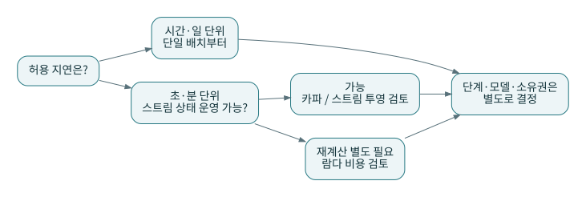
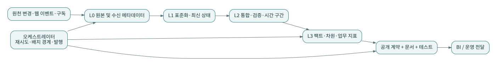

# P22 · 패턴 선택 사례: 같은 도구, 서로 다른 정답

이 장의 판단은 교재의 가정에서 도출한 설계 예시다. 특정 아키텍처가 언제나 더 싸거나 빠르다는 벤치마크 결과가 아니다. 상황마다 데이터량보다 지연, 정정, 조직 책임, 재현 요구를 먼저 적는다.

## 사례 A. 직원 두 명의 온라인 상점

원천 하나, 매일 오전 보고, 하루 지연 허용, 과거 주문 정정 가능이라는 조건이다. 단일 배치와 원본 보존, staging–intermediate–mart를 시작점으로 선택한다. 데이터 품질 경계를 메달리온 용어로 설명할 수 있지만 색 이름을 쓰는 것이 필수는 아니다.

카파를 보류하는 이유는 스트림이 나빠서가 아니라 낮은 지연 요구가 없고 로그·상태 운영 비용이 추가되기 때문이다. Data Vault도 과거 원천이 많고 감사 요구가 커질 때 다시 검토한다. 지금은 업무 키·정정 시각·원본 보존을 준비하는 것이 더 직접적이다.

## 사례 B. 여러 사업부와 고객 통합

온라인·매장·구독의 고객 키가 다르고 전사 고객 수가 핵심 보고라고 가정한다. 중앙 식별 코어와 허브앤스포크를 검토한다. 마트의 단계적 납품에는 버스 매트릭스를 함께 사용한다. 통합 코어와 업무별 차원 모델은 결합 가능하다.

실패 위험은 중앙팀 병목이다. 공통 의미와 사업부 고유 지표의 경계를 분리하고 변경 승인과 호환 기간을 정한다. 고객 ID 숫자만 같으면 같은 사람이라는 가정은 하지 않는다.

## 사례 C. 짧은 지연의 웹 운영 모니터

분 단위 이상 반응이 늦으면 운영 가치가 떨어진다고 가정한다. 스트림 처리와 카파식 재생을 후보에 올린다. 장기간 과거 재계산과 빠른 잠정값의 별도 경로가 필요하고 두 경로를 운영할 수 있다면 람다도 비교한다.

분 단위 조건은 이 사례의 가정이지 특정 도구의 성능 보장값이 아니다. 실제로 필요한 응답 시간, 늦은 이벤트 비율, 재생 시간, 상태 크기를 측정해야 한다. dbt를 메시지 소비자나 온라인 결제 엔진으로 잘못 배치하지 않는다.

## 사례 D. 합병으로 원천이 계속 늘어나는 기업

다양한 원천의 키·관계·이력을 보존해야 한다면 Vault 중심 통합을 검토할 수 있다. 다만 팀의 자동화 능력과 소비용 모델 생성 비용이 필요하다. Silver 통합을 Vault로 두고 Gold를 스타 모델로 제공하는 조합을 비교한다.

채택 여부를 원천 개수 하나로 결정하지 않는다. 이력 추적성, 업무 키 안정성, 변경 주기, 데이터 품질 보정 방식이 더 중요할 수 있다. 단순한 현황 보고를 위해 복잡한 구조를 선택하면 운영 부담만 늘 수 있다.

## 사례 E. 독립적인 도메인 팀이 빠르게 변경한다

고객·주문·구독팀이 독립 배포와 명확한 제품 책임을 갖는다면 메시 원칙을 검토한다. 공통 플랫폼은 배포·권한·관측의 반복 작업을 줄이고 도메인은 업무 의미를 책임진다. 모든 팀에 각각의 데이터 인프라를 복제하라는 뜻은 아니다.

메타데이터·정책·연합 접근을 도와주는 패브릭 성격의 도구를 함께 사용할 수 있다. 조직 구조와 기술 관리 기능을 같은 선택지로 놓고 억지로 하나만 고르지 않는다.

## 마당마켓의 최종 선택

기본 상점은 단일 배치를 유지한다. 메달리온식 품질 경계와 dbt 계층형 DAG를 결합하고, 주문·상세 팩트와 고객 이력 차원을 제공한다. 변경 키 재계산과 전체 결과 동등성을 검증하고, 격리 상태를 발행 판단에 연결한다. 중앙 설정과 단일 쓰기 소유자, 후보 결과 검증 후 공개라는 운영 원칙을 더한다.

람다·카파·Vault·메시는 배제한 것이 아니라 요구가 바뀔 때 꺼내 볼 대안으로 남긴다. 설계의 성숙함은 사용한 패턴 수가 아니라 필요한 문제를 설명하고 실패했을 때 복구할 수 있는 정도로 평가한다.
